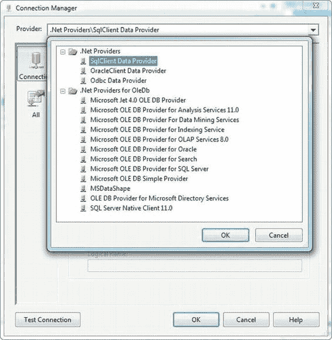

# 第 12 章 数据画像与清洗

*图 12-1. 包控制流中的数据画像任务*

`数据画像任务`需要一个指向你希望创建或覆盖的 XML 文件的`文件连接管理器`。我们将`文件连接管理器`配置为指向名为`C:\SampleData\ProfileOutput.xml`的文件，如图 12-2 所示。

*图 12-2. 配置文件连接管理器指向 XML 输出文件*
`数据画像任务`的一个局限是它仅限于可以通过`ADO.NET 连接管理器`检索的数据。`数据画像任务`需要连接到 SQL Server 并使用`SqlClient 数据提供程序`，如图 12-3 所示的`ADO.NET 连接管理器编辑器`。

[www.it-ebooks.info](http://www.it-ebooks.info/)

