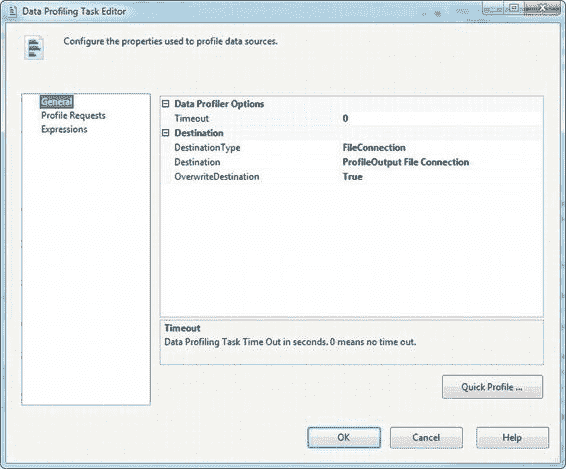
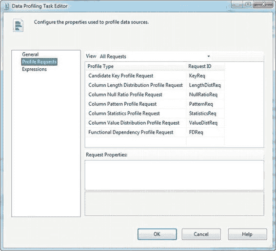
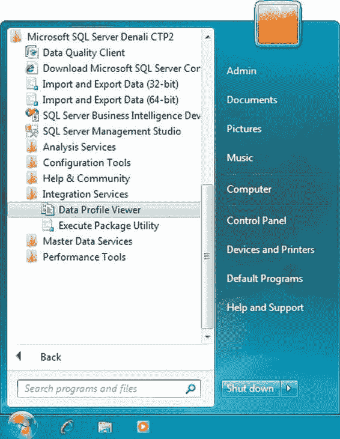
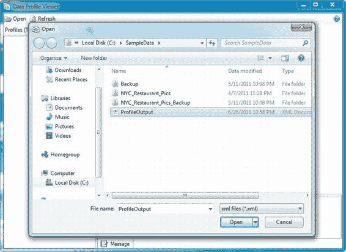
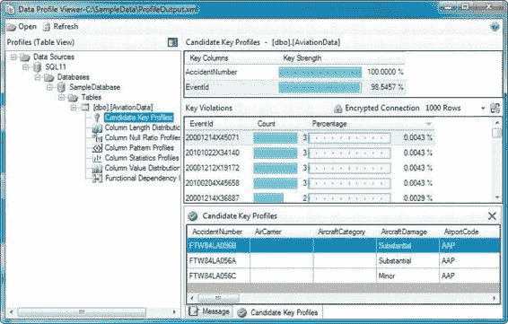
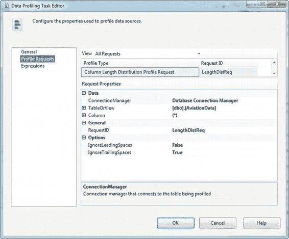
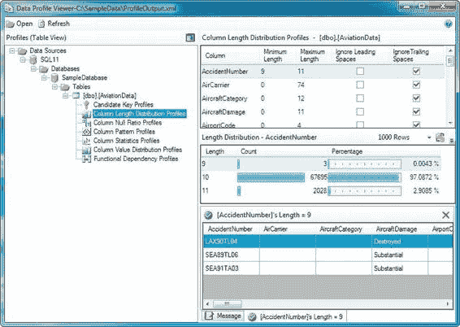
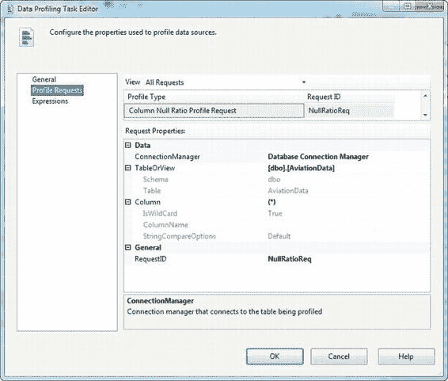
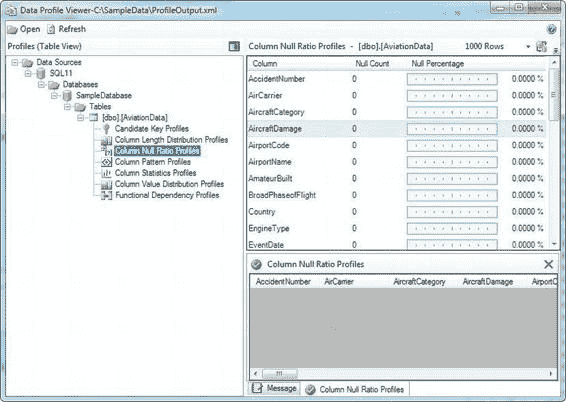

# 数据剖析与清洗

### 数据剖析任务编辑器

数据剖析任务编辑器的"常规"页面用于选择目标选项，包括目标类型、目标连接管理器、目标已存在时是否应覆盖，以及源超时（以秒为单位）。图 12-4 展示了该编辑器的常规页面。

在"分析请求"页面上，您可以选择和配置分析请求，每个请求代表要执行的特定分析类型以及要收集的关于源数据的一组统计信息。图 12-5 展示了可选择的多种分析请求类型。表 12-1 描述了您可以选择的分析请求。后续章节将介绍如何配置单个数据分析请求。

#### 表 12-1. 数据分析请求类型

| 分析请求 | 描述 |
| :--- | :--- |
| 列长度分布分析 | 返回所选列中字符串值的不同长度。这有助于快速识别对于包含它们的列来说过长或过短的字符串数据。 |
| 列空值比率分析 | 返回所选列中空值的百分比。这有助于识别诸如大量意外缺失数据值等问题。 |
| 列模式分析 | 返回一组与所选列中一定百分比的值相匹配的正则表达式。此分析有助于识别字符串数据格式问题。 |
| 列统计信息分析 | 返回所选列的最小值、最大值、平均值和标准差等统计数据。 |
| 列值分布分析 | 返回所选列中的所有不同值以及这些值出现的百分比。 |
| 候选键分析 | 尝试确定一个列或一组列是否为所选表的候选键。 |
| 函数依赖关系分析 | 尝试确定一个列中的值与另一个列（或一组列）中的值之间的依赖关系。例如，给定的机场代码应始终与给定的州相关联；机场代码在函数上依赖于州。 |
| 值包含分析 | 计算两个列或两组列之间值的并集或重叠部分。这对于确定是否可以在两个表的列之间建立外键关系非常有用。 |

### 数据分析概况查看器

数据剖析任务生成 XML 输出文件后，您可以使用名为 `数据分析概况查看器` 的工具查看结果，该工具位于 Windows 开始菜单的 SQL Server Integration Services 文件夹中。图 12-6 显示了开始菜单中的数据分析概况查看器。

启动 `数据分析概况查看器` 后，您可以点击打开按钮并选择文件，来打开数据剖析任务生成的 XML 文件，如图 12-7 所示。

在 `数据分析概况查看器` 中打开数据剖析任务输出文件后，您将在窗口左侧看到您选择的所有分析请求的列表。点击其中一个分析请求会在窗口右侧显示详细信息。您可以点击右侧的详细信息行以显示更多细节。在图 12-8 中，我们选择了候选键分析请求，并深入查看了 `EventId` 列的详细信息。

**提示：** 后续章节将查看分析请求的结果。

#### 列长度分布分析

`列长度分布分析` 报告您所选列中字符串值的不同长度，以及每个长度在表中所占的行百分比。例如，美国邮政编码必须为五到十个字符长（ZIP+4，包括连字符）；对于这些数据值来说，任何其他字符串长度都可能被视为无效。分析数据时，您可能会发现某些邮政编码的长度是错误的。选择列长度分布分析请求后，可以按照图 12-9 所示进行配置。

对于列长度分布分析请求，您需要配置源连接管理器，并选择希望分析的表和列。选择通配符 (`*`) 作为列表示您希望使用表中的所有列（非字符串列将被忽略）。您还可以选择忽略数据中的前导或尾随空格。

**注意：** 每个分析请求都会分配一个唯一的 `RequestID`。您可以根据需要重命名 `RequestID`。

运行数据剖析任务后，列长度分布分析请求会生成一个字符串值列的列表。选择其中一个列会显示该列中字符串数据长度的分布情况。点击"长度分布"列表中的某个长度值会显示详细信息，列出符合该长度的值。

在图 12-10 中，我们选择了 `AccidentNumber` 列，该列包含三种长度的数据：9 个字符、10 个字符和 11 个字符。然后我们深入查看了 9 个字符的值，以查看包含这些值的行。查看列长度分布后，我们可以看到 `AccidentNumber` 列通常包含 10 个字符长度的值。9 个字符和 11 个字符值的较小百分比可能表示源数据存在数据质量问题。

#### 列空值比率分析

`列空值比率分析` 帮助您识别包含比预期更多（或更少）空值的列。如果您预计某个列的空值非常少，但却发现了大量的空值，则可能表明存在数据质量问题（或者可能需要更改对数据的假设）。列空值比率分析配置简单。与列长度分布分析请求类似，您必须选择一个 `ADO.NET 连接管理器`、一个表或视图以及您希望分析的列。与列长度比率分析请求类似，列空值比率请求允许您选择 (`*`) 来分析所有列。在图 12-11 中，我们选择分析 `AviationData` 表中的所有列。

可以在 `数据分析概况查看器` 中查看结果。在我们的示例中，我们关注了 `AircraftDamage` 列，该列不包含空值，如图 12-12 所示。

