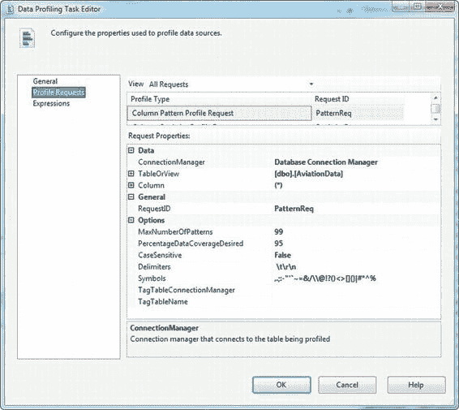
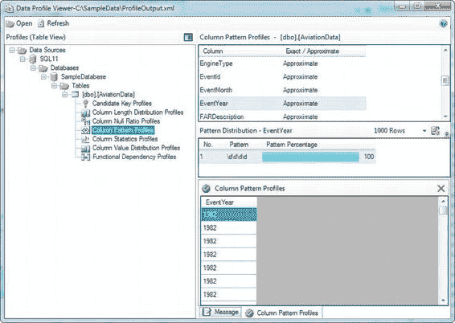
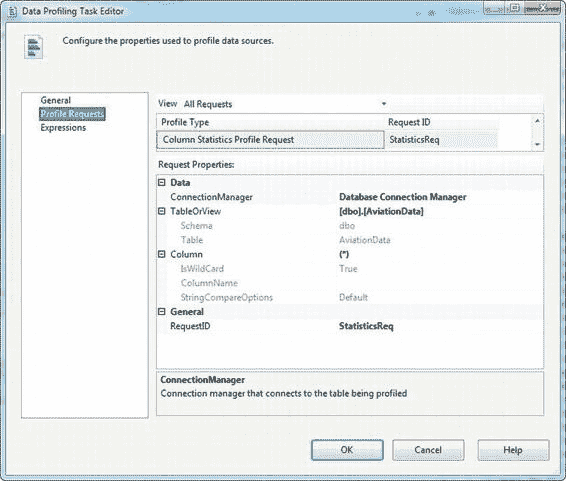
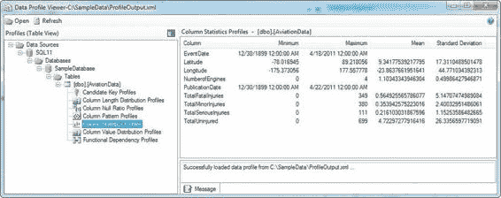
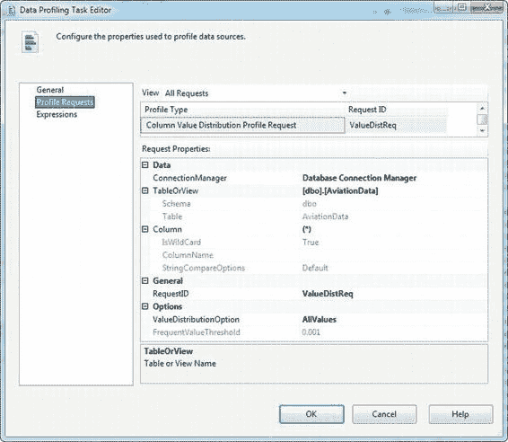
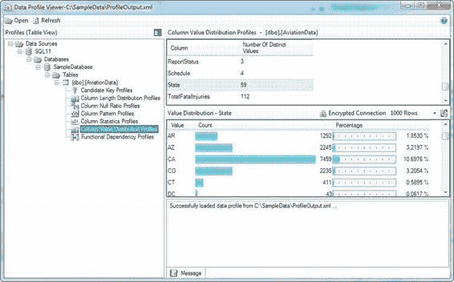

# 第 12 章 —— 数据剖析与清洗

#### 列模式配置文件

*列模式配置文件* 在识别字符串数据中的模式时非常有用，例如识别那些不符合给定国家/地区格式标准的邮政编码。此配置文件会返回与你的字符串数据匹配的正则表达式模式，让你能够轻松识别不符合预期模式的字符串数据。例如，一个美国的五位邮政编码应该符合如下的正则表达式模式：

```
\d{5}
```

它代表一个恰好由五个数字组成的字符串。任何不符合此模式的五位美国邮政编码都是无效的。

**注意：** 关于正则表达式及其语法的详细讨论超出了本书的范围。不过，MSDN 在 http://bit.ly/dotnetregex 对 .NET Framework 正则表达式有非常详细的介绍。

[www.it-ebooks.info](http://www.it-ebooks.info/)

与其他配置文件请求类似，列模式配置文件请求需要指定一个 ADO.NET 连接管理器、一个表或视图以及一个源列。此外，列模式配置文件请求比我们目前介绍的其他配置文件请求拥有更多可用选项。以下选项允许你细化列模式配置文件请求：

`MaxNumberOfPatterns`: 你希望数据剖析任务计算的最大模式数量。默认为 10，最大值为 99。

`PercentageDataCoverageDesired`: 计算模式时要采样的行百分比。默认为 95。

`CaseSensitive`: 一个标志，指示生成的模式是否区分大小写。默认为 False。

在计算匹配字符串数据的模式的过程中，数据剖析任务会对字符串进行分词（将它们分解为单个的“单词”或子字符串）。有两个选项用于控制此分词行为：

`Delimiters`: 这是一个字符列表，在分词时被视为分隔符。默认情况下，分隔符是空格、制表符 (`\t`)、回车符 (`\r`) 和换行符 (`\n`)。

`Symbols`: 分词时要保留的符号列表。默认情况下，此列表包括以下字符：`,.;:-"'`~=&/\@!?()<>[]{}|#*^%`。

列模式配置文件请求还允许你对词元进行标记或分组。标签存储在数据库表中，该表具有名为 `Tag` 和 `Term` 的两个字符数据列。`Tag` 列保存词元组的名称，`Term` 列保存属于该组的各个词元。出于性能原因，建议如果你使用此选项，使用 10 个或更少的标签，并且每个标签不超过 100 个词元。以下选项控制标记行为：

`TagTableConnectionManager`: 一个使用 `SqlClient` 提供程序连接到 SQL Server 数据库的 ADO.NET 连接管理器。

`TagTableName`: 保存标签和词元的表的名称。必须有两个名为 `Tag` 和 `Term` 的列。

图 12-13 展示了我们如何为示例配置列模式配置文件请求。

[www.it-ebooks.info](http://www.it-ebooks.info/)



*图 12-13. 配置列模式配置文件请求*

列模式配置文件的结果如图 12-14 所示。我们关注了 `EventYear` 列，发现所有数据都匹配模式 `\d\d\d\d`，这是预期的连续四个数字字符的模式。由于此列中的所有字符串值都匹配有效模式，我们进一步确认了这些值很可能是有效的。

[www.it-ebooks.info](http://www.it-ebooks.info/)



*图 12-14. 查看列模式配置文件结果*

#### 列统计配置文件

*列统计配置文件* 有助于快速评估超出给定列正常范围（或*容差*）的数据。例如，你可能会发现你的列包含未来的出生日期。你也可以利用提供的基本统计信息来判断你的数据是否符合统计正态分布。

配置列统计配置文件请求与前面描述的配置文件请求类似。你需要选择一个连接管理器、表或视图以及一个源列。和之前一样，你可以使用 `(*)` 来分析所有列。我们将列统计配置文件请求配置为使用 `AviationData` 表，如图 12-15 所示。

[www.it-ebooks.info](http://www.it-ebooks.info/)



*图 12-15. 配置列统计配置文件请求*

列统计配置文件将分析包含日期/时间和数值数据的列，例如 `DATETIME`、`INT`、`FLOAT` 和 `DECIMAL` 列。对于日期/时间数据，配置文件计算最小值和最大值；对于数值数据，它计算最小值、最大值、平均值（均值）和标准偏差。我们样本列统计配置文件的结果如图 12-16 所示。

[www.it-ebooks.info](http://www.it-ebooks.info/)



*图 12-16. 查看列统计配置文件请求的结果*

#### 列值分布配置文件

*列值分布配置文件* 报告列中的所有不同值以及表中每个值所占的行百分比。你可以利用此信息来评估不同值的出现频率是否符合预期。例如，你可能会发现某个列的默认值出现的次数远超你的预期。

列值分布配置文件请求有多个选项需要配置。常见选项如下：你需要配置一个 ADO.NET 连接管理器，选择源表或视图，并选择要分析的列。你还需要选择一个 `ValueDistributionOption`: `FrequentValues`（默认）会将结果限制为满足或超过给定阈值的值，而 `AllValues` 则无论出现次数多少都会报告所有结果。`FrequentValueThreshold` 选项是一个数值——当选择 `FrequentValues` 选项时，它用于限制返回结果的最小阈值。图 12-17 展示了我们如何通过使用 `AllValues` 选项来配置列值分布配置文件请求。

[www.it-ebooks.info](http://www.it-ebooks.info/)



*图 12-17. 配置列值分布配置文件请求*

对 `AviationData` 表各列进行分析的结果如图 12-18 所示。显示的列是 `State` 列，并列出了出现次数和出现百分比。

[www.it-ebooks.info](http://www.it-ebooks.info/)



*图 12-18. State 列的列值分布配置文件结果*

#### 候选键配置文件

*候选键配置文件* 分析一个或多个列，以确定某一列（或列集）成为表的良好键或近似键的可能性。当你试图识别*业务键*（唯一标识业务事务或对象的属性）时，候选键配置文件是一个非常有用的工具。

**注意：** *候选键* 是一个或一组列，可用于唯一标识表中的行。虽然一个表可以有多个候选键，但你通常会将其中之一标识为*主键*。

与其他配置文件请求一样，你必须使用 ADO.NET 连接管理器配置候选键配置文件请求...（内容截断，已保留原文所有可见信息）


