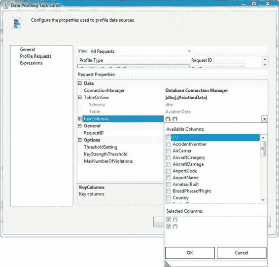
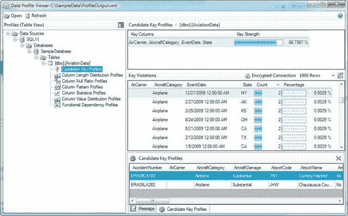
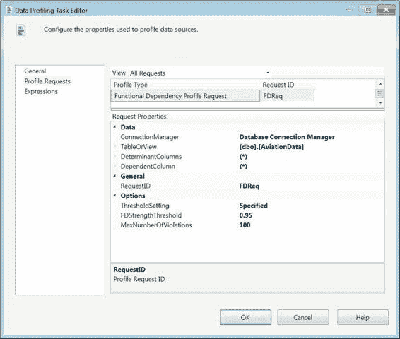
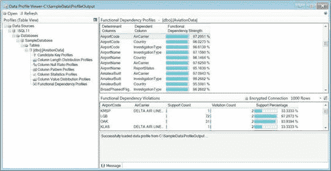
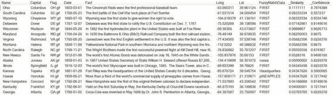

# 第 12 章：数据配置与清理

### 连接管理器与关键列选择

连接管理器、源表或视图以及列。与其他配置请求（通常您只选择单个列或使用通配符（`*`）选择所有列）不同，此配置请求允许您选择多个列。这是合理的，因为一个给定的候选键可以由多列组成，并且您可能希望测试几组列排列组合，以评估其作为候选键的可行性。

选择`KeyColumns`的下拉菜单如图 12-19 所示。您可以通过多种组合选择一列或多列，例如：

-   **单个命名列**：如果选择单个列，将测试其作为候选键的有用性。
-   **多个命名列**：如果选择多个命名列，将作为一个复合候选键一起测试它们的可用性。例如，如果您选择`AirCarrier`、`AircraftCategory`、`EventDate`和`State`列，数据配置任务将测试所有这些列作为一个单一候选键的可用性。
-   **单个通配符**：如果您选择通配符（`*`）作为列，数据配置任务将配置表中的每一列，分别测试每列作为候选键的可用性。
-   **单个通配符和命名列**：如果您选择通配符（`*`）和一个或多个命名列，数据配置任务将测试命名列与表中其他列的组合作为候选键的可行性。例如，您可以在配置请求中选择`AirportCode`和（`*`），这种情况下，数据配置任务将测试`AirportCode`列与表中其他每一列的组合。
-   **多个通配符**：如果您选择多个通配符（`*`）列，数据配置任务将测试指定数量的列排列组合作为候选键的可用性。例如，如果您选择两个通配符，该任务将配置表中所有两列的组合以检查唯一性。



*图 12-19. 数据配置任务编辑器*

### 候选键配置文件输出

图 12-20 展示了候选键配置文件的输出。建议的关键列`AirCarrier`、`AircraftCategory`、`EventDate`和`State`的强度约为 87%唯一。输出甚至更进一步，显示了每个违反键规则的重复行以及违规计数。



*图 12-20. 候选键的容忍度*

### 函数依赖配置文件

**函数依赖配置文件**允许您使用配置任务来发现表中的依赖关系。

依赖关系测试用于查看指定列中的值如何决定依赖列的值。使用（`*`）作为`DeterminantColumns`属性，允许我们将每一列作为`DependentColumns`属性所允许的所有组合的决定因素进行测试。`DependentColumn`属性中的（`*`）值允许我们测试表中每一列组合作为依赖于指定决定因素的关系。对两个属性都使用（`*`）符号，将使每一列与所有列的每一组合进行对比，以生成依赖关系报告。`0.95`阈值表示只有 95%或更高的关系才能定义有用的数据依赖关系，如图 12-21 所示。



*图 12-21. 函数依赖配置文件请求*

图 12-22 展示了函数依赖配置文件请求的结果。报告向您显示了每个测试的整体强度以及各种违规情况。报告下方的选项卡显示了用于配置依赖关系的各个数据元素及其强度。



*图 12-22. 函数依赖配置文件输出*

### 模糊查找

向任何数据集添加新数据的风险之一是可能有不干净或不符合规则的数据进入系统。这通常表现为违反字符列域规则——例如，在美国邮政编码列中输入了字母字符。SSIS 提供了两种数据流转换来清理数据不一致性：`FuzzyLookup`和`FuzzyGrouping`。它们都采用基于令牌的方法来确定传入数据与参考数据之间的匹配。成功匹配后，您可以用新的符合规则的数据替换旧数据。

### 模糊查找

**模糊查找**返回与传入数据流匹配的参考数据的近似结果。这与`Lookup`转换形成对比，后者返回精确匹配。使用`FuzzyLookup`的优点之一是它能够返回包含查找表中存储的字符串的数据。在此情况下，查找表代表干净的数据。`FuzzyLookup`任务可用于仅允许通过可接受匹配的数据。

在本例中，我们使用`dbo.State`表作为数据源。我们设置了一个查找列表，以筛选出与该列表中任何成员匹配的州。清单 12-1 展示了表结构和查找列表。

*清单 12-1. 表结构和模糊查找元素*

```sql
CREATE TABLE dbo.StateFuzzyMatch
(
    FuzzyMatchData NVARCHAR(50) NOT NULL
);
GO

INSERT INTO dbo.StateFuzzyMatch
    (FuzzyMatchData)
SELECT N'Headquarters'
UNION ALL
SELECT N'pINEAPPLES'
UNION ALL
SELECT N'russia'
UNION ALL
SELECT N'FIRST';
GO

CREATE TABLE dbo.StateFuzzyLookup
(
    Name nvarchar(50) NULL,
    Capital nvarchar(50) NULL,
    Flag nvarchar(10) NULL,
    Date date NULL,
    Fact nvarchar(500) NULL,
    Long float NULL,
    Lat float NULL,
    FuzzyMatchData nvarchar(50) NULL,
    _Similarity real NULL,
    _Confidence real NULL
);
GO
```

`dbo.StateFuzzyMatch`表包含我们将在`State`数据中搜索的所有关键词。我们插入了一些需要在`dbo.State`数据的`Fact`属性中查找的关键词。我们将把`FuzzyLookup`操作的成功匹配结果存储在`dbo.StateFuzzyLookup`中。该表包含额外的列，其中包括模糊匹配的详细信息，例如：
-   `FuzzyMatchData`是查找表中与传入数据匹配的元素。
-   `_Similarity`表示传入数据与查找元素之间的相似度水平。此值可用于调整`FuzzyLookup`组件上的相似度阈值，以消除不希望的匹配。对于模糊匹配中处理的每个单独列，此别名可以修改。
-   `_Confidence`表示匹配的置信度。SSIS 的先前版本会考虑最佳相似度和给定数据行的正面匹配数量来计算此值。



执行`FuzzyLookup`并将数据限制为仅成功匹配的行，将得到如图 12-23 所示的数据。清单 12-2 展示了将检索正面匹配及其操作统计信息的查询。如查询结果所示，在此数据集中，相似度与置信度之间并不一定存在直接相关性。

*清单 12-2. 用于模糊查找数据的 SELECT 查询*

```sql
SELECT Name,
       Capital,
       Flag,
       Date,
       Fact,
       Long,
       Lat,
       FuzzyMatchData,
       _Similarity,
       _Confidence
FROM dbo.StateFuzzyLookup
ORDER BY _Similarity DESC,
         _Confidence;
```

*图 12-23. 模糊查找匹配结果*


在查看了输出结果和 SQL Server 表的设置后，让我们回到实现模糊查找所需的 SSIS 包开发工作。模糊查找是一个`数据流`任务组件，需要数据流来进行匹配。我们使用的`OLE DB`源包含清单 12-3 中的查询，用于提取我们所拥有的、构成美利坚合众国的所有州的数据。

**清单 12-3. 州数据**

```sql
SELECT DISTINCT s.Name,
    s.Capital,
    s.Flag,
    s.Date,
    s.Fact,
    s.Long,
    s.Lat
FROM dbo.State s;
```

在开发之初，我们的需求是筛选出 `Fact` 字段包含某些非常特定词项的州。我们将这些词项加载到了 `dbo.StateFuzzyMatch` 表中。与可以使用查询来创建查找列表的`查找`组件不同，模糊查找必须指向一个表才能执行其匹配操作。该组件会在表上创建索引以加速匹配操作。图 12-24 展示了我们为模糊查找使用的选项。我们选择不保存索引，而是允许组件在每次执行时重新生成新索引。该次执行所使用的索引不会被保存。对于静态表，建议保存索引。

**图 12-24. FZL_MatchFact—引用表配置**

**注意：** 如果您选择保存索引但之后需要移除它，存储过程 `sp_FuzzyLookupTableMaintenanceUnInstall` 允许您删除该索引。它将接受在模糊查找中指定的索引名作为其参数。

为组件指定表后，您可以选择查找匹配的列映射，如图 12-25 所示。如果您需要在多个列上执行匹配，可以在此处进行。编辑器会绘制连线，以便轻松识别输入列和查找列之间的映射关系。在我们的示例中，匹配是在一个列上执行的，但就像`查找`组件一样，模糊查找组件可以使用多个列作为其匹配条件。

**图 12-25. FZL_MatchFact—列**

如图 12-26 所示的`创建关系编辑器`允许您为查找中涉及的每个映射指定条件。要打开此编辑器，您必须在列映射区域的背景处右键单击并选择`编辑映射`。此编辑器中的关键字段是`映射类型`、`比较标志`和`最低相似度`。`映射类型`的选项是`模糊`和`精确`。

选择`精确`等同于对模糊查找强制实施`查找`组件的限制。它将强制将`最低相似度`更改为 1，即 100% 匹配。`比较标志`在匹配执行方式方面提供了灵活性。在我们的示例中，我们只关心忽略数据字符的大小写。`最低相似度`为每个关系的匹配成功设置阈值。`相似度输出别名`允许您存储每个关系的相似度信息。在我们的示例中，我们只存储查找的整体相似度。因为是单列匹配，所以相似度与关系相似度一致。就像`查找`组件一样，查找列可以添加到管道中并发送到目标。如果您需要将查找列添加到管道中，编辑器允许您为其指定别名。

**图 12-26. FZL_MatchFactCreate 关系**

模糊查找编辑器的`高级`选项卡（如图 12-27 所示）允许您为每次匹配定义分隔符和整体相似度阈值。允许您定义最大匹配数的选项会为每次成功匹配复制数据行。对于此示例，我们仅使用空格作为词项的分隔符。默认情况下，会将几个标点字符定义为分隔符。

**图 12-27. FZL_MatchFact—高级**

整个`数据流`任务如图 12-28 所示。模糊查找组件有一条警告消息，因为 `Fact` 列和 `FuzzyMatchData` 列的大小不匹配。我们添加了`条件性拆分`组件，以便只有匹配数据的行才能传递到表中。`FuzzyMatch` 输出使用 `!ISNULL(FuzzyMatchData)` 作为拆分条件。

**图 12-28. DFT_FuzzyLookupSample**

