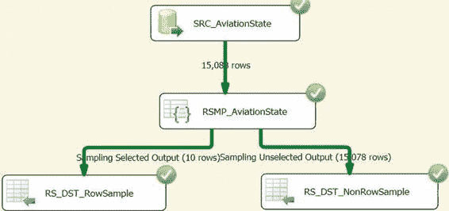
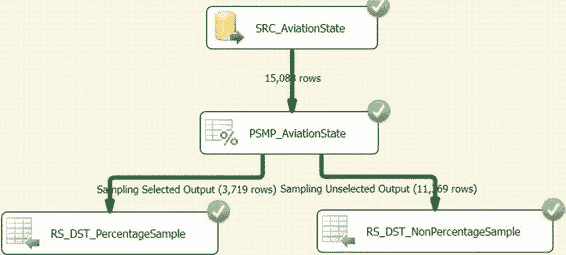

# 数据概览与清洗

#### 数据查看器

数据查看器用于在运行时显示数据。当数据流经两个组件之间的连接器时，数据会按缓冲区逐块显示。有多种选项可控制数据的显示方式，其中最常用的是网格视图。网格以表格形式展示数据，并支持将数据复制到剪贴板供后续使用。在 Visual Studio 的调试模式下，网格会显示在一个单独的窗口中。图 12-33 展示了模糊查找组件之后的数据查看器。

*图 12-33\. 模糊查找输出的数据查看器*

窗口的名称有助于识别其在包中的位置。在本例中，数据查看器在模糊查找组件之后启用，因此窗口的派生命名为 DFT_DataViewer 上的模糊查找输出数据查看器。该窗口还包含一个绿色箭头按钮，用于通知 Visual Studio 继续执行包，并允许数据行通过连接器。“分离”按钮将保留窗口并允许包继续执行。“复制数据”按钮会将高亮显示的行和数据集的列标题复制到剪贴板。点击特定列标题会自动根据该缓冲区内的值对数据进行排序。关闭数据查看器窗口也会强制 Visual Studio 调试器继续执行包。

#### 数据采样

SSIS 数据流任务提供了一些实用的组件，可在运行时查看随机数据样本。这些组件是行采样和百分比采样转换。它们将在数据流经时提取预定义的行样本。

如果没有排序转换或 ORDER BY 子句，数据在通过时应为随机顺序。采样转换将通过从数据中随机选择样本来反映这一点。

采样转换的替代方案是 SQL Server 的 TOP N 记录集。主要区别在于 SSIS 会尝试生成真正的随机集合，而 TOP N 会按从磁盘读取的顺序返回指定数量或百分比的记录。

[www.it-ebooks.info](http://www.it-ebooks.info/)

##### 行采样

`行采样转换`允许您定义要从数据流中提取的行数作为样本集。此样本集将从管道中完全移除。除非您选择种子值，否则数据是随机选择的。如果指定了种子值，您将在选择行样本时使用它生成随机数。图 12-34 演示了使用行采样组件的数据流任务。

*图 12-34\. 行采样示例*

数据集的目的是记录集目标。我们使用对象数据类型变量来存储每个输出。`行采样转换`被配置为仅使用数据集中的 10 行作为样本集。其余行在此采样练习中将被忽略。在执行结果中，您可以看到“采样选定输出”将行从原始管道中完全移除，并创建为单独的流“采样未选定输出”。在此功能上，`行采样转换`的工作方式类似于条件拆分转换。条件拆分转换也可用于从数据集中提取样本，方法是使用一个条件，该条件会对某些行在 True 和 False 之间随机变化。主要挑战在于定义样本集的大小。

##### 百分比采样

`百分比采样转换`的工作方式类似于`行采样转换`。它不依赖于预定义的行数，而是依赖于数据集所需百分比作为样本集。图 12-35 演示了使用`百分比采样转换`来提取样本数据集的数据流任务。

[www.it-ebooks.info](http://www.it-ebooks.info/)

*图 12-35\. 百分比采样示例*

在此示例中，我们配置`百分比采样转换`从数据集中选择 25% 的行作为样本集。来自源的初始行数为 15,088。3,719 行约占 15,088 行的 24.64%；25% 应该是 3,722 行。`百分比采样转换`在采样行时不会提供精确的百分比分割，但非常接近。多次执行数据流任务后，您会发现记录数并不总是相同的。该数字会在指定的百分比附近波动，但不一定完全精确。

### 总结

数据集成项目需要大量开销来同步来自不同系统的数据。SSIS 提供了各种工具来分析这些数据，以便制定出充分知情的计划。这些工具包括数据概览任务、模糊查找转换、数据采样转换以及用于分析流经数据流的数据的查看器。使用这些内置工具可以让您非常快速地获取数据状态的快照。下一章将介绍在从各种系统提取、转换和加载数据到可能不同的系统时，可用于记录日志和审计的选项。

[www.it-ebooks.info](http://www.it-ebooks.info/)

