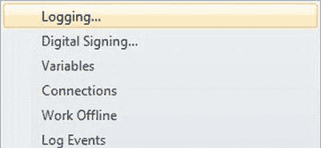

# 日志记录与审计

> *对数据的无控制访问，没有活动审计跟踪且缺乏监督，将过于危险。*
>
> ——美国海军军官约翰·波因德克斯特

企业系统提供的几个关键优势（在审计师开始仔细检查之前往往被忽视）是流程日志记录、审计和数据沿袭。概念很简单：当您将数据从一个系统移动到另一个系统并在过程中进行操作时，您可能需要跟踪数据的来源，维护有关数据处理的摘要信息，并了解哪些过程在此过程中接触了该数据。保留此附加信息的原因有几个：

- 您可能需要将其用于故障排除目的，以将数据问题向后追溯到其来源。
- 法律部门可能强制要求一项新的法律规定，要求在发生问题时实时记录处理的每个步骤。
- 您的业务可能受到萨班斯-奥克斯利法案 (`SOX`) 或健康保险流通与责任法案 (`HIPAA`) 等法规的约束，这些法规要求对机密医疗或消费者数据实施高水平的安全和控制。

SSIS 提供了广泛的标准日志记录功能，可捕获有关 ETL 处理状态的运行时信息。此外，使用 SSIS 为企业 ETL 应用程序添加审计功能相对简单。在本章中，您将了解利用标准日志记录以及向 SSIS 包添加审计的方法。

### 日志记录

SSIS 提供了易于启用的内置`日志记录`功能。在前面的章节中，我们已在一些代码示例中启用此功能以演示 SSIS 的日志记录能力。在本节中，我们将回顾如何在 SSIS 包中启用和配置日志记录。我们还将讨论 SSIS 日志记录的最佳实践。

[www.it-ebooks.info](http://www.it-ebooks.info/)

#### 启用日志记录

SSIS 中的日志记录选项可在包级别访问，方法是右键单击控制流，并从弹出的上下文菜单中选择“日志记录”选项，如图 13-1 所示。

*图 13-1\. 从弹出菜单中选择日志记录选项*

日志记录配置屏幕允许您配置 SSIS 日志记录选项，如图 13-2 所示。在此屏幕中，您可以设置以下日志记录选项：

