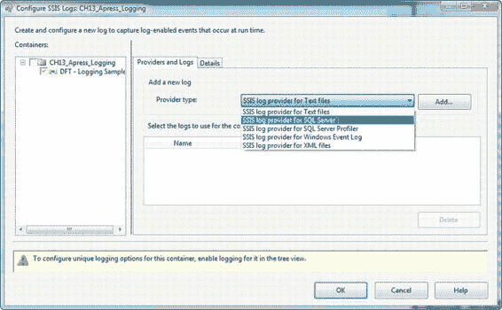
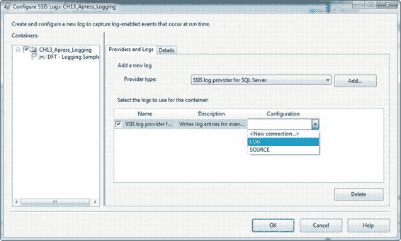
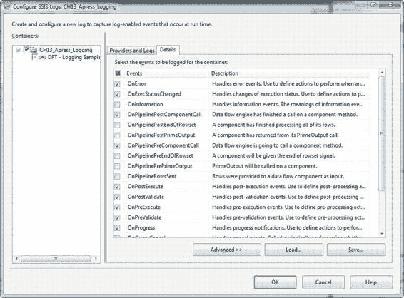
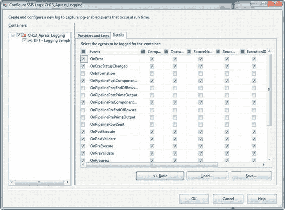
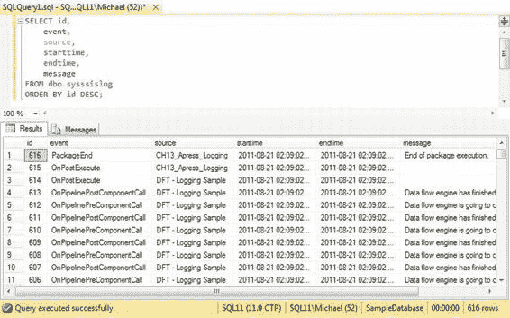
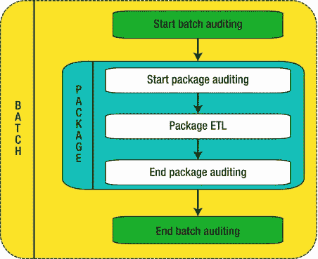

# 第 13 章 – 日志记录与审计

-   要使用的 SSIS 日志提供程序。最常见的选项是用于 SQL Server 的 SSIS 日志提供程序（将日志记录到 SQL Server 表中）和用于文本文件的 SSIS 日志提供程序（将日志信息输出到文本文件）。不过，您也可以选择将信息记录到 Windows 事件日志、XML 文件或 SQL Server Profiler 跟踪文件中。后几种选项通常用于专门的故障排除任务。
-   需要记录事件的容器。您可以在包、容器和数据流任务级别配置特定事件的日志记录。在我们的示例中，我们将在包和数据流任务两个级别进行配置。
-   您希望在事件级别记录的详细信息。您可以从 **详细信息** 选项卡中选择这些详细信息。

**注意：** 通常，我们倾向于使用用于 SQL Server 的 SSIS 日志提供程序，而非其他日志记录方法。因为此日志提供程序将信息记录到 SQL Server 数据库表中，记录的信息易于查询，从而简化了故障排除工作。当您指定使用用于 SQL Server 的 SSIS 日志提供程序时，它会自动在您的数据库中生成 `dbo.sysssislog` 表和 `dbo.sp_ssis_addlogentry` 存储过程（如果它们不存在），并将这两者都标记为系统对象。

[www.it-ebooks.info](http://www.it-ebooks.info/)



*图 13-2. SSIS 日志记录配置屏幕*

要配置日志记录，请选择您希望为其启用日志记录的包，或包中的容器或任务。然后选择一个日志提供程序，并单击 **添加** 按钮。在图 13-3 中，我们将用于 SQL Server 的 SSIS 日志提供程序添加到了一个包中，并在包级别启用了日志记录。对于许多日志提供程序，您必须从 **配置** 下拉列表中选择一个连接。在图中，我们选择了一个名为 `LOG` 的 OLE DB 连接，该连接指向我们希望记录到的 SQL Server 数据库。

**注意：** 当我们配置用于 SQL Server 的 SSIS 日志提供程序时，我们更倾向于专门为日志提供程序连接创建一个 OLE DB 连接管理器。这样可以将日志记录信息与数据连接分开。这样做的一个主要原因是避免偶尔出现的“连接正忙于处理另一命令的结果”错误，这种错误在某些情况下可能难以排查。

[www.it-ebooks.info](http://www.it-ebooks.info/)



*图 13-3. 配置用于 SQL Server 的 SSIS 日志提供程序*

在我们的示例中，我们已在包级别启用了日志记录，但没有更改包中包含的数据流任务的设置。在这种情况下，包中的所有容器和任务都会从包继承其日志记录设置，如灰色复选框所示。要配置记录的事件，请选择日志记录配置页面的 **详细信息** 选项卡。所有可以记录的事件都会列出，如图 13-4 所示。

[www.it-ebooks.info](http://www.it-ebooks.info/)



*图 13-4. 选择要记录的事件*

您还可以通过单击 **高级** 按钮（如图 13-5 所示）来选择为每个事件记录的详细信息。默认情况下，它会记录每个事件的所有相关信息。除非您有特定原因需要从日志中排除某些数据，否则默认设置通常是足够的。

[www.it-ebooks.info](http://www.it-ebooks.info/)



*图 13-5. 选择为每个事件记录的数据*

#### 选择日志事件

配置日志记录时，需要记住的一点是，每个记录的事件都会消耗一些资源。以用于 SQL Server 的 SSIS 日志提供程序为例，每个事件都需要调用一个 SQL Server 存储过程，然后该过程将数据写入数据库中的表。记录大量事件会降低包的速度并需要大量存储空间。

尽管所有的 SSIS 事件都提供了一些关于包执行情况的洞察，但有些事件更适合留作专门的调试场景。因此，我们建议在生产环境中限制记录的事件。记录过多信息会对性能和存储造成影响，而且在故障排除时，如果您选择记录过多信息，可能会遇到“信息过载”的问题。以下列表指出了我们建议在生产环境中捕获的核心事件。请注意，此列表只是一个起点，您在生产环境中可能还需要捕获其他事件：

-   `OnError`
-   `OnExecStatusChanged`
-   `OnPipelinePostComponentCall`
-   `OnPipelinePreComponentCall`
-   `OnPostExecute`
-   `OnPostValidate`
-   `OnPreExecute`
-   `OnPreValidate`
-   `OnQueryCancel`
-   `OnTaskFailed`
-   `OnWarning`

我们建议避免的事件包括 `OnInformation`、`OnProgress` 和 `Diagnostic` 等。尽管这些事件在调试和测试场景中通常很有用，但它们记录的“噪声信息”与有用信息的比例非常高。它们往往会混淆日志，使故障排除复杂化，并在不同程度上对性能产生不利影响。

#### 关于 SQL 日志记录

如本章前面所述，我们倾向于使用用于 SQL Server 的 SSIS 日志提供程序来处理 SSIS 日志记录需求。此日志提供程序依赖两个数据库对象来记录信息：一个名为 `dbo.sp_ssis_addlogentry` 的存储过程和一个名为 `dbo.sysssislog` 的表，两者都被标记为系统对象。每当发生事件时，SSIS 就会调用该存储过程。该过程继而向 `dbo.sysssislog` 表中写入一条记录。可以使用类似于图 13-6 所示的查询来查询 SSIS 日志表以检索相关信息。

[www.it-ebooks.info](http://www.it-ebooks.info/)



*图 13-6. 查询 SSIS 日志表*

### 摘要审计

*摘要审计* 包括获取和存储 SSIS 包的简要处理信息。作为审计的一部分，我们通常存储可以从 SSIS 包中的系统变量获取的包审计信息、开始和结束时间以及其他摘要执行信息。

启用审计的最简单方法是创建并调用存储过程来启动和结束您的审计过程。在作者通常采用的模型中，我们喜欢将过程分为批次级别和包级别审计。图 13-7 是此两部分批次/包审计过程的逻辑表示。请注意，一个*批次*可以包含一个或多个包。

**注意：** 可以通过使用执行包任务来实现父子 SSIS 设计模式，将多个包包装在一个批次中。

[www.it-ebooks.info](http://www.it-ebooks.info/)



*图 13-7. 批次/包审计的逻辑视图*

#### 批次级别审计

*批次级别审计* 涵盖在给定运行期间执行的所有包。在批次级别，我们记录整个批次的开始时间和结束时间，以及数据库中表的摘要信息。出于安全考虑并为了简化管理，我们审计过程的实现将其数据库对象放在一个新的架构中。在此实例中，我们将其命名为 `Audit`：

```sql
IF SCHEMA_ID(N'Audit') IS NULL
    EXEC(N'CREATE SCHEMA Audit;');
GO
```

我们首先创建一个名为 `AuditBatch` 的表，其中包含批次级别的审计信息，包括给定批次的开始和结束时间。您可以使用存储在 `AuditBatch` 表中的信息来确定整个批次包的性能，并归档属于单个批次执行的日志条目。以下是我们执行的代码：

```sql
IF OBJECT_ID(N'Audit.AuditBatch') IS NOT NULL
    DROP TABLE Audit.AuditBatch;
GO

CREATE TABLE Audit.AuditBatch
(
    BatchID BIGINT NOT NULL IDENTITY(1, 1),
```


## 第 13 章 日志记录与审计

```sql
BatchStartTime DATETIMEOFFSET,
BatchEndTime DATETIMEOFFSET,
BatchElapsedTimeMS AS (DATEDIFF(MILLISECOND, BatchStartTime, BatchEndTime)),
BatchStatus NVARCHAR(20),
CONSTRAINT PK_AUDIT_AUDITBATCH PRIMARY KEY CLUSTERED
(
BatchID
)
```

[www.it-ebooks.info](http://www.it-ebooks.info/)

```sql
);
GO
```

在下一个示例中，我们还创建了一个名为 `Audit.AuditTable` 的批处理级别的审计表，该表捕获数据库中表的状态信息，包括每个表中的行数以及每个表消耗的空间。存储在此表中的信息可用于确定给定批处理进程的资源使用情况。例如，你可以使用这些原始数据来估算长期存储需求。

```sql
IF OBJECT_ID(N'Audit.AuditTable') IS NOT NULL
    DROP TABLE Audit.AuditTable;
GO

CREATE TABLE Audit.AuditTable
(
TableAuditID BIGINT NOT NULL IDENTITY(1, 1),
BatchID BIGINT NOT NULL,
BatchStartFlag BIT NOT NULL,
TableSchema NVARCHAR(128),
TableName NVARCHAR(128),
TableObjectID INT,
TableReservedKB FLOAT,
TableDataKB FLOAT,
TableIndexKB FLOAT,
TableUnusedKB FLOAT,
TableRows INT,
TableDataBytesPerRow INT,
CONSTRAINT PK_AUDIT_AUDITTABLE PRIMARY KEY CLUSTERED
(
TableAuditID
)
);
GO
```

为了简化我们即将编写的存储过程代码，我们通过一个名为 `Audit.SummaryTableData` 的视图来捕获表大小数据。为了提高速度，我们使用 `sys.partitions` 目录视图来获取表的行数：

```sql
IF OBJECT_ID(N'Audit.SummaryTableData') IS NOT NULL
    DROP VIEW Audit.SummaryTableData;
GO

CREATE VIEW Audit.SummaryTableData
AS
WITH CTE
AS
(
SELECT OBJECT_SCHEMA_NAME(p.object_id) AS table_schema,
       OBJECT_NAME(p.object_id) AS table_name,
       p.object_id,
       SUM(a.total_pages) AS reserved_pages,
       SUM(a.used_pages) AS used_pages,
       SUM(
           CASE
               WHEN it.internal_type IN (202, 204, 207, 211, 212, 213, 214, 215, 216, 221, 222) THEN 0
               WHEN a.type <> 1 AND p.index_id < 2 THEN a.used_pages
               WHEN p.index_id < 2 THEN a.data_pages
               ELSE 0
           END
       ) AS pages,
       (
           SELECT SUM(p1.rows)
           FROM sys.partitions p1
           WHERE p1.index_id in (0,1)
             AND p1.object_id = p.object_id
       ) AS rows
FROM sys.partitions p
INNER JOIN sys.tables t
    ON p.object_id = t.object_id
INNER JOIN sys.allocation_units a
    ON p.partition_id = a.container_id
LEFT JOIN sys.internal_tables it
    ON p.object_id = it.object_id
GROUP BY OBJECT_SCHEMA_NAME(p.object_id),
         OBJECT_NAME(p.object_id),
         p.object_id
)
SELECT table_schema,
       table_name,
       object_id,
       reserved_pages * 8192 / 1024.0 AS reserved_kb,
       pages * 8192 / 1024.0 AS data_kb,
       (used_pages - pages) * 8192 / 1024.0 AS index_kb,
       (reserved_pages - used_pages) * 8192 / 1024.0 AS unused_kb,
       rows,
       pages * 8192 / CASE rows
                           WHEN 0.0 THEN NULL
                           ELSE rows
                       END AS data_bytes_per_row
FROM CTE;
GO
```

**提示：** `sys.partitions` 目录视图中的行数在技术上是一种近似值，但据指出，它们可能出错的情况非常罕见。我们有可靠的信息表明，如果你的 `sys.partitions` 行数偏差较大，应该向 Microsoft 报告，因为它可能是一个需要调查的问题。我们在这里使用它是因为它比通过 `SELECT COUNT(*)` 方法获取表行数要快得多。

我们的视图使用与旧式 `sp_spaceused` 系统存储过程非常相似的方法来计算表所使用的空间。最后，我们创建两个过程来启动和结束批处理审计（`StartAuditBatch` 和 `EndAuditBatch`）。对 `StartAuditBatch` 的初始调用在每次调用后返回一个唯一的批处理 ID 号，并存储数据库中表的初始状态信息。以下示例中的 `EndAuditBatch` 过程接受这个先前生成的批处理 ID 号并关闭批处理信息。

```sql
IF OBJECT_ID(N'Audit.StartAuditBatch') IS NOT NULL
    DROP PROCEDURE Audit.StartAuditBatch;
GO

CREATE PROCEDURE Audit.StartAuditBatch @BatchID BIGINT OUTPUT
AS
BEGIN
    SET NOCOUNT ON;

    INSERT INTO Audit.AuditBatch
    (
        BatchStartTime,
        BatchStatus
    )
    VALUES
```


