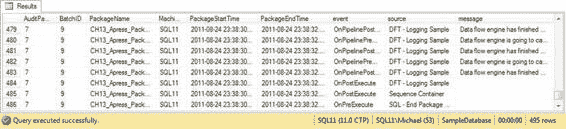

# 日志与审计

### 带有审计调用的示例包

审计可以通过在流程中加入执行 SQL 任务来调用相应的存储过程来添加到您的流程中。在我们的示例包中，我们创建了两个 64 位整型（Int64）变量，分别命名为`User::AuditBatchID`和`User::AuditPackageID`。我们按照图 13-8 所示设置我们的示例包。

*图 13-8. 带有审计调用的示例包*

此示例中的数据流任务被起始和结束审计调用所包装，顺序如下：

[www.it-ebooks.info](http://www.it-ebooks.info/)



- **SQL – Start Batch Audit**：开始批处理审计过程。调用起始批处理审计过程并返回唯一的批处理审计 ID。此 ID 用于设置包中的变量。
- **SQL – Start Package Audit**：开始包审计过程。调用起始包审计过程并返回唯一的包审计 ID，该 ID 用于设置相应的包变量。我们将几个系统变量传递给此过程，以便将它们保存在包审计表中。
- **SQL – End Package Audit**：结束包审计过程。此过程在包级别关闭审计循环，记录审计完成信息。
- **SQL – End Batch Audit**：完成批处理审计过程。在所有包完成后，调用结束批处理审计过程以完成批处理级别的审计。记录的批处理审计信息包括表大小变化信息。

正如我们提到的，您捕获的审计信息可以通过`Execution Instance GUID`连接回标准的 SSIS 日志表。此 GUID 将为您提供与任何给定包执行相关的所有日志消息，使用类似于以下的查询。示例结果如图 13-9 所示。

```sql
SELECT au.AuditPackageID,
       au.BatchID,
       au.PackageName,
       au.MachineName,
       au.PackageStartTime,
       au.PackageEndTime,
       s.event,
       s.source,
       s.message
FROM Audit.AuditPackage au
INNER JOIN dbo.sysssislog s
ON au.ExecutionInstanceGUID = s.executionid;
GO
```

*图 13-9. 连接到 SSIS 日志表的审计数据示例结果*

### 简单的数据血缘

我们在本章中描述的审计过程的一个优点是，您可以轻松地扩展它以包含简单的数据血缘流程。*数据血缘* 是一个过程，通过它可以追溯数据的来源，本质上是逆向工程数据到达其当前状态所经历的过程。在本节展示的最简单形式中，您可以使用数据血缘信息来确定哪些 ETL 流程处理了您的数据，并确定其衍生的确切来源。

> **注意：** Microsoft 在 SQL Server Denali 的早期预发布版本中引入了一项名为 *影响和数据分析 (IAL)* 的新功能。IAL 本应开箱即用地提供企业级数据血缘功能。可惜的是，该功能在发布到市场 (RTM) 之前因“大修”而被撤回。因此，在 Microsoft 的解决方案发布之前，我们必须实现自己的数据血缘流程。经过改进的 IAL 预计将在 SQL Server Denali 之后不久作为 Project Barcelona 的一部分发布（更多信息请访问 http://blogs.msdn.com/b/project_barcelona_team_blog/）。

我们为简单数据血缘解决方案需要记录的大部分信息已经存储在批处理和包审计表中。这包括开始和停止时间、特定的包和平台标识信息以及相关的标准日志条目。所有这些信息都可以用来逆向工程您的流程，但缺少一些项目。在您逐步回溯流程后，您需要最终确定数据的来源，并且您可能实际上需要审计解决方案未捕获的额外支持数据。

