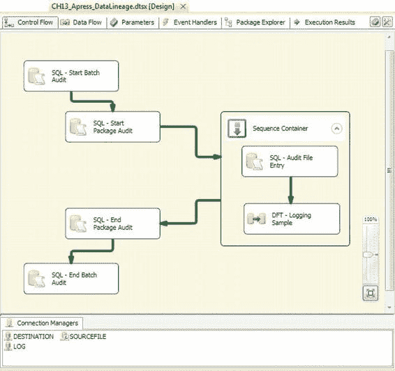
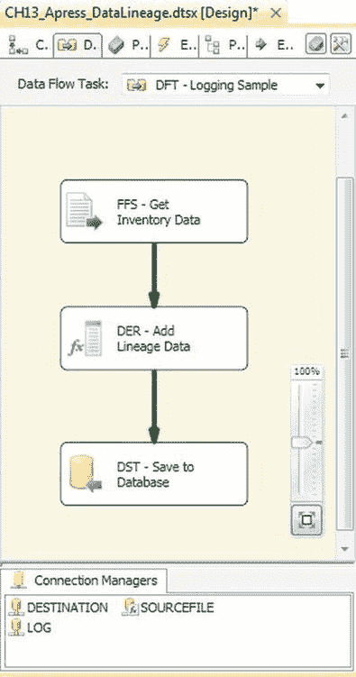
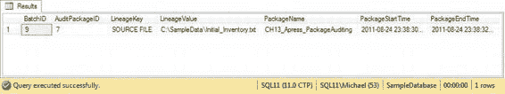

# 第十三章 日志记录与审计

为此，我们创建了一个简单的表，用于存储与特定批次和包执行相关的键值对。这个设计不限制您使用一组预定义的条目，而是允许您在流程的任何节点存储任何必要的元数据。为此创建的表是 `LineageMetadata` 表，如下所示：

```
IF OBJECT_ID(N'Audit.LineageMetadata') IS NOT NULL
DROP TABLE Audit.LineageMetadata;
GO

CREATE TABLE Audit.LineageMetadata
(
LineageMetaID int not null identity(1, 1),
BatchID int not null,
AuditPackageID int not null,
LineageKey varchar(1000) not null,
LineageValue varchar(1000),
CONSTRAINT PK_AUDIT_LINEAGEMETADATA PRIMARY KEY CLUSTERED
(
LineageMetaID
)
);
GO
```

我们还提供了一个简单的存储过程，可根据需要向表中添加条目，如下所示：

```
IF OBJECT_ID(N'Audit.AddLineageMetadata') IS NOT NULL
DROP PROCEDURE Audit.AddLineageMetadata;
GO

CREATE PROCEDURE Audit.AddLineageMetadata @BatchID int,
@AuditPackageID int,
@LineageKey varchar(1000),
@LineageValue varchar(1000)
AS
BEGIN
INSERT INTO Audit.LineageMetadata
(
BatchID,
AuditPackageID,
LineageKey,
LineageValue
)
VALUES
(
@BatchID,
@AuditPackageID,
@LineageKey,
@LineageValue
);
END;
GO
```

[www.it-ebooks.info](http://www.it-ebooks.info/)

一个实现了我们简单数据血缘解决方案的示例包，扩展了之前的审计包以包含血缘实体，例如存储源文件名，如图 13-10 所示。



*图 13-10. 包含附加数据血缘的 SSIS 包*

为了获得行级数据血缘，我们需要将批次 ID 和包 ID 作为列添加到我们的数据流中，并与数据一起存储在目标表中。在我们的示例中，这是通过 `派生列` 转换完成的，如图 13-11 所示。



*图 13-11. 使用“派生列”转换将血缘数据添加到数据流*

血缘数据可以通过 `BatchID` 和 `AuditPackageID` 与审计数据进行联接，如下面的示例查询所示。我们测试运行的样本结果如图 13-12 所示。

```
SELECT lm.BatchID,
lm.AuditPackageID,
lm.LineageKey,
lm.LineageValue,
au.PackageName,
au.PackageStartTime,
au.PackageEndTime
FROM Audit.LineageMetadata lm
INNER JOIN Audit.AuditPackage au
ON lm.BatchID = au.BatchID
AND lm.AuditPackageID = au.AuditPackageID;
GO
```



*图 13-12. 血缘与审计数据示例*

如图 13-12 中的结果所示，我们捕获了足够的元数据信息，可以追溯每一行数据从其开始的源文件，经过处理它的包，最终到达其结束的目标表。

**注意：** 如前所述，这是一个简单的数据血缘解决方案，但它可用于构建更复杂的解决方案。作者曾偶尔实施过需要更精细粒度的自定义数据血缘解决方案，例如捕获数据在被处理时的单个行和列的状态。可以想象，我们热切期待着 Project Barcelona 的发布。

### 总结

在世界各地当前投入生产的许多企业系统中——涵盖众多行业——日志记录和审计功能常常被忽视。在某些场景下，缺乏适当的日志记录和审计流程可能导致花费无数小时逆向工程数千行代码，以发现并修复即使是最简单的错误。在最坏的情况下，未能实现这些企业级功能可能最终导致与审计机构和监管机构发生麻烦，随之而来的是巨额罚款和人员失业。本章介绍了 SSIS 的内置日志记录功能，并展示了如何扩展它们，为您的 ETL 流程添加标准化的审计功能。


此外，存储**数据血缘**信息正变得越来越重要，它使你能够跟踪数据从一个系统移动到另一个系统的过程，直至进入你的数据仓库、数据集市和其他数据存储库。尽管`SSIS`目前并未提供开箱即用的企业级数据血缘功能，但我们已经演示了如何扩展你的审计系统以实现一个基本的数据血缘解决方案，该方案将允许你在行级别跟踪数据，回溯处理过它的所有数据包，一直追溯到其源头。

下一章将介绍异构环境中的`ETL`——即源数据以多种形式和格式呈现的环境。

[www.it-ebooks.info](http://www.it-ebooks.info/)

