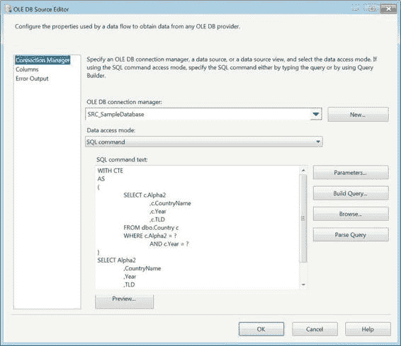
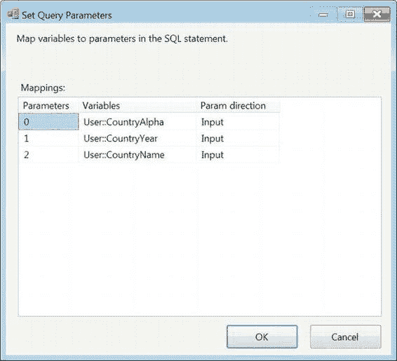

# 第 14 章 异构源和目标

> 我们希望在不损害其独特底层能力的前提下，进一步消除异构架构和应用程序之间的摩擦。
>
> ——微软联合创始人 比尔·盖茨

数据集成工具的关键要素之一是处理不同源和目标的能力。`SQL Server Integration Services 2012`允许你从任何存储方法中提取数据，并将其加载到同样众多的数据存储系统中。`Integration Services`提供的工具集真正试图实现比尔·盖茨概述的目标，即让各种系统能够很好地协同工作。如前几章所讨论的，数据完整性是集成项目成功的关键要素，而`SSIS`提供了转换和组件，使你能够处理不符合规范的数据。

数据存储以各种形式存在。这包括本身无法强制保证数据质量（例如数据类型或外键）的文本文件、其他`RDBMS`（包括`Oracle`或`DB2`）、`XML`文件、Web 服务，甚至是`Active Directory`。所有这些系统都能以`SSIS`可以解析并集成到一个系统中的某种结构来保存数据。然而，目标并不仅限于`SQL Server`。如果需求指明，数据也可以加载回原始形式。

本章涵盖了`SSIS`可以访问的一些源和目标。本章在很大程度上依赖于第 4 章提供的信息作为基础，并在此基础上为你提供了可用于日常流程的示例。

### SQL Server 源和目标

`SSIS`最容易处理的源和目标是`SQL Server`。从早期版本读取相对容易，但加载到早期版本可能需要一些数据转换来处理新的或已弃用的数据类型。正如我们在第 4 章提到的，从`SQL Server`数据库提取数据的最有效方法是使用`SQL 命令`选项编写你自己的`SQL`语句。这是建议在`SQL Server`源组件上使用的选项，原因有几个。首要原因是它允许你将提取的列限制为你需要的那些。`Table or View`选项使用的`SELECT *`表示法已被记录在案，在`SSIS`源组件中性能较差，并且可能由于`DDL`更改而导致元数据验证错误。指定必要的列将保持你的初始缓冲区精简。编写`SQL`的另一个原因是，你可以在`SQL`中定义数据类型，而不是在数据流中使用数据转换组件。`SQL 查询`选项还允许你定义`ORDER BY`子句，如果你需要在数据流中使用`Merge Join`转换执行连接，这可以极大地提升性能。

**注意：** 如果你想查看源组件中`SELECT *`查询的性能，可以在运行`SQL profiler`的情况下执行一个数据包。你应该能够清晰地比较两种实现之间的差异。

如图 14-1 所示的源组件允许你定义提取集。为了将源组件添加到数据包中，你必须有一个`Data Flow Task`来添加它。我们选择利用`SQL 命令`选项从源中提取数据。尽管我们正在提取表中的所有列，但我们仍然枚举了所有列，而不是使用`*`选项。我们使用清单 14-1 所示的查询作为我们的提取逻辑。使用`SQL 命令`的优势之一是能够对查询进行参数化。

*清单 14-1. SQL Server 源查询*

```
WITH CTE
AS
(
    SELECT c.Alpha2
        ,c.CountryName
        ,c.Year
        ,c.TLD
    FROM dbo.Country c
    WHERE c.Alpha2 = ?
      AND c.Year = ?
)
SELECT Alpha2
    ,CountryName
    ,Year
    ,TLD
FROM CTE
WHERE CountryName = ?
;
```

公共表表达式（`CTE`）可用于源查询内部，以分解查询逻辑并使查询更具可读性。通过在查询中放置问号来限定参数。参数不仅可以用于通过`WHERE`子句限制行，还可以用于在查询中添加列。只要使用`OLE DB Source Editor`中的`Parameters`按钮进行了适当的映射，参数可以添加到查询的不同部分。我们强烈建议你将参数彼此紧挨着放置，这样在必须映射它们时，就不会最终弄乱它们的顺序。提供的示例可能会变得混乱，因为`CTE`中有一些参数，而最终查询中还有另一个参数。

[www.it-ebooks.info](http://www.it-ebooks.info/)



*图 14-1. OLE DB 源编辑器*

`SQL Command Text`框右侧的按钮允许你通过以下方式修改查询：

- `Parameters` 允许你为查询中列出的参数分配映射。映射背后的命名约定取决于连接管理器的类型。连接管理器章节概述了所有映射规则。
- `Build Query` 打开一个`GUI`，允许你构建`SQL`查询。
- `Browse` 允许你从文件导入文本作为查询。单击`OK`按钮后，将解析查询并验证元数据。
- `Parse Query` 解析文本字段中提供的查询。

[www.it-ebooks.info](http://www.it-ebooks.info/)



图 14-2 展示了可以将变量值分配给`SQL`语句中定义的参数的映射。数据类型可能因查询中上下文的类型而异。`Parameters`列对于分配值至关重要，因为它依赖于限定符在查询中出现的顺序。`Param direction`列决定了是通过语句为变量赋值（`Output`），还是变量正在向语句传入一个值（`Input`）。由于源组件预期一个表格形式的结果集，`Input`是最可能使用的方向。这就是我们建议尽可能将参数集中放置的原因。

*图 14-2. 设置查询参数对话框*


