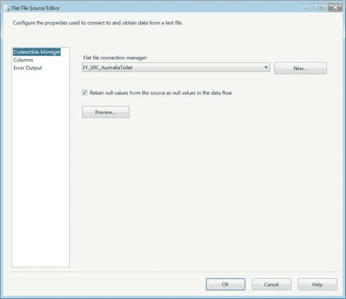
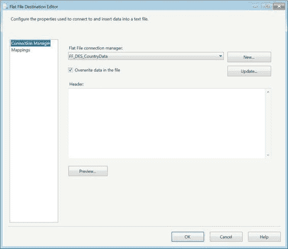
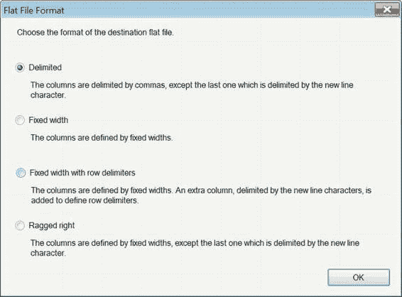
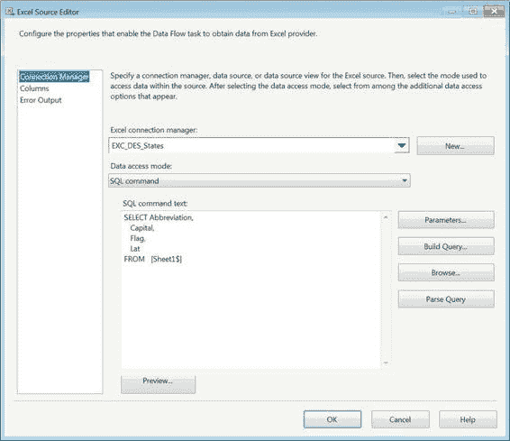
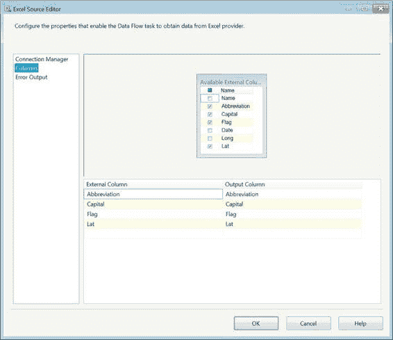
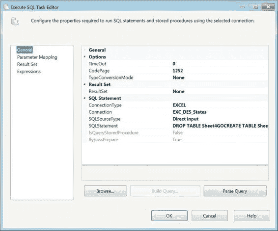
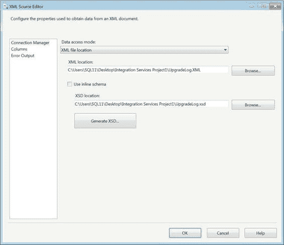

# 平面文件源与目标

使用平面文件作为源需要平面文件连接管理器。该连接管理器在第四章中有详细讨论。利用连接管理器中定义的属性，源组件获取提取数据所需的所有元数据。图 14-7 显示了平面文件源编辑器中的可用选项。该编辑器同样利用连接管理器的配置来收集列信息。如第四章所述，平面文件连接管理器存储诸如列和行分隔符、列名、列数据类型信息以及有关文件和数据的其他信息。“预览”按钮显示使用连接管理器中定义的配置读取的行的样本。“将源中的空值保留为数据流中的空值”选项将在管道中保留空值。“列”页面从连接管理器获取其所有信息。



另一方面，平面文件目标的操作方向相反。如果平面文件本身不存在，您将必须添加一个新的平面文件连接管理器来配置输出文件。

图 14-8 显示了平面文件目标编辑器以及它如何修改连接管理器。“新建”按钮将创建一个新的平面文件连接管理器。这将自动打开一个对话框“平面文件格式”，如图 14-9 所示。利用此对话框中选择的选项，连接管理器大部分会自动配置，因为它从位于数据流管道末端获得信息。然而，“更新”按钮强制您直接修改连接管理器，而不是通过元数据导入配置。“映射”页面只是简单地将管道中的列映射到连接管理器中定义的列。



“平面文件格式”选项允许您定义平面文件的布局。每个选项在第四章的平面文件连接管理器部分都有介绍。所有非分隔符选项的信息由管道中存储的元数据提供。



### Excel 源与目标

Microsoft Excel 的吸引力源于其工作表与数据库表的相似性。业务用户欣赏 Excel 能够快速显示和修改表格信息的能力。在后端，Excel 使用 Jet 引擎，这与 Microsoft Access 使用的引擎相同。这允许 SSIS 在电子表格上执行某些类似 SQL 的命令。Jet 引擎的 SQL 解释远不如 SQL Server 的先进，但它确实有一些可以用于 ETL 过程的基本元素。

> **注意：** `Jet` 引擎目前没有 64 位提供程序。当您尝试使用 SSIS 操作电子表格时，这可能会导致一些问题。

Excel 源组件与平面文件源组件类似，区别在于对连接管理器的依赖。Excel 文件的连接管理器仅定义其位置的文件夹路径。图 14-10 显示了 Excel 源组件的编辑器。“连接管理器”页面允许您选择指向 Excel 文件及其内特定工作表的连接管理器，或者提供一个 SQL 查询，该查询将连接不同的工作表以返回所需数据。`Jet` 引擎在连接上的数据类型匹配或数据中的空值处理方面，不允许其他关系数据库管理系统（`RDBMS`）所允许的宽松度。



清单 14-2 提供了用于从特定工作表中提取所需列的查询。

此查询与在 `OLE DB` 源组件中使用 `SQL Command` 选项具有相同的优点，即在数据流开始时，缓冲区仅限于这四个列。图 14-11 显示了“列”页面，该页面允许您选择希望传递到数据流中的列。这两种方法之间的区别在于，通过使用“表或视图”选项，您会拉取所有可用列，然后在 `SSIS` 已经处理了不需要的列之后再对其进行修剪。

**清单 14-2. Excel 源 SQL 命令**

```sql
SELECT Abbreviation,
    Capital,
    Flag,
    Lat
FROM [Sheet1$]
```



将数据加载到 Excel 电子表格的难点之一是清除工作表（表/视图）中已存在的行。默认情况下，`SSIS` 增量加载电子表格。为了重新加载电子表格，您必须在控制流中使用执行 SQL 任务，并将其指向目标 Excel 连接管理器。图 14-12 显示了可以实现此目的的执行 SQL 任务的配置。



清单 14-3 显示了用于截断 Excel 工作表的实际 SQL 语句。原始的三个工作表名称末尾会显示一个美元符号（`$`）。为了将列映射到目标工作表，该表必须存在于文件中。Excel 目标组件上的“新建”按钮将生成创建脚本，就像 `OLE DB` 目标生成创建表脚本一样。`Jet` 引擎对关键字极其敏感，并将在创建脚本中通过将单引号括在对象名称周围来转义它们。这类似于 `OLE DB` 目标组件通过在所有名称周围使用方括号来转义对象。

**清单 14-3. Excel 工作表截断脚本**

```sql
DROP TABLE Sheet4
GO
CREATE TABLE Sheet4(
    Abbreviation LongText,
    Capital LongText,
    Flag LongText,
    Lat Double
)
GO
```

### XML 源

元数据的一个重要存储库是可扩展标记语言（`XML`）文件。`XML` 文件可用于描述几乎所有事物。`XML` 服务于多种目的：`SQL Server` 的 `XML` 功能可以将表记录输出为 `XML`；`SSIS` 包本质上是 `XML` 文件，由 `dtexec.exe` 和 `Business Intelligence Development Studio` 分别在运行时和设计时解释；`SQL Server` 将对象的扩展属性存储在 `XML` 中，以及其他格式，包括不仅与 `ETL` 相关的信息。

图 14-13 向您展示了 `XML` 源编辑器，该编辑器使用 `XML` 架构定义（`XSD`）解析 `XML` 文件以返回文件中存储的元素。“使用内联架构”将尝试根据 `XML` 中的值生成 `XSD`。但是，如果 `XSD` 不存在于 `XML` 中，“生成 `XSD`”按钮将为您生成一个 `XSD` 文件。`XSD` 生成后，它会在指定路径中创建为自己的文件。在此示例中，我们使用了将 `SSIS 2008` 项目文件转换为 `SSIS 2012` 的升级日志文件，并为其生成了 `XSD`。




