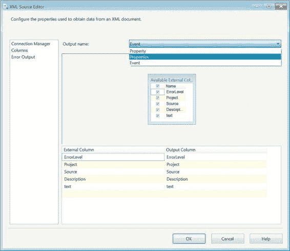
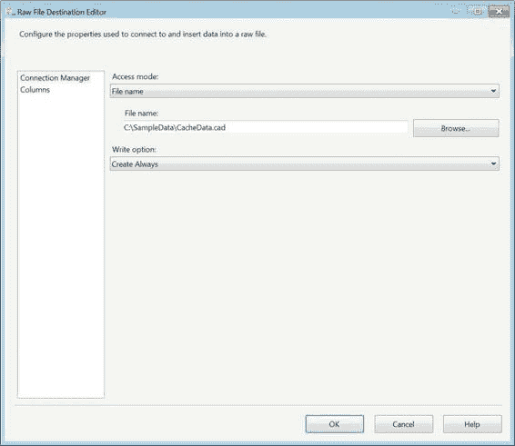
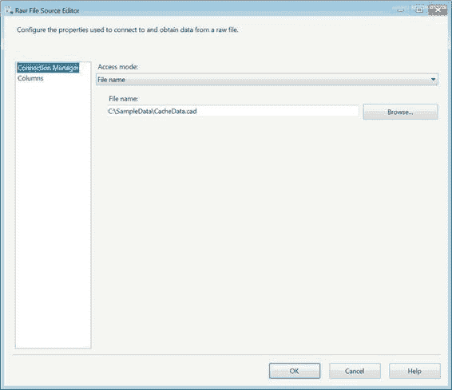
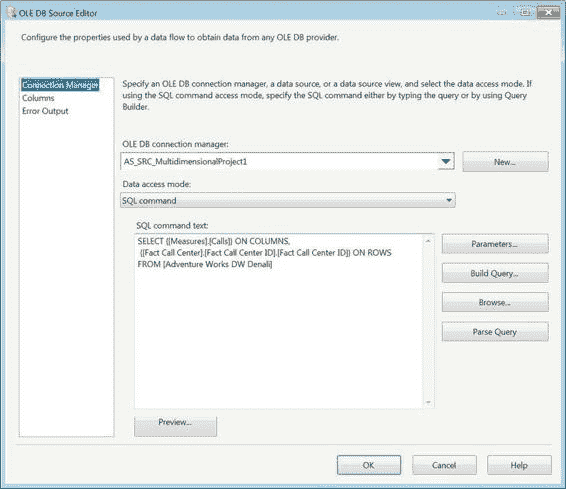
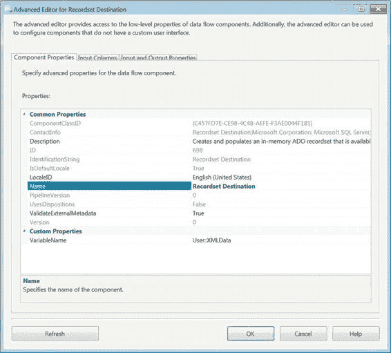

# 第 14 章 - 异构源和目标

#### 图 14-14. XML 源编辑器的列页面

图 14-14 展示了`XML 源编辑器`的`列`页面。这个源组件有趣的一点是，根据 XML 的节点层级数量，每个层级都会有自己的输出。

图中显示，这个特定的 XML 文件有三个层级：`Property`、`Properties`和`Event`。列表是按字母顺序而非层级结构排列的，因此仅通过查看输出，你无法轻松确定其结构。每个输出的列集都基于`XSD`进行设置。

[www.it-ebooks.info](http://www.it-ebooks.info/)



> **注意：** 除了为`XSD`中定义的每个节点层级提供一个输出外，这些输出还各自带有一个错误输出，该错误输出同样可以被重定向。

### 原始文件源和目标

原始文件源和目标提供了一种高效的方法，用于存储那些无需在每次请求时都返回服务器的数据，例如使用相同数据集的`查找转换`。

理想情况下，这些文件应在执行包的本地计算机上创建。这些文件提供的最大优势之一是，如果某个查询需要多次返回相同的数据集，则可以执行该查询一次并将结果集存储在一个文件中。在运行时，无需让每个`查找转换`都去查询数据库，可以直接从本机获取结果。

图 14-15 展示了`原始文件目标`的编辑器。该组件的工作方式与其他源和目标略有不同，因为文件需要先加载，才能作为源提供任何元数据。它也不使用连接管理器来连接到文件。

[www.it-ebooks.info](http://www.it-ebooks.info/)



> *图 14-15. 原始文件目标编辑器*

数据加载到文件后，你可以在流程中自由地访问它。图 14-16 展示了原始文件的源组件。与目标组件一样，此组件不依赖连接管理器来标识需要引用的文件。它可以直接从本机读取数据并加载到其他目标中。

[www.it-ebooks.info](http://www.it-ebooks.info/)



> *图 14-16. 原始文件源编辑器*

### SQL Server Analysis Services 源

`Analysis Services` 多维数据集是常用于商业智能领域的分析结构。其最大的优势在于能够存储大量聚合数据，从而可能加快查询速度。多维数据集本身只能使用`多维表达式 (MDX)`进行查询。这些表达式返回的数据类型并不总是能轻松转换为数据库数据类型，因此`SSIS`通常会将它们简单地转换为字符字段。有一个`SSAS OLE DB 提供程序`，允许你连接到多维数据集并从已定义的连接中提取特定值。图 14-17 展示了用于查询多维数据集的`OLE DB 源组件`。

[www.it-ebooks.info](http://www.it-ebooks.info/)



> *图 14-17. 带有 MDX 的 SSAS OLE DB 编辑器*

源组件中的表达式（复制为清单 14-4）是一个简单的`MDX`查询，显示了拨打到每个呼叫中心的电话数量。此查询未使用任何筛选器（`MDX WHERE`子句）或交叉连接来按多个项目进行切片。查询目标很简单，可以转换为带有`COUNT (DISTINCT CallID)`列的`GROUP BY``SQL`语句。

> *清单 14-4. 来自 SSAS 源组件的 MDX 示例*

```
SELECT {[Measures].[Calls]} ON COLUMNS,
{[Fact Call Center].[Fact Call Center ID].[Fact Call Center ID]} ON ROWS
FROM [Adventure Works DW Denali]
```

[www.it-ebooks.info](http://www.it-ebooks.info/)

> **警告：** 与`SQL`查询不同，`SSIS`只有在`MDX`查询返回数据集时才能从中获取元数据。如果使用没有数据的筛选器或返回空集，`SSIS`将抛出元数据验证错误。这可能在设计时以及运行时发生。

### 记录集目标

`SSIS 变量`通常可用于保存数据。在大多数情况下，这些数据采用标量值的形式，但在某些情况下需要一个`ADO.NET 内存记录集`。`SSIS 对象类型变量`可用于存储表格数据集，以便在循环容器中进行枚举，并与`脚本组件`结合提供附加功能，以及作为快速调试助手。记录集存储在变量中后，可以使用`脚本组件`通过`C#`或`VB`访问数据。

图 14-18 展示了`记录集目标`的编辑器。此组件的唯一编辑器是`高级编辑器`。`VariableName`属性用于选择哪个`SSIS 变量`将存储传入的数据。

`输入列`选项卡也很重要，因为你需要标识希望包含在变量中的列。`SSIS`默认不会选择所有列。在你指定所需列之前，它会一直给出警告。乍听之下这可能有些麻烦，但如果使用得当，它可以防止变量因不必要的数据而膨胀。

[www.it-ebooks.info](http://www.it-ebooks.info/)



> *图 14-18. 记录集目标的高级编辑器*

### 小结

`SQL Server Integration Services 12`提供了访问以多种形式存储的数据的功能。使用不同的提供程序，你可以从各种`RDBMS`或平面文件中提取数据。这些提供程序还允许你将数据插入几乎任何形式的存储中。本章向你介绍了`SSIS`可以从中提取和加载数据的存储方法。下一章将深入探讨优化和调整你的数据流。

[www.it-ebooks.info](http://www.it-ebooks.info/)

