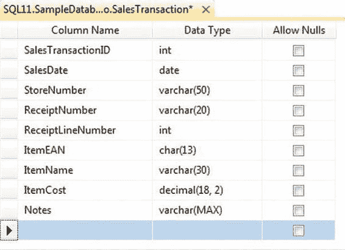

# 第 15 章 - 数据流调优与优化

*我感觉到有一种需要，对速度的需要。* ——演员汤姆·克鲁斯在《壮志凌云》中

询问任意一组`IT 经理`，让他们列出`ETL`流程最重要的方面，十有八九会把*原始速度*放在首位。尽管原始吞吐量在任何`ETL`流程中都很重要，但这种“对速度的需求”必须与其他要求相平衡，例如与其他进程的资源争用；正确且一致的结果；以及解决方案的可维护性、可管理性和健壮性。

当人们听说调整`数据流`时，通常会想到提高原始速度。处理速度固然重要，但唯速度论的观点是非常片面的。`ETL`速度慢通常只是症状而非病因。`ETL`缓慢的根本原因通常在于设计和实现。在本章中，你将专注于优化你的`数据流`，以消除那些以速度慢和资源消耗过大为症状的问题。

### 在数据库端限制行数

当你将数据拉入`SSIS 数据流`时，特别是从`SQL Server`数据库（或其他关系型`DBMS`）拉取时，你可以通过简单地限制检索的行数来提高`ETL`处理速度。

在`SQL Server`数据库或其他`RDBMS`上，这是通过向`SELECT`查询添加`WHERE`子句来实现的。

例如，考虑一个简单的数据库表，它存储一家大型连锁百货商店的每日交易记录。该表具有如图 15-1 所示的设计。

[www.it-ebooks.info](http://www.it-ebooks.info/)

> *图 15-1. 销售交易表设计*

