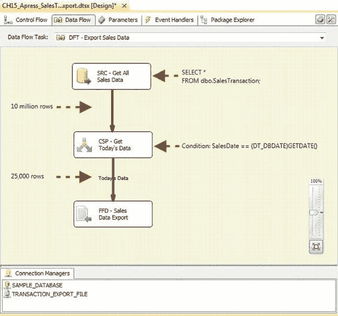
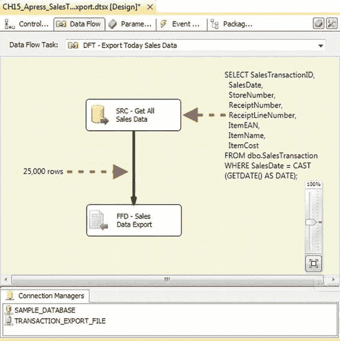
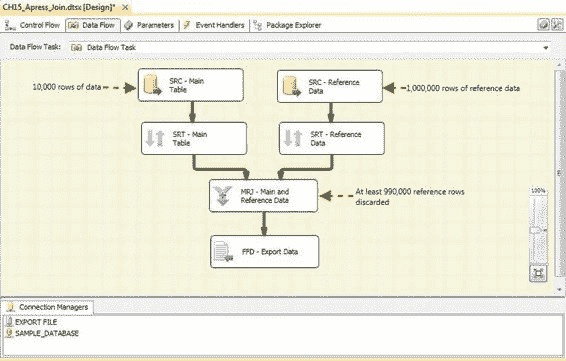

# 第 15 章 数据流调优与优化

假设此表包含 1000 万行销售交易数据，每天新增约 2.5 万行。考虑一个简单的 ETL 过程，它需要从表中检索当天的数据并将其导出到一个平面文件，以便其他进程获取——这是为传统下游系统提供数据时的常见需求。识别今天的记录有两种选择：（1）你可以通过使用 `Conditional Split` 转换在 SSIS 中限制数据，或者（2）在服务器端限制数据。要使用 `Conditional Split` 限制传入数据，你需要创建如图 15-2 所示的数据流。

[www.it-ebooks.info](http://www.it-ebooks.info/)



图 15-2. 使用 `Conditional Split` 转换限制传入数据。我们添加了注释以突出显示此数据流的工作原理。请注意，源表中的全部 1000 万行数据都被源组件拉入数据流。拉入的行中有 99%被 `Conditional Split` 转换无情地丢弃，以获取我们实际想要导出的 2.5 万行。

另一种方法是通过在你的 `SELECT` 查询中添加 `WHERE` 子句来在服务器上限制行数，如图 15-3 所示。

[www.it-ebooks.info](http://www.it-ebooks.info/)



图 15-3. 在服务器端限制源数据

在此示例中，通过在服务器端限制数据，你可以避免将数百万行数据首先全部拉入 SSIS。如果你的表的 `SalesDate` 列上有索引，你的查询将能够更高效地检索数据。在服务器端限制数据有两大优势：

*   你限制了被拉入 SSIS 的行数——当你通过网络拉取数据时，这一点尤为重要。
*   你可以使用更少的 SSIS 资源来检索数据。作为回报，你使用了更多的 SQL Server 资源，但通过在源端限制结果集，你可以利用 SQL Server 的许多基于集合的优化——特别是当你使用带有索引或分区的列来限制检索的数据时。

[www.it-ebooks.info](http://www.it-ebooks.info/)



**提示：** 除了源组件中的 SQL 查询外，SSIS 数据流组件无法利用 SQL Server 索引。

### 在数据库中执行连接

在服务器上执行连接是一种优化，与之前限制拉入数据流行数的优化密切相关。连接可以帮助你在服务器上高效地限制行数。设想以下场景：你需要拉取 1 万行数据到数据流中，并且你有一个百万行的查找参考数据。这种不平衡在数据仓库应用中很常见，例如，某个特定的维度表非常大。你已经知道你最多只需要 1 万行查找参考数据。如果可以避免，就没有必要将额外的 99 万行拉入你的数据流，然后仅仅丢弃它们，如图 15-4 所示。这可以通过在数据源处包含选择性来轻松解决，以过滤掉那些仅在通过所需内存缓冲区后才会被丢弃的行。

图 15-4. 在 `Merge` 任务中拉取大量数据

当要连接的两个数据集大小存在巨大不平衡时，通常使用 T-SQL 连接语法在服务器上执行会更高效。除了消除将过多数据拉入数据流可能产生的额外网络流量外，SQL Server 优化器有多种策略可以用来满足连接请求。SSIS 只能使用 `Merge Join`，这基本上是逐行扫描两个数据集。`Merge Join` 仅适用于基于相等的连接条件，并且两组输入必须在连接列上预先排序。当你在 SQL Server 上连接时，查询引擎会根据需要自动对源数据进行排序，如果在连接列上定义了索引，服务器也会使用它们。SQL Server 还可以执行不等式连接（小于、大于等）并支持 `CROSS JOIN` 语法。

**注意：** 使用 `Lookup` 转换组件消除了对查找参考数据执行 `Sort` 操作的需要，但同样需要读取所有源数据。`Lookup` 转换通过其部分缓存和非缓存模式提供了替代方案，但这些模式可能会导致过多的到服务器的往返，并且可能仍然不如服务器端连接高效。此外，与 `Merge Join` 转换类似，`Lookup` 转换无法使用源表上定义的 SQL 索引和表分布统计信息。

### 在数据库中排序

正如我们在前一节所示，某些数据流组件——例如 `Merge Join` 转换——需要排序的输入。SSIS 中的 `Sort` 转换是一个完全阻塞组件，这意味着在它完成处理整个输入数据集之前，没有行可以通过它。SSIS 只有一种数据排序方法，而 SQL Server 有多种策略来满足排序请求——例如，数据库可以利用索引。在数据库中排序只需在你的 `SELECT` 查询中添加 `ORDER BY` 子句。当与连接和 `WHERE` 子句限制结合使用时，在数据库端对输入进行排序可以显著提高性能。

**提示：** 如果你的数据来自不同的源，例如平面文件，并且你可以保证平面文件是预先排序的，那么你可以从数据流中移除 `Sort` 转换。

### 在数据库中执行复杂的预处理

在某些情况下，你可能需要在源数据准备好进行主要 ETL 处理之前，对其进行多步预处理。例如，你可能需要对数据进行一些基于服务器的计算、连接或其他步骤，这些步骤以基于集合的方式完成可能更高效。对于需要你在预处理期间序列化中间结果集（例如，将数据推入临时表）、使用 SQL `GROUP BY` 子句进行分组以及对数据进行分区（使用 SQL `OVER` 子句）的处理尤其如此。因为 SQL Server 可以对基于集合的处理问题应用多种不同的策略，而 SSIS 本质上只有一种简单的逐行策略来解决它们，所以在数据库执行基于集合的处理任务通常更高效。

[www.it-ebooks.info](http://www.it-ebooks.info/)

### 确保安全性和“读取审计”

在一些高度安全的操作中，可能需要对敏感数据的“读取”操作进行审计。在这些情况下，要求用户和 ETL 过程调用存储过程来读取关键表可能是有意义的。通过使用存储过程作为源，你可以拒绝对表的直接访问，并将逻辑纳入过程中以记录用户和进程发送的所有读取请求。

### 拉取过多列

在许多情况下，SSIS 开发人员会选择进行传统的 `SELECT *` 查询，或者在 OLE DB 源编辑器上选择数据访问模式 `Table or View` 选项。事实上，在图 15-2 的示例数据流中，我们使用了以下查询：

```sql
SELECT * FROM dbo.SalesTransaction;
```

在 OLE DB 源组件中。

你可能还注意到，`SalesTransaction` 表的定义包含一个名为 `Notes` 的 `varchar(max)` 列（如图 15-1 所示）。`varchar(max)` 列最多可容纳 2.1 GB 的数据。


