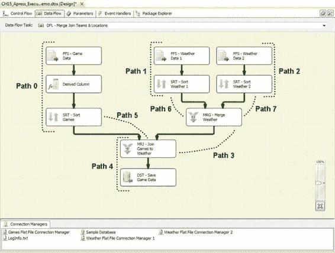
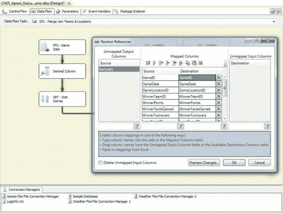
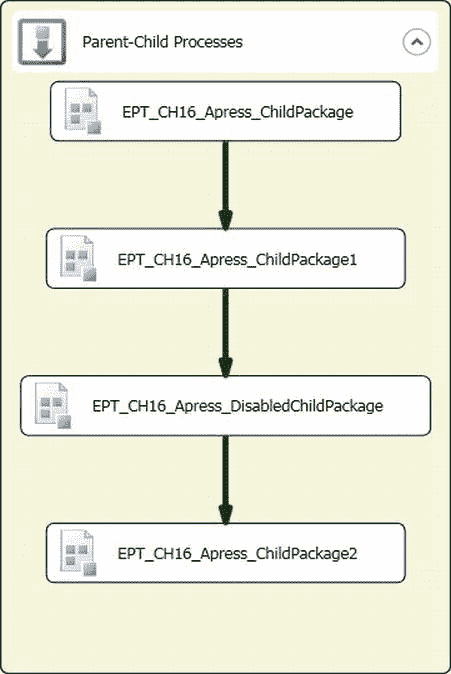

# 第 15 章：数据流调优与优化

此列并非最终输出到文本文件的一部分，实际上根本不需要被读入数据流。然而，使用 `SELECT *` 或表/视图数据访问模式会强制 SSIS 将其读入数据流，即使它稍后将被丢弃——这可能是对资源的昂贵浪费。

**提示：** 大对象（LOB）数据，例如 `varchar(max)`、`nvarchar(max)` 和 `varbinary(max)`，需要 SSIS 在后台进行特殊处理才能将其拉入数据流并进行处理。即使处理相对较小的 LOB 数据值，也会产生额外的开销。

正确的查询源数据的方法先前已在图 15-3 中展示。在修改后的示例中，我们已在源查询中指定了列列表，如下所示：

```sql
SELECT SalesTransactionID,
       SalesDate,
       StoreNumber,
       ReceiptNumber,
       ReceiptLineNumber,
       ItemEAN,
       ItemName,
       ItemCost
FROM dbo.SalesTransaction
WHERE SalesDate = CAST(GETDATE() AS DATE);
```

通过指定列列表，我们将输入列限制为仅在数据流中实际需要的列。

[www.it-ebooks.info](http://www.it-ebooks.info/)



### 使用执行树

每当您执行 SSIS 包时，它都会在后台生成一个*执行树*。执行树用于优化性能并为您的包构建执行计划。考虑图 15-5 所示的示例包。显示的每条路径都是执行树的一个分支。

*图 15-5. SSIS 执行树*

要捕获执行树，请在“日志配置”窗口中记录数据流任务的 `PipelineExecutionTrees` 事件。在 BIDS 的“日志事件”窗口中执行包时，您可以查看执行树。前面图像中显示的执行树在 SSIS 日志事件窗口中枚举如下：

```
路径 0
开始路径 0
FFS - Game Data.Outputs[Flat File Source Output]; FFS - Game Data
Derived Column.Inputs[Derived Column Input]; Derived Column
Derived Column.Outputs[Derived Column Output]; Derived Column
SRT - Sort Games.Inputs[Sort Input]; SRT - Sort Games
结束路径 0
```

路径 0 从平面文件读取数据，添加一个派生列，并将结果推送到排序转换的输入。使用同一个缓冲区将数据从平面文件源组件通过派生列转换移动到排序转换输入。

```
路径 1
开始路径 1
FFS - Weather Data 1.Outputs[Flat File Source Output]; FFS - Weather Data 1
SRT - Sort Weather 1.Inputs[Sort Input]; SRT - Sort Weather 1
结束路径 1
```

路径 1 从另一个平面文件读取数据并将其推送到排序转换的输入。

```
路径 2
开始路径 2
FFS - Weather Data 2.Outputs[Flat File Source Output]; FFS - Weather Data 2
SRT - Sort Weather 2.Inputs[Sort Input]; SRT - Sort Weather 2
结束路径 2
```

路径 2 从第三个平面文件读取数据并将数据推送到另一个排序转换输入。

```
路径 3
开始路径 3
MRG - Merge Weather.Outputs[Merge Output 1]; MRG - Merge Weather
MRJ - Join Games to Weather.Inputs[Merge Join Right Input]; MRJ - Join Games to Weather
结束路径 3
```

路径 3 将数据从合并转换的输出移动到合并联接转换的输入。

```
路径 4
开始路径 4
MRJ - Join Games to Weather.Outputs[Merge Join Output]; MRJ - Join Games to Weather
DST - Save Game Data.Inputs[OLE DB Destination Input]; DST - Save Game Data
结束路径 4
```

路径 4 将数据从合并联接转换的输出移动到 OLE DB 目标组件的输入。

```
路径 5
开始路径 5
SRT - Sort Games.Outputs[Sort Output]; SRT - Sort Games
MRJ - Join Games to Weather.Inputs[Merge Join Left Input]; MRJ - Join Games to Weather
结束路径 5
```

路径 5 将数据从排序转换的输出移动到合并联接转换的输入。

```
路径 6
开始路径 6
SRT - Sort Weather 1.Outputs[Sort Output]; SRT - Sort Weather 1
MRG - Merge Weather.Inputs[Merge Input 1]; MRG - Merge Weather
结束路径 6
```

路径 6 将数据从排序转换的输出移动到合并转换的输入。

```
路径 7
开始路径 7
SRT - Sort Weather 2.Outputs[Sort Output]; SRT - Sort Weather 2
MRG - Merge Weather.Inputs[Merge Input 2]; MRG - Merge Weather
结束路径 7
```

路径 7 将数据从另一个排序转换的输出移动到合并转换的输入。

在查看数据流执行树时，一个显而易见的事情是，只要 SSIS 确定需要新的缓冲区，就会生成新的路径。这基本上发生在遇到异步转换时。如果 SSIS 可以在组件周围为输入和输出使用相同的缓冲区（同步转换），它会将其添加到现有路径。如果组件使用不同的输入和输出缓冲区（异步转换），它会在输入处结束现有路径，并在输出处创建一条新路径。这在性能方面很重要，因为异步转换必须分配新缓冲区并填充它们，这需要更多资源并导致性能下降。消除不必要的异步转换及其带来的性能损失可以大幅提升性能。例如，如果您能保证源数据已正确排序，就可以轻松移除排序转换来优化我们的示例包。

[www.it-ebooks.info](http://www.it-ebooks.info/)



**注意：** 有些组件似乎会生成缓冲区的多个副本，但实际上并非如此。`Multicast`、`Conditional Split` 以及新的 SQLCAT `Balanced Data Distributor` 转换都使用“缓冲区魔力”来看似在缓冲区之间移动数据并生成数据副本。实际上，它们本质上是在移动指针，而不是复制缓冲区中的行——这是一个高效得多的操作。

#### 在 BIDS 中高亮显示执行树

您可以通过在 BIDS 设计器中右键单击数据流路径箭头，并从上下文菜单中选择 **解析引用** 选项，来高亮显示执行树的整个路径。这将弹出新的列映射对话框。如果您将此对话框移开，您将看到该路径被高亮显示，如图 15-6 所示。这是在 BIDS 中编辑包时可视检查数据流路径的一种便捷方法。

*图 15-6. 在 BIDS 编辑器中高亮显示执行树路径*

[www.it-ebooks.info](http://www.it-ebooks.info/)

### 实现并行性

在多处理器服务器上，您可以实现的最大性能优势之一是并行性。在包中，您可以实现多个并行执行的数据流，甚至在同一数据流任务中实现多个数据流路径。为了充分利用并行执行，您必须围绕服务器的资源限制进行规划。

`MaxConcurrentExecutables` 包设置指定了 SSIS 将在包中并行执行的最大线程数。默认值为 –1，这使 SSIS 能够动态地将该值设置为逻辑处理器数加 2。如果您运行 SSIS 的服务器上还有其他进程在运行（例如 SQL Server），您可能需要将此属性设置为较低的值，以避免 CPU 资源冲突。


在并行化包时，内存是另一个需要处理的约束条件，特别是当同一服务器上还有其他进程在运行时。SSIS 会在执行开始前自动使用元数据来调整缓冲区大小，但在执行过程中仍有可能耗尽内存。如果你并行运行多个数据流任务，让大量数据通过异步或阻塞转换时，情况尤其如此。例如，我们偶尔会看到包含并行数据流的包因为内存不足而失败，这并不罕见，特别是当这些数据流包含查找转换且有大量引用数据被缓存时。

> **提示：** 虽然你可以通过调整 `DefaultBufferMaxRows` 和 `DefaultBufferSize` 设置来影响缓冲区大小，但更改它们带来的收益并不大。SSIS 会自动为你调整缓冲区大小，而且做得很好。本章中的其他建议以所需的工作量来说，能提供更多益处。

数据库表争用也是你并行化计划中需要考虑的一个重要因素。例如，如果你想要并行化一个目标操作，请考虑这可能对目标表造成的争用，并相应地进行规划。多年来，我们解决了许多由于多个数据流任务试图并行输出到同一目标表而引起的包性能问题乃至彻底失败的情况。

最后，决定要并行化哪些操作也很重要。例如，如果你正在加载一个数据集市，你可能会并行加载多个维度表。如果某个维度表的行数极大，你可能会决定并行化该数据流路径的目标加载操作。

### 适可而止

在优化 SSIS 包时，事先决定“足够好”的标准是很重要的。在什么情况下你会认为你的包已经足够高效了？如同任何软件优化一样，收益递减定律也适用于 SSIS 优化：当你试图从代码中挤出越来越小的性能提升时，所涉及的难度和复杂性也会增加。请注意，我们说的是“性能”，而不是“速度”。原始速度只是衡量整体性能的一个单一因素，而性能是一个更准确地衡量效率的指标，它包括了速度和资源使用两方面。

[www.it-ebooks.info](http://www.it-ebooks.info/)

## 第十五章 数据流调优与优化

在某些时候，试图从你的代码中挤出最后 100 毫秒所付出的努力是不值得的。同时，请记住 80/20 法则：专注于优化那消耗了你 80% 处理时间的 20% 的代码。

### 小结

本章介绍了一些用于优化 SSIS 包的工具和方法。这些优化中的许多都依赖于在可能的情况下在源头执行操作，并限制通过 ETL 过程拉取的数据量。本章还介绍了 SSIS 执行树以及通过并行化优化性能的一些关键点。在下一章中，你将了解强大的 SSIS 父母-子设计模式。

[www.it-ebooks.info](http://www.it-ebooks.info/)

## 第十六章 父母-子设计模式

*有一个孩子让你成为父母；有两个孩子，你就成了裁判。* —— 英国记者大卫·弗罗斯特

使用 SSIS，有几种方法可以将模块化编程引入你的 ETL 过程。最灵活的方法之一是使用父母-子设计。这种模式使你能够创建包来执行非常具体的任务。如果这些任务需要被禁用，这种设计模式允许你利用参数绑定在包级别禁用功能。正如引言所暗示的，你的 ETL 过程越复杂，父包所扮演的组织角色就越重要，而不仅仅是调用另一个包的角色。

当采用清晰的设计时，ETL 过程可以变得越来越透明。本章介绍使用父母-子设计模式的一些好处，并向你展示如何在自己的过程中实现它。你还将看到实现该设计模式的不同方式，让你可以选择最适合你需求的那一种。

### 理解父母-子设计模式

简而言之，父母-子设计模式指的是任何使用一个 SSIS 包来执行另一个包的 ETL 过程。这可以通过使用“执行包任务”来完成，甚至可以通过调用 `dtexec.exe` 工具来使用“执行进程任务”。我们的建议是坚持使用“执行包任务”，因为它能让你比“执行进程任务”更容易地配置子包的执行。图 16-1 展示了一个静态父包的样子。我们称之为 *静态包*，因为 ETL 结构的任何变更，或者包的添加和删除，都需要修改这个包。

[www.it-ebooks.info](http://www.it-ebooks.info/)



**图 16-1. 静态父包示例**

静态包在开发时，每个任务都有自己的独立设置。只有当执行过程不会改变时，才建议使用这种父母-子设计模式的实现方式。维护和更新这种实现方式可能会很快变得极具挑战性。第三个可执行文件 `EPT_CH16_Apress_DisabledChildPackage` 与其他三个可执行文件具有不同的配置。为了在执行时禁用该包，我们从父包 `CH16_Apress_StaticParentPackage.dtsx` 传递一个布尔变量，绑定到子包的 `Disable` 包属性参数。我们将在本章后面介绍参数传递。这种父母-子设计模式的静态实现与 SQL 代理作业中的步骤非常相似。

所有包都包含一个脚本任务，该任务显示一条简单的消息以表明包已执行。代码清单 16-1 显示了非禁用子包中包含的 C# 代码。它显示了一条简单的消息，通知你已执行的子包名称。正如你可以从所使用的变量推断出的那样，我们将 `System::PackageName` 列为脚本任务 `ReadOnlyVariables` 属性的唯一可用变量。

[www.it-ebooks.info](http://www.it-ebooks.info/)

#### 代码清单 16-1. 子包脚本任务

```
MessageBox.Show("The current package's name is: " +
    Dts.Variables["System::PackageName"].Value.ToString()+"\n");
```

被禁用子包的脚本略有不同，目的是提醒你此包不应被执行。包含此示例是为了演示使用动态父母-子设计模式配置 ETL 过程的简便性。代码清单 16-2 提供了被禁用子包中的脚本。此消息框内包含一条简短消息，提醒你不应该看到此消息。

#### 代码清单 16-2. 被禁用子包脚本任务

```
MessageBox.Show("The current package's name is: " +
    Dts.Variables["System::PackageName"].Value.ToString()+"\n"+
    "This package is supposed to be disabled. If you are seeing this message, the parameters were not assigned the proper values.");
```

父母-子设计包背后的模块性可以用以下术语来描述：父包控制整个 ETL 过程。其主要职责是执行所有必要的包。包装器包控制一个较小的子集，其重点应是处理某个特定过程。包装器包要么由父包直接调用，要么由其他包装器包调用。例如，一个包装器包可用于执行负责预处理源或执行加载后处理的包。


