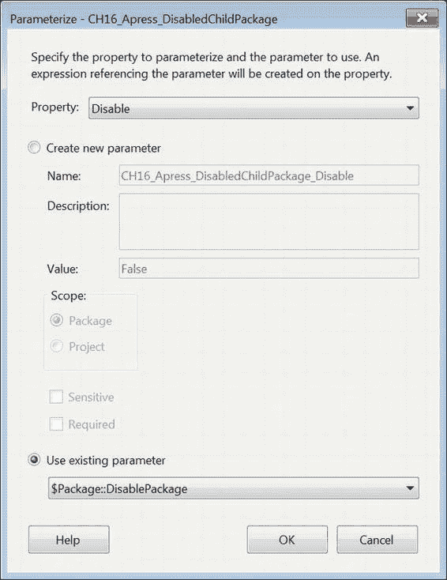
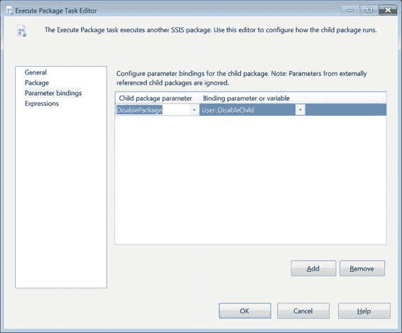

# 第 16 章 – 父子设计模式

子包控制实际任务的处理。这些包是父子设计模式中的工作主体，由包装器包调用。

在示例中，为了简化，我们将父包和包装器包的概念结合在一起。包装器包背后的理念是隔离构成您 ETL 需求的不同流程。

### 使用参数传递值

参数对于父子设计模式至关重要。在之前版本的 SSIS 中，值是通过配置传递的。在本版本的部署模型中，我们鼓励您使用参数在父包和子包之间传递值。图 16-2 演示了我们用来禁用子包的参数绑定。我们将包中定义的参数 `DisablePackage` 绑定到 `Disable` 包属性。我们甚至可以将参数绑定到子包内的任务属性。

[www.it-ebooks.info](http://www.it-ebooks.info/)

*图 16-2. 已禁用子包的参数绑定*

我们将子包参数化后，任何配置为执行该包的 `Execute Package` 任务都将能够识别其中定义的参数。参数的数据类型必须与属性的数据类型匹配。图 16-3 展示了使用 `Execute Package` 任务时参数的映射关系。

[www.it-ebooks.info](http://www.it-ebooks.info/)

*图 16-3. 子包的参数绑定*

`User::DisableChild` 变量是一个布尔型变量。它必须与子包参数的数据类型匹配。可以为包执行添加多个绑定。我们为 `User::DisableChild` 变量提供了 `True` 作为默认值。此映射仅出现在不应执行的包中。

> **注意：** 即使包属性 `Disable` 设置为 `True`，在调试模式下执行时，Visual Studio 也会打开包并验证它。包本身不会执行，但会被打开。

[www.it-ebooks.info](http://www.it-ebooks.info/)

### 处理共享配置信息

在诸如父子模式这样的设计模式中，连接管理器将会很多。为了尽量减少混乱，您可以利用项目连接管理器，这样使连接字符串保持同步会容易得多。创建一个项目连接管理器将在项目中的每个包内创建该连接管理器。

> **警告：** 在包中删除任何项目连接管理器都会将其从项目及项目中的所有包中删除。如果您发现误删了项目连接管理器且无法撤销操作，可以选择恢复它。您需要先创建同名的相同类型的连接管理器。创建项目连接管理器后，您必须右键单击它并选择 `查看代码`。这将打开一个 XML 脚本，显示连接管理器的所有属性。您需要关注的属性是 `DTS:DTSID`。当您打开任何包含引用已删除项目连接管理器的任务或源组件的包时，您会注意到名称被替换为一个 GUID。您可以复制该 GUID，并将新的项目连接管理器的 `DTS:DTSID` 替换为该 GUID。之后，保存项目管理器的 `代码` 页面并关闭它。重新打开任何已打开的包，它们的内容应该能够识别其连接管理器为新重新创建的项目连接管理器。

某些信息可以存储在项目参数中。因为参数值只能通过 T-SQL 更改，所以参数值几乎是只读的。可以使用 `SSISDB` 中的目录视图和存储过程来查看这些值。`SSISDB` 中的以下对象

数据库允许你在执行期间访问参数值：

`catalog.execution_parameter_values` 是一个视图，用于显示将在特定执行中使用的值。

`catalog.get_parameter_values` 是一个存储过程，用于显示和解析存储在 Integration Services 目录中项目中指定包的参数值。

`catalog.object_parameters` 是一个视图，显示参数的设计时默认值和服务器默认值。

### 覆盖属性

在新的部署模型中，通过使用参数而非配置来覆盖属性，简化了开发过程。你不再需要创建使用变量继承值的配置，然后再用变量值去覆盖属性，现在只需简单地将包参数绑定到那些属性即可。过去，子包需要配置来预期接收父包传递的值。这常常导致在测试目的下单独执行子包，甚至在 ETL 过程中一次性执行时出现问题。

`www.it-ebooks.info`

