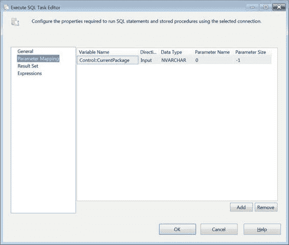
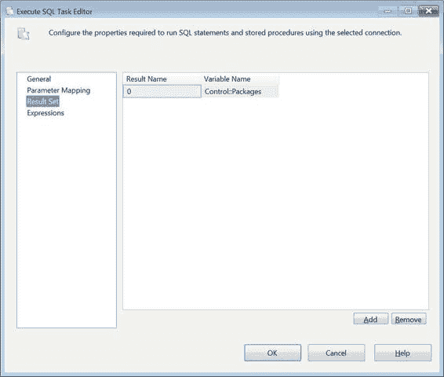
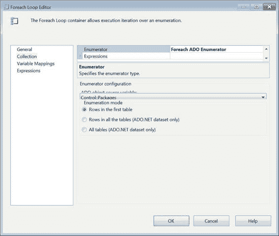
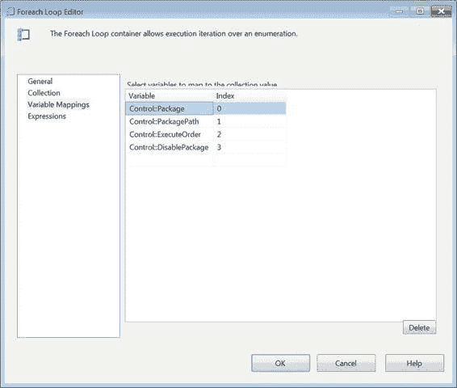
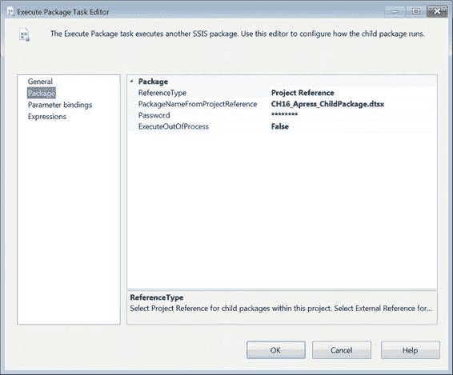
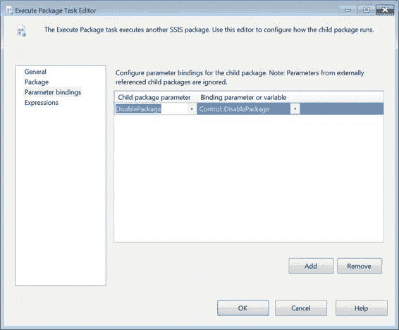
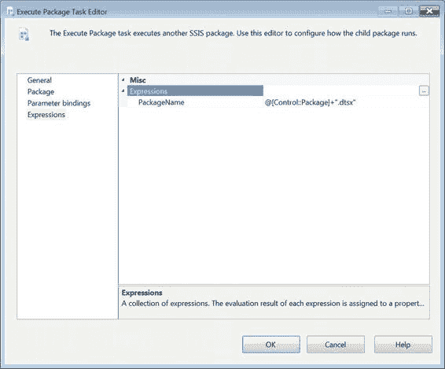
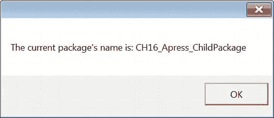
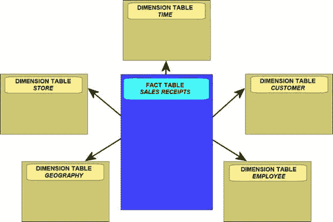
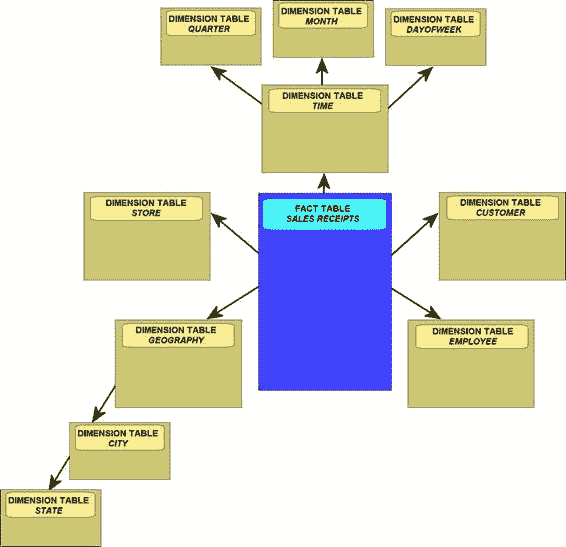

# 第 16 章 父-子设计模式

保持较大的间隔，这样您可以在执行列表中添加包，而无需费力更新多行。

`DisablePackage` 决定了包属性 `Disable` 将被设置为 `True` 还是 `False`。

我们将使用这种动态方法重新创建之前展示的示例。为了向表中填充正确的执行信息，我们运行如代码清单 16-4 所示的脚本。这些插入语句用与硬编码在 `CH16_Apress_StaticParentPackage` 中相同类型的信息填充我们刚创建的表。

### 填充 dbo.CH16_Apress_PackageExecution

```sql
INSERT INTO dbo.CH16_Apress_PackageExecution
(
Package
,PackagePath
,ParentPackage
,ExecuteOrder
,DisablePackage
)
VALUES
(
'CH16_Apress_DynamicParentPackage'
,'C:\Users\SQL12\Desktop\Integration Services Project1\Integration Services Project1'
,NULL
,0
,0
),
(
'CH16_Apress_ChildPackage'
,'C:\Users\SQL12\Desktop\Integration Services Project1\Integration Services Project1'
,'CH16_Apress_DynamicParentPackage'
,10
,0
),
(
'CH16_Apress_ChildPackage1'
,'C:\Users\SQL12\Desktop\Integration Services Project1\Integration Services Project1'
,'CH16_Apress_DynamicParentPackage'
,20
,0
),
(
'CH16_Apress_DisabledChildPackage'
,'C:\Users\SQL12\Desktop\Integration Services Project1\Integration Services Project1'
,'CH16_Apress_DynamicParentPackage'
,30
,1
),
(
'CH16_Apress_ChildPackage2'
,'C:\Users\SQL12\Desktop\Integration Services Project1\Integration Services Project1'
,'CH16_Apress_DynamicParentPackage'
,40
,0
);
GO
```

**注意：** 如果包存储在服务器上，文件系统路径就不那么重要了。在这种情况下，该过程将依靠项目引用来定位包。如果您的部署策略是将包存储在文件系统上，则需要修改此示例，包含一个 `脚本` 任务，该任务将修改用于定位子包的 `连接管理器` 的连接字符串。

如您所见，这与我们在 `CH16_Apress_StaticParentPackage` 中的执行顺序相同。

我们在所有 `ExecuteOrder` 值之间保留了 10 的间隔。数据就位后，我们可以看看动态包是如何工作的。图 16-4 显示了我们将用于控制包执行过程的变量。

### 图 16-4. CH16_DynamicParentPackage 变量

如您所见，我们为 `Package` 变量提供了一个默认值。这是为了当我们为 `执行包` 任务创建表达式时，它能够验证通过。我们基本上需要提供第一个将被执行的包的名称。我们还有一个变量，其名称包含当前包的名称。这是为了帮助我们查询表，以便只获取当前包的直接子包。图 16-5 显示了该示例动态版本的控制流。

### 图 16-5. CH16_Apress_DynamicParentPackage

`执行 SQL` 任务 `SQL_GetPackageList` 用于从 `dbo.CH16_Apress_PackageExecution` 检索数据。它包含一个参数化查询，如代码清单 16-5 所示。`Foreach 循环` 容器 `FELC_PackageExecution` 循环遍历由 `执行 SQL` 任务返回的数据集。`执行包` 任务在循环遍历表时简单地执行。

### SQL_GetPackageList 查询

```sql
SELECT pe.Package,
       pe.PackagePath+'\'+pe.Package+'.dtsx',
       pe.ExecuteOrder,
       pe.DisablePackage
FROM   dbo.CH16_Apress_PackageExecution pe
WHERE  pe.ParentPackage = ?
ORDER BY pe.ExecuteOrder;
```

`ORDER BY` 子句对于此过程至关重要。它将确保包按正确的顺序执行。没有它，就无法保证这一点。图 16-6 显示了 `执行 SQL` 任务的参数映射配置。请注意，数据类型和参数名称需要与提供的查询匹配。


**注意：** 一个额外的 `WHERE` 子句可以是 `pe.DisablePackage <> 1`。我们没有添加此子句是为了演示在此父子设计模式实现中参数绑定得以保留。有了该子句，您就不必担心包被 Visual Studio 打开和验证。它们将被简单地跳过。

[www.it-ebooks.info](http://www.it-ebooks.info/)



## 第 16 章 父子设计模式

*图 16-6. 参数映射 SQL_GetPackageList*

图 16-7 展示了 `SQL_GetPackageList` 任务的结果集页面。结果集存储在之前显示的 `Object` 变量中。有了这个结果集，我们现在就可以为 Foreach 循环容器提供所需的枚举器。

[www.it-ebooks.info](http://www.it-ebooks.info/)



*图 16-7. 结果集 SQL_GetPackageList*

图 16-8 显示了 `FELC_PackageExecution` 的集合页面。`Control::Packages` 变量被用作 `ADO` 枚举器。它将包含包的名称以及其他可用于 ETL 过程的重要信息。

[www.it-ebooks.info](http://www.it-ebooks.info/)



*图 16-8. FELC_PackageExecution 的集合*

图 16-9 展示了将接收来自表集中每条记录值的变量的配置。所有五列都已按照它们在 `SELECT` 语句中出现的顺序映射到五个不同的变量。除非所有列都映射到适当数据类型的变量，否则容器的配置将不会执行。

[www.it-ebooks.info](http://www.it-ebooks.info/)



*图 16-9. 变量映射 FELC_PackageExecution*

执行包任务 `EPT_ChildPackage` 的配置与静态示例中的包几乎相同。唯一的区别是，所有的执行都将具有这些配置，无论包在执行期间是否被禁用。图 16-10 显示了该任务的包页面。`Password` 属性保持其默认值，因为没有一个包实际设置密码。

[www.it-ebooks.info](http://www.it-ebooks.info/)



*图 16-10. 包页面 EPT_Package Execution*

如图 16-11 所示，参数绑定对于所有包都是相同的。您需要确保所有子包中至少有一个同名的参数。包属性的参数绑定也应就位于所有子包中。此参数映射与之前图 16-2 中显示的相同。

[www.it-ebooks.info](http://www.it-ebooks.info/)



*图 16-11. 参数绑定 EPT_PackageExecution*

图 16-12 展示了真正使这一切成为可能的表达式。绑定到 `PackageName` 属性的表达式在 Foreach 循环容器的每次迭代时都会刷新。变量 `Control::Package` 不断地从执行 `SQL` 任务结果集的 `Package` 列中更新值。表达式 `@[Control::Package]+".dtsx"` 执行字符串连接，这对于该属性是可接受的，以便可以在项目中找到相应的包。

我们为变量提供了一个默认值，因为父包需要验证此类包的存在。当您在 Visual Studio 中打开父包时，它将尝试查找与表达式计算结果对应的包名。如果没有默认值，父包将尝试连接到一个名为 `.dtsx` 的包。在运行时，这将导致验证阶段失败。

[www.it-ebooks.info](http://www.it-ebooks.info/)



*图 16-12. 表达式页面 EPT_PackageExecution*

完成此配置后，您需要做的就是执行 `CH16_Apress_DynamicParentPackage`。

它将像静态示例一样自动执行子包。两种方法之间的唯一区别是执行过程的管理以及包的添加变得更容易。当您在 Visual Studio 的调试模式下执行此包时，您将看到类似于图 16-13 中的消息框。

[www.it-ebooks.info](http://www.it-ebooks.info/)



*图 16-13. 子包消息框*

### 总结

在设计 ETL 过程时，牢记代码的可维护性非常重要。父子设计模式提供了一种灵活的方法，可以将您的 ETL 包模块化，使您能够轻松地向过程中添加或删除包或可执行文件，而无需大量代码更改。静态实现将使代码模块化，但如果包在不断开发，则并不理想。动态父子实现允许您让数据驱动您的 ETL 过程。我们使用了表驱动过程的例子。本书的关于设计模式的部分到此结束。下一节将介绍 SSIS 的更高级功能和能力。

[www.it-ebooks.info](http://www.it-ebooks.info/)

## 第 17 章 维度数据 ETL

*我们不在第八维度；我们在新泽西州上空。希望尚未破灭。*
— *冒险家 Buckaroo Banzai*

在 21 世纪的第一个十年里，“数据仓库”和“数据集市”这些术语突然且毫无预警地被复制粘贴到每个数据库专业人士的简历上。尽管专业社区的认知度明显提高，但这些结构的核心组件——维度表和事实表——仍然被误解。在本章中，您将了解如何高效地将数据加载到维度结构中。您将从本章通篇使用的术语和概念介绍开始。

### 介绍维度数据

到目前为止，大多数数据库专业人士都接触过*维度数据*。对于那些不是每天使用它的人来说，这个术语可能有点误导性。它并不是真正指数据本身的任何特殊属性，而是指用于存储它的*维度模型*。具体来说，维度数据存储在*维度数据集市*中。数据集市是关系数据库，遵循以下两种逻辑结构之一：*星型模式*或*雪花模式*。这两种逻辑结构都由两种类型的表组成：

事实表包含业务度量数据，例如销售数量和金额。
维度表保存与存储在事实表中的度量相关的属性，例如产品颜色和客户名称。

星型模式的特点是有一个事实表（或可能是多个事实表）与非规范化的维度表相关联。图 17-1 展示了一个示例星型模式的逻辑设计，该模式保存零售店的销售收据数据。

[www.it-ebooks.info](http://www.it-ebooks.info/)



*图 17-1. 星型模式数据集市*

在星型模式中，维度被“展平”为非规范化的表。雪花模式是一种类似于星型模式的逻辑结构，但具有规范化或*雪花化*的维度。图 17-2 展示了前一个星型模式中时间和地理维度的雪花化。

[www.it-ebooks.info](http://www.it-ebooks.info/)



*图 17-2. 具有雪花化维度的数据集市*

由于性能和复杂性，星型模式更受青睐，但并非总是可能将 OLAP 数据库建模为此类结构。


