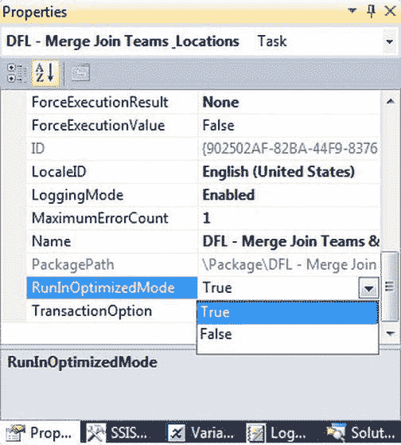
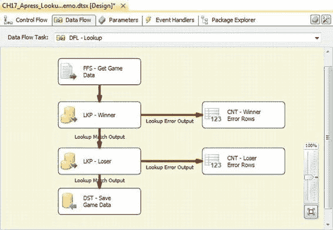

# 第 17 章 维度数据 ETL

数据集市通常由上游系统（如规范化数据仓库和其他数据库）提供数据。反过来，数据集市又用于为 OLAP 数据库（如 SQL Server Analysis Services 多维数据集）提供数据，或直接用于报告和分析查询。

### 数据仓库、操作数据存储及其他流行术语

除了*数据集市*之外，还有许多其他与商业智能相关的流行术语。例如，*数据仓库（DW）*和*操作数据存储（ODS）*就是其中两个。数据仓库是一个集中的数据存储库，数据来自操作系统，专为分析和报告而设计。

根据你所遵循的理论体系，你可能会以第三范式构建数据仓库（这是 Bill Inmon 提倡的`自上而下方法`），或者你可能会构建几个共享维度的维度数据集市（这是 Ralph Kimball 偏好的`自下而上方法`）。

数据仓库旨在保存整个组织的高质量历史数据，通常比最低级别的交易细节更高一级，并且时间跨度非常长。而另一方面，操作数据存储则设计用于在较短时间内保存变化更频繁的操作型数据。ODS 常用于为数据仓库提供数据。

就维度数据而言，重要的一点是，ODS 和数据仓库通常用于向维度数据集市提供数据（Kimball 模型除外，在该模型中，数据仓库是多个数据集市的并集）。实现数据仓库和操作数据存储的细节超出了本章的范围，但你可以在 Bill Inmon 的著作*《Building the Data Warehouse》*（John Wiley & Sons, 2005）和 Ralph Kimball 的著作*《The Data Warehouse Toolkit》*（John Wiley & Sons, 2002）中了解更多信息。

### 快速见效

当你的老板说希望你优化一个 ETL 过程（或任何系统）时，你通常可以将其理解为“进行边缘调整”。考虑到这一点，我们将介绍一些能带来最大收益的快速更改。

#### 以优化模式运行

SSIS 中的数据流任务有一个名为`RunInOptimizedMode`的设置。将此属性设置为`True`会导致数据流通过自动移除未使用的列、输出和组件来优化任务。在生产包中，此属性应始终设置为`True`。仅在调试或非常特定的故障排除场景中才应设置为`False`。你也可以在 SSDT 项目属性中设置`RunInOptimizedMode`。在 SSDT 中的此属性设置会覆盖单个数据流任务的设置（当你在 SSDT 中运行包时）——但仅在 SSDT 中有效。包的默认属性为`False`，允许你将数据流属性设置为`True`或`False`。

将项目属性改为`True`将避免更新任何或所有数据任务属性。图 17-3 显示了数据流任务的属性页。

#### 移除“死端”组件

在调试 SSIS 组件时，通常使用行计数组件代替错误输出的目的地。在许多情况下，行计数返回的值从未被使用。

考虑如图 17-4 所示的示例数据流。

在此示例数据流中，我们将查找转换的错误行发送到行计数转换。在这种情况下，我们并未使用行计数返回的值，但 SSIS 仍然必须将不匹配的行沿着该分支移动到组件中。这是此数据流中不必要的低效。修复这个问题很简单，只需删除这些死端行计数组件即可。

#### 保持包体积小巧

主要由于初始化包所涉及的开销（包括分配缓冲区以及自动验证和优化），执行一个大型包可能比执行多个小型包以达到相同最终结果消耗更多的时间和资源。通过保持包体积小巧，SSIS 可以更高效地执行它们。关于包大小没有硬性规定，但 SSIS 专家 Andy Leonard 建议将单个包的文件大小保持在 5 MB 或以下。也可以识别在多个包中运行的常见 SSIS 任务，并将这些任务创建成更小的包，作为子包使用，然后可以从一个或多个父包中调用。这有助于封装逻辑并提供可重用组件，从而减少开发工作。第 18 章将更深入地讨论这个主题。请注意，保持 SSIS 包体积小巧，你还能获得在 SSDT 中更快加载和验证的好处。

#### 优化查找

优化数据流中的查找转换主要有三种方法。第一种优化技术是使用 SQL 查询来填充查找转换，而不是使用“表或视图”填充模式。“表或视图”模式会从数据库表中提取所有行和列。在许多情况下，查找转换不需要所有这些列。使用 SQL 查询模式，你可以将结果限制为仅包含指定的列列表。提取数兆字节（或更多）无关数据然后立即丢弃，这是毫无意义的。

查找转换的第二种优化技术涉及重用你的查找参考数据。如果你需要对同一组参考数据进行多次查找，在一个包中往返数据库两、三或多次来拉取此数据是资源的浪费。相反，使用缓存转换并加载一次该参考数据。

我们针对查找转换的第三种优化技术是将其移除。你可以通过在服务器端（在你的源查询中）执行连接，或使用合并连接转换来实现这一点。

虽然查找转换在技术上不被归类为*阻塞*转换，但它对性能的影响实际上可能比此组中的转换更*糟糕*。查找转换的问题在于，你的数据流甚至要在查找完成其参考数据的缓存后才会开始移动数据。而合并连接转换是部分阻塞的，允许数据以更高效的方式流动。

#### 保持数据持续流动

ETL 效率的黄金法则是“保持你的数据持续流动”。数据不流动于数据流中的每一秒，都是永远无法挽回的处理时间损失。正如我们在第 15 章讨论的，要保持数据流动，你应该最小化阻塞转换的使用，并考虑在可能的情况下在服务器端执行连接、排序和聚合操作。

此外，考虑使用 SQL Server 的`FAST`查询提示。通过对长时间运行的源查询应用`FAST`查询提示，SQL Server 将向 SSIS 发送一批初始行，让数据流得以继续。理想情况下，当这些初始行在你的数据流中穿行时，SQL Server 会向源组件提供更多行。此提示对于为复杂数据流提供数据的长时间运行查询特别有用。

**提示：** 你可以在 http://msdn.microsoft.com/en-us/library/ms181714.aspx 了解更多关于 SQL Server 查询提示的信息。

#### 最小化日志记录

