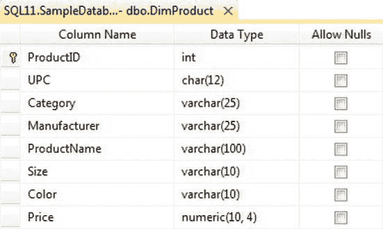
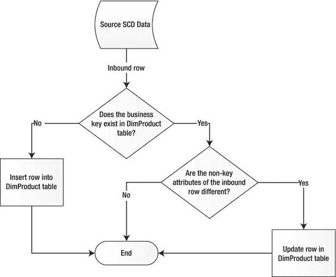
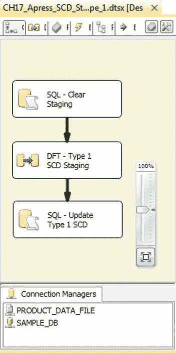
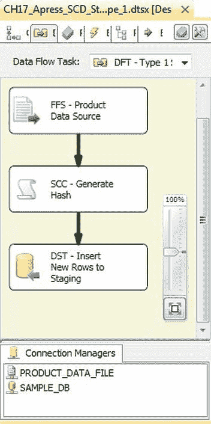

# 日志记录最佳实践与维度数据 ETL

我们已经在第 13 章讨论了日志记录的最佳实践。其核心思想是：记录处理信息需要消耗资源。日志记录会占用 I/O、网络带宽、内存，甚至一点 CPU。虽然你不希望完全消除日志记录，但你的生产环境日志设置应以记录监控和排查 ETL 流程所需的最少信息为目标。

[www.it-ebooks.info](http://www.it-ebooks.info/)

### 使用快速加载选项

我们在第 7 章讨论了适用于`OLE DB`和`SQL Server`目标适配器的快速加载和批量插入选项。在向`SQL Server`表插入行时，尽可能使用这些选项。快速加载选项比单次一行往返服务器的效率高得多。

### 理解缓慢变化维度

*缓慢变化维度（SCDs）* 是本章前面讨论的维度在物理上的实现。基本上，`SCDs` 将 *维度* 放入你的维度数据中。`SCDs` 主要分为四种类型，我们将在以下各节中讨论。

#### 类型 0 维度

*类型 0 维度*，也称为 *非变化维度* 或 *变化极其缓慢的维度*，有两种形式：

- 属性 *从不* 变化的维度（如性别维度）
- 属性 *极少* 变化的维度（如美国州维度）

类型 0 维度通常通过加载脚本一次性填充。对这些维度的偶尔更新通常只是添加记录的操作，也可以通过一次性脚本来执行。例如，考虑一个包含 10 年日期的日期维度。你可能需要向该维度再添加 10 年的日期属性，但这不会影响现有条目。考虑到这一点，我们对类型 0 维度的最佳建议是：用静态的一次性脚本填充它们，并在必要时用脚本更新。

#### 类型 1 维度

除了非变化维度，*类型 1 SCDs* 是最简单的维度实现类型——它们不需要存储历史属性值。当类型 1 `SCD` 中的属性发生变化时，你只需用新值覆盖旧值。标准的类型 1 `SCD` 实现包括存储一个代理键（`SQL Server`中的`IDENTITY`列非常适合此目的，`SQL 2012`中引入的`SEQUENCE`同样适用）、传入维度属性的业务键以及维度属性值本身。考虑如图 17-5 所示的`DimProduct`类型 1 `SCD`表。

[www.it-ebooks.info](http://www.it-ebooks.info/)





**图 17-5. DimProduct 类型 1 维度表**

`DimProduct`表保存描述所有产品的条目。在此示例中，`ProductID`是代理键，`UPC`是业务键，其余列保存属性值。类型 1 `SCD`的更新模式很简单，如图 17-6 的流程图所示。

**图 17-6. 类型 1 SCD 更新流程图**

[www.it-ebooks.info](http://www.it-ebooks.info/)

更新类型 1 `SCD`的过程是一个基于业务键的简单 *upsert*（更新或插入）操作。如果传入行的业务键在维度表中存在，则更新；如果键不存在，则插入。有几种实现类型 1 `SCD`更新的方法：

- 你可以手动构建自己的数据流，执行必要的比较以及单独的更新和插入。
- 你可以创建一个`SSIS`自定义组件，或使用预先构建的自定义组件来完成这项困难的工作。
- 你可以将原始数据插入到暂存表中，然后使用基于集合的`MERGE`语句合并到维度表中。
- 你可以使用`SSIS`缓慢变化维度向导来构建你的`SCD`更新数据流。

决定使用哪种方法时，你需要回答的主要问题是：在哪里可以最有效地执行必要的维度成员比较——在数据流中还是在服务器上？一般来说，最有效的比较可以在`SQL Server`端执行。

考虑到这一点，我们将跳过手动构建数据流的方法，因为它往往是效率最低且最容易出错的方法。如果你对此选项感兴趣，我们建议使用缓慢变化维度向导来构建一个原型。这将使你更好地理解如何使用数据流来更新你的`SCD`。我们将在本节后面考虑缓慢变化维度向导。

使用预先构建的`SSIS`自定义组件（或构建你自己的）是另一个可行的选择，但它超出了本章的范围。我们建议查看`CodePlex` (www.codeplex.com) 上的一些示例，以了解这些组件如何工作。

我们（在没有自定义组件的情况下）首选的方法是将你的维度加载到暂存表中，并直接在服务器上执行维度更新。基于集合的更新是更新维度数据最有效的方法。图 17-7 中的控制流显示了基于集合的类型 1 `SCD`更新的基本布局。

[www.it-ebooks.info](http://www.it-ebooks.info/)



**图 17-7. 基于集合的类型 1 SCD 更新包**

该过程的第一步是使用执行 SQL 任务截断暂存表：`TRUNCATE TABLE Staging.DimProduct;`

下一步是数据流，它只是将产品维度数据从源移动到暂存表，如图 17-8 所示。

[www.it-ebooks.info](http://www.it-ebooks.info/)



**图 17-8. 加载暂存表的数据流**

平面文件源从平面文件提取产品维度，`OLE DB`目标将数据推送到暂存表。在这之间，有一个额外的步骤，在数据流中为每一行数据生成一个`SHA1`哈希码。

#### 哈希码

*哈希码* 是数据的固定长度“指纹”。当你将数据推送到单向哈希算法时，它会生成一个唯一的代码，可用于比较目的。与单向哈希的比较比逐个比较传入数据的多个列要高效且易于管理得多。`SHA1`哈希函数生成一个 160 位的哈希码，并被认为是“无碰撞的”。这意味着从不同数据生成重复哈希码的情况极其罕见（实际上，几率是 2⁸⁰ 分之一）。为了获得更低的碰撞几率，你可以使用`SHA2`家族的哈希函数，其范围从 2¹²⁸ 分之一到 2²⁵⁶ 分之一。

[www.it-ebooks.info](http://www.it-ebooks.info/)

我们用来生成哈希码的`.NET`代码非常高效，使用了`MemoryStream`和`BinaryWriter`，如下面的代码片段所示。

```csharp
public class ScriptMain : UserComponent
{
    MemoryStream ms;
    BinaryWriter bw;
    SHA1Managed sha1;

    public override void PreExecute()
    {
        base.PreExecute();
        sha1 = new SHA1Managed();
    }

    public override void PostExecute()
    {
        base.PostExecute();
    }

    public override void Input0_ProcessInputRow(Input0Buffer Row)
    {
        ms = new MemoryStream();
        bw = new BinaryWriter(ms);

        if (Row.UPC_IsNull)
        {
            bw.Write((Int32)0);
            bw.Write((byte)255);
        }
        else
        {
            bw.Write(Row.UPC.Length);
            bw.Write(Row.UPC);
        }

        bw.Write('|');
        // ...将额外列写入 BinaryWriter

        byte[] hash = sha1.ComputeHash(ms.ToArray());
        Row.Hash = hash;

        ms.Dispose();
        bw.Dispose();
    }
```


