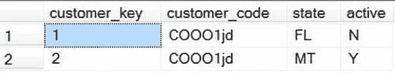
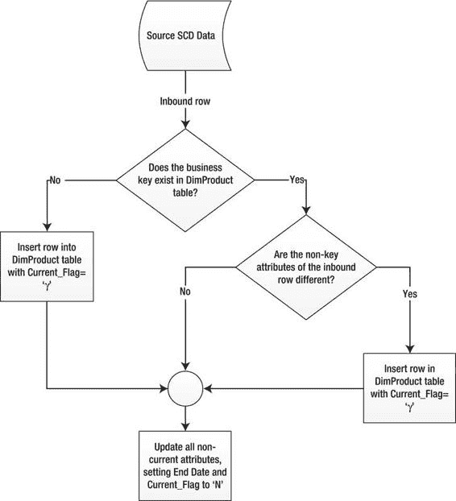
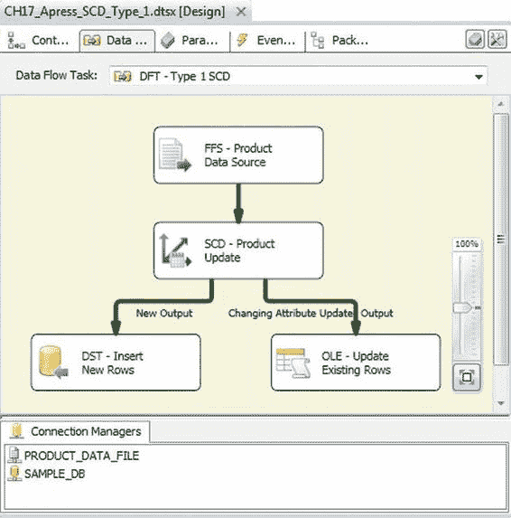
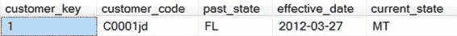

# 第 17 章：维度数据 ETL

所有列都通过`BinaryWriter`写入，格式为列长度后跟实际值。对于`NULL`值，则写入长度零，后跟一个单字节值（这是入站数据中无法生成的值）。每列之后都有一个竖线分隔符。连接后的二进制字符串随后被送入`SHA1`生成函数，输出结果被赋值给`Hash`列。

[www.it-ebooks.info](http://www.it-ebooks.info/)



### 类型 1 SCD 更新

类型 1 SCD 更新的最后一步是从暂存表到维度表执行一次更新或插入（upsert）操作。T-SQL 的`MERGE`语句非常适合这项工作。`MERGE`语句允许你在单个语句中执行`UPDATE`和`INSERT`操作，如下所示：

```sql
MERGE INTO dbo.DimProduct AS Target
USING Staging.DimProduct AS Source
ON Target.UPC = Source.UPC
WHEN MATCHED AND Target.Hash <> Source.Hash
THEN UPDATE SET Target.Category = Source.Category,
                Target.Manufacturer = Source.Manufacturer,
                Target.ProductName = Source.ProductName,
                Target.Size = Source.Size,
                Target.Price = Source.Price,
                Target.Hash = Source.Hash
WHEN NOT MATCHED
THEN INSERT (UPC, Category, Manufacturer, ProductName, Size, Price, Hash)
VALUES (Source.UPC, Source.Category, Source.Manufacturer, Source.ProductName, Source.Size, Source.Price, Source.Hash);
```

`NOTE:` `MERGE`提供了一种在单个语句中整合`INSERT`、`UPDATE`和`DELETE`操作的方法。然而，将这些步骤分离到单独的语句中可以提高整体性能。请比较两种方法的成本，以确保使用最高效的查询。

类型 1 SCD 的一个显著缺点是，更新当前值会丢失历史值。但是，只要不维护长期历史记录，这种更新过程比类型 2 或类型 3 SCD 更简单，并且占用空间也更少。

### 类型 2 维度

由于类型 2 维度维护了属性值的长期历史记录，因此管理起来比类型 1 维度稍微复杂一些。类型 2 SCD 表的模式与类型 1 SCD 的不同之处在于，它可以包含最多三个额外的列来表示当前版本或历史版本。这些额外的列允许维度表包含历史值，而不是用当前值覆盖受影响的列。维度可以包含一个单独的列来指示该行是否具有最新的值，如图 17-9 所示。

*图 17-9. 类型 2 SCD 结果集*

虽然新的或更新的值总是插入到类型 2 维度中，但现有行上还有其他标志也必须更新，例如生效日期、结束日期或活动状态列。

[www.it-ebooks.info](http://www.it-ebooks.info/)



添加一个仅指示该行是否为最新记录的列，可以确保保留所有历史更改，但无法定义特定行何时处于活动状态。同时添加一个活动状态列和一个结束日期列，则可以提供维护历史值的方法，以便随后将其与适当的时间段关联起来。

`Active`列表示该行是否持有当前值，但缺乏跟踪这些值何时生效的能力。维度表可以包含开始日期和结束日期列，以维护历史值及其对应的时间段，当结束日期为`NULL`时代表当前值；或者可以包含一个生效日期列和一个表示活动或历史状态的列。类型 2 SCD 的更新过程如图 17-10 所示。

*图 17-10. 类型 2 SCD 更新流程*

[www.it-ebooks.info](http://www.it-ebooks.info/)



`SSIS`提供了一个数据转换任务，可用于类型 1 和类型 2 SCD。为类型 2 SCD 使用 SCD 转换任务的第一步是决定是通过使用简单指示符来标识当前和过期记录，还是通过使用生效日期来跟踪表中的更改。该组件原生不允许同时使用这两种方式，但你可以自定义输出来实现这一点。图 17-11 展示了在数据流中使用 SCD 转换任务。

*图 17-11. SSIS 缓慢变化维度组件*

### 类型 3 维度

类型 3 SCD 通过使用单独的列来跟踪更改，这限制了历史记录的数量，取决于可以添加到维度表中的列数。这显然存在限制，维度表开始看起来更像一个 Microsoft Excel 电子表格，如图 17-12 所示。

[www.it-ebooks.info](http://www.it-ebooks.info/)



*图 17-12. 类型 3 SCD 的查询结果*

实现类型 3 SCD 存在几个复杂之处——首要的是每次更新都需要修改表模式，这使其成为一种不太理想的跟踪历史属性的方法。由于类型 3 SCD 存在限制并且需要更改维度表的模式，`SCD 转换`任务不支持它。可以使用`执行 SQL`任务来自动更新类型 3 SCD，但如果在任何时刻维度表在`数据流`任务中被引用，它将基于模式更改而无法通过验证阶段。问题不仅仅在于维度的处理过程，还包括在`SSAS`多维数据集或报表中使用该维度时，同样会因为模式不断变化而出现问题。尽管使用类型 3 SCD 是一种选择，但更推荐使用类型 1 或类型 2 SCD。

### 小结

本章介绍了几种优化`SSIS`包的工具和方法。其中许多优化依赖于尽可能在源执行操作，并限制通过`ETL`过程提取的数据量。我们还讨论了不同类型的维度，并概述了每种维度的更新方法。在下一章中，我们将探讨强大的`SSIS`父子设计模式。

[www.it-ebooks.info](http://www.it-ebooks.info/)

