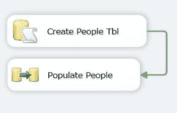
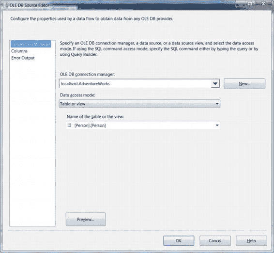
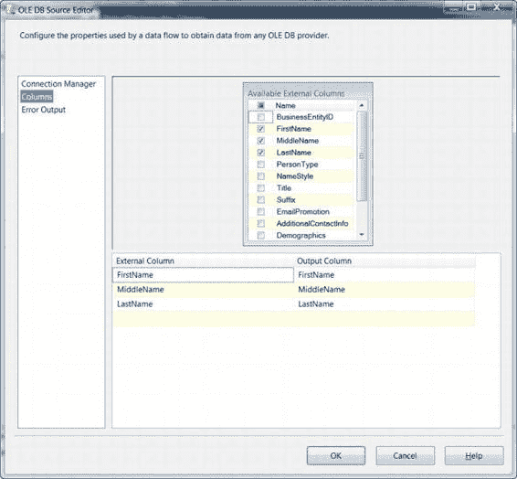
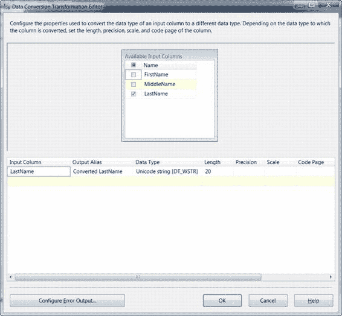

# 第 18 章 构建稳健的解决方案

### 关键因素

*   **动态性**：基于一组规则而非静态数字、路径或连接，处理动态流体环境的能力。
*   **问责制**：记录包内步骤行为的能力，允许跟踪历史性能。
*   **可移植性**：轻松将包部署到不同环境，而无需彻底检修每个步骤和连接的能力。

在包开发期间考虑这些因素，可以简化故障排除、部署/迁移以及历史性能跟踪。

### 弹性

错误可能因各种原因在 SSIS 任务中发生，其处理方式取决于具体任务。例如，`脚本`任务可以使用`try-catch-finally`块轻松高效地处理错误，并能提供动态错误处理手段，而`FTP`任务的主动错误处理手段则有限。为确保弹性，任务应提供先发制人的错误处理手段，以及在错误处理后重新处理任务的方法。

### 数据流任务

最常用的 SSIS 任务之一，也是较难融入错误处理的任务之一。`数据流`任务是 ETL 过程的支柱，但在数据流内部缺乏真正的结构化错误处理。一个典型的例子就是从源或转换到目标时发生的截断错误。在这种情况下，无法动态处理错误，但可以将受影响的行重定向到另一个目标，在那里可以进行额外的评估以确保成功导入。

这可以通过创建一个包含`执行 SQL`任务和`数据流`任务的包来轻松演示，这两个任务通过`执行 SQL`任务的“成功时”优先约束连接。`执行 SQL`任务（重命名为`创建人员表`）将使用以下查询在默认实例中使用`AdventureWorks 2012`数据库创建一个目标表：

```sql
IF NOT EXISTS( SELECT * FROM sys.tables WHERE name = 'People')
BEGIN
    CREATE TABLE People(
        FirstName NVARCHAR(50),
        MiddleName NVARCHAR(50),
        LastName NVARCHAR(21)
    )
END;
GO
```

配置完`执行 SQL`任务后，将`数据流`任务的名称更改为`填充人员`。包的控制流窗格应类似于图 18-1。

[www.it-ebooks.info](http://www.it-ebooks.info/)




**图 18-1. 控制流窗格中的数据流错误重定向**

在数据流窗格中，添加一个`OLE DB`源、`OLE DB`目标、`平面文件`目标和一个`数据转换`转换。`OLE DB`源应重命名为`AdventureWorks 人员`，并配置为连接到 SQL 的默认实例并使用`AdventureWorks 2012`数据库。在表选择下拉列表中，选择`Person`架构的`Person`表，如图 18-2 所示。

**图 18-2. 数据流源**

[www.it-ebooks.info](http://www.it-ebooks.info/)



在列中，应仅选择`FirstName`、`MiddleName`和`LastName`列，如图 18-3 所示。

**图 18-3. 选择数据流源列**

将数据流路径从`OLE DB`源连接到数据转换任务，并将该任务重命名为`转换姓氏`。在转换任务的编辑器中，从可用输入列中选择`LastName`，并将输出别名设置为`转换后的姓氏`，长度设置为 20。这将导致源中的一行被截断，如图 18-4 所示。

[www.it-ebooks.info](http://www.it-ebooks.info/)



**图 18-4. 数据转换任务**

要配置错误输出，首先通过单击数据转换任务的`配置错误输出`按钮打开编辑器，并将`错误`和`截断`的值从“失败组件”更改为“重定向行”，如图 18-5 所示。

[www.it-ebooks.info](http://www.it-ebooks.info/)


