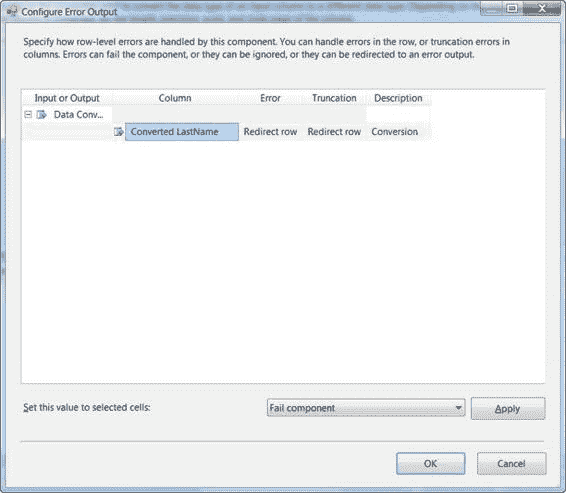
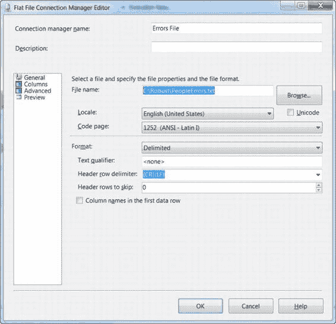
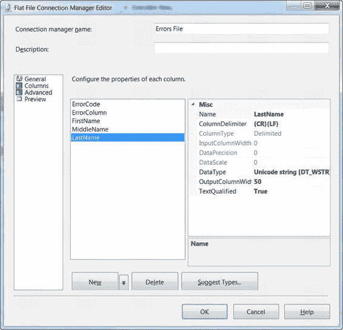
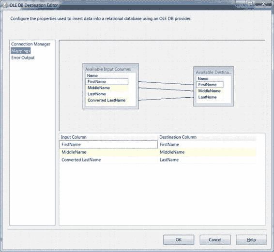
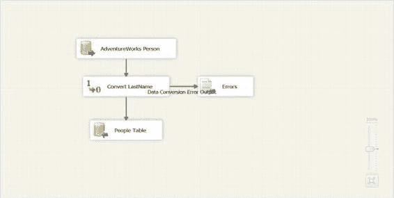
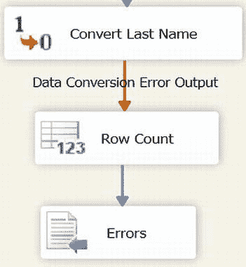
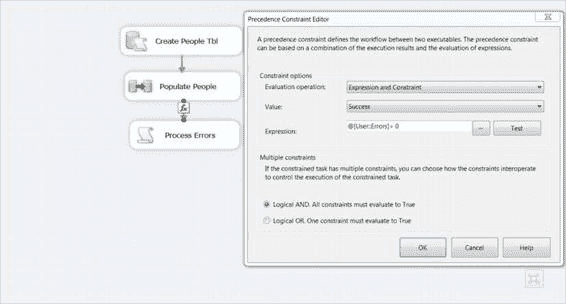

# 第 18 章 - 构建健壮的解决方案



将数据转换任务的错误流连接到平面文件目标，并将该目标命名为`Errors`。配置一个新的名为`Errors File`的`平面文件连接管理器`，以写入路径`C:\Robust\PeopleErrors.txt`，如图 18-6 所示。

[www.it-ebooks.info](http://www.it-ebooks.info/)



为确保不会因为从转换到`Errors`文件目标的截断而引发错误，请选择`高级`配置，并确保`LastName`列设置为`Unicode String`，列宽为 50，如图 18-7 所示。

### 注意
根据需要调整目标的文件名，以确保路径有效。

[www.it-ebooks.info](http://www.it-ebooks.info/)



最后，将数据流从`转换 LastName`转换任务连接到`OLE DB`目标。打开目标编辑器，将名称更改为`People Table`，并选择`dbo.People`表作为目标表。在映射编辑器中，将`LastName`输入映射列更改为`转换后的 LastName`列，如图 18-8 所示。

[www.it-ebooks.info](http://www.it-ebooks.info/)



最终的数据流窗格应类似于图 18-9。

[www.it-ebooks.info](http://www.it-ebooks.info/)



运行包时，数据流应显示有 19,971 行数据成功发送到`People Table`目标，一行数据发送到`Errors`平面文件目标。这样，`数据流`任务就不会因为单行数据的截断错误而失败，任务得以完成，该行数据仍可在平面文件目标中用于后续处理。

虽然此错误无法在`数据流`任务内部处理，但重定向的行不仅包含原始数据，还在平面文件目标中包含了错误代码和错误列，这确实提供了一种在`数据流`任务外部进行动态处理的方法。

通过整合各种包组件，仍然可以实现动态处理数据流错误的能力，尽管是在`数据流`任务外部。在`数据流`任务中，添加一个包级别的变量，并在`转换 LastName`数据转换和`错误计数`数据源之间使用一个`行计数`转换，这样就能利用`脚本`任务来后续评估错误平面文件。图 18-10 显示了`数据流`任务内的各个任务。图 18-11 展示了控制流窗格，其中使用表达式作为优先级约束来评估变量`Error`是否大于 0。

### 提示
确保重定向的行被发送到一个灵活的目标。创建一个与目标表模式相同的表，只会导致重定向的行再次因截断或约束错误而失败。除了失败的行之外，还可以将错误描述包含在一个额外的列中。

[www.it-ebooks.info](http://www.it-ebooks.info/)




如图 18-11 所示，只有当`填充人员数据流`任务成功完成，并且`行计数`转换递增了`Error`变量时，脚本组件才会执行。

以下代码展示了如何使用`脚本`任务，通过`TextFieldParser`类从文本文件解析重定向的错误行：

[www.it-ebooks.info](http://www.it-ebooks.info/)

```vb
Public Sub Main()
```


