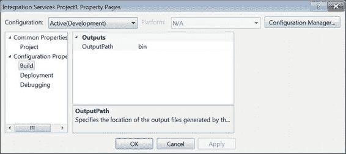
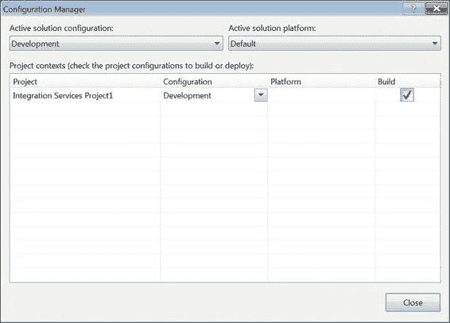
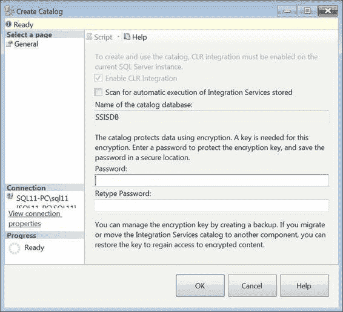
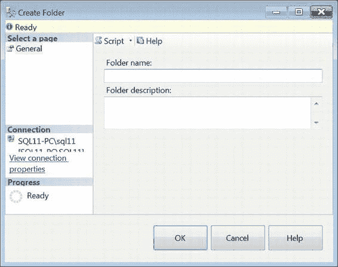
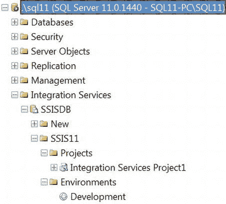
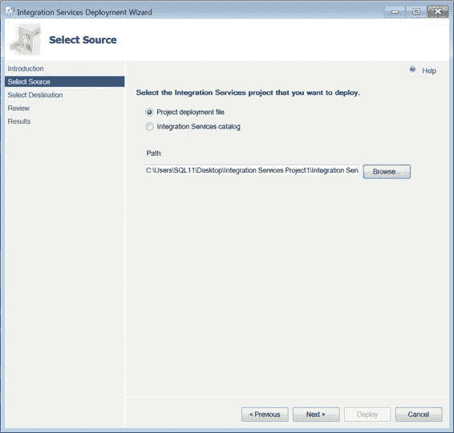
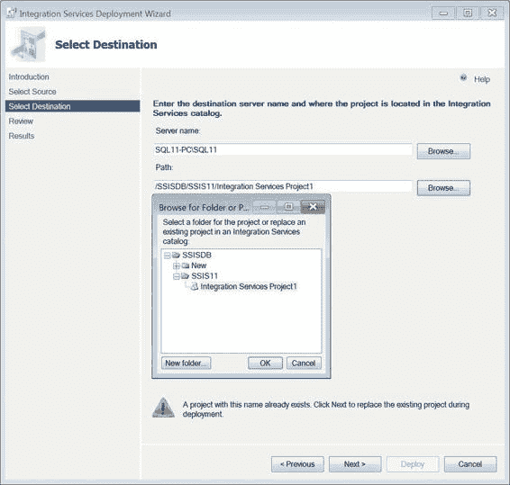

# 部署模型

在之前的版本中，单个包是部署对象。而在新的部署模型中，整个项目成为了部署对象。正如前面章节所述，参数和项目级连接管理器的引入促成了这种新的部署模型。这种新模型的一个优势是，它允许您在 SQL Server 中创建具有特定参数值的环境。正如 Edsger Dijkstra 所言，程序测试的目的不是为了证明没有错误，而利用这种新部署模型模拟环境的能力，应该能极大地加快潜在错误的检测速度。

本章将指导您完成项目的部署。此外，它还展示了如何将传统的 SSIS 项目升级到新的部署模型。为了执行 ETL 过程，我们将演示如何使用环境。

### 生成过程

`build process` 为部署准备项目。它会创建一个部署实用程序来自动化这个过程。生成过程将包和对象复制到指定位置，以便部署实用程序在部署过程中能够识别它们。Visual Studio 中项目文件的属性窗口（如图 19-1 所示）允许您定义要复制对象的路径。活动配置允许您控制生成文件输出到哪个位置。每个配置都在输出路径内创建自己的文件夹结构。

[www.it-ebooks.info](http://www.it-ebooks.info/)





图 19-1. 项目属性页 - 生成属性

`Configuration Manager` 按钮会打开如图 19-2 所示的 `Configuration Manager`。此管理器允许您为生成过程创建多个配置。在您能创建的多个配置中，必须将一个分配为解决方案的默认配置。该管理器还允许您定义解决方案平台。在此特定示例中，`Development` 配置是我们解决方案的活动配置。我们通过选中 `Build` 列中的复选框，基于此配置进行生成。

图 19-2. 项目配置管理器

[www.it-ebooks.info](http://www.it-ebooks.info/)

在所有包开发完成后，您需要使用 Visual Studio 中的 `Build` 实用程序来生成项目及其文件。`Build` 实用程序在 Visual Studio 后台运行，可以通过在 Visual Studio 解决方案资源管理器中右键单击项目文件并选择 `Build`，或者转到 `Build` 菜单并选择 `Build *project name*` 来访问。当您第一次生成项目时，如果指定为输出路径的目录尚不存在，它将被创建。

在此文件夹路径内，您会找到一个为活动解决方案配置指定的文件夹。该文件夹将包含一个 `*project name*.ispac` 文件，即 Integration Services 项目部署文件。此文件包含部署实用程序，可以将项目部署到 Integration Services 目录。

除了生成 `OutputPath` 外，项目文件所在的文件夹也会创建一个文件夹路径来存储所有生成的对象。这个名为 `obj` 的文件夹包含一个活动解决方案配置的子文件夹。在此文件夹内，您会看到每个包和项目参数、项目连接管理器、项目文件以及输出日志文件对应的文件。

### 部署过程

项目生成完成后，您可以选择将其部署到 SQL Server 实例上的 Integration Services 目录。双击活动解决方案配置文件夹中的 `.ispac` 文件可确保您部署的是对象的最新生成版本。部署项目的另一种方法是，在 Visual Studio 解决方案资源管理器中右键单击项目文件并选择 `Deploy`。

在将项目部署到 Integration Services 目录之前，您需要在 SQL Server 实例上启用公共语言运行时（`CLR`）集成。运行清单 19-1 中显示的代码将启用 `CLR` 集成。如果您不知道 `CLR` 是否已启用，可以简单地运行 `sp_configure` 查看可用选项。

#### 清单 19-1. 启用 CLR 集成

```
sp_configure 'clr enabled', 1;
GO
RECONFIGURE;
GO
```

启用 `CLR` 集成后，您可以通过在 SQL Server 实例上右键单击 `Integration Services` 文件夹并选择 `Create Catalog` 来创建 Integration Services 目录。如图 19-3 所示的向导将指导您完成创建目录的过程。数据库的默认名称是 `SSISDB`，不能重命名。如果您没有运行清单 19-1 中启用 `CLR` 集成的脚本，也可以使用此向导来启用此功能。目录创建在 SQL Server 实例的 `Databases` 文件夹中。

> **注意：** 为了创建 Integration Services 目录，您必须提供密码。请务必保存此密码，并制定一些流程来定期备份加密密钥。此密码用于加密包可能包含的敏感数据，具体取决于您选择的保护级别。

[www.it-ebooks.info](http://www.it-ebooks.info/)



图 19-3. 创建目录向导

目录创建完成后，您需要在其中创建文件夹来存储已部署的项目。您可以通过展开 `Integration Services` 树到目录级别来创建这些文件夹。在目录上，您可以右键单击并选择 `Create Folder`。如图 19-4 所示的 `Create Folder` 向导将协助您创建每个文件夹。

[www.it-ebooks.info](http://www.it-ebooks.info/)



图 19-4. 创建文件夹向导

在您需要的文件夹就位后，您的对象资源管理器应类似于图 19-5。`Projects` 和 `Environments` 子文件夹会在指定的文件夹内自动创建。所有部署到 `SSIS 12` 文件夹的项目都将列在 `Projects` 子文件夹中。环境将在本章后面讨论。

[www.it-ebooks.info](http://www.it-ebooks.info/)



图 19-5. 对象资源管理器的 Integration Services 树

文件夹结构就位后，Integration Services 部署向导将指导您完成整个部署过程。图 19-6 显示了向导的“选择源”页面。此页面允许您指定要部署的项目的位置。项目本身定义在项目部署文件或 Integration Services 目录中。此页面允许您部署不同于解决方案资源管理器中活动项目或选定的 `.ispac` 文件的另一个项目。

[www.it-ebooks.info](http://www.it-ebooks.info/)



图 19-6. Integration Services 部署向导的“选择源”页面

`Integration Services Catalog` 选项允许您将项目直接从一个 SQL Server 实例部署到另一个实例。`Project Deployment File` 选项是将项目对象从文件系统移动到 Integration Services 目录的唯一选项。指定要部署的项目后，您需要在“选择目标”页面（如图 19-7 所示）确定该项目在目标服务器上的位置。

[www.it-ebooks.info](http://www.it-ebooks.info/)




