# 第 19 章 部署模型

*图 19-7. Integration Services 部署向导的“选择目标”页面*

与之前的 Integration Services 版本不同，现在没有部署到文件系统的选项了。您需要指定一个装有 Integration Services 目录的 SQL Server 实例，作为项目部署的目标。**浏览文件夹或项目**对话框允许您导航到目录中您想要关联此部署的项目文件。如果您将要覆盖一个现有项目，部署向导会发出警告。在指定目标服务器和目标文件夹路径之后，您将有机会使用**审阅**页面（如*图 19-8*所示）来查看您的配置。

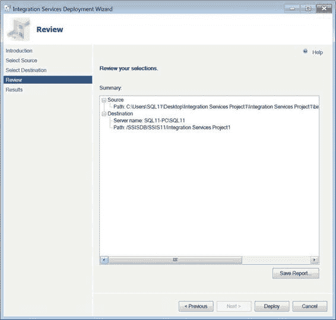

*图 19-8. Integration Services 部署向导的“审阅”页面*

**审阅**页面提供了项目部署的源和目标的详细信息。

点击**部署**按钮将启动将项目安装到目标的过程。如*图 19-9*所示的**结果**页面，在部署过程的每一步都会提供反馈。

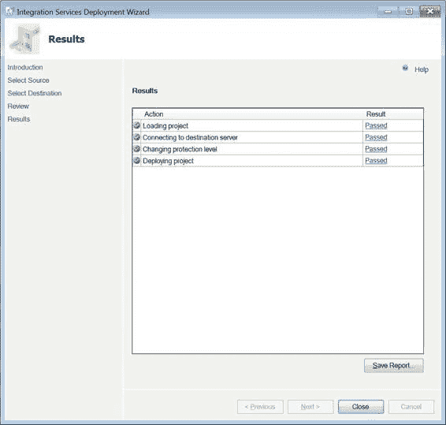

*图 19-9. Integration Services 部署向导的“结果”页面*

**更改保护级别**步骤会修改项目保护级别，以使用目标服务器上的加密设置。该密钥是使用您在创建目录时提供的密码创建的。为了查找您项目的所有加密密钥，您可以查询 `SSISDB` 上的 `internal.catalog_encryption_keys` 表。

### 环境

项目部署完成后，您可能希望模拟不同的场景来执行 ETL 过程。*环境*允许您通过其变量为项目中的所有参数提供值。这些环境变量还可用于配置连接管理器，以便根据您需要运行的模拟来定义数据的来源和加载目标。

> **注意：** *环境变量*是一个容易引起混淆的术语，可能会与操作系统的环境变量混淆。该术语仅适用于 Integration Services 目录中可绑定到已部署项目的环境内的变量，这些环境变量存在于目录中用于执行目的。可以在这些变量之间创建映射，并可以为不同的项目配置各种参数。

要创建一个环境，请导航到您部署项目的**环境**子文件夹。右键单击该子文件夹并选择**创建环境**。这将打开一个允许您创建环境的窗口。*图 19-10*展示了**创建环境窗口**。此窗口要求提供基本信息，例如新环境的名称和描述。

*图 19-10. 创建环境向导*

文本字段上方的**脚本**按钮使您能够生成用于创建环境的 T-SQL 脚本。*清单 19-2*展示了将创建**开发**环境的存储过程及其参数。

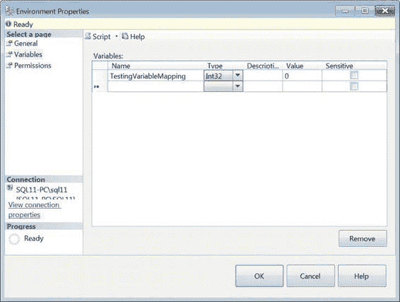

*清单 19-2. 创建环境*

```sql
EXECUTE SSISDB.catalog.create_environment
    @environment_name=N'Development',
    @environment_description=N'',
    @folder_name=N'SSIS12'
;
GO
```

创建环境后，您可以向其中添加变量。与创建环境类似，您可以使用*图 19-11*所示的窗口或*清单 19-3*所示的代码来创建环境变量。要打开该窗口，您需要右键单击环境并选择**属性**。使用窗口的优点是它允许您定义多个环境变量。

*图 19-11. 环境属性*

用于创建环境变量的 T-SQL 存储过程 `catalog.create_environment_variable`，使用窗口中显示的所有列作为参数。`@folder_name` 和 `@environment_name` 这两个参数有助于标识变量所属的环境。

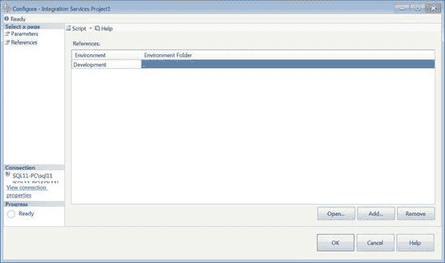

*清单 19-3. 创建环境变量*

```sql
EXECUTE SSISDB.catalog.create_environment_variable
    @folder_name = 'SSIS12',
    @environment_name = 'Development',
    @variable_name = 'TestingVariableMapping',
    @data_type = 'Int32',
    @sensitive = FALSE,
    @value = 0,
    @description = ''
;
GO
```

项目、环境和环境变量准备就绪后，您可以配置项目以关联到环境及其变量，用于特定的执行模拟。环境变量可以映射到已定义的不同项目和包参数。

您可以通过导航到 Integration Services 目录中的项目，右键单击它并选择**配置**来设置这些依赖关系。*图 19-12*展示了项目配置窗口的**引用**页面。此页面允许您定义在执行期间可以向项目传递值的不同环境。

*图 19-12. 配置项目窗口的“引用”页面*

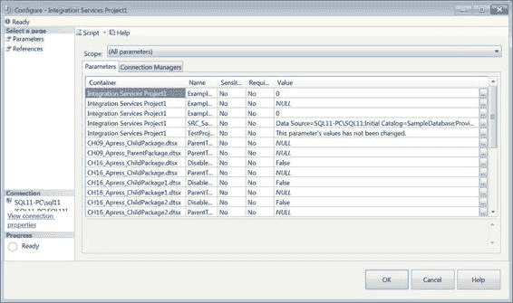

> **注意：** 环境可以从项目直接文件夹结构以外的位置引用。但是，环境必须位于同一 SQL Server 实例上。

设置好环境引用后，您可以将项目对象映射到环境内的变量。*图 19-13*展示了**配置项目**窗口的**参数**页面的**参数**选项卡。此选项卡允许您将项目中包含的所有参数的值映射到环境变量的值。**范围**下拉列表使您更容易查找参数。它可以将参数列表限制为特定的包或参数函数。该选项卡还显示了为参数定义的默认值。

*图 19-13. 配置项目窗口的“参数”页面和“参数”选项卡*

参数的实际映射是通过单击参数**值**字段右侧的省略号按钮生成的。单击该按钮将打开如*图 19-14*所示的窗口。**编辑值**选项允许您为执行定义一个新的静态值，而不管指定的环境如何。**使用环境变量**选项将在环境中搜索指定的变量，并将其值映射到参数。下拉列表中可用的环境变量将是那些数据类型与参数数据类型兼容的变量。

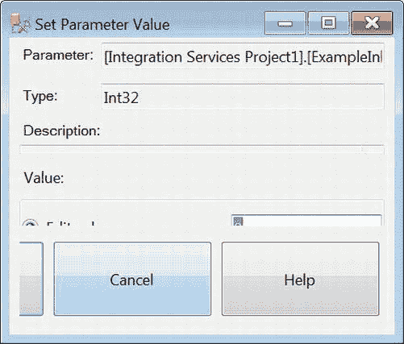

*图 19-14. 设置参数值窗口*

> **注意：** 当您为项目定义多个环境引用时，我们建议您在所有环境中定义具有相同名称和类型的变量。**设置参数值**窗口中的下拉列表允许您指定要映射到参数的变量。

除了参数之外，项目内定义的连接管理器也可以映射到环境变量值。**配置项目**窗口的**参数**页面的**连接管理器**选项卡（如*图 19-15*所示）允许您创建这些映射。**范围**下拉列表与**参数**选项卡中的列表类似，它将过滤项目中定义的连接管理器，以便您可以轻松地映射值。

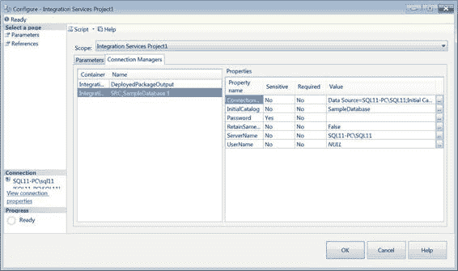


### 执行

`图 19-15. “配置项目”窗口的“参数”页和“连接管理器”选项卡` “设置参数值”窗口还允许你将连接管理器的属性值映射到环境变量。通过单击需要映射的属性的`值`字段旁边的省略号按钮来访问此窗口，其工作方式与将环境变量映射到参数的方式相同。

项目部署到 Integration Services 目录并配置完成后，我们终于可以在服务器上执行 ETL 过程了。本示例演示了动态的**父子设计模式**。这种设计模式的通用性与新的部署模型无缝配合。有关父子设计模式的更多信息，请参阅第 16 章。

为了跟踪单个包的执行，这些包包含一个 `Script` 任务，该任务将信息写入文件系统上的文件。文件位置由包中定义的连接管理器指定。`清单 19-4` 显示了允许访问该文件的 `C#` 代码。`main()` 方法调用 `appendToFile(string)` 方法，以将字符串参数追加到文件。为文件流对象定义的文件模式是 `Append`，这允许该方法自动添加到文件末尾。写入模式允许对连接管理器的连接字符串所指定的文件进行读/写访问。

`清单 19-4. 脚本任务方法`
```csharp
public void Main()
{
    [www.it-ebooks.info](http://www.it-ebooks.info/)
    CHAPTER 19  DEPLOYMENT MODEL

    // TODO: 在此添加你的代码
    string packageTime = Dts.Variables["System::StartTime"].Value.ToString() + "\n";
    string packageMessage = "当前包的名称是: " +
    Dts.Variables["System::PackageName"].Value.ToString() + "\n";
    appendToFile("**************************************************");
    appendToFile(packageTime);
    appendToFile(packageMessage);
    Dts.TaskResult = (int)ScriptResults.Success;
}

private void appendToFile(string appendMessage)
{
    try
    {
        FileStream fs = new FileStream(Dts.Connections["DeployedPackageOutput"].ConnectionString.ToString(), FileMode.Append, FileAccess.Write);
        StreamWriter sw = new StreamWriter(fs);
        sw.WriteLine(appendMessage);
        sw.Close();
    }
    catch (IOException ex)
    {
        ex.ToString();
    }
}
```

要执行作为项目一部分部署的包，请导航到 Integration Services 目录中的该包，右键单击该包，然后选择`运行`。这将弹出“运行包”窗口，如`图 19-16`所示，该窗口允许你配置执行的详细信息。窗口的第一个选项卡“参数”允许你配置项目级别的参数。对于我们的演示，我们将保留这些值为项目部署时的默认值。包的执行从所选包的作用域开始。只有特定包的对象是可配置的。在我们的例子中，`CH19_Apress_DynamicParentPackage.dtsx` 上的参数和连接管理器是唯一可配置的对象。

[www.it-ebooks.info](http://www.it-ebooks.info/)

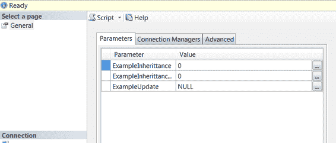

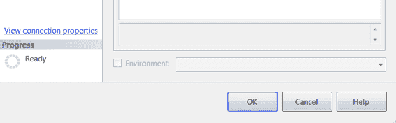

`图 19-16. “运行包”窗口的“参数”选项卡`

底部的复选框允许你使用已在项目配置中引用的环境。选择环境将自动应用已配置的不同对象映射。

要修改参数的值，需要单击`值`字段右侧的省略号按钮。“编辑字面值以供执行”窗口，如`图 19-17`所示，允许你修改任何参数值。在`值`字段中填入当前执行所需的值。这些值仅用于当前执行。如果你需要重用这些值，我们建议你创建一个包含适当环境变量的环境。

[www.it-ebooks.info](http://www.it-ebooks.info/)

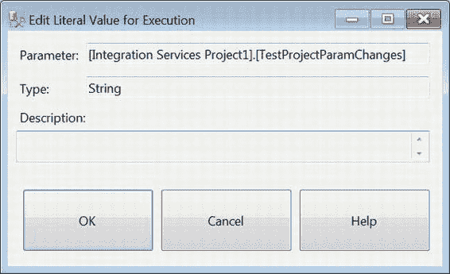
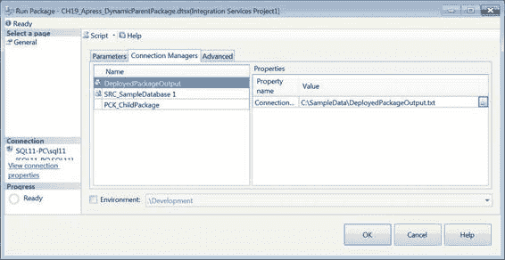

`图 19-17. “编辑字面值以供执行”窗口`

“连接管理器”选项卡，如`图 19-18`所示，显示了包的连接管理器。使用相同的“编辑字面值以供执行”窗口来修改连接管理器的属性。就像参数值一样，所使用的值仅适用于当前执行。该值将默认恢复为项目部署到 Integration Services 目录时提供的原始值。如果传入了不正确的连接字符串，执行将失败，你将必须重新配置所有属性。为了避免这种麻烦，我们建议你设计适当的环境。

`图 19-18. “运行包”窗口的“连接管理器”选项卡`

[www.it-ebooks.info](http://www.it-ebooks.info/)

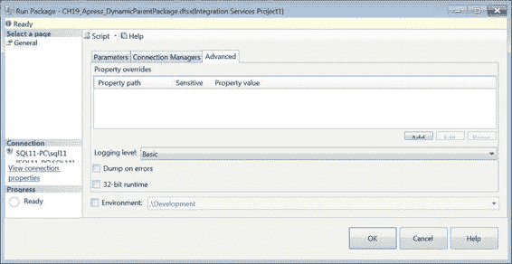

“高级”选项卡，如`图 19-19`所示，允许配置执行的细微细节。“属性重写”部分允许你指定需要修改的确切属性。“日志记录级别”列出了以下执行日志记录选项：

-   `无`：禁用执行的日志记录。选择此选项可以提供一些性能优势，但根据你的标准操作流程，可能需要日志记录。
-   `基本`：日志记录仅记录错误和警告消息。
-   `性能`：日志记录记录所有可用事件。
-   `详细`：日志记录记录执行期间收集的诊断信息。

`出错时生成转储`选项允许你在执行期间发生错误时创建调试转储文件。`32 位运行时`选项允许你在 64 位计算机上以 32 位模式运行该包。如果你使用的提供程序没有 64 位驱动程序（例如用于访问 Microsoft Excel 文件的 Microsoft Jet 数据库引擎），此选项至关重要。

`图 19-19. “运行包”窗口的“高级”选项卡`

> **注意：** 尽管`环境`复选框出现在所有选项卡上，但此复选框适用于整个执行。它并不为选项卡的上下文使用映射。

通过单击`添加`按钮来配置特定的包对象属性。“属性重写”窗口，如`图 19-20`所示，允许你通过提供属性路径来标识属性。这标识了包内定义的特定对象的属性。`属性`值字段允许你提供该属性的重写值。

[www.it-ebooks.info](http://www.it-ebooks.info/)

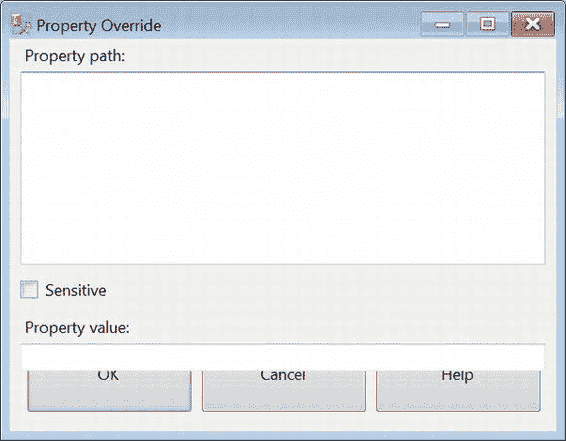
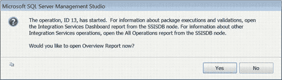

`图 19-20. “属性重写”窗口`

> **小心：** 系统不会检查提供的值是否与要重写属性的数据类型匹配。在开始重写属性之前，你应该仔细检查元数据。

包执行配置完成后，你可以单击`确定`按钮开始执行。执行开始时，Management Studio 将弹出一个窗口，向你提供操作 ID 以及打开“概述报告”的选项。“概述报告”是 SQL Server 12 的新增功能，它通过 Integration Services 目录提供 SSIS 包执行的详细报告。`图 19-21` 显示了允许你查看执行概述报告的弹出窗口。

`图 19-21. 概述报告请求`

[www.it-ebooks.info](http://www.it-ebooks.info/)

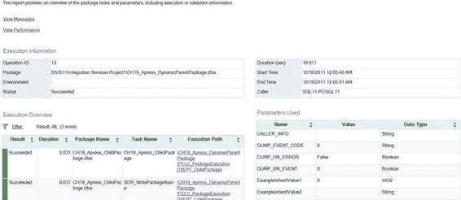


点击概览报告（Overview Report）请求中的“是”按钮，可以审阅包执行的所有详细信息。图 19-22 提供了该报告的片段，其中包含诸如包执行的开始和结束时间、包内每个可执行文件的执行持续时间等信息，并且在我们的特定示例中，还包含了子包的执行持续时间。另有一个章节专门报告了为执行定义的属性重写值。

*图 19-22. 执行概览报告片段*

 `注意：`概览报告本身无法保存，但所有执行的历史记录都存储在 Integration Services 目录中。要查看执行历史记录，请导航到包含您需要审阅历史记录的项目的文件夹，右键单击该文件夹，然后选择`报表 > 所有执行`。这将为您提供不同执行的快速概览。如果您希望查看 SSIS 包执行的整个目录范围的历史记录，请右键单击目录而非特定文件夹。这些报表是使用报表定义语言（RDL）创建的，因此可以创建并添加自定义报表，以允许从 SSMS 内部进行查看。

通过使用`文件连接管理器`，每个包内的`脚本任务`将一个字符串追加到了服务器有权访问位置的一个现有文件中。清单 19-5 展示了`CH19_Apress_DynamicParentPackage.dtsx`执行两次后文件的内容。

*清单 19-5. CH19_Apress_DynamicParentPackage.dtsx 结果*

```
**************************************************

10/1/2012 11:55:30 AM

The current package's name is: CH19_Apress_DynamicParentPackage

[www.it-ebooks.info](http://www.it-ebooks.info/)

CHAPTER 19  DEPLOYMENT MODEL

10/1/2012 11:55:35 AM

The current package's name is: CH19_Apress_ChildPackage

10/1/2012 11:55:38 AM

The current package's name is: CH19_Apress_ChildPackage1

10/1/2012 11:55:42 AM

The current package's name is: CH19_Apress_ChildPackage2

**************************************************

10/10/2012 12:05:46 AM

The current package's name is: CH19_Apress_DynamicParentPackage

10/10/2012 12:05:49 AM

The current package's name is: CH19_Apress_ChildPackage

10/10/2012 12:05:49 AM

The current package's name is: CH19_Apress_ChildPackage1

10/10/2012 12:05:50 AM

The current package's name is: CH19_Apress_ChildPackage2
```

 `注意：`这个动态父包的设置与第 16 章演示的动态父包类似。如您所见，已禁用的子包并未向文件追加字符串来指示其包属性值已被父包中配置的参数映射所覆盖。

### 导入过程

`导入过程`指的是使用 Integration Services 导入项目向导将现有项目导入到一个新项目中。该向导看起来与部署向导非常相似，只是不允许您为导入的项目指定目标位置。将项目从其源导入后，您可以将其复制并粘贴到适当的位置。我们在第 2 章讨论过此过程。

### 迁移过程

`迁移过程`是随着此版本的 SSIS 引入的，旨在使遗留项目能够符合新的部署模型和功能。此过程也被使用，因为先前版本的 601

[www.it-ebooks.info](http://www.it-ebooks.info/)

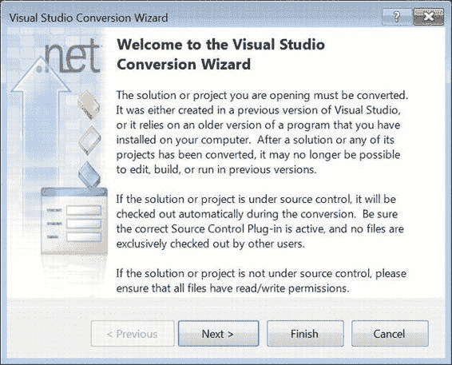

CHAPTER 19  DEPLOYMENT MODEL

SSIS 使用的是 Visual Studio 2005 和 2008，而最新版本使用的是 Visual Studio 2010。Visual Studio 转换向导旨在使该过程尽可能轻松。当您尝试打开来自先前版本 SSIS 的项目文件时，Visual Studio 会自动提示您如图 19-23 所示的向导。然后，该向导将引导您完成升级项目文件的步骤。

*图 19-23. Visual Studio 转换向导—简介*


