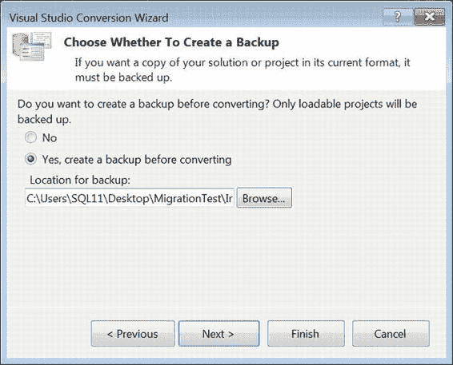
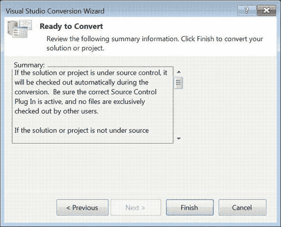

# 第 19 章 部署模型

由于 Visual Studio 已经知道您尝试升级的项目，因此它不会麻烦您指定项目文件和属于该项目的项的位置。向导的下一页（如图 19-24 所示）为您提供了一个在转换前创建文件备份的选项。**我们强烈建议**您在继续操作前进行冗余备份。您随时可以回来清理，但如果唯一的副本损坏了，那就真的损坏了。使用源代码版本控制系统也能让人更安心。向导的第二页允许您指定备份的位置。

[www.it-ebooks.info](http://www.it-ebooks.info/)

*图 19-24. Visual Studio 转换向导的备份选项*

在 Visual Studio 转换文件之前，它会关于版本控制给出最后一个警告。向导的最后一页如图 19-25 所示。它显示了项目位置和备份位置的摘要。点击“完成”将提示一条消息，报告该过程已成功完成。关闭向导后，该项目及其所有项将加载到该特定 Visual Studio 窗口的解决方案资源管理器中。

[www.it-ebooks.info](http://www.it-ebooks.info/)

*图 19-25. Visual Studio 转换向导—摘要*

**注意：** Visual Studio 2010 在不升级文件的情况下，将无法打开早期版本的项目文件。在尝试升级到最新版本之前，请确保您已对遗留代码进行了妥善备份。

### 总结

随着 SSIS 中新部署模型的引入，您现在可以将 ETL 流程部署到 SQL Server，而无需承担早期版本中存在的开销。新的环境和环境变量消除了为部署到不同测试和生产环境维护配置的需要。我们向您展示了如何构建 SSIS 项目并将其部署到 SQL Server，以及如何将遗留的 SSIS 包迁移到新模型。下一章将介绍源代码控制和 SSIS 管理与安全。

[www.it-ebooks.info](http://www.it-ebooks.info/)

