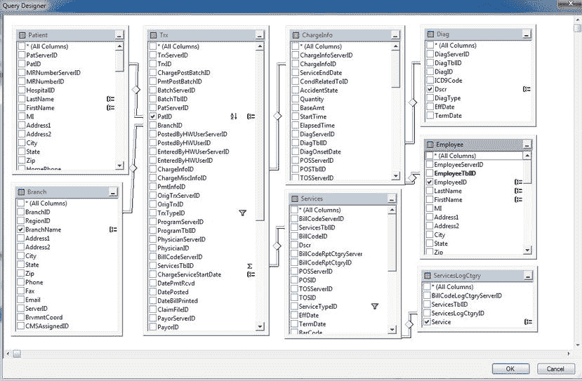
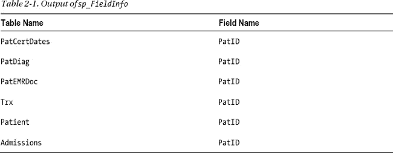
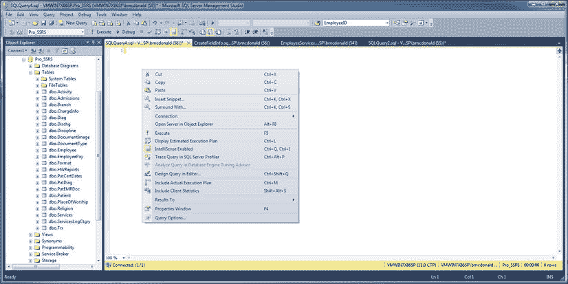
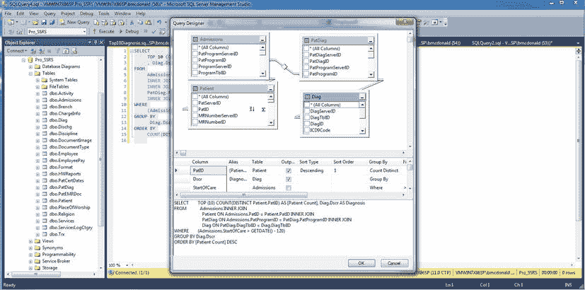
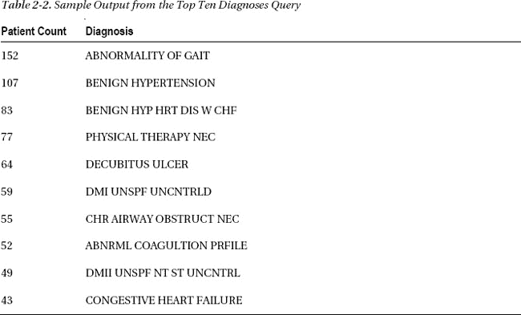
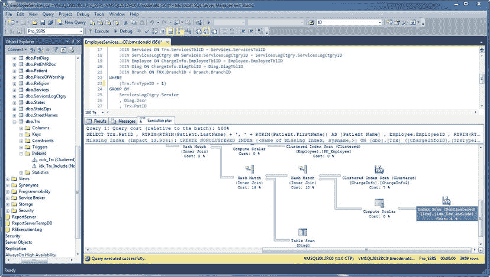

# 第 2 章 报表创作：设计高效查询

SSRS 提供了一个平台，用于在包含多种信息数据源的环境中开发和管理报表。这些数据源既可以包括关系数据（例如 SQL Server、Oracle、MySQL 等），也可以包括非关系数据（例如 Active Directory、LDAP 存储和 Exchange Server）。像 ODBC、OLE DB 和 .NET 这样的标准促进了从这些不同数据存储中检索数据，因此只要您的系统具有相关驱动程序，SSRS 就可以访问数据。在 SSRS 报表设计环境中，配置驱动报表内容的数据集是设计过程的第一步。

然而，在我们介绍报表设计环境的众多元素之前，重要的是从任何数据驱动型报表（无论是 Business Objects Reports、SSRS 还是 Microsoft Access）的核心开始，那就是查询。对于任何报表设计应用程序而言，开发一个能高效返回所需数据的查询是报表成功的关键。

在本章中，我们将描述以下内容：

*   *本书中报表查询的目标——医疗保健数据库*：在设计高效的查询之前，您必须理解数据的设计。当无法获得完整的架构详情时，我们还将描述一种熟悉数据的简便方法。
*   *如何为报表目的设计基本但有效的 SQL 查询*：我们将基于真实世界的应用程序创建查询，这些是报表编写者和数据库管理员每天都会创建的那种查询。
*   *如何使用 SSMS 评估查询性能*：初始查询定义了报表的性能和价值，因此了解创建和测试查询所需的工具以确保其既准确又针对高性能进行了调优非常重要。
*   *如何将优化后的查询转换为参数化的存储过程*：这使您可以受益于预编译和缓存的执行计划以实现更快的性能，以及受益于该过程在 SQL Server 上的集中更新和保护。

## 介绍示例关系数据库

在本书中，我们将向您展示如何为基于 SQL Server 的医疗保健应用程序设计和部署报表解决方案，并构建自定义的 .NET SSRS 应用程序，该应用程序使用关系表和存储过程。该应用程序最初是为家庭健康和临终关怀机构设计的，这些机构通常在患者家中为其提供临床护理。我们本书中的示例，即在线事务处理 (OLTP) 数据库，为该应用程序提供支持，捕获家庭健康和临终关怀患者的账单和临床信息。我们将使用的数据库名为 `Pro_SSRS`，可从 Apress 网站的 Source Code/Download 区域（[`http://www.apress.com`](http://www.apress.com)）下载，同时附有 `ReadMe.txt` 文件中的说明，指导如何还原数据库以供本章及后续章节使用。


## 介绍模式设计

多年来，开发人员不断为应用添加功能，并多次修改数据库模式以适应新功能并捕获所需数据。这些数据不仅用于执行创建账单、向患者账户记入付款等业务流程，还用于提供有价值的报告，展示公司服务患者的效果。由于此类医疗保健机构提供长期护理，客户需要了解患者病情是否随时间推移有所改善，以及为其提供的护理总体成本是多少。

为该应用设计的数据库包含 200 多张表和许多存储过程。在本书中，你将使用该数据库的一个子集来学习如何开发显示患者护理成本的报告。整本书中，你将使用八张主要表进行查询和存储过程操作，并且在接下来的三章中，你将开始使用其中一些表来构建报告。这些表如下所示：

> `Trx`：主要的事务数据表，存储详细的患者服务信息。我们使用术语 `services` 来指代为患者护理提供的、有相关成本的项目。
>
> `Services`：存储在 `Trx` 表中找到的详细行项目的名称和类别。服务可以是临床访视，如专业护士访视，但也可能包括可计费的供应品，如纱布绷带或注射器。
>
> `ServiceLogCtgry`：对相似服务进行的主要分组，提供更高级别的归类。例如，所有访视都可以关联到一个用于报告的“访视” `ServiceLogCtgry`。
>
> `Employee`：存储特定于 `员工` 的记录，在此上下文中指临床医生或其他工作人员，例如探访临终关怀患者的牧师。每个存储在 `Trx` 表中的访视都会分配一名员工。
>
> `Patient`：包含接受护理的患者的人口统计信息。该表与 `Employee` 表类似，直接链接到 `Trx` 表以获取详细的事务数据。
>
> `Branch`：存储接受护理患者的分支机构名称和位置。在示例报告中，`分支机构` 是提供访视和服务的成本中心。
>
> `ChargeInfo`：包含与个别 `Trx` 记录相关的、特定于费用的附加信息。费用具有关联的费用金额，这与同样存储在 `Trx` 表中的付款和调整不同。
>
> `Diag`：存储所护理患者的主要诊断，并链接到 `Trx` 表中的记录。

图 2-1 展示了这八张表的图形布局以及它们的连接方式。



**图 2-1.** 查看示例应用的数据库表

## 了解你的数据：利用小程序实现快速技巧

对于每个报表编写者来说，熟悉特定数据库中数据的位置都需要时间。当然，拥有供应商提供的数据库图或模式是一个有用的工具，我们在这里很幸运能拥有它，但这并非总是可用。有一天，面对着为某个特定缺失数据寻找正确表的困境，我们决定编写一个存储过程，命名为 `sp_FieldInfo`。它返回特定数据库中所有具有相同字段名（通常是主键或外键字段）的表的列表。例如，在医疗保健数据库中，如果你想获取包含 `PatID` 字段（用于连接多个表的患者 ID 号）的表的列表，可以使用以下命令：

`sp_FieldInfo PatID`

输出结果将类似于表 2-1 所示。



有了这些信息，你至少可以推断出，例如，患者的诊断信息存储在 `PatDiag` 表中。然而，表和字段的名称并不总是直观命名的。当我们不时遇到这样的数据库时，可以运行 SQL Server Profiler 跟踪并对相关应用程序执行一些常规任务，例如打开表单并搜索一个可识别的记录，以获取捕获数据的起点。Profiler 会返回生成的查询，其中包含表和字段名称，我们可以利用这些来辨别数据库结构。

 **提示** SQL Server Profiler 是一个出色的工具，不仅可以捕获实际针对服务器执行的查询和存储过程，还可以捕获性能数据，例如执行时间长度、中央处理器（CPU）周期和输入/输出（I/O）度量，以及发起查询的应用程序。因为你可以将这些数据直接保存到 SQL 表中，所以可以轻松分析它，它甚至可以作为 SSRS 中报告的一个良好数据源。

清单 2-1 显示了创建 `sp_fieldinfo` 存储过程的代码。你可以在代码下载文件 `CreateFieldInfo.sql` 的 SQL Queries 文件夹中找到此查询的代码。

**清单 2-1.** 创建 `sp_FieldInfo` 存储过程

```
IF EXISTS (SELECT * FROM INFORMATION_SCHEMA.ROUTINES
               WHERE ROUTINE_NAME = 'sp_FieldInfo'
               AND SPECIFIC_SCHEMA = 'dbo')
       DROP PROCEDURE [dbo].[sp_FieldInfo]
GO
CREATE PROCEDURE [dbo].[sp_FieldInfo]
(
        @column_name VARCHAR(128) = NULL
)
AS
SELECT
        TABLE_NAME AS [Table Name]
        , RTRIM(COLUMN_NAME) AS [Field Name]
FROM
        INFORMATION_SCHEMA.COLUMNS
WHERE
        COLUMN_NAME LIKE '%' + @column_name + '%'
```

### 介绍查询设计基础

无论你是习惯通过文本编辑器手动编写 SQL 查询的经验丰富者，还是更倾向于图形化设计查询的人，结果才是关键。准确性、通用性和底层查询的效率是设计者努力实现的三大目标。准确性至关重要，但一个性能良好且足够通用、可用于多个报告的查询，会使后续的报告设计任务变得容易得多。对于可扩展性和低响应时间，效率至关重要。一个需要 15 分钟才能渲染的出色报告，会成为用户很少运行的报告。在开始开发报告查询时，请牢记以下目标：

> *查询必须返回准确的数据*：随着查询逻辑变得复杂，在标准条件和多表连接众多的情况下，不准确的可能性会增加。
>
> *查询必须具备可扩展性*：在查询开发和测试过程中，要注意随着用户负载增加，其性能可能会发生显著变化。我们将在第 10 章介绍带模拟负载的性能监控。不过，在本章中，我们将展示如何使用工具测试单次执行的查询响应时间以提高性能。
>
> *查询应具备通用性*：通常，单个查询或存储过程可以同时驱动多个报告，节省维护、管理和开发报告的时间。然而，为了一次性支持详细信息和摘要而向报告提供过多数据会影响性能。平衡通用性和效率非常重要。

## 创建简单的图形化查询

查询设计通常始于一个请求。作为报表编写者或数据库管理员（DBA），您可能经常需要生成那些第三方应用程序附带的标准报表中无法提供的数据。

让我们从一个假设的场景开始。假设您收到一封电子邮件，详细说明了一个需要为即将到来的会议创建和部署的报表。已经确定无法从任何已知报表中获取数据，但您可以通过一个简单的自定义查询来导出这些数据。

在这个第一个例子中，您将查看以下来自一个医疗保健组织的请求：

> *交付一份报告，显示按服务次数统计的十大最常见诊断。*

假设您熟悉数据库，可以在 SSMS 中开始查询设计过程，既可以通过图形界面，也可以使用通用查询设计器编写查询代码。这两种方法在 SSMS 中都可用。

 **注意** 我们将在第三章介绍设置构建 SSRS 报表所需的数据源连接。目前，您将直接使用 SSMS 中可用的查询设计工具连接到数据。需要提及的是，尽管您在 SSMS 中设计查询，但在 BIDS 环境中也有类似的工具，因此您可以在创建报表的同时创建查询。在此案例中我们选择 SSMS，是因为它包含数据库对象列表，在开始开发查询时您可能需要引用这些对象。

我们将向您展示如何使用图形工具设计查询，以演示底层 SQL 代码是如何创建的。您可以通过在 SSMS 的新查询窗口中任意位置右键单击并选择“在编辑器中设计查询”来访问图形查询设计器（参见图 2-2）。



**图 2-2.** 在 SSMS 中访问查询设计工具

打开查询设计器后，您可以执行添加和连接其他表、使用任务窗格进行排序、分组和选择条件等任务（参见图 2-3）。



**图 2-3.** 在 SSMS 中使用图形查询设计器

这个初始查询相对简单；它使用在关系列上连接的四个表。通过图形查询设计器，您可以添加基本条件和排序，并且只为报表选择两个字段：患者计数和特定的医学诊断。您可以将计数的排序类型设为降序，以便查看最常见诊断的趋势。您可以将 SQL 查询直接传输到报表中，我们将在第六章展示如何操作。清单 2-2 显示了生成的查询。您可以在 Apress 网站（[`http://www.apress.com`](http://www.apress.com)）的源代码/下载区域的 SQL Queries 文件夹中找到此查询的代码文件 `Top10Diagnosis.sql`。

**清单 2-2.** 使用图形查询设计器生成以返回十大患者诊断的 SQL 查询

```sql
SELECT TOP 10
       COUNT(DISTINCT Patient.PatID) AS [Patient Count]
       , Diag.Dscr AS Diagnosis
FROM
       Admissions
       INNER JOIN Patient ON Admissions.PatID = Patient.PatID
       INNER JOIN PatDiag ON Admissions.PatProgramID = PatDiag.PatProgramID
       INNER JOIN Diag ON PatDiag.DiagTblID = Diag.DiagTblID
GROUP BY
       Diag.Dscr
ORDER BY
       COUNT(DISTINCT Patient.PatID) DESC
```

表 2-2 显示了此查询的输出。



这个特定的聚合查询结果集很小。尽管它可能处理数万条记录来生成最终的十条记录，但它运行时间不到一秒。这表明该查询是高效的，至少在单用户执行场景下是如此。

此类查询旨在为专业人士提供快速审查的数据，他们将根据汇总数据的结果做出业务决策。在此示例中，医疗管理员会注意到对物理治疗的需求，并可能审查公司内物理治疗师的人员配置水平。由于物理治疗师需求量大，管理员可能需要调查护理物理治疗患者的成本。


#### 创建高级查询

接下来，我们将展示如何设计一个查询，用以报告物理治疗患者的医疗护理成本。目标在于使该查询及后续报告具备足够的灵活性，以便能够分析包含物理治疗在内的其他类型的医疗服务。此查询比前一个需要更多的数据用于分析。由于需要处理数千条记录，因此需要评估其对性能的影响。

设计过程是相同的。首先将必要的表添加到图形化查询设计器中，并选择要包含在报告中的字段。报告所需的数据输出需要包含以下信息：

*   患者姓名和 ID 号
*   员工姓名、专业和所属分部
*   按专业划分的患者服务总次数
*   患者诊断
*   预估成本
*   服务日期

清单 2-3 展示了从医疗保健应用程序生成此预期输出的查询。你可以在代码下载文件 `SQL Queries` 文件夹中的 `EmployeeServices.sql` 文件里找到此查询的代码。

**清单 2-3.** 医疗保健数据库的员工成本查询

```sql
SELECT
       Trx.PatID
       , RTRIM(RTRIM(Patient.LastName) +  ', '  + RTRIM(Patient.FirstName)) AS [Patient Name]
       , Employee.EmployeelD
       , RTRIM(RTRIM(Employee.LastName) +  ', '  + RTRIM(Employee.FirstName)) AS [Employee Name]
       , ServicesLogCtgry.Service AS  [Service Type]
       , SUM(Chargelnfo.Cost) AS  [Estimated Cost]
       , COUNT(Trx.ServicesTbllD) AS Visit_Count
       , Diag.Dscr AS Diagnosis
       , DATENAME(mm, Trx.ChargeServiceStartDate) AS [Month]
       , DATEPART(yy,  Trx.ChargeServiceStartDate) AS  [Year]
       , Branch.BranchName AS Branch
FROM
       Trx
       JOIN Chargelnfo ON Trx.ChargelnfoID = Chargelnfo.ChargelnfoID
       JOIN Patient ON Trx.PatID = Patient.PatID
       JOIN Services ON Trx.ServicesTbllD = Services.ServicesTbllD
       JOIN ServicesLogCtgry ON Services.ServicesLogCtgrylD = ServicesLogCtgry.ServicesLogCtgryID
       JOIN Employee ON Chargelnfo.EmployeeTbllD = Employee.EmployeeTbllD
       JOIN Diag ON Chargelnfo.DiagTbllD = Diag.DiagTbllD
       JOIN Branch ON TRX.BranchID = Branch.BranchID
WHERE
        (Trx.TrxTypelD = 1) AND (Services.ServiceTypelD =   'v')
GROUP BY
       ServicesLogCtgry.Service
       , Diag.Dscr
       , Trx.PatID
       , RTRIM(RTRIM(Patient.LastName) +  ', '  + RTRIM(Patient.FirstName))
       , RTRIM(RTRIM(Employee.LastName)    +  ', '  + RTRIM(Employee.FirstName))
       , Employee.EmployeelD
       , DATENAME(mm,  Trx.ChargeServiceStartDate)
       , DATEPART(yy,  Trx.ChargeServiceStartDate)
       , Branch.BranchName
ORDER BY
       Trx.PatID
```

查询的 `SELECT` 子句中由 `AS` 标识的别名名称，应作为指向满足报告请求所需数据的指针。再次强调，了解用于生成查询的工作数据库模式非常重要，但就本示例而言，连接的表是典型规范化数据库的特征，其中详细的事务性数据存储在与描述性信息分离的单独表中，因此必须进行连接。清单 2-3 中的 `Trx` 表是存储患者服务事务信息的地方，而诸如“物理治疗”等专业服务的描述性信息则存储在 `Services` 表中。

其他表，如 `Patient` 和 `Employee` 表，也会被连接以检索各自的数据元素。你使用 SQL 函数 `COUNT` 和 `SUM` 对成本和服务信息进行聚合计算，并使用 `RTRIM` 删除拼接的患者和员工姓名中的尾随空格。你可以使用 `ORDER BY PATID` 子句来测试查询，以确保它按预期为每个患者返回多行。没有必要给查询增加排序的负担。正如你将在后续章节中看到的，排序是在报告内部处理的。在承载报告数据的 SQL Server 机器和报告服务器本身之间分配负载非常重要，这通常需要进行性能监控，以评估排序、分组以及为聚合数据计算总和或平均值等任务将在何处执行。如果报告服务器足够强大能够承担负担，并且其受到的用户访问压力小于实际数据服务器，那么让它处理更多的分组和排序负载可能更有效。然而，通常认为最佳实践是让关系数据库引擎尽可能多地执行工作，以减轻报告服务器上的一些负载。

#### 使用 SQL Server Management Studio (SSMS) 测试性能

现在你已经开发好了查询，在进入下一阶段开发之前，你需要查看输出结果，以确保它在可接受的时间范围内返回准确的数据。图 2-4 展示了从 `SSMS` 输出的结果以及执行查询所花费的时间。如果你愿意，可以直接在 `SSMS` 中进一步修改查询。然而，你会注意到 `SSMS` 的最佳功能之一是能够快速查看返回的记录数和执行时间。完成此操作后，下一步是创建存储过程。

现在你已经得到了想要的数据格式，并且查询的平均执行时间为一秒。为了验证执行时间，请从两个不同的 `SSMS` 会话中连续运行查询 15 次。每次执行的时间会在零到两秒之间变化。对于查询返回的 3,924 条记录，单用户执行的执行时间是可以接受的。但是，在创建存储过程（你将希望将其扩展以容纳数百个用户）并开始构建报告之前，你需要对其进行改进。

查看 `SSMS` 中的执行计划选项卡将使你更好地理解执行查询时发生的情况。在 `SSMS` 中，单击工具栏上的“显示估计执行计划”按钮。执行查询时，“执行计划”选项卡将出现在结果窗格中。或者，如果你只想查看执行计划而不返回结果，只需按 `CTRL+L`。


**图 2-4.** 在 `SSMS` 中查看查询执行输出

`SSMS` 中的执行计划选项卡以图形方式显示了 SQL 查询优化器如何根据查询的不同元素选择执行报告的最有效方法。例如，查询优化器可能选择了聚集索引而不是表扫描。每个执行步骤都有一个关联的成本。图 2-5 展示了此查询的执行计划选项卡。


**图 2-5.** 查看 `SSMS` 中显示的执行计划选项卡

查询执行花费了一秒钟，从这个执行计划可以很容易地看出查询的哪个部分具有最高的成本百分比。在确定 `WHERE` 子句中用作过滤器的 `TrxTypeID` 和 `ServiceTypeID` 值时，总成本为 11%。供参考，`TrxTypeID` 整数字段指定财务交易的类型，如费用、付款或调整。你只关心值为 1 的 `TrxTypeID`，代表费用。对于服务类型，你只对代表就诊的“V”感兴趣，而不关心其他类型的可计费服务，如医疗用品。如果你能将 `WHERE` 子句的成本降低到更低的数字，查询的整体性能可能会得到改善。


### 优化性能：分配负载

由于 SSRS 和 T-SQL 共享许多数据格式化和操作函数，因此您可以选择在哪个过程——查询还是报表——中使用这些函数。您可以选择让查询处理大部分处理工作。这限制了报表需要处理的行数，使报表渲染速度更快。或者，您可以限制查询的选择性，使其返回比可能需要的更多的行。然后，让报表执行额外的筛选、分组和计算，这允许查询或存储过程执行得更快。当许多用户同时访问报表时，让报表分担处理负载也能限制对数据源服务器（此处为 SQL Server）的影响。

在此查询中，基于初步基准测试，我们已确定将移除 `WHERE` 子句中指定查询应仅返回服务类型为“V”（表示访问）的部分。相反，我们将让报表过滤掉所有非访问的服务类型。当您从查询中移除服务类型条件并重新执行时，您可以看到总体执行时间保持在一秒或更短，并且 `WHERE` 子句的成本从 11% 降至仅 4%。此外，在性能分析中需要注意，通过从 `WHERE` 子句中移除“V”，记录数仅增加了 35 条，从 3,924 条增加到 3,959 条。您可以在 图 2-6 的右下角看到这一点。

要利用报表筛选器，您需要在查询的 `SELECT` 和 `GROUP BY` 部分添加一个字段——`Services.ServiceTypeID`，如下所示：

```
Select
...
Branch.BranchName AS Branch,
Services.ServiceTypeID
…
GROUP BY
…
Branch.BranchName,
Services.ServiceTypeID
```

您将使用额外的字段 `Services.ServiceTypeID` 作为您将要设计的报表中的筛选值。通过这种方式进行，即使您为特定报表返回的行数可能超出所需，您也能获得在后续章节中将其转换为存储过程后，为其他报表使用同一基础查询的好处。其他报表可能需要显示除访问之外的服务类型，而此查询只需对报表稍作修改即可满足此目的。例如，您可能需要调查员工使用的物资成本或数量（服务类型为“S”）。您可以将此查询和存储过程用于该报表。我们可以利用参数化存储过程，允许各种报表传入一个值来筛选结果，但我们稍后会讲到这一点。



**图 2-6.** 查看修改后查询的执行计划

该查询目前已将 `ServiceTypeID` 作为 `SELECT` 子句中的一个值（而非条件）包含在内，已准备好开始其作为存储过程的生命周期。查询服务于多种目的，其中之一是开发报表，正如您将在第 6 章中所做的那样。然而，将查询封装在存储过程通常是首选的部署方法，原因有几个。存储过程与即席查询一样，根据查询优化器生成的执行计划运行。能够重用执行计划可以节省时间和资源。存储过程的另一个好处是它们是预编译的，即使执行时传递给它的参数值可能已更改，也可以重用执行计划。您可以将存储过程集中保存在 SQL Server 计算机上，这不同于可能嵌入应用程序（或本例中的 RDL 文件）中的即席查询。当数据库的底层模式发生变化时，您可以在一个位置更新存储过程，而嵌入的查询则需要在其所在的每个报告中单独修改。在下一节中，我们将向您展示如何基于员工成本查询创建存储过程。

### 使用参数化存储过程

您可以使用 `SSMS` 生成基于员工成本查询创建存储过程的代码，并在数据库中已存在该存储过程时将其删除。要创建存储过程，请展开要在其中创建存储过程的数据库，导航到 `Programmability` 文件夹并将其展开，即可看到一个名为 `Stored Procedures` 的文件夹。右键单击该文件夹，选择“新建存储过程”。这将打开一个窗口，其中包含用于新存储过程的示例 `CREATE PROCEDURE` 命令。

`CREATE PROCEDURE <Procedure_Name,   sysname,  ProcedureName>`

要完成应命名为 `Emp_Svc_Cost` 的新存储过程，您只需粘贴您的 `SELECT` 语句。但是，您可以添加可选参数以根据以下条件限制结果集：

*   服务时间（年和月）
*   员工工作的分公司
*   员工个人
*   服务类型

要为存储过程创建参数，您需要添加变量名（每个变量名以 @ 字符为前缀），并提供适当的数据类型，如果需要，还可以提供默认值。如清单 2-4 所示，所有参数的默认值均设置为 `NULL`。您可以在代码下载文件 `CreateEmpSvcCost.sql` 的 SQL Queries 文件夹中找到此查询的代码。

**清单 2-4.** 创建 `Emp_Svc_Cost` 存储过程


```sql
IF EXISTS (SELECT * FROM INFORMATION_SCHEMA.ROUTINES
               WHERE ROUTINE_NAME = 'Emp_Svc_Cost'
               AND ROUTINE_SCHEMA = 'dbo')
        DROP PROCEDURE dbo.Emp_Svc_Cost
GO
CREATE PROCEDURE [dbo].[Emp_Svc_Cost]
(
        @ServiceMonth INT = NULL
        , @ServiceYear INT = NULL
        , @BranchID INT = NULL
        , @EmployeeTblID INT = NULL
        , @ServicesLogCtgryID CHAR(5) = NULL
)
AS
SELECT    
        T.PatID
        , RTRIM(RTRIM(P.LastName) + ', ' + RTRIM(P.FirstName)) AS [Patient Name]
        , B.BranchName
        , E.EmployeeID
        , RTRIM(RTRIM(E.LastName) + ', ' + RTRIM(E.FirstName)) AS [Employee Name]
        , E.EmployeeClassID
        , SLC.Service AS [Service Type]
        , SUM(CI.Cost) AS [Estimated Cost]
        , COUNT(T.ServicesTblID) AS Visit_Count
        , D.Dscr AS Diagnosis
        , DATENAME(mm, T.ChargeServiceStartDate) AS [Month]
        , DATEPART(yy, T.ChargeServiceStartDate) AS [Year]
        , S.ServiceTypeID
        , T.ChargeServiceStartDate
FROM
        Trx AS T
        INNER JOIN Branch AS B ON T.Branchid = B.BranchID
        INNER JOIN ChargeInfo AS CI ON T.ChargeInfoID = CI.ChargeInfoID
        INNER JOIN Patient AS P ON T.PatID = P.PatID
        INNER JOIN Services AS S ON T.ServicesTblID = S.ServicesTblID
        INNER JOIN ServicesLogCtgry AS SLC ON S.ServicesLogCtgryID = SLC.ServicesLogCtgryID
        INNER JOIN Employee AS E ON CI.EmployeeTblID = E.EmployeeTblID
        INNER JOIN Diag AS D ON CI.DiagTblID = D.DiagTblID
WHERE
        (T.TrxTypeID = 1)
        AND (ISNULL(B.BranchID,0) = ISNULL(@BranchID,ISNULL(B.BranchID,0)))
        AND (ISNULL(S.ServicesLogCtgryID,0) = ISNULL(@ServicesLogCtgryID,
                ISNULL(S.ServicesLogCtgryID,0)))
        AND (ISNULL(E.EmployeeTblID,0) = ISNULL(@EmployeeTblID,
        ISNULL(E.EmployeeTblID,0)))
        AND
       --Determine if Year and Month was passed in
        ((CAST(DATEPART(yy, T.ChargeServiceStartDate) AS INT) = @ServiceYear
                AND @ServiceYear IS NOT NULL)
                OR @ServiceYear IS NULL)
        AND
        ((CAST(DATEPART(mm, T.ChargeServiceStartDate) AS INT) = @ServiceMonth
                AND @ServiceMonth IS NOT NULL)
                OR @ServiceMonth IS NULL)
GROUP BY
        SLC.Service
        , D.Dscr
        , T.PatID
        , B.BranchName
        , RTRIM(RTRIM(P.LastName) + ', ' + RTRIM(P.FirstName))
        , RTRIM(RTRIM(E.LastName)  + ', ' + RTRIM(E.FirstName))
        , E.EmployeeClassid
        , E.EmployeeID
        , DATENAME(mm, T.ChargeServiceStartDate)
        , DATEPART(yy, T.ChargeServiceStartDate)
        , S.ServiceTypeID
        , T.ChargeServiceStartDate
ORDER BY
        T.PatID
GO
```

## 使用 ISNULL 评估参数

在上面的查询中，你在 `WHERE` 子句中添加了几个新条件来评估参数。其中一个条件就是 `ISNULL` 函数，用于评估数据库字段和参数的值。

```sql
(ISNULL(B.BranchID,0) = ISNULL(@BranchID,ISNULL(B.BranchID,0)))
AND
((CAST(DATEPART(yy, T.ChargeServiceStartDate) AS INT) = @ServiceYear
                AND @ServiceYear IS NOT NULL)
                OR @ServiceYear IS NULL)
        AND
        ((CAST(DATEPART(mm, T.ChargeServiceStartDate) AS INT) = @ServiceMonth
                AND @ServiceMonth IS NOT NULL)
                OR @ServiceMonth IS NULL)
```

初看之下，这些评估的逻辑可能有点令人困惑，但请记住，只要条件相等，就会返回结果。在整个 `WHERE` 子句中都是如此，因为它使用 `AND` 进行评估。通过下面的示例语句可以更容易理解：

```sql
SELECT * from Table1 WHERE 1 = 1
```

在这个语句中，所有行都会被返回，因为 1 总是等于 1。你是否在比较表中的值并不重要。

对于 `ISNULL` 函数，你会查看数据库字段（例如 `BranchID`）的值是否包含 `NULL` 值，如果是，`ISNULL` 会用零替换 `NULL`。该等式的右侧用于查看 `@BranchID` 参数是否以 `NULL` 传入；如果是，则将 `@BranchID` 的值设置为数据库表中的 `BranchID` 值，并等于每一行。如果 `@BranchID` 参数以某个值（例如代表分支 Grid Iron 的 2）传递给存储过程，则仅返回 `BranchID` 为 2 的行，因为 `BranchID` = `@BranchID` = 2。当字段中可能存在 `NULL` 值时执行此评估，因为 `NULL` 值无法使用标准运算符（如 `=`）进行比较。

对于两个时间值，服务年份和月份，你使用了类似的逻辑。如果参数 `@ServiceMonth` 和 `@ServiceYear` 以 `NULL` 传递给存储过程，则存储过程返回每条记录。如果参数包含有效值，例如年份为 2009，则当参数值等于数据库值时，`WHERE` 子句会应用过滤器。

## 查询性能与索引

在讨论设计高效查询的同时，数据库管理员（DBA）可以为表做很多事情来提高查询性能。仅列举几个问题：统计信息可能会过时，表上的索引（如果有）可能会变得碎片化或不足。每种情况都会以不同方式影响查询性能，但总是向坏的方向发展——设计不良或维护不善的表上的查询执行时间总是比设计良好、维护得当的表上的查询更长。

你可能没有管理索引的适当权限，但你可以做的一件事是设计查询以使用现有的索引。以下是一些提示，可帮助你提高性能并缩短将结果返回到报表的时间。

*   `SELECT`：仅返回报表中绝对需要的列。
*   `JOIN`：仅连接你需要的表，并在连接条件中使用现有的索引列。
*   `WHERE`：按照索引列的定义顺序使用它们，并避免在过滤值前使用通配符 (%) 的 `LIKE` 运算符。

如果你的查询性能不如预期，你或许可以请数据库管理员对你查询中使用的表运行一些性能检查。他们可能只需要修改现有索引以包含你查询中使用的列。解决方法甚至可能像在数据库上创建维护计划以更新统计信息一样简单。无论哪种方式，在编写查询时请尽量使用这些技巧。查询性能调优是一个很大的课题，有许多书籍可以帮助你编写优化的查询，例如 Grant Fritchey 的 *SQL Server 2012 Query Performance Tuning* (Apress 2012)。

## 列和表别名

列和表别名实际上并不能使你的查询运行得更高效。但是，它们确实使查询更易于阅读和编写得更快。别名允许你为列和表使用缩写（或更具描述性）的标签。这样，你就不必在每次使用某列时都键入表的全名，或者可以为列分配更合适的名称。使用 `AS` 关键字，我们告诉 SQL Server 将字段或表别名为其他标签。

```sql
SELECT
…
, DATENAME(mm, T.ChargeServiceStartDate) AS [Month]
…
INNER JOIN ServicesLogCtgry AS SLC ON S.ServicesLogCtgryID = SLC.ServicesLogCtgryID
```

此语句使用 `DATENAME` 函数将 `Trx` 表的 `ChargeServicesStartDate` 别名为 Month。下一行展示了如何将名为 `ServicesLogCtgry` 的表别名，以便你可以将其引用为 `SLC`。这样，每当你需要 `ServicesLogCtgry` 表中的列时，你可以引用别名，后跟一个句点，然后是列名。


