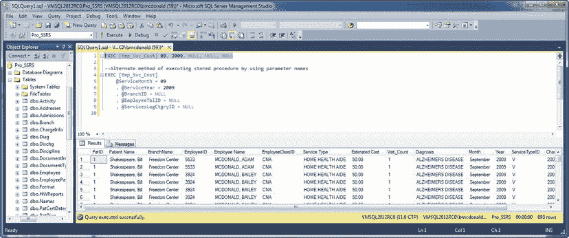

# 测试存储过程

下一步是在 SQL Server Management Studio 中为存储过程授予执行权限，方法是导航到数据库 `Pro_SSRS`，然后展开 `可编程性` 文件夹。接着，选择 `存储过程`，右键单击 `Emp_Svc_Cost`，最后选择 `属性`。在 `权限` 属性页中，你可以添加 `public` 角色，并向任何你想要的组或用户授予执行权限。在此例中，单击权限页上的 `添加`，在可用用户列表中找到 `Public`，并授予 `执行` 权限。（我们相信开发者肯定明白这其中的幽默，他知道有人会授予“public execution”。）

 **注意** 我们用于开发报表的测试服务器是一个隔离且安全的系统。通常，不建议向 `public` 角色授予执行权限。我们将在 第 11 章 中对存储过程和报表进行锁定。

现在，你可以使用以下命令直接在 SSMS 中测试该过程：

`EXEC Emp_Svc_Cost`

因为你已允许参数接受 `NULL` 值，所以不需要在命令行显式传入它们。但是，为了测试存储过程的功能，你可以使用适当的参数传入完整的命令行；例如，要传入 2009 年 9 月提供的所有服务，可以这样做：

`EXEC Emp_Svc_Cost 09, 2009, NULL, NULL, NULL`

以这种方式执行过程会在瞬间返回 893 条记录，结果证实确实只返回了 2009 年 9 月的服务（参见图 2-7）。

**图 2-7.** 查看带年份和日期参数的 `Emp_Svc_Cost` 结果

## 小结

在本章中，你开始设计报表的核心部分：查询和存储过程。通过使用存储过程，你可以获得集中管理和安全性的优势，同时还能够执行编译后的代码来返回数据集，而不是独立的查询。你可以结合报表开发查询，使用 SSRS 内置的查询工具。然而，最佳实践是尽可能使用存储过程来部署报表。

在确定报表的布局和默认呈现方式时，报表请求和目标受众是决定性因素。然而，尽管报表通常是为了满足特定需求而设计的，但如果它们基于相同的、经过验证的存储过程，具有相似的参数和分组，那么数据在所有报表中都将保持一致。这样，你就可以将设计时间集中在报表本身，而不是重写查询上。

