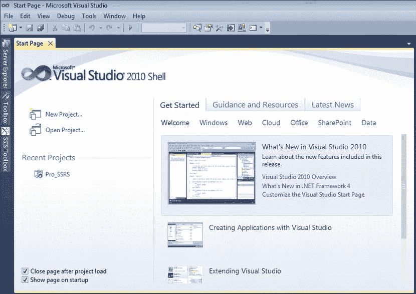
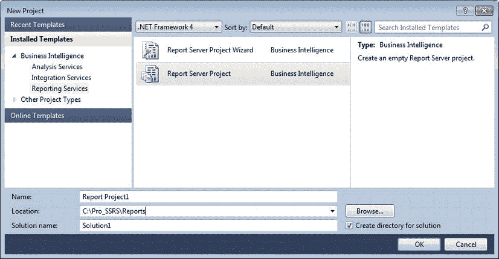
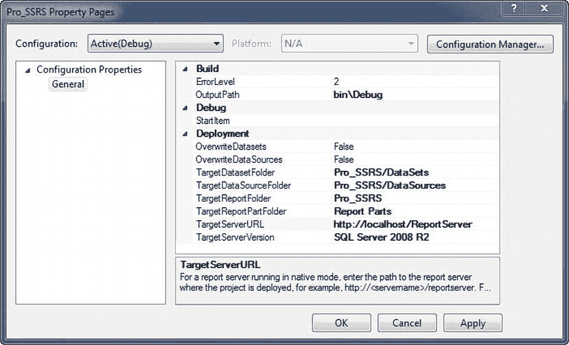
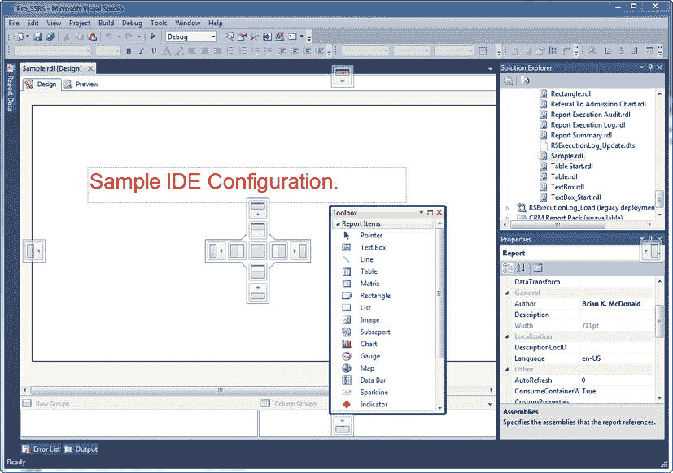
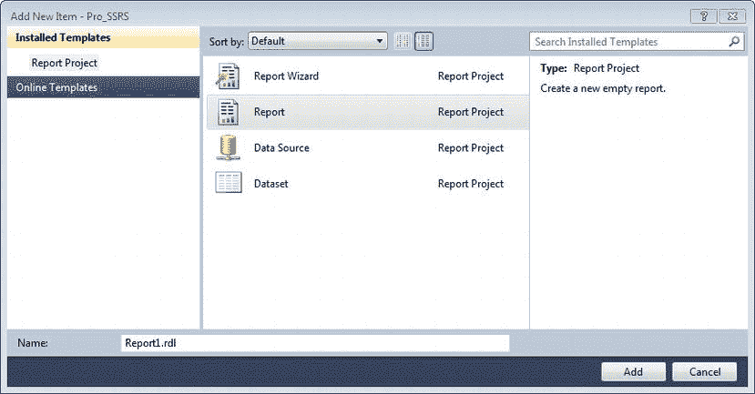
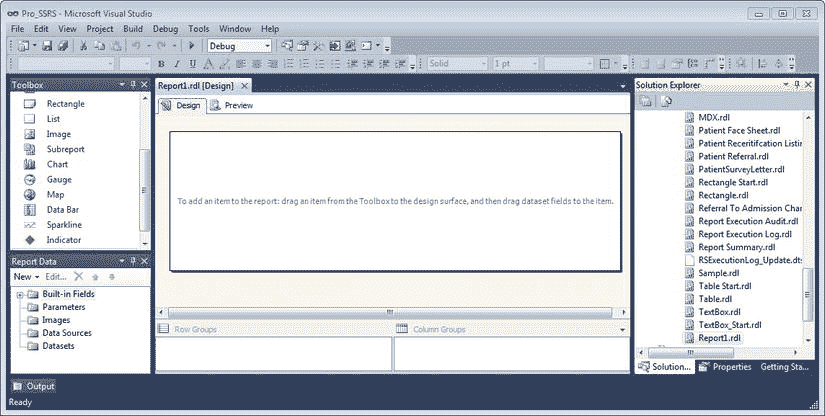
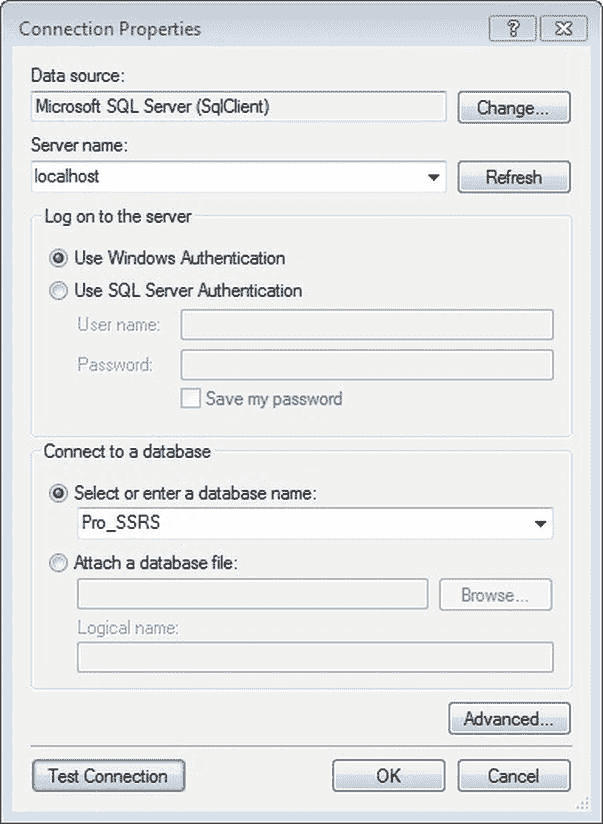

# 第 3 章

## 使用 SQL Server Data Tools 进行报表服务设计简介

系统管理员、DBA 和开发人员之间的专业界限正在变得模糊。产品通常可以通过代码进行扩展，或者至少具备创建远超出其开箱即用功能的功能的潜力。SSRS 就是这样一个应用程序。Microsoft 管理控制台（MMC）的时代已经屈指可数，并将被新的集成开发环境（IDE）所取代，尽管正如任何开发人员都会告诉你的那样，IDE 本身也早已不是什么新鲜事物了。然而，系统管理员、DBA，甚至报表设计人员都不得不熟悉这种执行日常任务的新方式。正如你可能已经意识到的，你可以在 Visual Studio 2005 及更高版本中，或在 BIDS/SSDT 中为 SSRS 创建报表。为了提醒你这些缩写，SSRS 2005 到 2008 R2 版本中包含的设计器被标记为 Business Intelligence Development Studio（BIDS）。然而，在 2012 版本中，Microsoft 决定将设计器重新命名为 SQL Server Data Tools（SSDT），因为其中包含了诸如与 SQL Azure 环境进一步开发集成等功能。能够使用 SSDT/BIDS 对 Visual Studio 开发人员来说是一个优势，因为他们现在可以使用同一个 IDE 来创建报表和进行应用程序开发！对于我们其他人来说，在 Visual Studio 2010 中创建报表存在一个学习曲线。

SQL Server 2005 引入了两个新的管理和开发环境：BIDS（Visual Studio 2005 的一个子集）和 SSMS。在 SQL Server 2008、2008 R2 和 2012 中，这些应用程序得到了增强，以改进设计和管理功能在通用工具集中的集成。

现在你已经开发了查询和存储过程，可以将注意力转向安装 SQL Server 时可用的报表设计工具。在接下来的三章中，我们将让你熟悉报表设计工具，然后在第 6 章中向你展示如何创建一个完整的 SSRS 报表。我们将涵盖的主题包括：

*   SQL Server Data Tools（SSDT/BIDS）的元素
*   RDL 在 SSRS 中的作用，以及它控制的各个报表对象的示例代码
*   创建数据源和数据集
*   定义查询和报表参数
*   讨论报表分页
*   定义表达式和筛选器，以演示如何结合使用它们来控制报表内容和格式
*   实现 Tablix 属性（SSRS 2008 中的新功能），它通过结合行分组和列分组扩展了多个数据区域的功能
*   创建数据区域示例：列表、文本框、表、矩形、矩阵、图表和图像
*   实现地图、数据条、迷你图和指示器，这些都为报表提供了更复杂的仪表板风格元素

在本章中，我们将向你展示如何使用 2010 环境中嵌入的 SSRS 元素来设置和探索 SSDT/BIDS IDE。

每个人的学习方式不同——有些人喜欢遵循逐步指南以达到已知结论，有些人喜欢查看完成的报表以了解其设计的具体组件。因此，我们将在本章及后续章节中提供这两种方法。具体来说，我们将向你展示如何从头开始构建每个示例，同时也会指引你到本书在 [`www.apress.com`](http://www.apress.com) 的目录页面上提供的源代码下载中的完整示例，以便你在按照步骤实现最终结果的同时分析报表。

我们为你提供了在本章中将要使用的所有数据源、报表和项目，它们包含在一个名为 `Pro_SSRS` 的解决方案中。你可以在 BIDS 和 Visual Studio 2010 中打开此解决方案。如前所述，Microsoft 已将名称从 Business Intelligence Development Studio 更改为 SQL Server Data Tools（SSDT），但在本书中，我们将交替使用 BIDS 和 SSDT。你可以在 Apress 网站的源代码/下载区域找到为每章安装示例的详细说明。本章将主要关注 BIDS 的 IDE，并提供一个分步指南，帮助你熟悉 BIDS。第 4 章 将描述特定于 SSRS 的报表对象（如列表和表格）的使用，第 5 章 将介绍诸如图表、仪表、地图、迷你图和数据条等报表对象。当你开始创建这些特定的报表示例时，每个对象都会有两份报表：一份起点报表和一份完成的报表样本；我们将在每个主要部分的开头和结尾指出它们。这种方法允许你逐步执行过程，生成起点报表中的输出，然后打开并将最终结果与完成的报表进行比较。


### 探索 BIDS 的构成元素

在 BIDS 中，一个或多个 `项目` 包含了所有的报表和共享数据源。项目从物理和逻辑上将报表分组在一起，并维护特定于该属性。这些属性使得项目能够独立于其他项目运行。所有创建的项目本身都包含在一个 `解决方案` 中。解决方案就是一个或多个项目的集合，这些项目对 Visual Studio 可用。一个单一的解决方案可以包含一个报表服务项目、一个集成服务项目、一个分析服务项目，以及一个 Windows 或 Web 应用程序项目。

现在，我们将向您展示如何启动 BIDS 来创建一个解决方案和一个报表服务项目。要创建解决方案，您需要加载 BIDS。通过选择“开始”  “所有程序”  “Microsoft SQL Server 2012”  “SQL Server Data Tools” 来导航到加载 `devenv` 可执行文件的快捷方式。SQL Server Data Tools (SSDT) 和商业智能开发工作室 (BIDS) 都是 `devenv` 可执行文件的快捷方式。在本章及本书的其余部分，我们可能会将 SSDT 称为 BIDS，因为使用此工具的大多数开发工作都与商业智能相关。然而，BIDS 和 SSDT 是可以互换的术语。打开 BIDS 后，您可以通过选择菜单栏“文件”菜单下“新建”子菜单中的“项目”来进入新建项目屏幕，或者直接单击“起始页”上的“新建项目”按钮，如 图 3-1 所示。



**图 3-1.** 商业智能开发工作室起始页

“新建项目”对话框打开。在“已安装的模板”  “商业智能”  “Reporting Services” 下选择“报表服务器项目”。如果这是您创建的第一个项目，项目名称默认为 Report Project1。项目位置可以是本地驱动器或网络位置。在本例中，将其设为 `C:\Pro_SSRS\Reports`。

默认情况下，解决方案根据项目名称命名，即 Report Project1，如 图 3-2 所示。如果勾选“为解决方案创建目录”框，您可以为基本位置附加一个新目录。在本例中，选择 Solution1。单击“确定”后，项目和解决方案都将被创建，您可以在项目内创建报表项和数据源。



**图 3-2.** “新建项目”对话框

如果您知道报表将部署到何处，那么添加几个重要的项目属性设置被认为是良好的实践：在 SSRS 服务器上部署报表的目标文件夹，以及 SSRS 服务器的 URL。您可以使用解决方案资源管理器查看和设置这些属性，该窗口显示打开的解决方案及其包含的项目，以及各个项目可能包含的所有报表和其他对象。默认情况下，BIDS 将解决方案资源管理器置于环境的右侧，但它也可能停靠或在其他位置浮动。如果看不到它，请单击菜单栏上的“视图”  “解决方案资源管理器”。在解决方案资源管理器中高亮显示项目，然后从菜单中选择“项目”  “属性”（或右键单击项目并选择“属性”），您将看到一个类似 图 3-3 的窗口。`TargetReportFolder` 属性控制在 SSRS 服务器上创建的文件夹，用于存储已部署的报表和数据源。您可以使用 `TargetDataSourceFolder` 和 `TargetDatasetFolder` 属性来存储特定于项目的数据源和共享数据集。`TargetServerURL` 属性是 SSRS Web 服务器 URL（当您开始使用 SharePoint 集成模式时——这将在 第 12 章 中介绍，此属性将包含 SharePoint 服务器 URL）。如 图 3-3 所示，TargetServerURL 属性的形式为 `http://servername/ReportServer`。在本例中，SSRS Web 服务器是 `localhost`。



**图 3-3.** 项目属性

 **注意** 我们将在 第 8 章 中介绍其他一些设置，例如 `TargetDatasetFolder`、`TargetDataSourceFolder` 和 `TargetReportPartFolder`。然而，除非对象需要由无法访问指定 `TargetReportFolder` 的报表开发人员或最终用户使用，否则最好使用您在 `TargetReportFolder` 中设置的文件夹结构来存储项目对象。例如，图 3-3 中的 `TargetReportFolder` 是 `Pro_SSRS`，而 `TargetDataSourceFolder` 设置为 `Pro_SSRS/DataSources`。这样可以防止其他开发人员覆盖您的数据源、数据集或报表部件。

### 设置基本的集成开发环境

现在您有了一个新的解决方案和一个新的项目来容纳您将构建的报表，是时候进行个性化设置了。作为一名报表设计人员，您将花费大量时间凝视着作为您创作的像素，因此按照您想要的方式准确设置环境非常重要。设计报表的理想设置是个人的选择。有些人喜欢高分辨率显示设置，并且环境中所有可用的设计工具栏始终可见，而另一些人则喜欢浮动工具栏和较低分辨率的双显示器设置。无论您的偏好如何，BIDS 都可以轻松地在 IDE 中操作设计工具以个性化您的配置。除了上一节介绍的解决方案资源管理器外，您还可以在 IDE 中使用几种常用工具来设计报表：

> `工具箱`：在这里您可以找到本章涵盖的所有报表对象，例如矩阵和表格数据区域。数据区域是在 SSRS 报表设计环境中定义的报表对象，其中包含来自数据集的字段值。
>
> `属性窗口`：在这里，您可以设置报表项的各种格式和分组属性的值。
>
> `错误列表窗口`：在排查报表错误时您将需要它。数据类型不匹配和函数无效使用是设计报表时常见的问题。错误列表窗口是查看这些错误详细信息的地方。
>
> `报表数据窗口`：此窗口包含内置字段、数据源、数据集、图像以及您为报表定义的字段信息。

图 3-4 展示了在 SSRS 中设计报表的自定义布局。您可以在 IDE 中的任何位置停靠任何工具栏，也可以将它们放置在 IDE 之外的桌面上。此设置在分辨率配置为 1152 × 864 或更高时效果最佳。在 图 3-4 的设置中，工具箱是浮动的，解决方案资源管理器位于报表设计网格的右侧。如果您愿意，可以设置工具栏在不使用时自动隐藏——在此示例中，显示隐藏的“报表数据”窗格的按钮位于左上角。BIDS 与完整的 Visual Studio 2010 环境一样，具有一个停靠位置映射图，可帮助您精确定位可停靠项。当您在报表设计器内移动项目时，您可以看到在边缘和中间略带透明的映射图。



**图 3-4.** IDE 配置示例


## 理解报表定义语言

RDL 是一个标准，所有使用 Visual Studio 2010 内置 SSRS 工具及其他 SSRS 服务创建的报表都遵循此标准。RDL 是一种基于 XML 的模式，它定义了报表的每个元素，例如格式、数据集信息、分组和排序以及参数和筛选器。当你向报表中添加项目时，RDL 代码会随之更改以包含每个新增项。

在集成开发环境中，这些代码更改通常是不可见的，因为它们在后台进行。然而，偶尔你可能需要直接修改 RDL，以使用查找和替换方法进行全局更改。当源存储过程中的参数或字段名称发生更改时，我们不得不多次这样做。在 Visual Studio 2010 中处理报表时，你可以通过点击菜单中的“视图”>“代码”或右键单击报表并选择“查看代码”来直接查看 RDL 代码。

Visual Studio 2010 和 BIDS 是当前 SSRS 的主要报表设计器，但随着越来越多的公司采用 RDL，其他报表设计器可能会出现。事实上，在 SQL Server 2005 中，Microsoft 引入了一个报表生成器应用程序，允许最终用户设计和发布 SSRS 报表。SQL Server 2008 包含了一个新版本，恰当地命名为 Report Builder 2.0，它采用了 Microsoft Office Ribbon 技术并进行了彻底的改版，进一步将报表开发交到报表请求者的手中。随 SQL Server 2008 R2 发布的 Report Builder 3.0 拥有更多用于临时最终用户报告的功能。Report Builder 1.0 和 2.0 仍可用于向后兼容，并且 1.0 版本仍然依赖于报表模型作为其数据源，这与 2.0 和 3.0 版本不同。第 13 章将更详细地介绍 Report Builder 1.0、2.0 和 3.0 应用程序及其组件。

在本章中，我们将展示你正在处理的报表对象的 RDL 部分，以显示在设计报表时 RDL 是如何更新的。完整的 RDL 模式可在 [`http://schemas.microsoft.com/sqlserver/reporting/2008/01/reportdefinition`](http://schemas.microsoft.com/sqlserver/reporting/2008/01/reportdefinition) 获取。

### 添加报表

根据 Microsoft 的一般策略，有不止一种方法可以将报表添加到项目中。一种方法是使用向导来完成报表创建过程，但目前，我们只是将一个空白报表添加到我们的项目中。在解决方案资源管理器中右键单击“报表”文件夹，选择“添加”，然后选择“新建项”。请注意，你也有添加现有项的选项。如果你已经有一个要添加到项目的报表，或者你已经构建了一个模板报表文件作为基础起点，这个选项很有用。现在，在如图 3-5 所示的“添加新项”对话框中选择“报表”，然后单击“添加”，在项目中创建一个名为 `Report1.rdl` 的空白报表。



*图 3-5. BIDS 中的添加新项对话框*

新报表应在设计环境中打开，但如果没有打开，请双击解决方案资源管理器中的新报表。默认情况下，报表名为 `Report##.rdl`，其中 `##` 是序列中下一个可用的报表编号。此时，报表是一张白纸。图 3-6 显示了 IDE，包括解决方案资源管理器、工具箱和报表数据窗口。如果你熟悉在 Visual Studio 2005 中创建报表，你会注意到“数据”选项卡已从“设计”和“预览”选项卡中分离出来，现在位于一个专用的“报表数据”窗口中。在 SQL Server 2008 R2 版本中，我们在报表数据窗格中被提供了另一个名为“数据源”的文件夹。现在，只需记住这个新的 IDE 旨在集中管理你的本地和共享数据源。同样，从 VS 2005 过来，你会注意到新的“行组”和“列组”区域，旨在更轻松地管理 Tablix 风格的分组。与任何包含来自数据源数据的报表一样，第一步是在报表和数据源以及一个或多个数据集之间建立链接。我们将在下一节中完成这两项操作。



*图 3-6. 加载了 `Report1.rdl` 的 BIDS IDE*

### 设置数据源和数据集

在 SSRS 中创建的每个报表都包含一个*数据源*和一个*数据集*。数据源不仅定义了为检索数据而建立的连接类型（无论是 SQL Server、Analysis Services 还是 Oracle），还定义了特定的连接属性，例如服务器、数据库名称和安全凭据。另一方面，数据集是从数据源返回的数据、行和列或字段。数据集是通过构建一个从数据源检索信息的查询来创建的。这个查询，在 SQL Server 数据源的情况下，可以是一个直接嵌入报表中的基于文本的查询，或者是一个存储过程。

在第 2 章中，你创建了一个名为 `Emp_Svc_Cost` 的存储过程，其中包含员工和患者就诊信息。在本章中处理大多数报表对象时，你将使用该过程作为你的数据集。对于其他报表对象，例如图像报表对象，你将使用直接查询而不是 `Emp_Svc_Cost` 存储过程。


### 创建数据源

每份报表可以使用一个或多个数据源。使用相同数据源的报表——例如连接到特定 SQL Server 数据库的数据源——可以使用 SSRS 中所谓的 `共享数据源`。共享数据源会随报表一同发布，并可在部署后在报表服务器上进行修改。在 BIDS 中，共享数据源包含若干属性，您必须先配置这些属性才能使用它们。

让我们逐步完成为存储过程 `Emp_Svc_Cost` 创建共享数据源的过程。首先，在解决方案资源管理器中右键单击 `共享数据源`，然后选择 `添加新数据源`；此时将出现 `共享数据源属性` 对话框。其次，单击对话框中的 `编辑` 按钮以创建连接字符串。在本例中，您知道包含源数据库和存储过程的服务器位于本地 SQL Server 上，因此您可以键入 `localhost` 作为服务器名称。由于我们在上一窗口中保留了默认连接类型，因此数据源属性设置为 `Microsoft SQL Server (SqlClient)`。在键入 `localhost` 作为服务器后，您可以从数据库下拉选择列表中选择 `Pro_SSRS` 数据库。在本例中，由于数据库配置为同时使用 Windows 和 SQL 身份验证，请选择 `使用 Windows 身份验证` 选项。如果您选择使用 SQL 身份验证，还可以选择存储 SQL 用户名和密码。通常，Windows 身份验证是首选方法，因为它为用户提供了单一登录点（第 11 章 介绍了已部署报表的身份验证）。图 3-7 显示了数据源连接属性。您可以通过单击 `测试连接` 按钮来测试连接。



`图 3-7. 数据源连接属性`

 **注意** 在 Reporting Services 2012 中，您可以从多种数据源类型中选择。SQL Server 恰好是默认值，但您可以从 SQL Azure、Analysis Services、Oracle、SAP 和 TERADATA 等来源获取数据。当然，您也可以使用通用的 OLE DB 和 ODBC 数据源。

现在您已经拥有一个共享数据源。请注意，其名称默认为 `DataSource1`。您可以通过右键单击它，选择 `重命名`，并输入 `Pro_SSRS.rds` 作为新名称来对其进行重命名。良好的做法是为每个数据源赋予一个有意义的名称，例如它将连接到的数据库的名称。在实际环境中，您将在不同的服务器上部署报表和/或数据库，因此不建议在数据源名称前加上包含数据库的服务器名称。换句话说，不建议将您的数据源命名为 `DEV_Pro_SSRS` 来表示开发数据源，您也不会想将数据源命名为类似 `Server1_Pro_SSRS` 的名称。

在实践中，我们使用相同的名称开发了所有报表。但是，由于我们的每个在线客户都有一个唯一标识他们的数据库名称，我们设计了一个应用程序，在发布后重置数据源中的数据库属性。这样，我们就可以对相同的数据库架构使用相同的报表，但可以将它们部署到同一报表服务器上的多个客户。

在此示例中，您创建的数据源文件具有 `.rds` 扩展名，并与报表分开存储和发布。您可以在文本编辑器中打开 `.rds` 文件，因为它是一个 XML 文件，定义了您刚刚以图形方式创建的连接属性。清单 3-1 显示了 `Pro_SSRS.rds` 文件。

`清单 3-1. Pro_SSRS.rds 文件`

```
<?xml version="1.0" encoding="utf-8"?>
<RptDataSource xmlns:xsi=http://www.w3.org/2001/XMLSchema-instance >
<Name>Pro_SSRS</Name>
<ConnectionProperties>
<Extension>SQL</Extension>
<ConnectString>Data Source=localhost;Initial Catalog=Pro_SSRS </ConnectString>
<IntegratedSecurity>true</IntegratedSecurity>
</ConnectionProperties>
<DataSourceID >99401d15-cd9b-489a-b3ee-e027de26a4e0 </DataSourceID> </RptDataSource>
```


