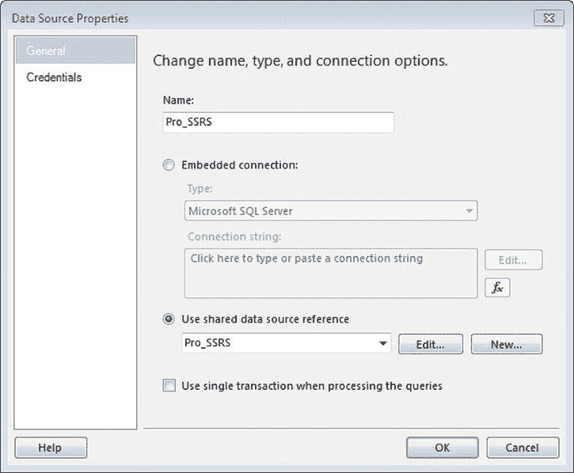
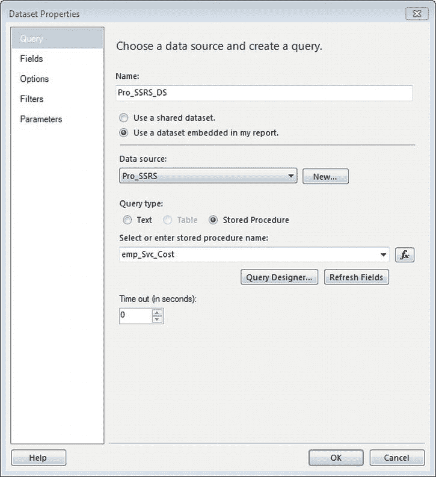
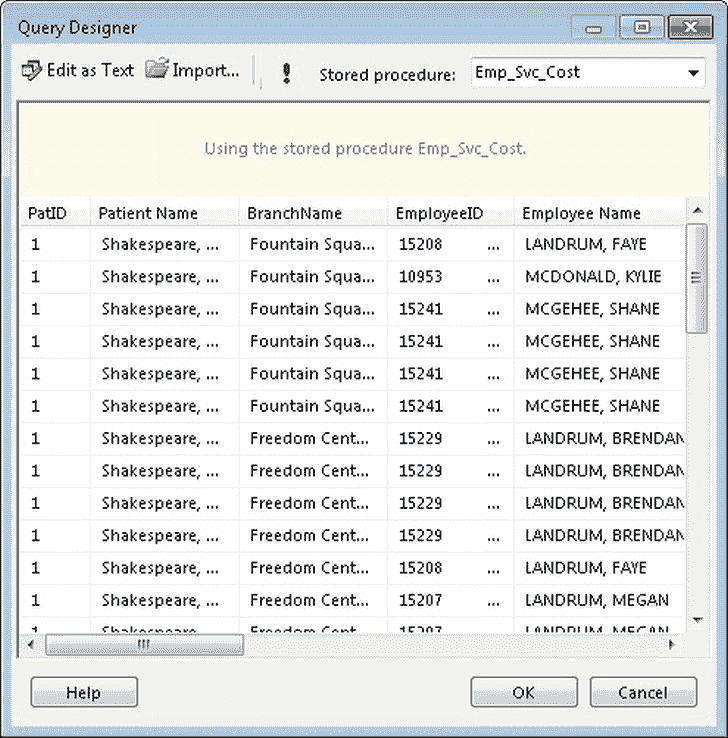
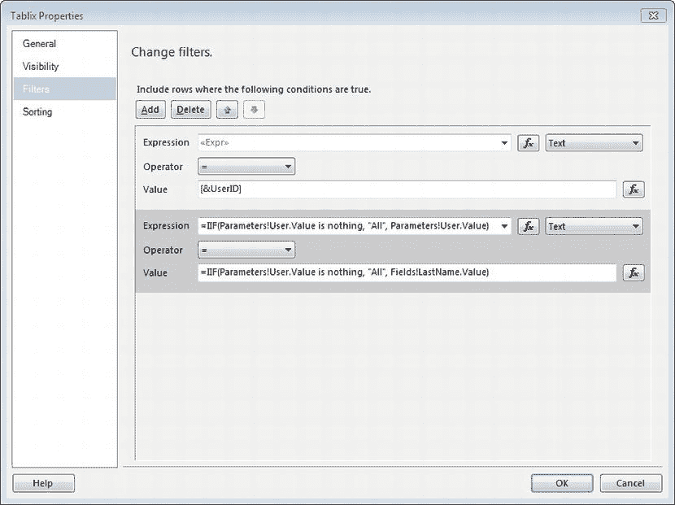
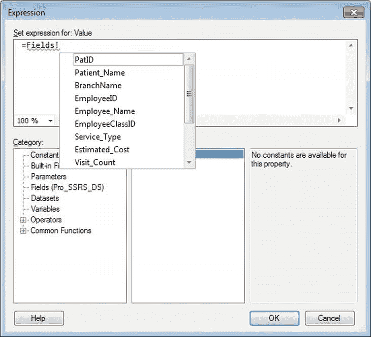
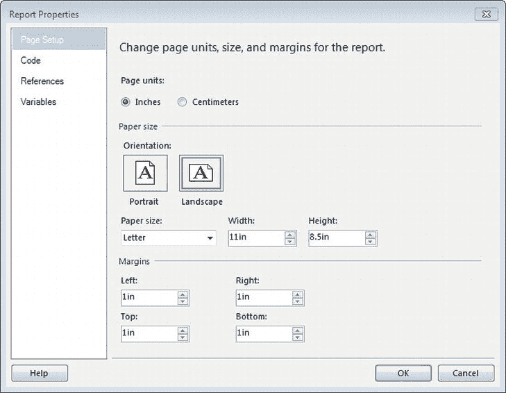
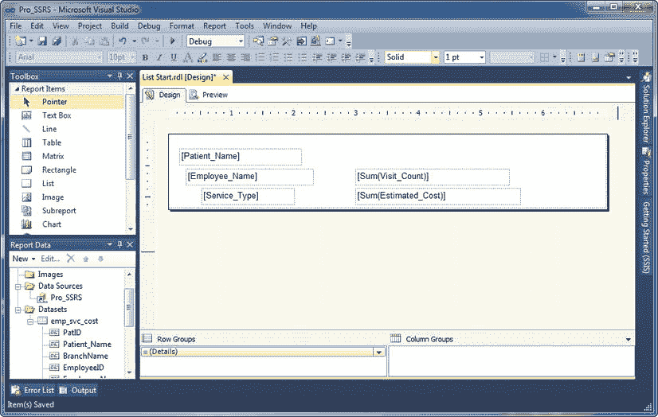
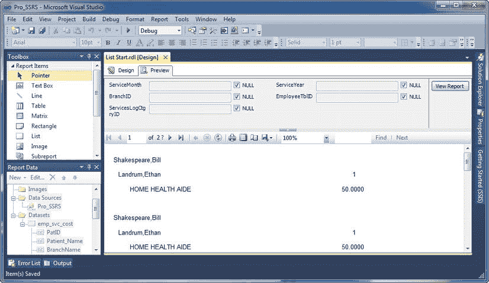

# 创建数据集

你的下一步是前往“报表数据”区域以创建第一个数据集。无论你是否已在 BIDS 之外的应用程序中开发了查询或存储过程，或者你现在正从报表中开始创建，这都适用。在此示例中，你将使用一个已完成并测试过的存储过程，因此一半的战斗已经结束。

使用 BIDS 开发 SSRS 2008 R2 和 SSRS 2011 报表时，你通过两个步骤创建数据集：创建到数据源的链接和获取报表所需的数据。

> 1.  在“报表数据”框中，选择 `<新建数据集...>`，这将打开“数据集属性”对话框。每个数据集默认名称格式为 `DataSet##`，其中 `##` 是序列中下一个未使用的数字。
> 2.  你可以使用共享数据集，但在此示例中，你将使用嵌入在报表中的数据集。选择“使用嵌入在我报表中的数据集”选项。
> 3.  现在，在此数据集和我们之前创建的数据源之间建立链接。单击数据源下拉框旁边的“新建”按钮。
> 4.  在“数据源属性”窗口中，将数据源命名为 `Pro_SSRS` 并选择 *使用共享数据源引用*。
> 5.  单击下拉列表框，选择我们之前创建的 `Pro_SSRS` 共享数据源。
> 6.  图 3-8 显示了这些设置的数据源属性窗口。单击“确定”保存你的设置。



**图 3-8.** 数据源属性

现在我们有了到共享数据源的链接，我们可以将数据集指向我们的存储过程。在“查询类型”部分，将默认的“文本”更改为“存储过程”。在“选择或输入存储过程名称”文本框中，输入你的存储过程名称 `Emp_Svc_Cost`，如图 3-9 所示。最后，为新数据集输入 `Pro_SSRS_DS` 作为名称，并单击“确定”完成数据集配置。



**图 3-9.** 数据集属性

当你单击“确定”时，“报表数据”窗口后台会发生几件事。在“数据源”文件夹下创建了一个名为 `Pro_SSRS` 的数据源，在“数据集”文件夹下创建了一个名为 `Pro_SSRS_DS` 的数据集。此数据集填充了存储过程中的可用字段。同时，BIDS 会创建存储过程接受的所有参数。此时你无法看到实际数据，但你可以右键单击数据集并选择“查询…”以调出默认的通用查询编辑器，你可以在其中执行存储过程。在执行时，系统会提示你输入存储过程定义的任何参数；你必须在返回数据之前提供参数值。对于此存储过程，定义了五个参数：`@ServiceYear`、`@ServiceMonth`、`@BranchID`、`@EmployeeTblID` 和 `@ServicesLogCtgryID`。当在“报表数据”框中执行存储过程时，参数的可用默认值是 `NULL` 或 `空白`。与 `NULL` 值不同，`空白` 值可以是空字符串。`NULL` 值表示该值未知，并且 `NULL` 值不能与非 `NULL` 值一起进行计算。在第 2 章中，你已将逻辑构建到存储过程中以处理 `NULL` 参数值，以便当用户未提供值时，查询返回所有记录。如果用户选择了特定值，则仅返回与该参数值匹配的记录。使用 `NULL` 值执行存储过程，并确保你获得预期的结果。你可以在图 3-10 中看到存储过程执行的结果。



**图 3-10.** 从存储过程返回的数据

 **注意** 当系统提示你输入参数值时，`空白` 是默认值。为使存储过程执行时不出现数据类型错误，你必须选择 `NULL` 值。

一个 SSRS 报表可以同时使用多个数据集。这扩展了报表的灵活性，因为你可以在单个报表中为用户提供更多数据。多个数据集对于填充参数下拉列表也很有用，你将在第 6 章中执行此操作。但是，拥有过多数据集可能会影响报表的性能，因此确保每个结果集的执行时间在可接受的范围内非常重要。

每个报表的 RDL 文件包含报表定义的每个数据集的一个部分。清单 3-2 显示了你在本章定义的数据集的 RDL 示例。

**清单 3-2.** RDL 的数据集部分

```xml
<DataSets>
   <DataSet Name="Pro_SSRS_DS">
<Fields>
   <Field Name="PatID">
<DataField>PatID</DataField>
        <rd:TypeName>System.Int32</rd:TypeName>
   </Field>
   <Field Name="Patient_Name">
<DataField>Patient Name</DataField>
<rd:TypeName>System.String</rd:TypeName>
   </Field>
   <Field Name="BranchName">
<DataField>BranchName</DataField>
<rd:TypeName>System.String</rd:TypeName>
   </Field>
   <Field Name="EmployeeID">
<DataField>EmployeeID</DataField>
<rd:TypeName>System.String</rd:TypeName>
   </Field>
   <Field Name="Employee_Name">
<DataField>Employee Name</DataField>
<rd:TypeName>System.String</rd:TypeName>
   </Field>
   <Field Name="EmployeeClassID">
<DataField>EmployeeClassID</DataField>
<rd:TypeName>System.String</rd:TypeName>
   </Field>
   <Field Name="Service_Type">
...
```

创建数据集时，有几个附加选项卡包含其他配置属性：

> *字段*：定义其他字段，例如计算字段或未随数据源自动定义的字段。你根据表达式派生计算字段。
>
> *选项*：设置特定于从数据提供程序检索数据时的若干选项，例如区分大小写和排序规则。
>
> *参数*：定义数据集的查询参数值及其评估顺序。声明了参数的存储过程会在 SSRS 中自动生成查询参数。
>
> *筛选器*：定义数据集的筛选器值，可在执行报表时使用。

## 创建其他数据源

SSRS 有一个令人兴奋的特性，它不仅能查询 SQL Server，还能查询多种数据源类型。如前所述，任何 ODBC 或 OLE DB 提供程序都可以作为 SSRS 的数据源，XML、SSIS 和 SAP 同样可以。为了展示一个使用 SQL Server 数据库之外数据源的简单示例，让我们看看用于 Microsoft 目录服务的 OLE DB 提供程序。创建到目录服务的数据源与您用于创建 SQL Server 数据源的过程类似，区别在于您需要在数据源属性中选择 OLE DB 作为数据源类型，并为 OLE DB 提供程序选择用于 Microsoft 目录服务的 OLE DB 提供程序。

通过使用直接的 LDAP 查询，您可以生成用于 SSRS 的字段信息，如下所示：

```sql
SELECT en,sn,objectcategory,department
FROM  'LDAP://DirectoryServerName/OU=OuName,DC=Company,DC=Com'
```

该查询使用标准的 SQL 方言，从 Active Directory 返回通用名称、姓氏、对象类别（计算机或人员）和部门。字段名称会自动创建，并可像报表中的任何其他数据字段一样使用。

在查询 Active Directory 或任何其他不支持 SSRS 图形化查询设计器的数据源时，您必须考虑几个注意事项：

> *   查询参数在查询中不被直接支持。但是，您可以在查询中定义和使用报表参数——这被称为*动态查询*——来过滤数据。
> *   由于没有图形化查询设计器可用，您需要通过直接键入查询并在通用查询设计器中进行测试来开发查询。这需要了解 Active Directory 对象和名称。

`` **`提示`** 有几种工具可用于协助管理 Active Directory，例如 Active Directory 应用程序模式（ADAM）；LDP，一个 Active Directory 工具；以及 ADSIEdit，一个图形化的 Active Directory 浏览器。两者都包含在 Windows 支持工具中。

### 配置参数

SSRS 中的参数有两种类型，*查询参数* 和 *报表参数*，这两者通常紧密相关。

您使用基于 SQL 查询或存储过程的参数来限制返回到报表的记录集，通常位于查询的 `WHERE` 子句中。在源查询中，您通过在参数名称前加上 `@` 符号来定义参数，例如 `@MyParameter`。在 SSRS 的查询设计工具中，这会产生两个作用：它强制查询在执行时提示输入参数的值。其次，它会自动使用相同的名称创建另一个参数，即报表参数。对于存储过程，例如您在上一章创建并在此处使用的 `Emp_Svc_Cost`，存储过程中定义的任何参数也会为报表自动创建。

报表参数可以独立于查询或存储过程而存在。例如，您可以有一个控制报表行为或布局属性的报表参数。当您以这种方式使用报表参数时，它通常链接到报表筛选器或用于控制报表项属性值的表达式中。在 图 3-11 中，您可以看到当我们执行 `Emp_Svc_Cost` 存储过程时为我们自动创建的报表参数。您还可以看到单个参数（如 `ServiceMonth`）的报表参数对话框，您可以通过双击参数或右键单击并选择“参数属性”来打开它。报表参数在 Visual Studio 或 BIDS 中现在集中显示在“报表数据”框中，而在早期版本中，它们包含在自己的报表参数属性框中。报表参数在报表中用于设置数据集的条件以及控制报表设计布局元素，您将在 第 6 章 中详细执行此操作。

``

***图 3-11.** 报表参数对话框*

图 3-11 还显示了“允许多值”复选框，这是 SQL Server 2005 的一个新 SSRS 功能。多值参数允许用户选择所有值或值的组合，以在报表中用于限制显示的数据。当选择多个值时，它们作为字符串数组传递给查询或存储过程。重要的是要注意，多值参数在报表中实现时需要以下特殊考虑：

> *不接受 NULL 值*：在决定将哪些参数设为多值时，这一点很重要，因为它会影响底层查询或存储过程的设计。在这种情况下，您在 `Emp_Svc_Cost` 存储过程中构建了逻辑以接受 `NULL` 值，并在从参数传入 `NULL` 时返回所有数据。您将需要修改此存储过程以与多值参数配合工作。
>
> *将被视为字符串*：由于多值参数返回逗号分隔的字符串，您需要考虑存储过程参数的数据类型分配——报表参数与查询或存储过程参数需要具有相同的数据类型才能正常工作。
>
> *影响性能*：当值列表相对较小时，最好使用多值参数。选择允许用户选择年份范围——例如“2010,2011,2012”——比允许他们基于 ID 选择 1,000 名患者要好得多，因为这些值都将作为逗号分隔的字符串值传入存储过程，以使用 `IN` 或 `EXISTS` 子句进行评估。
>
> *不能用于筛选器*：与 SSRS 中的单值或可为空参数不同，多值参数只能用于传回查询或存储过程，因此不能将它们用于报表筛选器来限制数据。
>
> *在存储过程中需要字符串处理逻辑*：存储过程无法正确评估多值参数，因此，例如在存储过程中使用 `IN (@MyReportParameterArray)` 将不会返回预期的结果。这是 SQL 长期以来的一个问题，存在多种方法（无论好坏）来处理存储过程中的多值字符串数组。两种可能的选择是用户定义函数（UDF）和动态 SQL。在第 6 章中，涵盖了构建可部署报表的内容，我们将讨论如何使用一个特殊的 UDF，它将多值报表参数解析为一个表，该表将有效地将结果集限制为完全符合预期的内容。


## 第 4 章：布局报表

现在，是时候深入 IDE 中你可能花费最多时间的区域了：`设计`选项卡。真正的创意魔法将从这里开始，我们这么说可不仅仅是因为其中可能会涉及一两个向导。

不同的报表需求和目标受众意味着每份报表的外观和感觉不会千篇一律。一位用户可能期待向下钻取功能，而其他人可能需要用于打印的完整、详细的数据列表。无论哪种情况，SSRS 在 `工具箱` 中提供了许多工具，用于快速高效地构建高质量的报表，这些报表可以直接从 `BIDS` 中部署。在接下来的章节中，你将使用示例数据，并通过探索每个可用工具和数据区域的功能来实际应用它们。

对于我们演示的每一个对象，我们将同时展示其设计环境的图形化表示及其对应的 `RDL` 代码。请注意，`RDL` 文件中定义的部分包含了报表的每个方面，从整体布局到分页。这一点很重要，因为直接在 `RDL` 文件中修改报表通常更为简便。当我们演示如何为示例报表项目添加功能时，我们会指出那些将图形化报表设计转换为代码的 `RDL` 文件部分。

### 设置筛选器

与参数类似，报表筛选器可以限制报表上的数据结果；然而，你不一定需要将它们与参数结合使用。实际上，筛选器可以在报表的多个位置定义，它评估一个表达式并根据该执行结果来筛选数据。筛选器采用以下形式：

`<筛选表达式> <运算符> <筛选值>`

筛选器的一个例子是，将报表上的数据限制为特定用户，或基于来自参数值的用户输入进行限制。

`第 11 章` 将演示如何使用一个基于内置 `全局` 集合（其中包括执行报表的用户名）来限制报表的筛选器。筛选器很有用，因为一旦报表呈现，你可以结合参数来使用它们，以限制报表中的数据，而无需重新查询数据源。在 `图 3-12` 中，你可以看到一个基于名为 `用户` 的参数来限制显示数据的筛选器。其逻辑是：如果 `用户` 的参数值等于 `用户` 字段的值，则只包含匹配的记录。否则，包含所有记录。参数和筛选器作为 `RDL` 报表文件的元素被包含其中。



`图 3-12`. 表数据区域上的示例筛选器

`清单 3-3` 展示了筛选器的示例 `RDL` 元素。

`清单 3-3`. 参数和筛选器 `RDL` 元素

```
<Filters>
   <Filter>
      <FilterExpression>=IIF(Parameters!User.Value is nothing, "All", Parameters!User.Value)
      </FilterExpression>
      <Operator>Equal</Operator>
         <FilterValues>
              <FilterValue>=IIF(Parameters!User.Value is nothing, "All", Fields!LastName.Value)
              </FilterValue>
         </FilterValues>
   </Filter>
</Filters>
```

### 表达式

在本节中，你将使用数据集中的字段来创建示例报表片段。由于字段值源自本质上是 `VB.NET` 代码的 *表达式*，我们现在就来介绍它们，因为它们在报表设计过程中扮演着至关重要的角色。

你可以使用表达式为任何使用它们的报表项生成一个值。在 `SSRS` 中，你可以将表达式分配给几乎任何报表属性，从颜色或内边距等格式到文本框的值。一个简单的表达式，比如字段赋值，在设计报表时经常使用。事实上，每次向报表的某个区域添加一个字段时，它都会自动转换为一个表达式，像这样：

`=Fields!FieldName.Value`

表达式通过在内容前加上等号 (`=`) 来标识。你还可以将表达式与其他函数和字面量连接起来。我们将在本书中展示几个表达式的例子。这里我们将列出几个示例表达式，并展示如何将它们分配给报表项：

> `=Parameters!ParameterName.Value`: 用于将参数值分配给报表项，例如文本框或表格中的单元格。
>
> `=IIF(Fields!FieldName.Value > 10, "Red", "Black")`: 用于条件表达式。在这个例子中，如果 `FieldName` 的值大于 10，则将文本颜色属性设置为红色，否则设置为黑色。
>
> `=Fields!FieldNamel.Value & " " & Fields!FieldName2.Value`: 用于连接两个字段的值。
>
> `=Avg(Fields!FieldName.Value)`: 用于聚合函数，如 `Sum`、`Avg`、`Min`、`Count` 和 `Max`，这些函数返回指定字段的聚合值、最小值或最大值。
>
> `=RowNumber(Nothing)`: 用于维护报表中行号的运行总计。这里的 `Nothing` 是传递给函数的一个范围参数，指示一个分组或数据集。范围参数可以是组名或数据集，在这种情况下，行计数将在每个组或数据集结束时重新开始。

在用于 `SQL Server 2005` 的 `SSRS` 中，报告开发环境中使用的表达式生成器应用程序被重建，以提供协助用户轻松创建有用表达式所需的功能。值得庆幸的是，此后的所有版本都保留了更高级的表达式生成器，它列出了大多数常用函数及其语法示例；此外，它们按类型（`文本`、`转换`、`日期和时间`）分类。这使得更快地找到正确的函数并将其作为你正在构建的表达式的一部分放置变得容易得多。开发者们已经习惯并坦率地说离不开的另一个强大功能是 `IntelliSense`，这是一个上下文相关的、行内的命令完成功能。如你在 `图 3-13` 中所见，当你键入一个表达式（在本例中是一个来自存储过程的字段值表达式）时，系统会根据该表达式提示所有可能的选择。一旦表达式完整且语法正确，你可以单击 `确定` 使该表达式成为你关联它的报表对象的一部分。如果存在任何语法错误，标准的红色下划线会标示出问题，将鼠标悬停在其上会显示错误类型，在大多数情况下是“语法无效”。这是对 `SSRS` 中表达式的一个快速介绍，但在 `第 6 章`，我们将使用它们来执行诸如在运行时设置默认参数和属性值等任务。



`图 3-13`. `IntelliSense`: 分配表达式

## 总结

至此，我们只是触及了开发环境所能提供功能的皮毛。在本章中，你了解了开发环境以及 `Reporting Services` 设计的一些基本元素。你了解到每份报表都由基于 `RDL` 中已定义架构的明确定义的元素组成，这为 `SSRS` 带来了标准化的优势。我们介绍了一些构成报表的报表对象，例如 `数据源` 和 `数据集`。在 `第 4 章` 和 `第 5 章`，你将了解用于显示或表示数据集返回的数据的所有对象，例如 `文本框`、`矩形` 以及 `数据区域`，如 `Tablix`、`列表` 和 `矩阵`。


## 设置分页

首先，查看新报表的常规报表属性。在“设计”选项卡上，选择“报表”，然后从工具栏的下拉菜单中选择“报表属性”。

“报表属性”对话框中有四个选项：页面设置、代码、引用和变量。目前，您需要关注的是“页面设置”选项。如图 4-1 所示，“页面设置”对话框包含用于分页的属性设置，例如页面宽度和边距。自 SSRS 2008 以来，我们才能够选择标准的页面格式选项，例如纵向或横向方向。您的选择会自动设置宽度和高度属性值。由于许多报表将以横向格式打印，请选择“横向”。将所有边距保留为 1 英寸。如果您仍在使用 SSRS 2005，则需要将高度和宽度属性设置为代表横向特征的值，例如宽度 11 英寸，高度 8.5 英寸。



***图 4-1.** 报表属性的“布局”选项卡*

如果您使用的是 2005 版本，“布局”选项卡还会有一个“列”设置，您可以在其中指定列数。此部分在 2008 版本中已被移除，但它仍然是报表的一个属性。我们在医疗行业经常使用多列报表，主要用于打印标签。

## 使用报表对象

在接下来的几个部分中，您将了解报表对象的基本功能，并学习在开发报表时如何利用每个对象的独特多功能性。此时，如果您尚未操作，请打开我们提供的包含起始点和完整示例的 `Pro_SSRS` 解决方案，并在学习各个对象部分时参考它。我们将介绍以下报表对象：

> *列表:* 这是一个用于单一数据分组的自由格式容器对象。
> 
> *文本框:* SSRS 2008 中的文本框报表可能是期待已久的增强功能。在之前的 SSRS 版本中，文本框只不过是用于统一的字面文本字符串和/或来自数据集的字段值的容器；所有内容都必须具有相同的格式。自 SSRS 2008 版本发布以来，这种情况已不再存在。
> 
> *表格:* 用于具有行和列的表格报表，但提供单个或多个数据分组。
> 
> *矩形:* 与列表类似，矩形是一个容器，尽管它不提供数据分组。
> 
> *矩阵:* 此报表对象与表格类似，提供多个分组级别，但将数据布局为交叉表或透视表风格的报表。

在 SSRS 2008 中，Microsoft 引入了 Tablix 控件，其核心是行级分组和列级分组的集合。在 SSRS 2008 之前，很难创建结合这两个分组级别的报表。您可以在列表、矩阵和表格这三个控件中使用 Tablix 属性，在三个报表对象内的任何级别上动态创建列或行组。对 Tablix 支持的 RDL 代码也已添加，正如我们在介绍支持 Tablix 属性的报表对象时将看到的那样。在第 6 章中，您将看到有关向报表添加 Tablix 属性的更多细节。

## 实现列表

列表数据区域是允许数据分组的两个自由格式容器对象之一，另一个是矩形。这两个对象类似，因为它们可以包含其他报表对象和数据区域。自由格式数据区域不会将字段布局限制为固定格式；创建报表的人员负责对齐对象。

由于列表包含一个分组级别，因此只能将列表数据区域与单个数据集一起使用。请注意，列表数据区域基于此分组一次显示数据集中的一个记录。默认情况下，列表没有分配分组。

为了学习如何将列表数据区域与 `Emp_Svc_Cost` 存储过程（该过程返回患者访问次数的详细记录）结合使用，您将向设计区域添加一个列表，并将数据集中的字段拖入其中。您将使用 `Employee_Name`、`Patient_Name`、`Visit_Count` 和 `Estimated_Cost` 来显示每个患者/员工组合的总访问次数和费用。

在 `Pro_SSRS` 解决方案中，列表示例的起点报告名为“列表开始”。该报表已为 `localhost` 服务器定义了一个名为 `emp_svc_cost` 的数据源和数据集，如果您使用 BIDS 连接到本地 SQL Server，这应该与您的环境匹配。

首先，打开“列表开始”报表，然后单击“布局”选项卡。在开始创建报表之前，单击“报表”  “视图”  “标尺”以使标尺在设计器上可见。接下来，通过双击“工具箱”中的列表对象，将列表报表对象添加到报表中。列表控件会自动添加到设计网格的左上角区域。抓住列表的右下角并向下拖动，直到其宽度约为 7 英寸，高度约为 1 英寸。

接下来，在“报表数据”工具栏中选择“数据集”，展开 `emp_svc_cost` 数据集，将以下列表中的字段拖到设计区域，并将它们放置在列表数据区域中：

> *   `Patient_Name`
> *   `Employee_Name`
> *   `Service_Type`
> *   `Estimated_Cost`
> *   `Visit_Count`

现在，将 Sum 函数添加到 `Visit_Count` 和 `Estimate_Cost` 字段中，以便每个字段的语法为 `=Sum(Fields!fieldname.Value)`。如果您已向列表添加了分组级别（您稍后将执行此操作），则 `Sum` 函数将自动添加到这些字段中。

接下来，调整字段大小，完成后报表看起来如图 4-2 所示。在 Visual Studio 2010 和 BIDS 中，当您处理报表对象的布局时，设计环境已得到增强，可在您拖放对象时控制自动对齐，因此设计专业外观的报表要容易得多。然而，此时您关心的不是美观，而是功能。



***图 4-2.** 包含未分组字段的列表数据区域*

当您单击预览按钮时，报表将生成并显示每个患者和员工的访问信息（参见图 4-3）。请注意，`Visit_Count` 和 `Estimated_Cost` 字段的总和对于每条记录都是相同的。每个总和金额对于所有患者和员工都是相同的，因为您尚未为列表本身定义任何分组。您将在下一步进行此操作。



***图 4-3.** 列表数据区域的预览*

对于我们添加的列表，在报表的“行组”区域中有一个默认的（详细信息）行分组作为证据。但是，当前没有分配任何字段值作为组；它只是空白。要添加分组，请单击“行组”（详细信息）上的向下箭头，然后选择“组属性”。通过在“组表达式”区域中单击“添加”来添加两个字段——`Patient_Name`，然后是 `Employee_Name`——作为组表达式。


