# 使用具有 Tablix 属性的 List 对象

现在，带有分组级别的新 List 的预览正确地显示了每位患者和每位员工组合的就诊次数。但是，请注意，在图 4-4 中，Bill Shakespeare 出现了多次，例如，对应员工 Bailey McDonald 有 37 次就诊，对应员工 Sherri McDonald 有 8 次就诊。你真正希望看到的是 Bill Shakespeare 只出现一次，其所有的员工和就诊信息都归总在图中。你可以移除 List 中的员工分组，但这会导致报告将所有患者的就诊归到一个单一的员工下，从而不准确地反映数据。

在早期版本的 SSRS 中，只有嵌套的 `List` 才能实现这种多级分组，报告开发者可能需要考虑使用替代的报表对象，比如表格——那虽然能达到所需的分组级别，但会丧失报表的自由布局感觉。然而，自 SSRS 2008 起，`List` 对象包含了 `Tablix` 属性。换句话说，当你从工具箱将一个 `List` 对象添加到设计 surface 上时，实际上创建的是一个 `Tablix`。`Table` 和 `Matrix` 对象也共享 `Tablix` 属性，并且是作为 `Tablix` 实现的。借助 `Tablix` 属性，可以在默认的详细信息组之上创建一个父分组，并将患者姓名信息添加到那里，这样，所需的字段 `Patient_Name` 和 `Employee_Name` 现在就可以分层地进行分组了。

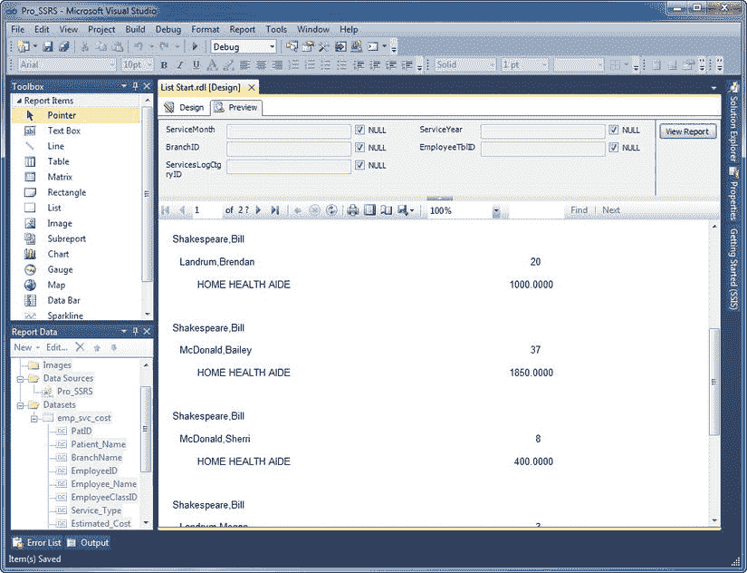

**图 4-4.** 包含重复患者的预览报告

在 SSRS 2005 中，你不得不添加两个 List，一个嵌套在另一个内部，才能在一个容器对象内实现多级分组。我们在本书前一版中展示了这种方法。然而，随着 `Tablix` 属性的引入，我们只需简单地在 `Employee_Name` 之上添加另一个分组即可。为此，请右键单击我们添加了字段的 `List` 框的详细信息行，选择 **添加分组**；然后在 **行分组** 子菜单下选择 **父分组**，如图 4-5 所示。对于分组，选择 `Patient_Name` 作为表达式。你会注意到，系统为新的 `Patient_Name` 分组添加了一个新列。选择我们之前添加的 `Patient_Name` 文本框，并将其从详细信息部分删除。

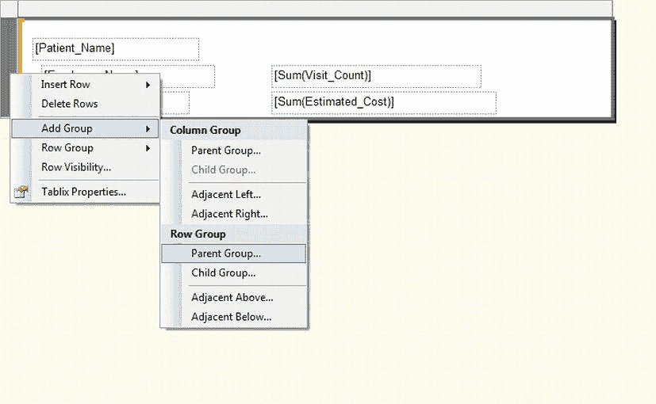

**图 4-5.** 向 `List` 添加 `Patient_Name` 分组

现在，经过对间距和对齐方式的一些修改后，当你预览按 `Patient_Name` 和其子分组 `Employee_Name` 分组的报表时，你可以看到多个员工与一位患者相关联。每位员工都显示正确的就诊总数和预估费用（参见图 4-6）。

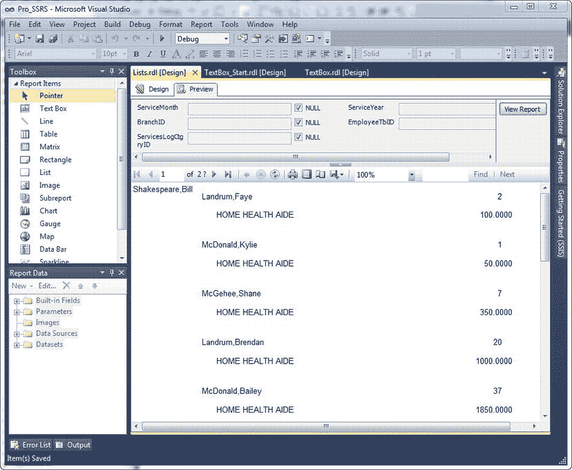

**图 4-6.** 包含父分组的预览报告

清单 4-1 展示了 `RDL` 文件的一部分，其中包含你刚创建的 `List` 数据区域的示例。请注意，在 XML 模式中，`<List>` 元素封装了所有图形化添加到 `List` 数据区域的内容，包括所有格式和分组。正如你在 `RDL` 中看到的，我们选择的 `List` 控件继承了新的 `Tablix` 功能的属性。

**清单 4-1.** `RDL` 列表部分

```xml
<TablixRowHierarchy>
    <TablixMembers>
        <TablixMember>
            <Group Name="Patient_Name">
                <GroupExpressions>
                    <GroupExpression>=Fields!Patient_Name.Value</GroupExpression>
                </GroupExpressions>
            </Group>
            <TablixHeader>
                <Size>1.08333in</Size>
                <CellContents>
                    <Textbox Name="Patient_Name1">
                        <CanGrow>true</CanGrow>
                        <KeepTogether>true</KeepTogether>
                        <Paragraphs>
                            <Paragraph>
                                <TextRuns>
                                    <TextRun>
                                        <Value>=Fields!Patient_Name.Value</Value>
                                        <Style />
                                    </TextRun>
                                </TextRuns>
                                <Style />
                            </Paragraph>
                        </Paragraphs>
                        <rd:DefaultName>Patient_Name1</rd:DefaultName>
                        <Style>
                            <Border>
                                <Style>None</Style>
                            </Border>
                            <PaddingLeft>2pt</PaddingLeft>
                            <PaddingRight>2pt</PaddingRight>
                            <PaddingTop>2pt</PaddingTop>
                            <PaddingBottom>2pt</PaddingBottom>
                        </Style>
                    </Textbox>
                </CellContents>
            </TablixHeader>
        </TablixMember>
    </TablixMembers>
</TablixRowHierarchy>
```

**注意** 要在 `BIDS` 中访问完整的 `RDL` 文件，请在设计选项卡打开的情况下选择 **视图**，然后从下拉菜单中选择 **代码**。如果你使用的是 `Visual Studio 2010`，请按 `F7`，并使用 `Shift+F7` 在代码和设计器模式之间切换。

`List` 对象的最终报告位于 `Pro_SSRS` 项目中，名为 `Lists.rdl`。


## 实现文本框

文本框控件从 SSRS 2005 到 2008 经历了一次重大升级，但此后便再无变动。值得庆幸的是，它现在支持对文本进行富格式化（请注意，这与“富文本格式”不同）。许多现在可以实现的功能，在 SSRS 2005 中是不可能的，或者至少是非常困难的。你现在可以格式化单个文本框内的独立文本块，也可以在文本框内使用占位符组合来自数据集的所有字段。这一切都是通过 HTML 标签实现的，这些标签可以作为表达式值导入到文本框本身，或者包含在数据集中并与报表一起呈现。

要学习如何创建具有富格式化的文本框，请从包含空文本框控件的 `TextBox_Start.rdl` 报表开始。在 `Pro_SSRS` 解决方案中打开 `TextBox_Start.rdl`。初始报表将如 图 4-7 所示。

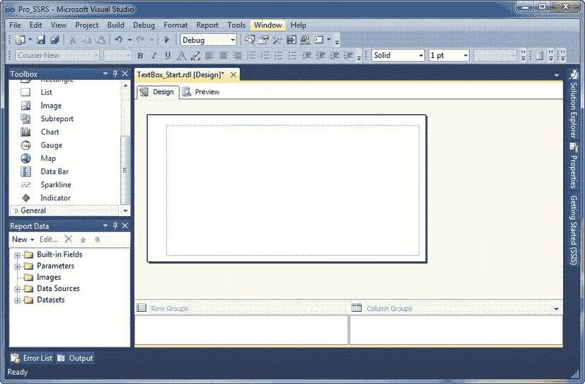

**图 4-7.** 带有空白文本框的 `TextBox_Start` 报表

在这个例子中，我们假设你作为报表设计器，需要将字面文本与数据合并到一封表单信函中，该信函将作为调查发送给患者。这份调查（我们将在 第 6 章完成）将包含关于患者特定就诊的信息，但除此之外必须是一个通用模板，对每位患者提出相同的问题。报表还将在单个文本框中包含粗体、下划线和斜体字体属性。

要了解自 SSRS 2008 以来关于文本框的首要概念是 `占位符`。占位符本质上是文本框中的一个位置，它将包含文本框的各个部分，并且可以为其中的值或表达式设置自定义格式。每个占位符也有自己的属性，例如工具提示、操作和对齐方式。

首先，单击 `TextBox_Start` 报表中的文本框以选中它。然后，右键单击并选择“创建占位符”。你将看到文本框属性对话框，如 图 4-8 所示。

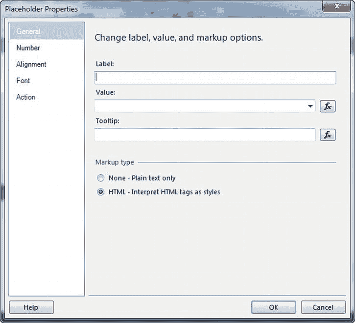

**图 4-8.** 文本框占位符属性

在这个演示中，你将添加一个简单的日期占位符、一个问候语和一个数据字段，每个都使用不同的格式样式。在 第 6 章，你将通过创建一个患者调查表单信函来扩展这个示例，该信函会组合矩形和表格等多个对象，以提供详细的服务报告和调查问卷。对于像这样的简单文本框，数据集 `Pro_SSRS_DS` 不可用分组，因此在这个例子中，你将使用 `First` 函数从数据集中提取患者姓名。

在占位符属性对话框仍打开的情况下，在“标签”字段中输入“Today”，在“值”字段中输入 `=NOW()`。关于格式化的一点重要说明是：如果在“常规”选项卡上选择了 HTML，则“数字”选项卡上的其他日期格式化规则将不会被应用。因此，对于此占位符，请选择“无 – 仅纯文本”，如 图 4-9 所示。

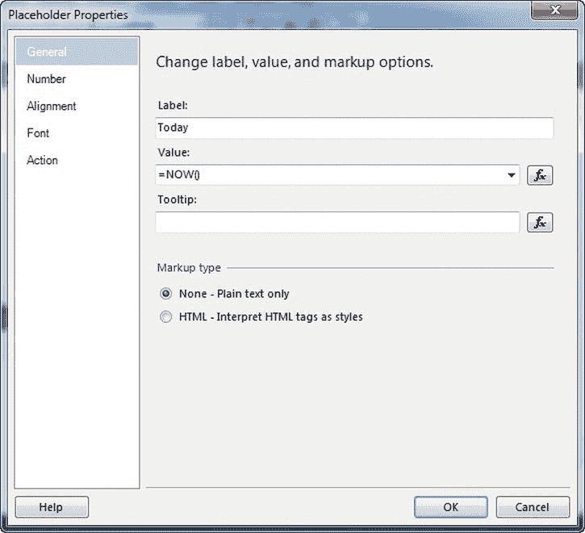

**图 4-9.** 第一个文本框占位符的值属性

在“数字”选项卡上，为“类别”选择“日期”，为“样式”选择“2000 年 1 月 31 日 星期一”，如 图 4-10 所示，然后单击“确定”。

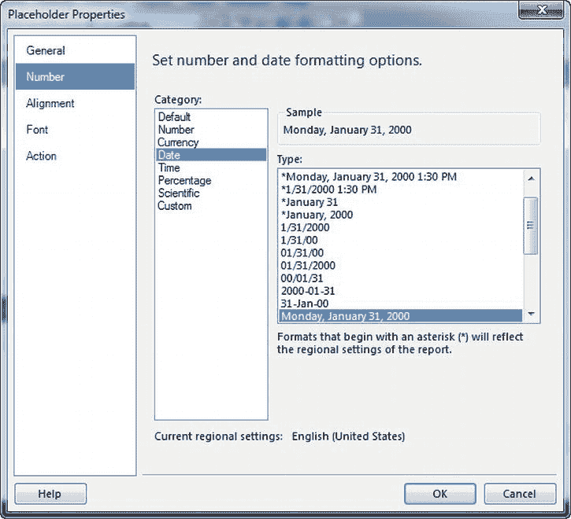

**图 4-10.** 文本框占位符的纯文本日期格式

回到“设计”选项卡，在刚刚添加的占位符下方单击，转到文本框中的下一行。直接在文本框中输入单词“Dear”，后面跟一个空格。这将作为信函的问候语。现在，在你键入的空格正后方的位置右键单击，再次选择“创建占位符”。在“标签”中，输入“Patient Name”。对于表达式，单击值字段右侧的表达式按钮以打开表达式生成器。在“类别”框中单击“数据集”，在“项”框中选择 `Pro_SSRS_DS`。在“值”框中选择 `First(Patient_Name)`。请注意，如 图 4-11 所示，该值被展开为 `=First(Fields!Patient_Name.Value, "Pro_SSRS_DS")`。你会在这里以及本书各处注意到，在 SSRS 2012 中，为了便于使用和清晰明了，字段的完整表达式值已被简化。例如，`Fields!Patient_Name.Value` 在设计模式下通常会简显示为 `[Patient_Name]`。

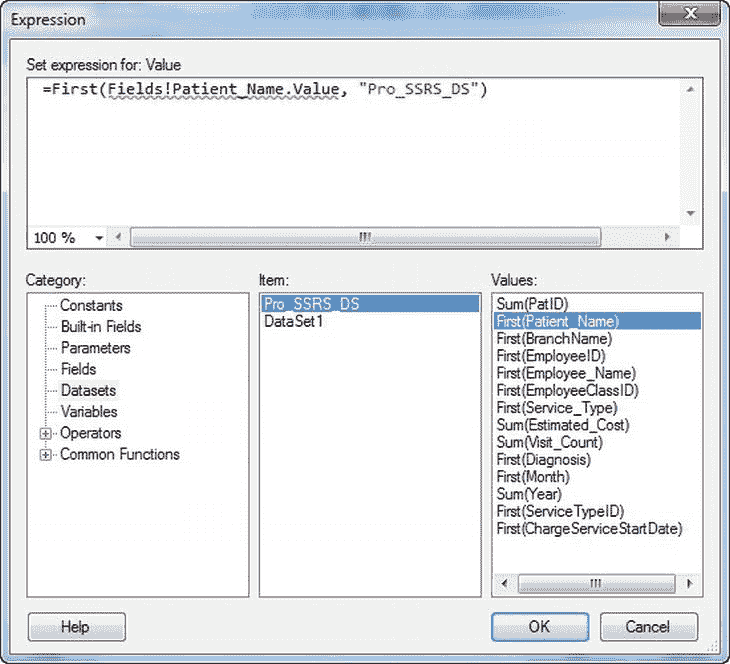

**图 4-11.** 文本框的患者姓名值

此时呈现报表并不能有效展示如何在单个文本框中实现多种格式。不过，此时添加单独的格式设置非常简单，只需选择你的占位符并选择任何你想要的格式即可。高亮显示“Today”占位符，确保选中整个标签。接着，单击工具栏上的斜体按钮。然后，选择“Patient Name”占位符并单击粗体按钮。图 4-12 展示了一个具有多种格式的单个文本框对象的预览。

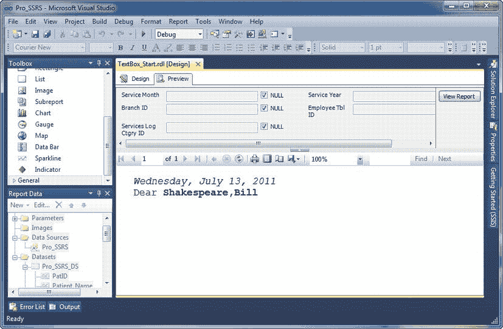

**图 4-12.** 单个文本框的多种格式输出

如前所述，即使是如此简单的自定义格式，在 SSRS 2005 中也是不可用的，因此 SSRS 2008 代表了报表设计领域的巨大飞跃。在下一章中，你将通过直接从 SQL 表导入 HTML 格式，以及从多个数据集中导入记录，来制作更复杂的报表，从而创建一份完整的自定义患者调查信函。

Textbox 对象的完整报表名为 `TextBox.rdl`，位于 `Pro_SSRS` 项目中。


## 实现表格

表格数据区域提供了一种将数据组织成表格形式的行与列的方法，并可支持多级分组。默认情况下，每个表格数据区域都包含存放详细记录的行以及表格的页眉和页脚。你可以基于单个数据集中的个别字段，或是结合多个字段的表达式，对表格进行分组。由于表格的结构化特性，它使得设计统一格式的报告变得简单。数据集中的字段只需添加到表格内的单元格中，报告在呈现时就会自动格式化。列表数据区域提供了与表格大致相同的功能，但你需要手动定位和对齐字段。

我们将在本节演示的表格报告对象的起始报告名为 `Table Start.rdl`。你可以在 Apress 网站本书的源代码/下载区域的 `Pro_SSRS` 项目中找到它。请在 BIDS 中打开 `Table Start.rdl` 文件开始操作。

如同处理列表一样，你将从“设计”选项卡开始，双击“工具箱”中的表格。这会将一个表格添加到报告设计区域。接下来，将用于列表示例的相同字段拖放到表格的详细信息行中——`Employee_Name`、`Service_Type`、`Estimated_Cost` 和 `Visit_Count` 作为详细信息，`Patient_Name` 用于分组。要将前四个字段添加到详细信息行，你需要向表格中添加第四列。这可以通过右键单击中间列顶部的栏并选择“在右侧插入列”来实现。现在你有了四列等宽的列，可以将四个字段拖放进去，使报告显示为如 图 4-13 所示，字段放置在表格的详细信息行中。`Patient_Name` 字段将等到你添加分组级别时再添加。请注意，当字段被放入各个单元格时，它们的列标题会自动添加。

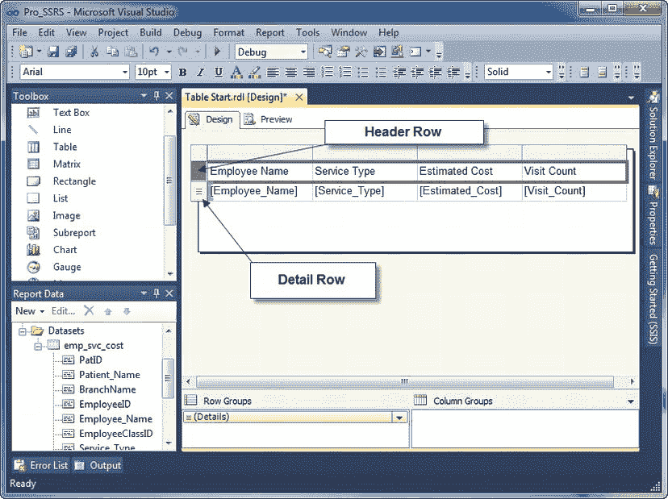
***图 4-13.** 包含详细信息行的表格数据区域*

要将 `Patient_Name` 字段添加到表格中，使报告具有与你之前创建的列表相同的功能，你需要在表格中插入一个分组。为此，只需将 `emp_svc_cost` 数据集中的 `Patient_Name` 字段拖放到“行组”区域，并在“(详细信息)”行组的上方释放，如下面的 图 4-14 所示。

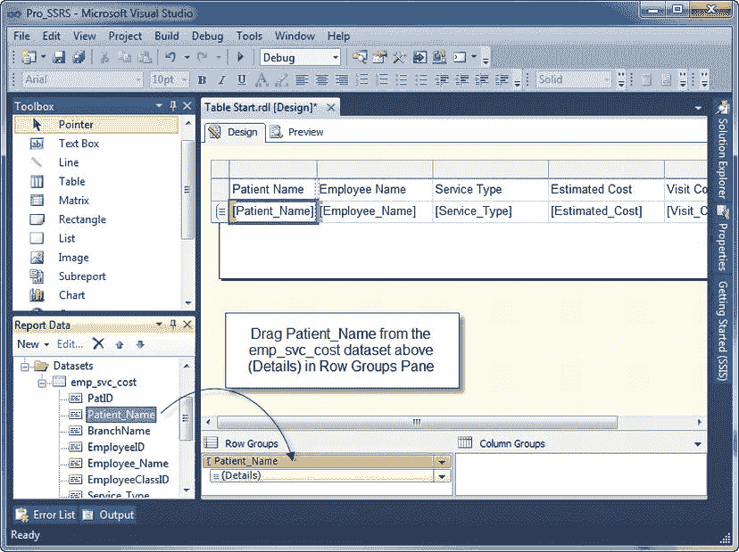
***图 4-14.** 通过拖放创建行组*

你可以通过单击 `Patient_Name` 分组右侧的向下箭头，然后选择“分组属性”选项来查看组属性（参见 图 4-15）。

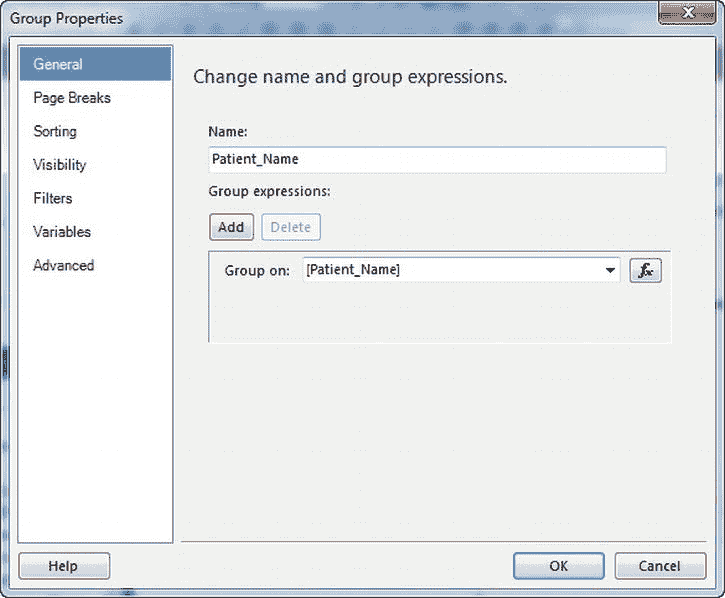
***图 4-15.** 分组属性对话框*

为了区分患者和员工，将 `Patient_Name` 单元格设为粗体。为了清晰起见，删除添加详细信息行字段时最初添加的每个标题——单击标题单元格，然后按 Delete 键。接下来，如果需要，调整列宽以扩展患者姓名和员工姓名列。你可以通过将每列的右边缘向右拖动，或者选中整列并在“属性”窗口中输入以英寸为单位的所需宽度来完成此操作。你可以通过按 F4 键调出上下文相关的“属性”窗口。

最后，你需要为详细信息行设置一个额外的分组级别，就像为包含 `Patient_Name` 字段的标题行所做的那样。右键单击“行组”中的“(详细信息)”，然后选择“分组属性”。单击“添加”，并选择 `Employee_Name` 字段作为详细信息行的分组依据。你还需要确保 `Estimated_Cost` 和 `Visit_Count` 字段应用了 `Sum` 函数——例如，`=Sum(Fields!Estimated_Cost.Value)`——然后你就可以预览报告了。一个简单的方法是：在表格中高亮显示 Estimated Cost 表达式，右键单击它，并在“ Summarize By（汇总依据）”子菜单下选择“Sum（求和）”。当报告呈现时，其功能与你之前创建的列表类似，如 图 4-16 所示。

如果需要，你现在可以向表格添加更多的分组级别，但接下来你将学习如何将表格与自由格式的矩形结合使用，以展示如何在保持多级分组的同时，扩展超越表格的结构化特性。

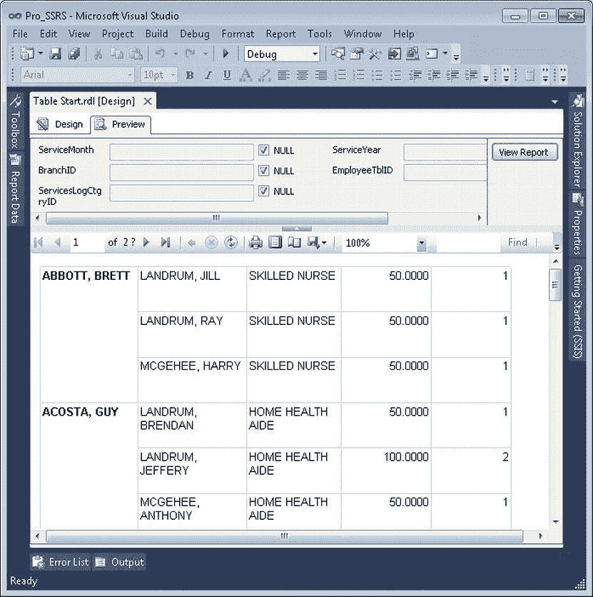
***图 4-16.** 表格预览*

你创建的表格的 RDL 清单将跨越许多页面，因此我们选择在适当地方包含每个数据区域的 RDL 输出部分。在 清单 4-2 中，你可以看到一个完整的 `<TablixCell>` 部分，它将是 `<TablixCell>`、`<TablixRow>` 以及最终的 `<Tablix>` 元素的子节点。RDL 引用的表格中的特定单元格是你添加到其自身分组中的 `Patient_Name` 字段。另请注意，该字段有一段 RDL 定义了 `CanGrow`。为表格数据区域内的单元格分配 `CanGrow` 属性使其能够自动扩展以适应其包含数据的长度。通过分配 `CanShrink` 属性也可以实现相反的效果。

 **注意** 自 SSRS 2008 以来的所有版本中，`Tablix` 属性指的是表格、矩阵和列表对象，因此，以前专门引用表格或矩阵的 RDL，现在引用 `Tablix`。

***清单 4-2.** 表格数据区域的 RDL 部分*

```xml
<TablixCell>
<CellContents>
    <Textbox Name="textbox3">
    <CanGrow>true</CanGrow>
    <KeepTogether>true</KeepTogether>
    <Paragraphs>
        <Paragraph>
        <TextRuns>
            <TextRun>
            <Value />
            <Style />
        </TextRun>
        </TextRuns>
        <Style />
        </Paragraph>
    </Paragraphs>
    <rd:DefaultName>textbox3</rd:DefaultName>
    <ZIndex>17</ZIndex>
    <Style>
    <PaddingLeft>2pt</PaddingLeft>
    <PaddingRight>2pt</PaddingRight>
    <PaddingTop>2pt</PaddingTop>
    <PaddingBottom>2pt</PaddingBottom>
    </Style>
</CellContents>
</TablixCell>
```

表格对象的完成报告名为 `Table.rdl`，位于 `Pro_SSRS` 项目中。

## 实现矩形

如前所述，矩形数据区域类似于列表数据区域，它是一个用于容纳报表项的自由格式容器对象，并将所有对象封装在一个定义的区域内。因此，当矩形被重新定位或完全删除时，其内部的对象也会随之重新定位或被删除。与我们即将介绍的所有其他报表对象和数据区域一样，您可以将矩形放置在其他数据区域内，并限定其作用范围。

矩形数据区域比列表数据区域功能更有限，因为它不包含分组级别。不过，您可以对矩形内的对象或数据区域进行分组，并在 SSRS 报表中以几种创新方式使用矩形。您将在上一个示例的基础上继续操作，使用表格数据区域，并在表格内添加一个矩形作为占位符。这样，您就可以在保持表格数据区域提供的结构的同时，为报表增加一层自由格式设计。在此示例中，我们还将使用之前介绍的文本框报表对象。文本框可以包含文字字符串值，例如报表标题；也可以包含表达式。您可以使用文本框对象为放置在矩形内的自由格式对象添加标题。

本节的起始报表名为 `Rectangle Start.rdl`。它可以在 Apress 网站本书资源代码/下载区的 `Pro_SSRS` 项目中找到。

首先，打开 `Rectangle Start.rdl` 报表，并按照以下步骤向整个详细信息行添加一个矩形：

> 1.  将一个矩形数据区域从工具箱拖到“矩形起始”报表中扩展的详细信息行内。
> 2.  将 `emp_svc_cost` 数据集中的两个字段 `Visit_Count` 和 `Estimated_Cost` 拖到详细信息区域。将它们垂直放置，使 `Visit_Count` 字段位于 `Estimated_Cost` 字段之上。请注意，SSRS 会自动为这些字段分配 `Sum` 聚合函数。
> 3.  从工具箱中拖动两个文本框到矩形内，位于您刚刚添加的两个字段的左侧。文本框可以包含表达式或文字字符串，用作标签。在文本框中分别键入“访问次数”和“预计成本”。
> 4.  通过按住 Shift 键单击选中这两个文本框，然后将文本颜色属性设置为“砖红色”，字体大小设置为 12 磅，来为文本框添加格式。您还将把 `Estimated_Cost` 和 `Visit_Count` 字段设置为粗体。您可以在标准格式工具栏或属性窗口中找到这些设置。完成后，报表布局将如图 4-17 所示。

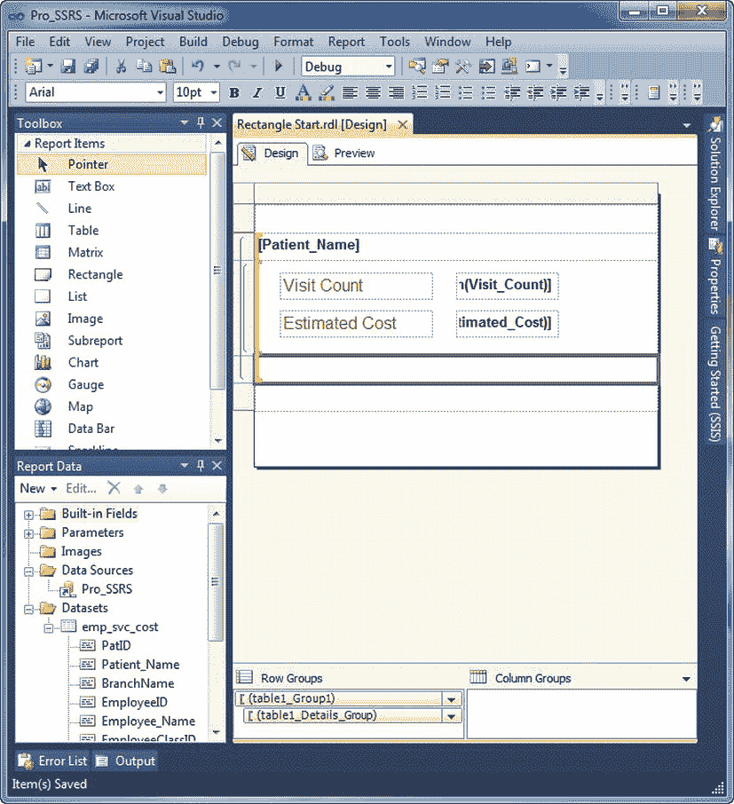

#### 图 4-17. 表格中带有格式的矩形

当您预览报表时，`Estimated_Cost` 字段似乎格式不正确，它应该是货币格式。每个文本框都包含格式属性，您可以通过多种方式设置。在“布局”选项卡上，右键单击包含 `Estimated_Cost` 数据字段总和的文本框，然后选择“属性”。您可以在“文本框属性”对话框的“格式”选项卡上设置文本框值的格式。或者，您也可以在属性窗口中修改“格式”属性。选择“货币”（参见图 4-18）。默认的货币格式代码为“C”，包含两位小数。如果您愿意，可以通过选择“自定义”并键入“C0”或“C1”来覆盖此设置，这将分别得到无小数位或一位小数位。对于本示例，请保留默认的两位小数。

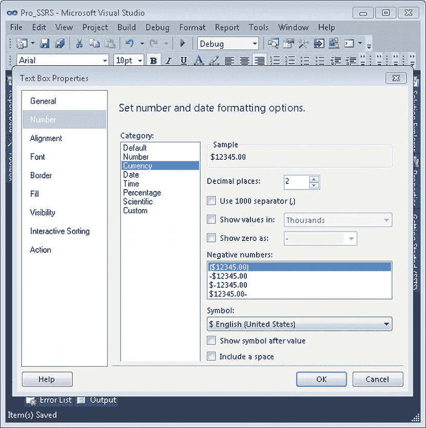

#### 图 4-18. 使用文本框对话框选择格式

当您单击“确定”并预览报表时，您可以看到现在有了一个经过格式化的单个详细信息行，其中包含垂直对齐、格式适当的文本框，如图 4-19 所示。以这种方式使用矩形，可以在向报表添加多个自由格式元素时提供更大的灵活性，同时仍能提供表格的多重分组级别。

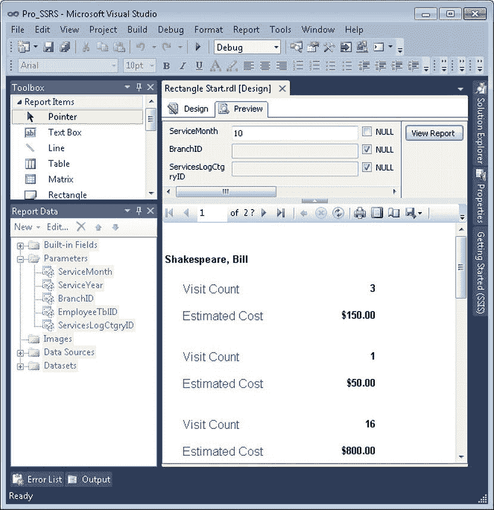

#### 图 4-19. 带有格式的表格预览

您可以在清单 4-3 中看到您添加到表格中的矩形的 RDL 输出。

#### 清单 4-3. 矩形的 RDL 输出

```
<Rectangle Name="rectangle1">
  <ReportItems>
    <Textbox Name="Visit_Count">
      <CanGrow>true</CanGrow>
      <KeepTogether>true</KeepTogether>
      <Paragraphs>
        <Paragraph>
          <TextRuns>
            <TextRun>
              <Value>=Sum(Fields!Visit_Count.Value)</Value>
              <Style>
                <FontWeight>Bold</FontWeight>
              </Style>
            </TextRun>
          </TextRuns>
          <Style>
            <TextAlign>Right</TextAlign>
          </Style>
```

矩形对象的完成报表名为 `Rectangle.rdl`，位于 `Pro_SSRS` 项目中。

## 实现矩阵

您可以使用 `Matrix` 数据区域来生成围绕聚合度量、按行和列格式化的输出。SSRS 中的矩阵类似于数据透视表或交叉表报表。您可以将数据字段与其他字段一起在 `Matrix` 中分组，从而形成自然的汇总和明细关系。简单单级的 `Matrix` 数据区域（仅包含一列和一行）提供了有价值的商业智能，可用于快速分析。无论是源自标准 SQL 查询的数据，还是用于 Analysis Services 的 MDX 查询（在第 12 章中介绍）得到的数据，情况都是如此。现在，我们将介绍 `Matrix` 数据区域的一些属性，并使用存储过程 `Emp_Svc_Cost`，用特定时间段内每位患者的 `Estimated_Cost` 值来填充它。您需要连接 `Year` 和 `Month` 的字段值，用于 `Matrix` 的列分组部分，并使用 `Patient_Name` 进行行分组。

本节演示的 `Matrix` 对象起始报表可在 Apress 网站本书的源代码/下载区域的 `Pro_SSRS` 项目中获取。此报表名为 `Matrix Start.rdl`。

默认情况下，`Matrix` 数据区域仅包含三个单元格，分别定义 `列`、`行` 和 `数据` 单元格，如图 4-20 所示。您可以使用左上角的第四个空白单元格作为标签，或用于控制 `Matrix` 布局的表达式与参数组合（例如交互式展开或折叠分组）——我们稍后将进行演示。

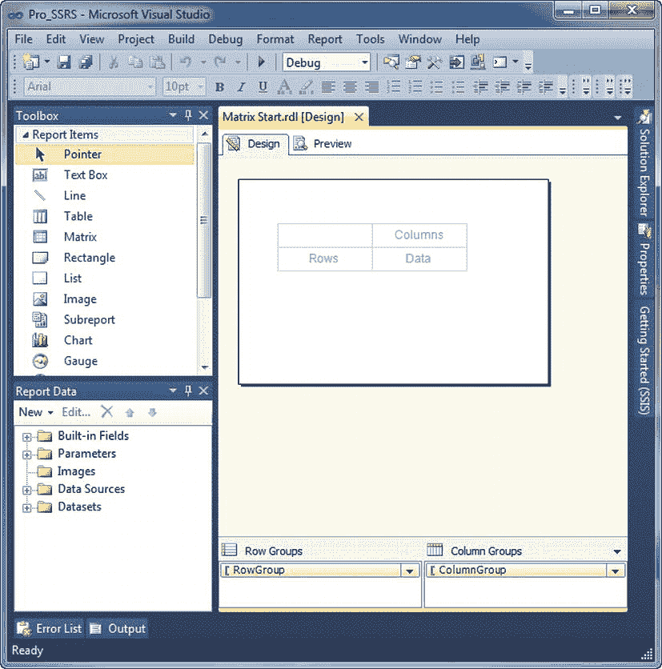
`图 4-20. 矩阵数据区域`

打开 `Matrix Start.rdl` 报表后，双击 `工具箱` 中的 `Matrix` 对象，这将自动向报表的设计区域添加一个 `Matrix`。接下来，从 `emp_svc_cost` 数据集将两个字段 `Patient_Name` 和 `Estimated_Cost` 拖放到 `Matrix` 上。它们分别放入 `行` 和 `数据` 区域。对于 `列` 区域，定义一个连接 `Service_Year` 和 `Service_Month` 字段的表达式。请注意，您可能需要删除为 `Estimated Cost` 字段自动添加的标题。表达式如下：

```
=Fields!Year.Value & " - " & Fields!Month.Value
```

您还需要使用此表达式基于组合字段创建自定义分组。要在表达式上对 `列` 区域进行分组，请右键点击报表 `行和列组` 区域中的 `ColumnGroup`，然后选择 `分组属性`。将上述表达式放入 `分组依据` 部分，然后点击确定。接下来，将 `Estimated_Cost` 字段左对齐，并将格式设置为货币，如上一节所示。当您预览报表时，可以看到 `Matrix` 显示了熟悉的患者在每个月接受服务时的预估护理费用，如图 4-21 所示。

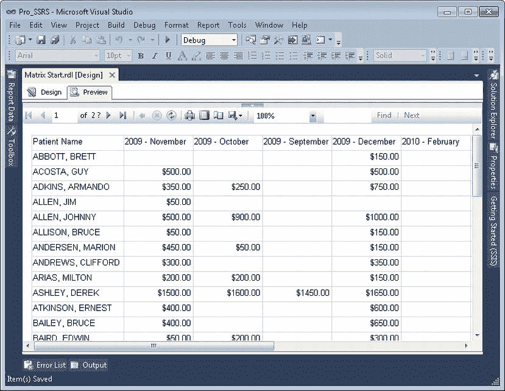
`图 4-21. 矩阵数据区域预览`

您可以在清单 4-4 中查看 `Matrix` 的 RDL 输出。

`清单 4-4. 矩阵 RDL 清单`

```
<Tablix Name="matrix1">
    <TablixCorner>
        <TablixCornerRows>
            <TablixCornerRow>
                <TablixCornerCell>
                    <CellContents>
                        <Textbox Name="textbox1">
                            <CanGrow>true</CanGrow>
                            <KeepTogether>true</KeepTogether>
                            <Paragraphs>
                                <Paragraph>
                                    <TextRuns>
                                        <TextRun>
                                            <Value />
                                            <Style />
                                        </TextRun>
                                    </TextRuns>
                                    <Style />
                                </Paragraph>
                            </Paragraphs>
                            <ZIndex>3</ZIndex>
                            <DataElementOutput>NoOutput</DataElementOutput>
                            <Style>
                                <PaddingLeft>2pt</PaddingLeft>
                                <PaddingRight>2pt</PaddingRight>
                                <PaddingTop>2pt</PaddingTop>
                                <PaddingBottom>2pt</PaddingBottom>
                            </Style>
                        </Textbox>
                    </CellContents>
                </TablixCornerCell>
            </TablixCornerRow>
        </TablixCornerRows>
    </TablixCorner>
</Tablix>
```

`Matrix` 对象的完整报表名为 `Matrix.rdl`，位于 `Pro_SSRS` 项目中。

## 总结

在本章中，您了解到每份报表都由基于 RDL 中已定义架构的明确元素组成，这赋予了 SSRS 标准化的优势。我们介绍了构成报表的报表对象，并查看了它们的属性和功能。您还看到了在设计过程中，每个对象的图形设计组件如何直接转换为 RDL。既然您对设计环境更加熟悉了，接下来将学习如何使用它来设计和部署一些实际的报表。

在下一章中，我们将展示如何通过添加图形和图表来让报表更加生动。您可以将图形或图表视为另一种类型的报表，但它们在视觉上差异显著，值得在单独的章节中进行介绍。

## 第 5 章

### 实现仪表板风格的报表对象

图表、地图、指示器和其他 Reporting Services 对象为报表增添了视觉趣味。其中许多对象还让您能够一目了然地传达大量信息，否则，从仅包含列式数据的报表中逐行阅读细节来发现这些信息将非常耗时。Reporting Services 提供了多种图表类型和其他具有特定用途的报表对象。您可用的可视化报表对象包括：

*   **图表：** SSRS 提供多种图表样式，可以与表格或矩阵等其他报表对象结合使用，也可以作为独立报表使用。
*   **仪表：** 随 SSRS 2008 发布，这些视觉吸引力强的控件提供了一目了然的视图，通常用作业务可衡量指标（如销售和利润趋势）的关键绩效指标。在 SSRS 2008 之前，仪表需要单独获取。
*   **图像：** 此报表对象可以在报表中直接嵌入标准格式的图像，例如 JPEG 或 TIFF。您可以将图像直接嵌入报表（例如公司徽标），或直接从数据库表中提取。
*   **地图：** 地图对象允许开发人员在航拍地图上添加覆盖可视化效果，以表示通过地图库、空间查询或环境系统研究所公司 (ESRI) 对象和图层文件返回的数据。
*   **数据条：** 此报表项可用作水平条或垂直数据列。它通常用于在比传统条形图更小的空间内传达大量信息。例如，如果您想直观地表示一组学生在特定评估中获得的测试分数，可能会使用数据条。
*   **迷你图：** 与 *数据条* 类似，此报表对象通常用于可视化特定度量的大量趋势数据，但比传统图表提供的形式更紧凑。这很像描绘给定日期范围内股票价格的方式，很少或没有标签和图例。
*   **指示器：** 在 SSRS 2008 R2 中添加，此报表项可用于显示不同的图像，这些图像在视觉上代表某个预定义或数据驱动的值。此类对象的示例常见于提供与关键绩效指标 (KPI) 对比的报表部分。

 **注意** `地图`、`数据条`、`迷你图` 和 `指示器` 报表项是随 SSRS 2008 R2 发布的。这些项中的每一个都为报表开发人员提供了更复杂的报表对象，这些对象常见于仪表板和分析风格的报表中。

本章的其余部分将带您浏览 SQL Server 2012 Reporting Service 的制图功能。首先，我们将介绍一些关于图表数据区域的必要知识。然后，我们将通过一些可用图表的示例进行讲解。


## 理解图表数据区域

SSRS 中的图表数据区域与矩阵数据区域类似，允许从单个数据集进行多级分组。与 Tablix 数据区域（通过表格、矩阵和列表对象）提供的列级和行级分组不同，图表数据区域使用**系列**、**类别**和**值**。你可以为图表设置许多属性，并且与所有其他数据区域一样，图表可以使用表达式来定义其属性。此外，与其他数据区域一样，你可以将图表单独放置，也可以将其限定在另一个区域（如列表或表格数据区域）内。例如，你可以使用一个简单的图表来显示按临床医生类型划分的总体访问量，这在你的存储过程中由 `Service_Type` 字段确定。你也可以将图表添加到一个按患者和时间范围（如 `Month` 和 `Year`）分组的表格单元格中。该图表将为每个分组显示该患者随时间变化的访问次数。让我们向使用 `Emp_Svc_Cost` 存储过程的报表中添加一个图表。对于该图表，你将添加三个熟悉的字段，分别对应图表的三个区域：系列、类别和值将分别包含 `Patient_Name`、`Employee_Name` 和 `Visit_Count`。

本节演示的图表对象的起始报表可在 Apress 网站（[`www.apress.com`](http://www.apress.com)）上本书的“源代码/下载”区域中的 `Pro_SSRS` 项目里找到。这个报表很有创意地被命名为 `Chart Start.rdl`，它也是一种为企业高管们准备的早餐麦片。

## 创建图表

1.  首先，打开 `Chart Start.rdl` 报表的“设计”选项卡，双击工具箱中的图表工具，调出“选择图表类型”对话框。SSRS 2008 中的图表对象得到了相当广泛的增强，但大部分更新主要是美化方面的。你将选择如图 5-1 所示的堆积条形图。
    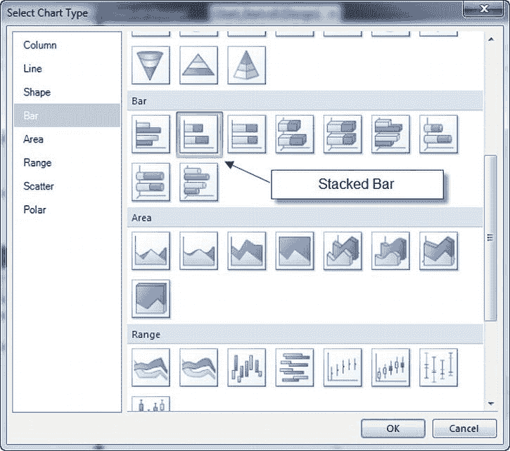
    图 5-1. SSRS 图表选择
2.  双击图表的图形区域，这将调出“图表数据”窗口。
3.  在“图表数据”窗口的“值”区域下，单击绿色加号，然后从下拉列表中选择 `Visit_Count`。
4.  接下来，单击“图表数据”窗口中“类别组”区域的绿色加号，选择 `Employee_Name`。
5.  接着，单击“图表数据”窗口中“序列组”区域的绿色加号按钮，选择 `Patient_Name`。
6.  最后，通过向右下方拖动图表的右下角来调整其大小，使其类似于图 5-2。

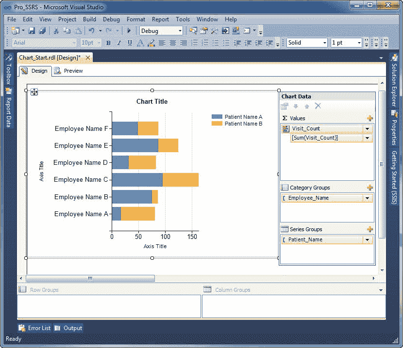
图 5-2. 包含三个字段的图表

在预览图表之前，让我们看看它的属性。你需要将默认的调色板更改为“浅色”，以获得更柔和、更美观的视图。右键单击图表内部，在“图表”子菜单下选择“图表属性”。选择名为“浅色”的调色板，然后单击“确定”。属性应如图 5-3 所示。

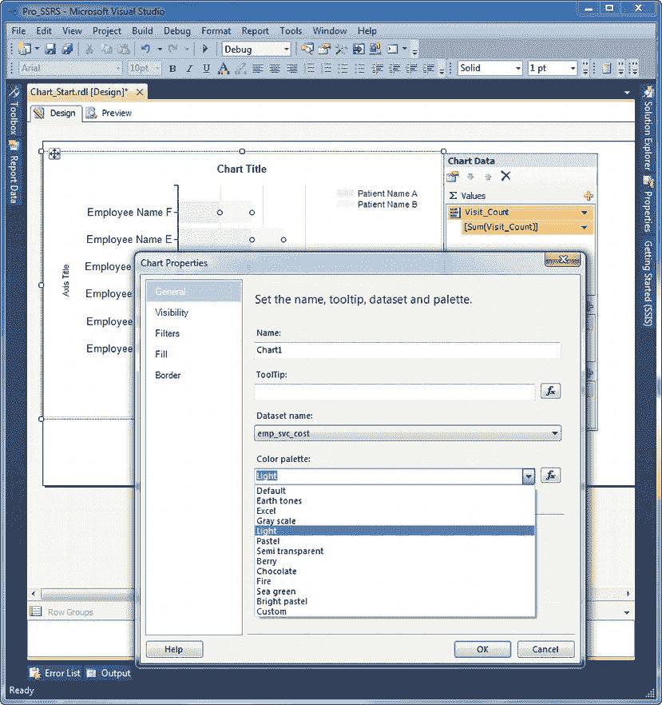
图 5-3. 图表属性

最后，在“设计”选项卡上右键单击图表图形区域内部，选择“3D 效果”。接着，单击复选框启用 3D 效果，然后单击“确定”。在预览图表之前，将标题从“图表标题”重命名为 `按患者统计的访问次数`。现在你可以预览图表了，如图 5-4 所示。

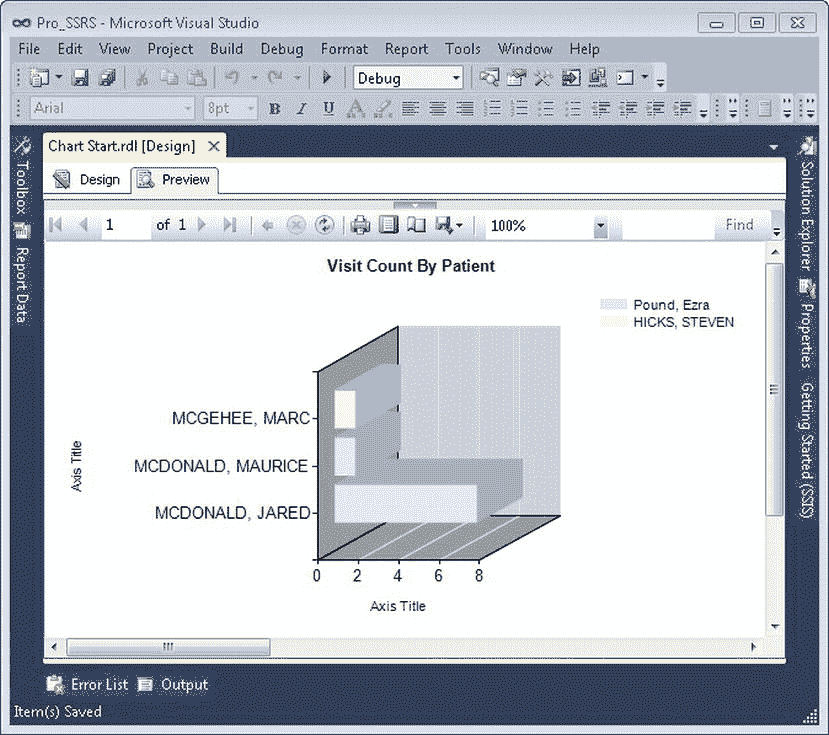
图 5-4. 具有自定义属性的图表

 **注意** 我们选择将访问列表缩小到 2010 年发生的记录。这是有意为之，因为它将数据限制在易于查看的范围内；否则，图表中会填充过多的患者，显得杂乱无章。`Chart Start.rdl` 报表的默认参数值也是 2010，因此你的结果将与之匹配。

你可以在清单 5-1 中看到刚刚创建的图表的 RDL 输出。

清单 5-1. 图表 RDL 示例

```
<Chart Name="chart1">
   <ChartThreeDProperties>
      <Enabled>true</Enabled>
      <Rotation>30</Rotation>
      <Inclination>20</Inclination>
      <Shading>Simple</Shading>
      <WallThickness>50</WallThickness>
      <DrawingStyle>Cylinder</DrawingStyle>
   </ChartThreeDProperties>
   <Style>
      <BackgroundColor>White</BackgroundColor>
   </Style>
```

图表对象的完整报告位于 `Pro_SSRS` 项目中，名为 `Chart.rdl`。


## 实现图像

在报告中加入图像能使其看起来更专业，同时提升其作为资源的价值。幸运的是，SSRS 包含一个图像工具，可以从多种位置添加图像，并支持许多标准图像格式。我们的医疗保健应用程序将许多图像作为二进制大对象存储在 SQL Server 数据库中，作为患者电子病历的一部分。你可以通过前端图像检索应用程序加载任何类型的图像到数据库中，并将其与特定患者关联。一旦图像存入数据库并标记了患者的识别号码（这是数据库中的一个字段），你就可以使用 SSRS 在报告中显示该图像。在本例中，我们将延续著名作家患者的主题，将他们的图像添加到一个简单报告中。用于图像报告对象的起始报告名为 `Image Start.rdl`。由于该报告的大部分内容是使用你已熟悉的对象构建的，因此起始点已经包含了这些对象。此报告使用的数据集包含已将其照片存储在 `Pro_SSRS` 数据库中名为 `DocumentImage` 的表里的患者的人口统计信息。你可以使用名为 `Get_Image` 的预定义数据集（用于 `Image Start.rdl` 报告），该数据集通过如 图 5-5 所示的文本查询类型，简单地返回三名患者的人口统计信息及其照片。

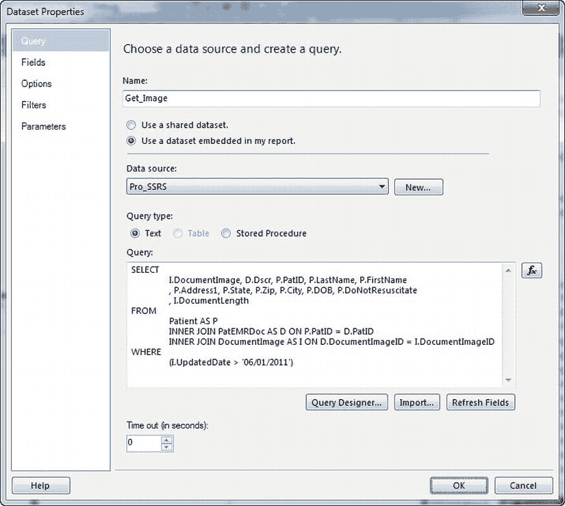

`图 5-5.` Get Image 数据集属性

首先，在 `Pro_SSRS` 项目中打开 `Image Start.rdl` 报告，然后单击 **设计** 选项卡。接下来，从 **工具箱** 中选择 **图像** 工具，并单击该报告中已设置好的 **列表** 数据区域内的空白区域。如你在 图 5-6 中所见，当向列表添加 **图像** 工具时，会弹出 **图像** 对话框。你可以选择多种检索图像的方式。例如，可以使用已添加到项目中的图像，或者将图像直接嵌入到报告中。如果报告包含单个图像，该图像不会被重复使用，并且打算分发给可能无法从其他位置访问该图像的各种来源，那么此选项将非常适用。选择 **数据库** 作为图像源。接下来，你将选择包含图像的数据源和字段。对于本报告，选择 `=Fields!DocumentImage.Value` 作为值，或者如显示的 `[DocumentImage]`。将 **MIME 类型** 设置为 `image/jpeg`。

`DocumentImage` 字段中存储的图像是患者照片。如果这是一个真实的报告，你可以使用患者记录中标准的其他图像，例如 X 光图像或患者伤口照片。即使是纸质文件或传真的扫描图像也可以存储在数据库中，并有效地添加到完整的报告中。

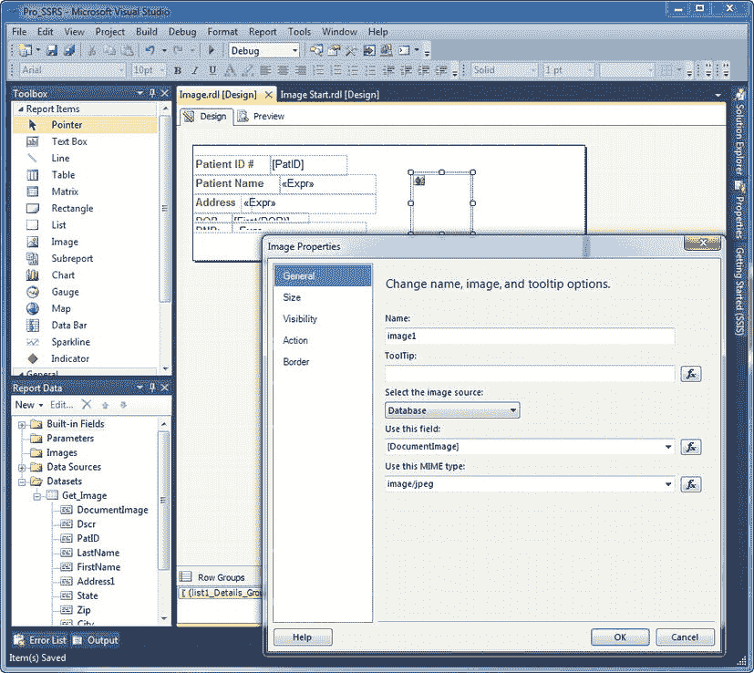

`图 5-6.` 图像源选择

我想花点时间指出一个在 图 5-6 中未显示、但在使用 **图像** 对象时非常常用的属性。通常，图像需要根据所请求的报告进行适当缩放。例如，你可能需要覆盖 **按比例适应** 的默认设置，以按原始大小显示图像，或者仅显示其一部分。但是，在使用 **适应大小** 选项时要小心，因为这可能导致图像呈现拉伸外观。你可以在 **图像属性** 窗口的 **大小** 选项卡中设置缩放属性，或在 **属性** 窗口中的 **Sizing** 下设置，如 图 5-7 所示。

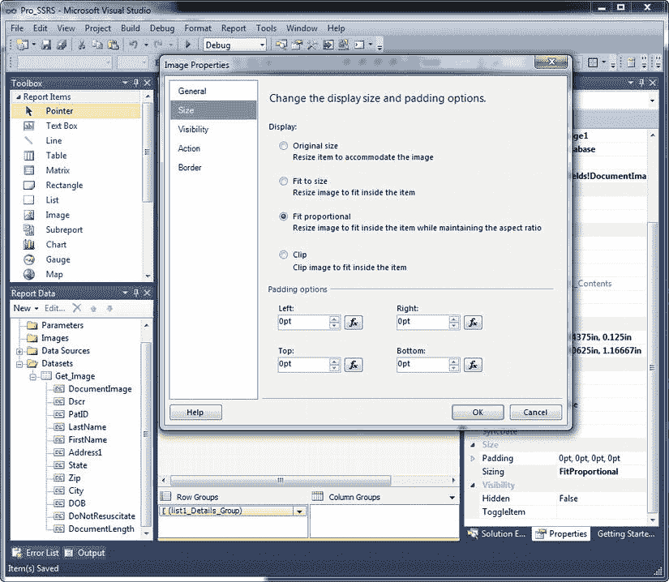

`图 5-7.` 图像属性 – 合适的缩放

 **注意** 现在使用默认值；单击 **确定** 并预览报告。你可以看到照片图像已正确关联到患者，如 图 5-8 所示。

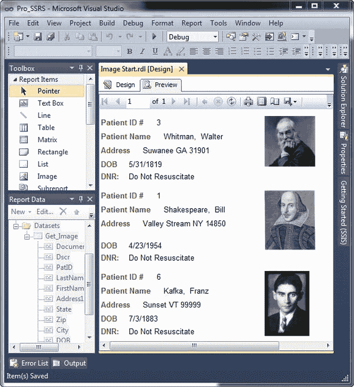

`图 5-8.` 包含图像的报告预览

清单 5-2 显示了图像的示例 RDL 元素。

`清单 5-2.` 图像的 RDL 输出

```
<Image Name="image1">
   <ZIndex>10</ZIndex>
   <Top>0.375in</Top>
   <MIMEType>image/jpeg</MIMEType>
   <Height>0.75in</Height>
   <Width>0.75in</Width>
   <Source>Database</Source>
   <Style />
   <Value>=Fields!DocumentImage.Value</Value>
   <Left>2.875in</Left>
   <Sizing>AutoSize</Sizing>
</Image>
```

已完成的 **图像** 对象报告名为 `Images.rdl`，位于 `Pro_SSRS` 项目中。

### 实现仪表

仪表虽然在 SSRS 2008 中是新功能，但在 SSRS 2005 中已作为第三方插件可用。然而，此类第三方插件必须单独购买。在 SSRS 2008 及更高版本中，仪表默认包含，并提供了超越标准图表的功能。仪表控件的一个优点是，它们在为任何报告增添美感——可以说是某种吸引力的同时，还十分紧凑，并能提供数据的概览视图，这对于只想看到高低起伏、增长下降的业务主管来说通常很重要。借助仪表，任何值都可以设置一个阈值，并且这个阈值可以在控件本身中直观地体现出来。

首先打开解决方案中包含的 `Gauge Start.rdl` 报告。双击 **工具箱** 中的 **仪表** 控件。将打开 **选择仪表类型** 窗口，显示所有可用的仪表。你可以选择两种类型的仪表：**径向** 或 **线性**。顾名思义，**径向** 仪表是圆形的，就像你汽车里的速度表，而 **线性** 仪表是直的，很像一个标准温度计。对于本例，选择 **180 度北向** 仪表，如 图 5-9 所示。

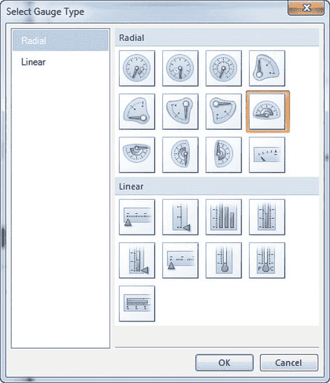

`图 5-9.` 带范围的径向仪表

我们将引导你创建一个简单的仪表范围，以展示如何通过值来控制仪表指针。在 **设计** 选项卡上，右键单击仪表，然后在 **仪表面板** 子菜单下选择 **刻度属性**。将 **最大值** 更改为 `20,000` 并单击 **确定`。现在，当你将 `Visit_Count` 拖到仪表的数据区域时，总体访问计数（我们知道是 `9,687`）在预览仪表时将显示为一个范围（参见 图 5-10）。我们只是触及了仪表的皮毛，但我们将在 第 6 章 中介绍控制新仪表控件的更多详细方面。

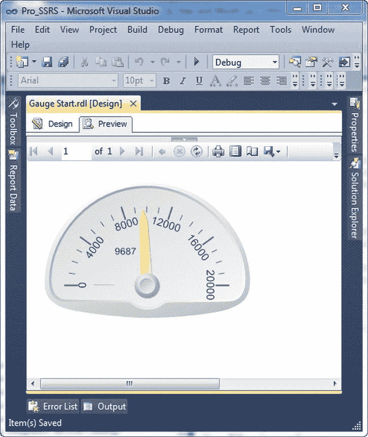

`图 5-10.` 预览模式下的径向仪表

清单 5-3 显示了仪表控件的示例 RDL 元素。

`清单 5-3.` 仪表控件的 RDL 输出

```
<ReportItems>
     <GaugePanel Name="GaugePanel2">
     <RadialGauges>
     <RadialGauge Name="RadialGauge1"> <PivotY>75</PivotY>
     <GaugeScales>     <RadialScale Name="RadialScale1">
          <Radius>54</Radius>
          <StartAngle>90</StartAngle>
          <SweepAngle>180</SweepAngle>
          <GaugePointers>
          <RadialPointer Name="RadialPointer1"> <PointerCap>
          <Style>
```


## 实现地图

如同之前提到的 Gauge 报表项，在 Reporting Services 报表中实现地图功能过去只能通过自定义或第三方工具。SQL Server 2008 R2 引入了地图功能，用于生成视觉上引人注目的报表，允许将多个图层叠加在地形图之上。每个图层可以来自不同的数据集。此外，您只需勾选一个复选框，即可轻松将地图与 Bing 地图集成。地图报表项可以从地图库、ESRI shapefile 或 SQL Server 空间查询中获取数据。

地图库由包含坐标和嵌入式矢量多边形的 RDL 文件组成，这些文件通常使用 Mapwel、Map Maker Pro 和 ViLiDAR 等工具创建。标准安装中包含一些 RDL 文件，涵盖了整个美国以及各个州。但是，您可以扩展向导作为报表开发人员为您提供的地图。如上所述，您可以创建自己的矢量多边形，甚至可以从 CodePlex.com 等网站免费下载。无论哪种方式，为了让地图向导识别它们，您需要将 RDL 文件保存在向导读取的路径中。如果您像我一样使用 Visual Studio 2010，该路径位于 Visual Studio 安装目录下的 `Program Files\Microsoft Visual Studio 10.0\Common7\IDE\PrivateAssemblies\MapGallery`。RDL 文件中的一些关键元素包括 `MapMeridians`、`MapParallels`、`MapLayers` 和 `VectorData`。

ESRI shapefile 在扩展名为 .shp 和 .dbf 的文件中存储有关地理、几何形状和信息数据的类似信息。当您选择 ESRI shapefile 作为空间数据源时，系统会提示您选择一个 shapefile。导航到 shapefile 后，地理空间数据将被嵌入报表中。有关佛罗里达州杰克逊维尔市杜瓦尔县 ESRI shapefile 外观的示例，请参见图 5-11。

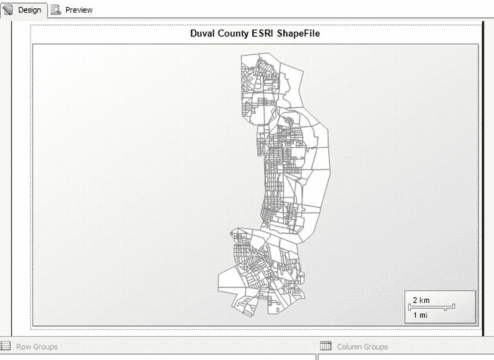

#### 图 5-11. 佛罗里达州杰克逊维尔市杜瓦尔县的 ESRI Shapefile

获取空间数据的第三种方法是使用 SQL Server 空间查询。这允许您创建自己的查询来显示地理详细信息以及可量化数据。例如，创建一个返回美国各州总销售额列表的查询很容易。然后，您可以将这些详细信息叠加在地图上。

 **注意** 开箱即用，Reporting Services 附带的地图库包含美国以及美国境内的各个州。但是，您可以创建自己的地图。您还可以从 codeplex 网站 (`http://mapgallery.codeplex.com/releases`) 下载更多地图库。为了让地图向导看到您创建或下载的地图文件，在下载或创建后，您需要将它们保存在 `<drive>:\Program Files (x86)\Microsoft Visual Studio ##.0\Common7\IDE\PrivateAssemblies\MapGallery`、`C:\Program Files\Microsoft Visual Studio ##.0\Common7\IDE\PrivateAssemblies\MapGallery` 或 `<drive>:\Program Files\Microsoft SQL Server\Report Builder 3.0\MapGallery`。

我们通过打开本节包含的 Map Start.rdl 报表来开始本示例，该报表可在 Apress 网站 (`www.apress.com`) 上本书的 Pro_SSRS 项目源代码/下载区域中找到。双击工具箱中的地图控件以启动地图向导。我们需要做的第一件事是让地图控件知道我们将从哪里获取空间数据。我们将使用地图库（这是默认设置），因此确保选中该单选按钮，然后在地图库树状列表中选择 USA by State Inset，如图 5-12 所示。选择特定的地图库时，会显示您所选内容的预览。

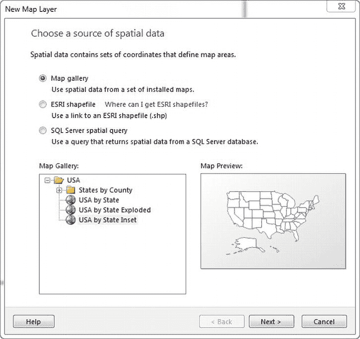

#### 图 5-12. 新建地图图层向导：选择空间数据源

单击“下一步”按钮，继续进行向导的“选择空间数据和地图视图选项”步骤。在此屏幕上，您可以设置缩放级别、修改分辨率设置以及添加 Bing 地图图层。现在，我们暂时保留此页的默认设置，并单击“*下一步*”继续到“*选择地图可视化方式*”，如图 5-13 所示。

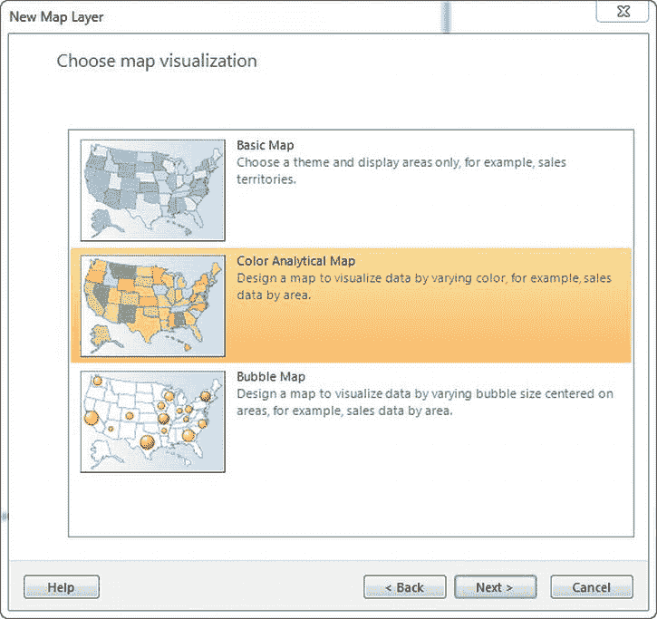

#### 图 5-13. 新建地图图层向导：选择地图可视化选项

选择中间的可视化方式“颜色分析地图”并单击“下一步”。在“*选择分析数据集*”屏幕上，您需要选择或创建一个包含空间数据的数据集。我们将使用现有的数据集，因此选择 Emp_Svc_Cost_By_Patient_State 数据集并单击“下一步”继续。在“*为空间数据和分析数据指定匹配字段*”屏幕上，您需要选择数据集中与您选择的地图库匹配的字段。在本例中，向导检测到您有一个 `StateName` 字段并自动创建到它的链接，如图 5-14 所示。如果您没有 `StateName` 而是有州名缩写，则需要指定数据集中的哪个字段与之匹配。在那种情况下，您可以将您的 `State` 列与空间数据列 `STUSPS` 匹配。确保“匹配字段”中 `STATENAME` 旁边的复选框被选中，并且“分析数据集字段”设置为 `StateName`，然后单击“下一步”进入“*选择颜色主题和数据可视化*”屏幕。

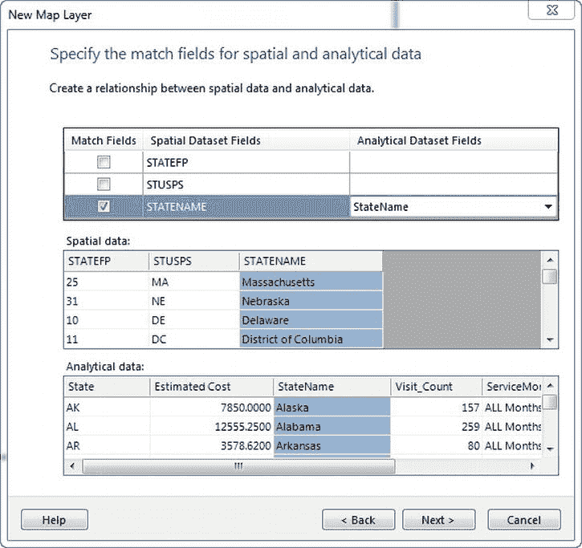

#### 图 5-14. 新建地图图层向导：指定要匹配的字段

将“要可视化的字段”修改为使用 `[SUM(Visit_Count)]`，启用“显示标签”复选框选项，并将用作标签的“数据字段”也设置为 `[SUM(Visit_Count)]`。图 5-15 显示了地图向导最终屏幕上的设置。

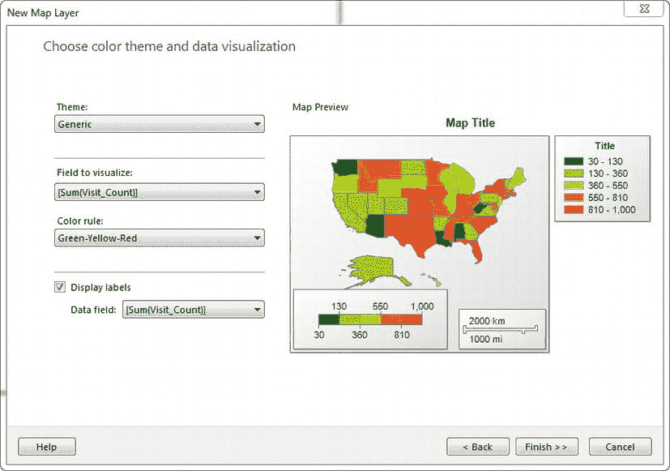

#### 图 5-15. 新建地图图层向导：选择颜色主题和可视化方式

单击“完成”以完成地图向导，然后单击“预览”选项卡，如图 5-16 所示，查看地图的实际效果。

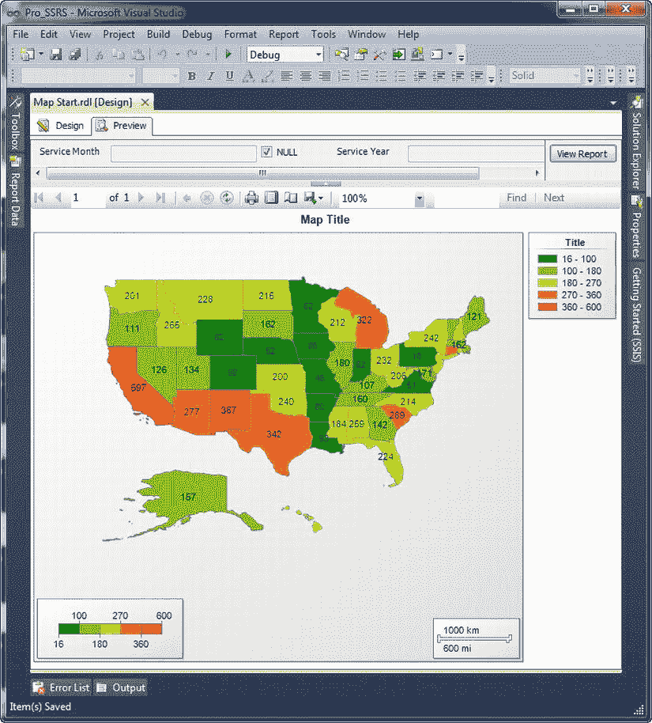

#### 图 5-16. 使用空间查询的地图

代码清单 5-4 显示了用于地图控件的示例 RDL 元素。

#### 代码清单 5-4. 地图控件的 RDL 输出

```xml
<ReportItems>
          <Map Name="Map5">
            <MapViewport>
              <MapCoordinateSystem>Geographic</MapCoordinateSystem>
              <MapProjection>Mercator</MapProjection>
              <ProjectionCenterX>NaN</ProjectionCenterX>
              <ProjectionCenterY>NaN</ProjectionCenterY>
              <MapLimits>
                <MinimumX>NaN</MinimumX>
                <MinimumY>NaN</MinimumY>
                <MaximumX>NaN</MaximumX>
                <MaximumY>NaN</MaximumY>
              </MapLimits>
              <MaximumZoom>4000000</MaximumZoom>
              <MapCustomView>
                <CenterX>46.09375</CenterX>
                <CenterY>63.4690780639648</CenterY>
                <Zoom>100</Zoom>
              </MapCustomView>
              <MapMeridians>
                <Style>
```

已完成的地图对象报表名为 Map.rdl，位于 Pro_SSRS 项目中。


## 实现数据条

 Reporting Services 2008 R2 的另一个新增功能是数据条。如果您是精通 Excel 的用户，可能会在 Excel 中探索时认出这个报表对象。该对象本质上是一个单一条形图（通常水平显示），可以快速、一目了然地逐行进行比较。条形越长代表数值越高，条形越短则明确表示数值越低。

在本例中，我们将从 `Pro_SSRS` 项目中名为 `Data Bar Start.rdl` 的报表开始。您会注意到，已经定义了一个名为 `Emp_Svc_Cost_Data_Bar` 的数据集，该数据集执行一个存储过程以返回指定 `ServiceMonth` 参数下的前十个 `States`（州）及其访问次数。我们还有一个只有两列的表格。展开 `Emp_Svc_Cost_Data_Bar` 数据集，并将 `StateName` 字段拖到表格详细信息行的第一列中。接下来，将数据条报表项拖到详细信息行的第二列。释放数据条时，系统将提示您选择所需的数据条类型。您的选项是：

*   条形图
*   堆积条形图
*   百分比堆积条形图
*   柱形图
*   堆积柱形图
*   百分比堆积柱形图

对于本示例，请选择 `Bar`（条形图），如 `Figure 5-17` 所示，然后单击 `OK`（确定）。

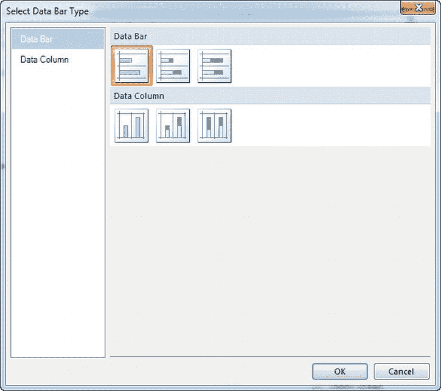
`Figure 5-17. 数据条类型选择`

接下来，将 `Visit_Count_By_State` 字段拖到数据条上方，并在其上悬停，直到 `Chart Data`（图表数据）对话框弹出。当您看到 `Chart Data` 对话框时，将所选字段拖到 `Values`（值）区域的空白处，如 `Figure 5-18` 所示。

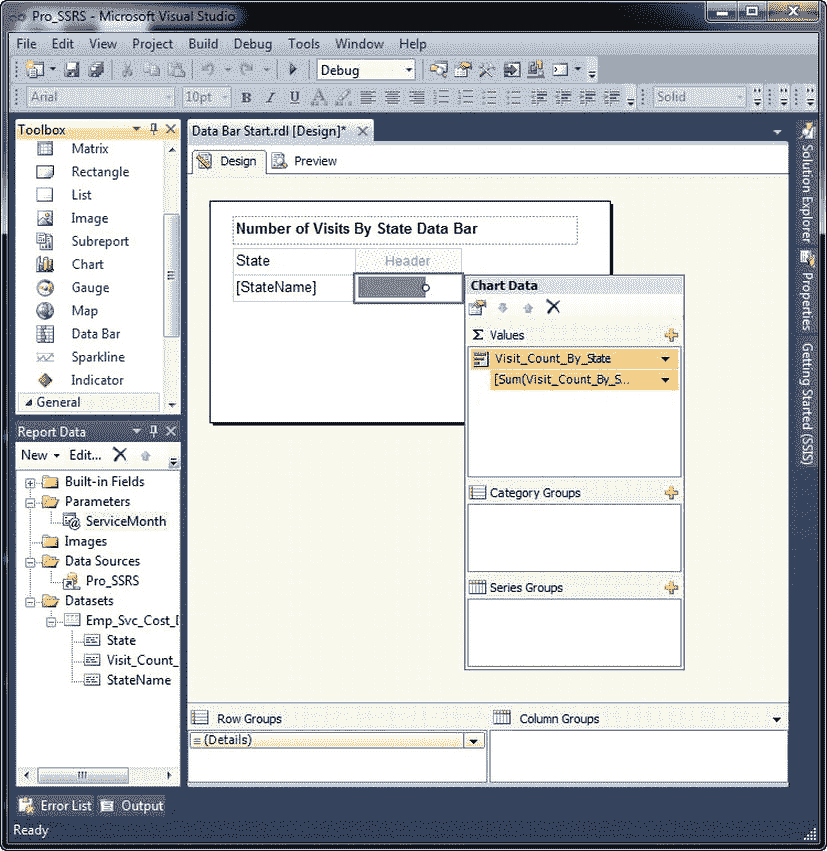
`Figure 5-18. 数据条：图表数据值`

您可以在此停止，但让我们为报表增添一些亮点。将包含数据条的标题列标记为“访问计数”。然后将标题行设为 `Bold`（加粗）和 `Centered`（居中）。现在，选择数据条——是蓝色条形，而不是单元格——然后右键单击它以调出对话框，并选择 `Show Data Labels`（显示数据标签）。这将在您运行报表时显示数值。接下来，再次右键单击数据条，然后选择 `Series Properties…`（系列属性）。转到 `Fill`（填充）选项卡，选择 `Gradient`（渐变），并将 `Gradient style`（渐变样式）设置为 `Left right`（左右），如 `Figure 5-19` 所示。然后单击主色（顶部颜色）旁边的 `f[x]` 按钮以创建表达式。

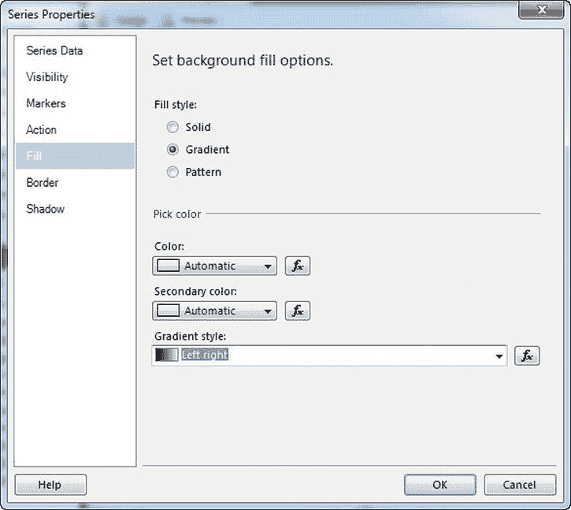
`Figure 5-19. 数据条：系列属性填充选项`

打开表达式编辑器后，输入以下表达式并单击 `OK`（确定）：

```
=IIF(Parameters!ServiceMonth.Label <> "ALL",IIF(Fields!Visit_Count_By_State.Value > 75,
"Green", "Red"),IIF(Fields!Visit_Count_By_State.Value > 300, "Green", "Red"))
```

如本表达式所示，您可以嵌套条件语句。这里我们检查所选参数标签是否不是 `ALL`（全部）。然后检查 `Visit_Count_By_State`，查看所选月份的访问计数是否超过 75。如果是，则将数据条设为绿色；如果不是，则设为红色。外部的 `IIF` 语句检查计数是否大于 300，并相应地设置颜色。单击 `Preview`（预览）以查看运行中的报表，如 `Figure 5-20` 所示。

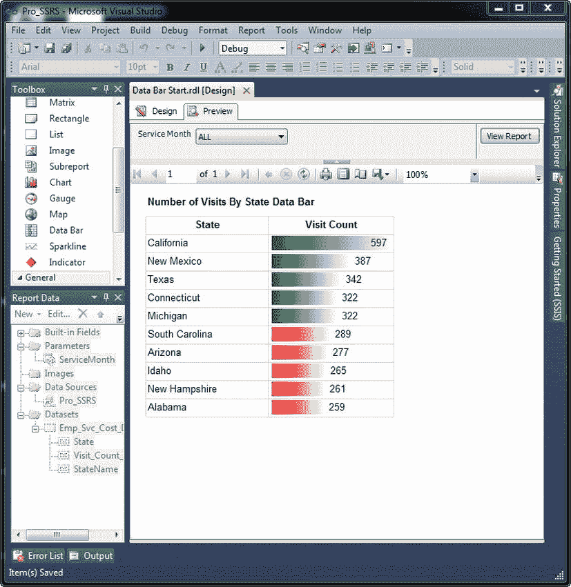
`Figure 5-20. 数据条报表预览`

`Listing 5-5` 显示了数据条报表项 RDL 文件的一个部分。
`Listing 5-5. RDL 数据条`

```xml
<Chart Name="DataBar1">
   <ChartCategoryHierarchy>
        <ChartMembers>
            <ChartMember
           …
                  <ChartMember>
                     <Label>Visit Count By State</Label>
                     </ChartMember>
                     </ChartMembers>
                     </ChartSeriesHierarchy>
                      <ChartData>
                        <ChartSeriesCollection>
                          <ChartSeries Name="Visit_Count_By_State">
                            <ChartDataPoints>
                              <ChartDataPoint>
                                <ChartDataPointValues>
                                  <Y>=Sum(Fields!Visit_Count_By_State.Value)</Y>
                                </ChartDataPointValues>
                                <ChartDataLabel>
                                  <Style />
                                  <UseValueAsLabel>true</UseValueAsLabel>
                                  <Visible>true</Visible>
                                </ChartDataLabel>
                                <Style>
                                  <Color>=IIF(Parameters!ServiceMonth.Label <> "ALL",IIF(Fields!Visit_Count_By_State.Value > 75, "Green", "Red"),IIF(Fields!Visit_Count_By_State.Value > 300, "Green", "Red"))</Color>
                                  <BackgroundGradientType>LeftRight</BackgroundGradientType>
                               </Style>
```

数据条的最终报表在 `Pro_SSRS` 解决方案中名为 `Data Bar.rdl`。


## 实现迷你图

根据我的经验，领导层常见的报表需求之一是展示月度或年度趋势分析。虽然在早期版本的 Reporting Services 中也能实现这种效果，但要做出真正具有趋势感的外观需要更多功夫。Reporting Services 2008 R2 版本引入了**迷你图控件**。这个开箱即用的报表项使用简单，能在很小的区域内展示大量数据。

在本例中，我们将首先在 Pro_SSRS Reporting Services 解决方案中打开名为 `Sparkline Start.rdl` 的报表。你会注意到我们已创建了一个数据集，它执行名为 `Emp_Svc_Cost_Sparkline` 的存储过程。此存储过程返回每次访问发生的 `Date`（日期）、`Month`（月份）和 `Year`（年份）。你还会发现一个 Tablix，其中包含数据集中的 `Month` 字段以及一些合适的标题。

首先，从工具箱中拖动迷你图控件，将其放置在 "Daily Trend" 标题下方的空白文本框中，并选择"区域"迷你图类型。这是"区域"部分下的第一种类型。其他三种类型可以是"平滑区域"、"堆积区域"和"百分比堆积区域"。接下来，展开 `Emp_Svc_Cost_Sparkline` 数据集，并将 `Visit_Count` 字段拖到新的迷你图上方。如果在释放之前将鼠标悬停在迷你图上，你会看到如之前示例中见过的"图表数据"屏幕。将 `Visit_Count` 字段释放到"值"部分，如图 5-21 所示。

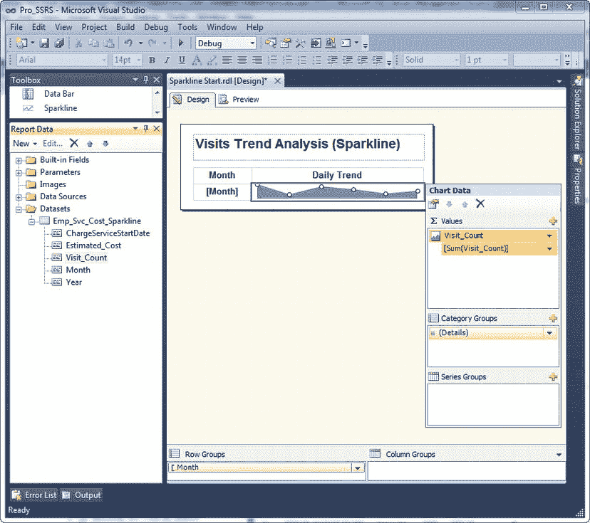
`图 5-21. 迷你图：图表数据值`

预览报表时，你应该会看到访问量的每日趋势。目前可能看起来有些粗糙，但我们稍后会让它变得更好一些。你还会看到一个 `MonthlyGoal`（月度目标）参数，我们即将实现它，作为关键绩效指标（KPI）的一种变体。就像在数据条示例中一样，我们将根据是否达到月度访问目标，将迷你图的颜色更改为红色或绿色的阴影。点击"设计"选项卡，对迷你图报表进行更多编辑。

双击你的迷你图控件，然后在图表数据窗口中右键单击 `Visit_Count`。选择"序列属性"，并导航到"填充"选项卡。选择"渐变"作为填充样式，"白色"作为辅助颜色，渐变样式为"上下"。最后，让我们设置一个表达式，根据 `MonthlyGoal` 参数来改变颜色。点击顶部颜色选择右侧的 `f(x)` 按钮以创建表达式。清除默认文本，输入以下表达式，然后单击"确定"关闭表达式编辑器。序列属性窗口应如图 5-22 所示。

`IIF(SUM(Fields!Visit_Count!Value,"Month") >= Parameters!MonthlyGoal.Value, "Green", "Red")`
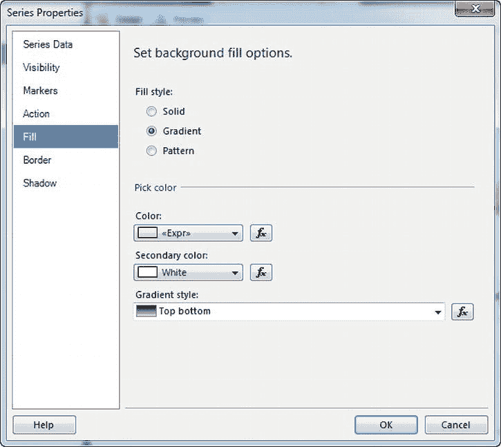
`图 5-22. 迷你图：序列填充选项`

我们将在后面详细介绍表达式，但这个表达式本质上是比较月份组的访问总量与在月度目标参数中选择的值。图 5-23 展示了预览模式下的报表。将你的 `Monthly Goal` 更改为 2000，然后单击 `View Report` 按钮，以查看我们颜色表达式的动态特性。通常，KPI 并非以这种方式实现，但可以了解如何使用一个值来动态改变颜色，以提供关于是否达到预定目标的、一目了然的视觉指示。通常，这些值会存储在数据库中以便进行配置。

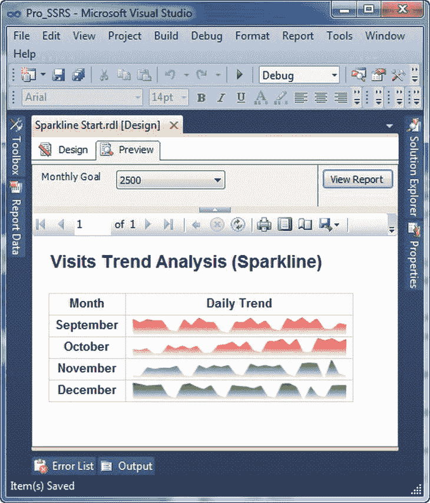
`图 5-23. 迷你图：预览报表`

 **注意** 我们将在本书中更详细地讨论这一点，但在本例中需要注意的一点是，我为 `Month` 创建了一个组并移除了 `Details`（详细信息）组。这使我能够在存储过程返回每日结果集的情况下，按月创建趋势。

清单 5-6 显示了迷你图控件 RDL 文件的一部分。
`清单 5-6. RDL 迷你图`

```
<Chart Name="Sparkline4">
<ChartCategoryHierarchy>
<ChartMembers>
    <ChartMember>
    <Group Name="ChartGroup" />
    <Label />
    </ChartMember>
</ChartMembers>
</ChartCategoryHierarchy>
<ChartSeriesHierarchy>
<ChartMembers>
    <ChartMember>
    <Label>Visit Count</Label>
    </ChartMember>
</ChartMembers>
</ChartSeriesHierarchy>
<ChartData>
<ChartSeriesCollection>
    <ChartSeries Name="Visit_Count">
    <ChartDataPoints>
        <ChartDataPoint>
        <ChartDataPointValues>
            <Y>=Sum(Fields!Visit_Count.Value)</Y>
        </ChartDataPointValues>
        <ChartDataLabel>
            <Style />
        </ChartDataLabel>
        <Style>
            <Color>=IIF(SUM(Fields!Visit_Count.Value,"Month") &gt;=
            Parameters!MonthlyGoal.Value, "Green", "Red")</Color>
           <BackgroundGradientType>TopBottom</BackgroundGradientType>
           <BackgroundGradientEndColor>White</BackgroundGradientEndColor>
       </Style>
```

迷你图的完整报表在 Pro_SSRS 解决方案中名为 `Sparkline.rdl`。


### 实现指示器

在 Reporting Services 2005 和 2008 中，我们可以创建在包含 KPI 的报表中看到的功能。然而，这需要在表达式的使用上发挥一些创意。例如，如果希望基于结果集中的某个特定值显示图像，就需要根据表达式设置每个图像的可见性。这种方法实现起来并不太困难，但维护起来更复杂。在 2008 R2 中，我们通过 `Indicator` 报表项直接获得了此功能，开箱即用。

很多时候，我们报表的消费者希望看到一个视觉指示器，以基本的方向性方式显示趋势。例如，人们可能想知道总访问量是比上月增加、持平还是减少。如果我们看到负面结果的持续趋势，决策者可能希望更深入地探究可能的原因。这就是我们在本示例中将创建的报表风格。我们的决策者希望看到总访问量相对于上月的当前状态。

在本示例中，我们将从 Pro_SSRS 解决方案中的 `Indicator Start.rdl` 开始。`Indicator Start` 报表中包含一个返回四年样本访问数据的数据集。您还会注意到有一个包含三列的 `Tablix`。其中两列已经包含了报表所需的部分数据，第三列将用于我们的 `Indicator` 报表项。我们已经向您展示了一些将项目添加到报表设计 surface 的方法，但与许多应用程序一样，通常可以通过多种不同的方式完成相同的任务。

右键单击 `Tablix1` 中的空文本框，在子上下文菜单底部选择 `Insert`，然后选择 `Indicator`。当您向报表添加 `Indicator` 报表项时，会提示您使用 `Indicator Wizard`，如 图 5-24 所示。有四类指示器可供选择。但是，这些指示器中的每一个都可以自定义，包括颜色和用于控制它们的值。您甚至可以添加更多的指示器状态，使用自己的自定义图像，或将图像嵌入到 Gauge 控件中。

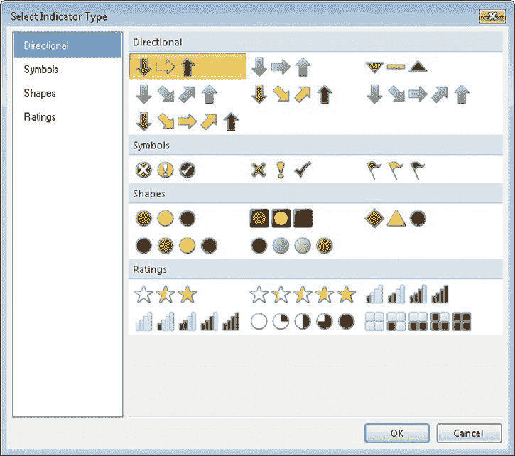

**图 5-24.** 指示器：指示器类型选择

我们将使用默认的 `Directional` 指示器，即带有三个箭头的那个。确保该指示器被选中。然后单击 `OK` 返回报表设计器。此时，我们已经添加了一个指示器，但尚未告诉它使用哪个字段。右键单击指示器，选择 `Indicator Properties`，然后选择 `Values and States` 选项卡。这是大多数魔法发生的地方。将 `Value` 设置为 `=SUM(Fields!Diff.Value)`，因为您希望显示当前月份和上个月之间的差异，如 图 5-25 所示。接下来，将 `States Measurement Unit` 从 `Percentage` 切换为 `Numeric`。如果您的结果是以变化百分比的形式返回的，那么请将其保留为默认设置。如果要添加或减少指示器状态的数量，可以分别单击 `Add` 或 `Delete` 按钮来实现。三个值将满足本示例的需求，因此对起始值和结束值进行以下更改：

*   红色向下箭头 – 清除起始值并将 -1 设置为结束值。这本质上是告诉 SSRS，任何负值都应由红色向下箭头表示。
*   黄色向右箭头 – 将起始值和结束值都设置为 0，以表示当前和上月的总访问计数没有变化。
*   绿色向上箭头 – 在起始值中输入 1，并清除结束值，以将所有正值显示为相对于上月的访问量增加。

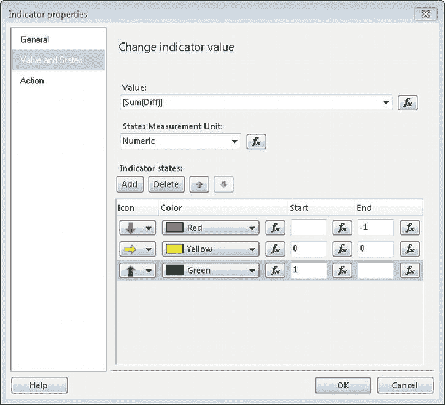

**图 5-25.** 指示器属性

完成所需的更改后，单击 `OK` 返回到 `Indicator Start` 报表。单击 `Preview` 选项卡以运行报表。如果所有设置都正确，您的报表应如 图 5-26 所示。

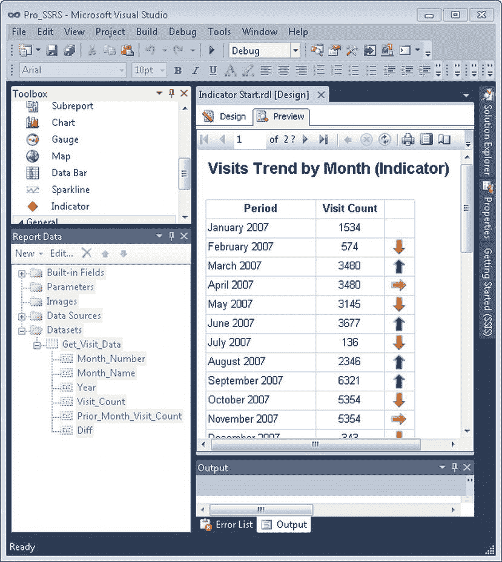

**图 5-26.** 预览“指示器开始”

清单 5-7 显示了 `Indicator` 报表项的 RDL 文件的整合部分。

**清单 5-7.** RDL 指示器

```
<StateIndicator Name="Indicator1">
 <GaugeInputValue>
   <Value>=Sum(Fields!Diff.Value)</Value>
   <Multiplier>1</Multiplier>
   <DataElementOutput>NoOutput</DataElementOutput>
 </GaugeInputValue>
 <TransformationType>None</TransformationType>
 <TransformationScope>Tablix1</TransformationScope>
 ...
 <IndicatorStates>
   <IndicatorState Name="ArrowDown">
     <StartValue>
       <Value />
       <Multiplier>1</Multiplier>
     </StartValue>
     <EndValue>
       <Value>-1</Value>
       <Multiplier>1</Multiplier>
     </EndValue>
     <Color>Red</Color>
     <ScaleFactor>0.99</ScaleFactor>
     <IndicatorStyle>ArrowDown</IndicatorStyle>
     <IndicatorImage>
       <Source>External</Source>
       <Value />
     </IndicatorImage>
   </IndicatorState>
   <IndicatorState Name="ArrowSide">
     ...
   <IndicatorState Name="ArrowUp">
     ...
   </IndicatorState>
 </IndicatorStates>
```

完整的 `Indicator` 报表在 Pro_SSRS 解决方案中称为 `Indicator.rdl`。

### 小结

在本章中，我们介绍了 Reporting Services 中一些视觉上更吸引人的对象，例如图表、地图和仪表。这些对象通常出现在仪表板风格的报表中，以提供一目了然的视角。我们还概述了图表数据区域，并逐步介绍了可用的不同图表类型的示例。既然您对设计环境更加熟悉了，您将学习如何使用它来设计和部署一些真实的报表。在下一章中，我们将展示如何采用循序渐进的方法，将这些报表项添加到作为医疗保健应用程序 SSRS 迁移一部分而设计的报表中。

## 第 6 章


