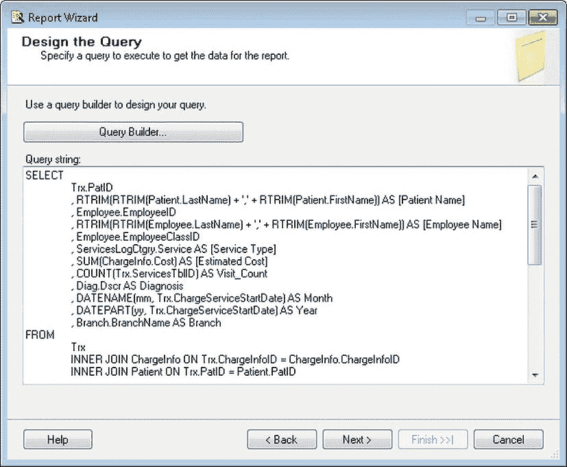
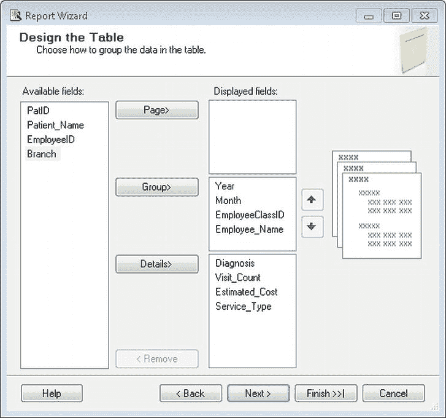
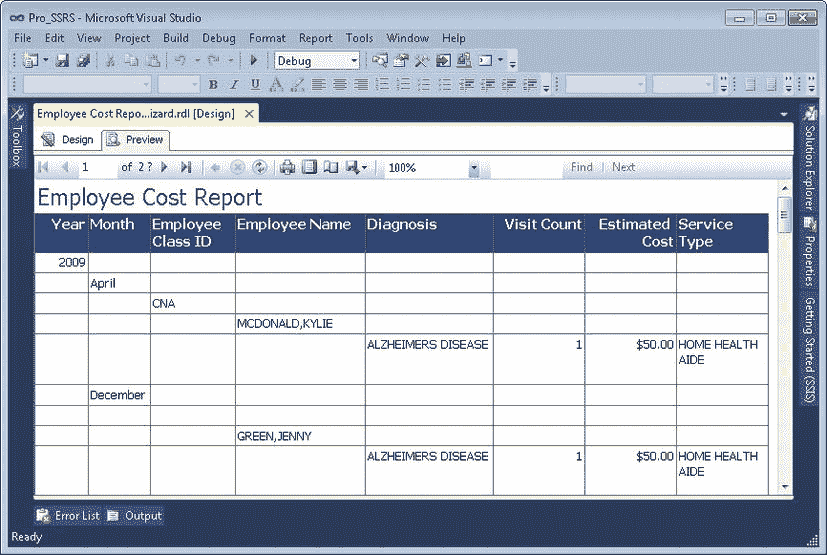

# 构建报表

在上一章中，你通过创建一个查询及后续的存储过程，为你的第一份报表奠定了基础。你也了解了用于构建报表的基本元素，并且现在对设计环境已经熟悉。现在，是时候将所有部分组合起来并开始构建报表了。你可以轻松地将本章介绍的概念应用到任何使用 SQL Server 和关系数据库系统的公司。本章将主要关注基于 SQL Server 医疗保健数据库的数据创建报表解决方案；它将使用许多自 SSRS 在 SQL Server 2000 到 2012 版本中诞生以来就可用的报表元素。SSRS 2008 和 2008 R2 引入了许多新功能，例如报表变量、增强的图表和数据可视化。最重要的新增功能是 `Tablix` 数据区域以及像 `火花线`、`数据条` 和 `指示器` 这样的仪表板风格元素。我们很高兴能将这些重要且期待已久的功能增强纳入本书中展示的报表。

你将在本章创建的报表称为 `员工服务成本` 报表。该报表将利用相同的查询和存储过程 `Emp_Svc_Cost` 来提供报表数据，这个存储过程你从 第 2 章 开始就在使用。提醒一下，该查询返回代表为患者执行的服务（例如专业护士或家庭健康助手的出诊）的详细记录。每种类型的服务对于医疗保健公司都有一个关联的成本。这份报表完成后，将根据查询提供的关联数据显示重要的成本点，例如患者的诊断、执行服务的员工、每项服务的日期以及患者的分支机构位置。通过在这些成本点对报表进行分组和排序，你将能够查看从单个患者一直到分支机构位置（可能服务于数百名患者）的服务成本。你将对每一级别进行分组并计算成本金额。

具体来说，在以下部分中，你将首先使用 `报表向导` 创建 `员工服务成本` 报表（该向导基于预定义的选择生成报表），然后从头开始创建。我们将展示使用向导的过程仅用于演示目的，因此不会继续处理它生成的报表。对于你从头构建的报表，你将添加 `报表向导` 能够添加的所有功能，以及更多功能。以下列表重点列出了 `员工服务成本` 报表的设计目标：

*   逐步添加一个基础报表，该报表使用基于你为 `Emp_Svc_Cost` 查询定义的数据集的 `表格` 数据区域。
*   向报表添加几个基本的格式化元素。
*   向报表添加交互性，包括文档映射、可见性、超链接操作和交互式排序（在 SSRS 2005 中引入）。文档映射和超链接操作都允许用户导航到报表内或报表外（例如网站）的指定位置。在本章中，你将在报表中使用可见性属性来展开和折叠报表项，从摘要到详细信息。交互式排序赋予了 SSRS 报表多功能性，允许其进行排序，其方式非常类似于 Microsoft Outlook 允许通过点击列标题进行排序。
*   通过将数据集从查询更改为参数化存储过程，自动向报表添加参数。你还将添加其他数据集来填充存储过程定义的参数。
*   学习如何使用修改后的存储过程和 `UDF` 来使用多值参数。
*   向 `表格` 数据区域添加一个筛选器，以仅显示类型为“就诊”的服务。
*   向报表添加一个用于前十大诊断的 `图表` 数据区域。
*   向报表添加一个报表变量（在 2008 版中引入）以用作常量阈值。
*   向报表添加一个仪表控件以显示阈值信息。
*   向报表 `表格` 区域添加列分组。`表格` 区域内的列分组是 `表格`、`矩阵` 和 `列表` 数据区域的新 `Tablix` 功能的一部分。`Tablix` 功能已在 第 4 章 中详细介绍。
*   为报表添加最后的修饰，例如页眉和页脚、标题以及页码。

此外，当你开始更深入地使用报表和查询参数时，你将学习如何使用多值参数。正如前面章节所述，多值参数在设计底层查询时需要特殊考虑。因此，在本章中，你将使用修改后的存储过程版本，该版本利用了 `UDF`；这将教你如何最好地利用此功能。

在前面的章节中，我们已经介绍了创建你的报表将使用的解决方案、项目和数据源的步骤，因此这里不再重复这些步骤。然而，我们将展示如何使用相同的数据源属性来连接到存储你的报表数据的医疗保健数据库。同一个数据库还包含你在 第 2 章 创建的存储过程 `Emp_Svc_Cost`，你将在本章后面用到它。

### 使用报告向导创建报告

在许多场景下，报告向导是创建基本报告的快捷方法，该报告可以在部署前进行进一步完善。报告向导适用于主要是数据列表且不需要太多特殊格式的报告。在本节中，你将逐步使用报告向导创建“员工服务成本”报告，然后再手动设计相同的报告。

要在报告项目中打开报告向导，请右键单击“解决方案资源管理器”中的 `Reports` 文件夹，然后选择 `添加新报告`。向导的第一个屏幕定义了数据源。对于本例，勾选 `新建数据源`；不过，你也可以选择使用已定义为项目一部分的共享数据源。提供与上一章相同的数据源信息以连接到 `Pro_SSRS` 数据库。连接字符串应类似于以下内容：

`Data Source=localhost;Initial Catalog=Pro_SSRS`

向导的下一个屏幕定义查询。将你在第 2 章中创建的查询粘贴到 `查询字符串` 区域（参见图 6-1）。你可以从本书代码下载的 `Query` 文件夹中打开此查询。文件名为 `Report_Wizard_Query.sql`。单击 `查询生成器` 按钮将启动图形化查询设计器。

**图 6-1.** 在 `查询字符串` 区域粘贴查询

报告向导的下一个屏幕询问报告应采用 `表格` 还是 `矩阵` 形式。选择 `表格` 将在下一屏触发向导提供分组信息；选择 `矩阵` 将提供一个类似的屏幕用于行和列而非分组。对于本例，选择 `表格`，单击 `下一步`，然后选择分组和明细布局，将 `年份` 显示为主要分组，接下来是 `月份`、`员工类别 ID` 和 `员工姓名`。对于明细，你希望看到患者具体信息——`诊断`、`就诊次数`、`预估成本` 和 `服务类型`——如图 6-2 所示。

对将出现在报告中的数据进行分组后，接下来的两个屏幕主要用于格式化。在这里，你可以指定报告是否采用 `阶梯式` 或 `块状` 布局，以及报告是否包含小计并提供向下钻取功能。你还可以为报告选择自定义样式。

**图 6-2.** 报告向导分组和明细选择

目前，选择 `阶梯式` 并禁用 `向下钻取` 功能，然后单击 `下一步`。在 `表格样式` 屏幕上，将 `Corporate` 样式应用于报告，在向导中单击 `下一步`，并将名称从默认的 `ReportX`（其中 `X` 是已创建报告的下一个序号）更改为 `员工成本报告向导`。接下来，勾选 `预览报告` 框，以便在创建后立即执行报告，然后单击 `完成` 以生成报告。片刻之后，结果报告就会出现。虽然乍一看它似乎需要许多外观上的更改，例如扩展几列的大小（例如 `员工姓名` 和 `诊断`）、将分组的背景颜色重置为 `白色`、将 `[年份]` 的字体颜色设置为 `黑色`，以及将 `预估成本` 列格式化为货币，但该报告至少是功能完整的。根据所需的布局，可能需要大量工作才能达到你想要的效果。假设你接受了一种默认样式，这将是进行修改的良好起点，如图 6-3 所示。

为了充分利用 `SSRS` 的灵活性和 `BIDS` 的报告设计环境，让我们从头开始创建相同的报告。

**图 6-3.** 从报告向导生成的报告

### 从头开始构建报告

使用空白报告时，第一个决定是在报告主体中使用哪种数据区域。这个决定主要取决于你正在处理的数据类型以及报告受众。例如，首席执行官 (`CEO`) 可能不关心细节，更愿意查看有关业务产品和服务状态的摘要信息，因此更倾向于查看带有列和行总计的矩阵报告。然而，在初始报告中，你将使用 `表格` 数据区域，因为你希望以表格行（而非列）显示患者与员工之间的相互关系及多重分组。你将在本章中构建的报告的最终修改将包括列和行分组，向你展示如何整合 `Tablix` 数据区域的元素。

在本节中，你将遵循特定步骤，通过添加 `表格` 数据区域使报告达到基本起点，然后继续添加格式和功能。完成后，该报告将包含许多 `SSRS` 功能，包括交互式向下钻取和导航链接、自定义格式、交互式排序、填充的下拉参数以及一个显示成本排名前十的诊断的图表。你将通过添加一些设计点缀来完成报告，例如页码和执行时间。你将研究如何修改报告以处理多值参数。你还将探索 `SSRS 2008` 中添加的另一项功能：报告变量。对于此项目，你将从“解决方案资源管理器”中添加一个新报告，并创建一个数据集，该数据集使用本章上一节中用于报告向导的相同查询。为简单起见，我们已在 `Pro_SSRS` 项目中包含了起始点报告。`EmployeeServiceCost_Start` 报告已经为 `localhost` SQL Server 定义了数据集和初始查询，这应与你的环境匹配。你将首先仅使用基本查询，而不是存储过程。你将在 `EmployeeServiceCost_Start` 报告中开始使用的数据集名为 `Emp_Svc_Cost`。稍后，在“使用存储过程设置报告参数”部分，你将修改数据集以使用存储过程，并了解存储过程中定义的参数将如何自动创建报告参数。

在以下部分中，你将通过几个步骤向单个报告添加功能。提供这些步骤是为了让你能够逐步构建报告，从 `EmployeeServiceCost_Start` 报告开始；然而，在几个节点上，你可以选择打开反映已完成步骤的几个示例报告之一。如果有可用的报告，我们将在文中指出。

在 `BIDS` 中打开 `EmployeeServiceCost_Start` 报告后，转到 `设计` 选项卡。以下步骤使你达到报告的起点，在这里你将开始应用更高级的格式和逻辑：

