# 创建 Employee Service Cost 报表

1.  将表格报表元素拖到设计网格的空白区域。
2.  在“报表数据”窗格中，将字段——`Emp_Svc_Cost`数据集中的`Estimated_Cost`和`Visit_Count`——按所列顺序拖到详细信息行。通过右键单击列并选择“删除列”来删除额外的列。请注意，为每个拖到详细信息行的字段自动为您创建了列标题——“Estimated Cost”和“Visit Count”。如果看不到“报表数据”窗格，可以使用`CTRL + ALT + D`或在“视图”菜单下选择它来调出窗格。
3.  通过右键单击每个详细信息字段并选择子菜单中的“表达式”，将`Visit_Count`和`Estimated_Cost`字段表达式编辑为求和形式，例如`=Sum(Fields!Estimated_Cost.Value)`。您会注意到，在 BIDS 中开发报表时，输入到报表区域的每个值都会用括号括起来或表示为“<<expr>>”。例如，表达式`=Sum(Fields!Estimated_Cost.Value)`在表格单元格中将直观地显示为`[Sum(Estimated_Cost)]`，因为该表达式本身是一个已知值。您也可以突出显示该字段，右键单击，然后在“Summarize By...”子菜单下选择“Sum”。
4.  将`Employee_Name`字段拖到“行组”窗格，并释放在`(Details)`组上方。这将基于`Fields!Employee_Name.Value`创建一个分组，并向表格添加一个新列。默认情况下，组名与用于分组的字段名相同。您还会注意到，在详细信息节和我们 Tablix 的新`Employee_Name`列之间放置了一条垂直虚线：这为您提供了一个视觉指示器，标明组节结束和详细信息节开始的位置。
5.  接下来，拖动`Patient_Name`字段并释放在`Employee_Name`组上方，以在`Patient_Name`上创建一个行组。对`Service_Type`和`Diagnosis`重复此步骤，每个都放在前一个之上。这将分别创建一个包含`Diagnosis`、`Service_Type`、`Patient_Name`和`Employee_Name`的层次结构。
6.  右键单击“行组”窗格中的`(Details)`组，选择“组属性”。单击“组表达式”下的“添加”，并在“分组依据”下拉列表中选择`[Employee_Name]`。
7.  为了使我们的报表具有清晰的阶梯外观，右键单击表格中的`Employee_Name`字段，选择“插入行”，然后选择“组外 - 上方”（如图 6-4 所示）。接下来，将步骤 5 中添加的`Patient_Name`字段拖到`Employee_Name`上方新的空单元格中。右键单击`Patient_Name`，然后同样选择“插入行”，再选择“组外 - 上方”。这次，将步骤 5 中添加的`Service_Type`拖到新的空白处。完成了两个分组后，让我们对层次结构中的上一级执行相同的操作。右键单击`Service_Type`并选择“组外 - 上方”。这次，将我们的`Diagnosis`字段拖到`Service_Type`上方。图 6-5 显示了我们的报表在设计器中应有的样子。

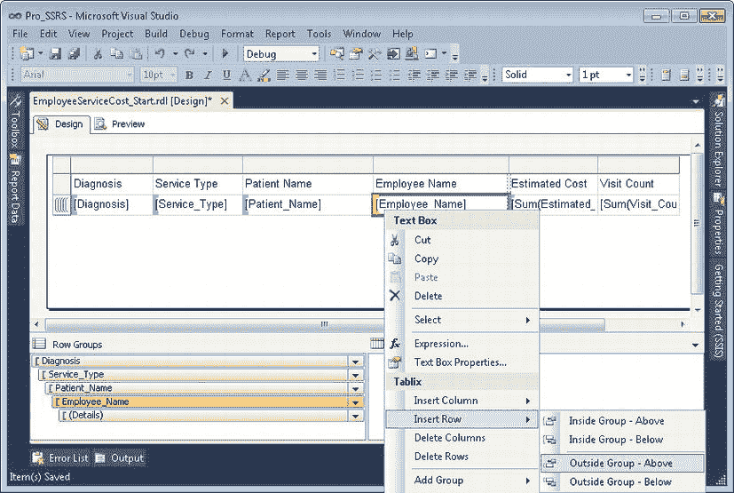

**图 6-4.** Employee Service Cost 报表 添加“组外 - 上方”以实现阶梯外观

8.  现在，通过右键单击每个列并选择“删除列”，移除标题分别为“Diagnosis”、“Service Type”和“Patient Name”的三列。删除这三列后，将您的 Tablix 拖到更靠近设计窗格左侧的位置。然后将标有“Employee Name”的列调整为大约三英寸宽，这样值就不会换行到下一行。
9.  选择表格中包含`[Service_Type]`的文本框，按`F4`显示“属性”窗口。滚动直到看到“Padding”，单击箭头展开属性。将左填充修改为`10pt`。对`[Patient_Name]`和`[Employee_Name]`执行相同的操作，但分别将它们设置为`20pt`和`30pt`。

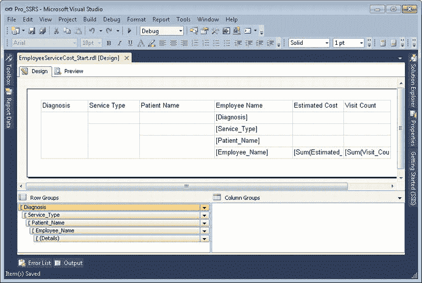

**图 6-5.** Employee Service Cost 报表 组外 - 上方

完成这九个步骤后，正如您在预览中看到的，报表开始成形。虽然美观上还有待改进，但它以适当的、固定分组显示了数据，并以表格形式呈现，以便于识别详细的服务信息，例如每个患者服务的成本和计数（参见图 6-6）。

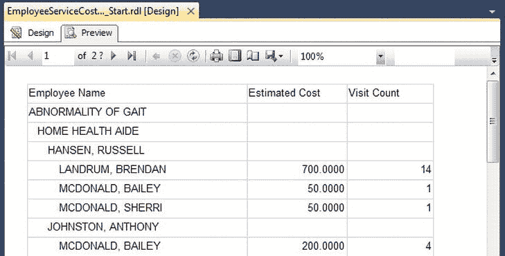

**图 6-6.** Employee Service Cost 报表的详细信息与分组

### 格式化输出

您可以修改几个快速简单的报表属性，为报表增添更专业的外观和感觉：

*   边框样式
*   格式

通过使用`Shift`或`Control`键，或者单击并拖动鼠标，可以轻松地同时将报表属性应用于多个单元格。对于“Estimated Cost”和“Service Count”标题单元格，您将在底部添加边框，将记录标题与实际数据分开。首先，按住`Control`键并单击每个单元格来突出显示两个标题列单元格。接下来，打开或展开“属性”窗口。“属性”窗口包含所选单元格每个区域（上、下、左、右）的“边框样式”属性。对于此示例，为底部边框选择“Solid”。

保持“属性”窗口打开，单击“Estimated Cost”详细信息行单元格。在“属性”窗口中格式化该单元格，通过为“格式”属性添加格式命令`C0`使其成为货币格式。

接下来，将标有“Employee Name”的标题单元格重命名为“Diagnosis > Service > Patient > Employee”，并扩展列以适应新标签的宽度。

应用格式后，您可以通过单击“预览”选项卡立即看到这些更改如何影响输出（参见图 6-7）。

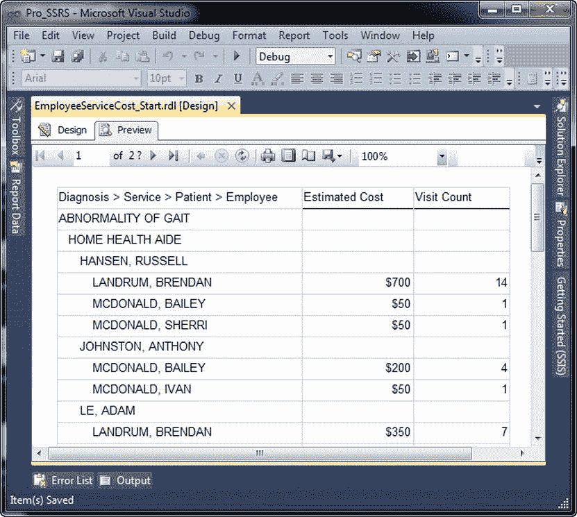

**图 6-7.** 应用格式后的报表输出

`Pro_SSRS`项目中的`EmployeeServiceCost_Format.rdl`报表已应用了格式化元素。


### 添加小计

在每个分组级别设置小计，能使报表对用户而言更易于阅读。如果报表具备交互式向下钻取功能（正如您的报表将会拥有的那样），这一点就尤为重要。

为分组添加小计就像复制粘贴或输入字段值表达式一样简单——在本例中，即`=Sum(Fields!Visit_Count.Value)`和`=Sum(Fields!Estimated_Cost.Value)`——将它们添加到报表中上级分组的单元格中。对于此报表，您已在明细行中为`Employee_Name`字段定义了一个分组。这使得报表必须计算每位员工的`Estimated_Cost`和`Visit_Count`字段的总和。对于当前这份报表，仅此而已就足够了，但对于您将要创建的许多其他报表，您可能需要包含明细记录以便进行更精细的分析。

为了准备为报表添加交互功能，您需要通过复制“员工姓名”分组级别中的“员工成本”和“访问计数”文本框，并将它们粘贴到每个分组标题行的单元格中（在本例中，即“诊断”、“服务类型”和“患者姓名”的标题行），从而对所有分组级别的`Estimated_Cost`和`Visit_Count`字段进行求和。或者，您也可以如前所述，选择输入`Sum`值表达式，或在“汇总依据”子菜单下选择`Sum`。如果您选择这些方法之一而不是复制粘贴，您需要像之前一样应用货币格式(`C0`)。您还可以通过按住 Control 键并单击以高亮显示“诊断”分组中的每个“预估成本”和“访问计数值”，然后点击工具栏上的“加粗”按钮，将最顶层的分组（`Diagnosis`字段）设为粗体。应用粗体格式后，分组级别的汇总值将易于与明细行的值区分开来。报表的设计应如图图 6-8 所示。

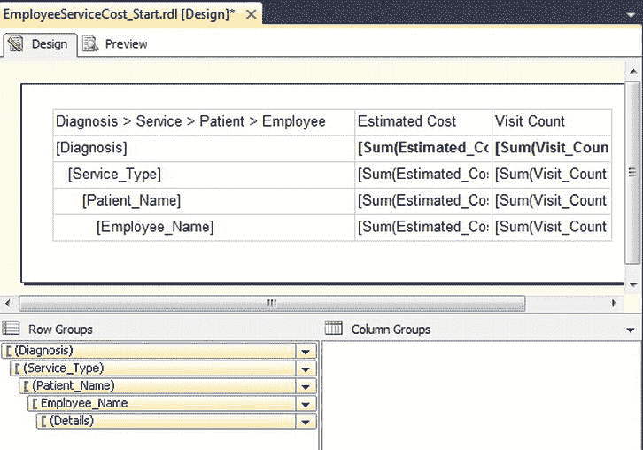

图 6-8. 包含分组级别小计的报表设计

通过选择“预览”选项卡可以看到报表的输出，现在每个分组都包含了更有价值的信息。例如，对于“步态异常”疾病，您现在可以看到共有 194 项服务，预估总成本为 $9,700，并且粗体格式有助于在视觉上区分这些数值。患者 Russel Hansen（其姓名因您对患者分组应用的填充而缩进）是一位步态异常患者，并接受了 68 次家庭健康助理访问中的 16 次。您还可以在包含`Employee_Name`分组的行中，进一步看到每位员工针对该患者的访问次数和成本（参见图 6-9）。

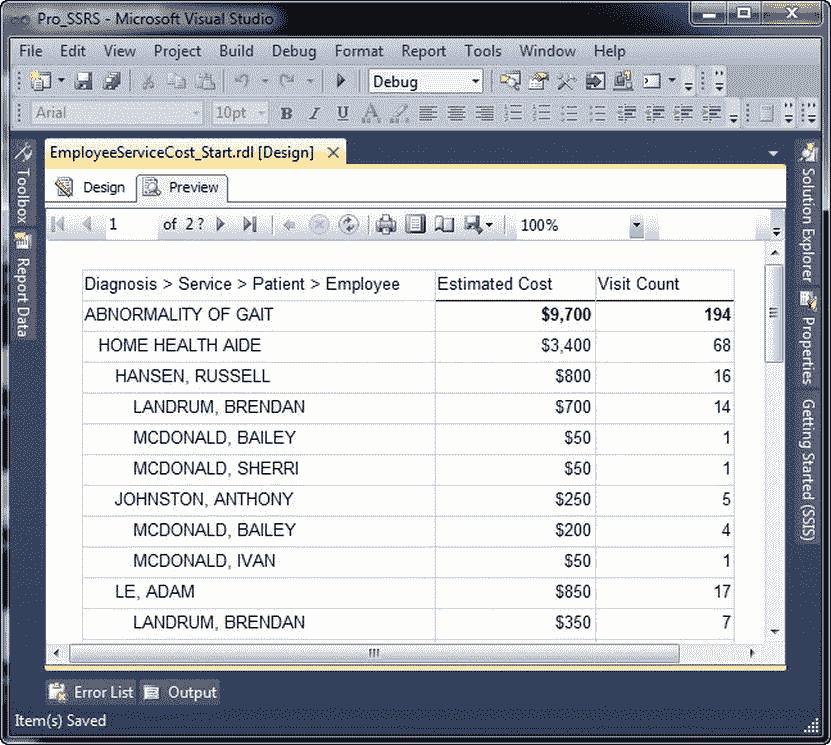

图 6-9. 包含分组级别小计的报表输出

Pro_SSRS 项目中的 `EmployeeServiceCost_Subtotals.rdl` 报表包含了小计。

### 添加交互性

无论特定报表的受众是谁——无论是对屏幕上汇总数据感兴趣的决策者，还是需要打印报表能力的知识工作者——报表内的交互性都能使导航到特定信息变得更加容易和高效。您可以通过多种方式在 SSRS 报表中提供交互性。在接下来的部分中，您将使用四种基本类型的交互性：

> *   文档映射：在报表中提供一个导航窗格，其内容基于某个字段或分组。
> *   可见性：根据用户输入隐藏和显示报表项，从而为报表添加交互性。
> *   交互式排序：允许用户交互式地选择报表数据的排序方式。
> *   超链接操作：允许用户点击链接到同一报表内或报表外部某个位置的报表项。

SSRS 提供的不同呈现格式（在第 7 章中详细介绍）适应了查看和打印报表的需求，以满足不同类型工作者的需要。然而，这也带来了一个限制，即一种呈现格式的某些功能在其他格式中不可用。这一点在处理交互性时最为明显，正如您将在“交互式排序”部分中看到的那样。

#### 文档映射

在 SSRS 报表中创建文档映射，将在报表呈现时为用户展示一个集成的导航窗格。用户可以选择导航窗格中的某个项目，这将导致报表跳转到该项目所在的位置。例如，在示例报表中，用户可能有兴趣查看关于阿尔茨海默病患者的信息。您可以为报表中的“诊断”分组创建一个文档映射，这样当用户从导航窗格中选择“阿尔茨海默病”时，报表将自动跳转到该部分；换句话说，用户无需手动翻查报表来查找所需信息。您还可以在多个级别添加文档映射，在导航窗格中创建分层选择。沿用该示例，除了“诊断”分组外，您还可以为`Service_Type`分组添加文档映射；这样用户就可以在导航窗格中展开“阿尔茨海默病”，查看针对该诊断执行的所有服务类型——例如家庭健康助理服务。

您可以通过向单个报表项或分组可用的“文档映射标签”属性添加表达式来创建文档映射。首先，打开 Pro_SSRS 项目中的 `EmployeeServiceCost_DocumentMap_Start.rdl` 报表。按照以下步骤，您将为`Service_Type`和诊断分组添加文档映射标签：

1.  在“设计”选项卡上，右键单击“行组”窗格中的`Service_Type`分组，选择“分组属性”。然后点击“高级”选项卡。
2.  在“分组属性”的“高级”选项卡中，从“文档映射”下拉列表中选择`Service_Type`。
3.  对诊断分组（即`Service_Type`上方的第一级分组）完成步骤 1 和 2。为“文档映射标签”选项选择“诊断”。

现在，当您预览报表时，导航窗格将自动显示在报表的左侧。默认的 HTML 预览会使用支持文档映射的呈现格式之一（如 PDF）进行显示（参见图 6-10）。

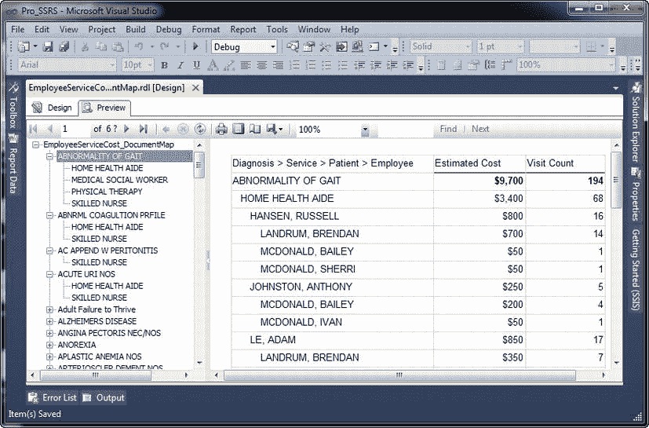

图 6-10. 包含文档映射导航窗格的报表

Pro_SSRS 项目中的 `EmployeeServiceCost_DocumentMap.rdl` 报表包含一个文档映射。

 **注意** 当报表以 PDF 格式呈现时，Adobe Acrobat 将文档映射视为书签。而 SSRS 中的书签功能则完全不同。它们嵌入在报表中，并且报表项被分配了书签链接。


#### 可见性

SSRS 的另一项特性是能够根据用户输入、数据集返回的结果或一些预定义的逻辑，来显示或隐藏已渲染报表的区域。用户通常希望在报表首次呈现时只看到摘要信息，但又能在必要时深入查看摘要数据的细节。报表设计者可能会制作两份报表——摘要报表和明细报表——但这需要分别进行更新和维护。这些报表通常基于相同的查询。幸运的是，SSRS 的显示或隐藏报表数据的功能消除了创建单独报表的需要。报表项的可见性属性控制着哪些报表项被显示或隐藏。

假设你已将报表分发给了目标受众，而他们回来了一些关于如何改进报表的“建议”——毕竟，这是现实世界的报表。他们表示希望看到以下内容：

> *   在报表首次渲染时，显示每个诊断的访问次数和预估费用的汇总总计，并且能够在有依据时深入查看患者和员工的详细信息。
> *   具有特定诊断的患者数量。
> *   为这些患者提供过护理的独立员工数量。

使用 SSRS，这相当直接，你可以快速制作出一份改进的报表。要开始此示例，请在 `Pro_SSRS` 项目中打开 `EmployeeServiceCost_Visibility_Start.rdl` 报表。然后，在修改可见性属性之前，你只需遵循以下设计步骤：

1.  在“设计”选项卡上，右键单击标有“Diagnosis > Service > Patient > Employee”的整个列，选择“在组内插入列 - 右侧”。再执行一次此步骤，这样我们就在组与“Estimated Cost”和“Visit Count”列之间有了两个空列。
2.  在第二列和第三列中，分别输入 **Employee Count** 和 **Patient Count** 作为新的列标题文本。
3.  从右向左调整表格中第二列和第三列的大小，使它们各自大约为 1 英寸。如果默认情况下看不到标尺，你可以右键单击设计环境中的空白区域，然后在“视图”菜单下选择“标尺”。
4.  突出显示“Service Type”、“Patient Name”和“Details”行中的每个单元格。你可以通过按住 `Control` 键并单击表格中第一列左侧的行标记来完成此操作。所有行突出显示后，从格式工具栏中选择 8 磅的字体大小。

你可以通过设置可见性属性值来控制报表项的隐藏或显示状态。你可以在报表的任何层级隐藏报表项，并在用户单击 + 或 – 图标时切换其可见性属性值来显示或隐藏它们。隐藏项的切换点可以是另一个报表层级，例如一个组。在此示例中，你希望隐藏除“Diagnosis”和“Service_Type”字段之外的每个层级，但赋予用户显示或隐藏详细信息的能力。首先，隐藏除“Diagnosis”和“Service_Type”之外的所有组。实现此目标的步骤如下：

1.  在“行组”部分右键单击 `Employee_Name` 组，选择“组属性”。然后单击“可见性”选项卡。
2.  在“可见性”选项卡上，选择“隐藏”单选按钮。
3.  启用“可由此报表项切换显示”复选框。
4.  在“报表项”下拉列表中，选择 `Patient_Name`。
5.  为“Patient Name”组执行步骤 1 到 4，选择或输入 **Service_Type** 作为切换报表项。

另外两个请求是要能够查看每个诊断的患者和员工总数。你可以向报表中添加一个表达式 `CountDistinct`，它将统计每个唯一的患者和员工，并在诊断级别计算数量。用于患者计数的语法如下：

```vb
=CountDistinct(Fields!FieldName.Value)
```

通过为字段 `PatID`（如您所知，该字段对每个患者是唯一的）以及字段 `EmployeeID` 添加 `CountDistinct` 表达式，就能更容易地一目了然地看到有多少患有特定诊断的患者接受了护理。

将以下两个用于“Diagnosis”组的表达式放置在“Employee Count”和“Patient Count”标题单元格正下方的单元格中：

```vb
=CountDistinct(Fields!EmployeeID.Value) =CountDistinct(Fields!PatID.Value)
```

虽然报表与非交互式报表仍然相似，但有了深入查看的附加功能，预览时它会看起来大不相同（参见图 6-11）。在图 6-11 的截图中，你会注意到我们隐藏了文档地图以提供更多报表空间。你可以通过双击分隔文档地图和报表主体的栏中央的小箭头来显示或隐藏文档地图。

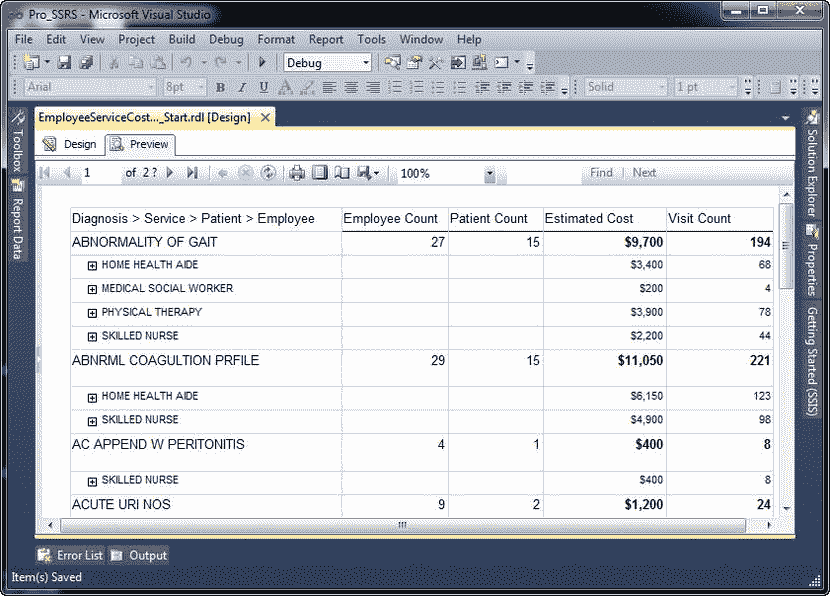

**图 6-11.** 具有交互式深入查看功能的报表

`Pro_SSRS` 项目中的 `EmployeeServiceCost_Visibility.rdl` 报表包含了这些可见性属性。


#### 交互式排序

在向大量受众部署报表时，总会遇到这样的情况：有人会要求以某种特定方式排序报表，而这通常与最初设计的方式不同。当这种情况发生时，报表设计者通常会陷入两难：是创建第二个几乎相同、但带有自定义排序的报表来满足请求者，还是将该请求放入未来的增强队列中。交互式排序允许用户在运行时，对任意数量已定义启用此功能的字段进行排序。

在示例报表中，你知道你有一个广泛的受众群体，他们可能会因不同目的而使用此报表。例如，首席财务官可能希望查看报表以了解哪种诊断的就诊次数最多。相反，另一个用户可能需要了解有多少患者患有某种诊断，并希望报告在诊断组级别按患者数量排序，而不是就诊次数。在本节中，你将向报表添加交互式排序以满足这两种需求，并且知道如果需要，可以按任何其他标准对报表进行排序，而无需根据用户细分创建额外的报表。

由于你知道将应用于报表的交互式排序标准是患者数量而非就诊次数，因此只需在用户将单击以根据需要更改排序的每个文本框中添加此标准。使用 `EmployeeServiceCost_InteractiveSort_Start.rdl` 作为起点，按照以下步骤向表头单元格“患者数量”和“就诊次数”添加交互式排序：

1.  在“设计”选项卡上，右键单击“患者数量”表头文本框，然后选择“文本框属性”。单击“交互式排序”选项卡。
2.  勾选标题为“启用此文本框的交互式排序”的框。
3.  在“选择要排序的内容”区域，选择“组”单选按钮，并将 `Diagnosis` 添加为组表达式。在“排序依据”区域输入 `=CountDistinct(Fields!PatID.Value)`。
4.  勾选“将此排序应用于以下位置中的所有组或数据区域”选项，然后选择 `Emp_Svc_Cost` 数据区域，或键入该区域名称。单击“确定”。
5.  右键单击“就诊次数”表头单元格，并执行步骤 1 到 4，将排序表达式替换为 `=Sum(Fields!Visit_Count.Value)`，如图 6-12 所示。

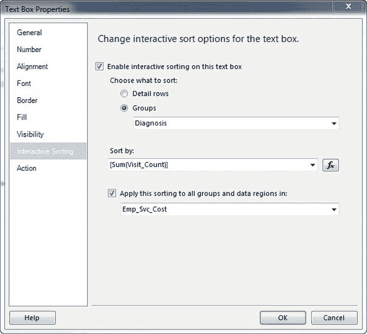

**图 6-12.** `就诊次数`的交互式排序属性

当您查看应用了新的交互式排序表达式的报表时，您会看到在“患者数量”和“就诊次数”标题字段中自动添加了一个可选择的排序图标，如图 6-13 所示。当用户在浏览器中单击此图标时，报表将自动重新排序，以显示每个诊断的最大或最小患者数量，或者每个诊断的最大或最小就诊次数。图 6-13 显示了就诊次数最多的诊断，即 `Physical Therapy NEC`，有 `1,579` 次就诊和 `76` 名患有此疾病的独特患者。用户也可以选择按患者数量的升序或降序对报告进行排序。

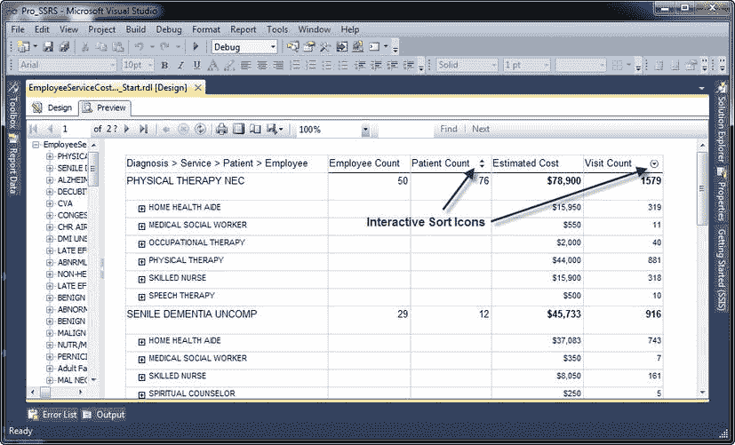

**图 6-13.** 交互式排序以显示患者数量的报表

交互式排序是文本框报表项的一个属性，通常用于表格或矩阵数据区域中的列标题。只要它们在相同的作用域或分组内，单个文本框可以控制一个或多个数据区域的排序。例如，可以对嵌套在列表数据区域内的多个表格进行排序。

`Pro_SSRS` 项目中的 `EmployeeServiceCost_InteractiveSort.rdl` 报表包含交互式排序功能。

#### 超链接操作

能够将一个报表项（例如文本框的内容）链接到另一个报表或 URL，为 SSRS 增加了另一个有价值的交互级别。通过向 SSRS 报表添加超链接，用户可以像使用应用程序或网页一样使用报表，从而使他们的任务更高效。接下来的部分将展示如何向报表添加多个链接或操作，以帮助用户链接到其他报表和位置，例如公司内网站点。您可以将三种基本操作与报表中的值相关联：

> *   跳转到书签
> *   跳转到 URL
> *   跳转到报表

您可以在支持这些操作的报表项（例如文本框、图表和图像）的“操作”选项卡上找到它们。

为了演示这些超链接操作，我们将使用一个比您迄今为止设计的报表更适合超链接操作的报表，该报表已在向下钻取功能中包含一个交互级别。下一个报表 `Employee Listing` 将提供一个简单的员工列表，根据他们的临床专业进行分组。代码下载中提供了两个版本的 `Employee Listing` 报表。一个仅包含已创建的数据集，以便您可以按照以下步骤创建报表，名为 `EmployeeListing_Start.rdl`。另一个是完整版本，名为 `EmployeeListing.rdl`。

您将向报表添加三个交互式超链接操作，以提供以下功能：

> *书签：* 选择员工姓名时，报表将跳转到报表内包含有关该员工更多详细信息（例如他们看过的患者数量）的已加书签位置。
> 
> *URL：* 您还将根据员工的学科或临床专业，设置指向其部门网站的链接。您还将使用一个报表参数，该参数专门用于选择员工的分支机构位置。当用户从报表参数提供的下拉列表中选择分支机构位置时，他们将被带到自己部门的内网站点。此功能仅用于示例说明，实际上不会将您带到内网站点；也就是说，除非您为分支机构和包含各学科的子文件夹设置了内网站点。
> 
> *报表：* 您将添加一个指向您的 `Employee Service Cost` 报表的链接，该链接将传递一个 `EmployeelD` 参数以限制链接报表的结果。您将在 `Employee Service Cost` 报表中使用相同的技术，通过富文本框格式链接到患者调查表单。

完成的 `Employee Listing` 报表将包含两个表格数据区域：一个用于摘要信息，另一个用于有关员工就诊的详细信息。您将把超链接操作添加到报表的摘要部分，这是用户首先看到的第一页。清单 6-1 显示了用于获取员工信息的数据集查询。对于此报表，您将员工限制为已知集合（如 `WHERE` 子句所示），以保持报表较小。您还将添加一个日期范围及两个参数 `@DateFrom` 和 `@DateTo`，稍后您将创建并使用它们。`EmployeeListing_Start.rdl` 报表包含默认日期范围值，从 `2007 年 1 月 1 日` 到使用 `Today()` 函数计算的当前日期。此查询及示例变量设置可在“查询”文件夹下名为 `EmployeeListingQuery.sql` 的脚本中找到。

**清单 6-1.** 员工列表查询


```sql
SELECT
        RTRIM(E.EmployeeID) AS EmployeeID
        , E.LastName
        , E.FirstName
        , E.EmployeeTblID AS EmpTblID
        , E.EmploymentTypeID AS EmploymentType
        , E.HireDate
        , D.Dscr AS Discipline
        , P.LastName AS patlastname
        , P.FirstName AS patfirstname
        , T.ChargeServiceStartDate
        , D.DisciplineID
        , P.PatID
FROM
        Trx AS T
        JOIN ChargeInfo AS CI ON T.ChargeInfoID = CI.ChargeInfoID
        JOIN Employee AS E ON E.EmployeeTblID = CI.EmployeeTblID
        JOIN Discipline AS D ON E.DisciplineTblID = D.DisciplineTblID
        JOIN Patient AS P ON T.PatID = P.PatID
WHERE
        (T.ChargeServiceStartDate BETWEEN @DateFrom AND @DateTo)
```

## 首先，打开 EmployeeListing_Start.rdl 报表

创建如图 `图 6-14` 所示的初始基本报表的步骤很直接，只需要几个提示。首先，你将再次使用表格数据区域，因此只需将表格拖到设计图面的报表区域。当你添加表格时，BIDS 会自动生成三列。为表格再添加一列。

接下来，将以下字段添加到详细列中：`EmployeeID`、`LastName`、`HireDate` 和 `Discipline`。员工的 `Discipline` 字段指的是员工的临床专业，例如家庭健康助理或专业护士。现在有了一个开始，让我们编辑 `Lastname` 字段，使用 `LastName` 和 `FirstName` 列，以逗号分隔（例如：LastName, FirstName），将其转换为一个连接的员工姓名值。

右键单击详细行中的 `Lastname` 文本框，选择 `表达式`。由于名字和姓氏字段已用空格填充，你需要使用 `RTRIM()` 函数删除多余的空格。姓氏文本框的表达式应如下所示：

```vb
=RTRIM(Fields!LastName.Value) & ", " & RTRIM(Fields!FirstName.Value)
```

现在你已经将 `LastName` 和 `FirstName` 合并为一个，将标题从“Last Name”更改为“Employee Name”。将表格的整个标题行设为**粗体**。最后，让我们将 Employee 列改得更像超链接一些。选择 `EmployeeID` 详细字段，然后将文本设置为带下划线，字体颜色设置为蓝色。

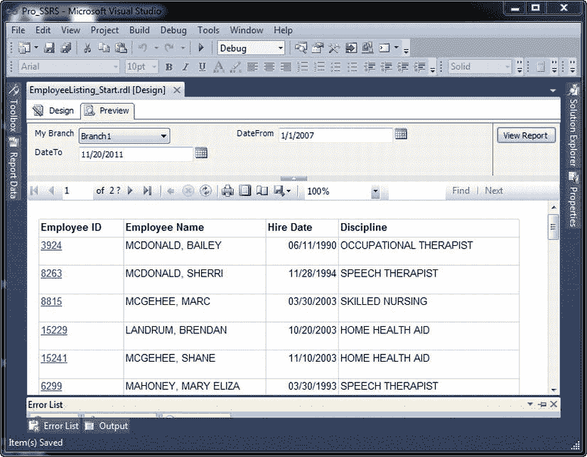

`图 6-14.` 带有超链接操作的员工列表报表

此外，在使用日期时，默认格式包含日期和时间值，即使日期没有关联时间。例如，雇用日期可能显示为：`10/20/2003 12:00:00 AM`。通过右键单击 `Hire Date` 单元格并选择文本框属性，你可以将格式从默认值更改为更标准的格式。在“数字”选项卡下将格式更改为 `MM/DD/YYYY` 格式，例如 `10/20/2011`，不包括任何时间值。此日期的格式代码为 `d`，或者你可以输入 `MM/dd/yyyy`。

接下来，因为你返回的是详细记录，每个员工有多条记录，所以你需要使用员工姓名字段的值对详细行本身进行分组。你可以通过右键单击“行分组”区域中的详细行分组并选择 `分组属性` 来实现这一点。在 `分组依据` 表达式字段中，添加与前面代码行中所示相同的、经过修剪的员工姓名。现在，当你预览报表时，你就有了员工列表，可以为其添加超链接操作。

最后，在此表格后强制分页，以便你可以添加一个将用作书签链接的详细表格。要向报表添加分页符，只需选择表格，然后右键单击某一列以打开表格属性，如图 `图 6-15` 所示。在“常规”选项卡上，选择 `在之后添加分页符`。

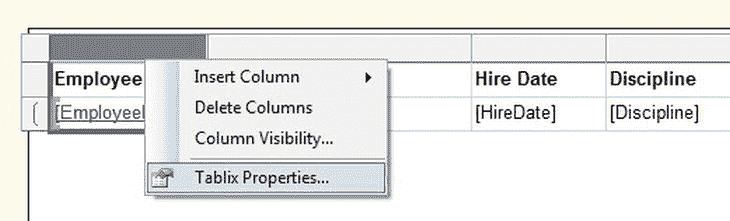

`图 6-15.` 表格属性

##### 添加书签链接

在本节中，你将为员工列表报表中的员工姓名字段添加一个书签链接，当点击时，将跳转到报表中的定义位置。在这种情况下，你不会向报表添加另一个表格数据区域来包含员工访问的详细信息。当用户查找特定信息时，书签可以减轻大型报表的导航负担。如前所述，汇总和详细信息可以存在于同一个报表中；在添加书签的情况下，你并不是隐藏数据，而只是将其移动到同一报表内的另一个位置。然而，对用户来说，最终效果是相同的，因为他们可以控制何时看到详细信息。

要向员工列表报表添加书签，首先按照将新表格元素拖到“设计”选项卡的过程操作。接下来，将 `patLastName` 拖到表格的第一列。右键单击它并选择 `表达式`。编写一个类似于之前为员工姓名列所做的表达式，但使用 `patLastName` 和 `patFirstName` 列。将标题重命名为“Patient Name”。

现在，对于此表格，你将需要按员工姓名进行分组，因此右键单击你的详细行并选择 `添加组`，然后选择 `父组`。你将使用相同的修剪表达式作为组值表达式，如下所示：

```vb
=RTRIM(Fields!LastName.Value) & ", " & RTRIM(Fields!FirstName.Value)
```

将组名更改为 `Employee_Name`。然后，在“分页符”选项卡上，选择启用 `在每个组实例之间` 分页的选项。这将强制每个员工的详细行从新的一页开始。接下来，将代表服务执行时间的日期字段 `=Fields!ChargeServiceStartDate.Value` 添加到第三列，并使用 `MM/dd/yyyy` 样式格式化日期，就像之前做的那样。

现在当你预览报表时，汇总的员工列表将出现在第一页，而显示员工访问的详细记录将出现在每一页后续页面上。

接下来，你将为第二个表格的详细行中的 `Employee_Name` 字段添加一个 `Bookmark` 属性值。在 SSRS 2012 中，你需要使用属性窗口将书签添加到字段。在属性窗口可见的情况下，单击详细行中的员工姓名字段，如图 `图 6-16` 所示。在属性窗口中，将你的修剪后的员工姓名表达式输入到书签值框中。这将作为你即将创建的书签链接的指针记录。

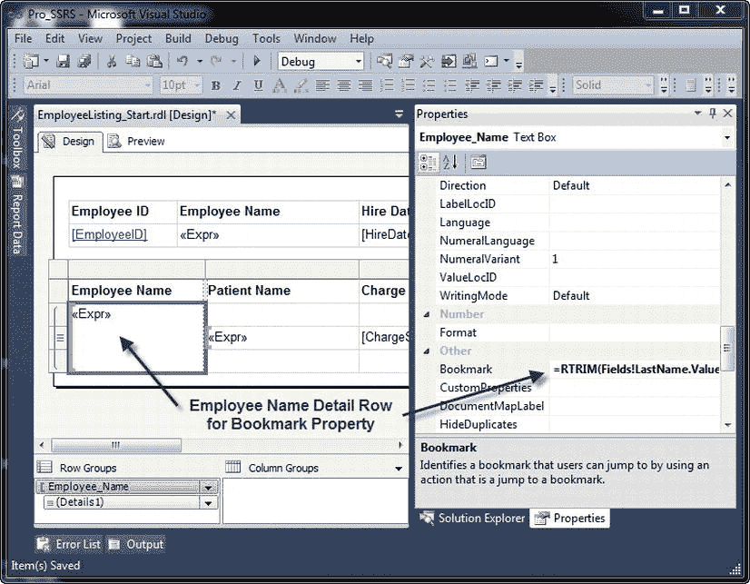

`图 6-16.` 设置书签属性值

创建书签链接：在第一个表格中，右键单击员工姓名详细行并选择 `文本框属性`，然后单击 `操作` 选项卡。在选项卡的“更改超链接选项”部分，选择 `转到书签` 并粘贴你用于 `Bookmark` 属性的修剪后的员工姓名表达式。

 **提示** 超链接操作不会自动更改字段的格式以指示关联的超链接。你可以手动更改颜色并添加下划线格式，以便用户知道点击链接。

当你预览报表并点击新的书签链接时，你会看到所选员工的详细信息，如图 `图 6-17` 所示。你应该会看到员工 Bailey McDonald 的详细信息；报表的前三页是员工列表表格，你在那里点击了 `Employee_Name` 字段中的书签链接。

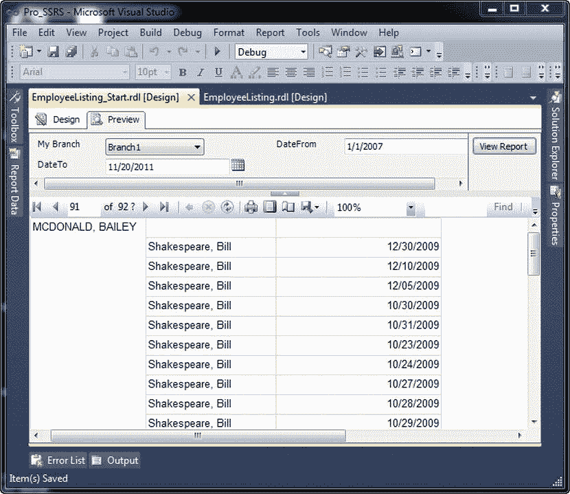

`图 6-17.` 通过书签链接调用的员工访问详细报表


##### 添加 URL 链接

URL 链接将报表连接到存储在其他位置（如 Microsoft SharePoint 站点或互联网）的信息。与书签链接类似，URL 链接在“操作”选项卡上定义，并可应用于多个报表项。正如第 4 章中所讨论的，在 SSRS 中使用的几乎每个值字段中，内容都由表达式定义。对于 URL，你将构建一个表达式来定义 HTTP 位置，该表达式结合了字面 URL 和数据集中的字段值。

例如，假设你的内联网站点有一个专门为每个员工专业设计的主页。家庭健康助理员工的`DisciplineID`可能为`HHA`，而你为家庭健康助理设计的网站位于[`http://webserver1/hha`](http://webserver1/hha)。假设每个专业的情况都相同，那么为报表中的每个专业添加 URL 链接将非常容易。

就像你为`Employee_Name`创建书签链接一样，打开`Discipline`字段的“操作”选项卡。选择“转到 URL”，并添加以下表达式：

```
="http://webserver1/" & Fields!DisciplineID.Value
```

当在报表中选择`DisciplineID`字段时，浏览器将打开并连接到该特定员工专业对应的站点——例如，家庭健康助理站点为`HHA`，熟练护理站点为`RN`。

##### 使用报表参数构建 URL 链接

将这个概念再推进一步，如果你在不同的地点或分支有多个 Web 服务器，你不会希望在 URL 字符串中硬编码 Web 服务器名称。使用报表参数根据分支位置选择服务器名称，将可以控制你在前一个示例中创建的 URL 字符串的 Web 服务器部分。让我们逐步完成此过程。图 6-18 展示了“报表参数属性”对话框应有的样子。

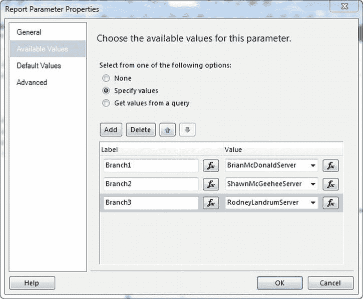

**图 6-18.** 报表参数属性对话框

请遵循以下步骤：

1.  在“设计”选项卡上，右键单击“报表数据”窗格中的“参数”文件夹，然后选择“添加参数”。
2.  为参数名称输入`Branch_URL`。
3.  为提示输入`My Branch`。
4.  在“可用值”部分，输入以下标签/值：`Branch1` = `BrianMcDonaldServer`，`Branch2` = `ShawnMcGeeheeServer`，`Branch3` = `RodneyLandrumServer`。
5.  将默认值设置为`BrianMcDonaldServer`。
6.  返回到`Discipline`字段的“操作”选项卡，应用新的表达式`="http://" & Parameters!Branch_URL.Value & "/" & Fields!DisciplineID.Value`。
7.  预览报表。注意，你现在有一个名为`My Branch`的新参数下拉列表，它根据默认值`BrianMcDonaldServer`被设置为`Branch1`。

将 URL 位置分配为参数`Branch_URL`的值后，每当从下拉列表中选择不同的分支时，将选择该分支对应的适当服务器。

##### 跳转到报表

在 SSRS 中，最有用的超链接操作或许是从当前报表中的指定位置链接到另一个报表，这称为*钻取报告*。在本节中，你将从“员工列表”报表链接到一个新的报表——“患者调查信函”报告。“患者调查信函”报表使用单个文本框，并演示了如何利用 SSRS 2008 提供的新富文本格式，通过 HTML 格式和字面文本字符串（它们都独立格式化）来形成邮件合并风格的报表。

你将通过创建从一个报表到另一个报表的超链接，将这两个报表——“员工列表”报表和“患者调查信函”报表——联系起来。你还将随超链接传递一个参数值，以便在从“员工列表”报表调用“患者调查信函”报表时缩小其结果范围。参数值将为`PatID`、`ServiceMonth`和`ServiceYear`。

要添加链接到“患者调查信函”报表的超链接操作，请返回到“操作”选项卡，这次是从“员工列表”报表中的`Patient Name`明细行文本框进入。`Patient Name`明细文本框位于第二个表格中，如图 6-19 所示。

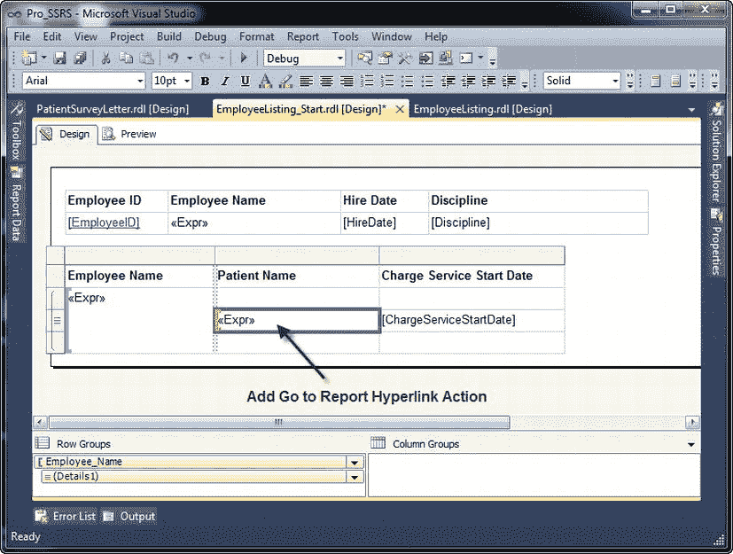

**图 6-19.** 用于添加“转到报告”超链接操作的患者姓名明细文本框

点击“转到报告”按钮后，会出现一个下拉列表，其中包含当前解决方案中所有可用的报表。如果报表已部署到报表服务器但不在当前解决方案中，你可以使用项目中定义的基于目标服务器的相对路径。在此示例中，目标服务器是[`http://localhost/reportserver`](http://localhost/reportserver)。你可以将相对路径添加到报表服务器上的任何报表。在此情况下，选择`PatientSurveyLetter.rdl`报表，然后单击“添加”按钮三次，以添加`PatID`、`ServiceMonth`和`ServiceYear`。选择报表被选中时填充的参数。稍后在“使用存储过程设置报表参数”一节中，我们将展示如何向报表添加这些参数。选择`PatID`作为参数，并将其值赋值为`=Fields!PatID.Value`，这是“员工列表”报表中一个与`PatID`参数具有对应值的字段。接下来，分别为`ServiceMonth`创建表达式`=MONTH(Fields!ChargeServiceStartDate.Value)`，为`ServiceYear`创建表达式`=YEAR(Fields!ChargeServiceStartDate.Value)`。应用新的操作后，如果在预览“员工列表”报表时点击`Patient Name`文本框，将会调用“患者调查信函”报表并传递参数，从而将该报表的数据集缩小到仅所选患者的数据。

对于“患者调查信函”报表，你将使用`Emp_Svc_Cost`存储过程的一个修改版本，该版本包含`PatID`字段的参数。这样做的原因是`Textbox`控件不支持筛选条件，而你需要将信件限制为一名患者，因为它只与一个参数关联。对于合并信件，当然可以使用多名患者。为了同时展示链接到另一个报表以及演示新的文本框格式，我们只是想展示这两者的基础知识。

