# 第 6 章：患者调查信报告与参数化存储过程

让我们来看一下患者调查信报告及其带有富文本格式的文本框。你可能还记得第 4 章，文本框现在支持占位符，这些占位符可以是简单或复杂的表达式，也可以是从表格导入的 HTML 代码。你将结合这些元素，为一位患者生成一封简单的信函。如图 6-20 所示，信件本身由一个文本框和一个表格组成。文本框在其开头包含一个名为`Template_Letter_Header`的占位符。该占位符的格式通过 HTML 获得，这些 HTML 标签存储在数据集的一个字段中。

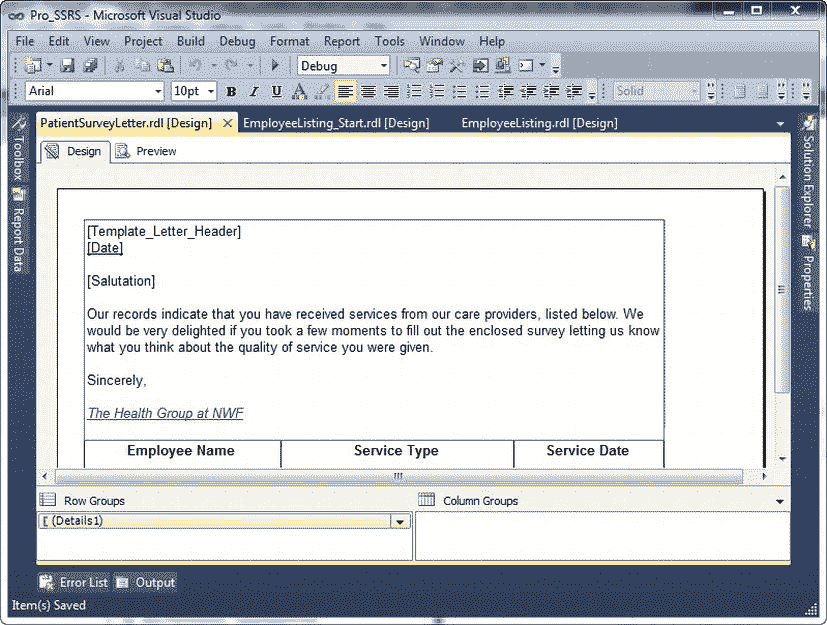

*图 6-20. 带有多个占位符的患者调查信报告*

HTML 代码来源于`Pro_SSRS`数据库中的`Format`表。你可以在图 6-21 中看到该字段的示例输出。

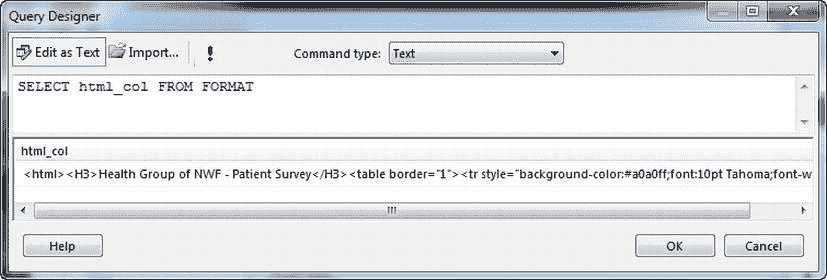

*图 6-21. 来自`Format`表的 HTML 代码输出*

要将 HTML 代码分配给文本框占位符，你只需在文本框中的任意位置右键单击，然后选择“添加占位符”。你需要标记每个占位符并为其分配一个表达式值。在这种情况下，你将为其赋值`=FIRST(Fields!html_col.Value, "DataSet1")`，因为在此示例的格式化表中只有一行数据。为了使 HTML 在文本框中正确显示所有格式，必须在“占位符属性”框中选择“HTML - 将 HTML 标记解释为样式”，如图 6-22 所示。

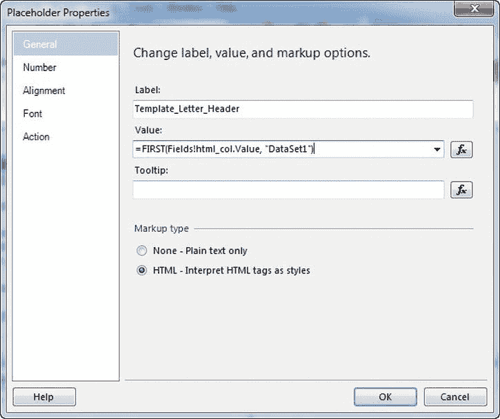

*图 6-22. 选择了 HTML 选项的占位符属性对话框*

正如你所期望的那样，文本框也可以包含与数据集中其他字段值对应的表达式。在问候语之后，你可以看到我们将患者姓名添加为另一个占位符。这个姓名包含值表达式`=FIRST(Fields!Patient_Name.Value, "DataSet2")`，它将随着我们为`PatID`字段设置的参数值而变化。

文本框的其余部分包含额外的格式，例如一些文本的粗体、斜体和字体颜色，所有这些都与包含 HTML 代码的标题占位符无关。这种格式在 SSRS 2008 之前是不可用的。随着也能导出到 Microsoft Word，富文本格式为你的业务开辟了新的报告创建途径。图 6-23 显示了渲染后的患者调查信报告。

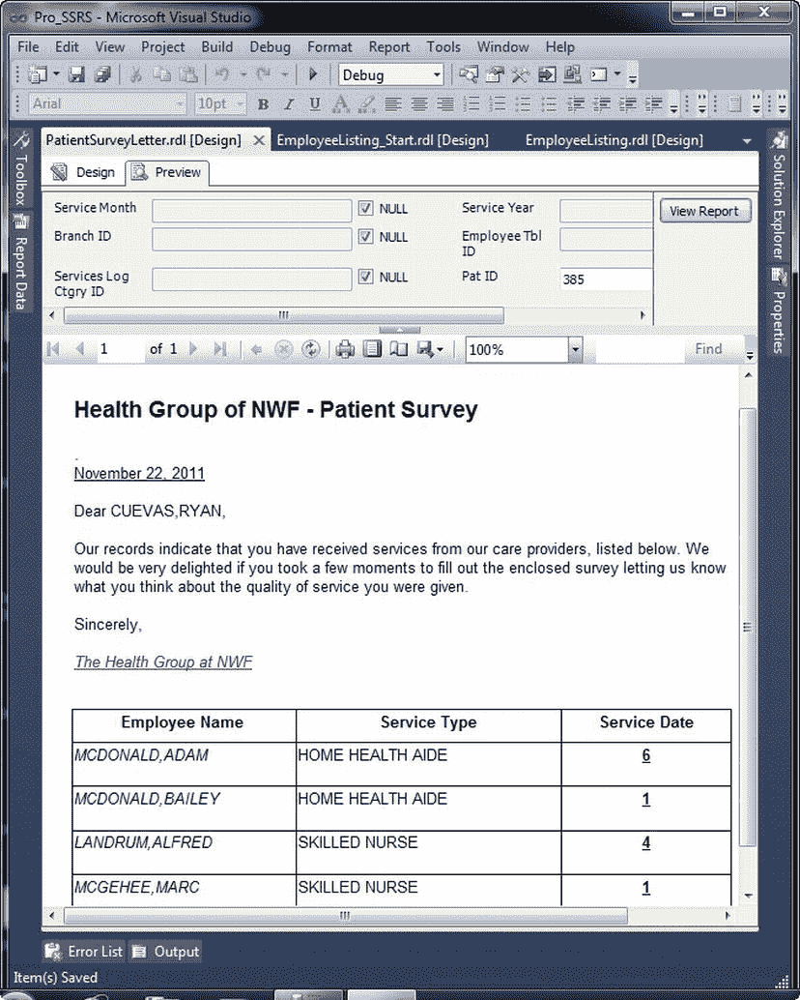

*图 6-23. 渲染后的患者调查信报告*

`Patient_Survey_Letter.rdl`报告可在`Pro_SSRS`项目中找到。

##### 添加超链接格式和工具提示

在保存添加了链接的新员工列表报告之前，让我们添加两个格式属性，以使链接更加明显，并在选择链接时提供反馈。第一个任务是简单地让`EmployeeID`字段看起来像一个超链接。选择该字段，应用下划线和蓝色格式（参见图 6-24）。

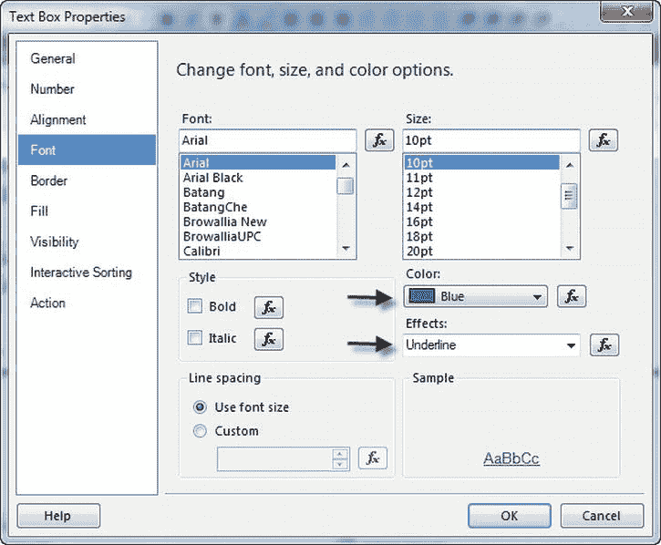

*图 6-24. 带有可见超链接的员工列表报告*

接下来，你将为同一个字段添加一个工具提示。当用户将光标悬停在字段上时，工具提示会出现，它们提供额外的信息。在这种情况下，你将使用一个简单的工具提示来显示单击`EmployeeID`框时将调用哪个报告——患者调查信报告。`ToolTip`属性位于“文本框属性”窗口的“常规”选项卡上。选择字段后，打开“属性”框，并输入**患者调查信**作为工具提示。请注意，与大多数其他值一样，工具提示可以是表达式，也可以是字面字符串。

可以为钻取报告分配多个参数选择、数据集字段、表达式和固定字面量作为输入。现在你已经链接到一个可能有多个参数的报告，让我们更深入地看看参数和筛选器如何协同工作以向报告提供数据。

### 使用存储过程设置报告参数

在第 3 章中，我们介绍了参数，并解释了如何在报告和查询中使用它们来限制从数据源返回的结果。到目前为止，你一直在使用不同类型的数据集、查询和存储过程来构建报告，但我们只触及了如何在 SSRS 中使用参数的皮毛。参数的值主要来自用户输入，并且最常与数据集相关联；它们用于限制返回的数据量。当参数以这种方式使用时，它被称为*查询参数*。作为数据集一部分的查询参数（例如 SQL 查询或存储过程）会自动在 SSRS 中生成报告参数。

在本节中，你将修改员工服务成本报告的数据集，以使用参数化存储过程而不是查询。默认情况下，从存储过程生成的报告参数没有填充供用户选择的下拉列表，因此在本节中，你还将用有效的数据填充报告参数列表，以供用户选择输入。最后，你将了解 SSRS 如何处理`NULL`参数值以及如何为参数生成`NULL`值。当你为 SSRS 报告检索数据时，这一点将变得尤为重要，我们将在本节后面解释。

你将返回到你已创建的名为`Emp_Svc_Cost`的存储过程，你可能还记得，它将提供与你一直在使用的 SQL 查询相同的数据集。该存储过程的优点是能够接受你希望在报告中使用的所有参数。SSRS 将自动从存储过程创建报告参数。让我们快速回顾一下将从存储过程传递到报告的参数：
*   `BranchID`
*   `EmployeeTbllD`
*   `ServiceMonth`
*   `ServiceYear`
*   `ServiceLogCtgrylD`

要为当前使用非参数化查询的员工服务成本报告自动创建参数，你只需将报告的数据集更改为该存储过程。

打开代码下载中包含的项目中的`EmployeeServiceCost_SP`报告。在包含数据集`Emp_Svc_Cost`的“报告数据”窗口中，你可以右键单击`Emp_Svc_Cost`数据集并选择“数据集属性”以打开“属性”窗口。在“数据集属性”对话框中，将“查询类型”从“文本”更改为“存储过程”。接下来，在“查询字符串”窗口中选择或键入存储过程`Emp_Svc_Cost`的名称，然后单击“确定”。单击“确定”后，参数将自动为你创建。接下来，再次右键单击`Emp_Svc_Cost`数据集并选择“查询”。你应该看到查询将执行`Emp_Svc_Cost`存储过程。单击“运行”按钮，这将提示你输入参数值，如图 6-25 所示。由于存储过程设计为接受`NULL`值，请在“定义查询参数”对话框中将默认输入值从“空白”更改为“`NULL`”，然后单击“确定”以完成执行。如果你不选择“`NULL`”而是“空白”，查询将失败并显示错误消息“无法将参数值从字符串转换为`Int32`”。

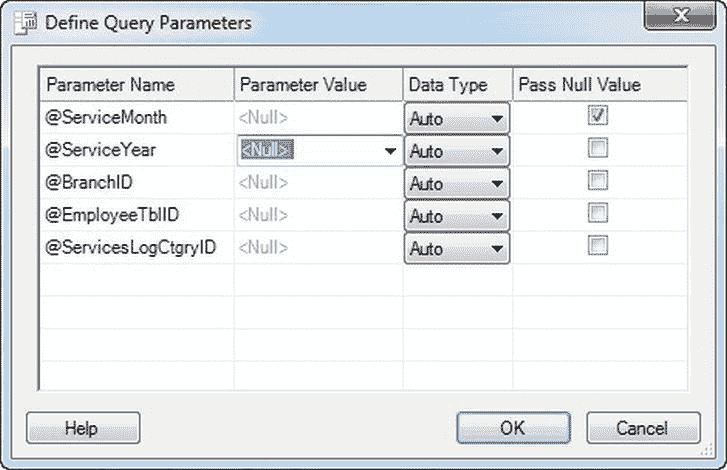

*图 6-25. 存储过程`Emp_Svc_Cost`所需的参数*

## 发现参数未设置为允许 NULL 值

在“报表数据”窗口中，可以看到报表参数是从存储过程自动创建的。虽然 SSRS 确实正确地为每个参数分配了数据类型（整数和字符串），但它并未自动将字段设置为允许 NULL 值（见图 6-26）。出于本报表的目的（期望 NULL 值作为可能的参数），为每个参数选中“允许 NULL 值”复选框至关重要。这样，当预览报表时，NULL 将是默认值，并且 NULL 复选框将自动选中，从而无需用户输入即可执行报表。请右键单击每个参数并选择“属性”，将所有参数更新为“允许 NULL 值”。然后在“常规”选项卡下勾选“允许 NULL 值”选项。

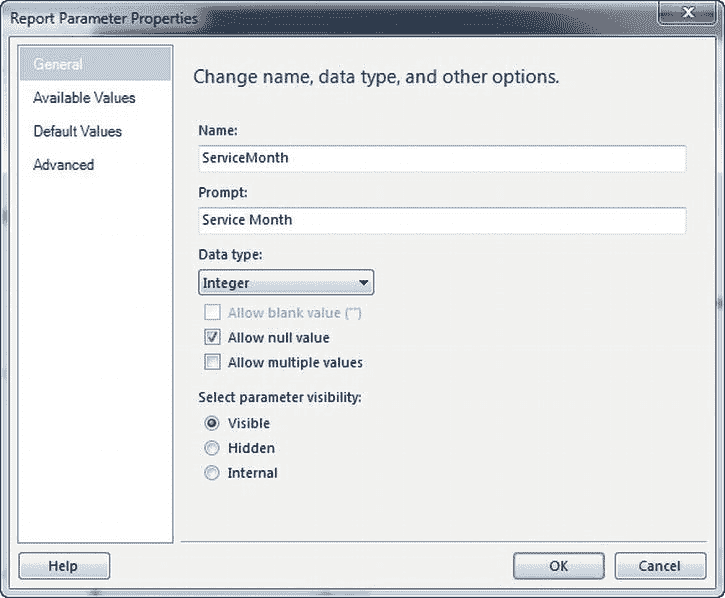

图 6-26. 报表属性对话框，显示了“允许 NULL 值”字段

## 配置默认参数值

默认参数值也需要手动配置。如果未为可用参数分配默认参数值，则报表在呈现或预览时，将不会处理传入数据，直到用户提供值。预览报表而不修改参数选择，会发现用户需要为每个未分配默认值的参数输入值。用户将无法从值列表中选择，而必须手动输入。这通常是不可接受的，因为用户可能并不总是知道要输入的正确值；用于选择特定员工的`EmployeeTblID`字段和用于检索部门名称的`BranchID`字段就是很好的例子。

第一步是为参数下拉列表提供有效的查询分配值。在从新数据集添加描述性参数值之前，先预览报表视图会很有帮助（见图 6-27）。请注意，参数选择旁边有一个选中的 NULL 复选框。当参数允许 NULL 值（如您之前设置的）并且没有其他可用值时，就会出现 NULL 复选框。

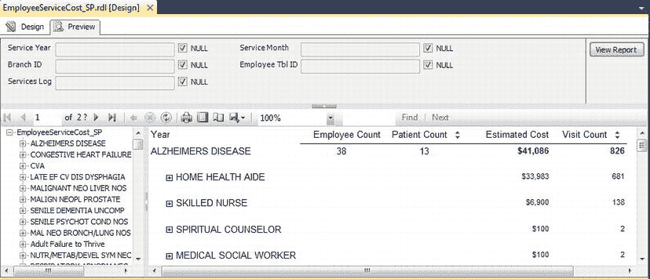

图 6-27. 下拉列表中无可用参数值

## 创建数据集以填充参数下拉列表

可以使用以下脚本添加两个数据集，以填充“部门”和“员工”参数的下拉列表：

1.  在“报表数据”窗口中，右键单击“数据集”文件夹并选择“新建数据集”，在报表中嵌入两个新数据集`Employee_DS`和`Branch_DS`。对于您创建的两个数据集，您将添加简单的查询，这些查询将返回员工和部门的 ID（用于“值”属性）和名称（用于“标签”属性）。注意下面的员工查询的`WHERE`子句，为了简单起见，您只包含了一组已知的员工。在真实场景中，业务规则决定了过滤器，但您可能不会以这种方式硬编码值。我们只是展示了一种可以硬编码过滤器以返回用于参数下拉列表的子数据集的方法。

    ```
    --Query for Employee Parameter
    SELECT
            EmployeeTblID
            , RTRIM(RTRIM(E.LastName)  +  ', '  + RTRIM(E.FirstName)) as Employee_Name
    FROM
            Employee E
    WHERE
            (E.EmployeeTblID IN (32, 15, 34, 44, 129, 146, 159, 155, 26))
    --Query for Branch Parameter
    SELECT
            BranchID, BranchName
    FROM
            Branch
    UNION
    SELECT     NULL AS BranchID, NULL AS BranchName
    ```

2.  使用上述查询创建数据集并通过“报表数据”窗口中的“查询”验证其正确执行后，展开“参数”文件夹。右键单击`BranchID`参数，选择“参数属性”，并为清晰起见，在提示中输入**部门**。您将在下拉列表中选择部门名称。
3.  在部门参数的“可用值”中，选择“从查询中获取值”，然后选择`Branch_DS`数据集。“值”字段将是`BranchID`，“标签”字段将是`BranchName`。
4.  按照相同的步骤修改员工参数，分配`Employee_DS`并分别选择“值”和“标签”字段为`EmployeeTblID`和`Employee_Name`。最后，如步骤 2 所示，为清晰起见将提示更改为**员工**。完成后，选择“确定”。
5.  最后，在“设计”选项卡上，您将为报表中的表格添加一个按“部门名称”的分组，以便在选择参数时，可以看到报表是针对特定部门的。为此，右键单击表格中“诊断”文本框左侧的行标题，然后选择“添加组” >> “父组”。这将使“诊断”组（原为第一组）现为第二组，并将添加一个新组。将表达式值`=Fields!BranchName.Value`分配给新组，选择“添加组头”选项，并在“分组”对话框中单击“确定”。接下来，将`BranchName`字段从您刚创建的“部门”组的新第一列行中移动到“诊断”正上方的空白区域。此外，将该字段设为粗体，并将字体大小调整为 12 磅。现在格式已设定，删除添加新`BranchName`组时创建的列。您可以通过右键单击它并选择“删除列”来删除该列。

## 结果

现在报表的可用参数值将具有填充的下拉列表，如图 6-28 所示。请注意，对于您已添加可用值的两个参数，NULL 复选框已消失。

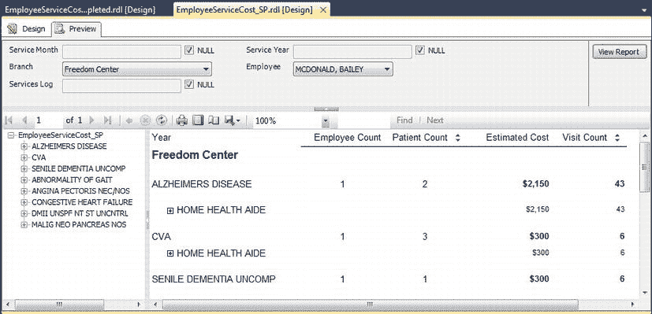

图 6-28 具有已填充参数选择的报表


您可以对 `ServiceLogCtgryID` 参数执行相同的步骤，从表值中提供一个有效的下拉列表。然而，由于您可能还会在一个同样接受参数值的自定义报表查看器中查看报表，这个特定的参数值目前对于直接用户输入来说用处不大。既然如此，利用另一个新的、非常需要的功能——隐藏参数的能力——将会很有帮助。此功能在 SQL Server 2000 的 SSRS Service Pack 2 中添加，并在之后的所有版本中均可用。有时，参数可以并且应该由用户输入之外的事件来填充。在这些情况下，用户看到这些额外的参数只会感到困惑。在“报表参数”对话框中，选择 `ServicesLogCtgryID` 属性，并勾选“隐藏”复选框。

## 修改基于时间的参数

修改此报表的基于时间的参数（`Service Year` 和 `Service Month`）也将是有益的。基于时间的值通常处理起来很棘手，因为 `DateTime` 数据类型有特殊的格式需求，它可以存储年、月、日以及时、分、秒。为 `Service Year` 和 `Service Month` 参数设置有效值的步骤与前面介绍的 `Branch` 和 `Employee` 过程几乎相同，不同之处在于 `Service Year` 需要默认为当前年份，而不是 `NULL`。

第一步是基于服务日期（即存储过程中的 `ChargeServiceStartDate` 字段）为 `Service Year` 和 `Service Month` 参数创建一个数据集。您将在两个查询中使用 `DatePart` 和 `DateName` 函数来派生有效值。日期的有效值取决于它们在表中的存在，因此，例如，如果您的数据包含 2009 年和 2010 年的值，则下拉列表中只会显示这两年。以这种方式填充日期值可以避免用户必须输入日期，也防止报表设计者必须在报表中硬编码年份和月份值。这些 `Year` 和 `Month` 数据集已经添加到报表中。但是，我们需要像之前那样，将参数的“可用值”设置为“从查询中获取值”。对于 `ServiceMonth`，使用 `Month` 数据集，并将 `ServiceYear` 设置为使用 `Year` 数据集。

清单 6-2 显示了驱动参数值的两个查询。

**清单 6-2.** 参数值查询

```sql
--Query to Derive Year
SELECT
        DISTINCT DATEPART(yy, ChargeServiceStartDate) AS Year
FROM
        Trx
UNION
SELECT Null AS Year ORDER BY Year
```

```sql
--Query to Derive Month
SELECT
        DISTINCT DATEPART(mm, ChargeServiceStartDate) AS DateNum
        , DATENAME(mm, ChargeServiceStartDate) AS Month
FROM
        trx
UNION
SELECT Null AS DateNum, Null AS Month ORDER BY DATEPART(mm, ChargeServiceStartDate)
```

## 完成报表和参数

要完成报表，请右键单击 `BranchName` 字段，选择“插入行”，然后选择“组内 - 下方”，将 `Service Year` 字段添加到报表中。通过将光标放在 `BranchName` 下方创建的空白区域的右上角并单击字段列表框，从字段选择器列表中选择 `Year` 字段。将聚合方式从默认的 `SUM` 更改为 `FIRST`。接下来，使用独特的颜色（本例中为深鲑鱼色）进行格式化，将对齐方式设置为左对齐，然后将字段大小调整为 12 磅。然后，将所有参数（`Service Year` 除外）的默认值设置为 `(NULL)`。为此，请使用“报表参数属性”下的“默认值”选项卡。然后选择“指定值”并单击“添加”按钮。

在预览报表之前，重要的是设置年份的默认值，这样有效的 `Service Month` 选择就不会基于默认的 `Service Year` 字段 `NULL`。这可能会产生意想不到的结果；换句话说，用户可能选择一月并认为它指的是当前年份的一月，但实际上它可能是一月份的所有记录。

要使 `Service Year` 参数默认为当前年份，请转到“参数”对话框，并将“默认值”选项设置为以下表达式：

`=CINT(DATEPART("yyyy", Now()))`

此外，在此报表中，我们希望在 `Service Month` 之前显示 `Service Year` 参数，因此让我们将 `ServiceYear` 参数移动到 `ServiceMonth` 参数之上。像这样重新组织参数也会改变它们在运行时的顺序。打开“报表数据”窗格并展开“参数”文件夹。选择 `ServiceYear` 参数，然后单击“报表数据”窗格菜单中的向上箭头。您可以预览报表并提供参数值（参见图 6-29）。

 **注意** `Pro_SSRS` 数据库中的大多数数据来自 2009 年和 2010 年。如果当前年份默认为其他年份，您看到的数据可能与图 6-29 中的不同。

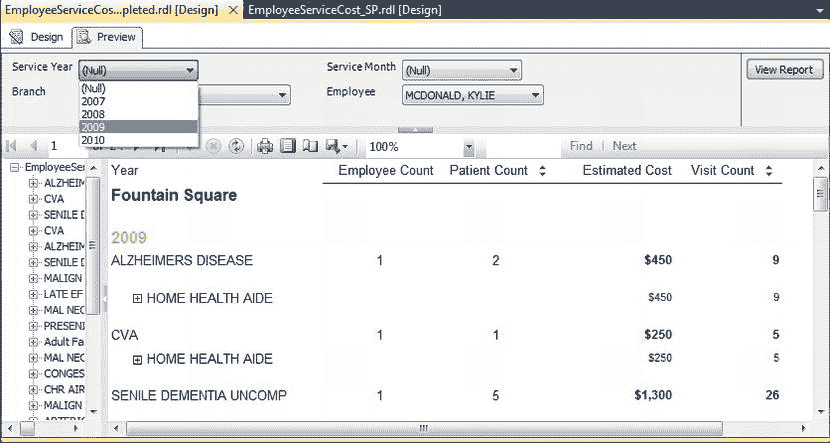

**图 6-29.** 包含有效年份和月份值的报表

`Pro_SSRS` 项目中的 `EmployeeServiceCost_SP_Completed.rdl` 报表包含了已填充的参数。


### 处理多值参数

多值参数是针对 SQL Server 2005 发布的一项增强功能，它可能是 SSRS 更新中最备受期待的功能之一。能够独立选择多个值来填充报表，这是一个强大的功能，大多数其他报表应用程序都视其为理所当然，但在 SQL Server 2000 的 SSRS 中却不可用。然而，要充分利用多值参数，需要特殊的设计考量，正如第 3 章所述。其原因在于，特别是在使用存储过程时，多值参数会以字符串值的形式传回存储过程。要有效地使用多值参数，唯一的方法是了解查询或存储过程将根据用户的选择来评估返回给它的全部、一个或多个值。由于 SQL Server 评估存储过程中字符串的方式与评估单个值的方式不同（老实说，这多年来一直是 SQL 开发人员的长期困扰），你必须在使用多值参数时就明白，如果你想将存储过程和多值参数与 SSRS 一起使用，可能必须解析字符串值。对于我们这类作家/逻辑学家来说，这是一个有趣的游戏。对于其他人来说，他们需要为大量受众开发带有多个输入参数的报表，这可能是一场噩梦。请放心，一旦你掌握了字符串操作技术，多值参数将是一项值得投入时间的功能。

SSRS 确实开箱即用地支持查询的多值参数，只要它们不是存储过程即可。要与查询一起使用多值参数，只需在将用作报表中数据集的查询的 `WHERE` 子句中使用 `IN` 关键字。在这种情况下，SSRS 会在运行时根据你在报表中的选择为你重写查询。这是一个直接且文档齐全的过程。然而，出于前述原因，我们喜欢使用存储过程，因此我们必须做出特别的调整，你将会看到这一点。

为了准确演示如何将存储过程与多值参数（此后我们将亲切地称之为 MVPs）一起使用，我们以 Employee Service Cost 报表的一个副本为例，并假设你将重新设计它以接受 `Year` 和 `Month` 参数作为多值。首先，你必须修改你的基础存储过程。以前，使用清单 6-3 中的逻辑来评估你的 `Year` 和 `Month` 参数表达式是没问题的。

**清单 6-3.** 无 MVPs 时评估 `Year` 和 `Month` 参数的逻辑

```
1=Case
    When (@ServiceYear IS NULL) then 1
    When (@ServiceYear IS NOT NULL) AND @ServiceYear =
        Cast(DatePart(YYYY, ChargeServiceStartDate) as int) then 1
    else 0
End
AND
1=Case
    When (@ServiceMonth is NULL) then 1
    When (@ServiceMonth is NOT NULL) AND @ServiceMonth =
        Cast(DatePart(MM, ChargeServiceStartDate) as int) then 1
    else 0
END
```

然而，现在你将使用 MVPs，`NULL` 值是不可接受的。在你的逻辑中，`NULL` 值的含义是选择所有值。这妨碍了你接受多个值。例如，如果你有 2007、2008、2009 和 2010 作为有效值，你可以通过选择 `NULL` 来选择所有值，或者只选择一个值来筛选数据。你无法同时选择 2008 *和* 2009。使用多值参数，你就可以做到。有效使用 MVPs 的唯一途径是通过为报表提供数据的查询或存储过程的 `WHERE` 子句，并配合参数使用。你必须利用 T-SQL 的 `IN` 子句来充分利用 MVPs。不幸的是，事情并不像将存储过程修改为 `Where value IN (@MyParameter)` 那么简单，因为在使用存储过程参数时，SQL 不会将 `IN` 子句作为字符串来评估。我们可以通过以下例子最好地解释这一点，你可以在本书源代码的 `Pro_SSRS` 项目中打开 `EmployeeServiceCost_MVP.rdl` 报表来查看。

假设你将 `Year` 和 `Month` 报表参数设为多值参数。你可以很简单地做到这一点：在报表参数属性窗口中勾选 `允许多个值` 复选框，如图 6-30 所示。另请注意，`允许 Null 值` 复选框未被勾选。如果你想让 MVPs 正常工作，`允许 Null 值` 选项就不能被勾选。

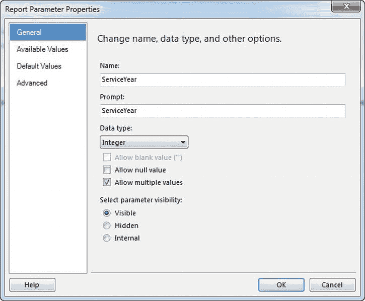

**图 6-30.** MVP 选项

如果你现在执行报表，你会看到，就像在前面的例子中使用数据集填充可用值一样，你能够为年和月选项选择一个、多个或所有值，如图 6-31 所示。

由于 MVP 的值将以字符串形式返回——以年为例，如 `"2007,2008"`——这与你定义的存储过程逻辑无法配合工作。你需要修改存储过程以使用 `IN` 子句，使该值等价于以下表达式：

```
WHERE 1 = CASE WHEN CAST(DATEPART(YYYY, ChargeServiceStartDate) AS VARCHAR((20)) IN (@Year)
END
```

这里的问题是变量 `@Year` 将被作为字符串评估，而不是像在存储过程中定义的那样作为整数。如果你只选择一个值——例如 2007——这是可以的，因为 SQL 会正确地评估 `IN` 子句中的单个值。但是，当选择多个值或“全选”时，SSRS 会传递一个诸如 `"2007,2008,2009,2010"` 的字符串。当在存储过程中进行评估时，查询将失败。你需要首先将 `Year` 和 `Month` 的数据类型更�为字符或字符串值。因此，你将为存储过程选择 `varchar(20)`，并在值传入时解析它们。使用 `varchar(20)` 将允许你选择足够宽的范围来覆盖 `Year` 和 `Month` 的值字符串。

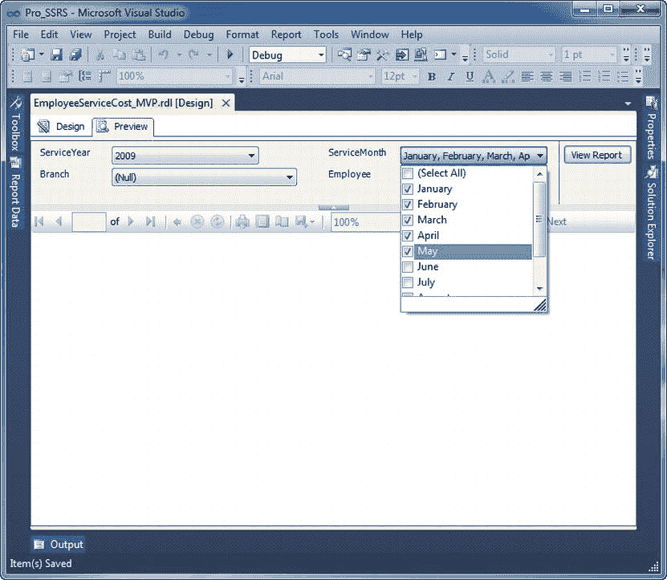

**图 6-31.** 多参数选择


此外，你还需要决定从报表返回字符串后的最佳解析方式，这同时关乎性能和通用性。有两种有效的方法可以实现这一点：动态 SQL 或用户定义函数（UDF）。创建动态 SQL（本质上是利用用户输入定义的变量来构建可变的 SQL 表达式）过程繁琐且语法复杂。将 SQL 语句包裹在引号中并以编程方式拼接变量既耗时又常常令人沮丧，并且会产生不可预测的结果。更糟糕的是，这会为 **SQL 注入攻击** 洞开大门，攻击者可以插入可能执行非开发者本意的语句的字符串值。对于 MVP 场景，处理字符串值的最佳方式是通过一个 UDF 来解析各个值，并将它们传入查询的 IN 子句。既然已知值总是以逗号分隔的字符串形式返回，那么使用为此目的设计的函数将这些值加载到一个可访问的表中就会容易得多。这种函数被称为 **表值函数**，因为输入字符串的解析行会被加载到一个表中，该表随后可以在调用存储过程中作为子查询被引用。让我们看一下你在使用 MVP 时将在存储过程中使用的解析函数。清单 6-4 定义了名为 `fn_MVParam` 的 UDF。这个函数位于你一直在使用的 `Pro_SSRS` 数据库中。

**清单 6-4.** `fn_MVParam`，字符串解析函数
```sql
CREATE FUNCTION dbo.fn_MVParam(@RepParam nvarchar(4000), @Delim char(1)= ',')
RETURNS @Values TABLE (Param nvarchar(4000))
AS
    BEGIN
    DECLARE @chrind INT
    DECLARE @Piece nvarchar(4000)
    SELECT @chrind = 1
    WHILE @chrind > 0
        BEGIN
            SELECT @chrind = CHARINDEX(@Delim,@RepParam)
            IF @chrind  > 0
                SELECT @Piece = LEFT(@RepParam,@chrind - 1)
            ELSE
                SELECT @Piece = @RepParam
            INSERT  @Values(Param) VALUES(@Piece)
            SELECT @RepParam = RIGHT(@RepParam,LEN(@RepParam) - @chrind)
            IF LEN(@RepParam) = 0 BREAK
    END
    RETURN
END
```

当从你的 `Emp_Svc_Cost_MVP` 存储过程中调用此函数时，它将返回从 SSRS 多值参数选择中解析出的值，并允许你将其用作筛选报告数据的标准。这个函数的关键在于它本身使用了几个 T-SQL 函数，例如 `CHARINDEX`、`LEN` 和 `LEFT`，来用报告参数字符串中的各个项填充 `@Values` 表。清单 6-5 所示的对基础 `Emp_Svc_Cost` 存储过程的修改，是使 `Emp_Svc_Cost_MVP` 存储过程能有效处理 MVP 所必需的。

**清单 6-5.** 针对 MVP 修改 `WHERE` 子句
```sql
1 = CASE WHEN CAST(DATEPART(YYYY, ChargeServiceStartDate) AS VARCHAR(20)) IN
        (SELECT [PARAM] FROM fn_MVParam(@ServiceYear, ',')) THEN 1
    ELSE 0
    END
AND
1 = CASE WHEN CAST(DATEPART(MM, ChargeServiceStartDate) AS VARCHAR(20)) IN
        (SELECT [PARAM] FROM fn_MVParam(@ServiceMonth, ',' )) THEN 1
    ELSE 0
    END
```

请注意，这里没有使用类似 `IN (@Year)` 这种无效的写法，而是调用了你的函数 `fn_MVParam`。该函数接受两个值：字符串和分隔符。在此例中，你使用逗号作为分隔符。

当报表运行并调用新函数时，你可以看到你可以从填充的下拉列表中选择一个、两个、任意组合或全部值，并且你知道你的存储过程将有效地处理解析、求值以及标准判断，以仅交付你想在报表中看到的数据，如图 6-32 所示。

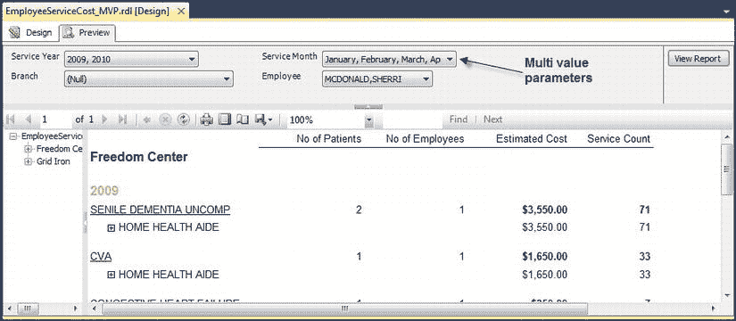

**图 6-32.** 使用多重选择条件生成的报告

`Pro_SSRS` 项目中已完成的多值参数报告名为 `EmployeeServiceCost_MVP.rdl`。

#### 应用筛选器

你可能还记得第 2 章中，你通过移除仅查看访问量的标准来提升了存储过程 `Emp_Svc_Cost` 的性能。现在，你将对报表应用一个筛选器，以替代原始的查询条件，从而仅显示访问记录。

你可以使用 **筛选器** 在查询结果返回后从报告中排除某些值。从这个意义上说，筛选器可以避免重新查询；然而，完整的数据集仍会被返回到报表。在第 2 章的示例中，你知道只会返回有限数量的多余行。当数据提供程序不支持查询参数，或者使用报告快照时，你应该使用筛选器。你同样应该在针对特定请求或解决方案、且与其他报表基于相同存储过程的报告中使用筛选器，因为你可以使用筛选器而无需修改现有的存储过程。以下是一个应用于报表表格数据区域的简单筛选器表达式，它将排除所有非访问记录的行：

`=Fields!ServiceTypeID.Value = "V"`

要添加此筛选器表达式，请在“布局”选项卡上，右键击表格的左上角部分，然后选择“Tablix 属性”。在“筛选器”选项卡中，输入前面的表达式，使其看起来如图 6-33 所示。将该筛选器添加到书籍源代码中 `Pro_SSRS` 项目所包含的 `EmployeeServiceCost_MVP.rdl` 报告中。

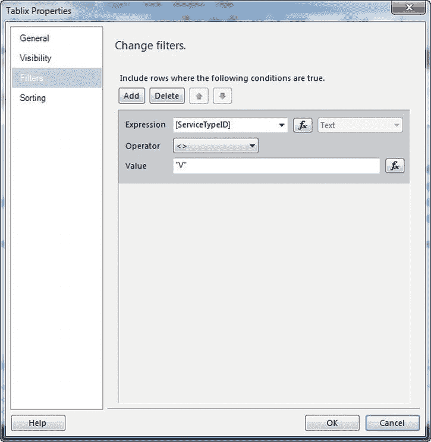

**图 6-33.** 用于排除非访问记录的筛选器对话框

在 `Pro_SSRS` 项目中，已对 Tablix 数据区域应用了筛选器的完整报告名为 `EmployeeServiceCost_MVP_Filter.rdl`。


#### 添加图表

SSRS 提供了一个样式与 Microsoft Excel 相似的**图表**数据区域。图表的作用范围可以局限于当前数据集，也可以使用其自身的数据集。在本例中，您将在报表开头添加一个堆积条形图，用于显示排名前十的诊断及其服务次数计数。这本质上将反映迄今为止报表中提供的数据。该报表现在也按“分支机构”分组，这将自动分离您已定义的“分支机构”组中的值。您需要在图表中模拟此行为。在此特定数据集中，您只有三个分支机构，因此结果应与报表的详细信息一致。请打开 `Pro_SSRS` 项目中的 `EmployeeServiceCost_MVP_Chart_Start.rdl` 报表，并按照以下步骤将图表添加到报表中：

1.  在“设计”选项卡上，单击并拖动您已定义的表格，为图表腾出空间。
2.  单击并拖动**图表**数据区域到表格上方的区域。
3.  在图表任意位置右键单击，选择“更改图表类型”，然后在“条形图”区域选择“堆积条形图”。
4.  使用为报表已定义的 `Chart_DS` 数据集；将 `DiagVisits` 拖到图表的“值”区域。
5.  将 `Diagnosis` 字段拖到图表的“类别组”区域。
6.  将 `Patient_Count` 字段拖到图表中 `DiagVisits` 系列下方的“值”区域。
7.  调整图表大小，使其与下方的表格对齐。您可以选择这两个报表元素，然后在工具栏上选择“使宽度相同”图标。
8.  在“诊断”类别组上右键单击，然后单击“筛选器”选项卡。单击“添加”按钮，为该类别组添加筛选器。由于您希望报表仅显示排名前十的诊断，因此需要为此分组添加一个筛选器。您将使用“前 N 个”运算符来实现此目的，如 `图 6-34` 所示，该筛选基于诊断访问计数总和排名前十的诊断。在“诊断”类别组属性对话框中，单击“排序”选项卡。将默认排序依据更改为表达式 `=SUM(Fields!DiagVisits.Value)`，并将排序顺序选择为“A 到 Z”。

`Image` `images/9781430238102_Fig06-34.jpg`

`图 6-34. 用于筛选前十位诊断的筛选器值`

最后，您可以预览报表。有时，报表需要在分析详细信息之前，先用一个图表来快速查看数据。浏览此报表的人可能会发现图表很有趣，例如，它显示“物理治疗 NEC”诊断在“内斯特谷”分支似乎更为普遍。这个初步预览可能值得进行更多调查，这可以从报表的详细信息中获得。

预览时，报表应如 `图 6-35` 所示。

`Image` `images/9781430238102_Fig06-35.jpg`

`图 6-35. 包含图表的员工服务成本报表`

图表数据区域有许多可以应用的属性，如 `第 5 章` 所述；然而，堆积条形图的外观对于您的报表来说已经足够，可以直接部署。不过，通过一些轻微的调整，例如删除图表标题、坐标轴标题以及选择“默认”配色方案，最终报表开始呈现出更简洁的外观和感觉。`Pro_SSRS` 项目中包含已应用于图表数据区域筛选器的完整报表名为 `EmployeeServiceCost_MVP_Chart.rdl`。

#### 添加 Tablix 元素

SSRS 2008 通过 **Tablix** 数据区域引入了报表设计方面的重大变革。本质上，Tablix（在 `第 4 章` 中有详细介绍）结合了**表格**和**矩阵**数据区域的特性。SSRS 2005 中可用的表格区域能够很好地处理基于数据集的、长度可变的行数据。相应地，矩阵数据区域包含了对可变数量列的支持。Reporting Services 2008 允许使用任一控件在报表中的任意位置包含自定义的行组或列组。正如您将在后续对员工服务成本报表的添加中看到的，向表格数据区域添加列分组非常直接。

在接下来的“配置报表和组变量”部分中，您将使用 `Year` 字段向 `EmployeeServiceCost_Tablix_Start` 报表添加一个列组。`Year` 字段（您可能还记得）指示为患者提供服务类型的年份。到目前为止，报表中包含不同的患者和员工计数，以及估计成本和服务次数。那么，如果您希望查看这些值按多年服务年份分组的情况，该怎么办呢？

您将执行以下操作，为员工服务成本报表添加一个按 `Year` 分组的列组：

1.  在表格中的 `[CountDistinct(PatID)]` 单元格上右键单击，选择“添加组”，然后在“列组”部分下选择“父级组”。
2.  在“分组依据表达式”字段中，选择 `[Year]`。不要勾选“添加组标题”或“添加组页脚”按钮。单击“确定”。
3.  由于我们希望组之间相互独立，因此现在需要添加一个称为**相邻组**的组。在我们刚刚创建的新 `[Year]` 字段上（应位于“患者数”标签的正上方）右键单击，选择“添加组”，然后选择“相邻右侧”。像步骤 2 一样，按 `[Year]` 分组。单击“确定”。此新列将保存当前存在的“员工数”列中的所有值。在步骤 5 中，我们将把所有值移动到新的 `[Year]` 列下方。
4.  再执行两次步骤 3，每次都使用最右侧的 `[Year]` 字段。
5.  现在我们有了三个仅包含列分组 `[Year]` 的列，我们需要将现有值移动到它们下方。此时，设计界面应如 `图 6-36` 所示。接下来，选择“员工数”、“估计成本”和“服务次数”列中的所有字段。务必也选择标题文本！然后将值从其原始单元格剪切并粘贴到我们在步骤 2 和 3 中创建的新相邻组下的三个空列中。
6.  右侧的三列不再需要。通过右键单击列并选择“删除列”来删除它们。您可以按住 CTRL 键选择它们。
7.  最后，调整列的宽度，留出足够的空间来显示标签，如 `图 6-37` 所示。

`Image` `images/9781430238102_Fig06-36.jpg`

`图 6-36. 移动字段之前的设计布局`

完成后，报表在“设计”选项卡上应类似于 `图 6-37`。您还可以在表格上的“行组”和“列组”区域看到分组的可视提示，您现在各有四个组。`Pro_SSRS` 项目中已应用列组的 Tablix 数据区域的完整报表名为 `EmployeeServiceCost_Tablix.rdl`。

`Image` `images/9781430238102_Fig06-37.jpg`

`图 6-37. 列分组的设计布局`

当您预览报表并选择多个年份时，如 `图 6-38` 所示（选择了 2009 年和 2010 年以及所有月份），您可以看到列分组自动水平扩展并相应地对值进行分组。例如，在选定的月份中，充血性心力衰竭在 2009 年有 75 次家庭健康助理访问，而在 2010 年只有 16 次。

`Image` `images/9781430238102_Fig06-38.jpg`

`图 6-38. 带有列分组的员工服务成本报表预览`


### 配置报告与组变量

自 SQL 2000 的初始版本以来，SSRS 就实现了全局变量。这些变量（例如 `ExecutionTime` 和 `UserID`）可在报告中使用。例如，表达式 `=Globals!ExecutionTime` 返回报告被执行的时间。与表达式 `Now()` 返回的值不同，该值在报告呈现后不会改变，因此在报告中翻页不会改变全局变量的值。

SSRS 2008 引入了两种新变量类型——报告变量和组变量——它们可以在设计时或运行时配置，并在整个报告执行和查看过程中保持静态。在本节中，你将使用一个报告变量为 `Visit_Count` 字段创建一个阈值，以便在报告运行时，你可以计算访问次数是否达到了报告变量设定的阈值。你将在新的 SSRS 仪表控件中再次使用同一个变量。

要配置报告变量，请进入设计模式，点击 `Report`（报告）菜单下的 `Report Properties`（报告属性），然后选择 `Variables`（变量）选项卡。你需要按 图 6-39 所示添加报告变量。你将设置的阈值是每日平均访问次数。推导此值的方法是一个简单的计算：对唯一字段 `Trx.ServicesTblID` 进行非重复计数，然后除以一个天数范围，例如一年 365 天。我们对 `Pro_SSRS` 数据库的计算显示，2009 年的日均访问次数为 44。因此，下一步是创建一个报告变量来保存这个阈值值。

要设置报告变量，请从 `Pro_SSRS` 项目中打开 `EmployeeServiceCost_Variables_Start.rdl` 报告，转到 `Design`（设计）选项卡，点击 `Report` 菜单下的 `Report Properties`，然后点击 `Variables` 选项卡。点击 `Add`（添加），输入 `Threshold` 作为变量名，`44` 作为值，并取消选中 `Read-Only`（只读），如 图 6-39 所示。

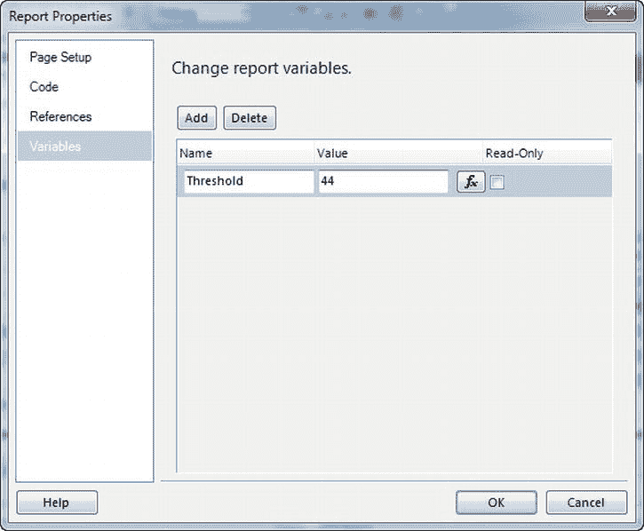

*图 6-39. 添加报告变量*

与报告变量类似，组变量可以为一个或多个行组或列组配置。它们对于存储静态值非常有用，例如产品及其子类别或子组的不同税率。

### 添加仪表控件

仪表控件是外观最吸引人的类型之一，对于专注于关键绩效指标 (KPI) 的报告非常有用。此类报告设计用于仪表板格式，以便一目了然地查看数据，正如你在 第 5 章 中看到的那样。在本节中，我们将把上一节中创建的报告变量与这些新控件之一结合使用，在员工服务成本报告中创建一个视觉提示。该报告将显示我们所分析时间段内的每日访问次数。

你可以通过一个非常简单的计算来确定平均访问次数：将访问次数总和除以 `ChargeServiceStartDate` 字段的非重复计数。你可以使用 `Emp_Svc_Cost_MVP` 存储过程执行该计算。这个平均访问次数值将成为仪表控件中的两个指针之一，该控件将是多条形仪表。控件中的另一个指针将保存阈值 44。

首先，将一个仪表控件从工具箱拖到图表右侧的报表上。确保它位于矩形内部。选择 `Multiple Bar Pointers`（多条形指针）仪表。默认情况下会有三个条形。本报告将只使用其中两个条形：`LinearPointer1` 和 `LinearPointer2`。请右键单击最小的条形 (`LinearPointer3`) 并选择 `Delete Pointer`（删除指针）将其删除。右键单击指针 `LinearPointer1` 并选择 `Pointer Properties`（指针属性），将表达式 `=Variables!Threshold.Value` 分配给它。在属性窗口中，如 图 6-40 所示，分配变量表达式值。

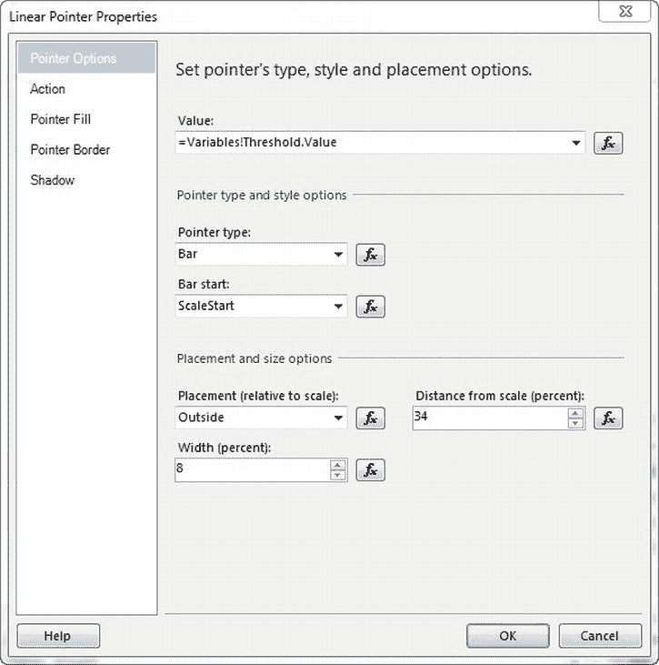

*图 6-40. 将报告变量值分配给仪表指针*

接下来，将确定从参数中选择的时间范围内平均访问次数的表达式分配给 `LinearPointer2`。由于多值参数是查询参数，你知道报告中的数据将仅限于从 `Month`（月份）和 `Year`（年份）参数中选择的值。如果你使用的是报告参数并随后在报告中过滤数据，情况就不会是这样。例如，知道计算平均值的天数会根据所选的 `Month` 和 `Year` 参数值而变化，这使得计算 `LinearPointer2` 的值变得容易。你可以这样编写计算式：
```
=SUM(Fields!Visit_Count.Value) / CountDistinct(Fields!ChargeServiceStartDate.Value)
```
你的最后一步是为指针设置颜色编码，使得指针在值小于等于 44 时显示为红色，超过 44 时显示为绿色。右键单击 `LinearPointer2` 并选择 `Pointer Properties` 选项。接下来，点击 `Pointer Fill`（指针填充）选项卡。点击辅助颜色右侧的 `Expression`（表达式）按钮，输入以下表达式，然后点击 `OK`（确定）：
```
=IIF(Sum(Fields!Visit_Count.Value) / CountDistinct(DAY(Fields!ChargeServiceStartDate.Value) &
YEAR(Fields!ChargeServiceStartDate.Value)) < Variables!Threshold.Value, "Red", "Green")
```
图 6-41 中报告的最终视图选择了 `ServiceYear` 参数值为 2009 和 2010。你可以看到，对于所选的年份和月份值，阈值已经达到。在 `Pro_SSRS` 项目中，包含所有最终调整的完整报告名为 `EmployeeServiceCost_Variables.rdl`。

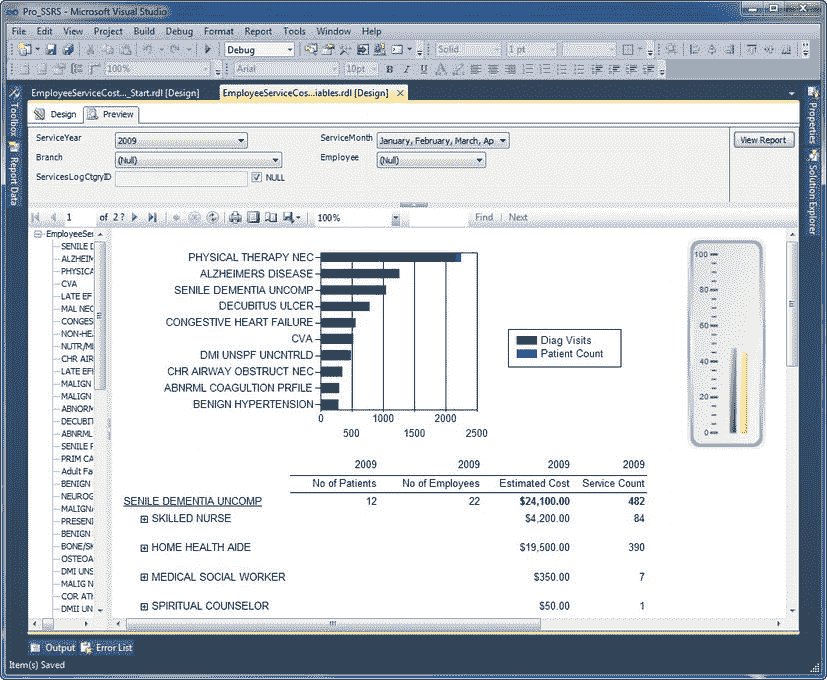

*图 6-41. 包含仪表控件的报告最终视图*


