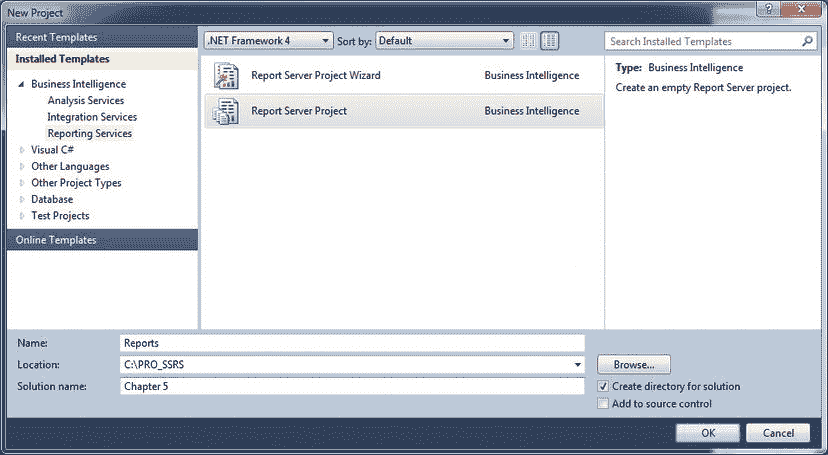
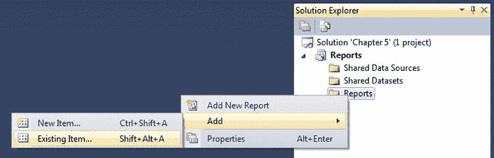
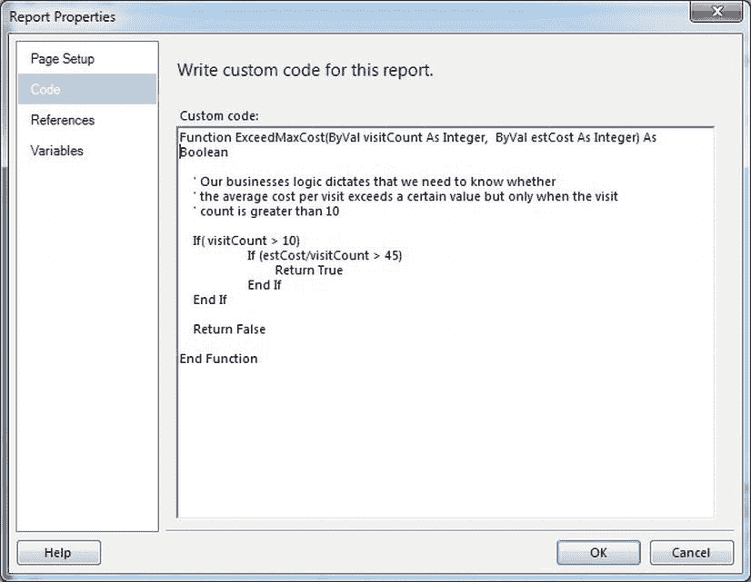

# 在报告中使用自定义 .NET 代码

SSRS 为软件开发人员提供了多种选项，用于通过代码自定义报告。这些选项使软件开发人员能够使用.NET 代码编写自定义函数，这些函数可以与报告字段、参数和过滤器交互，其方式与任何内置函数非常相似。仅举两个例子，你可以创建一个自定义函数来执行以下操作：

*   实现业务规则，并根据逻辑返回`true`或`false`。你可以将此类函数用作表达式的一部分，以根据传递给函数的字段或参数更改字段的值或样式。
*   从 SSRS 2012 无法直接使用的其他来源读取数据。你可以通过让自定义代码直接从源读取数据来实现这一点。本章的示例代码还包括一个从 Web 服务读取数据的示例。

简而言之，使用自定义.NET 代码使开发人员能够将 SSRS 的功能扩展到超出其开箱即用功能的范围。本章将涵盖以下内容：

*   使用嵌入在报告中的代码在报告内使用自定义代码。这是将自定义代码添加到报告的最简单方法，并且它随你的报告一起部署，因为它包含在 RDL 中。然而，它限制了你的能力，因为你只能使用一小部分.NET 库，必须用 VB .NET 编写，并且提供有限的调试支持。你还限制了代码的可重用性，因为你必须手动移动并更改可能包含在不同报告中的任何代码。
*   使用报告调用的自定义程序集在报告内使用自定义代码。这种方法实现起来更复杂，部署起来更困难，但它为你提供了几乎无限的灵活性。你的自定义代码拥有.NET 框架的全部功能可供使用，并且具有额外的优点，即你可以在多个报告中使用单个程序集来复用自定义代码。你还可以在开发自定义程序集时使用 Visual Studio 的完整调试功能，并将其包含在任何代码存储库（如 Team Foundation Server）中。

通常，当你需要执行复杂函数并需要完整编程语言的功能来完成它们时，你会将自定义代码添加到报告中。但是，在开始编写自定义.NET 代码之前，你应该首先评估使用内置表达式功能是否能满足你的需求。使用.NET 嵌入式代码或自定义程序集而不是本机 SSRS 函数可能会导致严重的性能下降。如果你不需要在 SSRS 报告中使用.NET 来执行任务，那么你可能不应该承担报告内代码或自定义程序集的额外开销。


### 在报告中使用嵌入式代码

在报告中使用嵌入式代码是目前在报告中实现自定义 .NET 代码最简单的方式，这主要有两个原因。首先，您只需使用 BIDS 或 Visual Studio 中报表设计器的用户界面 (UI) 直接将代码添加到报表即可。其次，该代码会成为报告 RDL 文件的一个片段，使得部署非常简单，因为它是您报告的一部分，可以一步完成部署。

尽管嵌入式代码更易于使用，但有几点注意事项您需要考虑：

> *嵌入式代码必须用 VB .NET 编写*。如果您是 C# 程序员或使用其他 .NET 兼容语言作为主要开发语言，这可能会迫使您对除最简单函数之外的所有情况都使用自定义程序集。如果您正在开发复杂的代码，您很可能无论如何都会选择自定义程序集的方式，以便获得调试和源代码控制选项。
>
> *所有方法都必须是实例化的*。这意味着这些方法将属于代码对象的一个实例化实例，您不能拥有静态成员。
>
> *仅支持基本操作*。这是因为，默认情况下，代码访问安全性会阻止您的嵌入式代码调用外部程序集和受保护的资源。您可以通过 SSRS 安全策略更改这一点，但这需要向报告表达式主机授予 `FullTrust`（完全信任），这将授予对 CLR 的完全访问权限，绝对不推荐这样做。如果您需要这些功能，请使用自定义程序集，以便您可以实施安全策略，仅授予每个程序集其所需的安全权限。您将在“部署自定义程序集”一节中了解自定义程序集以及如何为其设置安全。

在运行本章的示例之前，请确保阅读随示例代码提供的 `ReadMe.htm` 文件，该文件可从 www.apress.com 的 Source/Download 页面下载。它位于本章示例根目录下的一个文件中。如果您在 Visual Studio 2010 中打开代码，它将在“解决方案项”文件夹下。它包含了运行示例所需的设置和配置步骤。

让我们通过向您已经创建的一个报告中添加一些嵌入式代码，来看看 SSRS 的这一功能是如何工作的。在本例中，从本章附带的示例“员工服务成本报告”开始。它是您在第 6 章中创建的“员工服务成本报告”的一个略微修改版本。我们将向您展示如何使用嵌入式代码功能添加一个函数，该函数将确定您在给定时间段内是否超过了某种治疗类型的单次就诊成本上限。然后，您将使用该函数来确定报告中一个文本字段的颜色，以帮助引起对这些特定治疗类型的注意。

 **注意** 在本章的示例中，我们将使用在第 6 章中创建的报告的一个略微修改版本，以便员工报告参数将包含一种治疗，该治疗有足够多的患者超过了最大就诊次数和平均成本。

### 使用 ExceedMaxCosts 函数

清单 7-1 是您将添加到“员工服务成本报告”中的自定义代码的完整清单。这是一个简单的函数，名为 `ExceedMaxCost`，用于确定某种治疗类型在一段时间内是否超过了平均成本。这使您可以识别需要审查的案例，以确定为什么其服务成本如此之高。

**清单 7-1.** ExceedMaxCost 函数

```
Function ExceedMaxCost(ByVal visitCount As Integer, ByVal estCost As Integer) As Boolean
    ' 我们的业务逻辑要求，只有当就诊次数大于 10 时，
    ' 我们才需要知道平均每次就诊成本是否超过某个值

    If ( visitCount > 10)
            If (estCost/visitCount > 45)
                    Return True
            End If
    End If

    Return False

End Function
```

如果您想按照书中的代码进行操作，您需要创建一个新的 Visual Studio 2010 BI 项目，选择“Reporting Services”子类别和“Report Server Project”类型，如图 7-1 所示。对于此示例，将解决方案命名为 `Chapter 7`，项目命名为 `Reports`。

 **注意** 随着 SQL Server 2012 的发布，BIDS 现已直接集成到 Visual Studio 中。无论您是从 BIDS 还是从 Visual Studio 创建此项目，最终的项目和解决方案都是相同的。



**图 7-1.** 创建一个 Visual Studio BI 项目

要将现有的 `EmployeeServiceCost-NoCode.rdl` 文件添加到您的新项目中，请右键单击“Reports”文件夹，然后选择“添加”“现有项”，如图 7-2 所示。或者，在“Reports”项目高亮显示时，从菜单中选择“添加现有项”。接下来，浏览到您安装 `Chapter 7` 示例的位置，从“Reports”文件夹中选择 `EmployeeServiceCost-NoCode.rdl`。您还需要通过添加一个现有项并选择与报告所在文件夹相同的 `Pro_SSRS.rds` 文件来添加共享数据源。



**图 7-2.** 将 `EmployeeServiceCost-NoCode.rdl` 添加到您的项目中

要将清单 7-1 中的代码添加到“员工服务成本报告”，首先通过在解决方案资源管理器中双击它或右键单击并选择“打开”来打开报告。接下来，在报表处于“设计”选项卡时，从 Visual Studio 的“报表”菜单中选择“报表属性”；或者，在报表设计区域内右键单击，然后选择“属性”。在“报表属性”对话框的“代码”选项卡上，将清单 7-1 中的代码添加到“自定义代码”框中，如图 7-3 所示。



**图 7-3.** 在自定义代码编辑器中输入嵌入式代码

 **注意** 您必须在嵌入式代码编辑器中将函数声明（第一行）作为单行输入，否则在尝试预览报告时会收到错误。在清单 7-1 中它以换行显示，但在输入到嵌入式代码编辑器时不应有换行。

现在您已经定义了自定义代码，您会想用它来高亮显示那些超过最大就诊次数的治疗类型。为此，您需要作为表达式的一部分来访问 `ExceedMaxCost` 方法。

嵌入式代码中的方法通过一个全局定义的 `Code` 成员提供。当报告的 RDL 文件在发布时编译成 .NET 程序集时，SSRS 会创建一个名为 `Code` 的类的全局成员，您可以在任何表达式中通过引用 `Code` 成员和方法名（如 `Code.ExceedMaxCost`）来访问它。


