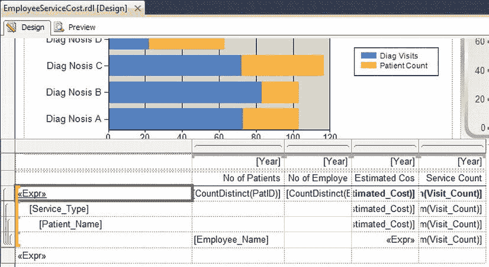
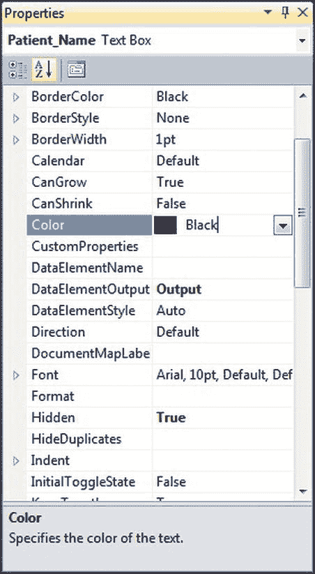
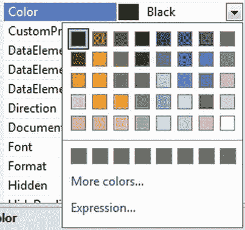
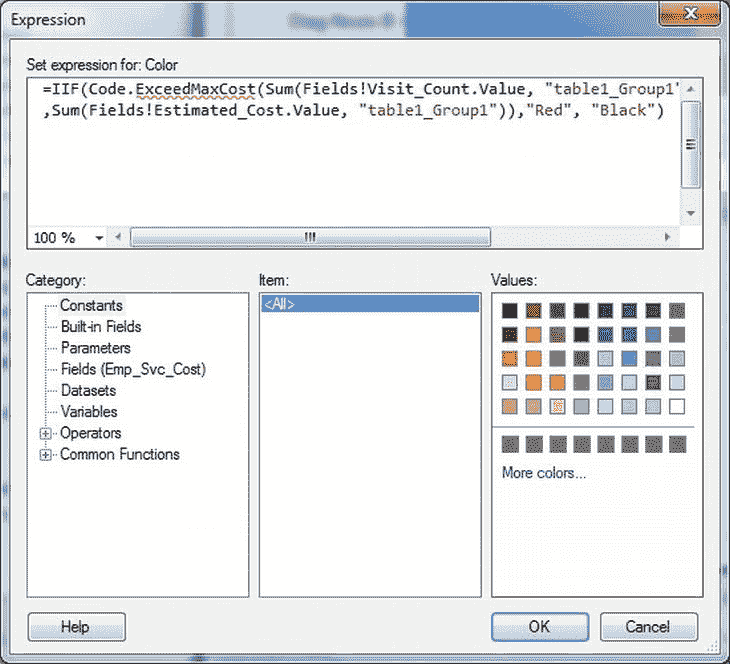
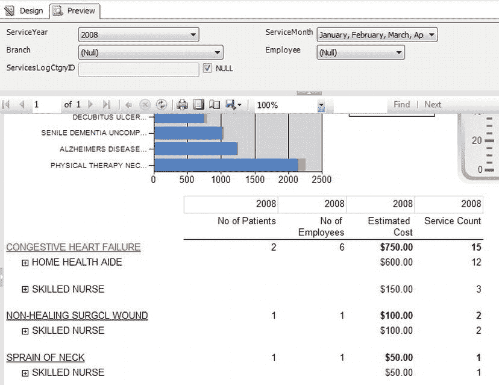
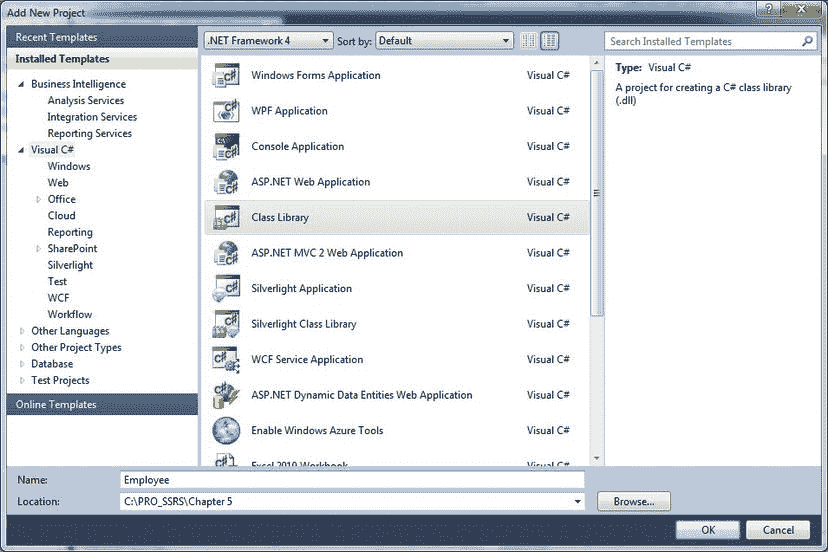
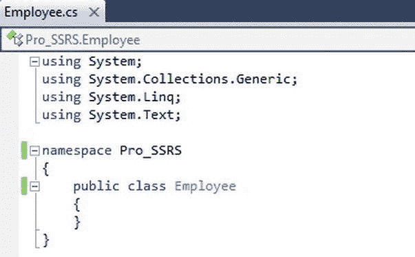

# 清单 7-2 展示了如何在文本框的`Color`属性中使用条件表达式，根据函数调用的返回值设置文本颜色。

**清单 7-2.** 使用条件表达式

```vb
=IIF(Code.ExceedMaxCost(Sum(Fields!Visit_Count.Value,
"table1_Group1"),Sum(Fields!Estimated_Cost.Value, "table1_Group1")),"Red", "Black")
```

`ExceedMaxCost`方法用于判断某种治疗类型在时间段内是否超过 10 个实例且每次就诊平均成本超过 45，如果满足则返回`True`，否则返回`False`。使用布尔返回值便于在格式化表达式中使用该方法，因为返回值可以直接测试，而无需与其他值进行比较。

使用原生 SSRS 函数`IIF`，我们可以直接传递自定义的`ExceedMaxCost`并评估其返回值。`IIF`会评估第一个参数，当结果为`True`时返回第二个参数，为`False`时返回第三个参数。

当某种治疗类型超过允许的最大平均成本时，`ExceedMaxCost`返回`True`，这会将文本框的`Color`属性值设置为`Red`，从而使报表中的文本显示为红色。如果未超过，则`ExceedMaxVisits`返回`False`，`Color`属性被设置为`Black`。

### 在报表中使用 `ExceedMaxCost` 函数

现在我们将逐步指导如何将此表达式实际添加到报表中。首先，在报表中选择要应用表达式的字段。本例中，在报表设计模式下选择治疗名称文本框，如图 7-4 所示。



**图 7-4.** 将表达式添加到报表中

其次，选中文本框后，转到“属性”窗口，选择`Color`属性（见图 7-5）。如果“属性”窗口未显示，可以在 Visual Studio 中选择“视图” > “属性窗口”使其可见。



**图 7-5.** 属性窗口中的 Color 属性

接下来，点击下拉箭头，在显示的菜单中选择“表达式”（见图 7-6）。



**图 7-6.** 颜色选择列表

现在你将看到“编辑表达式”对话框，如图 7-7 所示。在此处输入来自清单 7-2 的表达式代码。你也可以直接键入表达式，或使用表达式编辑器将所需参数插入表达式中。



**图 7-7.** 在表达式编辑器中输入表达式

现在你可以运行报表，患者姓名将根据报表`Code`元素中的业务逻辑以红色或黑色显示。

 **注意** 你会注意到，通过表达式编辑器查看时，`ExceedMaxCost`函数存在验证错误。这是正常现象，不会影响报表的构建或查看。

既然你已修改报表以使用`ExceedMaxCost`函数，你可以预览报表以查看其实际效果。为此，选择“预览”选项卡，将`ServiceYear`参数设置为 2010，同时保持所有其他参数为默认值。渲染报表后，你应该会看到一个类似图 7-8 的报表。



**图 7-8.** 嵌入了代码的报表

### 从嵌入代码访问 .NET 程序集

报表的`Code`元素主要设计用于.NET 框架和 VB .NET 语言语法的基本使用。默认情况下，`Code`元素不包含对许多框架命名空间的访问权限。在嵌入的自定义代码中引用许多标准的.NET 程序集，需要你在报告中创建对每个程序集的引用。为此，转到“报表属性”对话框的“引用”选项卡，点击“添加”按钮后的省略号，然后选择你想要引用的相应.NET 程序集。请注意，默认情况下，这些引用的程序集将仅具有“执行”权限。

尽管如上所述，你可以直接在报表的`Code`元素中使用其他.NET 框架程序集和第三方程序集，但强烈建议你考虑使用自定义程序集。主要考虑之一是安全性。默认情况下，`Code`元素仅以“执行”权限运行，这意味着它可以运行但无法访问受保护的资源。如果你需要执行某些受保护的操作，例如从文件中读取数据，你必须将名为`Report_Expressions_Default_Permissions`的代码组的安全策略设置为`FullTrust`。此代码组控制报表表达式宿主程序集的权限，该程序集是从报表中找到的所有表达式创建的，并作为已编译报表的一部分存储。要设置安全策略，你需要编辑报表服务器和报表设计器的策略配置文件。有关这些文件的标准位置，请参阅本章后面的“部署自定义程序集”部分。

但是，不建议对安全策略进行此项更改。当你更改在`Code`元素中运行的代码的权限时，你同时也更改了在该报表服务器上运行的所有报表的权限。通过将权限更改为`FullTrust`，你允许报表中使用的所有表达式进行受保护的系统调用。这实质上会使任何能够向你的报表服务器上传报表的人获得对你系统的完全访问权限。

如果你需要使用 VB .NET 语言语法之外的功能，需要额外的安全权限，有复杂的逻辑需要实现，需要使用更多的.NET 框架，或者希望在多个报表中使用相同的功能，那么你应该将代码移至自定义程序集中。然后你可以在报告中引用该程序集，并通过自定义类的属性和方法使用代码。自定义程序集不仅为你在代码本身提供了更大的灵活性，还允许你在更细粒度的级别上控制安全性。使用自定义程序集，你可以为该特定程序集添加权限集和代码组，而无需修改所有在`Code`元素中运行的代码的权限。

你可能还需要使用自定义程序集的另一个原因。使用嵌入代码时，你无法利用完整的 Visual Studio IDE 来开发报告的`Code`部分，例如智能感知和调试等功能。在报表的`Code`部分编写代码与在记事本中工作差别不大。

不过，你可以变通处理。如果你选择放入`Code`元素的代码不仅仅是几行简单语句，那么创建一个单独的项目来编写和测试代码可能会更容易。一个快速的 VB .NET Windows 窗体或控制台项目可以为你提供编写计划嵌入报表的代码的理想方式。你可以获得 IDE 的全部功能，一旦你的方法按预期工作，只需将它们粘贴到报表的代码窗口中即可。请记住使用 VB .NET 项目，因为`Code`元素仅适用于用 VB .NET 编写的代码。


### 在报告中使用自定义程序集

自定义程序集虽然实现起来更复杂，但能提供比嵌入式代码更大的灵活性。创建它们的过程要稍微复杂一些，因为它们并非报告 RDL 的一部分，必须在报表设计器之外创建。这也使得它们部署起来更困难，因为嵌入式代码会成为报告 RDL 的一部分，而自定义程序集是一个独立的文件。

然而，你的辛勤工作会得到多方面的回报。

*代码重用*：你可以在多个报告之间重用自定义代码，无需将代码复制粘贴到每个报告中。这使你能够将所有自定义逻辑集中到单一位置，从而大大简化代码维护。

> *任务分离*：使用程序集可以更轻松地将撰写报告的任务与创建自定义代码的任务分开。这在概念上与使用代码隐藏功能编写 ASP.NET 应用程序有些相似。这种方式允许 ASP.NET 开发人员将页面标记、布局和图形与将与之交互的代码分开。如果你有几个人参与项目，可以让擅长报告撰写的人员负责报告的布局和创建，而让可能编码技能更强的其他人编写自定义代码。
>
> *语言中立性*：你可以使用自己选择的.NET 语言。可以从 C#、VB、J#或任何与.NET Framework 兼容的第三方语言中选择。
>
> *高效的开发环境*：如果你使用 Visual Studio 2010 来开发自定义程序集，你将获得其完整编辑和调试功能的强大支持。
>
> *安全控制*：你可以使用安全策略对程序集能够执行的操作进行细粒度控制。
>
> *灵活性*：你创建的程序集不受限于 RDL 嵌入式代码部分中的简单函数。你有能力在报告中利用整个.NET 库。

要从报告中使用自定义程序集，你需要创建一个类库来存放代码，将你希望从报告中调用的方法和属性添加到类中，然后将其编译为程序集。要从报表设计器中使用它，你可以在 Visual Studio 的解决方案中添加一个类库项目，这样就能轻松访问报告和你将在其中使用的代码。在运行附带的示例之前，请务必阅读解决方案文件夹“解决方案项”中的 `ReadMe.htm` 文件，以查看针对你的特定配置，在运行示例之前是否需要任何步骤。

### 向你的报告解决方案添加类库项目

要将自定义程序集与你的报告一起使用，首先需要以.NET 类的形式编写自定义代码。你可以通过向现有解决方案中添加一个类库项目来实现，这样你就可以同时处理报告和自定义代码。

在此示例中，你希望显示员工为病人出诊所获得的报酬。该类将从人力资源系统定期导出的 XML 文件中获取此信息。

 **注意** 如果可能，你会希望直接从人力资源系统获取此信息，可能通过 Web 服务。本章附带的示例代码包含了一个示例 Web 服务和一个调用它的方法。

在此示例中使用 XML 文件 `EmployeePay.xml`（作为本章代码下载的一部分提供），不仅可以让你编写自定义程序集，还可以让你了解访问受保护资源（如本地文件）所需的步骤。要从 XML 文件获取信息并使其可供报告使用，请创建一个类，该类包含一个方法，该方法以 `EmployeeID` 和日期作为参数，从 XML 文件读取员工每次出诊的付费费率，然后返回该费率。虽然本章不会逐步介绍这一点，但附带的示例代码也包含了一个使用 Web 服务完成相同操作的示例。这使你能够模拟通过 Web 服务而不是导出的文件与人力资源系统交互的能力。

然后，你可以在报告的表达式中引用你开发的程序集，并用它来计算每位病人的总出诊费用。

首先，从菜单中选择 文件  添加  新建项目。根据你的偏好，选择 Visual Basic 项目或 Visual C# 项目。选择“类库”，并将项目名称输入为 `Employee`。在此示例中，我们将向你展示如何使用 Visual C# 类库项目，如 图 7-9 所示。



***图 7-9.** “添加新项目”对话框*

从解决方案资源管理器中选择新创建的 `Class1.cs`，并将其重命名为更具描述性的名称，例如 `Employee`，因为你将使用此类来计算员工提供的出诊费用。在 Visual Studio 2010 IDE 中打开 `Employee.cs` 文件，将命名空间从 `Employee` 更改为 `Pro_SSRS`，你将看到如 图 7-10 所示的代码编辑器。



***图 7-10.** Visual Studio 2008 代码编辑器*

对于此示例，你将添加几条 `using` 语句来导入其他命名空间中定义的类型。具体来说，你将添加 `System.Data` 和 `System.Security.Permissions` 命名空间，这样你就可以在 `Employee` 程序集中引用 `DataSet` 和 `SecurityAction` 方法，而无需键入完整的命名空间，如 清单 7-3 所示。你也可以去掉对 `System.Linq` 的引用，因为我们不会在此类库中使用它。

***清单 7-3.** Employee 程序集*

```
using System;
using System.Collections.Generic;
using System.Text;
using System.Security.Permissions;
using System.Data;

namespace Pro_SSRS {
        public class Employee {
                   public Employee() { }
```


