# 部署和使用自定义程序集

```csharp
[PermissionSetAttribute(SecurityAction.Assert, Unrestricted = true)]
public static decimal CostPerVisitXML(string employeeID, DateTime visitDate)
{
    DataSet empDS = new DataSet();
    empDS.ReadXmlSchema(@"C:\Temp\EmployeePay.xsd");
    empDS.ReadXml(@"C:\Temp\EmployeePay.xml");
    DataRow[] empRows = empDS.Tables["EmployeePay"].Select("EmployeeID = '" +
        employeeID + "'");
    Decimal empAmt;

    if (empRows.Length > 0)
    {
        empAmt = Convert.ToDecimal(empRows[0]["Amount"]);
        return empAmt;
    }
    else
        return 0;
}
```

自定义程序集所使用的任何程序集，都必须在用于设计报表的计算机和 SSRS 2012 服务器本身上可用。由于你只是使用常见的 .NET Framework 程序集，这应该不是问题，因为 .NET Framework 已安装在你的本地计算机以及 SSRS 2012 服务器上。如果你在自定义程序集中引用了其他自定义或第三方程序集，则需要确保它们在你将要运行报表的 SSRS 服务器上可用。

 **注意** 由于本书的重点是 SSRS 而不是编写代码，我们将不会逐行解释代码示例。如果你对编程感兴趣，Apress 提供了许多针对各种编程语言的优秀书籍，可以帮助你为 SSRS 2012 编写自定义代码。请参考 [www.apress.com](http://www.apress.com)。

要在你的报表中使用 `Employee` 程序集，你首先需要将其部署到适当的位置。在下一节中，你将学习如何部署自定义程序集并设置所需的权限。完成此操作后，你将返回报表，并在 Employee Service Cost 报表中使用你已创建和部署的自定义程序集。

 **注意** 请记住，每次对自定义程序集进行更改后，都必须重新部署该程序集。此外，如果你添加了需要额外权限的代码，可能还需要授予这些权限。

### 部署自定义程序集

部署自定义程序集比通过 `Code` 元素嵌入报表中的代码更困难。这是因为以下原因：

> *   自定义程序集不是报表本身的一部分，必须单独部署。
> *   自定义程序集不部署到与报表相同的文件夹。
> *   Visual Studio 2010 中的内置项目部署方法不会自动部署你的自定义程序集。
> *   默认情况下，自定义程序集仅被授予 `Execution` 权限。`Execution` 权限允许代码运行，但不能使用受保护的资源。

要在 SSRS 2012 中使用你的自定义程序集，你需要采取以下步骤将它们放置在 SSRS 2012 可以找到的位置，并在必要时编辑控制安全策略的文件。文件的位置取决于你想在 Visual Studio 的报表设计器中使用它们还是在报表服务器上使用它们。

1.  你需要将你的自定义程序集部署到报表设计器和/或 SSRS 2012 应用程序文件夹。
    *   对于报表设计器/Visual Studio，默认路径是 `C:\Program Files (x86)\Microsoft Visual Studio 10.0\Common7\IDE\PrivateAssemblies`。
    *   对于 SSRS 2012，默认路径是 `C:\Program Files\Microsoft SQL Server\MSRS11.MSSQLSERVER\Reporting Services\ReportServer\bin`。

     **注意** 你需要有必要的权限才能访问这些文件夹。默认情况下，标准 `Users` 组的成员没有对这些文件夹的必要写入/修改权限。以具有适当安全权限（如管理员）的用户身份登录后，你可以设置文件夹的权限，以允许权限较低的帐户登录用户进行必要的访问。或者，你可以在登录时或以具有必要权限的用户身份运行时，将文件移动到适当的文件夹。

2.  接下来，如果你的自定义程序集需要除 `Execution` 权限之外的额外权限，则需要编辑 SSRS 2012 安全策略配置文件。（对于 SSRS 2012，默认位置是 `C:\Program Files\Microsoft SQL Server\MSRS11.MSSQLSERVER\Reporting Services\ReportServer\rssrvpolicy.config`。）你也应在此时更新设计器权限配置文件。该文件的默认位置是 `C:\Program Files (x86)\Microsoft Visual Studio 10.0\Common7\IDE\PrivateAssemblies\RSPreviewPolicy.config`。不过，此配置文件使用的程序集路径将与你的 SSRS 实例略有不同，因为我们将在 Visual Studio 2010 的私有程序集文件夹中放置 DLL 文件。

    例如，如果你正在编写一个自定义程序集来计算员工每次访问的成本，你可能需要从文件中读取工资率。为了检索费率信息，你将需要向你的自定义程序集授予额外的安全权限。要给予你的自定义程序集 `FullTrust` 权限，你可以将 清单 7-4 中所示的 XML 文本添加到 `rssrvpolicy.config` 文件的相应 `CodeGroup` 部分。

***清单 7-4.** 为 SSRS 和 Visual Studio 的自定义程序集授予 FullTrust 权限*

```xml
<CodeGroup class="UnionCodeGroup"
    version="1"
    PermissionSetName="FullTrust"
    Name="EmployeePayCodeGroup"
    Description="Employee Cost Per Visit">
    <IMembershipCondition
        class="UrlMembershipCondition"
        version="1"
        Url="C:\Program Files\Microsoft SQL Server\MSRS11.MSSQLSERVER\Reporting Services\ReportServer\bin\Employee.dll "/>
</CodeGroup>
```

或者，对于 Visual Studio：


## 处理代码访问安全与自定义程序集

```xml
<CodeGroup class="UnionCodeGroup" version="1"
         PermissionSetName="FullTrust"
         Name="EmployeePayCodeGroup"
         Description="Employee Cost Per Visit">
         <IMembershipCondition
                  class="UrlMembershipCondition" version="1"
                  url="C:\Program Files (x86)\Microsoft Visual Studio 10.0\Common7\IDE\PrivateAssemblies\Employee.dll"/>
  </CodeGroup>
```

 `Note` 如果你运行报表后，在文本框中看到的是 `#Error` 文字而非预期结果，这很可能是一个某种权限问题。

因为通常来说，除非绝对必要，否则授予你的程序集 `FullTrust` 权限并不是一个好主意。你可以使用命名权限集，只为你的自定义程序集授予它所需的精确权限，而非 `FullTrust`。

为了授予自定义程序集刚好足够的权限，以读取名为 `C:\Temp\ EmployeePay.xml` 和 `C:\Temp\EmployeePay.xsd` 的数据文件，你首先需要在策略配置文件 `rssrvpolicy.config` 中添加一个命名权限集，该权限集授予对这些文件的读取权限。这将被放置在配置文件的 `NamedPermissionSets` 部分中。然后，你可以将特定的权限集应用于自定义程序集，如 清单 7-5 所示。

### 清单 7-5. 用于读取文件的命名权限集

```xml
<PermissionSet
        class="NamedPermissionSet"
        version="1"
        Name="EmployeePayFilePermissionSet"
        Description="Permission set that grants read access to my employee cost file.">
        <IPermission
                class="FileIOPermission"
                version="1"
                Read="C:\Temp\EmployeePay.xml" />
        <IPermission
                class="FileIOPermission"
                version="1"
                Read="C:\Temp\EmployeePay.xsd" />
        <IPermission
                class="SecurityPermission"
                version="1"
                Flags="Execution, Assertion" />
</PermissionSet>
```

接下来，如 清单 7-6 所示，你向策略配置文件 `rssrvpolicy.config` 的 `CodeGroup` 部分添加一个代码组，该代码组授予程序集额外的权限。如果你已经为程序集添加了 `FullTrust` 权限，你可以用这个 `CodeGroup` 来替换它，或者直接修改它以使用新创建的权限集名称。

### 清单 7-6. 授予对 Employee 程序集的文件 I/O 权限

```xml
<CodeGroup
        class="UnionCodeGroup"
        version="1"
        PermissionSetName=" EmployeePayFilePermissionSet "
        Name="EmployeePayCodeGroup"
        Description="Employee Cost Per Visit">
        <IMembershipCondition
                class="UrlMembershipCondition"
                version="1"
                Url="C:\Program Files\Microsoft SQL Server\MSRS11.MSSQLSERVER\Reporting Services\ReportServer\binEmployee.dll "/>
</CodeGroup>
```

 `Note` 你添加到配置文件中的程序集名称必须与在 RDL 文件的 `CodeModules` 元素下添加的名称匹配。这是你在“从嵌入式代码访问 .NET 程序集”一节中介绍的、在报表属性  引用菜单下为自定义程序集设置的名称；该名称在“向报表添加程序集引用”一节中有详细讨论。

要应用自定义权限，你还必须在你的代码中断言（Assert）该权限。例如，如果你想为 XML 文件 `C:\Temp\EmployeePay.xsd` 和 `C:\Temp\EmployeePay.xml` 添加只读访问权限，你必须向你的方法中添加类似 清单 7-7 所示的代码。

### 清单 7-7. 使用代码断言权限

```csharp
// C#
FileIOPermission permissionXSD = new
    FileIOPermission(FileIOPermissionAccess.Read,
    @" C:\Temp\EmployeePay.xml");
    permissionXSD.Assert();
    // 加载架构文件
    empDS.ReadXmlSchema(@"C:\Temp\EmployeePay.xsd");

FileIOPermission permissionXML = new
    FileIOPermission(FileIOPermissionAccess.Read, @"
    C:\Temp\EmployeePay.xml");
    permissionXML.Assert();
    empDS.ReadXml(@"C:\Temp\EmployeePay.xml");
```

你也可以将断言添加为方法特性，如 清单 7-8 所示。这是本章示例中展示的方法。

### 清单 7-8. 使用方法特性断言权限

```csharp
[FileIOPermissionAttribute(SecurityAction.Assert,
    Read=@" C:\Temp\EmployeePay.xsd")]
[FileIOPermissionAttribute(SecurityAction.Assert,
    Read=@" C:\Temp\EmployeePay.xml")]
```

 `Tip` 有关代码访问安全和报表服务的更多信息，请参阅 SSRS 2012 联机丛书 (BOL) 中的“理解报表服务中的代码访问安全”。有关安全的更多信息，请参阅 .NET Framework 开发人员指南中的“.NET Framework 安全”，该指南可在 Microsoft 开发人员网络 (MSDN) 网站 [`msdn.microsoft.com`](http://msdn.microsoft.com) 上获取。你还需要了解有关使用全局程序集缓存 (GAC) 来存储自定义程序集的内容。


### 向报表添加程序集引用

选中 EmployeeServiceCost-NoCode 报表并切换到“设计”选项卡后，从顶部菜单项中选择“报表”  “报表属性”；或者，在报表设计区域内右键单击，然后选择“属性”。接着执行以下操作：

> 1.  在“引用”部分处于活动状态时，单击“程序集”部分中的“添加”按钮。
> 2.  单击省略号按钮，然后单击“浏览”选项卡。浏览到 `Employee.dll` 文件所在位置并选中它。如果您已将生成的 DLL 文件放置到 Visual Studio 的私有程序集文件夹中，您现在应该这样做，以便引用该位置。操作完成后，“报表属性”对话框应类似于图 7-11。

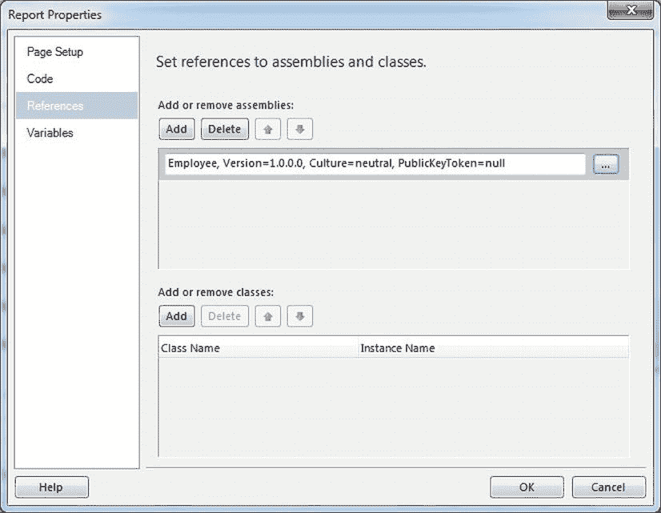

***图 7-11.** 引用选项卡*

 **注意** 报表属性对话框“引用”选项卡上的类列表仅由基于实例的成员使用，而非静态成员。

要在报表表达式中使用程序集中的自定义代码，您必须调用程序集中某个类的成员。根据您声明方法的方式，可以通过不同的方式实现这一点。

如果方法被定义为静态的，它将在报表中全局可用。您可以通过命名空间、类和方法名称在表达式中访问它。以下示例调用了 `Pro_SSRS` 命名空间中 `Employee` 类的静态方法 `CostPerVisit`，并传入一个 `EmployeeID` 值和访问日期。该方法将返回指定员工的每次访问成本。

`=Pro_SSRS.Employee.CostPerVisitXML(empID, visitDate)`

如果自定义程序集包含实例方法，您必须将类和实例名称信息添加到报表引用中。对于静态方法，则无需添加此信息。

#### 实例方法与静态方法

静态方法是可以从类调用但不对类的特定实例进行操作的方法。这意味着调用和使用该方法时，不需要实例化新对象。实例方法则确实需要创建一个对象才能使用，并且将在该特定类的对象（或类的实例）中执行其所有工作。静态方法在这里更可取，因为我们无需执行任何额外工作来创建该类类型的新对象即可开始使用这些方法。

基于实例的方法通过全局定义的 `Code` 成员提供。您通过引用 `Code` 成员，然后引用实例和方法名称来访问这些方法。以下展示了如何调用 `CostPerVisitXML` 方法（如果它被声明为实例方法而非静态方法）：

`=Code.Employee.CostPerVisitXML(empID, visitDate)`

 **提示** 尽可能使用静态方法，因为它们比实例方法提供更高的性能。但是，如果使用静态字段和属性时要小心，因为它们会将数据暴露给同一报表的所有实例，这可能导致一个用户运行报表时使用的数据被另一个运行相同报表的用户看到。

在添加了对 Employee 自定义程序集的引用后，您将通过在报表表达式中调用 `CostPerVisitXML` 方法来使用它。在报表中选中 `Employee_Cost` 文本框，如图 7-12 所示。

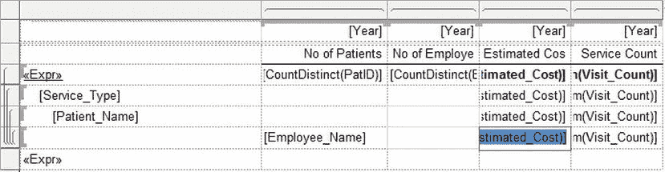

***图 7-12.** Employee_Cost 文本框*

右键单击，选择“表达式”，然后在“编辑表达式”对话框中输入清单 7-9 中所示的代码。

***清单 7-9.** 在表达式中使用 CostPerVisitXML 方法*

```
=Pro_SSRS.Employee.CostPerVisitXML(Fields!EmployeeID.Value,
Fields!ChargeServiceStartDate.Value)* sum(Fields!Visit_Count.Value)
```

现在，如果您预览报表或生成并部署它，您应该会看到类似于图 7-13 的报表。您可以使用任何所需的参数来生成实际的报表。生成后，展开服务类型和患者名称树菜单项以查看新计算的成本估算值。

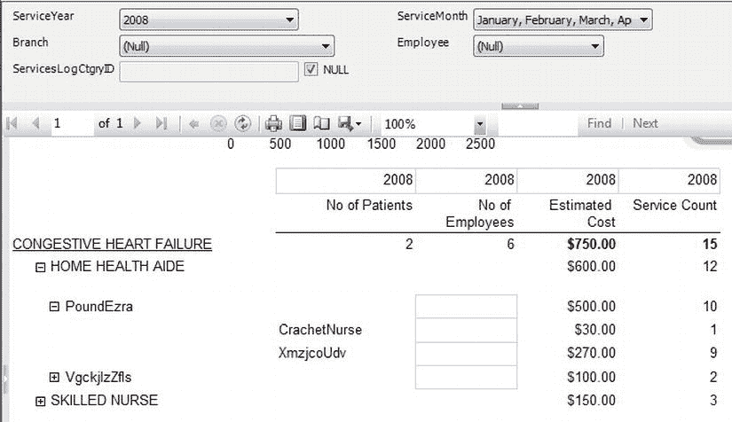

***图 7-13**. 最终报表*

在第 7 章的示例代码中，我们还包含了一个可以从自定义代码调用以访问员工薪酬信息的 Web 服务。这模拟了通过 Web 服务访问来自另一个系统的信息，旨在允许您将导出的 XML 文件替换为对 Web 服务的调用。示例代码中包含的 `Employee` 类已经包含一个名为 `CostPerVisitWS` 的方法，该方法使用 Web 服务而非 XML 文件作为其数据源。您只需将表达式从以下形式：

`=Pro_SSRS.Employee.CostPerVisitXML(Fields!EmployeeID.Value, Fields!ChargeServiceStartDate.Value)* sum(Fields!Visit_Count.Value)`

更改为以下形式：

`=Pro_SSRS.Employee.CostPerVisitWS(Fields!EmployeeID.Value, Fields!ChargeServiceStartDate.Value)* sum(Fields!Visit_Count.Value)`

即可让报表使用 Web 服务代替 XML 文件。

要尝试此操作，只需打开本章的示例解决方案，并编辑 `EmployeeServiceCost.rdl` 文件中 `Employee_Cost` 字段的表达式。要尝试 Employee Web 服务，您还必须确保在 Visual Studio 中调试报表时 Web 服务正在运行，或者如果您已将报表部署到服务器，则 Web 服务已发布并在测试机器上运行。让我们浏览一下 `Employee` 类中调用 Web 服务的代码，并展示该过程在我们报表中的工作方式。

在设计模式下打开 EmployeeServiceCost 报表，转到表中的员工估算成本列。让我们使用前面为 Web 服务提供的示例来编辑表达式。将表达式编辑为使用 Web 服务调用后，它应类似于图 7-14。

 **注意** 我们并未使用 `Employee` 类中包含的一个独立方法，该方法本可以使用 Web 服务来提取我们想要的数据，而不是使用 XML 文件。让我们从 `Employee` 类项目的 `Employee.cs` 中看看这个方法。您将在清单 7-10 中看到，它只是对我们项目中已构建并包含的 Web 服务进行的一次简单调用。我们向 Web 服务提供 `employeeID` 和访问日期，就像我们从 XML 提取信息时一样，但这次数据直接由 Web 服务提供，我们稍后会查看它。

***清单 7-10:** 通过 Web 服务获取成本值*

```
public static decimal CostPerVisitWS(string employeeID, DateTime visitDate)
{
        EmployeeWS.Employee empWS = new EmployeeWS.Employee();
        Decimal empAmt;
        empAmt = empWS.GetCost(employeeID, visitDate);
        return empAmt;
}
```

如果您还不熟悉 Web 服务，我们将在第 8 章和第 9 章中进行更多相关操作。这看起来比我们解析 XML 文件的过程要简单得多，但大部分工作实际上是在解决方案中提供的 Web 服务上完成的。


由于解决方案中提供的 Web 服务已设置为依赖于该 Web 服务，因此我们无需为此测试新的数据调用。请继续启动调试过程，确保报表项目在解决方案中仍设置为启动项目。您可以将 ServiceYear 参数设置为 2010 并查看报表。一旦您向下钻取到某个患者，您将注意到报表正在处理并刷新数据。这次数据是通过 Web 服务获取的，该服务从数据库而非 XML 文件中获取数据。我们还包含了一个示例测试应用程序，它允许您通过 Windows 窗体应用程序调用 `Employee` 类的 `CostPerVisitXML` 和 `CostPerVisitWS` 方法。这使您能够演练该类并在 Windows 窗体环境中逐步调试代码，这更容易进行测试和调试。

 **提示** 编写测试应用程序是确保您的自定义代码在 SSRS 2012 报表中使用之前能够正确执行预期功能的好方法。您不仅可以像我们这样创建自定义的 Windows 窗体应用程序，而且使用适当版本的 Visual Studio 2010，您还可以创建专门的测试代码和自动化测试例程。

### 调试自定义程序集

为了便于调试，设计、开发和测试自定义程序集的推荐方法是创建一个同时包含测试报表和自定义程序集的解决方案。这将使您能够轻松地从 Visual Studio 中同时访问报表和将在其中使用的代码。

现在我们将向您展示如何设置 Visual Studio 以允许调试刚刚编写的 `Employee` 程序集：

> 1.  在“解决方案资源管理器”中，右键单击解决方案，然后选择“配置管理器”。这将允许您设置用于调试的生成和部署选项。
> 2.  选择“调试”作为“活动解决方案配置”选项。单击“关闭”以完成此选项选择。
> 3.  在解决方案管理器中，右键单击包含报表的项目，然后选择“设为启动项目”，以确保在开始调试时此项目在您的解决方案中首先运行。
> 4.  再次在解决方案资源管理器中右键单击包含报表的项目，然后选择“项目依赖项”。
> 5.  在“项目依赖项”对话框中，选择 Employee 项目作为依赖项项目，如图 7-14 所示。这将告诉 Visual Studio 您的报表依赖于您编写的自定义程序集。
>     
>     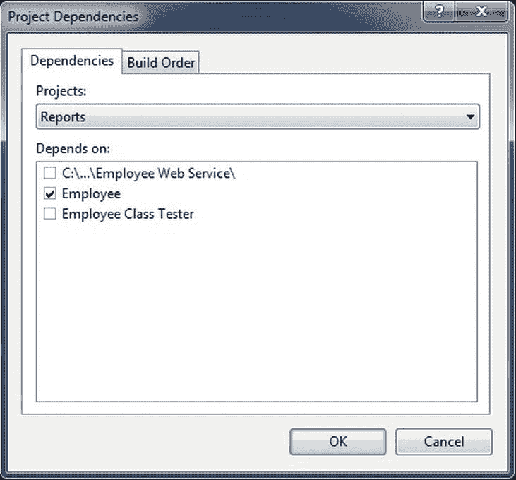
>     
>     ***图 7-14.** “项目依赖项”对话框*
>     
>     
> 6.  单击“确定”保存更改，并关闭“项目依赖项”对话框。
> 7.  再次右键单击“报表”项目，然后选择“属性”。
> 8.  选择“StartItem”，并将其设置为您要调试的报表。在此案例中，选择我们设置为使用自定义程序集的报表。“StartItem”选项明确告知 Visual Studio 在以调试方式运行时具体运行哪个报表。单击“确定”以完成此选择。
> 9.  在“解决方案资源管理器”中，选择 Employee 自定义程序集项目。
> 10. 右键单击此项目，然后选择“属性”。
> 11. 从左侧菜单中选择“生成”部分。
> 12. 在“生成”页面上的“输出路径”文本框中，输入报表设计器文件夹的路径。（默认情况下，此路径为 `C:\Program Files (x86)\Microsoft Visual Studio 10.0\Common7\IDE\PrivateAssemblies`。）
>     
>      **注意** 您需要拥有必要的权限才能将此文件夹用作输出路径。默认情况下，标准“用户”组的成员没有此文件夹所需的写入/修改权限。当您以具有适当安全权限的用户（如管理员）登录时，请确保设置 PrivateAssemblies 文件夹的权限，以便在您以权限较低的帐户登录时允许必要的访问。您可以保留默认输出路径，但更改它可以节省一些工作。使用默认路径，您必须生成然后手动复制自定义程序集，以便在 Visual Studio 中运行的报表设计器能够找到并运行它。
>     
>     
> 13. 现在，在您的自定义程序集代码中设置断点。如果不熟悉设置断点，只需打开您的 `employee.cs` 文件，然后在代码左侧的灰色侧面板中单击。在方法读取 XML 数据文件的位置设置断点，如图 7-15 所示。
> 14. 确保将 Report 设置为启动项目，然后按 F5 以调试模式启动解决方案。当报表在表达式中使用自定义代码时，调试器将在执行到您设置的任何断点时停止。现在，您可以使用 Visual Studio 的所有强大调试功能来调试代码。

 **注意** 也可以使用多个 Visual Studio 副本调试您的自定义程序集。有关详细信息，请参阅 SSRS 2012 BOL。

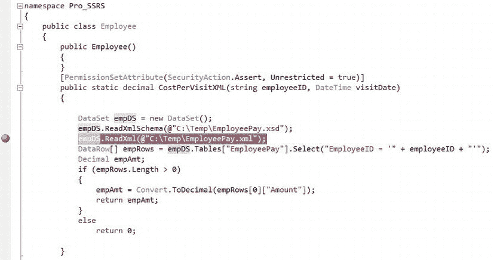

***图 7-15.** 在自定义程序集中设置断点*

### 排查项目故障

如果修改了自定义程序集并重新生成，则必须重新部署它，因为报表设计器仅在报表设计器应用程序文件夹中查找它。如果您遵循了我们在“调试自定义程序集”部分中的建议更改了输出路径，那么每次在调试时重新生成它，它都应该位于正确的位置。否则，您将需要按照“部署自定义程序集”部分中的说明将其移动到报表设计器应用程序文件夹。请记住，Visual Studio 不会将您的自定义程序集部署到您的 SSRS 2012 服务器计算机；您必须手动复制它。最后，在开发期间，您可能希望将任何自定义程序集的版本保持为相同的值。每次更改自定义程序集的版本时，必须更改对它的引用，如本章前面所述，在“报表属性”对话框的“引用”选项卡上进行修改。一旦您的报表投入生产，而您希望跟踪版本信息，您可以使用 GAC，它可以容纳多个版本；这意味着您只需重新部署那些使用新版本新功能的报表。如果您希望所有报表都使用新版本，您可以设置绑定重定向，以便将所有对旧程序集的请求都发送到新程序集。您需要修改报表服务器的 `Web.config` 文件和 `Rsreportserver.config` 文件。

如果您正在使用自定义程序集，并且报表输出显示 #Error，则您可能遇到了权限问题。有关如何正确设置权限的信息，请参阅本章中的“部署自定义程序集”部分。

### 小结

在本章中，您学习了如何在报表中使用自定义代码，并且我们讨论了处理 SSRS 2012 的一些其他编程方面。第 8 章、9 和 10 章将在此基础上构建，因为我们将向您展示如何编写自定义应用程序来呈现报表、将它们部署到报表服务器，以及使用订阅安排它们运行。

## C H A P T E R  8


## 部署报告

在整个报告的生命周期中——从创建到维护——管理员、开发人员，甚至现在使用报表生成器的最终用户都需要持续地将报告部署到 SSRS 2012 服务器上。部署报告仅仅意味着将 RDL 文件上传到 SSRS 2012 服务器上，以便你的用户可以使用它（有关这些报告的 RDL 格式的具体信息，请参阅第 3 章）。

幸运的是，SSRS 2012 提供了几种部署报告的方式：

> *通过 Web 浏览器使用报表管理器界面*：这个简单的方法允许任何拥有 RDL 文件和适当 SSRS 权限的人将其上传到 SSRS 2012 服务器。如果你在开发报告的 RDL 文件的应用程序没有提供上传到服务器的方法，这将非常有用。如果你想对 RDL 文件进行快速编辑——比如纠正一个拼写错误——使用像记事本这样的应用程序（它没有内置的上传报告的方法）时，这个方法也很有用。我们在第 8 章中介绍了这个场景，其中使用记事本来修改报告。
> 
> *使用报表生成器 3.0*：报表生成器 3.0 工具是 SSRS 2008 R2 的一个新特性，并且在 SSRS 2012 中仍在使用。它为不熟悉`Visual Studio IDE`的用户提供了一个简单的界面来创建和编辑数据源及报告。
> 
> *在 BIDS/Visual Studio 中使用部署选项*：这种方法允许你直接从开发环境中将报告部署到 SSRS 2012 服务器。如果你正在使用`BIDS/Visual Studio`并且可以直接访问要部署报告的报表服务器，这是最简单的方法之一。
> 
> *使用`rs.exe`命令行工具*：`rs.exe`命令行工具是一个运行时环境，用于以特殊格式的脚本文件形式执行`VB .NET`代码。你部署报告的方式与本列表下一项中的方法相同。在本节后面的“使用`rs.exe`工具”部分，我们将介绍如何使用`rs.exe`以编程方式部署报告和创建数据源。
> 
> *以编程方式使用 SSRS Web 服务*：这种方法让你完全控制部署过程，并额外具有创建任何你想要的 UI 的优势。与`rs`命令行工具不同，你可以选择编程语言，并拥有`Visual Studio 2012`的全部功能来帮助你开发自定义界面。在第 6 章中，我们使用了 SOAP API（也称为报表服务器 Web 服务）从 SSRS 2012 服务器检索有关报告的报告参数信息，然后使用该信息为参数选择生成了一个 Windows 窗体 UI。在本章中，你将使用报表服务器 Web 服务将报告发布到 SSRS 2012 服务器。当你需要将报告的部署集成到你的自定义应用程序的安装、设置或运行时环境中时，这种类型的接口非常有用。

## 使用报表管理器

要使用报表管理器界面部署报告，只需打开浏览器并使用诸如 [`http://localhost/reports/`](http://localhost/reports/) 的地址导航到你的 SSRS 2012 服务器。你会看到一个类似于图 8-1 所示的屏幕。

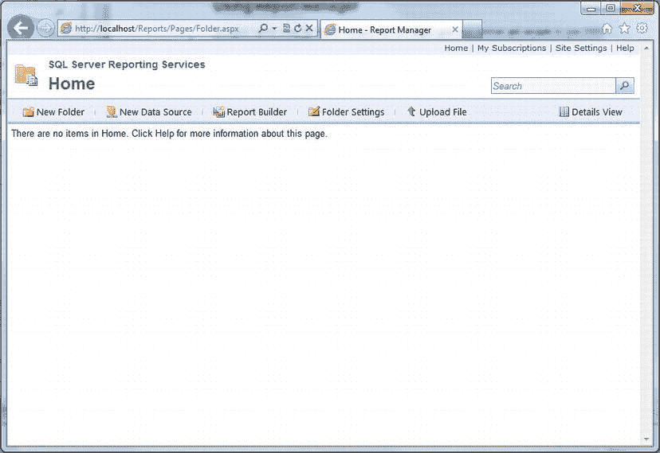

**图 8-1.** 报表管理器

如你所见，报表管理器工具栏上提供了一个“上传文件”选项。选择“上传文件”会打开一个标准的基于浏览器的上传对话框，如图 8-2 所示。

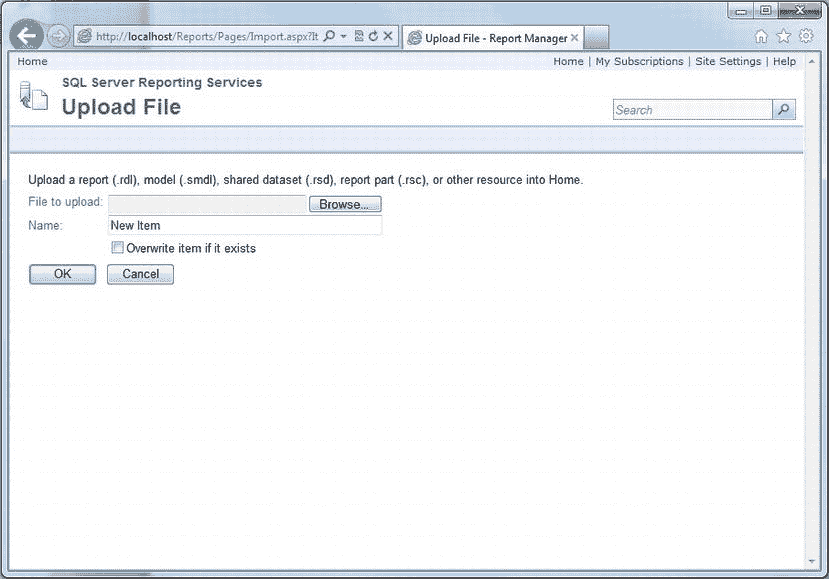

**图 8-2.** 报表管理器“上传文件”对话框

使用此对话框，你可以浏览到要上传的 RDL 文件并进行上传。你也可以在这里上传数据源文件以及 RDS 文件，但它们不会被自动识别为数据源。我们将在本章后面向你展示如何正确创建数据源。

浏览到第 6 章的示例文件，并选择报告文件夹中的`EmployeeServiceCost.rpt`文件上传到你的报表服务器。报表管理器会将文件放入当前文件夹（即你发起上传过程的文件夹）。

请注意，新上传的报告不再像某些旧版 SSRS 那样被标记为“新”。你上传的每个报告在报表管理器界面中都会有一个下拉菜单。此菜单允许你执行一些管理功能并打开属性编辑页面。这个“管理”选项可以在下面的图 8-3 中看到。

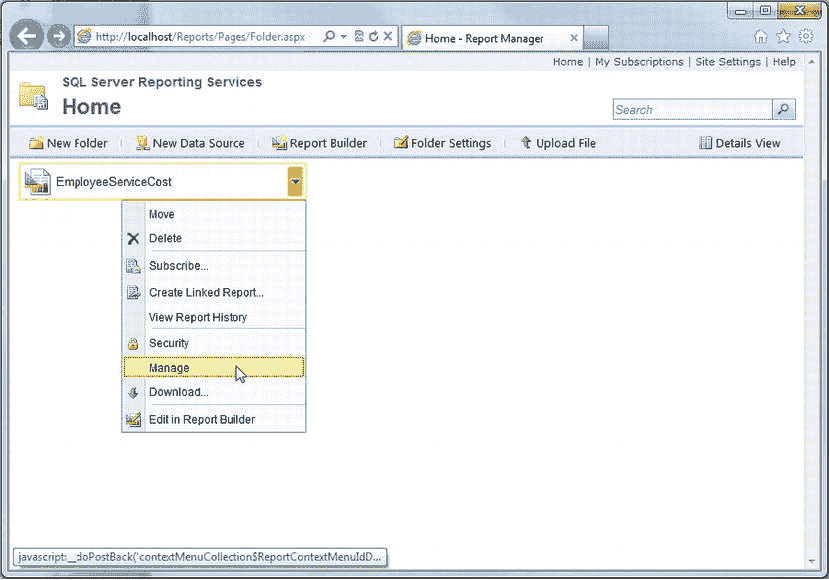

**图 8-3.** 报表管理器及一个最近上传的报告

这个管理选项允许你修改报告的属性，例如名称和描述，如图 8-4 所示。

在图 8-4 的底部中央，有一个复选框，位于“应用”按钮上方，它允许你执行以下操作：

> *在磁贴视图中隐藏报告*：如果你不想让能访问 SSRS 2012 服务器的用户知道某些报告的存在，或者不想让他们看到报告的详细信息，这可能很有用。请记住，这仅在磁贴视图中隐藏报告，而不是在详细视图中隐藏。当你需要防止用户查看文件夹内容或运行他们不应访问的报告时，你应该使用 SSRS 安全属性。

然后，屏幕顶部的菜单允许你：

> *删除报告*：这使你能够删除不再需要的报告。
> 
> *将报告移动到报表服务器上的另一个位置*：这允许你将报告组织到文件夹中，以便进行组织和安全管理。
> 
> *创建链接报告*：此选项允许你基于原始报告创建一个链接报告。这使你可以在服务器上的某个位置保留一份报告用于部署，同时在服务器上的其他位置有多个副本可用，而无需在报告更改时重新部署它们。
> 
> *下载 RDL*：你可以将报告 RDL 下载为文件进行编辑。当你想要对报告进行微小修改（例如更改单词拼写或修改表达式）时，这可能很有用。请注意，此方法仅提供对 RDL 文件的访问；你仍然需要使用另一个程序来编辑文件，然后上传修改后的文件。
> 
> *通过上传 RDL 文件的新副本来替换 RDL*：如果你已经下载并编辑了 RDL 文件，那么此选项允许你上传编辑后的副本。

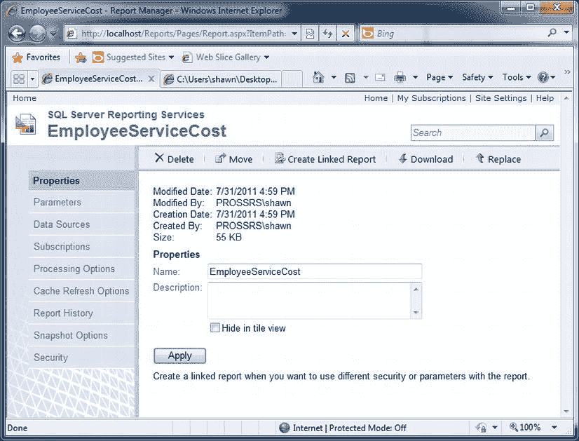

**图 8-4.** 报告属性页面

使用图 8-4 中页面左侧的菜单，你可以执行以下操作：

**注意：** 由于原始文本在此处结束，以下部分未完成。排版到此为止。


## 报表管理功能

*   **修改报表参数**：在“参数”部分，您可以更改报表参数的一些选项，例如默认值、可见性、用户提示和参数显示文本。这种修改参数的能力很方便，因为您无需下载报表即可进行简单的参数更改。

*   **更改数据源**：“数据源”部分允许您更改报表使用的数据源。您可以更改为位于同一服务器上的另一个数据源，或者从头开始创建新的自定义数据源。

*   **管理订阅**：“订阅”部分允许您管理报表的订阅和数据驱动订阅。您可以从该部分创建、删除和修改您的报表订阅。

*   **处理选项**：此部分允许您配置渲染报表时使用的数据缓存选项。它还允许您设置使用报表快照渲染报表，并配置报表超时属性。

*   **缓存刷新选项**：您可以从该部分设置新的缓存刷新计划或对当前计划进行修改。这些计划将创建刷新作业，用于更新供报表或共享数据源使用的缓存存储。如果您的报表设置为从缓存数据而非实时数据渲染，则将使用此数据。

*   **报表历史记录**：此部分允许您获取报表的快照或查看已渲染报表的历史快照。这些可以手动创建，也可以通过下一节中可配置的快照计划创建。

*   **快照选项**：从该部分，您可以管理快照和快照计划。您可以创建新的快照计划或在共享计划上设置新的快照。您还可以管理快照安全性和快照存储限制的选项。

*   **管理安全设置**：您可以从页面的“安全性”部分管理报表的个别安全设置。默认情况下，报表继承父文件夹的安全设置，但您可以从此菜单中断该继承（或恢复它）。

 **注意** 您也可以从详细信息视图访问管理部分。

### 使用 Report Builder 3.0

在 `Reporting Services 2010` 中用于部署报表的另一种方法是新的 `Report Builder 3.0` 应用程序。`Report Builder 3.0` 是一种更用户友好的部署报表方式，它不再使用 `BIDS/Visual Studio`。我们将在下一节介绍使用新的 `BIDS/Visual Studio` 集成工具。您可以从报表管理器 `Web` 界面启动 `Report Builder` 工具。您也可以从 `Microsoft` 网站下载完整安装程序，将 `Report Builder 3.0` 作为一个单独的实用程序安装。Figure 8-5 将让您对这个新工具的视觉外观有所了解。

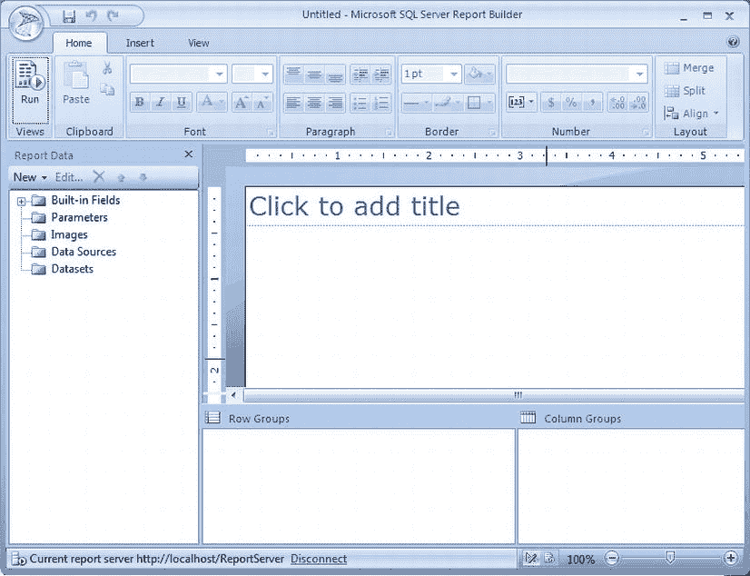

*图 8-5. 新的 Report Builder 3.0 界面*

`Report Builder 3.0` 对于 `Windows 7` 或较新 `Office` 套件的用户来说会感觉更熟悉。该程序的主菜单位于屏幕左上角的“珍珠”（看起来像 `SQL Server` 符号）下方。单击“珍珠”一次以展开菜单并选择“打开”。这将允许您浏览到要打开以进行编辑或部署的报表。该报表可以从本地/远程磁盘上的文件加载，也可以直接从您连接到的报表服务器加载。文件加载后，报表将以设计模式显示在中心窗口中，数据将填充左侧的窗口。从这里，您可以在部署到服务器之前进行任何需要的更改。由于您是从 `Web` 界面打开的报表生成器，请继续从服务器加载报表，您的 `Report Builder` 应类似于 Figure 8-6。

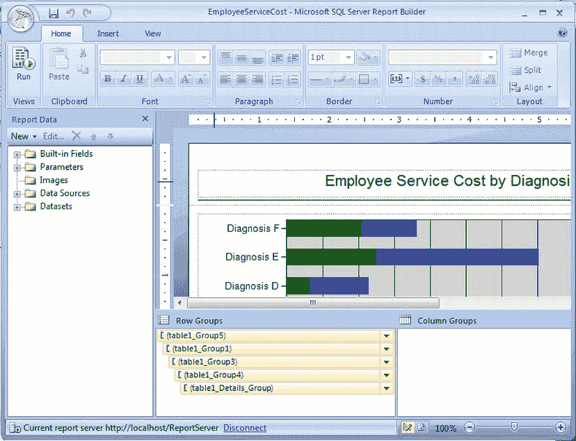

*图 8-6. Report Builder 3.0 中已加载的报表*

您可以在 `Report Builder 3.0` 中执行 `BIDS/Visual Studio 2010` 所包含的大部分功能。通过这个程序，您可以添加数据源、进行报表设计更改、管理参数和部署报表。唯一的缺点是此应用程序一次只允许修改一个报表。要执行大规模部署或管理项目的多个报表，您仍然需要使用 `Visual Studio 2010/BIDS` 或 `RS` 实用程序，我们将在本章后面介绍。要部署您刚刚打开的报表，并假设您是直接从报表服务器打开的报表，请返回“珍珠”菜单并选择“保存”。如果您是从硬盘打开了 `RDL` 文件，则使用“另存为”选项，并确保首先连接到报表服务器。要连接到报表服务器，只需单击 `Report Builder 3.0` 界面底部状态栏中的连接链接。连接到报表服务器后，您可以选择该服务器作为保存报表的目标。请参见 Figure 8-7 查看您将使用的“珍珠”菜单选项。由于我们直接从 `Web` 界面启动了 `Report Builder`，因此我们已经连接到报表服务器，无需指定要发布的服务器。继续对您的报表进行一些小的更改并将其部署，以在报表管理器 `Web` 界面上查看更改。

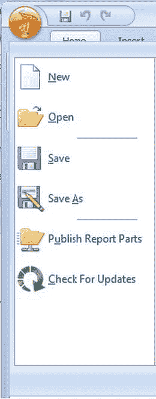

*图 8-7. Report Builder 3.0 保存选项*

## 使用 BIDS 和 Visual Studio 2012

您也可以使用 `BIDS`（`Business Intelligence Development Studio`）中的“部署”选项来部署报表，该选项直接集成到 `Visual Studio 2010` 中。这很方便，因为它是最强大的环境，在大多数情况下，您将使用此工具开发报表。


#### 配置报告部署选项

BIDS/Visual Studio 2010 允许你为解决方案中的每个项目配置一组不同的属性。你还可以为项目可用的每个配置（例如 `Debug`、`DebugLocal` 和 `Release`）设置这些属性。对于报告项目的每个配置，你可以为以下属性定义唯一的值：

> *   起始项：运行报告项目时要在预览窗口或浏览器窗口中显示的报告名称。
> *   `OverwriteDataSets`：一个布尔值，用于配置是否覆盖报表服务器上现有的数据集定义。将此值设置为 `true` 将在部署时覆盖任何数据集定义。
> *   `OverwriteDataSources`：一个布尔值，指示是否覆盖服务器上现有的数据源。将其设置为 `true` 以进行覆盖，这样每次选择 `Deploy` 时都会重新部署你在项目中定义的任何数据源。如果你不希望现有数据源被覆盖，请将其设置为 `false`。
> *   `TargetDataSetFolder`：放置你的共享数据集的文件夹名称，无论是报表服务器路径还是 SharePoint 库。
> *   `TargetDataSourceFolder`：放置你的共享数据源的文件夹名称。
> *   `TargetReportFolder`：放置你的报告的文件夹名称。默认情况下，这是报告项目的名称。
> *   `TargetReportPartFolder`：放置你与其他报告共享的报告部件的文件夹名称。
> *   `TargetServerURL`：目标报表服务器的 URL，例如 `http://localhost/reportserver`。
> *   `TargetServerVersion`：此选项允许你指定部署服务器运行的 SSRS 版本。如果你已经配置了目标服务器 URL，也可以让此选项自动检测版本。

不同的配置对报告开发人员来说很方便，因为你可以在同一个项目中为测试和部署设置不同的服务器和/或文件夹。默认情况下，当你创建报告项目时，BIDS/Visual Studio 2010 会为你创建三种不同的配置：`Debug`、`DebugLocal` 和 `Production`。你可以通过项目的属性页访问这些配置的属性。要进入配置属性页，请在解决方案资源管理器中，右键单击包含报告的项目，然后单击 `Properties`。要查看每个配置选项的属性设置，请从属性对话框顶部的 `Configuration` 下拉列表中选择。图 8-8 显示了 Apress 网站（`http://www.apress.com`）源代码/下载区中本章提供的示例代码的一部分，即第 6 章 解决方案中报告项目的属性页。

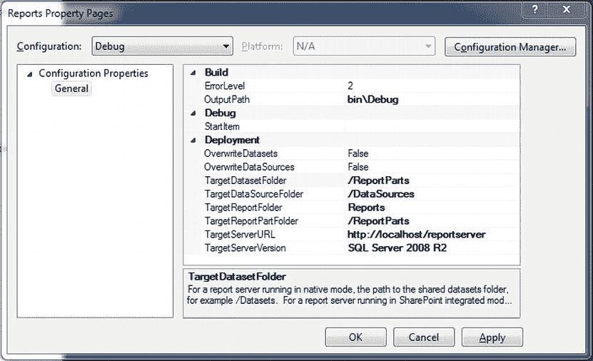

*图 8-8. 项目属性页*

配置信息正确设置后，你可以使用配置管理器中的 `Build` 和 `Deploy` 选项，或者使用解决方案资源管理器将报告部署到服务器。

## 使用配置管理器设置部署

配置管理器中的 `Build` 和 `Deploy` 选项决定了在 Visual Studio 2010 中启动项目时，是构建报告、部署报告，还是两者都做。

要打开配置管理器，请在解决方案资源管理器中，右键单击包含报告的项目，然后单击 `Properties`。然后，单击 `Configuration Manager` 以打开如 图 8-9 所示的对话框。

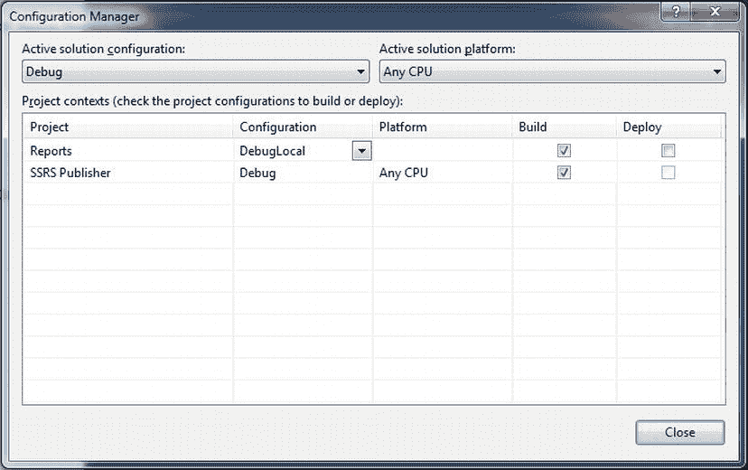

*图 8-9. Visual Studio 2012 配置管理器*

默认情况下，你会看到当前活动配置的设置。你可以通过从 `Active solution configuration` 下拉列表中选择来选择其他配置。如图所示，对于解决方案中的每个项目，在 `Build` 和 `Deploy` 列中都有复选框。

每次启动项目时，你都希望构建它，以便始终运行报告的最新版本。如果 `Deploy` 复选框也被勾选，那么无论何时你在该配置下启动项目，Visual Studio 2012 都会将报告部署到报告项目属性中设置的指定服务器。然而，对于大多数配置，例如当你在本地调试时，你可能不希望每次启动项目时都部署报告，因此保持部署复选框不勾选是你想要的操作。

#### 通过解决方案资源管理器部署报告

一旦你确信你的报告已准备好部署，也可以从解决方案资源管理器手动部署报告。以下是从解决方案资源管理器进行部署的选项列表。你通过右键单击以下每个项目并选择 `Deploy` 来部署报告：

> *   *解决方案：* 将解决方案中所有报表服务器项目中的报告和数据源部署到在各自项目属性中设置的服务器。这将部署解决方案中的所有项目，因此仅在你需要部署所有内容时使用此选项。
> *   *项目：* 将解决方案中特定项目中的报告和数据源部署到在指定项目属性中设置的服务器。此选项仅对报表服务器项目可用。
> *   *报告：* 将项目中单个报告或数据源部署到包含你要部署的报告的项目属性中设置的服务器。

图 8-10 展示了如何部署报告项目中的所有报告的示例。

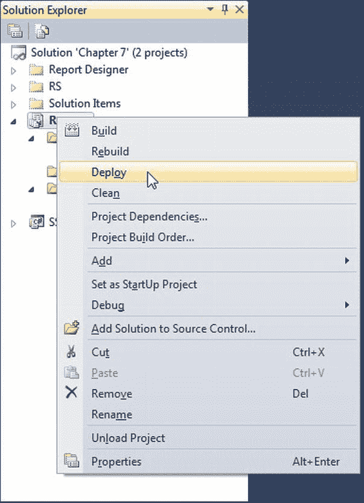

*图 8-10. 通过解决方案资源管理器部署解决方案*


### 使用 rs.exe 实用程序

为了访问 SSRS Web 服务之一，Reporting Services 为我们提供了一个名为`rs.exe`的命令行实用程序。此实用程序使用用 VB .NET 编写的脚本文件（这是唯一可以与`rs`实用程序一起使用的语言）来访问 Web 服务，并允许我们调用 Web 服务中任何已发布的方法。在此示例中，您将通过`rs.exe`实用程序创建文件夹、部署报告并创建新的数据源。

您可以在本书第 8 章代码示例的`RS`文件夹下看到本示例使用的两个文件。您会找到一个包含报告定义的 RDL 文件（将用于部署）和一个包含用于部署报告及创建报告所需数据源的 VB .NET 代码的 RSS 文件。如果您的代码不在`C:\Pro_SSRS\CH8\RS`文件夹中，则需要进行一些配置。

RSS 文件在顶部声明了两个全局变量。这些变量保存了报告将在报告服务器上部署的位置以及您计算机上 RDL 文件存在的位置信息。您可以在清单 8-1 中看到这两个变量。您应根据您的设置对这些变量进行必要的更改。

**清单 8-1. RSS 文件配置**

```vb
Dim parentPath As String = "Pro_SSRS/Chapter 8"
Dim reportPath As String = "C:\Pro_SSRS\CH8\RS\"
```

配置好 RSS 文件后，我们将讨论所使用的三个 Web 服务方法。第一个是`CreateDataSource`。此方法在报告服务器上创建新的数据源，并接受以下五个参数：

> *   `DataSource`: 要创建的数据源的名称
> *   `Parent`: 数据源将在报告服务器上创建的完整路径
> *   `Overwrite`: 一个布尔变量，用于表示是否覆盖同名的现有数据源
> *   `Definition`: 一个`DataSourceDefinition`类型的对象，保存数据源的连接属性
> *   `Properties`: 一个`Property[]`对象的数组，保存数据源的属性名和值

第二个使用的 Web 服务方法是`CreateReport`。此方法在服务器上创建新的报告，并接受以下五个参数：

> *   `Report`: 要创建的报告的名称
> *   `Parent`: 报告将部署到的报告服务器上的完整路径
> *   `Overwrite`: 一个布尔变量，用于表示是否覆盖同名的现有报告
> *   `Definition`: 保存报告定义的字节数组
> *   `Properties`: 一个`Property[]`对象的数组，保存报告的属性名和值

最后一个使用的 Web 服务方法是`CreateFolder`。此方法在服务器上创建新文件夹，并接受以下三个参数：

> *   `Folder`: 要创建的文件夹的名称
> *   `Parent`: 您正在创建的文件夹的父级名称
> *   `Properties`: 一个`Property[]`对象的数组，保存新文件夹的属性名和值

RSS 文件中的`Main`函数调用了三个内部函数：一个利用`CreateFolder`方法，一个利用`CreateDataSource`方法，另一个利用`CreateReport`方法。根据您的需要，您可以使用这三个函数创建更多的文件夹和数据源，或部署更多的报告。在此示例中，我们每个函数调用了一次，但您可以修改此文件以部署任意数量的报告或数据源。您可以在清单 8-2 中看到 RSS 文件的完整代码。

**清单 8-2. RSS 文件内容**

```vb
Dim parentPath As String = "Pro_SSRS/Chapter 8"
Dim reportPath As String = "C:\PRO_SSRS\Chapter 8\RS\"

Public Sub Main()

    ' 初始化 Reporting Services 凭证
    rs.Credentials = System.Net.CredentialCache.DefaultCredentials

       ' 传递我们的路径信息以创建文件夹结构
       CreateFolder(parentPath, "/")

    ' 传递我们的数据源信息到创建数据源函数
    CreateDataSource("Pro_SSRS", "SQL", "data source=(local);initial catalog=Pro_SSRS")

    ' 传递我们的报告名称到部署报告函数
    DeployReport("EmployeeServiceCost")

End Sub

Public Sub CreateDataSource(name As String, extension As String, connectionString As String)
    ' 定义数据源定义。
    Dim dataSourceDefinition As New DataSourceDefinition()

    dataSourceDefinition.CredentialRetrieval = CredentialRetrievalEnum.Integrated
    dataSourceDefinition.ConnectString = connectionString
    dataSourceDefinition.Enabled = True
    dataSourceDefinition.EnabledSpecified = True
    dataSourceDefinition.Extension = extension
    dataSourceDefinition.ImpersonateUser = False
    dataSourceDefinition.ImpersonateUserSpecified = True

    '使用默认提示字符串。
    dataSourceDefinition.Prompt = Nothing
    dataSourceDefinition.WindowsCredentials = False

    Try
        ' 通过 Web 服务方法创建数据源
        rs.CreateDataSource(name, "/" + parentPath, False, dataSourceDefinition, Nothing)

        ' 创建成功时显示成功消息
        Console.WriteLine("数据源 {0} 创建成功", name)
    Catch e As Exception
        ' 如果创建失败，捕获异常并显示结果
        Console.WriteLine(e.Message)
    End Try

End Sub

Public Sub DeployReport(ByVal reportName As String)

    Dim definition As [Byte]() = Nothing
    Dim warnings As Warning() = Nothing   

    Try
        ' 尝试将报告作为文件流打开以读取报告定义信息
        Dim stream As FileStream = File.OpenRead(reportPath + reportName + ".rdl")
        definition = New Byte {}
        stream.Read(definition, 0, CInt(stream.Length))
        stream.Close()

        Try
           ' 尝试通过 Web 服务部署报告
           warnings = rs.CreateReport(reportName, "/" + parentPath, False, definition, Nothing)

           If Not (warnings Is Nothing) Then
               Dim warning As Warning
               For Each warning In warnings
                  Console.WriteLine(warning.Message)
                  Next warning

           Else
               Console.WriteLine("报告: {0} 成功发布，没有警告", reportName)
            End If

        Catch e As Exception
                Console.WriteLine(e.Message)
        End Try

    Catch e As IOException
        Console.WriteLine(e.Message)
    End Try

End Sub

Public Sub CreateFolder(ByVal folderName as String, ByVal ParentFolder as String)
       Dim extraName As String
       Dim newFolder As String

       if( folderName.IndexOf("/") <> -1 )
              newFolder = folderName.Substring(0, folderName.IndexOf("/"))
              extraName = folderName.Substring(folderName.IndexOf("/")+1)
       else
              newFolder = folderName
              extraName = ""
       end if

       Dim props(0) As [Property]
       Dim folderProp As new [Property]()

       folderProp.Name = "文件夹名称"
       folderProp.Value  = newFolder

       props(0) = folderProp

    rs.CreateFolder(newFolder, parentFolder, props)
       Console.WriteLine("文件夹 " + newFolder + " 已创建")

       if( extraName <> "" and parentFolder = "/")
              CreateFolder(extraName, parentFolder + newFolder)
       else if(extraName <> "")
              CreateFolder(extraName, parentFolder + "/" + newFolder)
       end if
End Sub
```


 **注意** 使用 `rs.exe` 工具，您可以轻松地将一组数据源和报表部署到多个 SSRS 服务器。若要使用相同的 RSS 脚本文件进行镜像部署，只需使用不同的服务器参数重新运行 RS 命令即可。创建一个批处理文件，在其中使用不同的服务器目标多次调用 `rs.exe`，是一种轻松将项目以完全相同的方式部署到多个位置的好方法。

唯一被多次调用的函数是我们用户定义的 `CreateFolder` 方法。这是一个递归函数，它将解析您想要创建的文件夹名称，并逐部分构建它。为了节省空间，这里没有进行错误检查。因此，如果您多次运行此示例，您需要清理此函数创建的文件夹，否则由于文件夹已存在，它将引发异常。

在命令提示符中，移动到存储 RDL 和 RSS 文件的目录。在命令提示符中键入以下命令，然后按 Enter 运行它。请将报表服务器 URL 更改以反映您的报表服务器。

```
rs -i PublishReports.rss -s http://localhost/reportserver
```

您可以在图 8-11 中查看命令和结果。

现在，您已经将新的数据源和报表部署到您的报表服务器。示例代码中包含的 RSS 文件可以作为脚本编写您自己的自定义报表项目部署的起点。

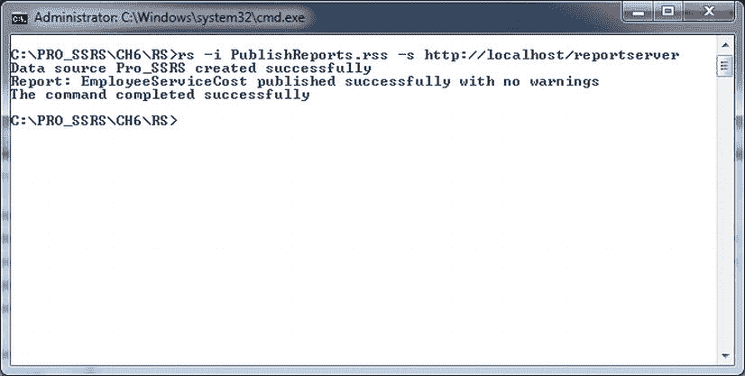

***图 8-11.** 使用 `rs.exe` 工具部署报表和数据源*

## 使用报表服务器 Web 服务

SSRS 2012 提供的用于以编程方式部署报表的方法是使用报表服务器 Web 服务之一（通过 SOAP API，我们将在第 9 章中再次使用它来编写报表查看器）。在本节中，我们将探讨如何使用 Windows 窗体应用程序将报表部署到 SSRS 2012，该应用程序模拟了客户在准备好用于部署的 RDL 文件后需要执行的操作：

> *   选择一个报表服务器来发布他们的报表。
> *   从该服务器上显示的文件夹列表中进行选择，以确定将报表发布到服务器上的哪个文件夹。
> *   浏览到要从本地计算机上传到其报表服务器的 RDL 文件。

在处理 SSRS 2012 时，有多个 Web 服务端点可供您使用。每个 Web 服务的旧版本仍然存在以保持向后兼容性，并且能够分别管理本机模式或 SharePoint 模式的安装。这些旧版本已被弃用，建议升级到最新版本，该版本允许您通过一个 Web 服务控制两种类型的安装。在此示例中，我们将使用最新的管理 Web 服务。

您将使用报表服务器 Web 服务获取服务器上的文件夹列表，然后将报表上传到服务器。在此示例中，您将上传为医疗保健提供者创建的一些报表。在医疗保健环境中，对报表文件夹及其在服务器上的权限进行严格控制非常重要，因此您不允许用户创建新文件夹；他们只能上传到已有权限使用的现有文件夹中。

报表服务器 Web 服务的 `CreateCatalogItem` 方法允许您通过从您提供的 RDL 文件在服务器上创建报表副本来将报表部署到报表服务器。这与前面“使用 `rs.exe` 工具”一节中描述的方法相同。

 **注意** `CreateReportEditSession` 方法可能会通过网络传输敏感数据，包括用户凭据。在进行 Web 服务调用时，应尽可能使用 SSL 加密。

首先，您将使用 Visual Studio 2008 创建一个新的 C# Windows 窗体解决方案。将此项目命名为 `SSRS_Publisher`。此示例将使用 C# 编写，但网站上的源代码示例也将包含一个用 VB.NET 编写的可工作版本。新项目创建后，将 `Form1.cs` 文件重命名为 `Publisher.cs`，并允许 VS 更新所有引用。

### 访问 Web 服务

您需要添加对 SSRS 2012 报表服务器 Web 服务的引用，这与您在第 5 章中为报表查看器所做的操作相同。您可以通过选择“项目”->“添加 Web 引用”，或者在解决方案资源管理器中右键单击“引用”并选择“添加 Web 引用”；或者，您可以在解决方案资源管理器中右键单击项目并选择“添加 Web 引用”。根据您使用的 VS 和 .NET 版本，您可能不会立即看到“添加 Web 引用”的选项。

如果您在那些位置没有看到“添加 Web 引用”的选项，您可能需要使用不同的方法来添加引用。您将需要选择“项目”->“添加服务引用”。在此屏幕中，您将单击窗口左下角的“高级”按钮。在高级设置窗口中，您将单击屏幕左下角的“添加 Web 引用”按钮以调出 Web 引用窗口。

当对话框出现时，输入以下 URL：

[`http://localhost/reportserver/reportservice2010.asmx`](http://localhost/reportserver/reportservice2010.asmx)

如果您使用的是远程服务器，请将上述 URL 中的 `localhost` 替换为您的服务器名称，然后单击 URL 旁边的箭头按钮。此时系统可能会提示您输入凭据，以验证您是否有权访问 Web 服务。您现在应该会看到一个类似于图 8-12 中的对话框。

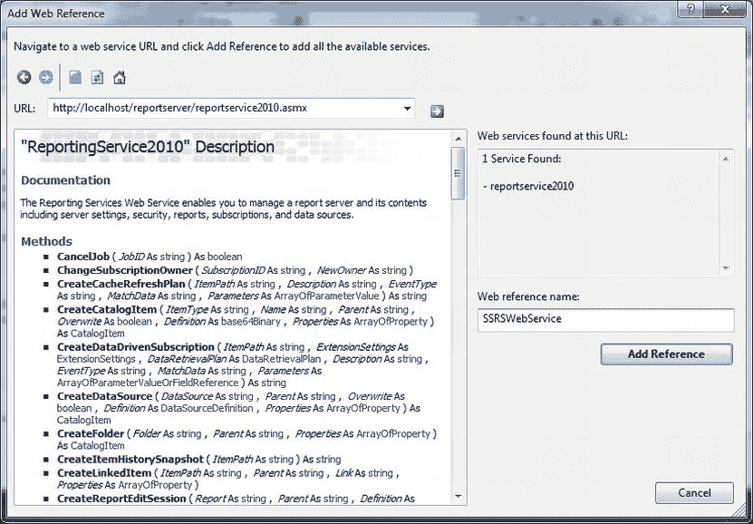

***图 8-12.** “添加 Web 引用”对话框*

在“Web 引用名”文本框中，输入 `SSRSWebService`。此名称是在代码中引用 Web 服务的方式。在此对话框关闭并将引用添加到项目后，在 `publisher.cs` 代码顶部的其他标准 `using` 指令旁边，添加以下 `using` 指令：

```
using SSRS_Publisher.SSRSWebService;
```

现在您可以更轻松地引用 Web 服务，因为您无需输入完全限定的命名空间。您还将在此之下添加另外三个 `using` 指令，使您能够在代码中更轻松地访问 Web 服务和 I/O 特定功能，如清单 8-3 所示。您可以将所有这些组合在一起查看，效果应如图 8-13 所示。

***清单 8-3.** 使用指令*

```
using System.IO;
using System.Text.RegularExpressions;
using System.Web.Services.Protocols;
```

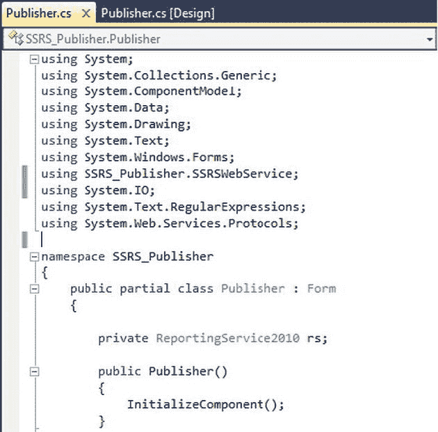

***图 8-13.** 向您的发布者项目添加指令*


#### 布局表单

从工具箱中，在表单顶部附近添加一个标签、一个文本框和一个按钮。将标签文本设置为 `Report server`，并在文本框属性中将其命名为 `reportServer`。将按钮命名为 `getFolders` 并将其文本设置为 `Go`。你将使用 `reportServer` 文本框允许用户输入他们想要部署到的报表服务器名称。

接下来，在表单中心添加一个 TreeView 控件，并将其命名为 `ssrsFolders`。当用户输入服务器名称并单击 `Go` 按钮时，你将使用此控件显示服务器上可用文件夹的列表，以便上传你的报表。

在表单底部附近添加一个标签、一个文本框和一个按钮；将标签文本设置为 `Report file`；将文本框命名为 `reportFile`；将按钮命名为 `browseFile`；并将按钮的文本设置为 `Browse`。你将使用 `reportFile` 文本框接受或显示要上传到指定 SSRS 2012 服务器的报表文件的路径名和文件名。你将使用 `Browse` 按钮来选择接受用户输入并允许他们选择要部署的报表文件的表单。

添加完所有这些控件后，表单应类似于 图 8-14。

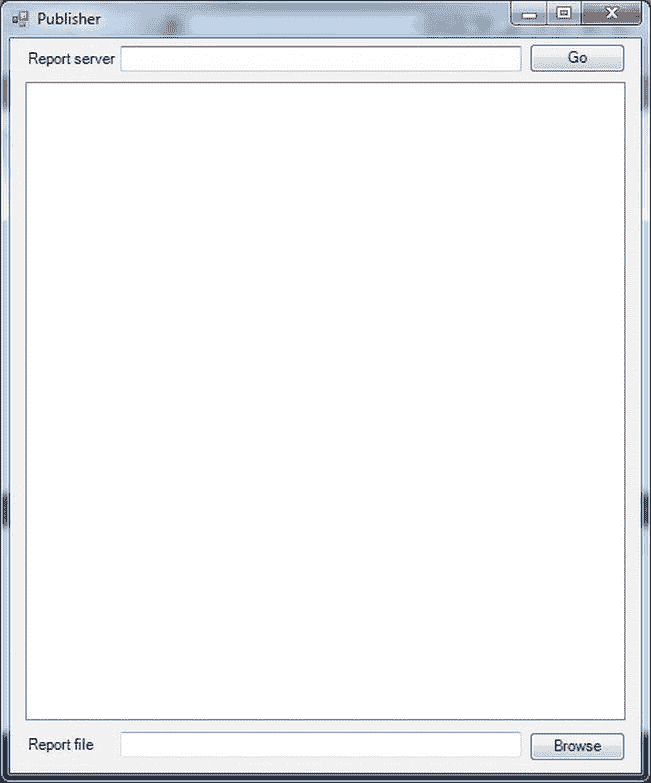

**图 8-14.** 发布器，示例报表发布器

#### 为表单编码

现在表单布局已完成，你将添加代码来处理必要的功能，以允许用户执行以下操作：

- 输入服务器名称。
- 获取该服务器上可用文件夹的列表。
- 选择目标文件夹和要上传的 RDL 文件。

### 允许用户输入服务器名称

当用户在表单中输入服务器名称时，代码需要构建完全标识要部署 RDL 文件的目标 SSRS 2012 服务器的 URL。

首先，你将创建一个类级别的变量来保存对报表服务器的引用，就像你在 第 5 章 的 SSRS 查看器中所做的那样。你通过将变量定义 `private ReportingService2010 rs;` 添加到类中来实现这一点，如 清单 8-4 所示。

**清单 8-4.** 上下文中的类级别变量

```csharp
public partial class Publisher  :   Form {
private ReportingService2010 rs;
public Publisher()
```

要基于用户输入构建标识服务器的 URL，你首先要实例化报表服务器 Web 服务，然后将 `URL` 属性设置为反映用户输入到 `reportServer` 文本框中的服务器名称。我们希望为用户构建此 URL，因此他们只需输入服务器名称即可连接。

为此，首先创建一个简短的函数来检查用户输入的服务器名称，然后将剩余的路径名附加到 Reporting Services Web 服务，以构成引用所需服务器上 Reporting Services Web 服务所需的完整 URL。通过根据用户的输入构建 URL，你可以在用户有权执行此操作的任何 SSRS 2012 服务器上使用报表部署应用程序来部署报表。首先将 清单 8-5 中所示的代码添加到 `Publisher` 类中。

**清单 8-5.** 获取报表服务器 URL

```csharp
private string GetRSURL() {
        if (reportServer.Text.StartsWith("`Error! Hyperlink reference not valid.`"))
                return reportServer.Text + "/reportserver/ReportService2010.asmx";
        else
                return "`Error! Hyperlink reference not valid.`" + reportServer.Text +
        "/reportserver/ReportService2010.asmx";
}
```

#### 用文件夹列表填充 TreeView 控件

现在，你将使用 Reporting Services Web 服务从服务器检索对象列表，并使用它们来填充 `ssrsFolders` TreeView 控件。我们将通过调用报表服务器 Web 服务的 `ListChildren` 方法来实现这一点。`ListChildren` 方法接受两个参数：

- `Item`：父文件夹的完整路径名。
- `Recursive`：一个布尔表达式，指示是否返回指定项目下的整个子项树。默认值为 false。

 **注意** `ListChildren` 方法返回报表服务器上的所有对象，包括数据源、报表部件和报表，而不仅仅是文件夹。在此示例中，你将过滤掉除文件夹之外的所有内容，因为你只对向用户显示文件夹结构感兴趣。你通过使用子对象的 `ItemType` 属性，然后对照字符串 "Folder" 进行测试来实现这一点。

确保 `Publisher.cs` 表单在设计视图中打开，然后双击 `Go` 按钮。这将创建一个处理按钮单击事件的空方法。将 清单 8-6 中的代码添加到该方法中。

**清单 8-6.** 填充 TreeView 控件的代码

```csharp
ssrsFolders.Nodes.Clear();
rs = new ReportingService2010();
rs.Credentials = System.Net.CredentialCache.DefaultCredentials;
CatalogItem[] items = null;
rs.Url = GetRSURL();

TreeNode root = new TreeNode();
root.Text = "Root";
ssrsFolders.Nodes.Add(root);
ssrsFolders.SelectedNode = ssrsFolders.TopNode;

// 从服务器检索项目列表
try
{
          items = rs.ListChildren("/", true);
          int j = 1;

          // 遍历项目列表并找到所有文件夹并将其显示给用户
          foreach (CatalogItem ci in items)
          {
                   if (ci.TypeName == "Folder")
                   {
                             Regex rx = new Regex("/");
                             int matchCnt = rx.Matches(ci.Path).Count;
                             if (matchCnt > j)
                             {
                                      ssrsFolders.SelectedNode =ssrsFolders.SelectedNode.LastNode;
                                      j = matchCnt;
                             }
                             else if (matchCnt < j)
                             {
                                      ssrsFolders.SelectedNode =ssrsFolders.SelectedNode.Parent;
                                      j = matchCnt;
                             }
                             AddNode(ci.Name);
                   }
          }
}

catch (SoapException ex)
{
        MessageBox.Show(ex.Detail.InnerXml.ToString());
}
catch (Exception ex)
{
        MessageBox.Show(ex.Message);
}

// 确保用户默认能看到根文件夹被选中
ssrsFolders.HideSelection = false;
```

在 `Go` 按钮单击事件方法的下方，添加如 清单 8-7 所示的以下方法。

**清单 8-7.** `AddNode` 方法

```csharp
private void AddNode(string name) {
        TreeNode newNode = new TreeNode(name);
        ssrsFolders.SelectedNode.Nodes.Add(newNode);
}
```

你通过传入 "/" 作为起点来告诉 `ListChildren` 方法从根文件夹开始，并将递归选项设置为 true，这会导致 `ListChildren` 方法遍历 SSRS 2008 服务器上的所有文件夹和子文件夹。你使用此信息在 TreeView 控件中创建节点，以层次结构显示每个文件夹，该层次结构代表服务器上文件夹的层次结构。使用正则表达式查找每个 `CatalogItem` 路径中 "/" 字符的数量，以确定你在层次结构中的深度（一级、两级等）。


#### 浏览 RDL 文件并将其上传到服务器

现在，你需要添加一些代码，允许用户浏览他们想要上传的文件。你应该默认将用户限制为浏览以 “rdl” 结尾的文件，因为这是 SSRS 2008 报表定义文件的原生扩展名。你还需要读取 `ssrsFolders` `TreeView` 中选定的节点，以便知道用户选择在 SSRS 2008 服务器上将报表部署到哪个文件夹。

首先，从 `TreeView` 控件读取选定节点的路径，并将其转换为可用于 SSRS 2012 的 `CreateCatalogItem` 方法的路径名。

请确保以设计视图打开 `Publisher.cs` 窗体，然后双击“浏览”按钮。这将创建一个用于处理按钮单击事件的空方法。将清单 8-8 中的代码添加到该方法中。

**清单 8-8.** 用于浏览 RDL 文件的代码
```csharp
private void browseFile_Click(object sender, EventArgs e)
{
    // 从 TreeView 控件获取完整路径名
    string pathName = ssrsFolders.SelectedNode.FullPath;

    if (pathName == "Root")
        pathName = "/";
    else
    {
        // 从路径中剥离 Root 名称，并为使用 SRS 修正路径分隔符
        pathName = pathName.Substring(4, pathName.Length - 4);
        pathName = pathName.Replace(@"\", "/");
    }

    byte[] definition = null;
    Warning[] warnings = null;
    string warningMsg = String.Empty;

    OpenFileDialog openFileDialog = new OpenFileDialog();
    openFileDialog.Filter = "RDL files (*.rdl)|*.rdl|All files (*.*)|*.*";
    openFileDialog.FilterIndex = 1;
    if (openFileDialog.ShowDialog() == DialogResult.OK)
    {
        try
        {
            // 读取文件并将其放入字节数组以传递给 SRS
            FileStream stream = File.OpenRead(openFileDialog.FileName);
            definition = new byte[stream.Length];
            stream.Read(definition, 0, (int)(stream.Length));
            stream.Close();
        }
        catch (Exception ex)
        {
            MessageBox.Show(ex.Message);
        }

        // 我们将使用 rdl 文件的名称作为报表的名称
        string reportName = Path.GetFileNameWithoutExtension(openFileDialog.FileName);
        reportFile.Text = reportName;

        // 现在让我们使用这些信息来发布报表
        try
        {
            rs.CreateCatalogItem("Report", reportName, pathName, true, definition, null, out warnings);

            if (warnings != null)
            {
                foreach (Warning warning in warnings)
                {
                    warningMsg += warning.Message + "\n";
                }
                MessageBox.Show("Report creation failed with the following warnings:\n" + warningMsg);
            }
            else
                MessageBox.Show(String.Format("Report: {0} created successfully with no warnings", reportName));
        }
        catch (SoapException ex)
        {
            MessageBox.Show(ex.Detail.InnerXml.ToString());
        }
    }
}
```

该代码首先从 `ssrsFolders` `TreeView` 控件获取用户选择在 SSRS 2012 服务器上放置报表的完整路径，剥离路径开头的单词 *Root*，然后将字符串中所有出现的反斜杠替换为 SSRS 2012 所需的正斜杠。

然后，你为 `openFileDialog` 控件设置选项，使其默认浏览具有 RDL 扩展名的文件，然后向用户显示对话框。如果用户进行了选择，则使用 `FileStream` 对象打开该文件并从流中读取到字节数组中。这是因为 SSRS 2012 的 `CreateCatalogItem` 方法期望 RDL 文件的内容以字节数组的形式传入。

接下来，读取用户选择的文件名并将其用作 SSRS 2012 中报表的标题。有了标题后，你就拥有了上传报表所需的一切，这通过调用 `CreateCatalogItem` 方法并传入你创建的值来完成。你可以在清单 8-8 的末尾看到，为完整清单添加了必要的代码。


### 运行应用程序

现在让我们来运行这个示例。启动项目，当表单显示时，在“服务器”文本框中输入你的报表服务器名称，然后点击“执行”。本例中使用 Localhost；如果你的服务器名称不同，请使用你的服务器名称。你的表单现在看起来类似于 图 8-14，你的 SSRS 2012 服务器上的文件夹列表会被显示出来，并且 Root 文件夹被高亮。

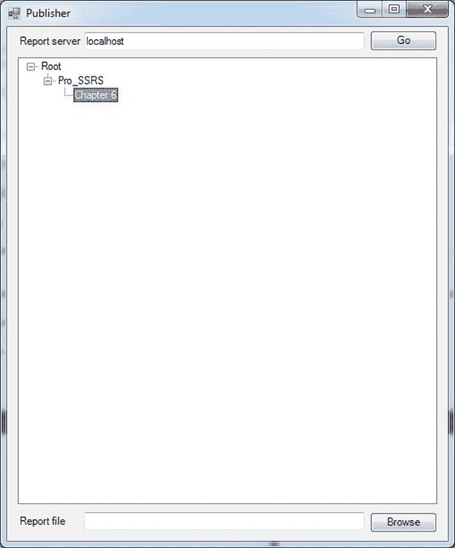

***图 8-15.** 完整的报表发布器，显示 SSRS 服务器上的文件夹*

 **注意** 在上传 第 8 章 示例代码中包含的示例报表之前，你需要部署共享数据源。该报表使用了此共享数据源，并会提示无法发布报表，因为它无法在 SSRS 2012 服务器上找到共享数据源。另请注意，本章中的共享数据源位于本地的 第 8 章 文件夹中，而不是我们一直在使用的 Pro_SSRS 文件夹。我们这样做是因为，当使用 SSRS Publisher 上传报表时，只有共享数据源与你部署报表的目标文件夹相同时，它才会建立到共享数据源 `Pro_SSRS` 的连接。

默认情况下，服务器上的 Root 文件夹已被选中。向下钻取并选择 `TreeView` 中的 `Pro_SSRS` 节点。选择要使用的文件夹后，点击“打开”，然后选择 第 8 章 示例代码中包含的 `EmployeeServiceCost.rdl` 文件。当你点击“打开”时，你的报表发布应用程序会使用 Report Server Web 服务的 `CreateCatalogItem` 方法，并将报表发布到选定的服务器。

在这种情况下，选择了 localhost 服务器上的 `Pro_SSRS` 文件夹，我们正在上传一个名为 `EmployeeServiceCost.rdl` 的报表。如果你用 Web 浏览器导航到该文件夹，你会看到与 图 8-16 所示屏幕类似的内容。

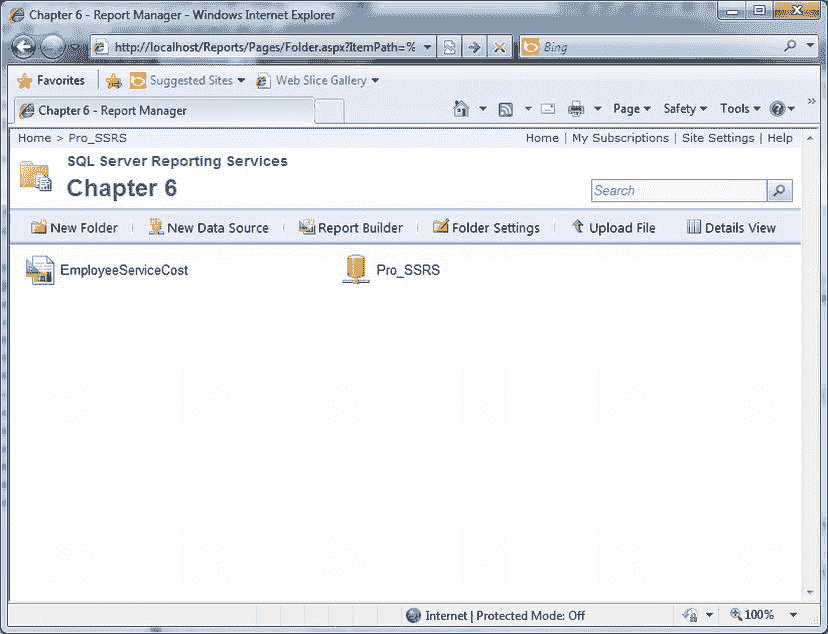

***图 8-16.** Report Manager 显示已上传的报表*

现在你有了一个 Windows Forms 应用程序，它允许将文件上传到你的报表服务器。这是一种便捷的方式，可以在应用程序内部增加上传或更新报表的功能，而无需用户直接与 SSRS 2012 Report Manager 交互。

如果你希望用户从你的应用程序内部与 SSRS 2010 的所有方面进行交互，这可能尤其有用。在 第 5 章 中，你开发了一个允许用户在应用程序内部显示报表的应用程序。通过将该应用程序与此报表发布器结合，你可以直接从你的应用程序处理许多非管理任务。你还可以通过为用户提供一些额外的选项来扩展此示例：

> *   你可以允许用户创建共享数据源。
> *   你可以允许用户输入要发布的报表名称，而不是从 RDL 文件本身获取名称。例如，你可以向表单添加另一个文本框并从中读取报表标题。所以，不是使用以下代码：

```
// 我们将使用 RDL 文件的名称作为报表名称
string reportName = Path.GetFileNameWithoutExtension(openFileDialog.FileName);
```

> 你可以这样做：

```
// 我们将读取文本框 reportTitle 的内容作为报表名称
string reportName = reportTitle.text;
```

> *   你可以允许用户设置报表的其他属性，例如添加一个在 Report Manager 详细列表视图中显示的说明。例如，你可以添加一个 Description 属性：

```
Property[] itemProps = new Property[1];
Property itemProp = new Property();
itemProp.Name = "Description";
itemProp.Value = "按患者划分的员工服务成本";
itemProps[0] = itemProp;
```

> *   然后，你可以将调用 `CreateReport` 的代码从以下内容：

```
rs.CreateCatalogItem("Report", reportName, pathName, true, definition, null, out warnings);
```

更改为以下代码：

```
rs.CreateCatalogItem("Report", reportName, pathName, true, definition, itemProps, out warnings);
```

使用 Report Server Web 服务，几乎没有你做不到的事情。有关可以为报表设置的其他属性的更多详细信息，或要了解有关 SOAP API 的更多信息，请参阅 SQL Server 2012 Books Online。我们将在下一章更深入地研究 Web 服务。

## 总结

在本章中，我们讨论并演示了如何使用 Report Builder 3.0 实用程序、`rs.exe` 应用程序和 BIDS/Visual Studio 将报表部署到你的 SSRS 2012 服务器。此外，你通过 Report Server Web 服务使用了 SOAP API 来列出所选服务器上的文件夹，然后允许用户选择一个 RDL 文件，并使用 Visual Studio C# Windows 应用程序和 `rs.exe` 实用程序将其上传到所选报表服务器上的用户指定文件夹。我们还研究了一些额外的功能，这些功能可以通过使用 SSRS 2012 Web 服务公开的众多方法和属性中的一部分来为应用程序提供。

## 第 9 章


## 从 .NET 应用程序渲染报表

报表渲染是将报表结果输出到特定格式的过程。你需要向 `SSRS` 传递适当的参数，告诉它你想运行哪个报表，以及可选地指定输出格式、任何用户凭据和实际的报表参数。`SSRS 2012` 随后渲染报表并返回结果。

你传递这些参数的方式以及结果返回的方式，取决于你用于渲染报表的 `SSRS 2012` 方法。一旦 `SSRS` 获得了所需的信息（基于你运行的特定报表），它就会查询相应的数据源。`SSRS 2012` 会酌情使用传递的凭据和参数，将报表渲染成一种中间格式，然后将此中间格式渲染并过滤成最终请求的显示格式。

使用 `SSRS 2012`，你可以从 `.NET` 应用程序中通过三种方式渲染报表：

### 使用 URL

你可以构建一个 `URL`，让客户端能够访问报表服务器上的报表，并提供任何适当的参数，包括渲染格式、登录信息、报表条件和报表筛选器。这是最灵活的方法之一，因为它几乎适用于任何可以托管或使用 Web 浏览器或 Web 浏览器控件的语言和平台。事实上，它适用于任何能够创建格式正确的 `URL` 并能使用该 `URL` 启动 Web 浏览器的语言。我们可以使用 `.NET` 中内置的 `WebBrowser` 控件和格式化的 `URL` 来渲染报表。

### 使用 SOAP API

你可以使用 `SOAP API`（也称为报表服务器 Web 服务）来渲染报表。它将渲染后的数据作为流返回，然后你再进行显示。这是一种更困难的渲染方法，因为你从服务器获得的信息本质上是二进制数据流，并且你无法受益于服务器-浏览器组合来完成实际显示数据的工作。但是，你可以使用报表服务器 Web 服务做更多的事情：你可以用它来访问报表服务器的全部功能。我们将展示如何在你的解决方案中使用报表服务器 Web 服务，以提供有关你正在渲染的报表的信息，例如报表所使用的报表参数。

### 使用报表查看器控件

你可以使用 `Report Viewer control`。`SSRS 2012` 的这个选项提供了一个易于使用的 Windows 窗体应用程序或 `ASP.NET` 用户控件，你只需将控件拖放到 Windows 窗体或 Web 窗体上，设置一些属性，即可渲染报表。`Report Viewer control` 的主要优点之一是，它允许你渲染位于 `SSRS 2012` 报表服务器上的报表，也可以在本地渲染报表，而不需要报表服务器。

 注意 `Report Viewer controls` 包含在当前版本的 `SQL Server` 和 `Visual Studio` 中。你也可以为将要运行应用程序但未安装 `Visual Studio`/`SQL Server` 的机器下载可再发行组件包。

虽然 `Report Viewer controls` 可能是大多数 `Visual Studio` 用户用来渲染报表的方法，但最通用的渲染方法是通过 `URL` 访问。在这种情况下，`SSRS 2012` 为大多数报表选项提供了一些默认值。例如，`SSRS` 提供了一个默认的用户界面来输入参数和筛选信息。如果有必要，它会提示你输入登录信息，并且默认以 `HTML` 格式进行渲染。你只需在浏览器中传递报表的 `URL` 即可获得所有这些功能。如果你仅使用 Web 浏览器渲染报表，而没有其他控制应用程序，这是最有用的。

你可以选择随 `URL` 传递参数来更改这些默认行为，提供登录信息，更改渲染格式，隐藏参数工具栏等等。如果你有一个自定义应用程序并希望自己控制这些选项，而不是提供默认用户界面，这会很有用。

你可以使用报表服务器 Web 服务执行许多相同的操作，但没有真正的默认设置，并且返回数据的实际显示方式由应用程序开发人员决定。通过在 `ASP.NET` 应用程序中使用 Web 浏览器，或将其嵌入 Windows 窗体应用程序，你可以获得 `URL` 渲染方法的好处，同时又能对其加以控制。这为用户提供了更集成化的体验。本章介绍的方法在很大程度上适用于 Windows 窗体和 Web 窗体应用程序。对于其中一个项目，我们将展示如何构建一个基于 Windows 窗体的报表查看器，让你可以使用 `SSRS 2012` 作为应用程序的报表解决方案。

在本章中，你将执行以下操作：

### URL 渲染访问

学习如何构建一个 `URL`，客户端应用程序通过它来访问报表服务器上的报表。在示例中，你将使用 Employee Service Cost 报表（可在 Apress 网站的源代码/下载部分找到，网址为 [`www.apress.com`](http://www.apress.com)，包含在本章的代码下载中）。

### URL 报表参数

探索在 `URL` 中指定的报表参数，这些参数控制报表的渲染方式。你可以指定实际格式（例如 `HTML` 或 `PDF`）。你可以指定渲染报表中的特定页面，或者你可以搜索特定单词并从该页面开始渲染。

### URL 查看器应用程序

构建一个简单的 `.NET` Windows 窗体应用程序，通过嵌入窗体的 `WebBrowser` 控件访问和渲染报表。

### 报表服务器 Web 服务调用

使用对报表服务器 Web 服务的调用来查询报表条件和筛选参数。这允许你在 Windows 窗体应用程序上显示这些信息。然后，你将再次使用 `SOAP API` 来查看参数是否有可供用户选择的值列表。如果有，你将使用这些值为每个参数填充组合框。你还将给用户一个组合框来选择渲染格式。然后，你将向用户显示所有选择，并使用他们选择的值来创建一个包含运行报表所需的所有信息的 `URL`。最后，你将使用这个 `URL` 和嵌入的 Web 浏览器，根据用户输入的报表参数和渲染命令来渲染报表。

### 报表查看器控件，服务器端模式

使用 `Report Viewer control`，利用该控件的服务器端模式渲染相同的报表。

### 报表查看器控件，本地渲染

使用 `Report Viewer control` 和本地填充的数据集，在没有 `SSRS` 报表服务器的情况下在本地渲染报表。

### 在 ASP.NET 应用程序中使用报表查看器控件

使用 `Report Viewer control` 渲染服务器端报表。我们将利用 Web 服务来检索可供选择的报表列表。

在运行包含的示例之前，请务必阅读 `ReadMe.htm`。它位于示例根文件夹中的一个文件里。如果你在 `Visual Studio` 中打开代码，它将在“解决方案项”文件夹下。它包含了运行示例之前所需的设置和配置步骤。


## 实现 URL 访问

在本节中，我们将向您展示如何构建一个 URL，以便访问报告服务器上所需的报告，并向报告传递适当的参数。

整个 URL 的语法分为两部分。第一部分指定报告文件的路径，第二部分指定参数。完整的 URL 语法如下：

```
http://server/virtualroot?[/pathinfo]&prefix:param=value[&prefix:param=value]...n
```

以 SharePoint 集成模式安装的 SSRS 的语法将类似于：

```
http://server/subSiteName/_vti_bin/reportserver?[/pathinfo]&prefix:param=value[&prefix:param=value]...n
```

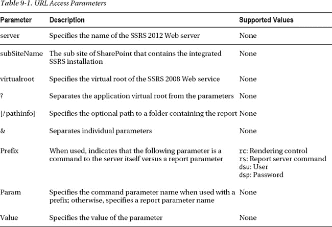

现在，我们将引导您逐步构建一个用于访问员工服务成本报告的 URL。

## URL 报告访问路径格式

如前一节所述，访问相应报告的路径以报告服务器本身的名称开头；在本例中，我们将使用 `http://localhost` 并采用本机模式的 SSRS 安装。其后是 SSRS 2012 虚拟根文件夹的名称（例如 `/reportserver`，这是安装时的默认文件夹）。

`注意` `/reports` 虚拟根文件夹映射到 SSRS 2012 自带的报告管理器应用程序。如果您导航到此 URL，您会发现它通过报告管理器列出了您报告服务器上文件夹及其内的报告。

然后，您在路径后添加 `?`，以告知 SSRS 2012，URL 之后的所有内容都是参数。接下来是可选的路径信息，您可以在其中指定用于组织报告的基础文件夹内的任何子文件夹，例如 `/Pro_SSRS/Chapter_9`。最后，是实际报告的名称，例如 `EmployeeServiceCost`。

因此，在本例中，访问员工服务成本报告的完整路径如下：

```
http://localhost/reportserver?/Pro_SSRS/Chapter_9/EmployeeServiceCost
```

现在，我们将介绍 URL 中指定任何必要参数的部分。

#### URL 参数和前缀

您现在需要向报告传递适当的参数。您需要关注几类参数：

> *报告参数（无前缀)*：这些参数提供给报告的底层查询，用于在报告呈现时作为信息的筛选器。因此，它们精确控制报告显示哪些数据。
>
> *HTML 查看器参数 (`rc:`)*：这些参数控制基于 Web 的报告查看器的哪些功能处于活动状态，以及报告查看器从哪一页开始显示报告。例如，您可以使用 `FindString` 参数让查看器从第一个找到特定单词的页面开始显示报告。
>
> *报告服务器命令参数 (`rs:`)*：这些参数控制所发出的请求类型以及返回报告的格式。例如，我们将展示如何使用 `rs:Command=Render&rs:Format=HTML4.0` 参数在报告查看器中以 HTML 格式呈现您的报告。
>
> *报告查看器 Web 部件命令参数 (`rv:`)*：这些参数控制 SharePoint 集成的 Web 部件。它们与 HTML 查看器参数非常相似，因为它们将控制您在 SharePoint 站点上查看报告的门户。例如，您可以使用 `AsynchRender` 参数控制报告是异步还是同步呈现。除了 `rv:` 组之外，Web 部件还可以接受 `rs:ParameterLanguage` 参数。

## 报告参数

报告参数是实际传递给底层报告的参数，而不是发送给报告服务器的指令。也就是说，您使用它们向报告传递条件，例如开始和结束日期、员工 ID 等。您可以将这些参数传递给报告的查询，它们是在您为数据源指定参数时创建的。您还可以在报告中将参数用作变量和筛选器的值。

## HTML 查看器命令

您使用 HTML 查看器命令告诉 SSRS 2012 如何呈现报告。您可以使用表 9-2 中的命令来控制查看器向用户显示的方式，以及控制报告在查看器中显示的某些方面。

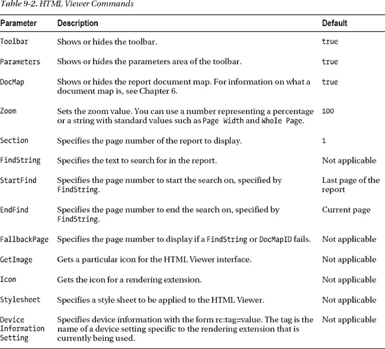

## 报告服务器命令参数

报告服务器命令参数以 `rs:` 为前缀，用于告知报告服务器所发出的请求类型（参见表 9-3）。您使用它们以 XML 和 HTML 格式检索报告和数据源信息，并检索子元素，例如当前文件夹的报告名称。您还使用命令参数告诉服务器您想要呈现报告以及以何种格式呈现，以及是否希望基于现有的快照呈现该报告。

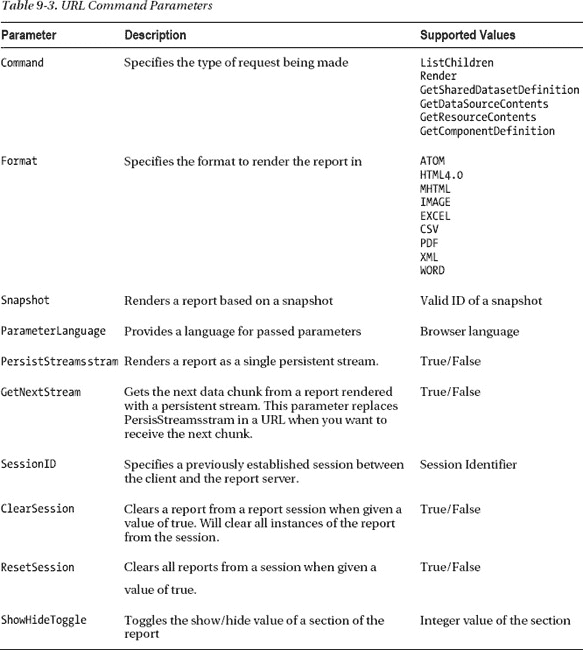

## 凭据参数

如果您在之前版本的 Reporting Services 中使用凭据参数来传递数据源连接信息，则必须修改这些报告才能将它们升级到 SSRS 2012 服务器。以前用于向报告服务器传递用户名和密码信息以进行呈现的凭据参数是以明文形式存储在浏览器缓存中的。这非常不安全，因此这组参数已从 SSRS 2012 中移除。

## 报告查看器 Web 部件命令

报告 Web 部件查看器命令以 `rv:` 为前缀，用于定位在 SharePoint 模式下用于查看报告的 Web 部件。您可以使用这些参数控制报告及其控件在 Web 部件中的显示方式。您还可以使用这些参数控制报告的呈现方式。您可以在表 9.4 中查看这些参数。

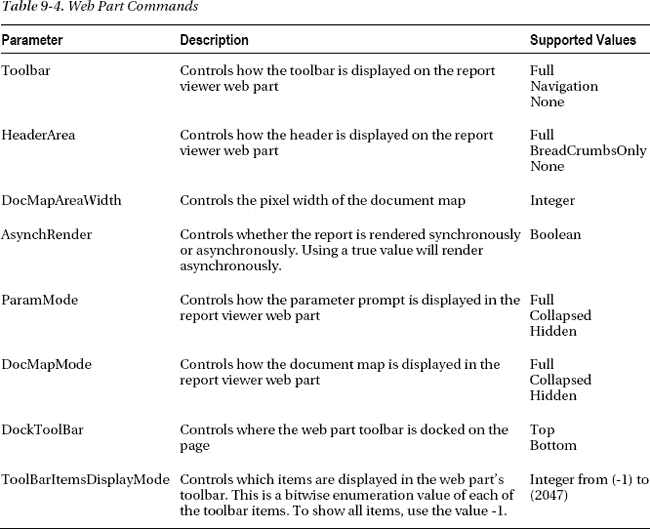


#### 示例 URL

现在你已检查了 URL 的每个组成部分，查看几个完整的示例 URL 会很有帮助。你需要从本章下载的示例中包含 `readme.html` 文件来正确设置报告。下面的 URL 以 HTML 4 格式呈现报告，并通过将 `rc:Toolbar` 参数值设置为 `false` 来隐藏 HTML 查看器工具栏，同时将服务年份参数设置为 2009：

`http://localhost/reportserver?/Pro_SSRS/Chapter_9/EmployeeServiceCost&rs:Command=Render&rs:Format=HTML4.0&rc:Toolbar=false&ServiceYear=2009`

下一个示例传递了 `ServiceYear` 为 2009 的报告参数，并隐藏了用户提供的参数的输入显示：

`http://localhost/reportserver?/Pro_SSRS/Chapter_9/EmployeeServiceCost&rs:Command=Render&rs:Format=HTML4.0&rc:Parameters=false&ServiceYear=2009`

下一个使用 `rs:Format` 参数将默认输出格式设置为 PDF，服务年份为 2009：

`http://localhost/reportserver?/Pro_SSRS/Chapter_9/EmployeeServiceCost&rs:Command=Render&rs:Format=PDF&serviceyear=2009`

此示例隐藏了报告文档地图：

`http://localhost/reportserver?/Pro_SSRS/Chapter_9/EmployeeServiceCost&rs:Command=Render&rc:DocMap=false&ServiceYear=2009`

最后一个示例——适用于你可能尚未设置的 SharePoint 集成模式——将隐藏工具栏：

`http://localhost/_layouts/ReportServer/RSViewerPage.aspx?rv:RelativeReportUrl=/Chapter 9/EmployeeServiceCost.rdl&rv:Toolbar=None`

你已经简要了解了在本机模式和 SharePoint 模式下通过 URL 呈现报告所需的命令。在本章的剩余部分，我们将展示如何创建你自己的报告查看器以及使用报告查看器控件。自定义查看器将使用 URL 命令将 SSRS 2012 报告集成到基于.NET Windows Forms 的应用程序中，而报告查看器控件将在 ASP.NET 网页中使用。

## 将 SSRS 2012 与 .NET 应用程序集成

既然你对 URL 访问的工作原理有了一些了解，你将学习如何呈现报告。你将从构建一个 Windows Forms SSRS 2008 查看器应用程序开始，该应用程序使用.NET 2.0 `WebBrowser` 控件和 URL 访问来为你的应用程序呈现报告。

## 使用 WebBrowser 控件构建自定义报告查看器

我们将展示如何创建一个简单的 Windows Forms 应用程序，其中包含嵌入式浏览器，你将使用它来查看报告。

##### 创建查看器窗体

在此示例中，你将使用 C#创建查看器应用程序。我们还将在额外的可下载内容中包含用 VB.NET 编写的相同应用程序。请按照以下步骤操作：

> 1.  打开 `Visual Studio 2010`。
> 2.  创建一个新项目。
> 3.  在“新建项目”对话框中，选择 `Visual C#` > `Windows` > `Windows Forms Application`。将其命名为 `SSRS Viewer WBC`。在“解决方案”下，选择“创建新解决方案”，并将其命名为 `Chapter 9`。单击“确定”创建你的项目。

现在你已经创建了项目，你将使用该窗体来创建报告查看器：

> 1.  `Visual Studio 2010` 会向项目添加一个名为 `Form1.cs` 的单个窗体。将该窗体重命名为 `ViewerWBC.cs`。
> 2.  将空白窗体的大小调整为 800×600。
> 3.  从工具箱的“公共控件”部分将 `WebBrowser` 控件添加到窗体中。将其命名为 `WebBrowser`，并将该控件锚定到窗体的顶部、底部、左侧和右侧。调整 `WebBrowser` 控件的大小，使其从窗体的两侧延伸到窗体底部。
> 4.  现在添加一个文本框，并将其命名为 `reportURL`。在文本框之后，添加一个名为 `reportRun` 的按钮，并将按钮文本设置为 `Run`。

你现在应该拥有一个看起来像 `图 9-1` 的窗体。

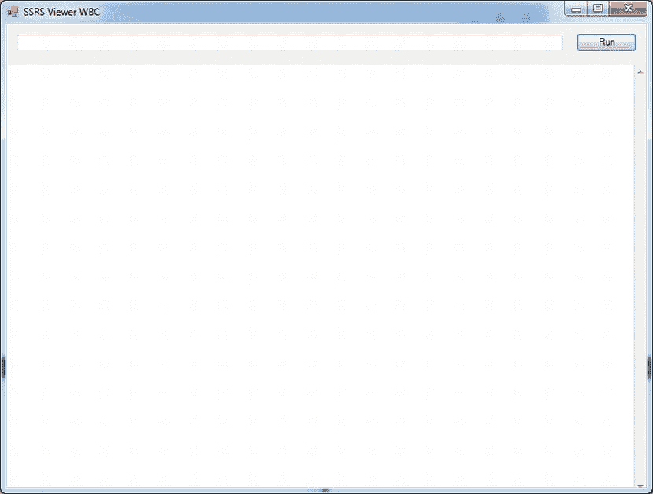

**`图 9-1.`** `ViewerWBC.cs` 窗体

##### 为查看器窗体编写代码

要编写查看器窗体的代码，你将添加必要的代码来使用此自定义报告查看器呈现 SSRS 2012 报告。你需要向按钮的点击事件添加一些代码，以确保你可以浏览并查看现有报告。确保 `ViewerWBC.cs` 窗体在设计视图中打开，然后双击 `Run` 按钮。这将创建一个空方法来处理按钮的点击事件。将 `代码清单 9-1` 中的代码添加到你的 `reportRun_Click` 方法中。

**`代码清单 9-1.`** `reportRun` 点击事件：浏览到 URL

```
private void reportRun_Click(object sender, EventArgs e)
{
    webBrowser.Navigate(reportURL.Text);
}
```

现在在调试模式下运行项目。当窗体显示时，在文本框中输入以下 URL：

`http://localhost/reportserver/?/Pro_SSRS/Chapter_9/EmployeeServiceCost&rs:Command=Render`

现在单击 `Run`。这将呈现“Employee Service Cost”报告。一旦报告开始在 Web 浏览器对象中呈现，系统将提示你提供参数。你可能还需要将上述 URL 中的 `localhost` 替换为你的报告服务器的名称。此时，你应该会看到类似 `图 9-2` 的内容。

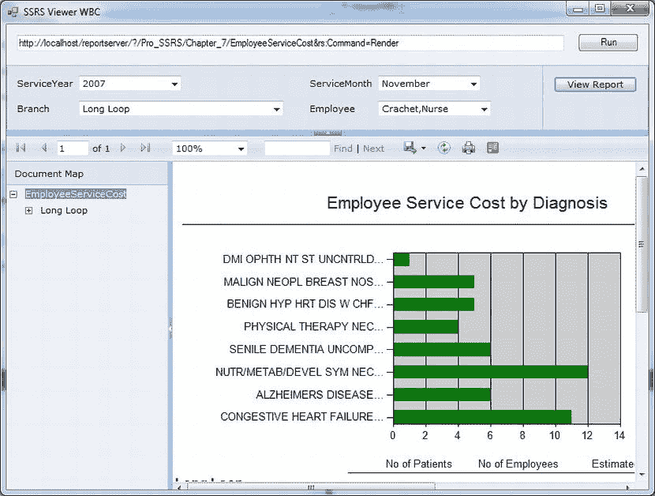

**`图 9-2.`** 运行“Employee Service Cost”报告的 SSRS Viewer WBC 应用程序

接下来，我们将添加一些代码，以便在程序启动时在 URL 文本框中设置一个包含报告路径的默认字符串，这样你就不必每次都键入它。右键单击你的 `ViewerWBC.cs` 文件并选择“查看代码”，以打开你需要添加此代码的部分。

```
public ViewerWBC()
{
    InitializeComponent();
    // 为示例方便设置初始 URL
    reportURL.Text = "http://localhost/reportserver/?/Pro_SSRS/Chapter_9/EmployeeServiceCost&rs:Command=Render";
```

这是一个非常简单的应用程序，使用了每个用户的客户端上都应可用的简单控件。你可以将这种类型的查看器与我们讨论过的 URL 命令结合使用，将自定义报告查看器包含在你可能构建的任何应用程序中。接下来，我们将使用一个不太常见但更强大的控件将我们的 SSRS 报告集成到 Windows 窗体或 ASP.NET 项目中。


## 使用 Report Viewer 控件构建报表查看器

现在，您将学习如何使用 Report Viewer 控件来呈现相同的员工服务成本报告。这很可能是呈现服务器端报告最受欢迎的方法，并且它还能够基于 RDL 在本地呈现报告，而无需报告服务器。

您可以使用两种 Report Viewer 控件：一种用于 Windows 窗体应用程序，另一种用于 ASP.NET 应用程序。这些控件使您能够更轻松地为 Windows 或 ASP.NET 应用程序添加丰富的报告功能。这些控件提供了 URL 呈现方法的能力，但通过在代码中以 Report Viewer 控件的属性设置大多数选项，使其更易于实现。换句话说，您不需要将它们包含在作为 URL 传递的字符串中。使用控件的另一个主要优点是，在 Visual Studio 2010 IDE 中，您可以获得所有选项的完整 IntelliSense 支持。

表 9-5 列出了 Report Viewer 控件的一些关键属性和方法。

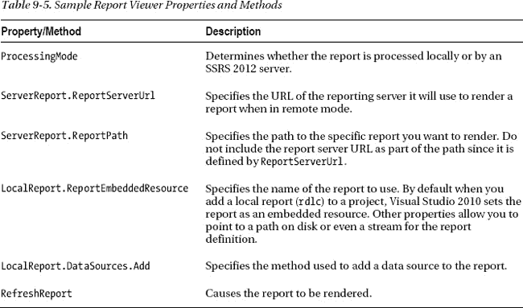

 **注意** 有关 Report Viewer 控件成员以及控件附带的其他属性、方法和事件的更多信息，请参阅 Visual Studio 2010 帮助。

在本示例中，我们将介绍如何使用 Windows 窗体版本的 Report Viewer 控件。

 **注意** 在“使用报表服务器 Web 服务”部分，我们将展示如何扩展应用程序，使其使用 Report Server Web 服务调用来查询报告服务器，以获取报告可以接受的参数以及每个参数可能的值。我们将展示如何使用这些参数为 Windows 窗体应用程序的用户创建下拉列表，然后呈现报告。

#### 创建查看器表单

要在 C# 中创建查看器表单，您将首先通过执行以下步骤向解决方案添加一个新项目：

> 1.  从菜单中选择 **文件**  **添加**  **新建项目**。
> 2.  在“新建项目”对话框中，选择 **Visual C#**  **Windows**  **Windows 窗体应用程序**。将其命名为 `SSRS Viewer RVC`。
> 3.  创建项目后，您将使用将创建报表查看器的窗体：
> 4.  将刚刚创建的默认窗体重命名为 `ViewerRVC.cs`。
> 5.  在解决方案资源管理器中双击 `ViewerRVC.cs` 文件，在设计模式下打开它。
> 6.  将空白窗体的大小调整为大约 800×600 像素，并在属性部分将窗体的文本更改为 `SSRS Viewer RVC`。
> 7.  从工具箱的“Reporting”部分将 Report Viewer 控件添加到窗体。在属性中将控件命名为 `reportViewer`，并将其锚定到窗体的顶部、底部、左侧和右侧。调整控件的大小以填充窗体，但要在顶部留出空间放置更多组件。（如果您没有报表查看器控件，可能需要从以下网址下载：`www.microsoft.com/download/en/details.aspx?id=6610`）
> 8.  现在添加一个文本框，命名为 `reportURL`，紧接着文本框添加三个按钮，分别命名为 `runServer`、`runLocal` 和 `getParameters`。将它们的 `Text` 属性分别设置为 `Run Server`、`Run Local` 和 `Parameters`。

您现在应该有一个看起来像图 9-3 的窗体。

 **注意** 在 Visual Studio 2010 中，您需要使用 .NET Framework 3.5 或更高版本才能在 IDE 中获得 `ReportViewer` 控件。如果使用任何更早的版本，您将无法从工具箱中将查看器添加到项目中。

现在，您将开始添加使用新的 Report Viewer 控件来呈现 SSRS 2012 报告所需的代码。

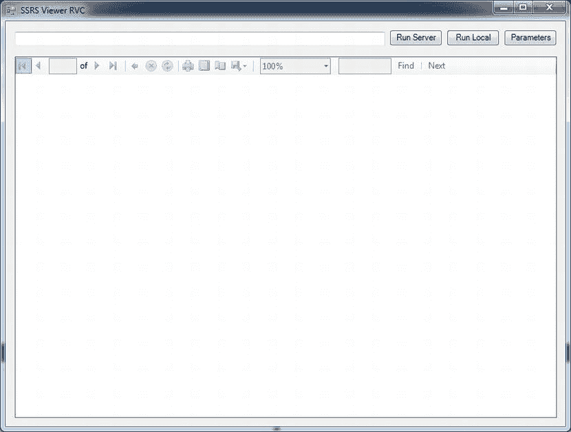

***图 9-3.** ViewerRVC.cs 窗体*

#### 编写查看器表单代码

首先，将新的命名空间 `Microsoft.Reporting.WinForms` 的 `using` 语句添加到类顶部的其他命名空间声明中。这样做将允许您访问该命名空间的成员，而无需在每次使用来自该命名空间的方法或属性时键入完整的命名空间。右键单击 `ViewerRVC.cs` 文件并选择“查看代码”，将此 `using` 语句添加到文件中。

```
using Microsoft.Reporting.WinForms;
```

其次，将清单 9-2 中显示的代码添加到“Run Server”按钮的 `Click` 事件中。确保 `ViewerRVC.cs` 窗体在设计视图中打开，然后双击“Run Server”按钮。这将创建一个空方法来处理按钮的 `Click` 事件。

***清单 9-2.** runServer 点击事件：在远程模式下运行报告*

```
private void runServer_Click(object sender, EventArgs e) {
    reportURL.Text = "/Pro_SSRS/Chapter_9/EmployeeServiceCost";
    reportViewer.ProcessingMode = ProcessingMode.Remote;
    reportViewer.ServerReport.ReportServerUrl = new Uri(@"http://localhost/reportserver/");
    reportViewer.ServerReport.ReportPath = reportURL.Text;
    reportViewer.RefreshReport();
}
```

现在以调试模式运行项目。然后单击“Run Server”。这将呈现员工服务成本报告，您可以在其中输入报告的参数。当然，您需要在清单 9-2 中看到 `localhost` 的地方使用您的报告服务器的名称。此时，您应该看到类似图 9-4 的内容。

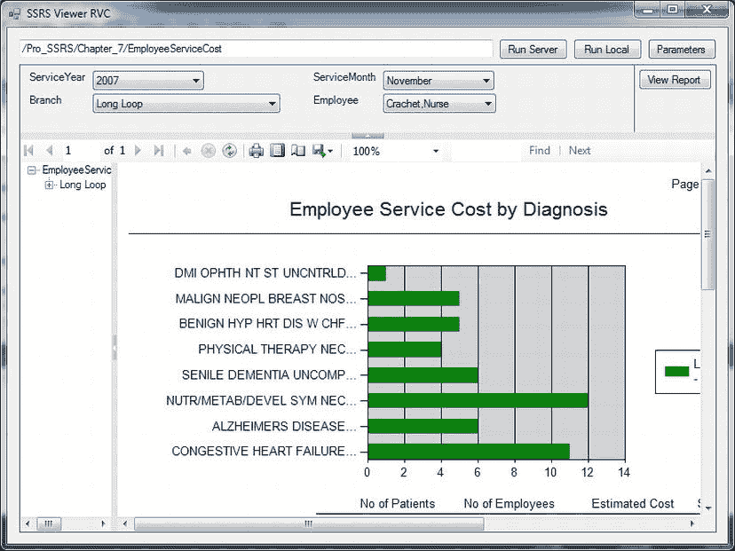

***图 9-4.** SSRS Viewer RVC 运行服务器呈现的报告*

这就是使用 Report Viewer 控件在 SSRS 2012 服务器上呈现报告的全部内容。

### 本地呈现报告

我们现在将介绍如何在不使用 SSRS 2012 服务器的情况下在本地呈现报告。这有点复杂，因为您需要负责用报告所需的数据填充数据源。但是，它确实为开发人员提供了极大的灵活性，因为您可以在没有服务器的情况下使用 SSRS 2012 报告功能。

 **注意** 服务器和本地报表定义文件并非 100% 兼容。这意味着无法将同一个 RDL 源文件同时用于本地和远程使用。实际上，您会注意到，默认情况下，用于服务器端或远程处理的报告创建时使用 `.rdl` 扩展名，而用于客户端或本地处理的报告创建时使用 `.rdlc` 扩展名。虽然它们并非 100% 可互换，但您可以通过对底层 RDL 进行一些更改来将一个用于另一个。

### 创建报表的数据源
首先，你需要通过添加之前创建的数据集来向项目添加数据源。要添加数据源，请按照以下步骤操作：
1.  在“项目资源管理器”中，右键单击项目名称 `SSRS Viewer RVC`，指向 `添加`，然后选择 `现有项`。
2.  导航到包含第 9 章示例的文件夹，并在 `SRSS Viewer RVC` 文件夹中选择 `EmployeePay.xsd`。这是你将用于定义报表数据源的 XML 架构文件。当你将 `.xsd` 文件添加到项目时，它也会出现在“数据源”窗口下。如果你没有看到“数据源”窗口，请从菜单中选择 `数据` > `显示数据源`。

 **注意** 或者，你本可以使用通过选择 `数据` > `添加新数据源` 找到的数据源配置向导。使用它，你可以创建多种类型的数据源，包括那些源自数据库、Web 服务甚至对象的数据源。请记住，就像本例一样，由你负责检索数据并用其填充数据源。

接下来，你将创建一个本地 RDL 文件（`.rdlc`），该文件将使用报表查看器控件在本地处理模式下进行渲染。

### 设计报表
要设计报表，请按照以下步骤操作：
1.  要向项目添加报表，请在“解决方案资源管理器”中右键单击项目名称—`SSRS Viewer RVC`。
2.  在快捷菜单中，选择 `添加` > `新建项`。这将打开“添加新项”对话框。
3.  在左侧列表中选择“报表”部分，然后单击“报表”图标，输入文件名 `EmployeePay.rdlc`，然后单击 `添加`。这将在 Visual Studio 中启动报表设计器功能。`.rdlc` 扩展名表示它是用于客户端或本地渲染的报表。
4.  确保报表被选中。打开“工具箱”。从“工具箱”中，将“表”报表项拖放到报表上。
5.  现在应该会弹出“数据集属性”窗口。在此窗口中，从“数据源”下拉列表中选择 `Employees` 选项。你将看到来自此数据源的字段填充在右侧的“字段”数据网格中。将此数据集命名为 `Employees_EmployeePay`，然后单击 `确定`。
6.  你现在应该在报表设计器中看到该表。在第一列的“数据”行中，单击右上角字段图标以选择一个字段。在第一列中选择 Employee ID 字段。
7.  对第二列和第三列重复此操作。分别为第二列和第三列选择 `StartDate` 和 `Amount`。
8.  在报表顶部添加一个文本框，并使用文本 “Employee Pay Report” 作为其值。

你现在应该拥有一个类似于图 9-5 的报表。

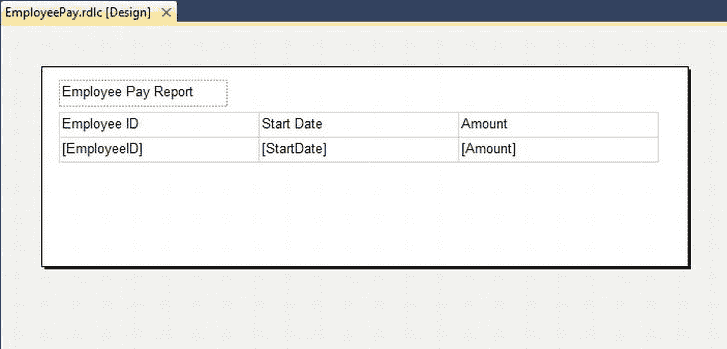

**图 9-5.** 设计器中的本地报表

现在，你拥有一个使用你创建的数据集作为数据源的报表。将清单 9-3 中所示的代码添加到 `runLocal` 按钮的单击事件中，以填充数据集并使用你创建的 `.rdlc` 文件在报表查看器控件中显示值。确保 `ViewerRVC.cs` 窗体在设计视图中打开，然后双击“运行本地”按钮。这将创建一个用于处理按钮单击事件的空方法。

**清单 9-3.** `runLocal` 单击事件：在本地模式下运行报表

```
private void runLocal_Click(object sender, EventArgs e)
{
    Employees empDS = new Employees();
    empDS.ReadXml(@"C:\Temp\EmployeePay.xml");
    reportViewer.ProcessingMode = ProcessingMode.Local;
    reportViewer.LocalReport.ReportEmbeddedResource = "SSRS_Viewer_RVC.EmployeePay.rdlc";
    reportViewer.LocalReport.DataSources.Add(new ReportDataSource("Employees_EmployeePay", empDS.Tables["EmployeePay"]));
    reportViewer.RefreshReport();
}
```

 **注意** `ReportEmbeddedResource` 值必须包含你的项目命名空间。如果你在创建项目时为项目名称输入了空格，命名空间将使用下划线替代每个空格。

现在，在调试模式下运行项目（不是整个解决方案）。记住，你可以通过右键单击特定项目并选择 `调试` -> `启动新实例` 来执行此操作。当窗体显示时，单击 `运行本地`。这将渲染本地员工工资报表。此时，你应该看到类似于图 9-6 的内容。你现在已经通过使用 WebBrowser 控件进行 URL 渲染和使用新的报表查看器控件，在 Windows 窗体应用程序中创建了一个报表查看器。你可以在此时停止，并仅使用这些方法来渲染报表以及显示报表参数、工具栏和报表。但是，在本示例中，你希望使用 SSRS 2012 报表服务器 Web 服务来获取所选报表的参数列表，并在 Windows 窗体中向用户显示它们。要获取此参数列表，你需要在 SSRS 2012 报表服务器 Web 服务上调用 `GetReportParameters` 方法。

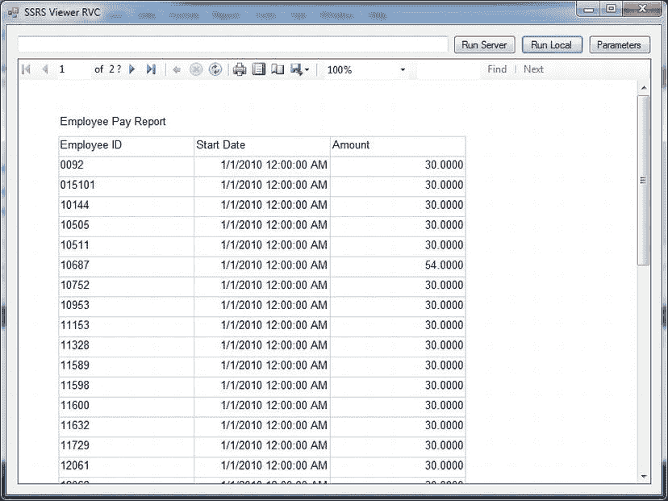

**图 9-6.** 正在运行本地渲染报表的 SSRS Viewer RVC

## 使用报表服务器 Web 服务
SSRS 2012 Web 服务使用 SOAP API，允许你在报表服务器上调用各种方法，并使用该服务提供的一组丰富的对象与它们进行交互。

在 SSRS 2012 中，有两个你应该关注的服务。第一个是 `ReportingService2010`，它处理报表服务器及其内部报表的管理。我们将在本章的剩余部分使用此服务。第二个服务 `ReportExecutionService`，处理无需浏览器或报表查看器即可程序化渲染报表。

## Web 服务方法类别
报表服务器 Web 服务可以控制报表服务器的各个方面，由几个类别的方法组成，如表 9-6 所列。

报表服务器 Web 服务使用其中许多方法来控制与直接控制报表不直接相关的 SSRS 2012 方面，因此我们不在本章中介绍它们。但是，你应该了解你的自定义应用程序对 SSRS 2012 的控制级别以及可以执行的功能类型，因为你可能希望从应用程序中为它们提供用户界面。请记住，Microsoft 是使用 ASP.NET 和这些 Web 服务构建主要的 SSRS 2012 报表管理器应用程序的。

对于 SSRS Viewer RVC，你正在使用报表查看器控件来渲染报表，但你希望提供一个基于 Windows 窗体的自定义用户界面，以允许用户输入他们的报表参数。本章的其余部分集中使用表 9-6 中列出的报表参数类别的方法。你将使用这些方法来获取报表期望的参数列表，并查找这些参数的可能值。

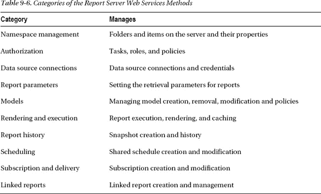

你将使用此信息来创建和填充组合框，允许用户在 Windows 窗体对话框中输入他们的选择。


#### 创建 GetParameters 表单

你已经拥有一个窗体 (`ViewerRVC.cs`)，用于在嵌入式报表查看器控件中呈现和显示报表。现在，你将向项目中添加第二个窗体，用于显示报表和呈现参数，并允许用户进行选择。

因此，通过选择 **Project**  **Add Windows Form** 来向你的项目中添加一个 `GetParameters` 窗体。将该窗体命名为 `GetParameters.cs`，并将其标题文本修改为 `Parameters`。接着，从工具箱中向此窗体添加两个控件；从“容器”部分添加一个名为 `parameterPanel` 的 `FlowLayoutPanel` 控件，并在按钮属性窗口中添加一个名为 `buttonOK` 的按钮控件。然后，在按钮属性窗口中将按钮的 `text` 属性设置为 `OK`。完成后，窗体应如 图 9-7 所示。

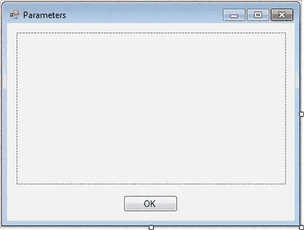

##### 图 9-7. SSRS Viewer RVC 的 `GetParameters` 窗体

现在，你需要将对 SSRS 2012 Web 服务的引用添加到你的项目中。具体操作是选择 **Project**  **Add Service Reference**，或者在**解决方案资源管理器**中右键单击**服务引用**并选择**添加服务引用**。当对话框出现时，点击窗体底部的**高级**按钮。在下一个窗体上，点击**添加 Web 引用**按钮。然后，在此输入以下 URL：

`http://localhost/reportserver/reportservice2010.asmx`

如果需要，请将 `localhost` 替换为你的服务器名称。接着点击**Go**按钮（即右箭头图标）。你将看到一个类似于 图 9-8 的对话框。

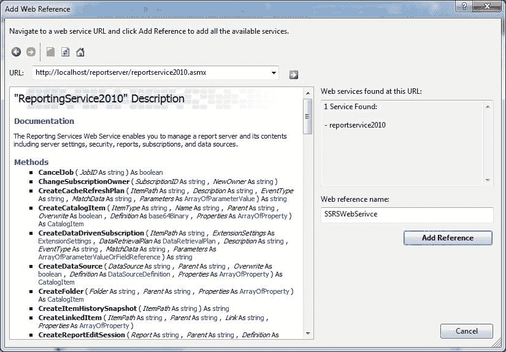

##### 图 9-8. 添加 SSRS 2008 Web 服务引用

在**Web 引用名称**文本框中，输入 `SSRSWebService`，这是你将在代码中引用该 Web 服务时使用的名称。然后，点击**添加引用**按钮以完成引用的添加。

关闭此对话框后，你需要在 `GetParameters` 类文件的代码顶部添加以下 `using` 语句。请注意，如果你的项目名称与 `SSRS Viewer RVC` 不同，你应该更改引用以反映你的项目名称。

```csharp
using SSRS_Viewer_RVC.SSRSWebService;
```

现在，你可以更轻松地引用 Web 服务公开的方法和属性，因为你无需输入完全限定的命名空间。另外，在你刚添加的语句下方添加以下其他指令：

```csharp
using System.Web.Services.Protocols;
using System.Collections;
```

这样做将允许你访问这些命名空间的成员，而无需在每次使用该命名空间中的方法或属性时键入完整的命名空间。

由于你将使用此窗体作为对话框来显示报表参数及其可能值，并允许用户选择它们，因此你需要一种在主窗体和这个新创建的 `GetParameters` 窗体之间进行通信的方法。我们将在下一节中设置该通信。

#### 为报表参数窗体编码

当你实例化报表参数窗体 (`GetParameters.cs`) 时，你需要传入用户在查看器窗体 (`ViewerRVC.cs`) 中输入的报表 URL。你使用此 URL 来确定报表服务器名称和用户想要运行的具体报表。你需要同时知道这两者，以便调用报表服务器 Web 服务。因为你将在后续代码中贯穿使用这些信息，所以在你的 `GetParameter` 类中，你会将它们存储在一些类级别的私有变量中，如 清单 9-4 所示。将私有变量列表直接添加到你的 `GetParameter.cs` 类代码中类声明的起始之后。

##### 清单 9-4. 类级别的私有变量

```csharp
public partial class GetParameters : Form
{
    private string url;
    private string server;
    private string report;
    private Microsoft.Reporting.WinForms.ReportParameter[] parameters;
    ReportingService2010 rs;
```

在窗体构造函数中（该函数将 URL 字符串作为唯一参数），我们将把报表服务器和报表名称分解为两个单独的字段。为了将 URL 分解为服务器和报表名称，请使用 `string` 的 `Split` 方法，并创建一个类似于 清单 9-5 的构造函数。将此构造函数代码（即创建类类型对象时首先运行的代码）直接添加在私有变量下方。你还需要在构造函数中添加名为 `URL` 的 `string` 参数。

##### 清单 9-5. 报表参数窗体构造函数

```csharp
public GetParameters (string URL)
{
    InitializeComponent();
    url = URL;
    string[] reportInfo = url.Split('?');
    server = reportInfo[0];
    report = reportInfo[1];
}
```

## GetParameters_Load 事件

现在，你将进入此对话框实际工作的部分：`Form_Load` 事件。要自动创建此方法，请在显示模式下打开你的 `GetParameters` 窗体，然后在窗体上没有组件的位置（例如顶部标题栏）双击。这将在代码视图中打开你的窗体，并且 `GetParameters_Load` 方法已被创建并链接到窗体的 Load 事件。

接下来，创建一个 `ReportingService` 对象，以便通过你先前添加为引用的 Web 服务来访问 SSRS 2012。然后，将你的 Windows 凭据设置为调用 Web 服务时要使用的凭据，如下所示：

```csharp
rs = new ReportingService2005();
rs.Credentials = System.Net.CredentialCache.DefaultCredentials;
```

 **注意** 你也可以使用基本身份验证，通过 `rs.Credentials = new System.Net.NetworkCredential("username", "password", "domain");`。你使用的方法取决于报表服务器虚拟目录的安全设置。默认情况下，它配置为使用 Windows 身份验证。


### 调用 Web 服务 GetItemParameters 方法

`GetItemParameters` 方法接受五个参数：

> *   `Item`: 报表或项的完整路径名。
> *   `ForRendering`: 一个布尔值，指示应如何使用参数值。要获取每个参数的可能值列表，必须将其设置为 `true`。
> *   `HistoryID`: 报表历史快照的 ID。因为不是从快照运行报表，所以将其设置为 `null`。
> *   `ParameterValues`: 可针对报表服务器管理的报表参数进行验证的参数值（`ParameterValue[]` 对象）。对于本示例，将其设置为 `null`。
> *   `Credentials`: 可用于验证查询参数的数据源凭据（`DataSourceCredential[]` 对象）。

`GetItemParameters` 方法返回一个 `ItemParameter[]` 对象数组，其中包含报表的参数。你可以使用此信息来渲染组合框，以便用户在运行报表时选择他们想要使用的参数值。

以下代码设置需要使用的变量，然后调用 `GetItemParameters` 方法来检索报表期望的参数列表，如 Listing 9-6 所示。

***Listing 9-6.** 调用 GetReportParameters*

```csharp
bool forRendering = true;
string historyID = null;
ParameterValue[] values = new ParameterValue[1];
DataSourceCredentials[] credentials = null;
ItemParameter[] parametersSSRS = null;
parametersSSRS = rs.GetItemParameters(report, historyID,
    forRendering, values, credentials);
```

一旦从 SSRS 2012 获取了参数列表，就可以循环遍历它们，使用这些值在创建每个参数的组合框时创建标签，如下所示：

```csharp
foreach (ItemParameter rp in parametersSSRS)
```

每个 `ItemParameter` 对象都有一个名为 `ValidValues` 的只读属性。你可以使用 `ValidValues` 属性（它返回一个 `ValidValue` 对象数组）来填充每个组合框中的项，如 Listing 9-7 所示。

***Listing 9-7.** 遍历 ValidValue 对象*

```csharp
if (rp.ValidValues != null) {
    // 构建列表项
    ArrayList aList = new ArrayList();
    pvs = rp.ValidValues;
    foreach (ValidValue pv in pvs)
    {
        aList.Add(new ComboItem(pv.Label,pv.Value));
    }
    // 将列表项绑定到组合框
    a.DataSource = aList;
    a.DisplayMember="Display";
    a.ValueMember="Value";
}
```

因此，对于每个 `ReportParameter`，你需要检查是否存在任何 `ValidValues` 属性。如果存在，则循环遍历它们，将每个项添加到组合框中。因为你想检索组合框中每个项的显示名称和实际值，所以必须创建一个组合框项类，并将这些对象绑定到组合框。Listing 9-8 显示了完整的 `GetParameters_Load` 事件方法，Listing 9-9 显示了 `ComboItem` 类。

由于我们对报表有所了解，已经知道某些参数依赖于其他参数值。如果只是遍历每个参数的 `ValidValues` 列表，其中一些将不会包含任何值。我们可以利用这一先前知识，向 `getItemParameters` 方法传递一些信息。我们将在 `values` 数组中放置一个 `ParameterValue` 项，以便为所有其他参数检索一些有效值。

我们还需要检索组合框中每个项的显示名称和所选值。我们还将创建一个组合框项类，通过将每个组合项绑定到组合框来处理此问题。Listing 9-8 显示了 `GetParameters_Load` 事件，Listing 9-9 显示了 `ComboItem` 类。

 **注意** 我们仅根据一个可能的“服务年份”值来填充其余参数。由于在某些报表中，其他参数的有效值可能会发生变化，因此可以包含一个重写的事件方法，以便在年份更改时刷新每个其他参数值。

***Listing 9-8.** 获取报表参数和可能的值并在组合框中显示它们*

```csharp
private void GetParameters_Load(object sender, EventArgs e)
{
    rs = new ReportingService2010();
    rs.Credentials = System.Net.CredentialCache.DefaultCredentials;

    bool forRendering = true;
    string historyID = null;
    ParameterValue[] values = new ParameterValue[1];
    DataSourceCredentials[] credentials = null;
    ItemParameter[] parametersSSRS = null;
    ValidValue[] pvs = null;

    int x = 5;
    int y = 30;

    try
    {
        values[0] = new ParameterValue();
        values[0].Label = "ServiceYear";
        values[0].Name = "ServiceYear";
        values[0].Value = "2009";

        parametersSSRS = rs.GetItemParameters(report, historyID,
            forRendering, values, credentials);

        if (parametersSSRS != null)
        {
            foreach (ItemParameter rp in parametersSSRS)
            {
                this.SuspendLayout();
                this.parameterPanel.SuspendLayout();
                this.parameterPanel.SendToBack();

                // 现在为下面的组合框创建一个标签
                Label lbl = new Label();
                lbl.Anchor = (System.Windows.Forms.AnchorStyles.Top | System.Windows.Forms.AnchorStyles.Left);
                lbl.Location = new System.Drawing.Point(x, y);
                lbl.Name = rp.Name;
                lbl.Text = rp.Name;
                lbl.Size = new System.Drawing.Size(150, 20);
                this.parameterPanel.Controls.Add(lbl);
                x = x + 150;

                // 现在创建一个组合框并填充它
                ComboBox a = new ComboBox();
                a.Anchor = (System.Windows.Forms.AnchorStyles.Top | System.Windows.Forms.AnchorStyles.Right);
                a.Location = new System.Drawing.Point(x, y);
                a.Name = rp.Name;
                a.Size = new System.Drawing.Size(200, 20);
                x = 5;
                y = y + 30;

                this.parameterPanel.Controls.Add(a);
                this.parameterPanel.ResumeLayout(false);
                this.ResumeLayout(false);
```


`                        if (rp.ValidValues != null)
                        {
                                //构建列表项
                                ArrayList aList = new ArrayList();
                                pvs = rp.ValidValues;
                                foreach (ValidValue pv in pvs)
                                {
                                        aList.Add(new ComboItem`
`(pv.Label, pv.Value));
                                }
                                //将列表项绑定到组合框
                                a.DataSource = aList;
                                a.DisplayMember = "Display";
                                a.ValueMember = "Value";
                        }
                }
        }
}

                        catch (SoapException ex)
                        {
                                MessageBox.Show(ex.Detail.InnerXml.ToString());
                        }
                }`

#### 清单 9-9. 组合框项类

`public class ComboItem`
        `{`
                `public ComboItem(string disp, string myvalue)`
                `{`
                        `if (disp != null)`
                                `display = disp;`
                        `else`
                                `display = "";`
                        `if (myvalue != null)`
                                `val = myvalue;`
                        `else`
                                `val = "";`
                `}`

                `private string val;`
                `public string Value`
                `{`
                        `get { return val; }`
                        `set { val = value; }`
                `}`

                `private string display;`
                `public string Display`
                `{`
                        `get { return display; }`
                        `set { display = value; }`
                `}`

                `public override string ToString()`
                `{`
                        `return display;`
                `}`
        `}`

加载时，你会看到一个类似图 9-9 的表单，它显示了一系列组合框，每个组合框都包含报表参数的有效值。在我们添加从主表单打开此参数表单的代码之前，你无法在完整视图中看到这个界面。我们将在本章稍后执行此步骤。

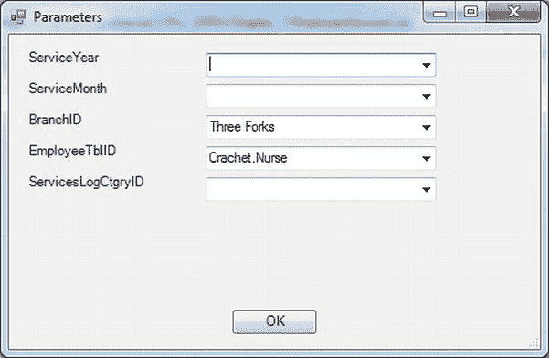

**图 9-9. 参数对话框**

#### 渲染最终报表

要完成你的 SSRS 2012 Windows Forms 查看器应用程序，你需要将参数的局部变量设置为用户已选择的参数值，以便你可以通过将在 `GetParameters` 类中创建的名为 `Parameters` 的属性，从 `ViewerRVC.cs` 表单中检索它们。你将通过创建一个名为 `ViewerParameters` 的方法来填充参数变量。

确保 `GetParameters` 表单处于设计模式显示，然后双击“确定”按钮。这将自动创建一个名为 `buttonOK_Click` 的新事件处理方法，并设置为在按下表单上的“确定”按钮时运行。向 `buttonOK` 点击事件处理程序添加清单 9-10 中所示的代码。

#### 清单 9-10. “确定”按钮的 buttonOK 点击事件处理程序

`private void buttonOK_Click(object sender, EventArgs e) {
parameters = ViewerParameters();
this.DialogResult = DialogResult.OK;
Close(); }`

它调用的方法 `ViewerParameters` 只是遍历组合框并创建一个 `ReportParameters` 数组，这些本质上是报表查看器控件使用的名称-值对，如清单 9-11 所示。你需要手动将这整个方法添加到你的 `GetParameters` 类中。我们也先来讨论一下这个方法的作用。

我们的 `ViewerParemeter` 方法首先计算持有值的控件数量，然后初始化一个报表参数数组作为返回值。然后，它会遍历我们设置的参数面板内的每个控件，并检查该控件是否是组合框——这正是我们想要从中获取值并返回的类型。如果控件是组合框，代码会将该控件转换为组合框类型，以便我们可以获取所选项的名称和值，并添加到我们的报表参数数组中。如果该值不为空或空字符串，我们就获取选定值并填充数组。如果它是空值或空字符串，我们在参数数组中使用空值。

#### 清单 9-11. 获取用户输入的参数

`private Microsoft.Reporting.WinForms.ReportParameter[] ViewerParameters() {
int numCtrls = (this.parameterPanel.Controls.Count / 2);
Microsoft.Reporting.WinForms.ReportParameter[] rp =
New Microsoft.Reporting.WinForms.ReportParameter[numCtrls];
int i = 0;
foreach (Control ctrl in this.parameterPanel.Controls) {
if (ctrl.GetType() == typeof(ComboBox)) {
ComboBox a = (ComboBox)ctrl; rp[i] =
new Microsoft.Reporting.WinForms.ReportParameter(); rp[i].Name = a.Name; if (a.SelectedValue`
` != null &&
a.SelectedValue.ToString() != String.Empty) {
rp[i].Values.Add(a.SelectedValue.ToString()); }
else {
rp[i].Values.Add(null); }
i++; } } return rp; }`

要完成你的 `GetParameters` 表单，你需要添加一些代码，以便能够将报表参数及其值传递给查看器表单 (`ViewerRVC.cs`)，如清单 9-12 所示。这允许父 `ViewRVC` 表单在参数从 Web 服务填充并由你通过表单选择后收集它们。你也将手动将此代码添加到你的 `GetParameters` 类中。

#### 清单 9-12. 用于从 ViewerRVC.cs 表单获取参数的属性

`public Microsoft.Reporting.WinForms.ReportParameter[] Parameters {
get
{
return parameters;
} }`

最后，为了将所有内容整合起来，你需要在主表单 `ViewerRVC.cs` 中添加一个按钮及其点击事件的相关代码，以使用新的“参数”对话框，并传入你想要运行的报表的 URL。然后，你通过 `GetParameters` 表单的 `Parameters` 属性读取 `ReportParameter` 数组，并使用它为报表查看器控件设置报表参数，如清单 9-13 所示。


首先，在**解决方案资源管理器**中双击文件，以在设计模式下打开你的 `ViewerRVC` 类。从这里，你可以直接双击之前在本章首次设计此窗体时创建的“参数”按钮。这将为你创建一个新的 `getParameters_Click` 事件方法，并自动将其链接到该按钮的点击事件。现在，你可以添加代码来调出新的 `GetParameters` 窗体并返回从该窗体生成的参数。

`清单 9-13.` getParameters 单击事件：检索参数并运行报表

```csharp
private void getParameters_Click(object sender, EventArgs e)
{
reportURL.Text = "http://localhost/reportserver?`
/Pro_SSRS/Chapter_9/EmployeeServiceCost";
GetParameters reportParameters = new GetParameters(reportURL.Text);
if (reportParameters.ShowDialog() == DialogResult.OK) {
reportViewer.ProcessingMode =
Microsoft.Reporting.WinForms.ProcessingMode.Remote;
reportViewer.ServerReport.ReportServerUrl =
new Uri(@"http://localhost/reportserver/");
reportViewer.ServerReport.ReportPath =
"/Pro_SSRS/Chapter_9/EmployeeServiceCost";
reportViewer.ServerReport.SetParameters(reportParameters.Parameters); reportViewer.ShowParameterPrompts = false; reportViewer.RefreshReport(); } }
```

现在以调试模式运行项目。当窗体显示时，单击标记为“参数”的按钮。参数对话框窗体将会显示。从可用的下拉值中选择一些参数，然后单击“确定”。这将使用你提供的参数渲染位于 SSRS 2012 服务器上的“员工服务成本”报表，并且不会提示你提供任何额外的参数。此时，你应该会看到类似 图 9-10 的内容。

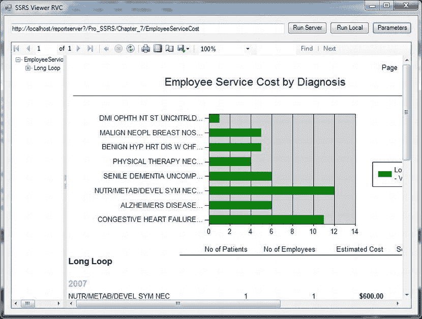

`图 9-10.` 使用你的参数完成的报表

现在，你已掌握了在 Windows 窗体应用程序中使用报表查看器控件的基础。本章的示例在 Web 浏览器控件中实现了 URL 访问，并使用报表查看器控件来渲染报表，为你提供了将报表集成到 Windows 窗体应用程序的多种选择。通过使用 SSRS 2012 基于 SOAP 的 API 来访问 SSRS 的丰富功能，以检索可用的报表参数和可能值，你使查看器对用户更加友好。这让你能够为用户创建一个更熟悉且响应更灵敏的基于 Windows 的用户界面。

你也可以直接使用报表服务器 Web 服务来渲染报表。但是，你会失去诸如带有内置导航和导出功能的报表工具栏等特性。这意味着，如果你使用另一个 Web 服务进行渲染，就必须自己创建这些功能。

#### 在 ASP.NET 中构建报表查看器

使用 Visual Studio，你还可以选择在 ASP.NET 应用程序中使用报表查看器控件。这可以让你灵活地开发自定义报表应用程序，而不必分发给用户或在每次部署补丁时在最终用户的机器上更新。用户可以通过任何标准的 Web 浏览器访问你的自定义应用程序，并且任何修改对你的最终用户都可以是透明的。

在这个项目中，你将使用许多与之前构建的窗体应用程序相同的概念和方法。首先创建一个新的 ASP.NET Web 应用程序项目。将此项目命名为 `SSRS_WebViewer`，并为你的源文件选择一个位置。

 **提示** 如果你的开发机器上没有 IIS 也不用担心。使用 Visual Studio 的调试功能，你可以在 Web 浏览器中查看你的 ASP.NET 应用程序。

现在，你将获得一个新的 Web 应用程序项目，其中包含一个为你创建的 `Default.aspx` 文件。打开此网页，并向页面布局添加五个控件：

*   `DropDownList:` 你将使用此下拉列表来保存从 SSRS 2012 Web 服务返回的报表名称。将其命名为 `reportList`。
*   `Button:` 这将用于触发报表在报表查看器中的渲染。将其命名为 `renderReport`，并将显示文本更改为“渲染”。
*   `Horizontal Rule:` 你将在窗体中使用一个水平分隔线来分隔顶部控件和报表查看器。
*   `Report Viewer:` 你将使用此控件渲染存储在 SSRS 2012 服务器上的报表。将其命名为 `reportViewerWeb`。
*   `ScriptManager:` 使用 `ReportViewer` 控件的要求是，你必须在页面上包含一个 `ScriptManager` 控件。它确保页面包含 `ReportViewer` 所需的所有前提代码。

一旦你将控件放在页面上并调整大小以适合你的布局，请为刚创建的按钮添加一个单击动作。这可以通过在设计模式下查看页面并双击按钮来实现，就像 Windows 窗体按钮一样。不必担心所创建函数的内容；你稍后会填充代码。完成后，你的代码应类似于 清单 9-14。

`清单 9-14.` Default.aspx 部分代码清单

```aspx
<html >
<head runat="server">
    <title></title>
</head>
<body>
    <form id="form1" runat="server">
    <div>

        <asp:DropDownList ID="reportList" runat="server">
        </asp:DropDownList>
        <asp:Button ID="renderReport" runat="server" onclick="renderReport_Click"
            Text="Render" />
        <hr />
        <rsweb:ReportViewer ID="reportViewerWeb" runat="server" Width="841px">
        </rsweb:ReportViewer>

    </div>
    <asp:ScriptManager ID="ScriptManager1" runat="server">
    </asp:ScriptManager>
    </form>
</body>
</html>
```

现在页面设计已完成，你将添加对 SSRS 2010 管理 Web 服务的引用。在解决方案资源管理器中右键单击此项目的父文件夹，然后选择“添加 Web 引用”。在此界面中，输入我们要使用的 Web 服务地址。在本例中，你将添加 [`http://localhost/reportserver/reportservice2010.asmx`](http://localhost/reportserver/reportservice2010.asmx)。如果你不是直接在 SSRS 服务器上开发，可能需要更改此 URL 中的服务器名称。将此 Web 服务引用命名为 `SSRS_WebService`。你可以在 图 9-11 中看到这应该是什么样子。

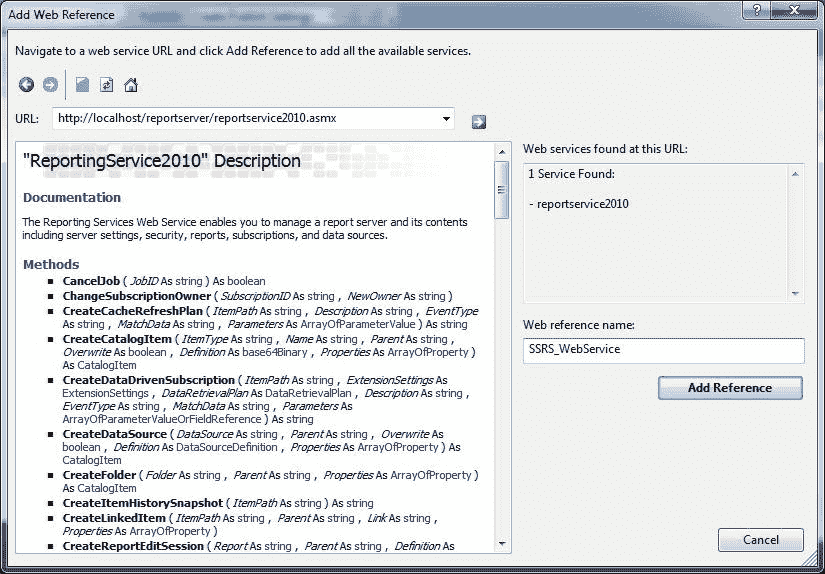

`图 9-11.` 添加 Web 服务引用


现在你已经准备好引用的 Web 服务，你可以用 SSRS 实例中 `Chapter_9` 目录的报表项来填充下拉列表。你应当已经从本章的设置中在该文件夹中至少拥有一个报表。

你将使用刚刚注册的 Web 服务来检索 `Chapter_9` 目录中的所有报表项。你将用来执行此操作的 Web 服务方法是 `ListChildren`。此函数接受两个参数：从中收集列表的路径，以及一个用于确定搜索是否应为递归的布尔值。由于你只想从 `Chapter_9` 文件夹获取报表，而不包括其他内容，因此你只需传递该路径和一个 `false` 值，以仅获取此单个目录中的报表。

你希望仅用报表项填充下拉列表。然而，`ListChildren` 将返回此文件夹中的所有项，而不仅仅是报表。你将使用 `TypeName` 属性来确定返回对象的类型，并仅列出报表。一旦测试了某项是否为报表，你将使用报表的名称填充下拉列表。执行所有这些操作的代码存在于页面的 `Page_load` 方法中，因此在页面加载完成后，你将立即拥有一个完整的下拉列表。清单 9-15 展示了用于通过 Web 服务填充下拉列表的代码。

### 清单 9-15. 使用 SSRS Web 服务填充报表列表

```csharp
SSRS_WebService.ReportingService2010 rs = null;

protected void Page_Load(object sender, EventArgs e)
{
    try
    {
        rs = new SSRS_WebService.ReportingService2010();
        rs.Credentials = System.Net.CredentialCache.DefaultCredentials;

        SSRS_WebService.CatalogItem[] listItems = rs.ListChildren("/Pro_SSRS/Chapter_9", false);
        foreach (SSRS_WebService.CatalogItem thisItem in listItems)
        {
            if (thisItem.TypeName == "Report")
            {
                reportList.Items.Add(thisItem.Name);
            }
        }
    }
    catch (Exception ex)
    {
        Response.Write(ex.Message);
    }
}
```

现在你已经构建了表单，并用来自 SSRS Web 服务的数据填充了下拉列表，你可以通过允许用户从列表中渲染报表来最终完成应用程序。你现在将回到为添加到网页的按钮的 Click 事件生成的代码。在本节中，你将设置处理模式、报表服务器 URL 以及要渲染的报表的路径。最后，代码将渲染报表，并将其显示在报表查看器控件中。清单 9-16 展示了网页代码视图中已填充的点击事件处理方法。

### 清单 9-16. 填充 RenderReport 按钮点击方法

```csharp
protected void renderReport_Click(object sender, EventArgs e)
{
    reportViewerWeb.ProcessingMode = Microsoft.Reporting.WebForms.ProcessingMode.Remote;
    reportViewerWeb.ServerReport.ReportServerUrl = new Uri(@"http://localhost/reportserver/");
    reportViewerWeb.ServerReport.ReportPath = "/Pro_SSRS/Chapter_9/" + reportList.SelectedItem.Value;
    reportViewerWeb.ServerReport.Refresh();
}
```

要测试应用程序，请在解决方案资源管理器中右键单击项目，然后选择 `Debug -> Start New Instance`。Visual Studio 将在一个随机端口上启动一个独立的 Web 服务器，并启动项目进行调试。选择你放入目录中的报表，然后单击 `Render` 按钮。如果一切设置正确，在你选择报表上的一些参数后，你应该会看到一个类似于 图 9-12 的 Internet Explorer 窗口。

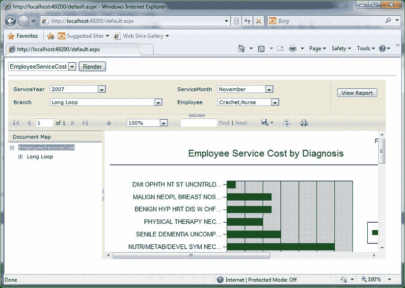

### 图 9-12. 最终完成的 Web 报表应用程序

## 总结

在本章中，我们展示了如何使用 SSRS 2012 的 URL 访问功能以及报表查看器控件，将报表快速嵌入应用程序中。除了本章中使用的 WebBrowser 和 Report Viewer 控件之外，你还可以使用其他应用程序来渲染报表。例如，你可以将 SSRS 2012 与 Microsoft SharePoint Server 集成。我们将在第 12 章更详细地讨论如何使用此集成。通过结合 SharePoint 和 SSRS，你可以快速构建一个门户来显示报表，几乎无需编写代码。

在本章中，你还学习了如何通过调用报表服务器 Web 服务来增强你的 Windows 窗体查看器应用程序。你创建的应用程序允许你键入要查看的基于服务器的报表的 URL。然后，它使用 SSRS 2012 的 `GetItemParameters` 方法来检索报表参数列表，并使用 `ValidValues` 属性来检索可能的值。接着，它读取用户选择的值，并填充一个 `ReportParameters` 数组，该数组随后由报表查看器控件用来渲染已应用所选参数的报表。在第 10 章，我们将扩展此示例，通过使用报表服务器 Web 服务，允许用户设置报表在计划中使用提供的参数运行，而不是立即渲染。

