# 第 10 章

## 管理报表

在 SSRS 之前的许多报告解决方案中，报表管理通常仅限于通过文件共享或嵌入到第三方应用程序中将完整的报表文件交付给最终用户。SSRS 是一个完整的报告环境，具有诸如计划报表执行、报表订阅服务、快照、内容缓存和按需 Web 访问等功能。

这些额外的好处也带来了管理责任的额外层面。根据组织的规模，一些管理任务可以委派给其他用户，例如部门经理（他们可能会维护其部门的报表文件夹），以及系统管理员和 DBA。幸运的是，SSRS 提供了多种在各个级别管理报表服务器的方法。在本章中，你将继续使用内置工具，如报表管理器和命令行实用程序，以及利用 SSRS 编程模型的自定义 .NET 管理工具来管理 SSRS 部署。我们还将演示 SSRS 的“Reporting Services 配置管理器”。当连接到 SSRS 实例时，它提供了报表管理器“站点设置”部分和命令行实用程序中可用的大部分（如果不是全部）功能。使用 SSRS 2000 和 2005 时，某些管理任务（如配置报表订阅）可以通过 SSMS 完成。然而，自 2008 版本以来，此功能已被移除，现在只能使用报表管理器。因此，我们选择在本章的大多数示例中使用报表管理器。报表管理器可以通过 Web 浏览器访问，不需要在本地安装 SQL 客户端工具。


## 探索 SSRS 部署中的管理角色

您可以将 SSRS 部署的管理角色细分为三个基本类别：

*   内容管理
*   性能
*   报表执行

在将任何应用程序或服务投入生产环境之前，始终进行测试部署是最佳实践。由于我们公司通过互联网为大量用户提供服务，一些特殊的管理考虑——例如如何为不同公司订阅同一份报表——变得至关重要，我们需要测试各种场景以确保在每种情况下功能都正常。让我们首先看看这三个管理类别，以及我们如何实施和测试它们，以确保在部署到生产环境时，能尽量避免（或至少减少）意外情况。我们将展示如何使用 `SSRS` 和 `SQL Server 2012` 的内置管理工具来执行所有这些任务。本章稍后部分，我们将展示如何用 `.NET` 构建一个管理应用程序界面，以提供安排报表计划的能力。

### 内容管理

有效管理 `SSRS` 报表服务器上的内容，要求您熟悉可用的管理任务。报表管理的几个方面只有在报表部署后才可用。在我们展示如何为选定用户部署医疗保健报表时，我们将详细涵盖每个方面：

*   共享计划
*   报表参数和数据源
*   报表快照、历史记录和缓存
*   订阅

对于每个内容管理任务，我们将提供具体的现实场景，继续以医疗保健机构为例。至此，您已经部署了多个报表、数据源以及其他报表项，例如在本书中开发的图形图像和代码。现在，是时候戴上管理员的帽子，充分利用所有使 `SSRS` 成为一个独特而强大的报表传递系统以及丰富报表创作环境的功能了。

## 设置共享计划

一般来说，共享计划类似于共享数据源，因为它对有权访问它的用户在整个系统范围内可用。您可以专门为某个作业类型创建共享计划。可以将重复的共享计划配置为按小时、天、月、周执行，或仅运行一次。在此示例中，财务报表将在每月末执行。为这些报表维护历史记录非常重要，这样您就可以在任何时间点冻结值，或用于审计功能，例如了解哪些用户查看了报表以及他们在报表中看到了什么。

您将创建一个共享计划，用于在每月的最后一天运行财务报表，以提供以下好处：

*   您可以将报表安排在预定时间执行。
*   您可以存储每份报表的快照，以维护数据的历史视角。

`注意` 报表快照是在特定时间执行的报表，无论是由用户启动还是作为计划的一部分执行，它们共同构成了报表历史记录。我们稍后将更详细地介绍快照。

客户可能在月末运行的一份财务报表是 `AR 对账` 报表。此报表列出了当前会计期间（例如 2009 年 10 月 的 10-2009）发生的财务交易。此报表可能是需要按相同计划执行的几份报表之一。其他财务报表可能包括 `账龄试算平衡表` 报表和 `AR 账龄分析` 报表。我们将在下一节中使用 `AR 对账` 报表来展示与设置共享计划和创建报表快照相关的管理任务。我们将 `AR 对账` 报表包含在 `Pro_SSRS` 报表项目下载中，该下载可在 Apress 网站的 Source Code/Download 部分获取 ([`www.apress.com`](http://www.apress.com))。报表定义文件是 `AR Reconciliation.rdl`。在本节中，我们将展示如何使用已部署的 `AR 对账` 报表版本来配置其参数值，以使其与每月计划执行时间保持一致。

要部署 `AR 对账` 报表，请在 `BIDS` 中打开 `Pro_SSRS` 项目，然后打开 `解决方案资源管理器`。但是，在部署此报表之前，您需要更改控制报表将部署到报表服务器上哪个文件夹的项目属性。在 `AR 对账` 示例中，您将把报表部署到名为 `月末财务` 的文件夹中。在 `解决方案资源管理器` 中，右键单击 `Pro_SSRS` 报表项目，然后选择 `属性`。将 `TargetReportFolder` 值从 `Pro_SSRS` 更改为 `月末财务`，然后单击 `确定`。现在，当您在 `解决方案资源管理器` 中右键单击 `AR 对账` 报表并选择 `部署` 时，将在您的报表服务器上创建包含 `AR 对账` 报表的新文件夹。

## 创建共享计划

要在 `报表管理器` 中创建共享计划，请单击 `站点设置`，然后在页面左侧导航选项卡的底部选择 `计划`。单击 `新建计划` 按钮链接，并将计划命名为 `月末财务`。在 `计划详细信息` 部分，您将看到标准的计划选项：`小时`、`天`、`周`、`月` 或 `一次`。对于此报表，请选择 `月`。

配置共享计划在每月最后一天运行时的第一个挑战是克服 `计划` 表单上的内置数据验证。虽然可以告诉 `SSRS` 在每个月的最后一个星期日执行报表，但无法选择每个月的最后一天，因为最后一天是可变的（即，根据月份不同，可能是 28、29、30 或 31 日）。嗯，创建一个涵盖所有四个日期的单一计划应该是可行的，对吧？并不完全正确！如果您尝试如 图 10-1 所示保存 `共享计划`，选择 31 日并在选中所有月份时会导致错误，因为并非所有月份都有 31 天。

`注意` 您必须以属于 `SSRS 2012 系统管理员` 角色成员的用户身份登录才能添加新计划。如果您尚未被添加为站点的 `系统管理员`，但您是本地 `管理员` 组的成员，则可能需要使用提升的权限运行浏览器。如果使用 `IE`，您可以右键单击 `IE` 图标并选择 `以管理员身份运行`。

本例中的解决方案——因为我们知道在每月最后一天午夜 12:00 之后不会有任何活动发生——是将计划设置为在每月第一天的凌晨 12:01 运行。这实质上相当于选择了每个月的最后一天，并且您知道每月的第一天总是 1 日。

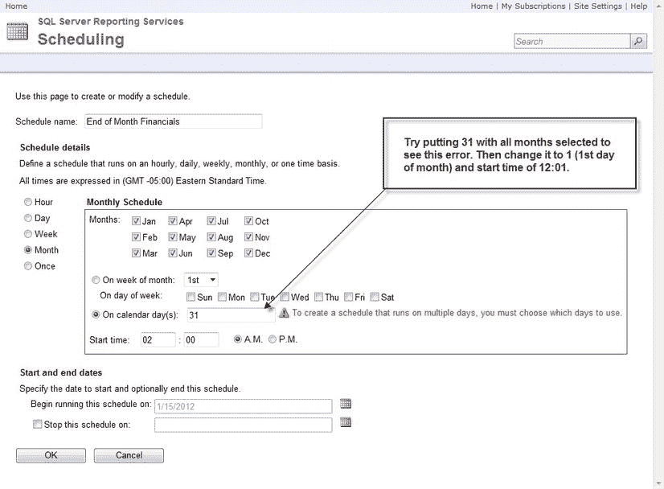

*图 10-1. 选择每月最后一天*

接下来，为计划选择合适的开始日期和结束日期（本例中，不要指定结束日期），然后单击 `确定` 按钮。现在您可以继续前进，准备报表本身以使用新计划。请注意，`SSRS` 中的计划依赖于 `SQL Server Agent` 服务，因此，在您能够成功创建计划之前，该服务必须正在运行。

`注意` 请注意，当在 `SSRS` 中计划运行作业（例如订阅或执行快照）时，会使用 `SQL Server Agent` 创建一个 `SQL Server` 作业。可以通过 `SSMS` 或 `报表管理器` 监视作业。


## 配置报告以使用共享计划

AR 对账报告包含可用于限制报告显示数据的报告参数。其中两个参数 `AcctPeriodYear` 和 `AcctPeriodMonth` 在驱动存储过程中用于将财务数据限制在特定的会计期间。当从共享计划执行 AR 对账报告时，确保所有报告参数都具有默认值非常重要。首先，AR 对账报告中的所有八个参数都被设置为允许 `NULL` 值，如 图 10-2 所示，这导致执行时参数的默认值被设为 `NULL`。这是可以接受的，因为使用这些参数的主存储过程逻辑知道在传递 `NULL` 值时返回所有数据。

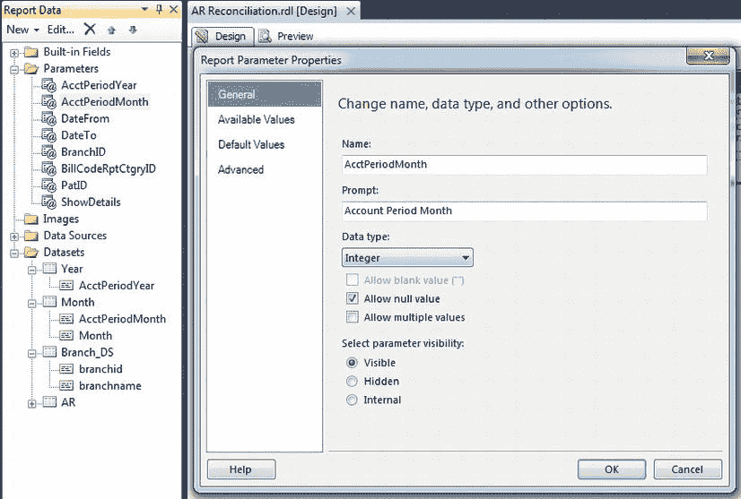

*图 10-2. AR 对账报告参数*

然而，对于参数 `AcctPeriodYear` 和 `AcctPeriodMonth`，你需要添加默认的非 `NULL` 参数值，以便返回的数据集仅包含当前会计期间的记录。为此，你使用两个函数：

> *   `DATEPART`: 返回一个表示日期组成部分（如年、季度、月或日）的整数
> *   `TODAY`: 返回当前日期

在表达式中一起使用这些函数，可以为这两个参数设置所需的默认值。对于 `AcctPeriodYear`，只需将默认值设置为当前年份，如下所示：

`=DATEPART("yyyy", TODAY())`

对于 `AcctPeriodMonth`，本质上做同样的事情，但需要从表达式值中减去 1 以返回正确月份的数据。例如，表达式 `=DATEPART("m", TODAY())`，如果在 11 月 1 日凌晨 12:01 运行，将返回值 11，而当前的会计期间是 10 月。为了考虑一月份的情况，你添加一个 `IIF` 函数来评估 `DATEPART`，这样当返回 1（表示一月）时，函数返回 12，让报告知道处理 12 月的会计期间。因此，正确的表达式如下：

`=IIF(DATEPART("m", TODAY()) = 1, 12, DATEPART("m", TODAY()) -1)`

 **注意** 我们的示例数据库仅包含来自过去某个时间点的数据快照。因此，如果你正在按照示例操作，则需要输入示例数据库中包含的年份和月份。大多数记录介于 2009 年 9 月至 2009 年 12 月之间。然而，在需要月末频率的报告的真实场景中，请使用上述表达式。

## 使用报告管理器更新和上传 RDL 文件

在本节中，你将导航到报告管理器中的 AR 对账报告，并通过 `Notepad` 手动修改 RDL，以添加 `AcctPeriodMonth` 和 `AcctPeriodYear` 默认参数值，而不是使用 `BIDS`。这将演示你可以在不需要完整设计环境的情况下对已发布的报告进行简单的修改。打开报告管理器，并导航到报表服务器上“月末财务”文件夹中的 AR 对账报告，如 图 10-3 所示。

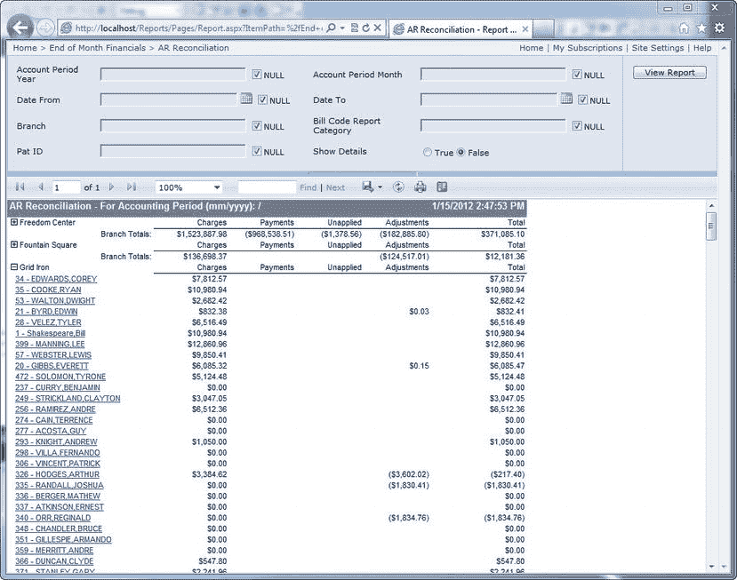

*图 10-3. 报告管理器中的 AR 对账报告*

在 `SSRS 2008 R2` 版本的报告服务发布之前，你可以使用“属性”选项卡进入属性页面。现在，你通过将光标悬停在要管理的报告上来访问报告属性，直到看到报告周围出现黄色矩形和下拉箭头。当你看到下拉箭头时，单击它并选择“管理”，如 图 10-4 所示。注意不要单击包含报告名称的链接，因为这将导致报告执行。

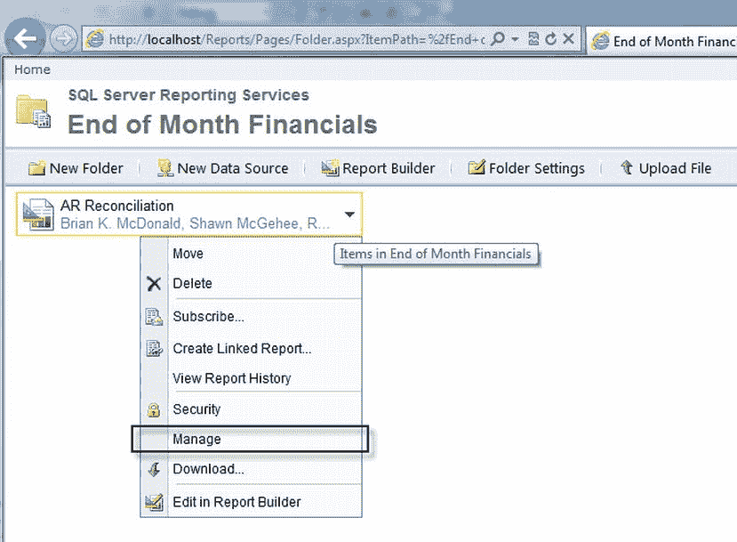

*图 10-4. 报告管理选项菜单*

单击“管理”后，你将进入报告属性页面，你会在左侧看到九个选项卡，在顶部看到五个用于报告维护的链接按钮。这些链接不言自明，因此我不详细介绍每一个。但是，正如你在 图 10-5 中所看到的，你可以执行诸如删除、移动、下载以编辑报告或用另一个副本替换报告等维护任务。

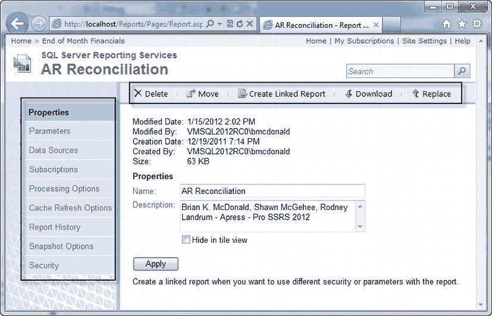

*图 10-5. 报告属性屏幕*

在 AR 对账报告的属性页面上，有两个链接——“下载”和“替换”——管理员可以使用它们直接修改 `RDL`，而无需通过其他方式（例如使用自定义代码、创作环境或 `rs` 命令行实用程序）重新部署报告。有关部署报告的更多详细信息，请参见第 8 章。单击“下载”链接将文件保存到你可以访问的位置，然后用 `Notepad` 打开它，如 图 10-6 所示。图 10-6 显示了 AR 对账报告的 `RDL` 文件。同时按下 `CTRL` 和 `F` 键进行查找并搜索 `ReportParameter`。单击“查找下一个”以定位搜索词的第一个实例。注意 `RDL` 代码中的 `AcctPeriodYear` 和 `AcctPeriodMonth` 参数。

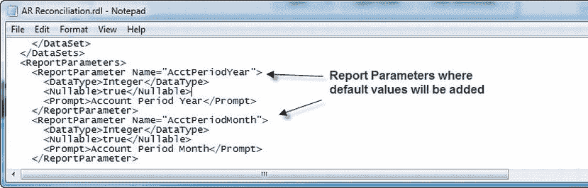

*图 10-6. 在 Notepad 中编辑的 RDL 文件*

要更新报告以包含你在上一节中创建的默认参数值，你可以将 `RDL` 代码直接放入文件并保存。为每个参数生成默认值的 `RDL` 部分只有五行长，如 清单 10-1 所示，该清单显示了 `AcctPeriodYear` 参数的默认值部分。

*清单 10-1. RDL 默认值部分*

```
<DefaultValue>
   <Values>
     <Value>=DATEPART("yyyy", TODAY())</Value>
   </Values>
</DefaultValue>
```

图 10-7 显示了为两个参数插入默认值代码后的 `RDL` 文件。

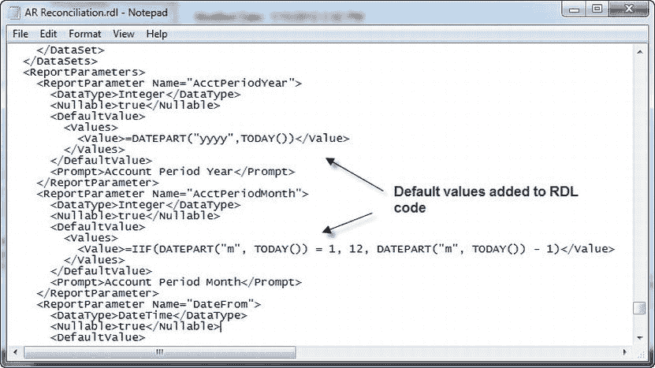

*图 10-7. 带有默认参数的 RDL 文件*

因为你无法直接从 `Notepad` 保存到 `SSRS` 服务器，所以将你的 `RDL` 文件副本保存到磁盘。任何可访问的位置都可以，例如网络共享或本地磁盘。保存文件后，你可以单击“替换”链接，在磁盘上找到你修改后的 `RDL` 文件，然后选择“打开”。当你返回到“上传报告定义”屏幕时，单击“确定”以替换现有报告。如果你在 2010 年 1 月 1 日执行了该报告，你将看到具有正确默认值的报告，如 图 10-8 所示。

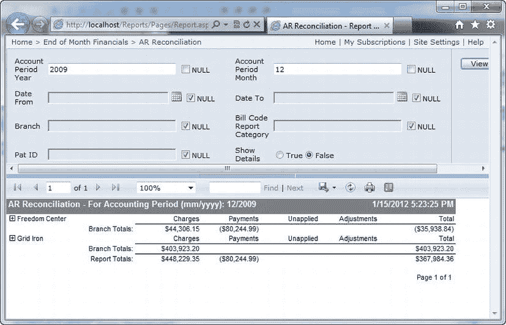

*图 10-8. 带有默认参数的 AR 对账报告*

通过报告管理器更新报告不会覆盖报告的其他属性，例如历史记录、计划和执行方法。

 **注意** 当你使用基于可变数据（例如数据库中的值）的默认值时，必须注意返回的值必须与可用值相符。在此示例中，如果为五月返回的值是 5，但没有选择五月的值，报告将强制用户进行选择，而不是执行并返回无数据。我们选择将数据限制为数据库中实际存储的值。


## 为报告设置数据源

AR 对账报告将被设置为生成历史记录，允许用户查看报告执行时的状态。此外，由于报告将在预设时间运行，SSRS 需要知道使用什么凭据来访问报告的数据。你可以选择修改我们现有的数据源凭据，或者我们可以创建一个新的数据源来满足此要求。

使用`报表管理器`，导航到包含“月末财务报告”的文件夹，然后选择`新建数据源`。将数据源命名为`EOM Financials`。由于这是一个基于 SQL Server 的连接，你需要提供适当的连接字符串，其中包含服务器名称以及连接的数据库或目录。接下来，选择在服务器上安全地存储凭据，并提供用户名和密码——在本例中，是 SQL 身份验证凭据。最后，选择在列表视图中隐藏数据源，以防止用户在浏览时意外选中它。你的配置应类似于图 10-9。点击`应用`按钮创建数据源后，你只需将报告关联到新的共享数据源，这将在下一节中完成。

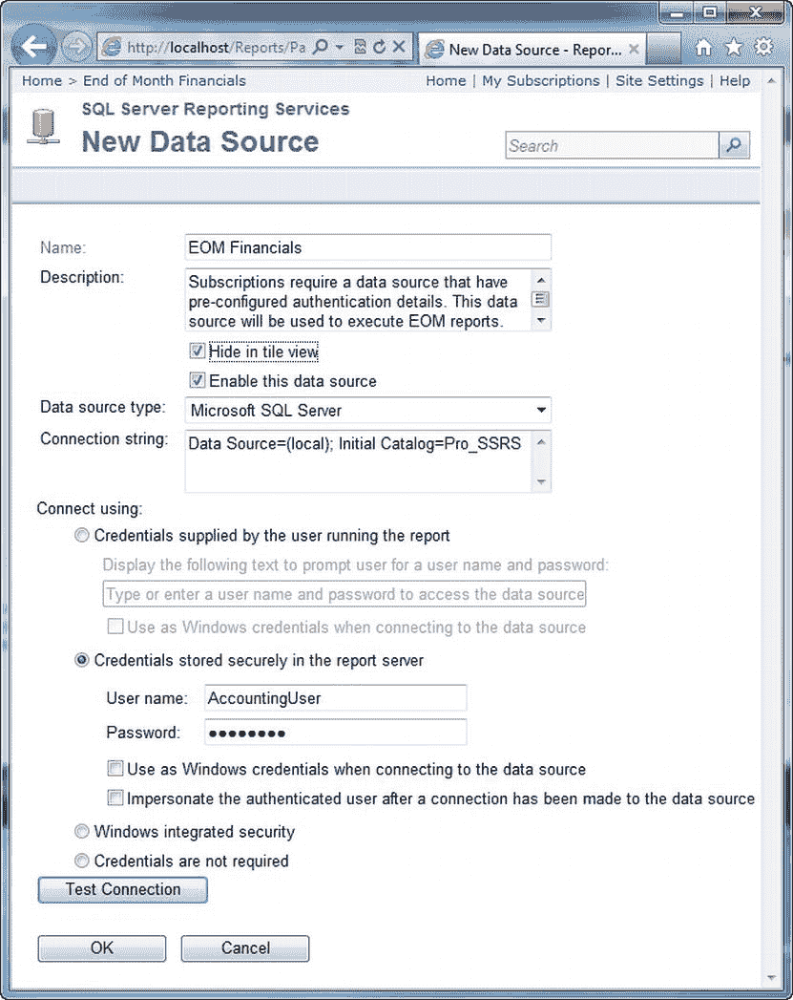

`图 10-9.` 数据源选项

### 修改报告数据源

现在我们有一个可用于会计报告的共享数据源，我们需要更改报告配置为使用的数据源。我们可以通过`报表管理器`中报告`属性`下的`数据源`选项卡来完成此操作。导航到`报表管理器`中的“月末财务报告”文件夹。接下来，将光标悬停在 AR 对账报告上。当你看到向下箭头时，点击它，然后选择`管理`，接着点击左侧菜单中的`数据源`选项卡。我们在这里可以选择浏览到现有的共享数据源或创建一个新的。

正如可以推断的那样，我们可以跳过上一步，并在同一步骤中执行创建和修改。然而，我们希望向你展示如何使用`新建数据源`按钮创建一个可供其他需要预配置身份验证设置的报告使用的新数据源。话虽如此，让我们继续将此报告链接到我们刚刚创建的共享数据源。点击`浏览`按钮，导航到“月末财务报告”文件夹下的`EOM Financials`数据源，如图 10-10 所示。点击`确定`以修改 AR 对账报告正在使用的数据源，然后点击`应用`保存新设置。在下一节中，我们将向你如何创建快照来存储报告历史。

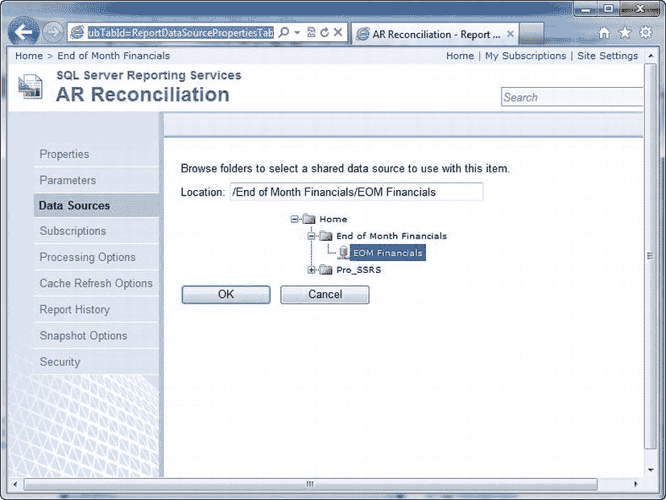

`图 10-10.` 修改报告的数据源

## 为报告历史创建快照

AR 对账报告的目标是允许其在每月的指定时间（出于性能考虑，选择非高峰时段）执行，并保存每月处理的历史记录。为此，我们在本章前面创建了“月末财务报告”共享计划。现在是时候利用 SSRS 的一个有益功能了，即能够将报告作为快照处理。

快照是报告的静态“时间点”副本。SSRS 中使用两种类型的快照：作为执行快照生成的（从预先执行的时间点渲染单个报告），以及为存储在报告历史中而生成的（可以包含在给定时间点的多个报告副本）。在本节中，我们将重点展示如何配置 AR 对账报告以生成报告历史的快照，从而可以生成一系列历史财务报告。

你将使用`报表管理器`来配置 AR 对账报告的历史属性，以便每次报告按照“月末财务报告”计划处理时，都会生成一个报告的快照。

让我们从查看存储报告历史的可用设置开始。如图 10-11 所示，几个设置不仅影响快照的创建，还影响快照在报告历史中的存储方式。在`报表管理器`中，你可以通过将光标悬停在报告上、点击向下箭头并选择`管理`（如前面导航到属性时所述）来导航到“快照选项”屏幕。进入报告属性屏幕后，点击左侧的`快照选项`选项卡。

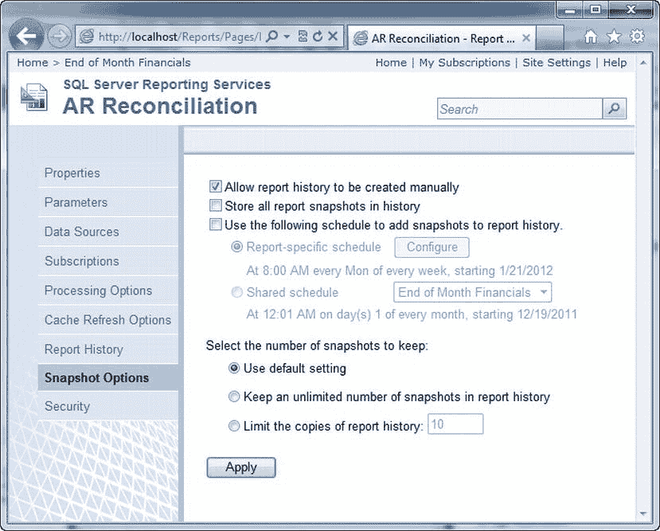

`图 10-11.` 报告快照选项

对于 AR 对账报告，设置快照选项如下：

*   用户将无法为报告历史创建快照。将此项设置为仅由计划运行的报告才会出现在报告历史中。
*   报告执行快照不存储在报告历史中。此选项与报告执行属性相关，将在下一节介绍。
*   使用“月末财务报告”共享计划。
*   报告历史中保留的快照数量使用“默认”设置。“默认”设置保留无限数量的报告，但你可以通过`报表管理器`中的`站点设置`来更改此设置。如果选择了保留特定数量的快照，例如 10 个，则首先删除较旧的快照以腾出空间。

按照图 10-12 所示进行选择后，点击`应用`。

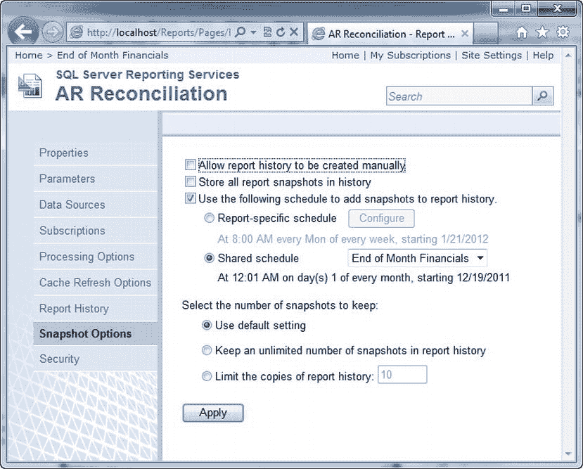

`图 10-12.` AR 对账报告的快照选项

 **注意** 为了创建快照和订阅，你需要确保包含`ReportServer`数据库的服务器上的`SQL Server Agent`正在运行。如果没有运行，你将收到以下错误：
```
The SQL Agent service is not running. This operation requires the SQL Agent service. (rsSchedulerNotResponding).
```
如果你看到此错误，只需在管理工具或`SQL Server Management Studio (SSMS)`中启动`SQL Agent`服务即可。

随着时间的推移，快照将在报告历史中被创建。有权访问报告历史的用户可以通过`报表管理器`导航到报告的`历史记录`选项卡来访问这些快照。AR 对账报告的`历史记录`选项卡（如图 10-13 所示）表明，在四个月的时间段内，按照预期生成了四个快照。

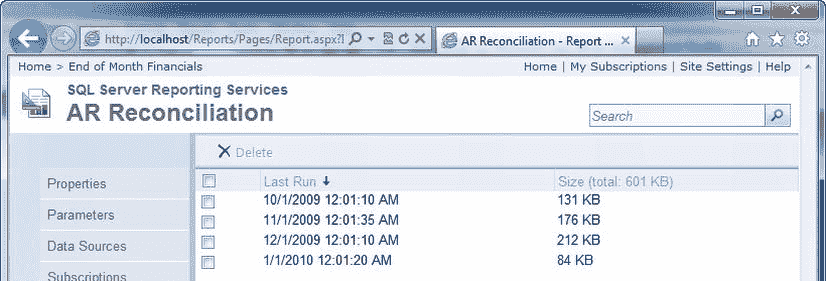

`图 10-13.` 按计划创建的 AR 对账报告快照

从历史记录中渲染报告对性能是有益的，首先是因为报告已被预处理，其次是因为无需查询报告的数据源，因为数据和布局信息都存储在快照中。在生成大型报告时，例如包含数百页的财务报告，我们强烈建议使用快照以及 SSRS 的其他增强性能的功能，例如报告缓存，我们接下来将介绍这个功能。

## 处理报告与执行缓存

`AR Reconciliation`报告现已设置为按计划交付、从快照渲染并保存在报告历史记录中。员工也会按需运行此报告，这意味着用户可以查看包含最新数据的报告。由于这可能是一份资源密集型的财务报告，您应确保在多个用户同时渲染报告时，性能不会受到影响。您将使用`报告管理器`来配置控制报告处理方式的设置。

第一步是导航到`AR Reconciliation`报告的`属性`选项卡，然后在左侧窗格中选择`处理选项`。图 10-14 显示了可用于报告处理的设置。

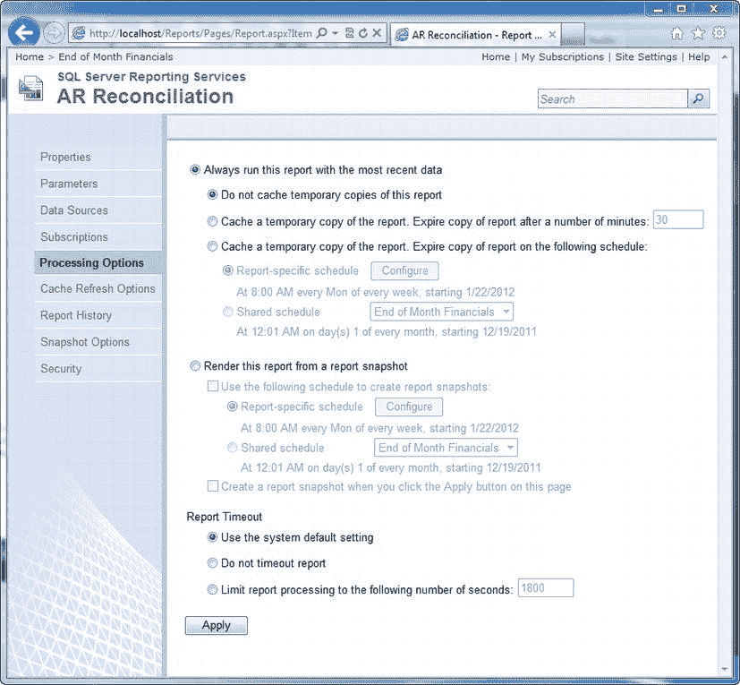

*图 10-14. 处理选项属性*

第一个处理选项“始终从最新数据运行此报告”具有多个控制报告缓存的设置。

缓存是`SSRS`的一项功能，允许存储报告的临时副本并将其呈现给用户。创建报告缓存副本的主要优势是性能提升。访问设置为缓存的报告的用户会生成第一个缓存实例。如果满足某些条件，每个后续用户都会收到该缓存副本。用户收到缓存副本的条件如下：

> *   后续用户必须在缓存报告设置为过期的时间间隔内访问报告。当缓存报告过期后，下一个用户必须创建一个新副本。
> *   如果缓存报告具有在后续执行期间更改的参数，并且每个用户基于该参数接收新报告，那么生成的每个报告都会成为特定于该参数值的缓存副本。
> *   报告的数据源未设置为`Windows 身份验证`或未设置为提示用户登录凭据。

对于我们的报告，指示`SSRS`缓存报告的临时副本，并在十分钟后使缓存副本过期。十分钟通常是保留缓存报告的一个良好时长，尽管这确实取决于您数据的时间敏感性。缓存报告中的数据当然会反映报告被渲染的时间，而不是当前时间，而且除非在报告上打印执行时间，否则用户无法知道他们正在查看的是缓存报告还是实时报告。

第二个选项“从报告快照渲染此报告”不应与创建报告历史记录的快照混淆。执行快照与历史记录快照不同，它可以从`报告管理器`中的`报告`文件夹查看，就像查看按需报告一样。另一方面，历史记录快照是从报告的`报告历史记录`选项卡查看的，并且可以积累许多副本。

快照不会像缓存报告那样过期；相反，它们会在指定的时间间隔刷新。如果您选择为报告生成执行快照，则该报告无法被缓存。在此示例中，请不要选择此选项。

最后一个报告执行选项设置报告的超时间隔，可以是默认设置（通常为 1,800 秒，即 30 分钟），也可以是指定值。这是一个重要的设置，因为长时间运行的报告会使用宝贵的系统资源。对于`AR Reconciliation`报告，您将使用默认值。

我们提到了在使用具有时间敏感性数据的报告缓存时涉及的权衡。选择使用快照或缓存报告时的另一个重要考虑因素是磁盘空间。随着时间的推移，设置为较长过期时间的历史记录和缓存报告可能会积累起来。然而，与随之而来的性能提升和生产力提高相比，磁盘存储的成本微不足道，不应阻止任何人利用`SSRS`的这些有益功能。

## 管理订阅

`SSRS`的订阅服务提供了一种将预执行报告传递到指定位置、通过电子邮件发送给用户、发送到网络文件共享或甚至直接发送到打印机的方法。使用订阅有几个关键好处。在组织内部，员工在特定时间（例如每天或月底）需要关键信息。在外部，客户可能希望按预定时间表接收新闻通讯或财务报表。订阅可以轻松满足这两种需求。

设置订阅的另一个好处是允许您在非高峰时段安排资源密集型报告的处理，从而确保在高使用量期间网络性能下降很少或没有下降。在本节中，您将使用两种类型的订阅：

> *   **标准订阅：** 为一个或多个用户静态设置。
> *   **数据驱动订阅：** 订阅者列表可以从多个数据源位置派生，并且可以通过自定义查询生成。

 **注意** 数据驱动订阅是迄今为止最强大的订阅形式。它们仅在`SSRS`的企业版中可用。

## 管理标准订阅

您将从为一家向患者提供家庭护理服务的医疗保健组织的员工设置标准电子邮件订阅开始。这份名为`患者重新认证列表`的报告是为负责跟踪患者文档的员工设计的。您可以为任何报告创建标准电子邮件订阅。在我们的业务中，要求患者的文档（本例中为`HCFA 485`）由主治医师完成并签署。该报告本质上是这些员工的每日工作清单，任何未签署的文档都会成为一项工作。

您可以在`Apress`网站（[`www.apress.com`](http://www.apress.com)）的“源代码/下载”区域提供的`Pro_SSRS`报告项目中找到`患者重新认证列表`报告。您可以使用`BIDS`将报告部署到您的报告服务器。打开`Pro_SSRS`项目，并将项目的`目标报告文件夹`更改为`患者文档`。接下来，右键单击`患者重新认证列表`报告，选择“部署”以创建`患者文档`文件夹，并将报告和数据源发布到您的报告服务器。需要注意的是，`Pro_SSRS`项目中提供的`Pro_SSRS`数据源使用`Windows 身份验证`，为了让订阅成功运行，凭据需要安全地存储在数据库中。要将已部署的`Pro_SSRS`数据源从`Windows 身份验证`更改为存储凭据，请在`报告管理器`中导航到`患者文档`文件夹选择`Pro_SSRS`数据源。将“连接使用”选项更改为“在报告服务器中安全存储的凭据”，并提供适当的凭据。

由于此报告需要足够通用以支持按需查看以及用于订阅，我们添加了一个名为`未签署`的报告参数，该参数与报告筛选器配合使用以显示具有已签署和未签署文档的患者。此报告还有其他参数，如图 10-15 所示。如您所见，在生成订阅时将使用这些参数。

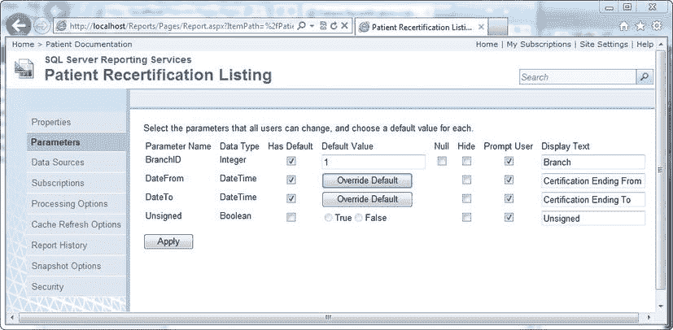

*图 10-15. 带参数的患者重新认证列表报告*

## 创建标准订阅

手动创建订阅的第一步是运行 `Report Manager` 并导航到要为其创建订阅的报告。作为示例，导航到 `Patient Certification Listing` 报告，该报告位于报告服务器上的 `Patient Documentation` 文件夹中。将光标悬停在报告上方，直到看到向下箭头，然后单击它以查看选项菜单。从这里，您可以选择 `Subscribe` 或 `Manage`，然后导航到 `Subscriptions` 选项卡。不过，这次我们将选择 `Subscribe` 以为报告创建新订阅。如果您在安装过程中已正确配置了 `SMTP` 服务器，您将可以选择 `E-mail` 作为传递选项。如果 `E-mail` 选项不可用，您可以使用 `Reporting Services Configuration Manager` 来设置电子邮件，如 图 10-16 所示。`Reporting Services Configuration Manager` 可以设置许多与命令行工具相同的、控制报告服务器的属性。`Reporting Services Configuration Manager` 是一个很好的工具，用于设置可能需要在安装后配置的报告服务器属性，例如报告服务器虚拟目录或用于执行无人参与报告的帐户。您将再次使用 `Reporting Services Configuration Manager` 将 `SSRS` 实例加入另一个报告服务器，从而创建报告服务器的 Web 农场以提升性能。现在，请验证 `SMTP` 设置是否正确。

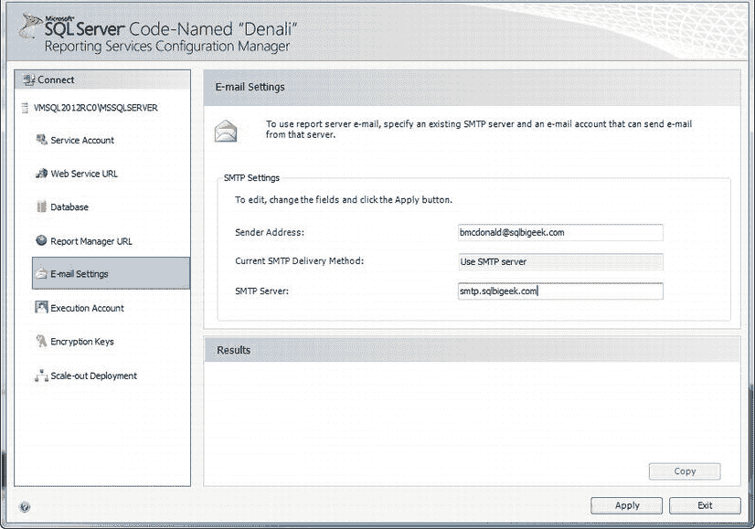

**图 10-16.** Reporting Services Configuration Manager，电子邮件设置

通过电子邮件传递的订阅提供标准的传递选项，包括 `抄送`、`密件抄送`、`回复至`、`主题`、`优先级` 和 `注释`（这将是电子邮件正文的内容）。您还可以在电子邮件中发送整个报告、报告的链接或两者。由于将接收此订阅的用户将可以访问报告服务器的网络，因此您可以只发送报告链接。然而，通过电子邮件发送报告本身确实有好处，特别是对于需要离线使用报告的用户，例如出差员工。我们将在下一节中设置数据驱动订阅时进行演示。图 10-17 显示了报告订阅可用的电子邮件选项。

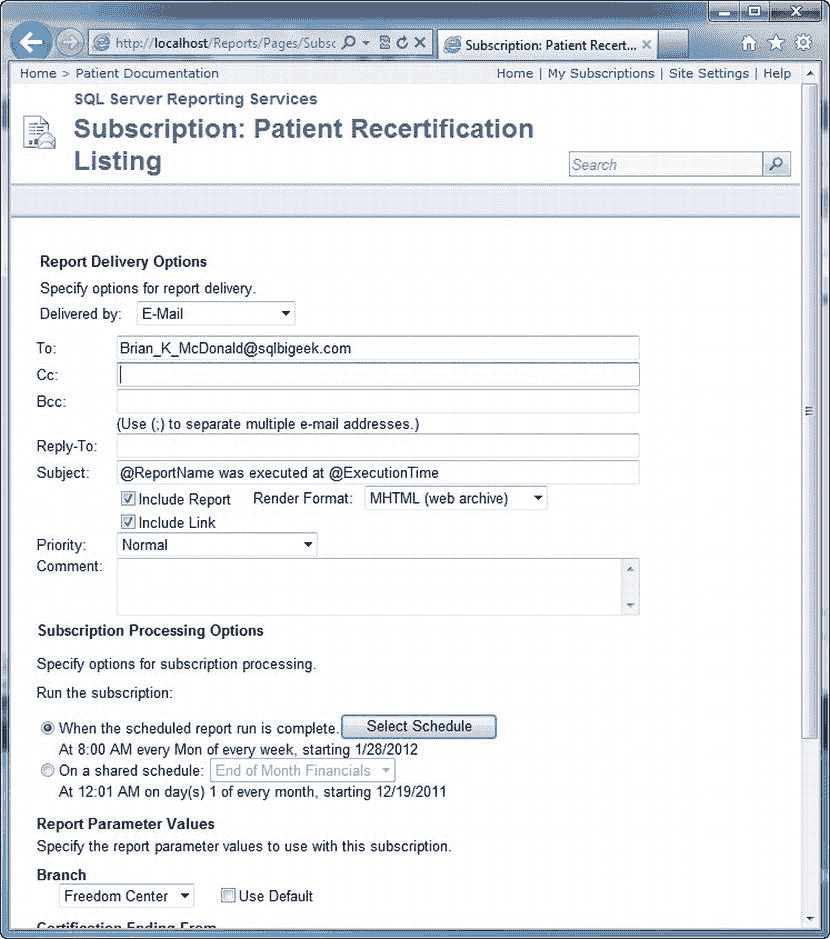

**图 10-17.** 订阅的电子邮件选项

## 配置订阅

为了提供自动传递系统，我们可以配置 `Reporting Services` 订阅在预定义的计划时间和频率执行。您可以自定义单个报告的日程安排，或基于共享日程安排。`Patient Recertification Listing` 报告需要每天传递给工作人员，只要在下一个工作日之前传递，它可以在前一天下午 5:00 之后的任何时间运行。根据我们的需求，除了周六之外每天晚上 9:30 的日程安排就足够了，如 图 10-18 所示，这是通过单击 `Subscription Processing Options` 下的 `Select Schedule` 按钮设置的。

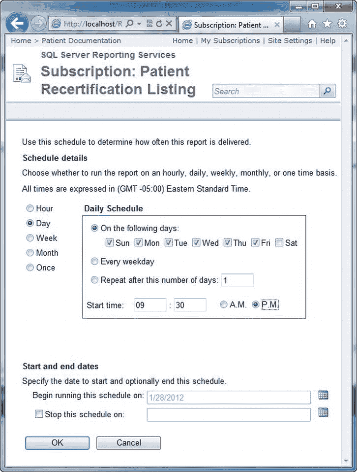

**图 10-18.** 患者认证列表报告的每日日程安排

进行适当的时间安排修改后，单击 `OK` 保存更改。此报告包含参数，我们将需要为此订阅配置参数。如前所述，此特定报告有一个名为 `Unsigned` 的参数，它是 `Boolean` 数据类型（`True` 或 `False`），显示已签署和未签署的文档。但是，此报告的订阅者可能只对查看未签署文档感兴趣，因此将 `Unsigned` 参数设置为 `True`。由于此报告设计为基于单个数据集为参数值提供填充的下拉列表，因此这些值在此处可用，例如填充的 `Branch` 选择，如 图 10-19 所示。目前，除 `Unsigned` 外，所有参数均保留其默认值。

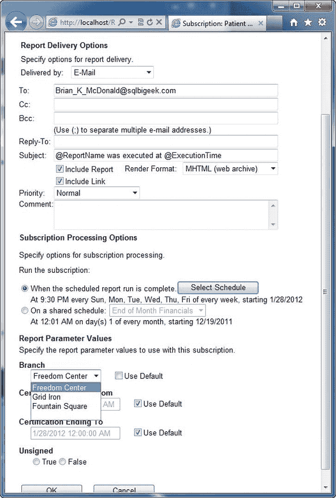

**图 10-19.** 订阅参数下拉列表

为了验证订阅是否按预期工作，我们将 `Brian_K_McDonald@sqlbigeek.com` 设为邮件的唯一收件人进行测试。在 图 10-20 中，您可以看到 `收件人`、`抄送`、`密件抄送` 和 `回复至` 的标准电子邮件选项。在 `收件人` 字段中，添加收件人的电子邮件地址，然后单击 `OK` 添加订阅。验证订阅成功后，通过导航到 `Report Manager` 中的报告，选择 `Subscriptions`，然后选择 `Edit`，修改订阅的属性以添加真正的订阅者。

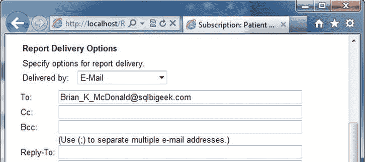

**图 10-20.** 为订阅分配收件人

## 管理数据驱动订阅

标准订阅满足了许多公司为其员工和客户设置自定义订阅的需求。然而，您可以使用另一种更灵活的方法来传递报告：数据驱动订阅。数据驱动订阅允许管理员或内容管理器查询数据源（例如 `SQL Server` 表），以返回符合特定条件的订阅者列表。这是向广泛的订阅者列表传递报告的理想方式。此外，您只需为所有订阅者管理一个订阅，并且这些订阅者可能具有用于生成个性化报告的不同参数。

我们知道我们希望让客户及其员工能够利用数据驱动订阅，幸运的是，我们很久以前就构建了我们的应用程序数据库，以包含正好用于此目的的员工信息。通过存储员工的电子邮件地址以及其他数据（如地理位置和认证），我们拥有了通过电子邮件向出差员工提供灵活传递系统所需的一切。我们最初的目标员工是临床医生，他们有每日要查看的患者日程安排。大多数临床医生在日常工作中使用笔记本电脑或 `PDA`。


## 设计订阅查询

第一步是重新设计一个`SSRS`报表，使其能够为临床员工提供每日日程安排，并对其进行参数化处理，以便每次执行时都能根据特定员工进行定制。作为数据驱动订阅的一部分，该报表将被处理并以可嵌入、可打印的格式（如`PDF`或`WORD`）发送给员工，如果他们在线，也会提供一个连接到`SSRS`报表服务器的链接。图 10-21 展示了我们创建的报表——“每日活动”。

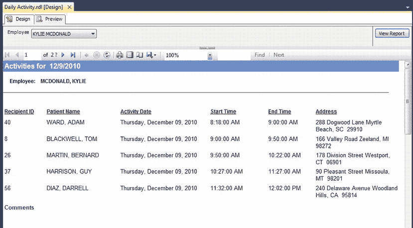

**图 10-21.** 每日活动报表

由于数据驱动订阅正是基于数据，因此一个驱动订阅的查询至关重要。设计查询时包含选择性条件非常重要，因为`SSRS`会为数据源返回的每条记录交付一份报表副本。

对于我们的收件人列表，我们使用清单 10-2 中的查询。本质上，该查询返回所有拥有电子邮件地址且在报表执行日期的次日有已安排活动的员工。该报表在下班后进行处理和交付。在我们的环境中，员工的日程在晚上 9 点之后变更并不常见，因此我们将报表设置为在该时间执行。

**清单 10-2.** 用于返回订阅者列表的 T-SQL 查询

```sql
SELECT DISTINCT
        EmployeeTblid, Email, HWUserLogin, ActivityDate
FROM
        Employee E (NOLOCK)
        JOIN Activity A (NOLOCK) ON E.EmployeeTblid = A.ProviderID
WHERE
        E.Email IS NOT NULL
        AND A.ActivityDate BETWEEN GETDATE() AND GETDATE() + 1
```

当这个查询执行时，其输出会产生六行数据，如表 10-1 所示，这表明有六位临床医生在次日有活动。格式化和比较日期时间值的方法有很多。然而，在本例中，使用 `GETDATE` 函数将当前日期与 `ActivityDate` 字段值进行比较是最佳选择。有必要使用 `BETWEEN` 和 `GETDATE`，因为 `ActivityDate` 值的时间部分默认为 `00:00:00`，而 `GETDATE` 返回的是当前时间。这两种值在一对一比较时无法匹配。

> **注意** `Activity` 表中的数据是静态的，因此在使用 `GETDATE()` 函数时可能无法按预期工作，因为在您运行查询时可能没有行可以返回。您可以轻松地更新活动日期以反映您当前的日期时间，或者修改查询本身，使其回退 (n) 天，其中 n 代表要回退的天数。

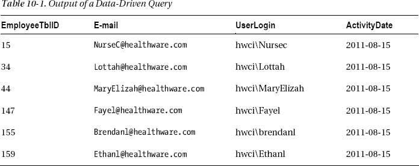

## 创建数据驱动订阅

现在我们将展示在报表管理器中创建数据驱动订阅的过程。“每日活动”报表包含在 `Pro_SSRS` 报表项目中，该项目可在 `Apress` 网站的源代码区下载。您可以将该报表部署到报表服务器上的任何文件夹中以测试订阅。部署报表时，请确保修改随报表一起部署的 `Pro_SSRS` 数据源，使其将凭据存储在报表服务器上，这是创建订阅所必需的。打开浏览器，导航到“每日活动”报表，然后从那里单击向下箭头并选择 `管理`。进入报表属性页面后，在左侧选择 `订阅` 选项卡。在工具栏上，选择 `新建数据驱动订阅`。按照以下步骤完成数据驱动订阅：

> 1.  选择名称、传递方法和数据源类型。
> 2.  选择数据源位置或定义新数据源。
> 3.  选择用于返回收件人列表的命令或查询。
> 4.  选择电子邮件传递扩展插件的设置。
> 5.  选择报表参数。
> 6.  选择订阅的处理时间。
> 7.  为报表设置计划。

其中最重要的步骤是第 4 步，您需要在其中指定传递扩展插件的设置。在这里，您将使用驱动查询中的数据来指示 `SSRS` 如何发送订阅。第 4 步中的每个选项都有一个设置，可以选择从第 3 步使用的查询中检索派生的值，这比标准订阅灵活得多。

在第 3 步中，您将查询粘贴到查询框中，如图 10-22 所示，并通过单击 `验证` 按钮进行验证。从这时起，您在查询中选择的字段，即 `EmployeeTblid`、`Email`、`HWUserLogin` 和 `ActivityDate`，都可以在后续步骤中用作条件。

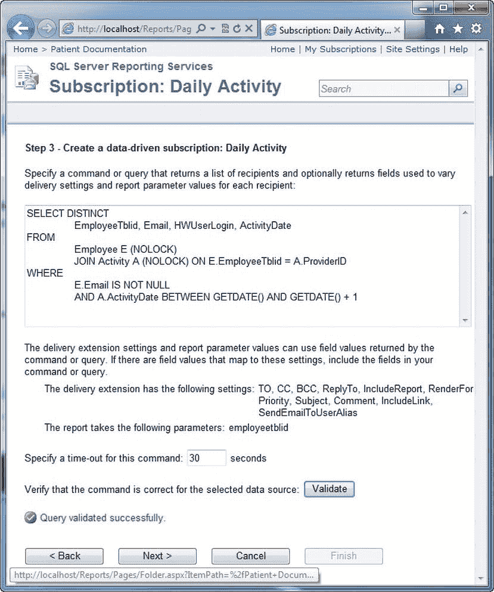

**图 10-22.** 驱动订阅的已验证查询

在第 4 步中，有几个设置控制报表如何发送给订阅者：`收件人`、`抄送`、`密件抄送`、`回复至`、`包含报表`、`呈现格式`、`优先级`、`主题`、`注释`和`包含链接`。对于每个设置（`收件人` 除外），您都可以选择静态值、数据库值或无值，如图 10-23 所示。您将 `收件人` 字段分配给订阅查询中的 `Email` 字段。将所有其他字段的值保留为其默认设置，然后单击 `下一步` 按钮继续进入步骤 5 - 创建数据驱动订阅。保留默认设置后，订阅会自动在给订阅者的电子邮件中包含报表本身以及报表的链接。

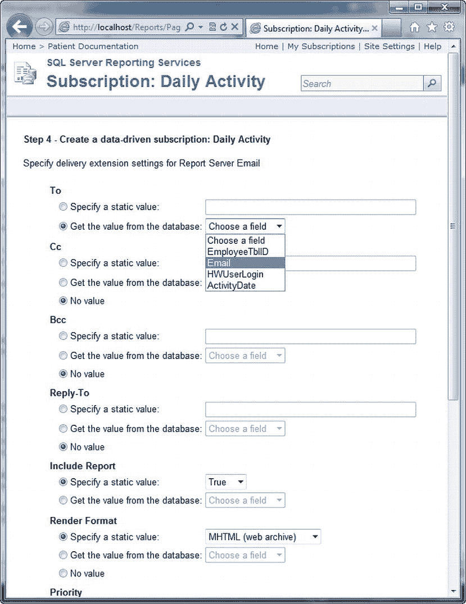

**图 10-23.** 订阅设置

> **注意** 与标准订阅不同，通过数据驱动订阅，您可以控制每个订阅者的呈现格式，因为它也是一个数据驱动的设置。如果您需要按用户控制呈现格式，可以在 `Employee` 表中添加一个字段来存储此值，并在查询中选择此值。另请注意，订阅的默认呈现格式是 Web 存档。对于许多类型的报表来说，这不是理想的选择。其他可打印报表更适合用于打印，例如 `Adobe Acrobat PDF`、`Microsoft Word` 文件或静态图像文件，如 `TIFF`。

在第 5 步中，您可以选择指定静态值或来自数据库的值。由于您希望订阅为返回的每条记录生成一份报表，您将选择单选按钮以从数据库获取值。`EmployeeTblid` 字段用于报表中的一个参数。因为您已在查询中选择了此字段并将其作为参数输入传递，所以每个报表都会自动生成特定于订阅该报表的员工的数据。选择 `EmployeeTblID` 作为参数要使用的值，然后单击 `下一步` 按钮。另一个字段 `HWUserLogin` 被放入驱动查询中，您最终会将其与执行报表的用户的 Windows 登录名进行比较。如您将在第 11 章 中看到的，这可以通过使用 `User` 全局集合来实现。

对于最后一步，您创建一个计划，如前所述，在每个工作日晚上 9:30 处理报表。您可以创建另一个共享计划来处理订阅，并进行测试以验证电子邮件是否成功传递。完成此操作后，订阅配置即告完成。


### 执行审计与性能分析

当你将 SSRS 部署在开发、测试和生产环境之间时，你会发现评估性能涉及多种基准测试和分析工具。基于性能分析，管理员能够了解其服务器可以承受的压力水平，并能够相应地配置环境。我们将展示如何测试 SSRS 部署的各个组件，并说明如何使用标准工具分析输出结果。

 **注意** SSRS 2008 版本引入了重新设计的报告引擎，通过消除对 IIS 的依赖（这是之前版本 SSRS 的一个痛点）增强了其内存管理功能。从该版本开始，Web 服务和 Windows 服务合并为一个 Windows 服务。

许多机构需要监控和归档用户活动的详细信息。如果你怀疑存在对数据的未授权访问，这一点尤其重要。SSRS 提供了一个内置的日志记录功能，可捕获若干关键信息片段。这些信息在两个方面很有用：

> *   你可以捕获关于报表的性能信息，例如处理时长和记录数。
> *   你可以捕获安全信息，例如谁执行了报表以及他们是否成功执行。

以下章节的第一个目标是，使用 SSRS 安装中提供的工具来设置和扩展 SSRS 的内置日志记录功能。你需要记录所有活动，以便能够找出对服务器影响最大的报表和用户。我们创建了一个自定义的 SSRS 报表——“报表执行日志”，它将向管理员提供日志统计信息，并根据报表参数包含动态的列分组。我们将展示如何为你的 SSRS 部署使用此报表。

以下章节的第二个目标是，展示如何在我们测试 Web 场中的 SSRS 服务器上执行基准测试，以确保 SSRS 部署到生产环境时不会出现意外的性能问题。我们将展示如何使用一个名为 Application Center Test (ACT) 的 Web 应用程序压力测试工具来评估性能。

## 配置 SSRS 日志记录

访问 SSRS 中的执行日志信息是一个相当简单的过程。它涉及 SSRS 数据库中的一个主表，恰如其名地称为 `ExecutionLogStorage`。默认安装 SSRS 时，执行日志记录是启用的，并设置为保留 60 天的日志。60 天后，超过 60 天的日志条目会自动从表中删除。但是，你可以选择通过 `SSMS` 连接到 SSRS 实例，然后右键单击服务器并选择 `属性` 来更改此持续时间。在服务器属性窗口出现后，导航到“日志记录”选项卡。图 10-24 显示了如果你想将保留天数更改为 365 天而非默认的 60 天时的设置。

执行详细信息被存储起来，并且既然目标之一是构建一个自定义 SSRS 报表以向管理员提供报表执行信息，你将需要能够查询日志数据。幸运的是，Microsoft 创建了三个视图，它们利用执行详细信息，使得确定诸如执行报表的用户、报表处理或渲染所花费的时间、甚至是通过交互方式还是通过订阅执行等信息变得容易。`ReportServer` 数据库中的三个视图是 `ExecutionLog`、`ExecutionLog2` 和 `ExecutionLog3`。我们将把这些视图作为我们管理报表的基础。

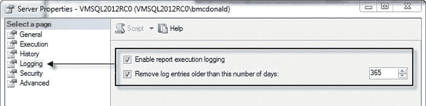

***图 10-24.** 报表服务器属性 - 执行日志设置*

## 转换 ExecutionLog 表

设置 SSRS 来转换日志数据是一个简单的分步过程。在过去的几年里，我们创建了许多解决方案，用于将执行数据传输并存储到历史数据库中，这样当 SSRS 从数据库中删除这些数据时，我们不会丢失任何执行详细信息。其中一种解决方案是使用 SQL Server Integration Services (`SSIS`) 包来每日传输执行历史记录。作为 `Pro_SSRS` 解决方案的一部分，我们包含了一个 `SSIS` 项目，其中包含一个名为 `Pro_SSRS_Load_ExecutionLog.dtsx` 的包。此外，下载内容中还包括 `Pro_SSRSExecutionLog` 数据库。你需要还原此数据库，以便 `Pro_SSRS_Load_ExecutionLog` 包和本章中创建的报表能够运行。有关如何还原 `Pro_SSRSExecutionLog` 数据库的详细说明，请参阅 `ReadMe.txt` 文件。你可以从 Apress 网站 ([`www.apress.com`](http://www.apress.com)) 的 Source Code/Download 部分下载 `Pro_SSRS` 项目。

`Pro_SSRS_Load_ExecutionLog` 包非常直接。在包的顶部，我们只是检查数据库是否存在，如果不存在，则分支到一条语句，该语句会创建数据库、一个用于归档执行日志的表，并加载所有截至昨天的记录。如果数据库已存在且记录尚未存在于该数据库中，则所有这些记录都会从 `ReportServer` 数据库中提取到归档数据库中。在每晚安排执行此包后，它将获取前一天的数据。图 10-25 显示了在开发环境中以交互方式运行时，完成一天加载后的包结果。

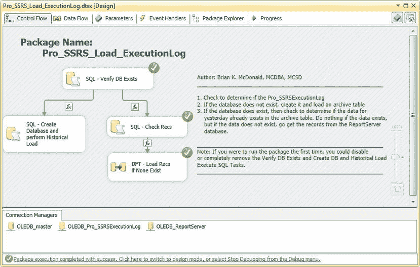

***图 10-25.** Pro_SSRS_Load_ExecutionLog SSIS 包*

 **提示** 请注意，需要定期执行该包以保持转换后的日志数据是最新的。在我们的场景中，我们为此目的创建了一个计划作业，每晚运行 `SSIS` 包。

Microsoft 提供了一组示例报表，你可以与 `ExecutionLog` 数据库一起使用。这些示例包含在 SQL Server 2008 安装的以下位置：`Samples\Reporting Services\Report Samples\Server Management Sample Reports\Execution Log Sample Reports`。这些示例报表对于向管理员提供信息非常有用，例如按用户和报表大小统计的报表执行情况等。你会找到三个 SSRS 执行日志示例报表。其中之一 `Execution Summary`（执行摘要）如 图 10-26 所示。

在之前的 SSRS 版本中，Microsoft 提供了一组示例报表，你可以与一个可用于传输数据的 `SSIS` 包结合使用，来从 `ReportServer` 数据库报告数据。然而，截至目前，尚未为 2012 版本创建新版本。因此，我们创建了一个示例 `Execution Summary` 报表，它提供了一些我们的管理员希望关注的有意义的指标。其中一些指标包括总执行次数、成功执行次数、失败执行次数以及按每月天数统计的执行次数。

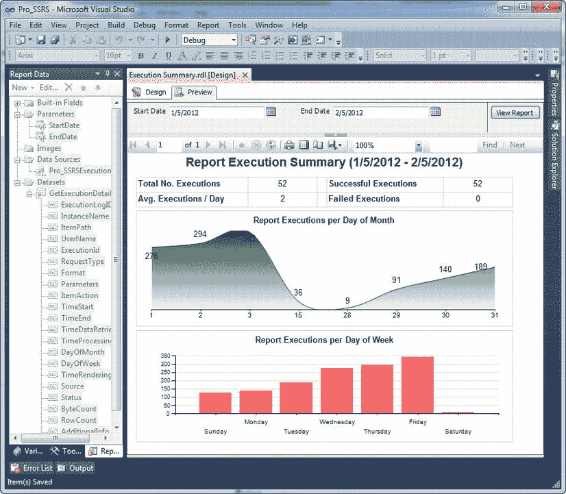

***图 10-26.** 执行摘要示例报表*


## 设计日志报告

我们知道需要另一份包含所有执行日志信息且便于管理员分析的报告。因此，我们利用单次查询的数据，创建了一份名为**报告执行日志**的矩阵式报告。

要根据执行日志中的信息衡量性能，你需要掌握几项统计数据：

> *   **检索数据总时长**：数据检索花了多长时间？
> *   **处理总时长**：报告处理花了多长时间？
> *   **渲染总时长**：报告渲染花了多长时间？
> *   **字节数**：报告包含多少字节？
> *   **行数**：报告包含多少行数据？

此外，了解报告的执行时间也很有用。对于矩阵中的行分组，我们希望看到执行了哪份报告、由谁运行报告，以及报告来自哪台客户端机器。对于列分组，我们希望提供两种选择：渲染格式（例如 HTML 4.0、Word 或 PDF）或源类型（即 SSRS 如何生成报告，如实时、缓存或快照）。`Source_Type` 是一个需要监控的重要字段，因为 SSRS 生成报告的方式直接影响性能。从缓存副本或快照（两者都是报告的预处理副本）生成报告，对性能是有益的。如果 SSRS 总是为用户生成实时或按需报告，性能可能会受到影响。

为了实现矩阵中的动态列分组，你将使用一个名为 `Column_Group` 的参数，该参数接受查询中字段名的值：`Format` 或 `Source_Type`。你将使用 `Format` 作为默认值，以便在预览时自动渲染报告。列分组和标题值都将使用以下表达式，根据参数使列动态变化：

```
=Fields(Parameter!Column_Group.Value).Value
```

当报告被渲染时，如图 10-27 所示，它将默认使用 `Format` 字段，但你可以通过将参数下拉选项更改为 `Source_Type` 来动态改变它。

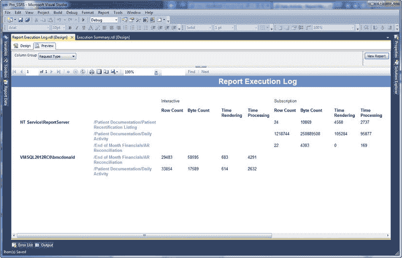

**图 10-27.** 报告执行日志报告

### 监控性能

当然，没有人愿意经历这样的挫折：在开发环境中构建了一个稳固的报告解决方案，却在部署给广大用户时发现它无法承受压力。通常，最佳实践是对服务器施加模拟负载，以便更好地了解系统的运行情况。同样，当你推出一个完整解决方案时，常见的做法是分批次、分阶段地向有限数量的用户推出功能。这正是我们在在线模型中所采用的方法。

推出策略还应包括一份计划，明确哪些报告将提供按需访问，哪些将通过报告快照或订阅提供，正如你在本章前面所做。结合高峰时段和非高峰时段的报告处理策略，将极大地提升性能。SSRS 性能的另一个考量点在于分离 SSRS Web 服务和数据库服务的负载。也就是说，如果整个 SSRS 安装都位于同一系统上，可能会对性能产生负面影响。

在本节中，我们将展示我们进行压力测试的结果，该测试访问了两个独立服务器 `RS05` 和 `HWC04` 上的两个报告服务器实例。许多工具（如 SSRS）可用于对 Web 应用程序进行压力测试；幸运的是，Visual Studio 2010 的 Ultimate 版内置了 Web 压力测试工具，我们使用它对两台服务器施加了模拟负载，最多可模拟 250 个虚拟用户。你可以在 [`www.microsoft.com/visualstudio`](http://www.microsoft.com/visualstudio) 了解更多关于该 Web 测试工具的信息。

我们还将向你展示如何使用 `rsconfig` 将 SSRS 服务器加入 Web 场，以了解将资源卸载到另一系统将如何提升性能。Reporting Services 配置管理器也可用于此目的。

我们首先对 `RS05` 运行了 15 个用户的模拟负载，所有用户都执行单个报告。我们通过任务管理器监控服务器，快速评估了性能影响。幸运的是，当对 Reporting Services 服务器运行模拟负载时，并没有造成太大的性能负担。然而，在某些情况下，你可能会遇到 CPU 达到极限的情况。在这些情况下，你很可能会发现占用处理器的单个进程是 SQL Server 和 `ReportingServicesService.exe`。图 10-28 显示了测试运行期间，CPU 使用率峰值在 25% 到 85% 之间跳跃。

我们知道我们的测试用 SSRS 服务器是一个四处理器系统，拥有超过 3GB 的内存。在你的 CPU 使用率达到极限的情况下，这告诉我们瓶颈在于 CPU。由于我们 SSRS 的生产部署不会镜像 `RS05` 的设置（换句话说，生产服务器将是至少拥有 32GB 内存的高端系统），我们可以将这一点考虑在内。

然而，还有一个因素会对生产和测试环境之间的性能差异产生重大影响。在测试环境中，SSRS 服务和 SQL Server 位于同一系统 `RS05` 上。如果我们将 SSRS 服务配置为使用远程 SQL Server 实例作为其数据库会怎样？虽然通过网络访问 `ReportServer` 数据库而不是本地数据库可能会导致任何性能下降，但如果 CPU 利用率百分比下降到更易于管理的水平，这种影响将可以忽略不计。

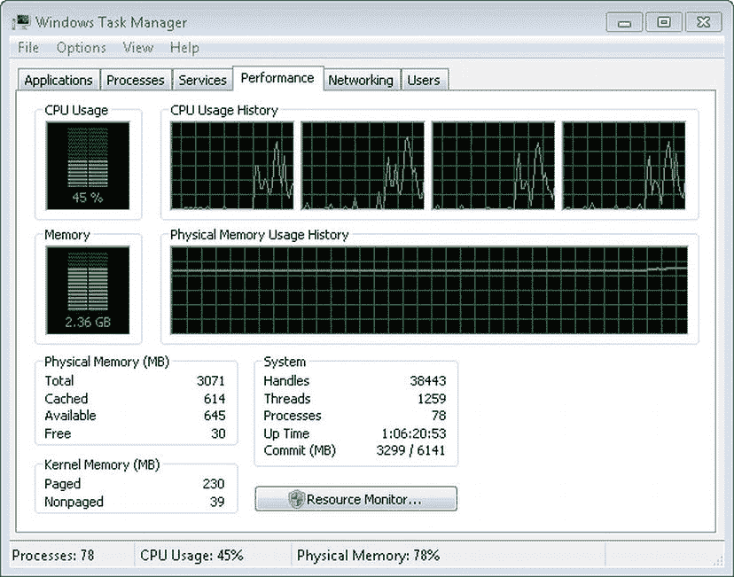

**图 10-28.** 任务管理器

如果你有两台 SSRS 服务器，那么将 SSRS 服务器从一个实例移动到另一个实例是很简单的。我们在测试环境中有两台 SSRS 服务器，`RS05` 和 `HWC04`，因此移动相当容易。为了指示 `RS05` 上的 SSRS 服务使用 `HWC04` 上的 SSRS 数据库，我们使用了命令行实用程序 `rsconfig`。当首次将一个 SSRS Web 服务加入使用相同 `ReportServer` 数据库的 Web 场时，需要使用 `rsconfig` 命令或 Reporting Services 配置管理器。`rsconfig` 命令的语法如下：

```
rsconfig -c -s HWC04 -d ReportServer -a SQL -u username -p password
```

在 `RS05` 使用远程 SQL Server 数据库后，我们启动了另一项测试，以观察 CPU 利用率是否有所改善。CPU 利用率显著改善，现已降至 60% 的平均水平以下。

 **注意** SSRS 2012 的部署以及数据库和数据源的位置有特定的许可指南。更多信息，请访问 [`www.microsoft.com/sqlserver/en/us/get-sql-server/licensing.aspx`](http://www.microsoft.com/sqlserver/en/us/get-sql-server/licensing.aspx)。


### 通过编程控制 SSRS

通过代码控制 SSRS 2012 主要有两种方法：

*   Web 服务
*   Windows 管理规范 (WMI)

在接下来的章节中，我们将初步介绍如何使用这两种技术通过代码管理报表。你将使用 SOAP API（也称为报表服务器 Web 服务）为你在第 9 章中创建的 SSRS 查看器添加订阅功能。现在，你将扩展它，允许你的用户为你迄今为止开发和部署的报表添加订阅。这有两个主要好处。首先，它允许你在白天（SQL Server 和 SSRS 2012 服务器使用最繁忙的时候）卸载一部分处理活动。其次，它为想要接收报表的高管们节省了时间，他们无需再导航到报表服务器、输入参数并等待结果。下面的每个代码清单都将用 C# 展示，但 VB 版本包含在 `Pro_SSRS` 项目下载中，可从 Apress 网站（[`www.apress.com`](http://www.apress.com)）的源代码/下载部分获取。

## 使用 SOAP 控制 SSRS

SSRS 2012 报表服务器 Web 服务提供了一种功能丰富的方式与报表服务器交互并对其进行控制。基于 SOAP 并通过 HTTP 运行，报表服务器 Web 服务是访问服务器功能的一种简单而强大的方式。事实上，SSRS 2012 的报表管理器就是使用 ASP.NET 和 SSRS 报表服务器 Web 服务构建的。

使用报表服务器 Web 服务，你可以创建自定义应用程序来控制服务器的各个方面，并覆盖整个报表生命周期：

*   文件夹和资源管理
*   任务、角色和策略管理
*   数据源和连接
*   报表参数
*   报表呈现
*   报表历史记录
*   报表计划
*   报表订阅
*   链接报表

##### 为 SSRS 查看器添加订阅功能

你已经在第 8 章和第 9 章中使用了报表服务器 Web 服务来提供报表参数及其可能值的列表，以及部署报表。在本章中，你将学习如何使用报表服务器 Web 服务来计划报表，使其在每个工作日办公室开始办公前自动运行。

正如你在本章前面部分看到的，你可以通过报表服务器本身的用户界面设置订阅服务。但是，你可能希望在你定制的 Windows 窗体（或 Web）应用程序中提供此功能。在这个示例中，你将扩展之前的 Windows 窗体应用程序，允许用户提供他们希望运行报表时使用的参数，以及安排运行报表的时间并指明要使用的传递机制。

在这个示例中，你将只允许用户选择系统管理员已经定义的共享计划。因为你希望集中控制计划报表的运行时间，所以不会赋予用户定义自己计划的能力。你还将允许他们基于快照触发订阅。这允许他们在为其报表创建快照时接收他们订阅的报表。详情请参阅本章前面的“为报表历史记录创建快照”部分。

在运行包含的示例之前，请务必阅读 `ReadMe.htm` 文件。它位于示例根文件夹中的一个文件里。如果你在 Visual Studio 中打开了代码，它将位于“解决方案项”文件夹下。它包含了运行示例所需的设置和配置步骤。

##### 访问现有的共享计划

如果你要逐步研究这段代码，请先打开第 9 章的项目，因为它将作为我们添加内容的起点。打开解决方案后，打开 `SSRS Viewer RVC` 项目，并完成以下步骤：

1.  选择 项目 ➤ 添加新项。
2.  在“添加新项”对话框中，选择“Windows 窗体”，并在名称中输入 `PickSchedule.cs`。
3.  在设计模式下打开 `PickSchedule.cs` 窗体后，通过属性页将其大小调整为 450×150。
4.  添加一个标签，将其 `Text` 属性设置为“计划”，添加一个名为 `sharedSchedules` 的组合框，并添加一个名为 `setSchedule` 的按钮，将其 `Text` 属性设置为“确定”。完成后，你应该拥有一个看起来像图 10-29 的窗体。

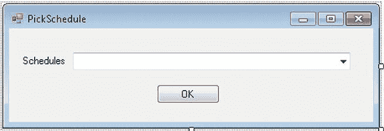

图 10-29. “选择计划”对话框

现在为 `PickSchedule` 类选择“查看代码”。对于此示例，你将添加几个 `using` 语句来导入在其他命名空间中定义的类型，以便在实际编码时避免键入完整的命名空间。将清单 10-3 中所示的命名空间添加到 `PickSchedule.cs` 类文件中其他 `using` 语句的下方。

清单 10-3. 导入命名空间

```
using System.Collections;
using System.Diagnostics;
using System.Web.Services.Protocols;
using SSRS_Viewer_RVC.SSRSWebService;
```

接下来，将清单 10-4 中所示的类变量添加到 `PickSchedule.cs` 中类声明的下方。`ReportingService2010` 类型包含可用于调用 SSRS 2012 报表服务器 Web 服务的方法和属性，并通过你在第 9 章中添加到 `SSRS Viewer RVC` 项目的 Web 引用使其可用。

清单 10-4. 类级别的私有变量

```
private string url;
private string server;
private string report;
private ReportingService2010 rs;
```

接下来，修改 `PickSchedule_Load` 事件以查询 SSRS 2012 服务器以获取可用的共享计划。

**注意** 你需要预先使用 SSRS 2008 服务器上的报表管理器设置这些共享计划。你可以通过 Web 浏览器导航到你的 SSRS 2012 服务器，选择“网站设置”，然后在“计划”下选择“新建计划”来添加和编辑共享计划。你也可以使用 SSMS 设置共享计划。默认情况下，你需要以 SSRS 2012 系统管理员角色中的用户身份设置这些共享计划，访问它们的用户必须是系统用户角色的成员。此外，订阅要求 SQL Server 代理正在运行，并且你的数据源具有存储的凭据。详情请参阅本章前面的“设置共享计划”部分。

接下来，获取 `PickSchedule` 类初始化时传入的 URL，并将其分解以获取你正在设置计划的报表名称。将清单 10-5 中的代码添加到类的构造函数中。

清单 10-5. `PickSchedule` 构造函数

```
public PickSchedule(string URL)
{
     InitializeComponent();
     url = URL;
     string[] reportInfo = url.Split('?');
     server = reportInfo[0];
     report = reportInfo[1];
}
```

**注意** 对 `InitializeComponent` 的调用已经存在于构造函数中。它在窗体创建时自动添加。


要从您的 SSRS 2012 服务器获取可用共享计划的列表，您将使用报表服务器 Web 服务的 `ListSchedules` 方法。`ListSchedules` 方法返回一个 `Schedule` 对象数组，因此调用该方法后，您需要遍历该数组以填充组合框。由于我们是在扩展第 9 章中创建的 SSRS Viewer RVC 项目，因此我们需要向 `PickSchedule_Load` 事件添加两个新选项，如代码清单 10-6 所示。为此，请向您的组合框添加一个 `不计划` 选项和一个 `带快照的计划` 选项。

 **注意** 您可以通过 SSRS 2012 服务器的报表管理器 Web 界面设置快照。

代码清单 10-6 中的代码使用您在第 9 章创建的 `ComboItem` 类将项目添加到组合框。在设计模式下打开 `PickSchedule.cs`，然后双击表单。这将创建一个空方法来处理表单的 `Load` 事件。将代码清单 10-6 中所示的代码添加到 `PickSchedule_Load` 方法中。

***代码清单 10-6.** 获取共享计划*

```
private void PickSchedule_Load(object sender, EventArgs e)
{     rs = new SSRSWebService.ReportingService2010();
      rs.Credentials = System.Net.CredentialCache.DefaultCredentials;
      Schedule[] schedules = null;
      try
      {
            schedules = rs.ListSchedules(null);
            if (schedules != null)
            {
                 //构建列表项
                 ArrayList aList = new ArrayList();
                 // 现在添加“不计划”项
                 aList.Add(new ComboItem("不计划", "NS"));
                 // 以及“带快照的计划”
                 aList.Add(new ComboItem("带快照的计划", "SS"));
                 foreach (Schedule s in schedules)
                 {
                      aList.Add(new ComboItem(s.Description, s.ScheduleID));
                      Debug.WriteLine(String.Format
                      ("描述: {0} - ID: {1}", s.Description, s.ScheduleID));
                 }
                 //将列表项绑定到组合框
                 sharedSchedules.DataSource = aList;
                 sharedSchedules.DisplayMember = "Display";
                 sharedSchedules.ValueMember = "Value";
                 }
      }
      catch (SoapException ex) { MessageBox.Show(ex.Detail.InnerXml.ToString()); }
}
```

## 安排报表

现在您有了可用调度选项的列表，您需要添加一些代码来处理用户选择根据共享计划之一或根据快照创建来计划报表交付的情况。为此，您将使用报表服务 Web 服务的另一个方法，`CreateSubscription`。API 的 `CreateSubscription` 方法接受六个参数：

> *   `Report`：要为其创建订阅的报表的完整路径名。
> *   `ExtensionSettings`：一个传递扩展，包含特定于该扩展的设置列表。SSRS 2012 附带两个内置扩展：电子邮件传递扩展和文件共享传递扩展。
> *   `Description`：显示给用户的有意义的描述。
> *   `EventType`：触发订阅的事件类型。有效值为 `TimedSubscription` 和 `SnapshotUpdated`。
> *   `MatchData`：与指定的 `EventType` 参数关联的数据。此参数由事件用于将订阅与已触发的事件进行匹配。
> *   `Parameters`：一个 `ParameterValue[]` 对象数组，包含报表的参数列表。

在您的报表调度器中，您将创建一个新方法 `ScheduleReport`，每当用户选择安排报表时都会调用此方法。此方法将这些参数设置为适当的值，然后调用 SSRS 2012 报表服务器 Web 服务的 `CreateSubscription` 方法。大多数值只是字符串，设置起来很简单。

检查用户是否选择了订阅，如果是，检查它是基于共享计划还是快照。您将据此设置 `EventType`。如果用户选择了共享计划，则将变量 `matchData` 设置为 `ScheduledlD`。如果不是，则将该变量设置为 `null` 以告诉 SSRS 2012 基于快照触发它。

```
if (sharedSchedules.SelectedValue.ToString() == "SS")
{
      eventType = "SnapshotUpdated";
      matchData = null;
}
else
{
      eventType = "TimedSubscription";
      matchData = sharedSchedules.SelectedValue.ToStringQ;
}
```

要设置订阅，您必须向 SSRS 2012 提供有关如何传递订阅的一些信息。为此，通过 `ExtensionSettings` 对象设置传递扩展，该对象本身包含 `ParameterValue` 对象。`ParameterValue` 对象本质上是名称-值对，使得 `ExtensionSettings` 对象本质上是一个名称-值对数组。

要使用 `ExtensionSettings` 对象，需使用您的传递设置创建 `ParameterValue` 对象（您的名称-值对），然后将它们添加到 `ExtensionSettings` 对象中。然后，您将调用 `CreateSubscription` 方法并传入 `ExtensionSettings` 对象，以向 SSRS 2012 提供订阅详细信息。（详见代码清单 10-7。）

如果用户决定使用基于共享计划的订阅，并且报表接受参数，那么您需要从报表查看器界面收集这些参数，以便在订阅中设置它们。这些是每当订阅运行报表时，报表将使用的运行参数值。为此，您将向 `PickSchedule` 窗体添加代码以调用 `GetParameters` 窗体。由于 `GetParameters` 类以 `Winforms.ReportParameters` 的形式返回值，您必须将它们转换为报表服务器 Web 服务所需的 `ParameterValue` 对象数组。您唯一需要的另一个项是报表本身，您已经将其作为在窗体构造函数中设置的类级别变量。最终方法应类似于代码清单 10-7；请将其添加到 `PickSchedule.cs` 中。

***代码清单 10-7.** 报表调度器*


## 实现调度报告功能

以下代码展示了 `ScheduleReport` 方法的实现，该方法负责创建报告订阅。

```csharp
private void ScheduleReport()
{
     // See whether the user wants to schedule this versus run it now
     if (sharedSchedules.SelectedValue.ToString() != "NS")
     {
          string desc = "Send report via email";
          string eventType = String.Empty;
          string matchData = String.Empty;

          // If the user selected SnapShot, then
          // set up the parameters for a snapshot
          if (sharedSchedules.SelectedValue.ToString() == "SS")
          {
               eventType = "SnapshotUpdated";
               matchData = null;
          }
          // otherwise the user is using a subscription
          else
          {
               eventType = "TimedSubscription";
               matchData = sharedSchedules.SelectedValue.ToString();
          }

          ParameterValue[] extensionParams = new ParameterValue[8];
          extensionParams[0] = new ParameterValue();
          extensionParams[0].Name = "TO";
          extensionParams[0].Value = "someone@company.com";
          extensionParams[1] = new ParameterValue();
          extensionParams[1].Name = "ReplyTo";
          extensionParams[1].Value = "reporting@company.com";
          extensionParams[2] = new ParameterValue();
          extensionParams[2].Name = "IncludeReport";
          extensionParams[2].Value = "True";
          extensionParams[3] = new ParameterValue();
          extensionParams[3].Name = "RenderFormat";
          extensionParams[3].Value = "PDF";
          extensionParams[4] = new ParameterValue();
          extensionParams[4].Name = "Subject";
          extensionParams[4].Value = "@ReportName was executed at @ExecutionTime";
          extensionParams[5] = new ParameterValue();
          extensionParams[5].Name = "Comment";
          extensionParams[5].Value = "Here is your @ReportName report.";
          extensionParams[6] = new ParameterValue();
          extensionParams[6].Name = "IncludeLink";
          extensionParams[6].Value = "True";
          extensionParams[7] = new ParameterValue();
          extensionParams[7].Name = "Priority";
          extensionParams[7].Value = "NORMAL";

          // Configure the extension settings required
          // for the CreateSubscription method
          ExtensionSettings extSettings = new ExtensionSettings();
          extSettings.ParameterValues = extensionParams;
          extSettings.Extension = "Report Server Email";

          // Get the report parameters using the GetParameters form
          GetParameters reportParameters = new GetParameters(url);
          reportParameters.ShowDialog();
          Microsoft.Reporting.WinForms.ReportParameter[] rps = reportParameters.Parameters;

          // Convert the Winforms.ReportParameter returned
          // from the GetParameters to ParameterValues required for
          // the CreateSubscription method
          int i = 0;
          foreach (Microsoft.Reporting.WinForms.ReportParameter rp in rps)
          {
               if (rp.Values.Count != 0) i++;
          }

          ParameterValue[] pvs = new ParameterValue[i];
          int j = 0;
          foreach (Microsoft.Reporting.WinForms.ReportParameter rp in rps)
          {
               if (rp.Values.Count != 0)
               {
                    pvs[j] = new ParameterValue();
                    pvs[j].Name = rp.Name;
                    pvs[j].Value = rp.Values[0]; j++;
               }
          }

          // Now set up the subscription
          try
          {
               rs.CreateSubscription(report, extSettings, desc, eventType, matchData, pvs);
          }
          catch (SoapException ex)
          {
               MessageBox.Show(ex.Detail.InnerXml.ToString());
          }
     }
}
```

要完成 `PickSchedule` 窗体，需要将 `setSchedule` 按钮的点击事件连接起来，使其调用 `ScheduleReport` 方法，从而根据用户选择的调度实际安排报告。在 `PickSchedule.cs` 的设计模式下，双击“确定”按钮。添加如 **代码清单 10-8** 所示的代码。

**代码清单 10-8.** 将调度按钮的点击事件连接到 `ScheduleReport` 方法

```csharp
private void setSchedule_Click(object sender, EventArgs e)
{
     ScheduleReport();
}
```

现在，让我们在 `ViewerRVC.cs` 窗体中添加一个按钮，该按钮将被编码以调用新的 `PickSchedule.cs` 窗体。首先，需要在 `ViewerRVC.cs` 窗体中添加一个新按钮，如 **图 10-30** 所示。将其命名为 `pickSchedule`，并将其 `Text` 属性设置为 `Schedule`。这将允许用户从查看器中选择一个调度。

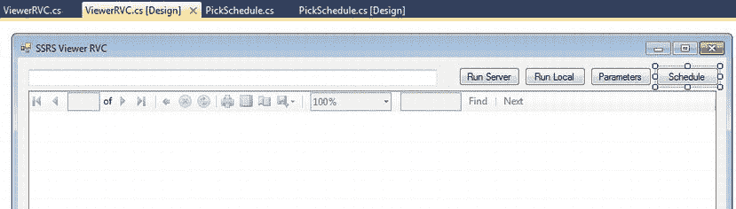

**图 10-30.** 在 `ViewerRVC.cs` 窗体中添加调度按钮

其次，在将按钮添加到窗体后，在设计模式下双击 `Schedule` 按钮，将如 **代码清单 10-9** 所示的代码添加到该按钮的点击事件中。当然，在看到 `localhost` 的 URL 处，您需要使用您的报告服务器名称。

**代码清单 10-9.** `pickSchedule` 按钮的点击事件

```csharp
private void pickSchedule_Click(object sender, EventArgs e)
{
     reportURL.Text = "http://localhost/reportserver?/Pro_SSRS/Chapter_7/EmployeeServiceCost";
     PickSchedule reportSchedule = new PickSchedule(reportURL.Text);
     reportSchedule.ShowDialog();
}
```

此时，您可以运行程序；然而，在调度报告之前，必须为共享数据源设置凭据，以便报告在不以交互方式运行时具有可用的登录凭据。如果您使用 SQL 身份验证，可以通过在解决方案中打开 `Reports` 项目并双击 `Pro_SSRS.rds` 数据源来完成此操作。在“共享数据源”对话框中，选择“凭据”选项卡，然后选择“使用特定的用户名和密码”。输入运行此报告时要使用的适当用户名和密码。如果您使用 Windows 集成身份验证（例如在您的 Windows 帐户下运行报告），则需要使用报告管理器或 SSMS 来编辑数据源并选择“连接到数据源时用作 Windows 凭据”选项。对于 Windows 帐户，请使用 `domain\user` 格式指定登录名。

现在运行程序，并选择一个您先前配置的调度。对于参数，输入 `ServiceYear 2009` 并选择“确定”以设置此报告的调度。

 **注意** 请记住使用 SSMS 或报告管理器设置您的共享调度。您必须以属于 SSRS 2012 系统管理员角色成员的用户身份登录才能添加新调度。有关详细信息，请参阅本章前面标题为“创建共享调度”的部分。


