# 报告交付

在示例中，您使用了 PDF 向订阅用户交付报告。您还硬编码了电子邮件地址，这在现实世界中并不实用。另一个值得关注的问题，尤其是在医疗保健环境中，是遵守 HIPAA 并保护患者信息。

您可以为用户提供一个文本框，让用户输入报告交付的电子邮件地址。然而，用户可能输入错误的电子邮件地址，从而将报告发送给错误的人。如果用户的电子邮件地址能够自动填充以确保地址正确，那就太好了。您可以通过从数据库表的某个字段中提取地址来实现这一点，类似于本章前面给出的数据驱动订阅示例，您从 `Employee` 表中提取了电子邮件地址。但是，在这种情况下，拉取报告的用户可能不在数据库表中，而您希望报告自动交付给安排它的用户。幸运的是，.NET Framework 和 Active Directory 提供了一种简单的方法。对于许多使用 Microsoft Exchange Server 的组织，电子邮件地址与 Active Directory 是集成的。如果您不使用 Exchange Server，电子邮件地址则不会与 Active Directory 集成，但您仍然可以手动将它们输入 Active Directory。

让我们创建一个方法来确定当前登录用户的电子邮件。然后，您可以使用它为订阅提供收件人电子邮件地址。首先，为项目添加对 `System.DirectoryServices` 的新引用。在解决方案中的 **SSRS Viewer RVC** 项目下选择 **References**，然后选择 **Add Reference**。在 **Add Reference** 对话框的 **.NET** 选项卡下，从组件名称列表中选择 `System.DirectoryServices`。接下来，添加 `using` 语句以简化您的输入，如下所示：

```
using System.DirectoryServices;
using System.Security.Principal;
```

要查找当前用户的电子邮件地址，请使用 `DirectorySearcher`，它允许您对 Active Directory 执行查询，如清单 10-10 所示。您将从目录的根级别开始，按名称查找用户。找到用户名后，返回为该用户找到的第一个电子邮件地址。

**清单 10-10.** 查询 Active Directory 获取电子邮件地址的代码

```
private string GetEmailFromAD()
{
     DirectoryEntry rootEntry;
     DirectoryEntry contextEntry;
     DirectorySearcher searcher;
     SearchResult result;
     string currentUserName;
     string contextPath;
     WindowsPrincipal wp = new WindowsPrincipal(WindowsIdentity.GetCurrent());
     currentUserName = wp.Identity.Name.Split('\\')[1];
     rootEntry = new DirectoryEntry("LDAP://RootDSE");
     contextPath = rootEntry.Properties["defaultNamingContext"].Value.ToString();
     rootEntry.Dispose();
     contextEntry = new DirectoryEntry("LDAP://" + contextPath);
     searcher = new DirectorySearcher();
     searcher.SearchRoot = contextEntry;
     searcher.Filter = String.Format("(&(objectCategory=person)(samAccountName={0}))",
currentUserName);
     searcher.PropertiesToLoad.Add("mail");
     searcher.PropertiesToLoad.Add("cn");
     searcher.SearchScope = SearchScope.Subtree;
     result = searcher.FindOne();
     return result.Properties["mail"][0].ToString();
}
```

要使用它，您只需修改之前编写的 `ScheduleReport` 方法中传递扩展的 `To` 参数，以使用您刚刚编写的新方法。因此，您之前的 `To` 参数代码变为：

```
extensionParams[0] = new ParameterValue();
extensionParams[0].Name = "TO";
extensionParams[0].Value = GetEmailFromAD();
```

现在运行 **SSRS Viewer RVC**，并从您先前配置的共享计划中选择一个计划。对于参数，输入 **ServiceYear 2009**、**ServiceMonth November**、**BranchID Grid Iron** 和 **EmployeeTblID McDonald, Sherri**；这将创建一个订阅，在您选择的计划上通过电子邮件发送给您。如果您现在使用浏览器导航到服务器，选择 **Employee Service Cost** 报告，然后选择 **Subscriptions** 选项卡，您应该会看到您的订阅，如图 10-31 所示。如果您单击 **Edit**，您会看到它提供了您选择的所有参数，并在 **To** 字段中插入了所需的电子邮件地址。

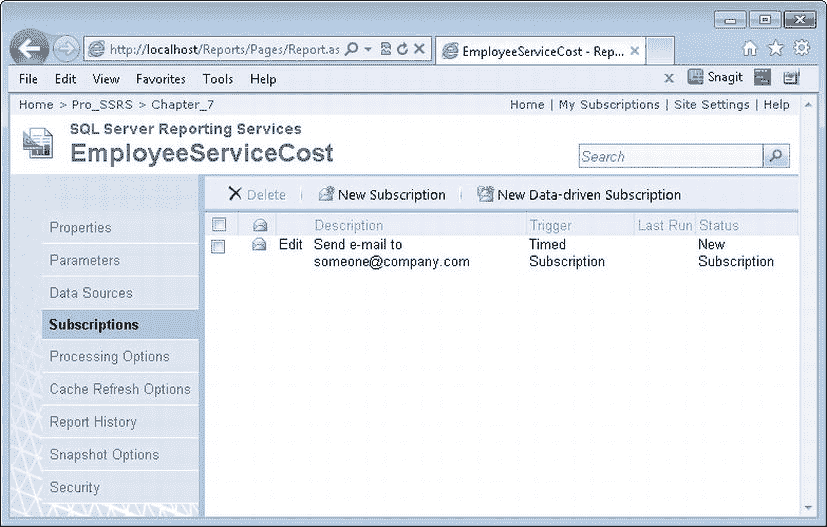

**图 10-31.** 在 SSRS 2012 中显示的订阅

您尚未看到调度 **Employee Service Cost** 等报告时可以使用的所有可能选项，但我们为您调度、交付报告以及添加其他功能提供了一个良好的开端。一些可能性包括：

*   允许用户决定报告的交付格式
*   允许用户附加报告或仅提供链接
*   允许用户动态创建计划

您可以使用 SSRS 2012 Report Server Web 服务来控制报告服务器及其控制下的报告的更多方面。我们在此仅触及了皮毛，但请注意，通过 Report Server Web 服务处理报告服务器的基本方面对于几乎所有功能都是相同的。

## 使用 WMI 控制 SSRS

在结束本章之前，我们还应该简要讨论如何使用两个 WMI 类管理 SSRS。这些类更多用于管理任务，允许您以编程方式访问服务器设置。WMI 不用于操作报告或报告设置。

WMI 提供了一种标准化的方法来监控和控制网络上任何位置运行的系统和服务。使用 WMI 提供程序，您可以编写代码来查询 SSRS 2012 服务器的当前设置，并通过提供这些服务的类的属性和方法来更改这些设置。

本质上，这些提供程序允许您以编程方式更改服务器上的配置文件的设置。因此，正如您可能猜测的那样，这些类的属性几乎直接对应于保存 SSRS 2012 配置信息的 XML 文件中的元素。

表 10-2 显示了 SSRS 2012 提供的用于与 WMI 配合使用的两个类。

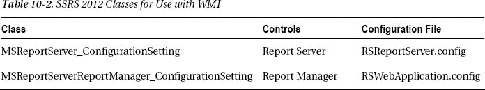

您可以使用 `MSReportServer_ConfigurationSetting` 类来确定和/或配置 SSRS 2012 本身使用的大多数数据库设置——即 SSRS 用于存储报告、快照等的数据库。这个类不控制您报告中使用的数据源连接信息，尽管您可以设置服务器在无人参与模式下运行报告时使用的登录信息。您还可以在此类中处理诸如数据库服务器名称、数据库名称和登录凭据信息等内容。您还可以使用此类配置 SSRS 2012 服务实例名称、路径名称及其在集成 HTTP 系统中映射到的虚拟目录。

您可以使用 `MSReportServerReportManager_ConfigurationSetting` 类来确定 SSRS 2012 报告管理器的实例名称、路径名称和虚拟根目录，以及读取或设置特定实例的 URL。

要通过 SSRS 2012 WMI 提供程序访问此信息，您需要使用 `System.Management` 命名空间，该命名空间提供对 WMI 的访问。

 **注意** 如果安装了多个报告服务器实例，您需要在读取和设置属性之前定位正确的实例。`PathName` 属性是关键属性，它唯一标识特定实例。


### 摘要

SSRS 2012 提供了众多用于管理任务的工具，我们在本章中已介绍了其中的几种。由于 SSRS 2012 是一个完整的报告解决方案，随着报告数量以及其他对象（如数据源、文件夹和订阅）的增长，管理员可能会发现，若没有一定程度的自动化或任务分工，单打独斗地管理整个站点会非常困难。维护这些对象，无论是通过 `Report Manager` 更新报告，还是通过自定义应用程序批量部署报告，管理员将持续发现自己需要维护 SSRS 报告服务器。虽然 `SSMS`、`Reporting Services Configuration Manager` 和 `Report Manager` 等工具极大地集中了管理任务，但未必能减少管理大型安装时可能遇到的重复性任务。幸运的是，SSRS 提供了足够的灵活性，允许其他专业人员、部门经理和用户使用 SSRS 2012 自带的工具或您自己的自定义应用程序来维护他们自己的报告。当然，这种灵活性也带来了对更严密安全性的需求。现在，我们将在下一章转向安全性主题，展示如何确保能够锁定并监控这种灵活的模型。

## 第 11 章 保护报告安全

如果说目前有什么主题比安全更令管理员们挂心，那我们很难举出例子。我们都知道，安全威胁有多种类型和严重程度——从恶意的弹出网页，到破坏系统、通过浪费时间和资源对生产力造成严重损害的入侵性蠕虫和病毒，再到心怀不满的员工，到恶毒的机器人程序，再到潜伏在我们数据周围、随时准备发动攻击的熟练系统入侵者。

这些威胁通常是匿名的脚本或可执行文件——即`自动程序`——由其人类创造者释放到网络中。但是，来自真实个体的安全违规行为呢？这些不仅是难以捉摸、旨在破坏的系统黑客；它们也可能是被忽视的、心怀不满的员工，他们带着记满密码的笔记本离开公司，并决心要证明公司关键数据的不安全性。

保护系统需要时间和精力，不幸的是，有时其优先级会低于其他重要的日常任务。然而，如果您的公司受到 HIPAA 以及萨班斯-奥克斯利法案（SOX）等其他法律所施加的规定影响，那么满足严格的安全标准就是一项必需的要求，而不仅仅是推荐做法。大多数公司都有现成的政策和程序来满足 HIPAA 和 SOX 合规性。作为一种基于角色的应用程序，SSRS 将利用您组织中已在运作的底层身份验证和网络。SSRS 安全模型有三个重要组成部分：

-   数据加密
-   身份验证和用户访问
-   报告审计

本章的目标是应对在 SSRS 部署中有效设置和测试每个安全组件的挑战。我们将通过我们使用 SSRS 满足安全标准的经验来展示如何做到这一点。

您可以通过多种方式将 SSRS 项目整合到您的业务中。您可能有一个内部网站点供内部域用户呈现报告，一个利用 Web 服务构建和显示报告的 .NET 应用程序，甚至是一个隐藏在身份验证门户后面、面向外部的 SSRS 站点。

## 加密数据

处理任何类型的机密数据时，主要关注点是只有需要查看数据且被特别授予查看权限的人才能看到数据。对于 HIPAA 定义的受保护健康信息（PHI）数据尤其如此，这一直是我们作为一家软件开发公司的重要关注点。许多其他类型的数据也需要这种级别的保护，包括财务、人力资源等。我们将从我们定义为成功、安全部署 SSRS 至关重要的三大挑战中的第一个开始；即数据加密。

### 加密简介

在当今混合技术的网络环境中，数据加密有多种类型。然而，无论采用何种技术，加密算法都必须满足复杂性和可靠性的高标准。幸运的是，许多应用程序都提供了内置的加密级别。SSRS 原生支持加密其存储在 `ReportServer` 数据库和配置文件中的敏感数据。公司可能已部署以下其他技术，可与 SSRS 加密结合使用：

-   **无线：** 使用无线加密协议（`WEP`），通过共享密钥来加密通过无线接入点传输的数据。
-   **HTTPS：** 使用服务器证书（通常来自 VeriSign 等可信权威机构），通过安全套接层（`SSL`）提供加密。当使用 `HTTPS` 而非 `HTTP` 传输数据时，会使用 `SSL`。
-   **终端服务：** 使用远程桌面协议（`RDP`）从客户端工作站远程连接到终端服务器。这在 Windows 中提供四个级别的数据加密：低、客户端兼容、高和符合 FIPS 标准。
-   **VPN：** 允许从 VPN 客户端系统访问内部网络。对点对点隧道协议（`PPTP`）和第二层隧道协议（`L2TP`）进行封装和加密。
-   **IPSec：** 是传输控制协议/网际协议（`TCP/IP`）流量的标准安全协议。这增加了多层安全性，包括数据加密。

## 使用 SSL 保护网络流量

在接下来的部分中，我们将展示如何设置 SSRS 服务器以使用 `SSL`。通过在服务器上安装 `SSL` 服务器证书，客户端应用程序（可以是浏览器或自定义应用程序）与报告服务器之间传输的所有数据都将被加密。当通过互联网传输诸如个人身份信息（PII）之类的机密数据时，这一点至关重要。拥有来自 VeriSign 或 Thawte 等可信权威机构的证书，还能确保用于访问 Web 服务器的注册域名已经过验证，并且可以信任其来自它所声称的合法公司。

在我们展示如何在 SSRS 服务器上安装证书之前，我们将先介绍通过 HTTP 请求传输到您的 SSRS 服务器的数据在数据包级别上是什么。这样，当您实际安装证书后，您将能够比较安装前后的数据包，以验证证书是否按预期工作。首先，我们将展示如何使用 Windows 上可用的一个工具：`Network Monitor`。


## 分析 HTTP 流量

`Network Monitor` 是一种数据包分析工具，可用于捕获传输至目标服务器及从目标服务器传出的所有数据包。随 `Windows` 附带的 `Network Monitor` 版本与其他网络捕获工具（例如 `Systems Management Server` 中包含的同一工具的版本）不同，因为它只能监听发往其运行所在机器的流量。不过，`Network Monitor` 默认不会随 `Windows` 一同安装。您可以在安装后通过 `添加/删除程序` 小程序来添加它。在此小程序中，选择 `添加/删除 Windows 组件`，然后选择 `管理和监视工具`。如果无法从此处安装，您随时可以从 `Microsoft` 网站下载该应用程序。在撰写本文时，我们将使用此工具的最新版本，即 `3.4` 版。

在 `SSRS` 服务器上，我们将展示如何从 `管理工具` 启动 `Network Monitor`。如果您的机器上安装了多个网络接口卡（`NIC`），就像我们的情况一样，请确保选择您将用于测试的那块网卡。图 11-1 展示了 `Network Monitor` 的主屏幕及其在网络上捕获的流量，包括广播和本地数据包。`Network Monitor` 对新手来说可能令人生畏，因为它是为那些对网络协议有超过粗浅了解的网络管理员设计的。

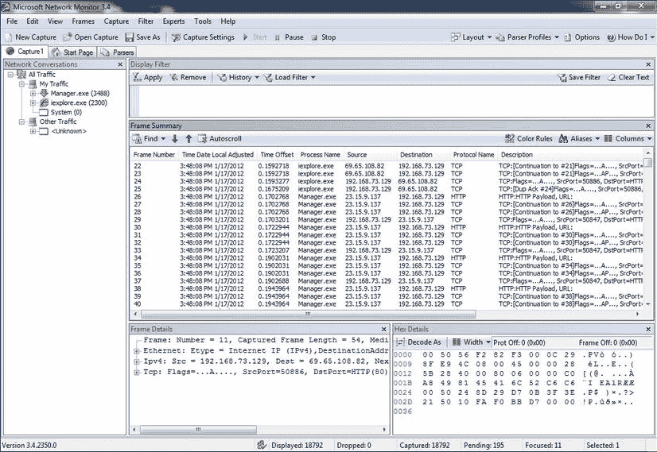

图 11-1.`Network Monitor`

您可以在显示中过滤掉任何不需要的流量，我们将在本节介绍这一点，因为我们将展示如何捕获 `SSRS` Web 数据。为简单起见，在我们的示例中，我们只想查看 `端口 80` 上的 `HTTP` 流量。我们将在访问报表的客户端机器上直接运行此操作。可能会有，也确实会有很多其他流量是我们不希望在监视器中看到的，因此我们将利用过滤功能来剔除不需要的数据。例如，您可以定义一个捕获过滤器，它使用数据包中的模式匹配来限制捕获结果。或者，您可以捕获所有内容，然后配置一个显示过滤器来限制结果。在我们的案例中，我们将设置一个显示过滤器，以排除任何非 `HTTP` 流量的内容。在新版本的网络监视器中设置过滤器比过去容易得多。我们将继续设置一个显示过滤器，以便只看到正在流动的 `HTTP` 流量。为此，开始一个新的捕获，并在捕获窗口中找到显示过滤器窗口。如果看不到它，请单击 `查看->显示过滤器` 以将其调出。它应该类似于图 11-2。

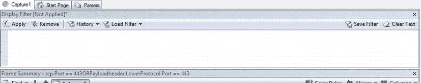

图 11-2.`查找显示过滤器窗口`

在显示过滤器窗口内，我们需要让 `Network Monitor` 知道只显示与 `HTTP` 数据相关的数据。最快的方法是过滤掉任何源端口或目标端口不是 `80`（标准的 `HTTP` 端口）的内容。在显示过滤器中，您将设置一个新规则来做到这一点，如图 11-3 所示。单击应用按钮以确认更改。

现在，单击 `开始捕获` 按钮，并在 `报表管理器` 中查看页面时让捕获运行。我们将查看返回的数据，以便能够看到 `HTML` 中的纯文本信息。在此示例中，我们将查看 `报表管理器` 的首页，看看是否能在返回的数据中找到它。

加载报表管理器后，分析捕获到的帧揭示了一个令人不安的消息。您可以看到 `HTML` 以纯文本形式返回，如果我们不希望任何人嗅探我们的网络以查看可以从我们的任何报表中收集到什么信息，这对我们来说是不利的。这种裸露的 `HTML` 可以在图 11-4 中看到。页面的标题和其他 `HTML` 代码清晰可读，如果报表被执行，这些信息可能被用来重建整个网页或报表。

在这种情况下，您尚未分析其他类型的流量，例如 `端口 1433` 上的 `SQL` 请求，以查看其他协议是否也可能发送纯文本信息，但您可以使用相同的工具来进行此操作。

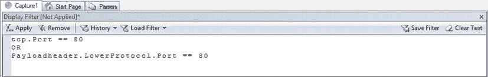

图 11-3.`显示过滤器规则`

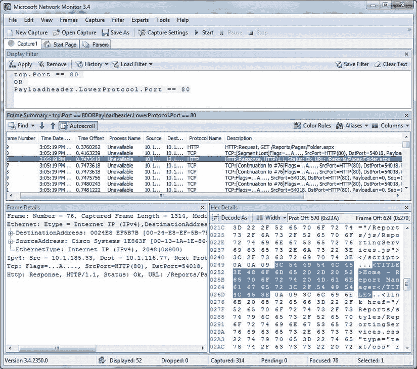

图 11-4.`捕获到的 PI 数据`

 **提示** 尽管我们不会介绍配置 `SQL Server` 本身以加密网络流量的步骤（因为我们将通过内部的 `SSRS` `HTTP` 服务来完成），但必须提到 `SQL Server` 同样使用 `SSL`，并且通过安装证书，您可以轻松配置 `SQL Server` 来传输加密数据。加密会带来最小的性能损失。此信息可以在 `APRESS` 出版的《Pro SQL Server Encryption》一书中找到。


## 应用 SSL 证书

现在是时候将证书应用到 SSRS 服务器，并重新扫描流量，以确保所有可查看的明文数据都将被加密。

多家公司提供可安装在 Web 服务器上的服务器证书，并且这些证书可以直接通过互联网从颁发证书的可信站点进行验证。通过使用这些可信来源（如 VeriSign）颁发的证书，客户端将自动信任该站点。其他证书，例如通过 Windows 中的证书服务生成的证书，可能需要将证书安装在客户端计算机上，因为如果客户端无法联系到证书颁发机构，它将不会自动信任该证书。通常，对于互联网用途，支付费用使用商业证书更为实际。在线部署使用的是由商业证书颁发机构颁发的服务器证书。然而，对于临时测试环境，你可以使用`SelfSSL`，这是一个随 IIS 支持工具一起提供的便捷小工具，尽管我们并不打算使用 IIS。你可以从以下位置下载`SelfSSL`：

`www.microsoft.com/downloads/details.aspx?FamilyID=56fc92ee-a71a-4c73-b628-ade629c89499&displaylang=en`

`SelfSSL`将生成一个临时证书并自动将其应用到网站。你在想要添加证书的服务器上从命令行运行`SelfSSL`。安装完成后，你可以通过点击“开始”>“所有程序”>“IIS 资源”>“SelfSSL”来打开`SelfSSL`的命令提示符。典型语法格式如下：

```
Selfssl.exe /N:CN=MACHINENAMEHERE /V:20 /T
```

`/N:CN=MACHINENAMEHERE /T`选项表示证书上的通用名称将是服务器的名称（你需要在命令中替换为你的服务器名称）。`/V:20`部分表示证书的有效期为 20 天。`/T`选项指示`SelfSSL`将证书添加到受信任证书列表中，以便本地浏览器在连接到该站点时自动使用该证书。你可以在其他将访问此服务器的客户端计算机上手动安装该证书的本地副本。因为`SelfSSL`会安装它所生成的证书，所以你无需经历生成证书请求的过程（该过程通常是发送给证书颁发机构的）。

`注意`当你在测试服务器上创建临时证书时，它会询问你是否要更改系统上某个网站的设置。没有必要这样做，因为我们将在配置管理器中手动绑定证书。如果你这样做了，打开元数据库时可能会收到错误，但你可以忽略它。

在我们创建并安装新的 SSL 证书之后，我们需要配置`SSRS`以使用此证书来加密通过报表管理器发送的 HTTP 流量。通过点击“开始”>“所有程序”>“Microsoft SQL Server 2012”>“配置工具”>“Reporting Services 配置管理器”来打开 Reporting Services 配置管理器。打开后，连接到你的`SSRS 2012`实例，然后点击左侧导航栏中的“报表管理器 URL”链接。

从这里，点击“高级”按钮以打开“高级多重 Web 站点配置”屏幕。你会注意到此配置窗口中有两个部分。顶部部分用于配置 HTTP 标识，底部部分用于 HTTPS/SSL 配置。点击 SSL 部分中的“添加”按钮，在“证书”下拉菜单中选择你刚刚创建的证书。你还可以配置不同的端口或指定要使用的 IP 地址，但我们将两者都使用默认值。`图 11-5`向你展示了配置屏幕应有的样子。

在两个打开的对话框上点击“确定”后，`SSRS`服务器会配置并绑定新的 URL/端口组合，然后该 URL 即可使用。你现在将在 Reporting Services 配置管理器的标识部分看到两个可供使用的 URL。

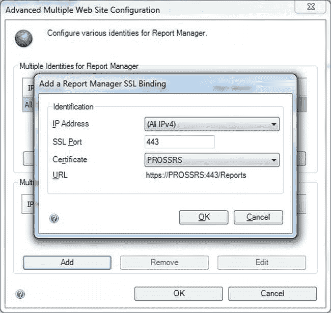

`图 11-5.` 配置 HTTPS URL


## 抓取 HTTPS 流量

既然您已经安装了证书，让我们回到网络监视器，再次捕获运行报告。这次在示例中，使用 https 协议访问 PROSSRS 上的报表服务器 URL，这指示浏览器通过 SSL 连接到 443 端口，而不是通过 HTTP 连接到 80 端口。

当您直接导航到安全的报表管理器时，可能首先遇到的一个警告是证书未能通过所有受信任标准，因为它并非来自已知的证书颁发机构（参见图 11-6）。

您可以选择“继续浏览此网站”，因为您确实信任该站点。您也可以通过点击浏览器底部的锁形图标并选择“安装证书”，将证书安装到本地计算机上，这样就不会再次收到此提示消息。在本地客户端的证书存储中安装证书会使浏览器自动信任该站点。对于像 VeriSign 这样的已知证书颁发机构，这些步骤不是必需的，但对于这种自签名证书是必需的。

至此，您可以通过 HTTP 或 HTTPS 访问报表管理器，因为我们尚未在 Reporting Services 配置管理器中移除通过端口 80 访问的能力。您可以通过几种方式控制所需的安全级别。

控制 SSRS 所使用安全级别的一种方法是通过位于安装文件夹（通常是 `盘符:\Program Files\Microsoft SQL Server\MSRS11.MSSQLSERVER\Reporting Services\ReportServer`）中的服务配置文件 `rsreportserver.config`。在记事本中打开该文件，并查找以下条目：

```xml
<Add Key="SecureConnectionLevel" Value="0"/>
```

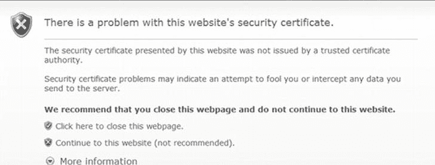

**图 11-6.** 非受信任安全证书的警告

四个值（0 到 3）控制安全级别。在安装期间未配置 SSRS 使用 SSL 的部署中，默认值为 0，这是最不安全的。值为 3 是最安全的，要求每个 SOAP API 调用都使用 SSL。对于本例，将值设置为 2，这将要求加密所有报表数据。现在，所有对服务器的调用都将自动使用端口 443 并加密数据，包括 URL 字符串本身，这在 URL 中传递任何可能敏感信息时非常重要。如果用户尝试使用 HTTP 连接到报表管理器或报表服务器 URL，报表服务器将自动将客户端重定向到 HTTPS，以要求安全连接。您还应在重启服务以使此更改生效之前，在 SSRS 配置工具中为报表服务 URL 部分添加 SSL 证书。它也需要一个有效的证书来使用加密通信。

您也可以通过 Reporting Services 配置管理器移除 HTTP 访问。在我们用于添加新的 SSL 安全地址的同一部分，您也可以移除 HTTP 地址绑定。这将要求任何尝试访问该站点的用户必须使用 HTTPS 地址，并且所有 Web 数据都将被加密。

我们还需要对我们之前设置的显示筛选器进行微小更改。在之前的示例中我们寻找的是端口 80 的流量，但现在需要改为搜索端口 443。更改您的显示筛选器，将每个端口 80 的实例改为搜索端口 443，然后单击应用按钮确认更改。

当您使用新的安全地址在网络监视器中捕获帧时，可以看到之前所有在端口 80 上的 HTTP 数据现在都在端口 443 上使用 SSL，如图 11-7 所示。数据已被加密，并且我们还可以看到 SSL 协议正在处理握手设置，因此我们的所有 HTTP 数据都是安全可靠的。

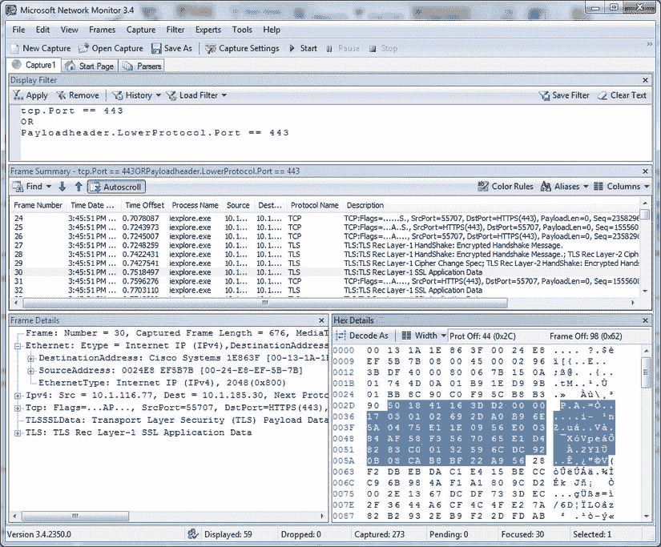

**图 11-7.** 显示加密数据包的网络监视器

## 保护 SSRS 中的数据存储

虽然确保网络流量加密很重要，但这只是维护安全环境的一个方面。SSRS 要求敏感数据（例如用于数据访问的账户信息）必须安全存储。由于这些数据存储在不同的位置（例如数据库表和配置文件）中，SSRS 使用对称密钥加密过程来安全存储和访问这些信息。这意味着数据库和配置文件中的身份验证信息以加密格式存储，SSRS 使用其生成的加密密钥在需要时解密信息。

与 SQL Server 中的许多 SSRS 任务一样，有多种工具可用于对报表服务器进行配置更改。您可以使用 Reporting Services 配置管理器或一个名为 `RSKeyMgmt` 的命令行实用工具来管理密钥。您可以使用这两种工具中的任意一种来备份与报表服务器实例关联的密钥，以便如果发生导致服务器必须重建的情况，您可以重新应用密钥到安装中。加密密钥在 SSRS 安装或加入场时生成。图 11-8 展示了 `RSReportServer.config` 文件的一部分，其中包含连接到 SSRS 服务器组件所需的身份验证凭据。请注意，文件内的部分数据是加密的。SSRS 使用与报表服务器实例关联的密钥来解密此文件的内容以及存储在 ReportServer 数据库的 `dbo.Keys` 表中的加密内容。

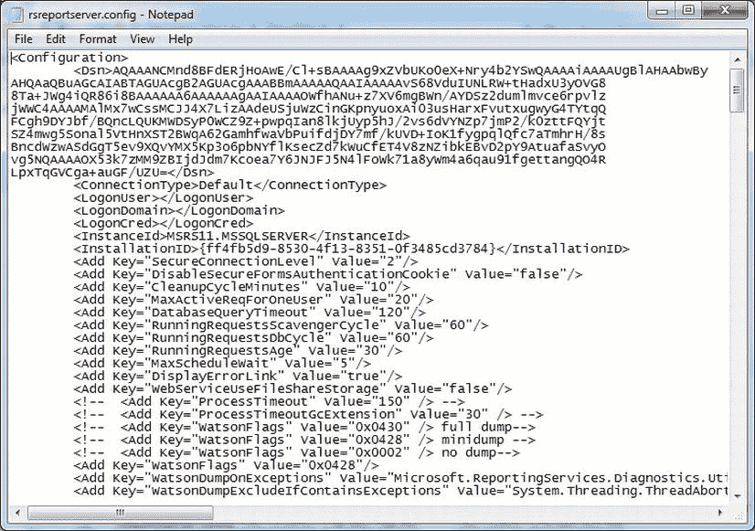

**图 11-8.** `rsreportserver.config` 的加密值

我们将展示如何使用 Reporting Services 配置管理器和 `RSKeyMgmt` 实用工具这两种工具来提取 PROSSRS SSRS 安装的密钥。

首先，再次打开 Reporting Services 配置管理器并连接到您的报表服务器实例（默认为 MSSQLSERVER），然后单击左侧的“加密密钥”图标。您将在“加密密钥”页面上看到四个选项：备份、还原、更改和删除加密内容。您可以将加密密钥备份到密钥文件并提供密码，如图 11-9 所示。此文件应存储在安全的位置。如果报表服务器因任何原因（例如硬件故障或数据损坏问题）必须重建，那么拥有此密钥对于将 ReportServer 数据库恢复到先前状态至关重要。没有密钥文件，仍然可以从备份中恢复和初始化 ReportServer 数据库。但是，所有需要加密的对象（例如存储了账户信息的数据源）都必须手动重置，这充其量是一项艰巨的任务。

要使用命令行工具（它本质上执行备份、还原和删除报表服务器实例加密密钥的相同任务），语法如下：

```bash
RSKeyMgmt -e -f C:\Pro_SSRS\SSRS_Key\PROSSRS_SSRS_Key -P Password
```

`-e` 选项告诉 `RSKeyMgmt` 将密钥提取到文件 `PROSSRS_SSRS_Key`（位于 `C:\Pro_SSRS\SSRS_Key` 文件夹中）。密码选项是必需的，并且密码必须满足最低复杂性要求。如果需要，您可以使用相同的命令重新将密钥应用到服务器，但将 `-e` 选项更改为 `-a`。执行命令后，系统会谨慎地提示您：**将文件保存在安全位置！**

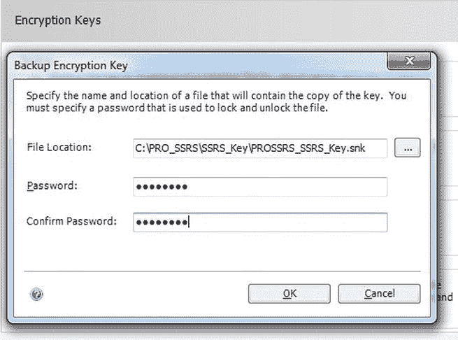

**图 11-9.** Reporting Services 配置管理器中的加密密钥


