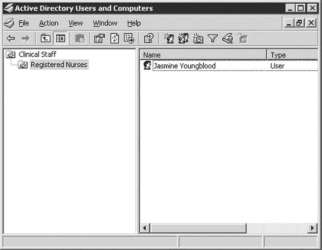

# 报表服务安全配置

在需要将报表服务实例移动到网络中另一台机器的情况下，该密钥也将派上用场。您可以简单地在新机器上安装 SSRS，从旧实例恢复数据库，恢复您一直存储的密钥，并移除原始的加密密钥。这使得简单的独立 SSRS 迁移变得相当容易且轻松。

## 设置身份验证和用户数据访问权限

对机密电子数据的访问，无论其存放在哪里，都始于并终于用户身份验证。正确配置安全用户或角色对于安全部署 SSRS 至关重要。在利用 Windows 服务器域的环境中，SSRS 可以利用活动目录安全组和用户提供的身份验证。SSRS 管理员负责配置特定于 SSRS 的安全角色，这些角色链接到活动目录安全账户。在以下部分中，我们将展示如何为一名将仅能有限访问 SSRS 报表服务器的员工设置一个测试 Windows 账户。我们将讨论以下内容：

- **设置 SSRS 角色：** SSRS 角色规定了用户在访问 SSRS 服务器时将拥有的权限。一个活动目录安全账户（可以是一个组或一个用户）被分配到五个预定义的 SSRS 角色之一，或者分配到一个由 SSRS 管理员可能创建的新角色。
- **分配 SSRS 角色：** 分配是指特定 SSRS 角色中的用户可以执行的实际 SSRS 任务。
- **配置和测试 SSRS 对象的权限：** 每个报表文件夹及其对象都维护着独立的权限，这些权限可以在文件夹级别设置并传播到所有子对象，也可以针对每个对象专门设置。我们将展示如何为测试用户账户设置两个文件夹，并添加要加以保护的报表对象。
- **筛选报表：** 可以根据访问报表服务器的活动目录登录账户，限制报表中显示哪些数据。您可以通过将 SSRS 全局集合 `User!UserID` 返回的值与报表数据集中的字段值相关联来实现这一点；`User!UserID` 返回当前登录账户。
- **验证数据源：** 除了 Windows 登录账户和 SSRS 角色分配外，数据源还维护着它们自己的身份验证属性，我们将对此进行讨论。
- **在数据源数据库对象上设置权限：** 您可能还记得前面的章节中，您创建了一个存储过程 `Emp_Svc_Cost` 用于员工服务成本报表，但并未分配特定于用户的权限。我们将在本章中展示如何分配这些权限设置。

### 介绍 SSRS 角色

默认情况下，已安装的 SSRS Web 服务使用 Windows 集成身份验证来访问报表和报表内容。存储在活动目录中的 Windows 用户或组安全账户必须与一个 SSRS 角色关联，才能访问 SSRS 服务器。管理员可以使用报表管理器将 Windows 账户分配到 SSRS 角色。在我们的医疗保健应用程序的测试场景中，我们设置了一个名为 `jyoungblood` 的测试 Windows 账户；您可以假设 `jyoungblood` 是一家医疗保健机构中负责家访患者的注册护士。

所有临床人员，包括像 `jyoungblood` 这样的护士，都与域内活动目录中的安全组相关联。因此，您将使 `jyoungblood` 成为 `RN` 安全组的成员。除了安全组 `RN` 外，所有注册护士，包括 `jyoungblood`，都将包含在活动目录内的一个组织单元（OU）中，如图 11-10 的活动目录用户和计算机窗口所示。尽管在 SSRS 中将用户或组分配给角色时不会使用 OU，但值得注意的是，您也可以使用 OU 来配置同样适用于安全的组策略设置，例如锁定用户的桌面或 Internet Explorer。



**图 11-10.** 活动目录中的测试 Windows 账户

在将测试 Windows 用户分配到 SSRS 角色并测试权限设置之前，首先看一下这五个预定义的角色：

- **浏览器：** 分配到浏览器角色的用户只能查看报表、文件夹和资源。他们也可以管理自己的订阅。
- **内容管理器：** 管理员默认分配到内容管理器角色。分配到此角色的用户可以执行适用于 SSRS 对象（如他们管理的文件夹、报表和数据源）的所有任务。
- **我的报表：** 当 SSRS 服务器上启用了“我的报表”功能时（本节稍后讨论），这是自动分配给用户的默认角色。
- **发布者：** 默认情况下，分配到此角色的用户拥有足够的权限将报表和数据源发布到报表服务器。通常，此角色用于使用报表生成器或 Visual Studio 创建和部署报表的报表作者。
- **报表生成器：** 报表生成器角色主要用于为将使用从报表管理器启动的报表生成器应用程序的用户分配所需的权限，这将在第 09 章中介绍。

SSRS 角色由分配到每个角色的用户可以执行的任务来定义。SSRS 任务提供内容管理权限，并定义用户可以查看哪些 SSRS 对象。用户可以执行以下任务：

- 使用报表
- 创建链接报表
- 管理所有订阅
- 管理数据源
- 管理文件夹
- 管理个人订阅
- 管理模型
- 管理报表历史记录
- 管理报表
- 管理资源
- 为单个项目设置安全性
- 查看数据源
- 查看文件夹
- 查看模型
- 查看报表
- 查看资源

每个预定义角色默认配置了一组特定的可允许任务组合。例如，分配到发布者角色的用户可以管理文件夹、报表、资源、模型和数据源，以及创建链接报表。

```
if (condVar > someVal) {console.log("xxx")}
```


