# 安全管理

SSRS 2012 不允许管理员通过基于 Web 的 `报表管理器` 来编辑角色可用的任务或添加新角色。这项工作被归于 `SSMS 2012` 界面。打开 `SSMS`，通过点击 `连接` 按钮并选择 `Reporting Services` 来连接到 `Reporting Services` 实例。该对话框看起来与常规连接屏幕类似，但服务器类型将是 `Reporting Services`。输入 `SSRS` 服务器的名称并点击 `连接` 以查看可用选项。图 11-11 显示了连接屏幕。

连接后，你将发现该实例下列出了三个部分。我们这里关注的是第二个部分，`安全性`。展开 `安全性` 节点会显示两个子节点：`角色` 和 `系统角色`。`角色` 部分用于管理报表级别的用户访问。此部分处理需要查看、浏览和创建报表的常规用户。第二部分，`系统角色`，用于管理系统整体任务的权限。我们这里将重点关注 `角色` 部分。

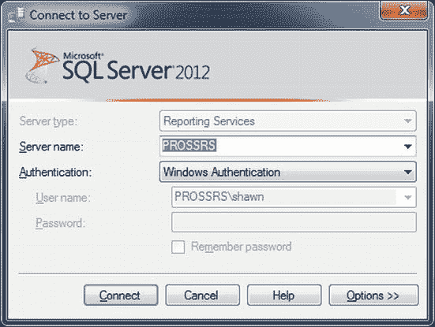
`图 11-11.` 通过 `SSMS` 连接到 `SSRS`

展开 `角色` 节点可以看到我们之前讨论过的五个默认角色。要查看角色的属性，请右键点击浏览器并选择 `属性`。你将看到该角色的描述，以及该角色可以执行的每项任务。图 11-12 向你展示了其外观。从这个窗口，你可以编辑描述或编辑该角色可以执行哪些任务。你现在不想更改 `报表生成器` 角色的任务，所以可以四处查看以感受安全更改有哪些选项，但请点击 `取消` 来丢弃你可能已做的任何更改。

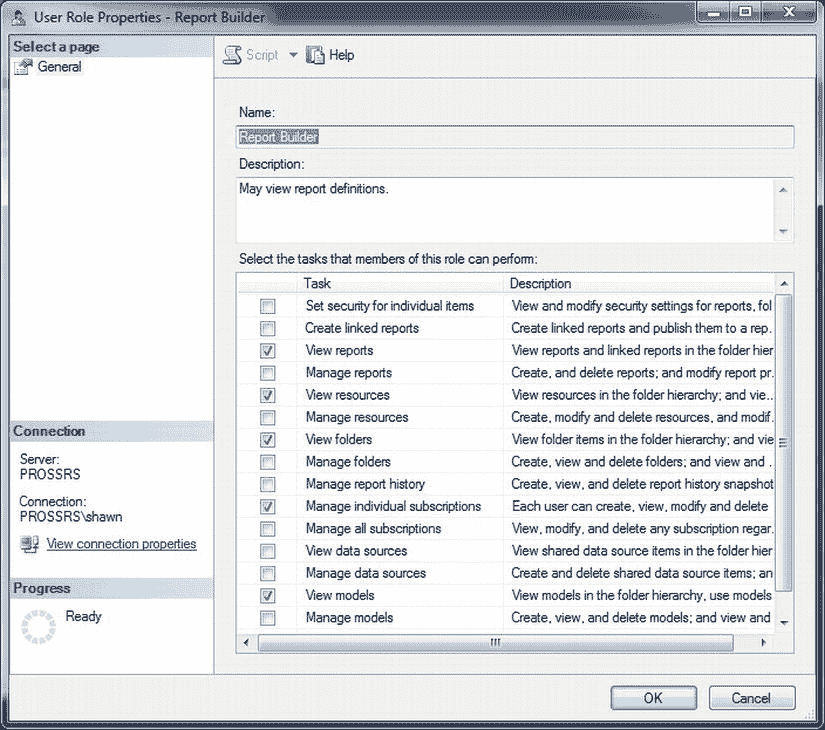
`图 11-12.` 查看 `报表生成器` 角色的任务权限

在 `SSRS` 中，你还可以添加新角色或编辑服务器的任何现有角色。如果你需要为需要略微高于标准 `SSRS` 角色权限的用户创建一个新的自定义角色，这很重要。该界面与角色编辑窗口相同，可以通过右键点击 `角色` 节点并选择 `新建角色` 来访问。

## 测试 SSRS 角色分配

在本节中，我们将完成添加文件夹和报表对象的过程，这些操作将与护士 `jyoungblood` 将会使用的操作保持一致。你需要确保她无法导航到其他文件夹并运行可能包含机密信息的其他报表。

测试 `jyoungblood` 访问为其安全组 `RN` 定义的报表的第一步，是将报表发布到 `SSRS` 服务器上的一个文件夹中，该文件夹将包含注册护士的报表。作为测试的管理员，打开 `报表管理器`，并创建两个新文件夹：一个在根文件夹中名为 `临床报表`，然后在 `临床报表` 文件夹内创建一个名为 `注册护士` 的文件夹。为此，只需在 `报表管理器` 中点击 `新建文件夹`。由于这两个文件夹默认都从父文件夹继承权限，而父文件夹当前配置为仅管理员访问，因此你需要手动更改权限，以便新文件夹（以及你将添加到其中的报表和数据源）保持其自己的安全设置。

要将报表发布到 `注册护士` 文件夹，你可以使用前面部署章节中涵盖的任何方法，但为了本次测试，只需上传一个你已经使用过的报表：`每日日程表`。然后创建一个名为 `RN_DS` 的数据源用于测试安全目的。从 `Pro_SSRS` 项目中的 `报表管理器` 上传报表文件 `每日日程表.rdl`。在 `报表管理器` 的 `注册护士` 文件夹中，只需点击 `上传文件`，浏览到 `每日活动.rdl`，然后点击 `确定`。要使用 `报表管理器` 手动创建数据源，只需在 `注册护士` 文件夹中点击 `新建数据源`，将数据源命名为 `RN_DS`，并将连接字符串设置为以下内容（如有必要，将 `localhost` 替换为你创建了 `Pro_SSRS` 数据库的 `SQL Server` 服务器名称）：

```
Data Source=localhost;Initial Catalog=Pro_SSRS
```

在这种情况下，你将选择将数据源身份验证方法设置为 `安全存储在报表服务器中的凭据`，并提供一个用户名和密码，用于访问 `Pro_SSRS` 数据库中的数据。假设 `jyoungblood` 的 `Windows` 账户已被授予访问数据源数据库的权限，你本可以选择 `Windows 集成安全性` 选项，将 `Windows` 账户传递到 `SQL Server` 数据库。你知道你将配置报表以筛选出仅与临床医生 `jyoungblood` 相关的数据，因此无需过于担心存储的凭据。如果你还没有一个对 `Pro_SSRS` 数据库具有权限的 `SQL Server` 登录名，请继续创建一个名为 `myreportuser` 的登录名，并授予其对数据库的 `db_datareader` 权限。你可以在 图 11-13 中看到设置此新数据源的完成屏幕。

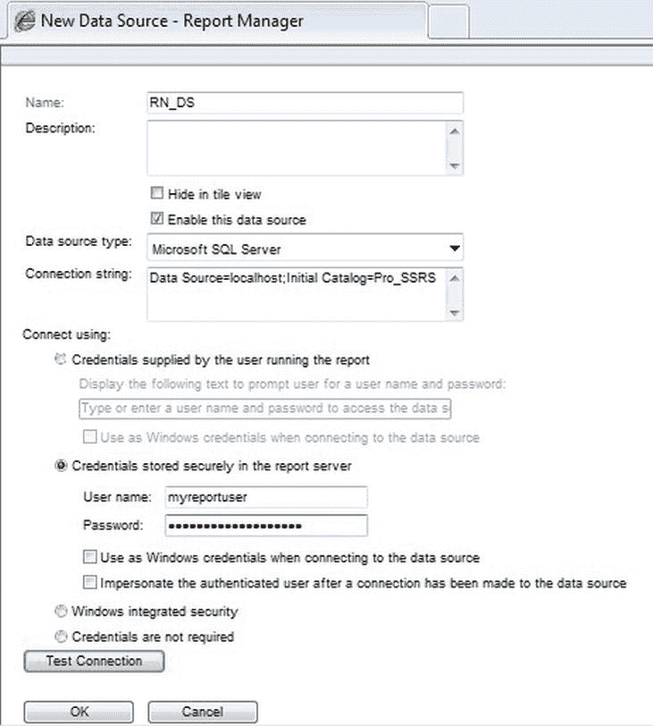
`图 11-13.` 设置 `RN_DS` 数据源

图 11-14 显示了你将执行的初始测试的文件夹结构和报表对象设置。此时，你尚未向 `Windows` 账户 `jyoungblood` 或其所属的安全组 `RN` 授予 `SSRS` 角色分配。`每日活动` 报表向临床医生提供其每日活动列表。在数据驱动订阅中，报表可以在处理后邮寄给临床医生，员工的 ID 参数用于为每个个体创建具有唯一数据的报表。然而，在现在的测试中，你希望允许从 `报表管理器` 手动运行访问相同的报表。这带来了一系列自身的问题，我们将在你逐步完成此过程时进行介绍。

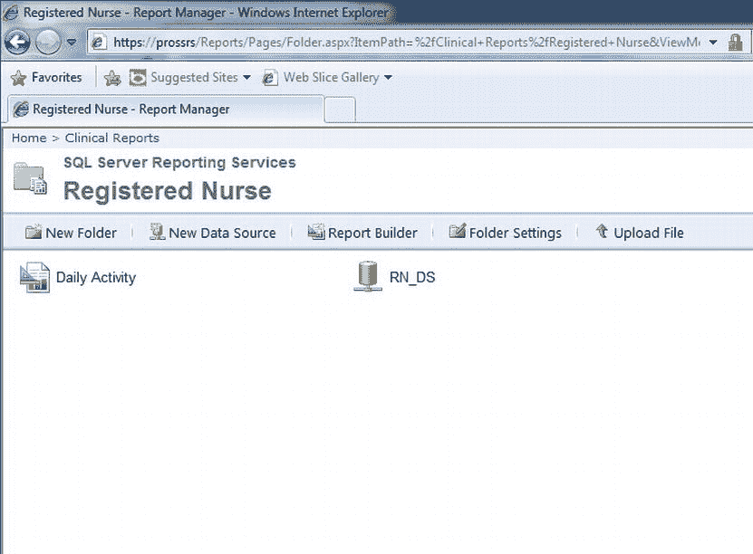
`图 11-14.` 注册护士测试的报表对象


要开始测试，请打开浏览器并以用户 `jyoungblood` 登录。浏览器打开后，将你之前创建的 `Registered Nurse` 文件夹的链接粘贴到地址栏中，如下所示：

`http://YourServerName/Reports/Pages/Folder.aspx?ItemPath=%2fClinical+Reports%2fRegistered+Nurse&ViewMode=Detail`

你必须将链接粘贴到浏览器中，因为 `jyoungblood` 当前的权限不允许通过 Report Manager 直接导航到该报表。正如你在图 11-15 中所看到的，当你查看此链接时，会收到一条错误消息，指出用户没有权限查看文件夹中的资源。

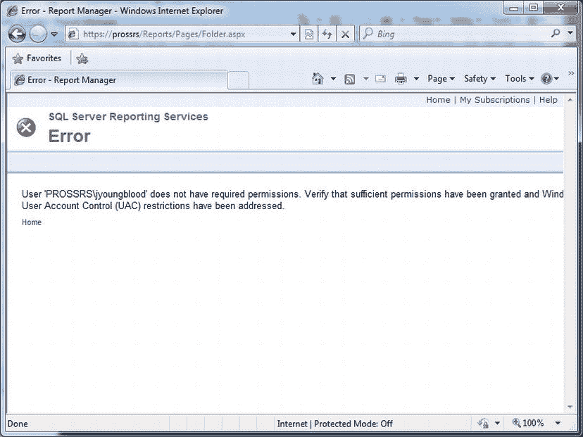

**图 11-15.** `权限不足的错误消息`

现在，再次以管理员身份运行 Report Manager，你将为 `jyoungblood` 设置权限。你可以在每个文件夹的 `属性` 选项卡上以及单个报表项上控制安全设置。在本例中，你将为 `Registered Nurse` 文件夹在文件夹级别设置权限。使用 `SSRS 管理员` 帐户运行的浏览器导航到 `Registered Nurse` 文件夹，单击文件夹菜单栏中的 `文件夹设置` 按钮，然后选择左侧的 `安全` 选项。正如你在图 11-16 中看到的，默认的安全组是 `BUILTIN\administrators`，它被分配给了 `内容管理员` 角色。

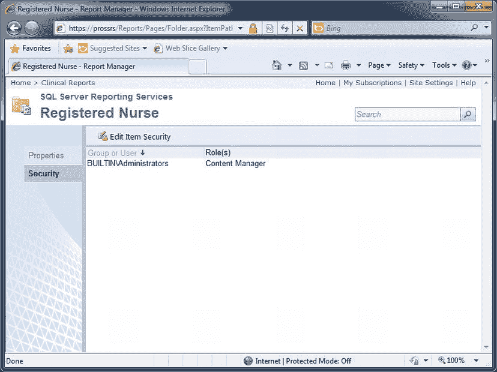

**图 11-16.** `Registered Nurse 文件夹的默认权限`

要为 `RN` 组设置权限，请单击 `编辑项安全` 以中断从父文件夹继承的安全设置。在警告屏幕上（提示你正在中断安全继承）直接点击 `确定`。现在，你可以单击 `新建角色分配`，并在 `新建角色分配` 表单上将 `RN` 安全组添加为组名。对于角色分配，选择 `浏览器`，这将允许分配给 `RN` 组的用户查看 `Registered Nurse` 文件夹及其所有子节点、查看报表和资源，以及配置他们自己的订阅。你可以在图 11-17 的安全列表中看到这一点。

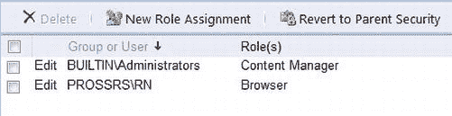

**图 11-17.** `Register Nurse 文件夹的新安全列表`

现在，当你以 `jyoungblood` 身份登录并访问 `Registered Nurse` 文件夹时，你只能看到已部署到该文件夹的报表，而看不到数据源。此外，所有你可以查看的对象的属性都具有受限的可访问性和内容。例如，如果你点击该报表项的菜单并选择 `管理`，你将只能看到常规属性信息，例如 `Daily Schedule` 报表的 `创建日期` 和 `修改日期`。相比之下，管理员查看相同的属性页时，将能够查看和修改其他报表属性设置，例如 `参数`、`数据源`、`执行`、`历史记录` 和 `安全`，如图 11-18 所示。

你应该熟悉两个 `SSRS` 角色。我们刚才提到了一个，即 `系统管理员`，另一个可用的 `SSRS` 角色是 `系统用户`。这些是站点范围的角色，允许用户在 `SSRS` 安装中执行特定任务。它们与我们之前讨论的文件夹/项级别安全并无不同，因为这些角色授予的是整个 `SSRS` 系统的权限。你可以在 Report Manager 的 `站点设置` 部分为用户分配这些角色。以下是分配每个角色后允许用户/组执行的操作列表：

*   `系统用户`
    *   查看系统属性
    *   查看共享计划
    *   允许使用 `Report Builder` 或其他执行 `RDL` 的客户端
*   `系统管理员`
    *   查看/修改系统角色分配
    *   查看/修改系统角色定义
    *   查看/修改系统属性
    *   查看/修改共享计划
    *   拥有 `系统用户` 角色的所有其他访问权限

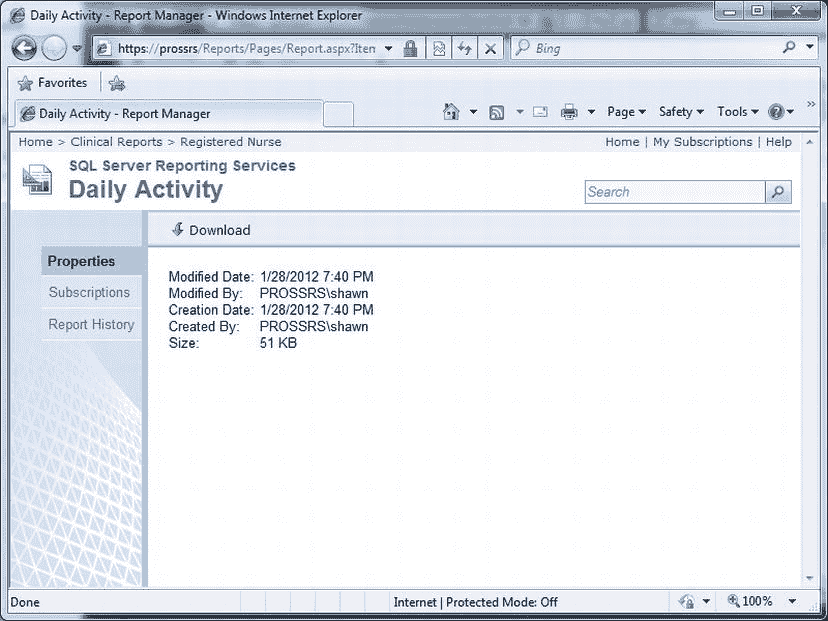

**图 11-18.** `管理员可用的报表属性`

要完成测试，你只需以 `jyoungblood` 身份执行 `Daily Schedule` 报表即可。你已经授予了 `RN` `Windows` 安全组继承 `SSRS 浏览器` 角色的权限，因此执行报表应该没有问题。报表执行成功。然而，图 11-19 显示了一个明显的问题——尽管 `jyoungblood` 执行了该报表，但她看到的是其他员工的预约访问。虽然她可以输入一个 `员工 ID` 参数值来将报表数据限制为仅她自己的数据，但如果她知道其他员工的 `ID`，她仍然可以通过输入他们的 `ID` 来查看他们的日程安排。尽管对于许多公司来说，这可能是可以接受的做法，但在下一节中，我们将展示如何更进一步，确保她只能查看自己的日程安排。

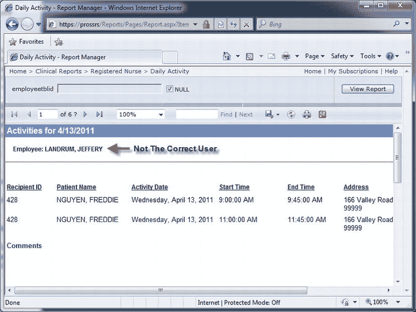

**图 11-19.** `测试账户查看其他员工的数据`

`提示` 在构建测试环境时，有许多可用资源可以简化流程。虚拟化在当今几乎每个环境中都很常见。`Microsoft's Hyper-V` 或其他桌面虚拟化工具是测试的有利工具，因为它们允许你在单台机器上同时运行多个操作系统。


## 使用 User!UserID 过滤报告内容

对于每日计划报告，假设你决定让用户只能查看自己的日程安排。SSRS 允许你通过创建一个报告过滤器来实现这一点，该过滤器使用执行报告的用户的登录账户值。登录名值是从 SSRS 中的一个全局集合返回的。你一直在使用全局集合——例如，当你使用表达式`=Fields!FieldName.Value`时，你实际上是从 `Fields` 全局集合中返回一个值。你将用于报告过滤器的全局集合是 `User`，而你感兴趣的值是 `UserID`。因此，表达式将是`=User!UserID`。

要在过滤器中使用 `User!UserID`，你需要在数据集中有一个等于 `UserID` 值的字段。在每日计划报告的数据集中，你可能还记得有一个名为 `HWUserLogin` 的字段，你可以用于此目的。当过滤器进行比较时，这两个值将是相同的——一个值随数据集提供，另一个在报告执行时提供。应用过滤器后，报告将仅显示那些执行报告的员工的用户名与数据集每条记录返回的 `HWUserLogin` 字段值相匹配的记录。

与参数不同，过滤器不能通过报告管理器设置。要设置过滤器，你需要修改报告本身，可以直接在 RDL 文件中，或通过报表生成器或 Visual Studio 进行，如 图 11-20 所示。请注意，你可以使用 `RTRIM` 函数来去除尾随空格；否则，比较可能会失败。确保员工登录名与你创建的用户匹配，这样比较才能匹配。在本书示例中，这是 `PROSSRS\Jyoungblood`，但你的示例可能不同。将过滤器添加到组属性中，以过滤掉除查看用户之外的任何其他用户。

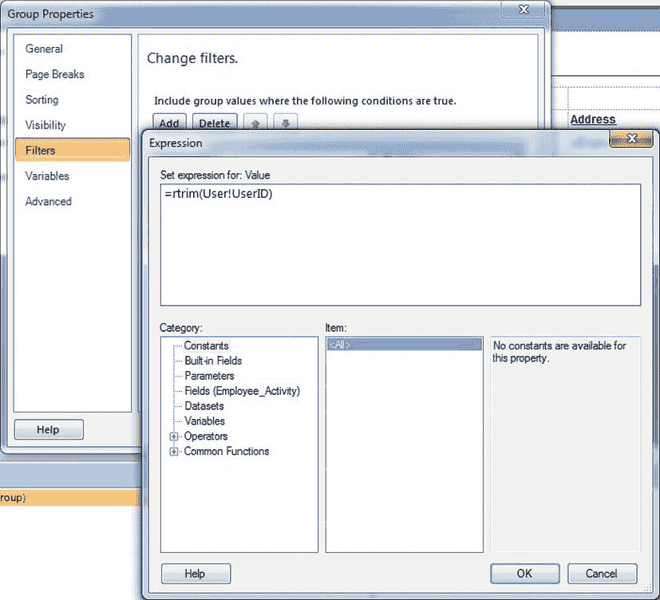

**图 11-20.** 每日计划报告的 `UserID` 过滤器

由于此报告可能返回数百条记录，即使它会为每个用户自动过滤，也最好将报告缓存十分钟。缓存有助于减轻每次新用户访问报告时重新查询数据源所带来的性能影响。当用户 `jyoungblood` 再次执行报告时，你可以看到日程安排现在只反映她的日程，如 图 11-21 所示。

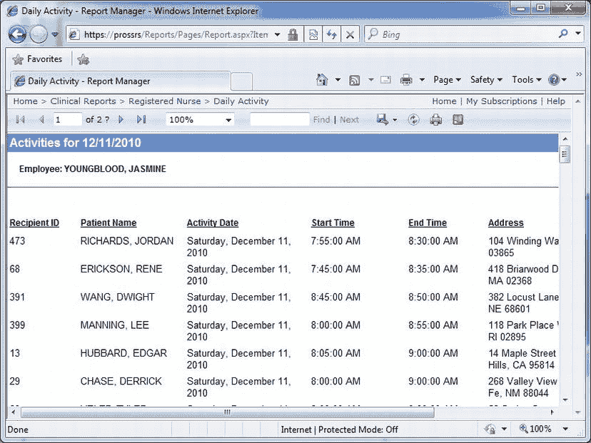

**图 11-21.** 测试用户的过滤报告执行

## 设置数据源安全性

一旦你将数据源部署到报告服务器，就可以指定其连接属性。这是一个重要的步骤，因为属性设置决定了用户和 SSRS 如何连接到数据源。在执行无人参与的报告时——例如，用于用户订阅——SSRS 将控制向数据源传递身份验证凭据，并且必须有权访问有效的身份验证凭据。

在报告管理器中，数据源有四种连接选项可用：

> *   *由运行报告的用户提供的凭据：* 使用此选项时，用户在执行报告时始终会被提示登录数据源。
> *   *安全存储在报告服务器中的凭据：* SSRS 使用存储在 `ReportServer` 数据库中的身份验证凭据。敏感的登录信息是加密的。
> *   *Windows 集成安全性：* 此选项将当前用户的登录信息传递给数据源。如果数据源将用于无人参与的安装，或者 Windows 域未配置 `Kerberos`，则不要选择此选项。在从 SQL Server 进行多次跳转时使用此选项也会出现问题。除非 `Kerberos` 在整个域中正确安装和配置，否则这可能无法在所有情况下正常工作。
> *   *不需要凭据：* 这是最不安全的选项，在数据源不需要身份验证时使用。

## 设置 SQL Server 权限

在第 3 章中，当你创建名为 `Emp_Svc_Cost` 的存储过程时，你设置了权限以允许在报告设计期间进行公共执行。你当时的工作环境是安全的，因为它与其他网络隔离，并且没有被破坏的担忧。

现在你正在生产环境中部署存储过程，你还需要锁定存储过程。你可以通过 SSMS 右键单击存储过程并选择属性来完成此操作（参见 图 11-22）。接下来，单击权限页。使用搜索…按钮搜索 `RN` 组以加载其显式权限。选中授予列下的执行权限，这将允许 `RN` 组中的任何用户执行此存储过程。你不需要显式授予测试用户 `jyoungblood` 执行权限，因为她是 `RN` 安全组的成员。

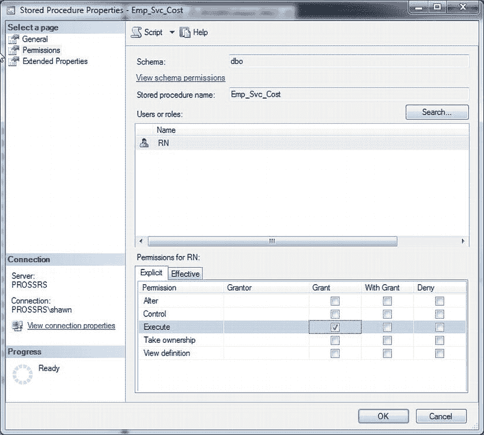

**图 11-22.** 设置 SQL Server 存储过程权限

## 审核报告

能够了解报告执行的详细信息，特别是对于不需要的访问，是安全难题的重要组成部分。在本章中，我们将使用内置的报告执行日志和一个报告管理表来构建一个报告，该报告将显示谁运行了什么报告以及更多信息。拥有报告执行的审计跟踪对于深入了解用户行为和可能的安全漏洞至关重要。

## SSRS 审计

在本节中，我们将展示如何使用 `ReportServer` 数据库中的内置视图来审计 SSRS 中的以下活动：

> *   *报告执行活动：* 哪位用户在何时执行了哪份报告，以及报告以何种状态完成（以发现可能的问题）
> *   *报告的参数输入：* 用户输入了哪些参数

后者很重要，因为尽管 SSRS 对某些类型的参数（如 `Integer` 和 `DateTime`）包含验证功能，但当报告参数使用字符串时，它就容易受到 SQL 注入攻击。当网页或服务从用户或程序接收的输入中可能包含可在 SQL Server 机器上执行的注入代码时，SQL 注入攻击就成为可能。这些攻击本质上可能是恶意的，也可能导致报告或页面传递超出预期的数据。

我们简单地将报告从矩阵改为了表格，这更符合用于性能分析的数据透视表。在这个名为 `报告执行审计` 的修改版报告中（可在 `Pro_SSRS` 第 11 章 文件中找到），您还将包含用户已选择的参数。请上传此报告以及一个指向您的 `ReportServer` 数据库的新数据源，将其放在 SSRS 安装根目录下一个名为 `Management` 的新文件夹中。您还需要将报告指向您正在创建的这个新数据源。您可以在代码清单 11-1 中查看我们用于提取此信息的查询。

**代码清单 11-1.** 执行日志查询

```sql
SELECT
          Catalog.name
        , ExecutionLog.UserName
        , ExecutionLog.Parameters
        , ExecutionLog.TimeStart
        , ExecutionLog.TimeEnd
        , ExecutionLog.Status
 FROM ExecutionLog
INNER JOIN Catalog ON ExecutionLog.ReportID = Catalog.ItemID
```

在图 11-23 中，您可以看到所选报告的执行时间以及输入的参数名称和值。除了通过 `参数` 字段显示用户如何与报告交互外，`报告执行审计` 报告还显示了报告的开始和结束时间。拥有这种级别的审计是维护机密信息安全斗争中的宝贵盟友。对于 HIPAA，还需要维护用户数据访问的审计跟踪。如果您怀疑有人正在访问其无权查看的信息，此报告可以与其他常规审计程序（如 Windows 事件日志）一起作为审计跟踪。

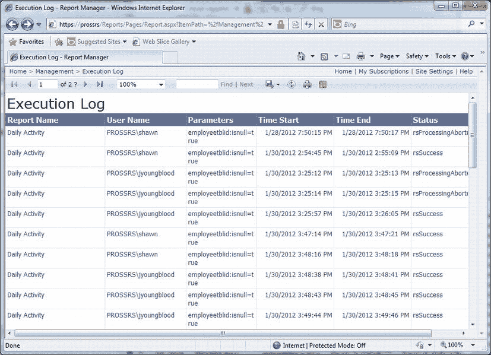

**图 11-23.** 报告执行审计报告

## 日志文件审计简介

除了报告审计外，SSRS 还支持另外两种类型的日志记录：标准的 Windows 事件日志记录和跟踪文件日志记录。您可以使用这两种资源来搜索错误和警告，以及其他重要信息（如安全信息）。

所有跟踪文件都存储在默认安装位置 `驱动器:\Program Files\ Microsoft SQL Server\MSRS11.MSSQLSERVER\Reporting Services\LogFiles`。存在几种类型的日志文件：`ReportServerService` 和 `ReportServer`。每个文件都以时间戳命名，例如 `ReportServerService_05_31_2012_17_00_30.log` 和 `ReportServerService_HTTP_05_31_2012_17_00_30.log`，并包含特定于其各自服务的信息。您可以收集五个级别的跟踪日志信息——0 到 4 级——这些级别在 `Reporting Services\ReportServer\Bin` 文件夹中的 `ReportingServicesService.exe.config` 文件中控制。选择 `0` 将禁用跟踪，选择 `4` 将启用详细模式。每当 SSRS 出现问题时，管理员通常可以通过查看事件日志或某个跟踪文件来隔离问题。

### 小结

在本章中，您研究了确保 SSRS 部署安全所必需的三项安全任务：加密、身份验证和审计。在内部，只有需要访问机密数据的员工才应该拥有该权限，您可以通过为报告部署应用特殊过滤器来确保这一点。作为一家处理大量机密患者信息的公司，我们必须遵守 HIPAA 规定的法规。然而，在其他行业，也存在许多类似的法规。对于任何公司来说，制定安全政策和程序都是良好的实践，即使不是在严格的监管下工作。幸运的是，SSRS 设计用于通过 Windows 身份验证利用您组织中已存在的核心级安全机制，并且在需要时可以扩展以支持其他自定义身份验证方式。

## 第 12 章

## 使用 SSRS 交付商业智能

大多数公司都会积累业务数据，如果分析得当，这些数据可以为公司指明实现最终成功的方向提供洞察。商业智能（BI）的主要目的是以可立即用于决策的方式提供数据。微软的 BI 平台包含许多协同工作的服务和应用程序，以促进关键业务数据的分析与交付。`SQL Server`是 BI 模型的核心，提供数据存储、数据转换、通知、调度、分析和报表服务。

拥有正确的数据只是构建有效 BI 系统挑战的第一部分。第二部分是确保这些数据以有效且易于访问的方式交付给所有需要查看它们以做出正确决策的人。这正是`SSRS`发挥作用的地方。在我们的组织中，我们发现通过将`SSRS`与 BI 平台的许多其他组件集成，我们能够通过在员工需要时、无论他们身在何处都能提供必要信息，从而显著改善整体业务战略。

在本章中，您将了解我们为我们的软件开发公司扩展并纳入`SSRS`报表的以下应用程序：

*分析服务*：能够对数据进行多维度“切片”常常能产生意想不到且有意义的结果。当`OLAP 服务`随`SQL Server 7.0`引入时，我们被要求构建一个数据仓库，将我们的`OLTP`数据转换为`OLAP`多维数据集。我们使用随`SQL Server 2000`一起发行的`分析服务`版本来维护该项目，并增加了一些新功能，例如数据挖掘模型。自那时起，微软一直在`OLAP`技术上大力投入。其中一个增强功能是`VertiPaq`引擎，它与`SharePoint 2010`、`PowerPivot`和`Excel 服务`一起使用。使用`PowerPivot`模型并将其部署到已配置好的`SharePoint 2010`服务器上，可以在内存中快速生成一个`OLAP`多维数据集，以实现对数亿条记录的快速切片和切块。

*SharePoint 服务*：作为 Microsoft Office 的一部分，`SharePoint 服务`为我们公司提供了一个按部门划分的内网门户。任何与单个部门或整个公司相关的信息都会被索引并可搜索。将`SSRS`报表与`SharePoint`集成，使我们的员工能够轻松找到他们完成工作所需的数据。我将向您展示如何将`SSRS`报表添加到`SharePoint`。由于`SSRS`构建在`Windows SharePoint 服务`之上，您在本章中完成的工作也将适用于`Windows Server 2003`附带的`Windows SharePoint 服务`。对于`SharePoint 2010`和`Reporting Services 2012`的安装，您将需要`Windows Server 2008 SP2`的 64 位版本。

大多数公司都有与我们描述的应用程序类似的应用程序。我们提供这些示例是为了让您了解，只需付出少量努力，`SSRS`就能轻松增强这类业务应用程序。我们的目的不一定是提供逐步指南，而是展示您的公司可能如何使用`SSRS`。如果您使用了本章提到的任何技术，您可以轻松地将本章的想法整合到您自己的环境中。

### 为 SQL 分析服务构建 SSRS 报表

当我们开始使用`SQL Server 2000 分析服务`为我们的医疗保健应用程序构建`OLAP`解决方案时，我们渴望在第一天早上就直接开始分析数据。我们很快成为了开发`SQL`查询来查询我们`OLTP`数据库的常驻专家。由于这是我们将要构建数据仓库的源数据库，我们的团队认为这不过是添加几个查询并处理多维数据集这么简单。但事实证明并非如此简单。然而，回想起来，从一个已知数据源创建`OLAP`多维数据集的过程是值得的，因为我们能够将学到的技能应用到许多其他项目中。随着`分析服务`的每个新版本发布，都交付了越来越多的功能。起初，这可能让人应接不暇，仅仅因为增强功能的数量庞大，以及不仅需要熟悉技术，还需要掌握它所需的时间。然而，在添加新功能的同时，微软也添加了许多简化耗时任务的新工具。以`Analysis Services 2005`为例，这些新工具包括一个图形化的`MDX`查询生成器和一个多维数据集向导，它自动化了许多创建`分析服务`解决方案复杂部分的步骤。`SQL Server Analysis Services 2008`和`2008 R2`更进一步，增加了节省时间的功能、增强的数据分析以及与`SharePoint`集成的能力。`SQL Server 2012 分析服务`带来了新的增补功能，比如前面提到的`VertiPaq`引擎和`表格模型`，后者基于新的`商业智能语义模型`（`BISM`）。

在本节中，我们将展示如何使用一个简单的`分析服务`多维数据集作为数据源来构建和部署`SSRS` BI 报表。该多维数据集基于一个`SQL Server`数据库，该数据库作为贯穿本书的医疗保健应用程序的数据仓库。多维数据集填充了与医疗机构患者入院相关的数据。虽然我们设计该报表是为了分析患者入院历史的许多方面，例如多次重复入院的患者、变化的诊断和患者转诊来源，但我们将展示如何创建一个专门提供关于患者被转诊到机构与其实际入院之间时间间隔的分析信息的报表。随着时间的推移，收集到的数据可以帮助决策者定位问题区域，并改进可能导致患者转诊时间效率低下的流程。首先，让我们看一下您将创建的报表所基于的数据库和多维数据集。

您将用作`分析服务`项目源的数据仓库数据库名为`HW_Analysis`。这是一个简单的数据库，仅包含八个表，并使用`SQL Server 集成服务`（`SSIS`）填充数据。使用`SSIS`准备数据仓库数据库的典型过程是：从源`OLTP`数据库导出数据，转换数据使其更易于`SSAS`分析，最后将这些转换后的数据加载到数据仓库或数据集市中。

我们已经构建了`HW_Analysis`数据库和名为`Patient Referral`的`SSAS`多维数据集，并将部署这两个关键组件所需的文件以及详细的安装说明包含在本书代码下载附带的`ReadMe.txt`文件中。源代码和相关文件可在 Apress 网站（[`http://www.apress.com`](http://www.apress.com)）的本书`Source Code/Download`区域获取。一旦您按照`ReadMe.txt`文件中的说明还原了`HW_Analysis`数据仓库数据库，就可以打开包含`Patient Referral`多维数据集的`Pro_SSRS`项目。图 12-1 显示了`BIDS`中简单的`Patient Referral`多维数据集结构。该多维数据集有六个维度和两个度量值。


 **注意** 如果您跳读至此，请注意本书中 `Business Intelligence Development Studio`（`BIDS`）与 `SQL Server Data Tools`（`SSDT`）是作为同义词使用的。如果您使用的是从 `SSRS 2005` 到 `SSRS 2008 R2` 的版本，启动 `DEVENV.exe` 的快捷方式标签为 `SQL Server Business Intelligence Development Studio`。而在 2012 版中，其标签已改为 `SQL Server Data Tools`。

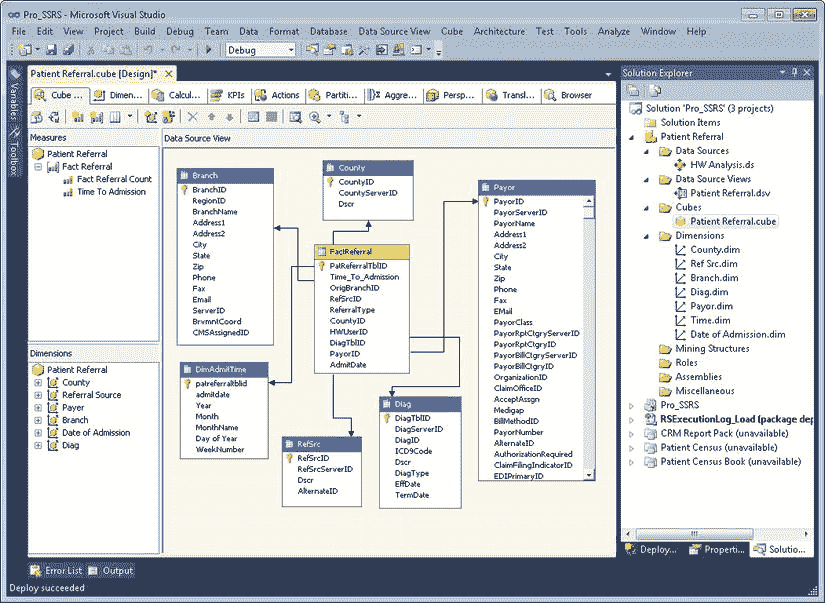

**图 12-1.** Patient Referral 多维数据集结构

在这六个维度中，有多个您应该感到熟悉，因为您已在本书其他章节中使用过它们。维度包含描述事实数据的文本属性。您可以将多维数据集中的维度视为预聚合的数据组或类别，这些数据可与一个或多个度量值相关联。度量值，例如 `入院时间`（`Time to Admission`）和 `转诊事实计数`（`Fact Referral Count`），是在维度各层级计算出的值。存储在多维数据集中的多维数据由维度和度量值组成，当使用 `多维表达式`（`MDX`）进行查询时，不仅可以像 `T-SQL` 查询的行列那样进行二维分析，还能通过下钻和切片在多个维度上进行分析。

想象一下 1974 年发明的魔方，我们很多人小时候都玩过。它有三层高、三层宽、三层深。基于这个画面，假设魔方的绿色面代表 `入院日期`（`Date of Admission`）维度，红色面代表 `分支机构`（`Branch`）维度，黄色面代表 `入院时间`（`Time to Admission`）度量值。比解开魔方容易得多，您可以创建一个 `MDX` 查询来返回这三个点的交集，如 图 12-4 所示。

将在 Patient Referral 多维数据集中使用的维度如下：

> *   `县`（`County`）
> *   `转诊来源`（`Referral Source`）
> *   `诊断`（`Diagnosis`）
> *   `支付方`（`Payer`）
> *   `分支机构`（`Branch`）
> *   `入院日期`（`Date of Admission`）

由于本练习的起点是一个已预填充并处理的多维数据集，因此在创建 `SSRS` 报表之前，确保能从多维数据集获取所需数据非常重要。在 `BIDS` 中打开 `Pro_SSRS` 项目后，在解决方案资源管理器中导航到 `Patient Referral SSAS` 项目，展开至“多维数据集”，然后双击 `Patient Referral.cube`。这将在设计模式下打开该多维数据集。多维数据集打开后，选择“浏览器”选项卡。图 12-2 显示了打开的多维数据集，其中组合的度量值和维度已准备好拖放到查询窗格中。如果浏览器选项卡中未出现数据，并且有消息指示存在权限问题或数据库不存在，这通常表示多维数据集需要处理，或者 `SSAS Patient Referral` 数据库需要部署。要在 `BIDS` 中部署 `Patient Referral OLAP` 数据库（即多维数据集），请右键单击 `Patient Referral` 项目，然后选择“部署”。如果默认权限设置对于您的 `Analysis Services` 实例不足，您可能需要为 `HW Analysis` 数据源打开数据源设计器，并将 `模拟信息` 更改为使用特定的用户名和密码。例如，我的设置是使用具有相应权限的 Windows 用户 "`SQLBIGEEK\bmcdonald`" 来部署多维数据集。成功部署 `Patient Referral OLAP` 数据库后，您可以返回“浏览器”选项卡，并单击可用链接以重新连接到数据库。

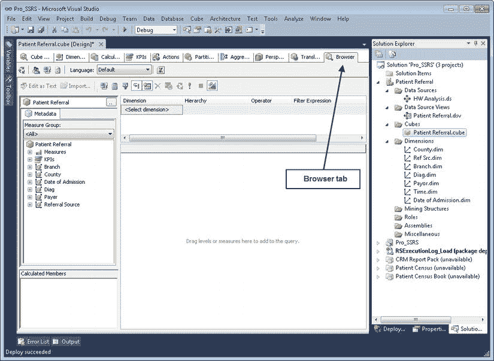

**图 12-2.** 在 BIDS 中查看 Patient Referral 多维数据集

请执行以下步骤以查看平均 `入院时间`：

> 1.  首先，在多维数据集设计窗格左侧的多维数据集对象窗口中，展开 `度量值`，然后展开 `转诊事实`（`Fact Referral`）。
> 2.  接着，将 `入院时间`（`Time of Admission`）度量值拖到查询窗格的 `将级别或度量值拖至此处以添加到查询` 部分。通常，在浏览多维数据集或创建报表时，您需要先拖入度量值，然后再拖入维度属性。您应该会看到一个平均时间为 14.095 天。此计算是在多维数据集最初加载和处理时完成的，代表所有维度组合的总平均入院时间。图 12-3 显示了查询窗格中的 `入院时间` 度量值。
>     
>     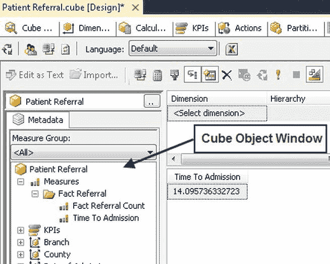
>     
>     **图 12-3.** 查看所有维度的总体入院时间度量值平均值
>     
>     
> 3.  现在，将两个维度对象拖放到数据窗格。在 `分支机构`（`Branch`）对象下，将 `分支机构名称`（`Branch Name`）字段拖放到我们的 `入院时间` 度量值的左侧。
> 4.  接下来，在 `入院日期`（`Date of Admission`）下，将 `年 - 月份名称 - 入院日期`（`Year - MonthName - admitdate`）层次结构拖放到数据窗格中 `分支机构名称` 的右侧。该层次结构看起来像一个由六个正方形组成的金字塔。完成后，多维数据集浏览器应如 图 12-4 所示。您现在可以看到每个 `admitDate` 的结果，以及其对应的 `分支机构名称`、`年` 和 `月份名称` 属性。

在早期版本的多维数据集浏览器中，您可以像在 `矩阵` 型报表中看到的那样，下钻层次结构并拥有列分组。然而，截至当前的 `SQL Server 2012` 版本，多维数据集浏览器以二维方式返回数据，很像 `T-SQL` 查询的结果。`SQL Server` 用户社区中的一些活跃成员表示，对于微软的多维数据集浏览器来说，这是一个奇怪的倒退，我个人认为他们应该恢复此功能。但是，从报表角度来看，并未发生实质性变化。如果您看到的是上面 图 12-3 描绘的结果，那么您确实正在从多维数据集获取数据！现在是时候转到 `SSRS` 并创建您将部署到 `SharePoint` 的报表了。

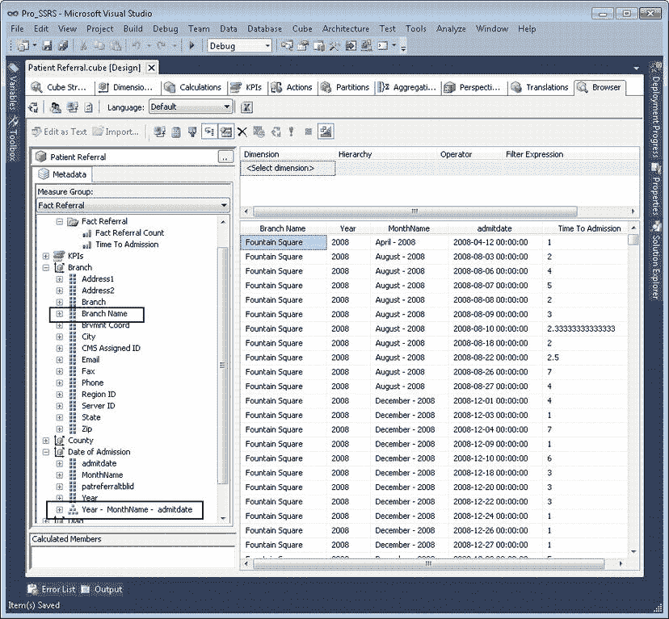

**图 12-4.** 包含年份和分支机构的多维数据集浏览器

## 将 Analysis Services 多维数据集与 SSRS 配合使用

既然您已确认 `Patient Referral` 多维数据集运行正常，下一步就是创建 `SSRS` 报表。在 `Pro_SSRS` 项目中，您会找到两个已完成的报表：`平均转诊至入院` 报表和 `转诊至入院图表` 报表。这两个报表都基于 `Patient Referral` 多维数据集。由于创建报表的过程相同，我们将不会逐步演示构建这些报表的过程。不过，我们将通过 `平均转诊至入院` 报表演示以下内容：

> *   设置数据源以使用 `Analysis Services`
> *   使用随 `SQL Server Reporting Services 2005` 新增的图形化 `MDX` 查询生成器


## 设置分析服务数据源

打开 `Pro_SSRS` 项目后，导航至 `Reports` 文件夹，并打开“平均转诊至入院时间”报表。接着，打开“报表数据”窗口。右键单击 `Patient_Referral` 数据集，从子菜单中选择“查询”选项。请注意，该查询识别出您正在使用带有 `MDX` 的 OLAP 数据源，并会打开图形化的 `MDX` 查询设计器。如您所见，这与本书中访问查询时一直使用的 `T-SQL` 查询窗口截然不同。如果您选择筛选表达式并筛选 2010、2011 和 2012 年，您应该会看到类似于 图 12-5 所示的结果。此报表中包含两个数据集：`Patient_Referral` 和 `DateofAdmissionYear`。

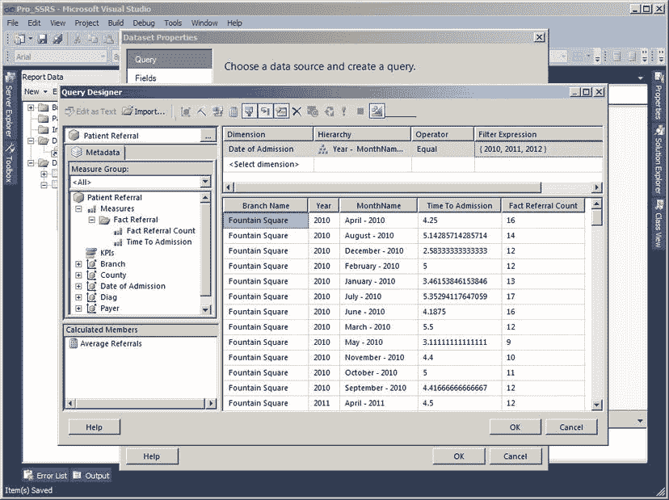

图 12-5. 查看“平均转诊至入院时间”报表的 `Patient_Referral` 数据集

这两个数据集的数据源类型均为 Microsoft SQL Server Analysis Services。如果您的 Analysis Services 实例不在您所连接的本地计算机上，则需要将报表中默认的 `localhost` 数据源服务器更改为您的 SSAS 服务器名称。您可以通过双击名为 `PatRef_DS` 的共享数据源并编辑数据源属性以匹配您的环境来轻松完成此操作，如 图 12-6 所示。

在数据集针对您的 SSAS 环境正确配置后，接下来您将了解如何构建 `MDX` 查询。

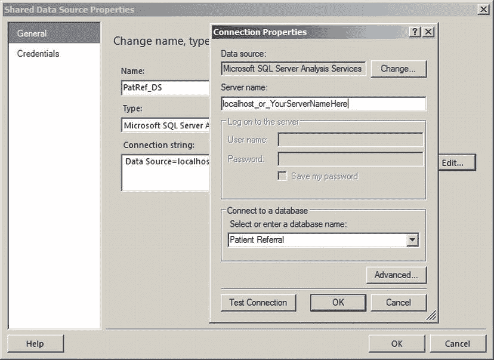

图 12-6. `PatRef_DS` 数据源的连接属性

## 使用图形化 MDX 查询生成器

在 `SQL Server 2005` 的 `SSRS` 中引入并在 `2008` 版中进一步增强的一个重要新特性，就是图形化的 `MDX` 查询生成器。`MDX` 是一门相当庞大且复杂的语言，容易出现语法错误。您必须对其有内在的理解，才能真正从 SSAS 多维数据集中提供精确的数据。拥有并使用图形化查询工具来构建基础 `MDX` 查询（其方式与开发人员使用图形化查询设计器构建 `T-SQL` 查询非常相似），可以减少常见的语法错误并加快查询开发速度。

打开“平均转诊至入院时间”报表的报表数据查询窗口，注意到列出了几个维度和度量值元素：`BranchName`、`Year`、`MonthName`、`Time to Admission` 和 `Fact Referral Count`。默认情况下，报表将在图形设计模式下打开，如 图 12-7 所示，而不是通用查询设计器。设计模式通过工具栏右侧的“设计模式”按钮进行切换。在图形设计模式中，维度元素可以直接从列出这些元素的“元数据”窗格拖放到窗口中。如果选择了“自动执行”按钮（默认情况下已选择），则每当拖放元素时，查询就会执行，并显示数据结果。

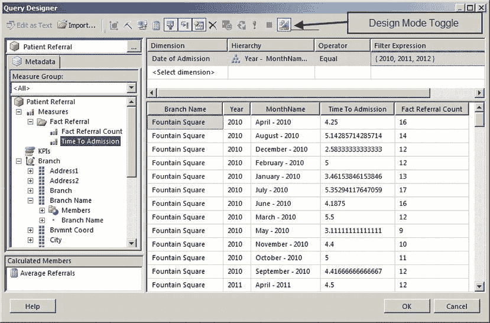

图 12-7. 图形化查询生成器的输出

如同您在“患者转诊”多维数据集浏览器中查询同一多维数据集时所看到的数据多维视图一样，`SSRS` 以二维方式（行和列）看待数据。`SSRS` 报表可以从多维数据集访问数据；然而，有必要以二维方式排列数据，因为报表在求和及总计度量值（本例中为 `Time to Admission` 和 `Fact Referral Count`）时将以此方式聚合数据。我们还对查询应用了筛选器，以便仅选择 2010 年至 2012 年的数据。

正如您可能在 图 12-7 的左下角所注意到的，您可以使用工具栏上的几个按钮来修改查询的属性，例如显示空单元格或添加计算成员。计算成员是 `MDX` 查询的一部分，通过将一个或多个元素组合成一个可作为新元素独立使用的值而创建。例如，您可以创建计算成员，不仅显示每个维度元素（如 `BranchName` 和 `Year`）的平均入院时间，还显示使用 `MIN` 函数计算的最短入院时间，或使用 `MAX` 函数计算的最长入院时间。这些计算成员将成为整个查询的一部分，可作为新的度量值使用，并在每个维度级别返回数据值。换句话说，如果您需要在报表层创建一个在多维数据集本身中并未创建为计算的计算，您可以在报表的数据集层创建一个“计算成员”。对于那些不擅长编写 `MDX` 计算的人来说，这是一种创建报表级计算的简便方法。

图形化查询构建并运行后，现在让我们看看其背后生成的 `MDX` 代码。您可以通过单击“设计模式”工具栏按钮来查看。图 12-8 显示了为报表返回所选维度元素和度量值的 `MDX` 查询。

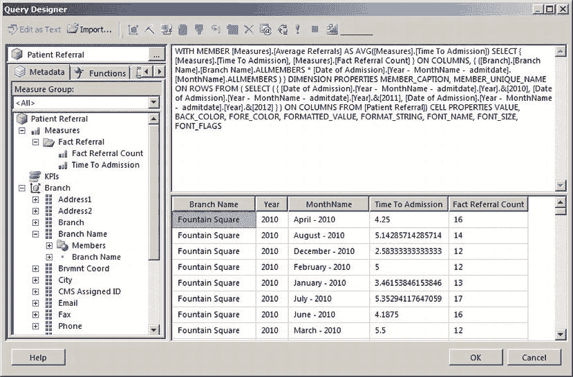

图 12-8. 以图形方式生成的 `MDX` 查询

 **注意** 如果您在文本模式下修改了 `MDX` 查询并尝试返回设计模式，您可能会丢失对查询所做的任何手动更改，如 图 12-9 所示。

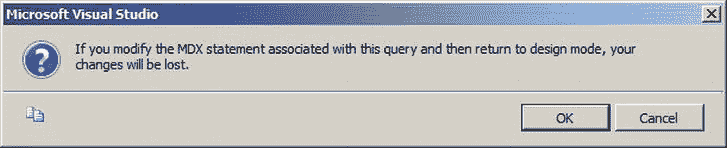

图 12-9. 更改 `MDX` 查询时显示的警告消息

“平均入院时间”和“转诊至入院时间图表”这两个报表都将在 SharePoint 中以紧凑的 Web Part 形式显示，我们将在下一节介绍如何操作。因此，我们有意将报表尺寸设置得较小，使用 8 磅 Arial 字体和狭窄的单元格。图 12-10 显示了“平均入院时间”报表的“设计”选项卡。

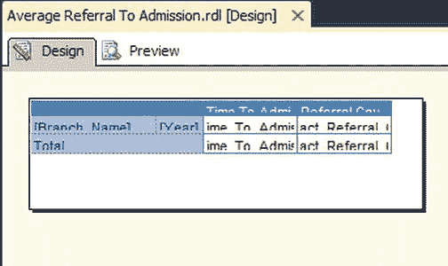

图 12-10. “平均转诊至入院时间”报表的布局选项卡

此时，我们可以将两个报表都发布到报表服务实例，并将报表交付给用户。这两个报表结合了一定程度的商业智能，非常适合在仪表板或业务门户中视图。为此，我们将在设计环境中最后查看第二个基于图表的报表，然后转向完全集成的 Microsoft SharePoint 部署，在 SharePoint 本身内部查看和管理报表。图 12-11 显示了在 BIDS 中预览的“转诊至入院时间图表”报表。

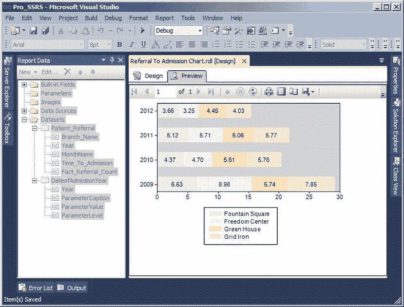

图 12-11. 在设计环境中预览“转诊至入院时间图表”报表


