# 在 Microsoft SharePoint 2010 中整合 SSRS

SSRS 和 SharePoint 技术都经历了相似的进展与成熟。两者在全球范围内都获得了企业日益增长的接纳与支持。因此，这两种技术最终结合成为 Microsoft 过去几年构建的整体**商业智能**平台的组成部分，是一个自然的演进过程。早期 SharePoint 对 SSRS 的支持包括可为 SharePoint 安装的 SSRS Web 部件。这些 Web 部件提供了一种在 SharePoint 内查看已发布 SSRS 报告的手段。然而，这种结合并不像许多管理员和仪表盘设计师所期望的那样紧密。报告的管理仍然主要由 DBA 或报告内容管理员负责。`SQL Server 2005 Service Pack 2` 包含了对完全集成的 SSRS 和 SharePoint 基础设施的支持，使得报告可以在 SharePoint 内发布、管理和查看。`SSRS 2008` 和 `2008 R2` 延续了这种融合，许多组织已经采用了这种方法论，而不是采用不直接与 SharePoint 集成的纯原生 SSRS。

这引出了 `SharePoint 2010` 和 `SQL Server 2012 Reporting Services`。尽管在将 Reporting Services 与 SharePoint 集成方面与之前的版本相似，但其安装和配置过程却大不相同。在 Reporting Services 的最新版本中，如果您希望以 `SharePoint 集成模式`运行，则需要先安装 SharePoint，然后以 SharePoint 集成模式安装 Reporting Services。这个过程实质上是在 `SharePoint 2010` 之上安装 Reporting Services。此过程与之前的版本不同，因为之前 SSRS 和 SharePoint 是独立的实体，可以使用配置工具进行集成。

在本节中，您将逐步完成 SharePoint 和 SSRS 的独立安装，并将上一节的两个报告 `Average Time to Admission` 和 `Referral to Admission Chart` 部署到 SharePoint 站点并查看：

1.  首先，您将在同一台服务器上安装带有 `Service Pack 1` 的 `Microsoft SharePoint 2010` 和 `SSRS 2012`。
2.  接下来，您将报告部署到具有 `SharePoint 2010` 的 SSRS 集成服务器。
3.  最后，您将使用 `SSRS Web 部件` 创建一个简单的仪表盘。

## 在独立服务器上安装 SharePoint 2010 和 SQL Server 2012

`SQL Server 2012` 的安装程序多年来已得到极大改进。具体来说，对于 SSRS，您保留了安装核心程序集的能力，但可以在之后配置 SSRS 实例。然而，在 `SSRS 2012` 中，如果您计划同时部署 SSRS 和 SharePoint，则可以直接以 SharePoint 集成模式安装 SSRS。对于我们的安装，我们选择在同一台服务器（称为独立安装）上安装 `SSRS 2012` 和 `SharePoint 2010`。对于任何想熟悉这两种技术如何协同工作的人来说，这是推荐的设置。其他部署场景，例如多服务器安装，在更大的环境中也是可能且预期的，但我们最初选择独立部署纯粹是为了测试和培训。我们建议任何不熟悉集成 SSRS 和 SharePoint 安装的人都走这条路径。

 **注意** 与大多数基于服务器的软件一样，`SharePoint 2010` 和 `SQL Server 2012` 有一些必须在成功安装前满足的先决条件。这些要求可能会随时间变化，因此在开始安装软件之前，最好始终验证先决条件。例如，`SharePoint 2010` 需要安装在基于服务器的操作系统上，如 `Windows Server 2008`。它还需要安装 `Service Pack 1`，至少 `4GB` 内存和 `80 GB` 磁盘空间。服务器必须配置为域控制器。这些只是部分要求，您可以在 [`http://technet.microsoft.com/en-us/library/cc262485.aspx`](http://technet.microsoft.com/en-us/library/cc262485.aspx) 查看更多 SharePoint 要求，在 [`http://msdn.microsoft.com/en-us/library/gg492276(v=sql.110).aspx`](http://msdn.microsoft.com/en-us/library/gg492276(v=sql.110).aspx) 查看 SQL Server Reporting Services 要求。

假设所有先决条件、软件和硬件要求都已满足，那么完成 SSRS 和 SharePoint 的独立安装有六个主要步骤：

1.  安装带有 `Service Pack 1` 的 `SharePoint 2010`。
2.  以 SharePoint 模式安装 `SQL Server 2012` 数据库引擎和 Reporting Services。
3.  配置 `SharePoint 2010`。
4.  安装并启动 `Reporting Services SharePoint 服务`。
5.  在 `SharePoint 管理中心` 创建一个 `Reporting Services 服务应用程序`。
6.  配置与 SharePoint 的 `Reporting Services 集成`。

## 安装 SharePoint 2010

我们将首先引导您完成带有 `Service Pack 1` 的 `SharePoint 2010` 的安装。安装 `SharePoint 2010` 是一个简单的过程，除了最后一步，安装向导会询问您是否要 `运行配置向导` (图 12-12)。此选项按钮默认是选中的，但对于 SharePoint 集成模式下的 Reporting Services，您稍后会进行配置。您将在安装 `SQL Server 2012` 数据库引擎实例之后再配置 SharePoint。取消选中该复选框并点击 `关闭` 以完成 `SharePoint 2010` 安装。

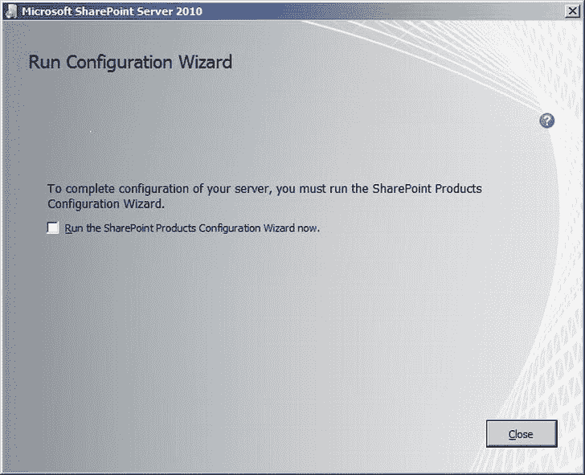

***图 12-12.** 安装 `SharePoint 2010`*

### 在 SharePoint 模式下安装 SQL Server 2012 Reporting Services

现在 `SharePoint 2010` 已安装，是时候为 SharePoint 安装数据库引擎和 Reporting Services 了。带有 SSRS 的 `SQL Server 2012` 安装是一个您可能已经熟悉的标准过程。详细介绍安装的每一步超出了本书的范围；但是，典型安装与包含集成 SharePoint 支持的安装之间的唯一区别可以在 `功能选择` 和 `Reporting Services 配置` 屏幕上看到。请继续选择 图 12-13 中所示的选项。

由于这是在本地虚拟机上进行，而不是在传统的企业网络上，我选择在此虚拟机上也安装 `Analysis Services`。这样，我可以复制 `Pro_SSRS` 项目，并将 `Patient Referral Analysis Services` 数据库（多维数据集）部署到同一台虚拟机上，用于本章的剩余示例。

 **注意** 如果您也在专用虚拟机上执行 `SharePoint 2010` 安装，您还需要将您的 `Pro_SSRS` 项目复制到虚拟机，并如本章前面讨论的那样部署多维数据集。

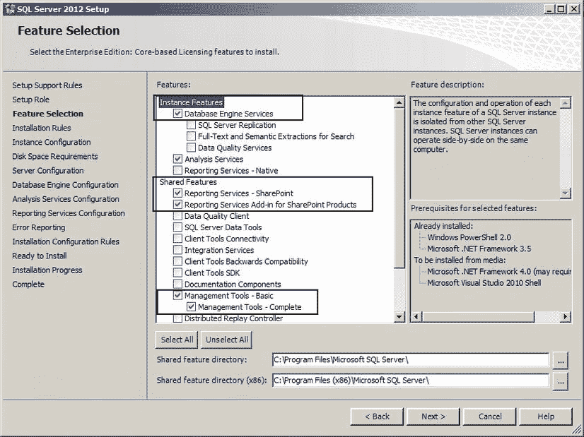

***图 12-13.** 为 SharePoint 安装 SSRS*

如 图 12-14 所示，您唯一的选项是 `Reporting Services SharePoint 集成模式 – 仅安装`。在 `仅安装` 单选按钮下方的注释中，您可以看到一条消息，说明您需要使用 `管理中心` 配置 SharePoint 来完成安装。它还说明您需要启动 `Reporting Services` 服务并创建一个 `Reporting Services` 服务应用程序（前面列表中的安装步骤 4 和 5）。现在，您将安装 `Reporting Services SharePoint 服务`。

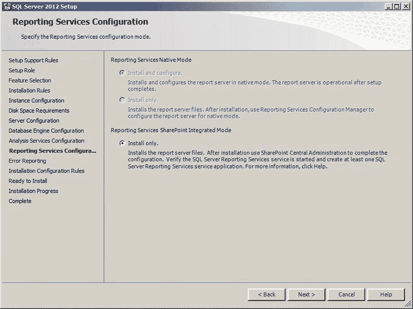

***图 12-14.** 在 SharePoint 集成模式下安装 SSRS*


## 配置 SharePoint 2010

SSRS 安装完成后，您需要执行安装过程中的第三个主要步骤。现在，让我们通过“所有程序”菜单下“Microsoft SharePoint 2010 Products”文件夹中的 **SharePoint 2010 产品配置向导** 来配置 SharePoint。请按照以下步骤配置新的服务器场。

1.  选择“创建新的服务器场”选项，并点击“下一步”继续。
2.  为 SharePoint 网站指定**配置数据库设置**，如图 12-15 所示。本例中，我的服务器名称是 `VMWINSVR2008SP2`，并且我指定了连接到配置数据库时要使用的用户凭据 (`SQLBIGEEK\bmcdonald`)。通常，您会指定一个密码很少更改的系统账户。点击“下一步”继续。
3.  为**场安全设置**指定一个密码短语。当您需要执行将服务器加入场等操作时会用到此短语。其最低要求类似于安全 Active Directory 网络的要求。密码必须具备以下特征：最小长度为八个字符、包含特殊字符，并混合使用数字、大写字母和小写字母。点击“下一步”继续。

    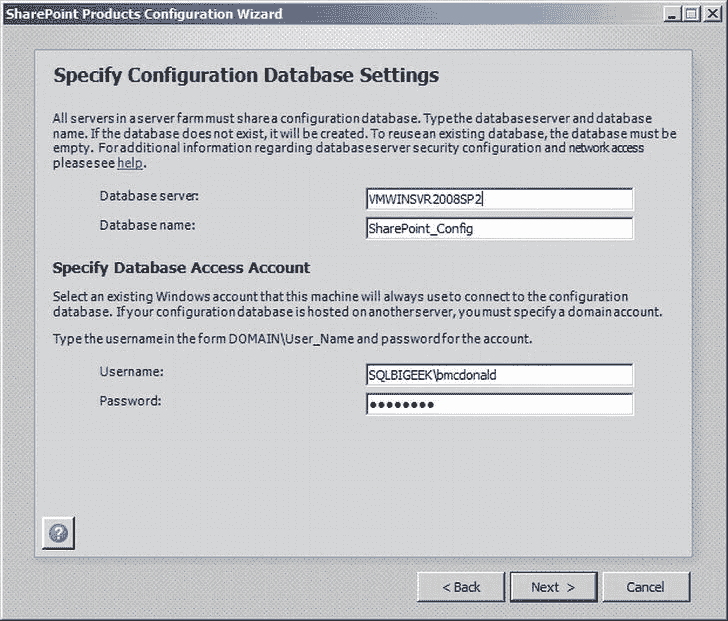

    **图 12-15.** 为 SharePoint 指定配置数据库设置

4.  接下来，您需要配置 SharePoint 中心管理 Web 应用程序。我喜欢将默认端口号更改为不常用但比典型默认值更容易记住的端口。您可以保留默认端口，但我选择使用端口 `2012`，如图 12-16 所示。点击“下一步”继续。
5.  完成向导后，您将看到一个摘要。点击“下一步”开始配置过程。配置向导完成其神奇工作后，将会弹出一个对话框，提示过程已完成。点击“完成”后，您将进入 SharePoint 中心管理。如果出于某种原因您的中心管理没有自动打开，您可以通过转到“开始”菜单 > “所有程序” > “Microsoft SharePoint 2010 Products”来找到它。或者，您可以启动 Internet Explorer 并导航至 [`http://ServerName:PortNumber/`](http://ServerName:PortNumber/)。在我的场景中，运行在服务器名 `VMWINSVR2008SP2` 的端口 `2012` 上，我的 URL 将是 [`http://VMWINSVR2008SP2:2012/`](http://VMWINSVR2008SP2:2012/)。

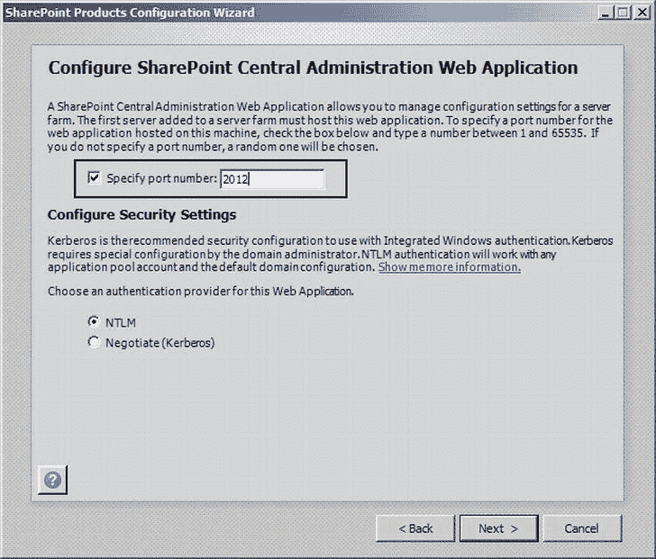

**图 12-16.** 指定 SharePoint 中心管理端口和安全设置

呼！您已经完成了配置向导。现在进入有趣的部分。我猜您没想到自己会学习 PowerShell，对吧？好吧，您不会学太多，所以不用担心。现在，您将执行让 Reporting Services 2012 和 SharePoint 2010 协同工作的第四个主要步骤。

## 安装并启动 Reporting Services SharePoint 服务

在此步骤中，您需要将已安装的 SQL Server Reporting Services 组件连接到新的 SharePoint 场。请执行以下步骤来安装并启动 Reporting Services SharePoint 服务。

点击“开始”按钮 > “所有程序”，然后在“Microsoft SharePoint 2010 Products”文件夹下右键单击“SharePoint 2010 Management Shell”并选择“以管理员身份运行”。您必须以管理员身份运行此程序才能执行后续步骤。否则，您将收到如图 12-17 所示的错误。

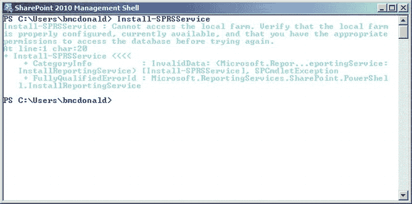

**图 12-17.** 如果 SharePoint 管理 Shell 未在管理员模式下运行时显示的错误

键入以下 PowerShell 命令以安装 SharePoint Reporting 服务。键入命令后按 Enter 键执行。

```powershell
Install-SPRSService
```

键入以下 PowerShell 命令以安装 PowerShell 服务代理。按 Enter 键执行命令。

```powershell
Install-SPRSServiceProxy
```

键入以下 PowerShell 命令以启动该服务。在一行中键入命令后，按 Enter 键执行命令。

```powershell
Get-spserviceinstance –all | where {$_.TypeName –like “SQL Server Reporting*”} | Start-SPServiceInstance
```

图 12-18 显示了完成安装并启动 Reporting Services SharePoint 服务后的结果。对于第五步，您需要创建一个新的 Reporting Services 服务应用程序。

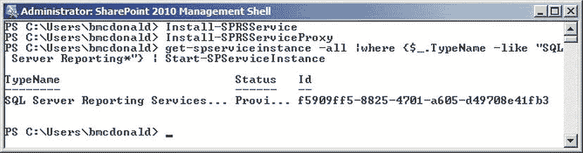

**图 12-18.** 管理员模式下的 SharePoint 管理 Shell 和脚本

## 创建新的 Reporting Services 服务应用程序

您现在正处于完成所有在 SharePoint 2010 模式下安装 Reporting Services 2012 所需设置步骤的边缘。此步骤将在 SharePoint 2010 中心管理中完成。请执行以下步骤来创建一个新的 SQL Server Reporting Services 服务应用程序。我知道，这名字有点拗口，但我们将一起完成它。

您需要打开 SharePoint 2010 中心管理，可以在“开始”菜单 > “所有程序” > “Microsoft SharePoint 2010 Products”下找到它。

从中心管理的主页，在“应用程序管理”任务组下，点击“管理服务应用程序”链接，如图 12-19 所示。

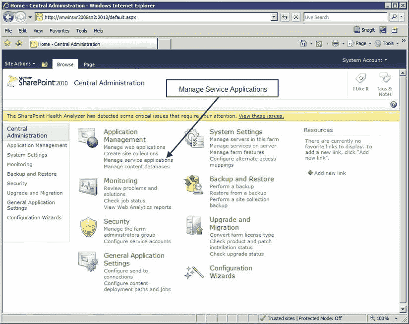

**图 12-19.** SharePoint 2010 中心管理的服务应用程序管理

接下来，在 SharePoint 菜单中点击“新建”按钮，并选择“SQL Server Reporting Services 服务应用程序”，如图 12-20 所示。

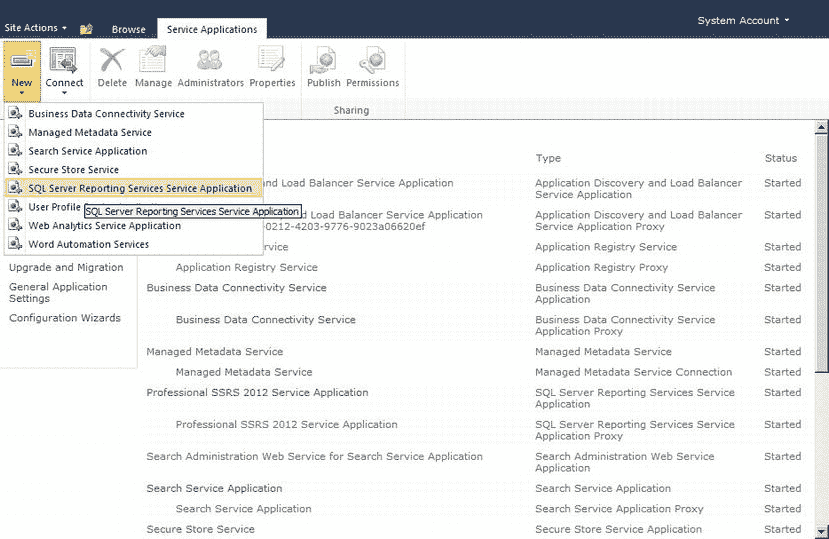

**图 12-20.** 创建新的 SSRS 服务应用程序

输入此服务应用程序的名称和要使用的应用程序池。从可管理性的角度来看，将它们命名为相同的名称是个好主意。如图 12-21 所示，我的两个名称都命名为“Professional SSRS 2012 Service Application”。根据您的安全需求，适当更改。我使用了 SharePoint 托管账户的默认安全设置。向下滚动，适当设置数据库服务器、名称和身份验证详细信息。最后但同样重要的是，选择 Web 应用程序关联。本例中，只有一个 Web 应用程序可供关联。点击“确定”保存您的设置。几分钟后，您应该会看到一个屏幕，提示您的新服务应用程序已成功完成。

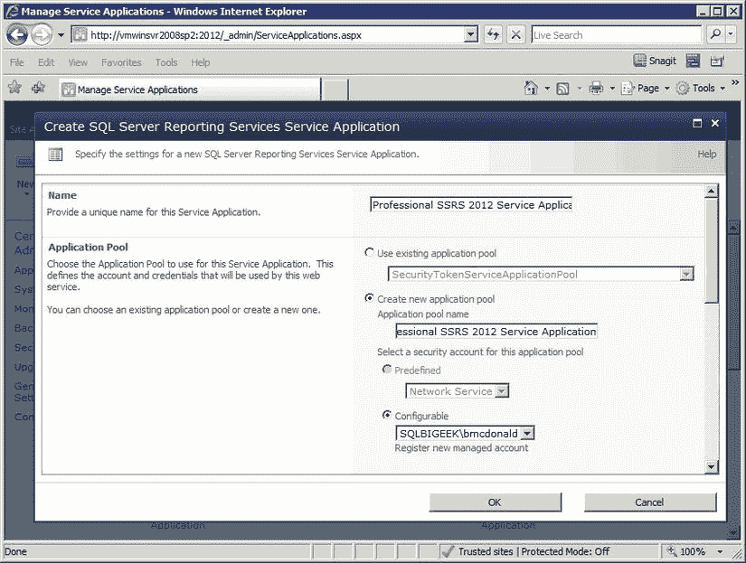

**图 12-21.** 创建新的 SSRS 服务应用程序

新的 SQL Server Reporting Services 服务应用程序创建后，您将在您的服务应用程序列表中看到它，如图 12-22 所示。我相信您会很高兴得知，在 SharePoint 2012 模式下安装和配置 SQL Server 2012 Reporting Services 只剩下一步了。

在早期版本的 Reporting Services 中，与 SharePoint 的集成是使用 Reporting Services 配置管理器管理的。正如我之前提到的，在 SQL Server 2012 中，如果您选择在 SharePoint 集成模式下运行，Reporting Services 将完全在 SharePoint 2010 内部安装和配置。所以接下来，我将引导您完成将 Reporting Services 集成到 SharePoint 的步骤。

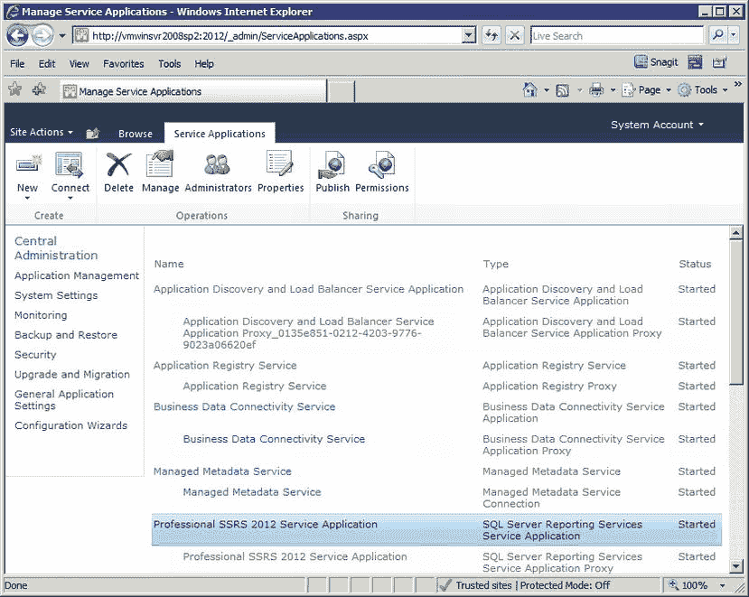

**图 12-22.** 服务应用程序列表


## 配置 Reporting Services 与 SharePoint 的集成

既然您已完成所有必需的安装步骤，现在就开始最终的配置过程吧。您知道 `SSRS` 已配置为 SharePoint 集成模式。现在需要做的就是配置 SharePoint，以激活 `Reporting Services 集成` 和 `管理功能`。

既然我们正在使用 `SharePoint 2010` 和 `SQL Server 2012` 处于 SharePoint 集成模式下，`ReportServer` 数据库完全由 SharePoint 管理。SharePoint 将为所有安全性、报表和数据源提供存储。SharePoint 的所有优势，例如文档发布和传递，都将由 SharePoint 维护。

SharePoint 的主要管理网站称为 `管理中心`，您将在那里执行剩余的 `SSRS` 配置设置。请执行以下配置步骤：

1.  通过单击 `开始`、`所有程序`、`Microsoft SharePoint 2010 产品`，然后单击 `SharePoint 2010 管理中心`，打开 `管理中心` 网站。
2.  单击 `网站操作`，然后单击 `网站设置`。当 `网站设置` 屏幕出现时，在 `网站集管理` 下单击 `网站集功能` 链接。在那里我们需要确保 `Reporting Services` 功能已激活。
3.  如 `图 12-23` 所示，在 `报表服务器管理中心` 和 `报表服务器集成` 功能旁边单击 `激活`。

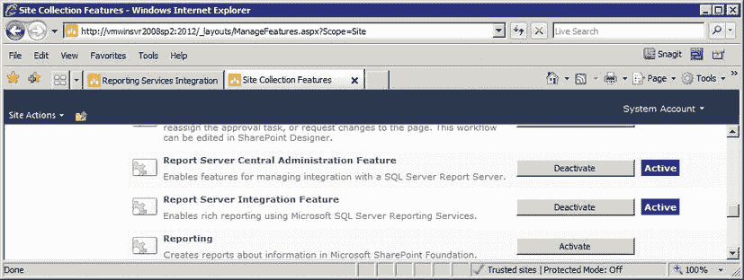
`图 12-23.` 激活网站集功能

就是这样！您已完成 `SharePoint 2010` 和 `SQL Server 2012 Reporting Services` 在 SharePoint 模式下的安装和配置。不过，在我们继续之前，我想向您展示如何进入管理 `Reporting Services` 配置设置的屏幕。如果您仍然开着 `管理中心`，请单击 `应用程序管理`。接下来，在 `服务应用程序` 组下，单击 `管理服务应用程序`。您应该能认出打开的屏幕，因为它与上面 `图 12-22` 中显示的相同。深入您的 `Reporting Services` 服务应用程序，就像我在 `图 12-24` 中所做的那样。请记住，我的是 `Professional SSRS 2012 Service Application`。

 **注意** 不同的环境可能需要不同的部署情况和策略。如果您需要进一步帮助将 `SSRS 2012` 和 SharePoint 完全集成，`Microsoft.com` 上有一些很好的资源。其中一个用于配置 `SSRS 2012` 和 `SharePoint 2010` 的资源可以在 [`http://msdn.microsoft.com/en-us/library/gg492276(v=sql.110).aspx`](http://msdn.microsoft.com/en-us/library/gg492276(v=sql.110).aspx) 找到。

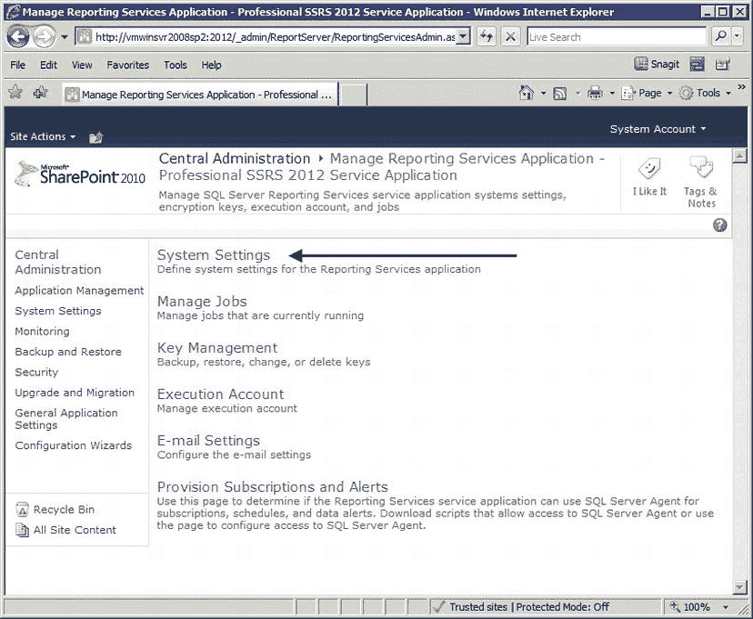
`图 12-24.` 管理 Reporting Services 服务系统设置

接下来，单击 `系统设置` 链接以查看 `Reporting Services` 服务设置。如您在 `图 12-25` 中所见，您可以在这里更改各种选项，例如报表历史记录、超时，甚至保存 `执行日志` 的时长，就像我们在 `第 10 章` 中所做的那样。

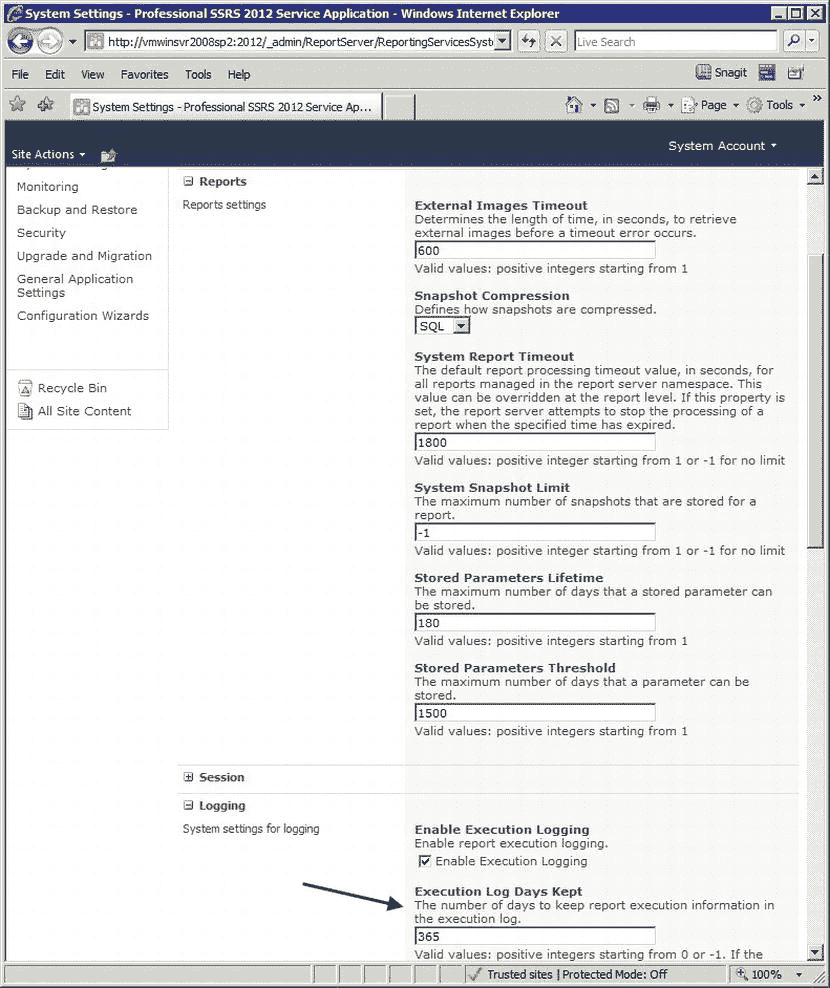
`图 12-25.` 设置 Reporting Services 服务应用程序服务器默认值

既然您已完成所有设置和配置，是时候继续前进，并向您展示如何将报表部署到 SharePoint 站点了。

### 在 SharePoint 集成的 SSRS 安装中部署报表

一旦完成了三项管理任务，就可以开始在 SharePoint 站点本身内工作了，您将在其中使用已部署的报表和仪表板，为您的用户创建一个门户页面。就我们组织的案例而言，我们想要一个简单的 `招生` 仪表板页面，公司高管和决策者可以在其中简明扼要地审阅重要的 `BI` 报表。SharePoint 提供了许多模板和示例，您可以用来帮助设计仪表板。

让我们看一个默认的 SharePoint 页面。您可以在 `图 12-26` 中看到，基础 SharePoint 站点集安装包括一个 `文档中心`。为了集中我们的部署位置，我们创建了一个 `报表库`。我们还在 SharePoint 系统上使用内置的 SharePoint 模板 `商业智能中心` 创建了另一个站点，这将允许我们使用 Web 部件创建一个示例仪表板。

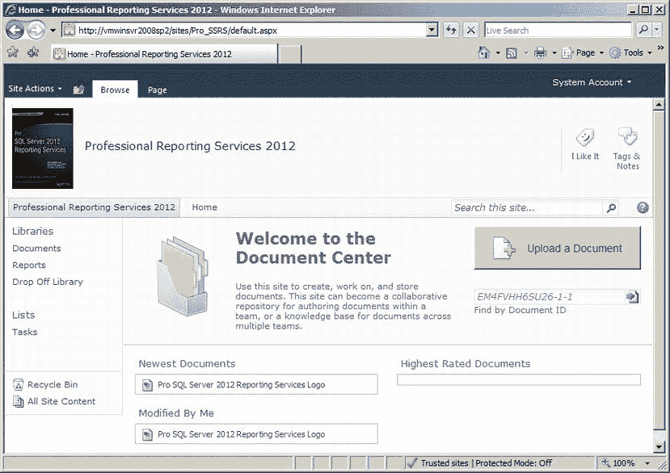
`图 12-26.` SharePoint 文档中心主页

`图 12-27` 显示了 `SharePoint 2010` 的 `商业智能中心`。名称 `商业智能中心` 不应让您认为所有 `SSRS` 报表都将部署在这里。`SSRS` 报表可以部署到任何有效的 SharePoint 路径，您稍后会看到。`商业智能中心` 是一个可以创建仪表板或 `Microsoft Excel` 工作簿的位置，也是一个可以部署报表的区域。是在 `文档中心` 内的 `报表库` 中，可以存储 `SSRS` `RDL` 文件、数据源和许多其他类型的报表。

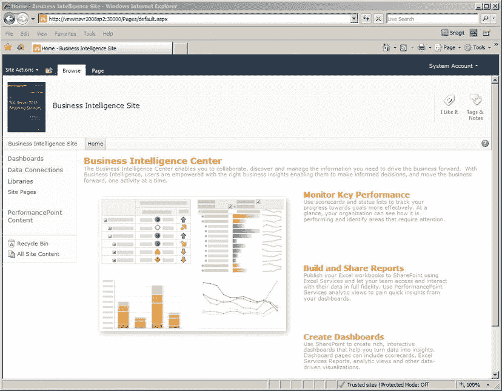
`图 12-27.` SharePoint 商业智能中心

正如我所提到的，`RDL` 报表可以部署到 SharePoint 中任何有效的文档库。在 `图 12-28` 中，您可以看到您的 `Pro_SSRS` 报表项目的项目属性。由于您将把这些报表部署到 SharePoint 服务器，服务器和报表文件夹的目标 URL 将与本机 `SSRS` 部署不同。您可以看到服务器将是主 SharePoint 站点的 URL，在我们的例子中是 [`http://localhost/`](http://localhost/)。目标报表文件夹是一个指向有效 SharePoint 文档库的 URL；在本例中，[`http://localhost/sites/Pro_SSRS/Reports`](http://localhost/sites/Pro_SSRS/Reports)，它指向我们 `文档中心` 中的 `报表库`。

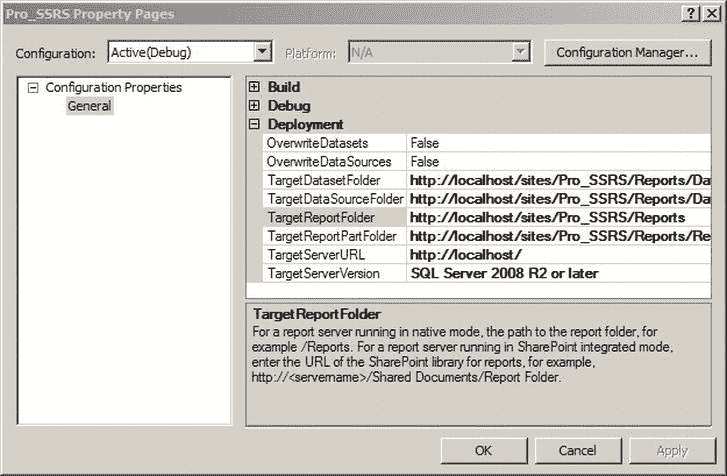
`图 12-28.` 报表项目的目标 URL 属性

在对报表项目的目标 URL 进行这些更改之后，您可以直接将报表部署到 SharePoint。右键单击 `PatRef_DS` 共享数据源并选择 `部署`。为了将报表部署到 SharePoint 站点，您必须首先部署数据源。在 `PatRef_DS` 数据源部署后，在 `解决方案资源管理器` 中右键单击 `Average Referral to Admission` 报表，然后选择 `部署`。或者，您可以通过按住 `Ctrl` 键选择数据源和报表，然后右键单击并选择 `部署`。这将首先部署数据源，然后部署报表。一旦报表成功部署，您将能够在 SharePoint 站点中看到该报表。将报表部署到 SharePoint 最好的部分是，如 `图 12-29` 所示，您可以利用所有 SharePoint 文档功能，因为 `RDL` 文件也被视为文档。诸如工作流、警报以及文档签入和签出之类的功能都会被继承。

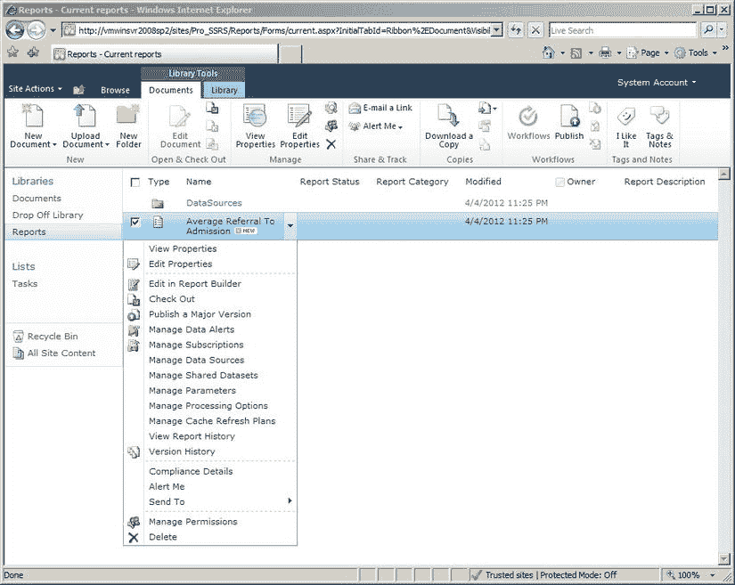
`图 12-29.` 已部署的报表及 SharePoint 文档功能


