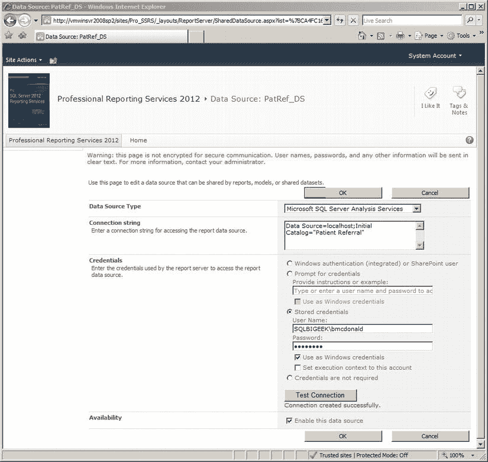
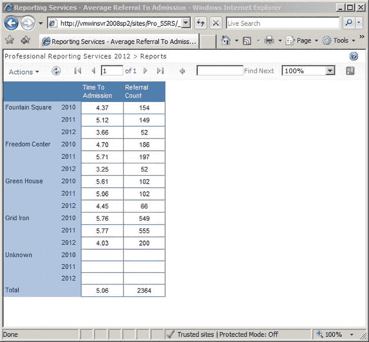
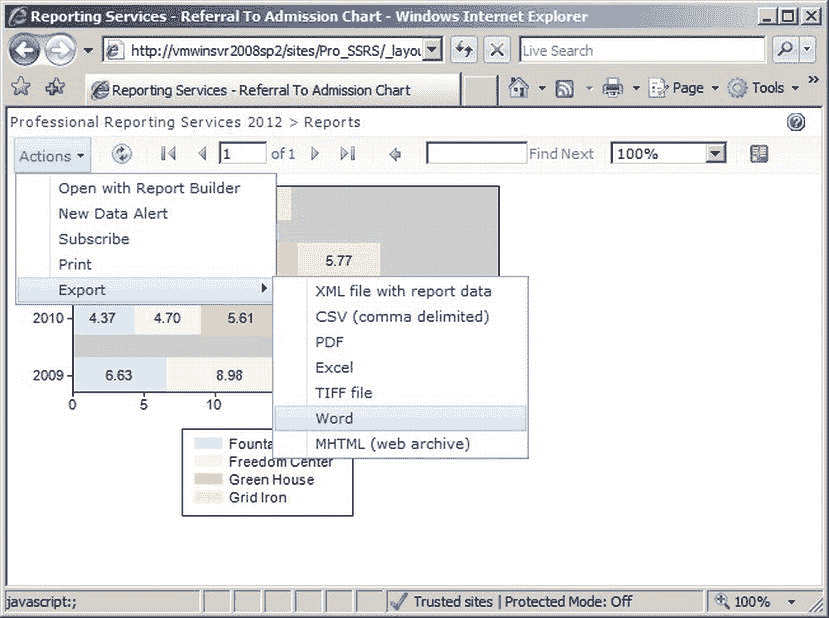
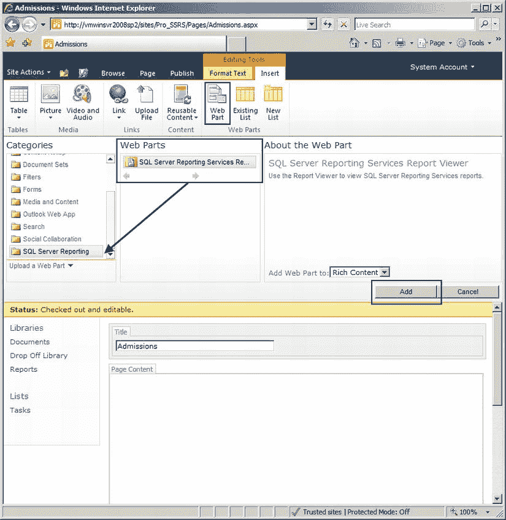
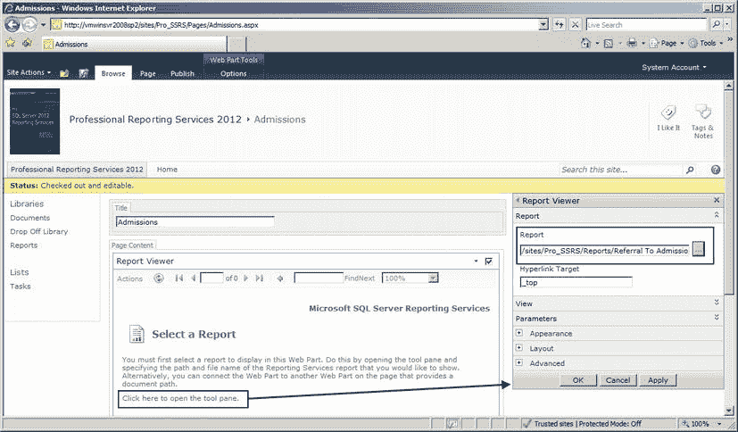
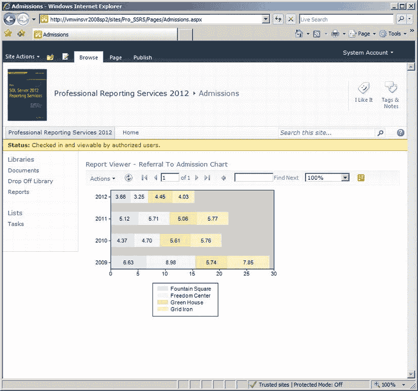
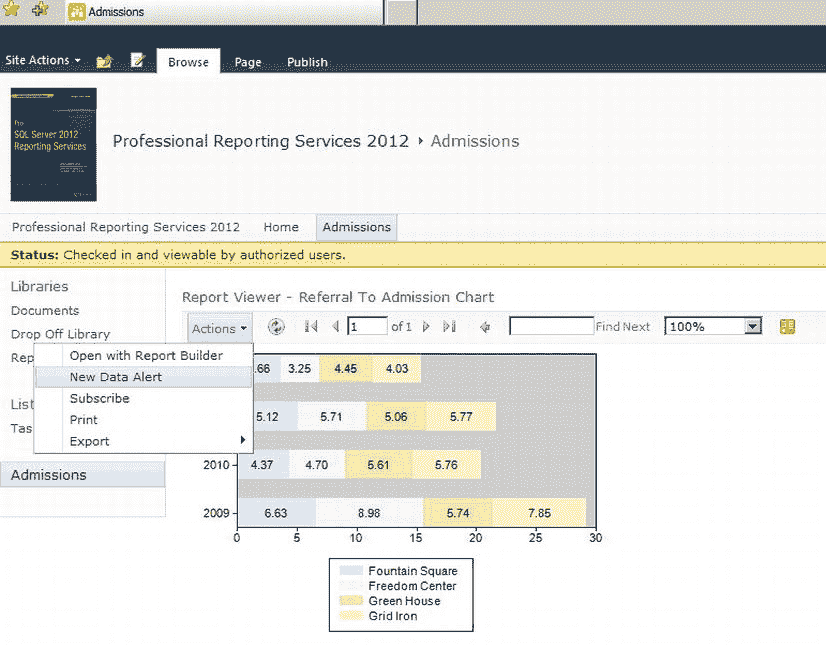
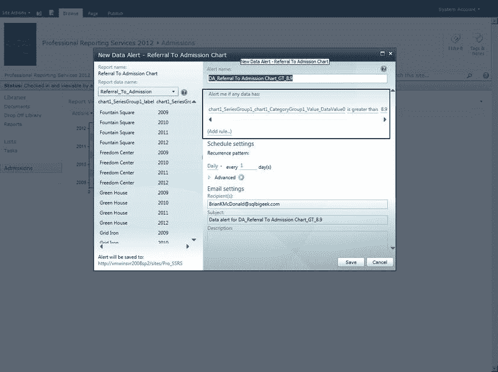

# 第 12 章：将 SSRS 与 SharePoint 集成

在运行报告之前，让我们先将 `PatRef_DS` 数据源更改为使用“存储凭据”，就像我们在第 10 章为“订阅”配置数据源时所做的那样。我们这样做是因为 `SharePoint` 与数据源之间的权限可能与 Windows 身份验证不同。如果您在运行报告时遇到与权限相关的问题，这将是我建议您排查的第一个地方。导航到您在 `SharePoint` 中已部署的数据源，通过点击 `PatRef_DS` 链接，或点击下拉箭头并选择**编辑数据源定义**来修改您的数据源。在“凭据”部分下，选择使用存储凭据的选项。输入有效的用户名和凭据，如图 12-30 所示。如果您使用的是 Windows 凭据，请务必选中**用作 Windows 凭据**选项。点击**测试连接**以确保您输入的凭据有效。如果连接成功建立，则点击**确定**保存您的设置。

`图 12-30. 编辑数据源定义`

接下来，点击报告 **“平均转诊入院率”**。这将在其自己的页面中打开报告并执行它，这与通过 Report Manager 执行的方式非常相似。图 12-31 显示了在 `SharePoint` 中呈现的报告。

`图 12-31. 在 SharePoint 中呈现的报告`

您将在 `BIDS` 中按照与部署 **“平均转诊入院率”** 报告相同的步骤来部署 **“转诊入院率图表”** 报告。过程将是相同的，完成后，您将在 `SharePoint` 网站上看到该报告。导航到报告并点击以执行报告。报告呈现后，点击报告左上角的 **“操作”** 链接按钮，如图 12-32 所示。您可能之前已经注意到这些操作；但请注意报告工具栏中的附加操作，例如**订阅**、**用报表生成器打开**和**导出**。这些操作大多不言自明，但重要的是要认识到，由于我们处于 `SharePoint` 集成模式，我们仍然能够利用诸如订阅和临时报告构建等功能。我们将在下一章介绍 `Report Builder` 应用程序。

`图 12-32. SharePoint 中呈现的报告可用的操作`

## 创建简单仪表板以显示 SSRS 报告

既然您已成功在 `SharePoint` 中部署并呈现报告，并看到了许多可用的属性和操作，我将向您展示如何创建一个仪表板，以在简洁的 Web 部件中呈现报告。您之前安装的 `SQL Server 2012 Reporting Services 插件` 包含了 `SQL Server Reporting Services Report Viewer Web 部件`。创建仪表板非常简单，只需点击网站中的**仪表板**链接，然后在**网站操作**链接按钮下选择**新建页面**选项。您将为新仪表板链接提供一个名称，并根据模板选择初始布局。例如，我选择将仪表板命名为 **“入院”**。仪表板创建后，您可以导航到它并直接在浏览器中编辑其设计。在编辑模式下，点击**插入**选项卡上的**Web 部件**，并从可用的 Web 部件列表中选择 `SQL Server Reporting Services Report Viewer`，如图 12-33 所示。您会在 `SQL Server Reporting` 类别下找到它。选中后，点击**添加**按钮。

`图 12-33. 在 SharePoint 中选择 SQL Server Reporting Services Report Viewer Web 部件`

将 Web 部件添加到 **“入院”** 仪表板后，您将能够对其进行编辑，以指向已部署报告所在的 URL。您可以点击链接打开工具窗格，在其中输入报告 URL。这将把 Web 部件直接链接到报告。您可以在右侧看到 Web 部件和报告选择工具栏。在这种情况下，您将选择 **“转诊入院率图表”** 报告，您可以在图 12-34 中看到。点击**应用**以保存 Web 部件并呈现报告。

`图 12-34. 为 Web 部件选择报告 URL`

最后，您可以在仪表板内包含的 Web 部件中查看呈现的报告。如果您对布局不满意——例如，白色空间过多——您可以通过导航回 Web 部件工具栏并输入您期望的大小设置来调整 Web 部件的大小。图 12-35 显示了在 Web 部件中新部署的 **“转诊入院率图表”** 报告。这个基础报告可以与其他 `SharePoint` 仪表板 Web 部件（如 `KPI` 和 `Excel Web Access Web 部件`）结合使用，为您的组织创建一个吸引人且信息丰富的门户。

`图 12-35. 在 Web 部件仪表板中呈现的报告`

## 创建数据警报

在讨论数据警报功能之前，`SharePoint` 集成模式下的 `SQL Server Reporting Services 2012` 是不完整的。这项出色的新功能使您能够在报告中的数据发生变化或满足某些预定义条件时接收警报。这些预定义条件是在 **“新建数据警报”** 窗口中创建规则时指定的。请按照以下步骤创建新的数据警报：

1.  如果 **“转诊入院率图表”** 报告仍然打开着，请点击**操作**按钮。如果没有，请运行 **“转诊入院率图表”** 报告，如图 12-36 所示。

`图 12-36. 创建数据警报`

2.  在 **“新建数据警报”** 屏幕上，通过为警报命名来配置数据警报。在这种情况下，将其命名为 `DA_Referral to Admission Chart_GT_8.9`，如图 12-37 所示。
3.  接下来，点击**添加规则…**按钮以创建一个规则，该规则声明当**类别组 1**的值大于 `8.9` 时触发。当值超过 `8.9` 时，这将导致 `SQL Server Agent` 发送警报。
4.  将计划设置为每天运行一次。这个计划程序与 Report Manager 提供的非常相似。
5.  输入当值达到所需阈值时要通知的收件人、主题以及任何所需的描述。
6.  点击**保存**按钮，让 `SharePoint` 创建警报。

`图 12-37. 配置数据警报`

现在，如果 `8.9` 的阈值被超过，您将收到一封电子邮件通知，告知阈值已被触及。

## 总结

在本章中，我向您展示了如何将 `SSRS` 纳入 BI 模型，使用一个医疗机构部署自定义 BI 门户的业务模型作为示例。了解如何转换和分析驱动您业务的数据将帮助您做出重要的业务决策。将这些数据传递给决策者是 BI 链条中的关键环节。借助 `SSRS`，微软为组织提供了另一个工具，可以轻松地挖掘并扩展关键数据的触及范围。`SSRS` 利用多种类型的数据，并能以各种格式和机制传递这些数据。通过与微软 BI 平台中的其他应用程序和产品（如 `SharePoint`、`Analysis Services` 和 `Office`）协同工作，`SSRS` 将被证明是现在和未来一个宝贵的 BI 工具。

## 第 13 章

