# 使用 BIDS 2008 R2 创建报表模型

在本节中，你将使用 `BIDS 2008 R2` 创建一个报表模型项目。该项目的完整版本包含在 Apress 网站 ([`www.apress.com`](http://www.apress.com)) 本书的 `Source Code/Download` 区域中。当你打开解决方案时，会注意到一个已创建的名为 `Patient Census Book` 的报表模型。如果你希望将项目中现有的 `Patient Census Book` 报表模型发布到你的 `SSRS` 服务器，并开始使用客户端的 `Report Builder 1.0` 应用程序，只需确保正确设置数据源设置并进行适当部署即可。在这种情况下，直接跳到“使用 Report Builder 1.0 创建报表”一节。若要按照步骤使用 Business Intelligence Development Studio for `SQL Server 2008 R2` 创建报表模型的各个部分，从添加数据源和数据源视图到发布完成的模型，请继续阅读。

在已为 `SQL Server 2008 R2` 安装了 `BIDS` 的计算机上打开 `BIDS`。你可以通过点击 Windows 开始按钮、所有程序、`SQL Server 2008 R2`，然后点击 `SQL Server Business Intelligence Development Studio` 来找到 `BIDS`。启动 `BIDS` 后，点击“创建：”标签旁的 `项目…`。如 图 13-1 所示，你可以使用多个可用的项目模板。选择 `报表模型项目` 模板，将其命名为 `Patient Census`，添加适当的位置（本例中为 `C:\Pro_SSRS Project_2008R2\`），然后点击确定。

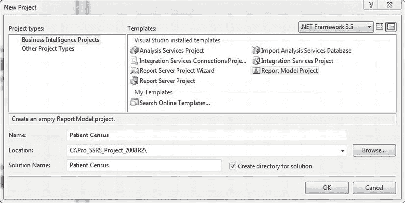

**图 13-1.** 创建新的报表模型项目

一个报表模型项目有三个主要组件：数据源、数据源视图和报表模型，每一个都依赖于前一个。换句话说，数据源视图需要数据源，同样，报表模型需要数据源视图。如果你已成功创建了 `Patient Census` 报表模型项目，你将看到这三个组件，如 图 13-2 所示。

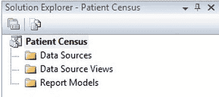

**图 13-2.** 查看新的 `Patient Census` 报表模型

## 添加数据源

从逻辑上讲，第一步是创建数据源。在我们创建连接到 `SQL Server 2008 R2` 机器的数据源之前，你需要按照 Apress 网站 ([`www.apress.com`](http://www.apress.com)) 本书 `Source Code/Download` 区域中提供的 `ReadMe.txt` 文件中的说明还原 `Pro_SSRS_2008R2` 数据库。在你设置好 `Pro_SSRS_2008R2` 数据库后，我们需要为我们的模型创建一个数据源。在 `解决方案资源管理器` 中右键单击 `数据源` 文件夹，并在 `添加` 菜单下选择 `新建数据源`。这将打开 `数据源向导`，为报表模型创建数据源。图 13-3 显示了 `数据源向导` 的第一页。幸运的是，你可以通过勾选 `不再显示此页` 来选择不在每次打开向导时显示第一页。

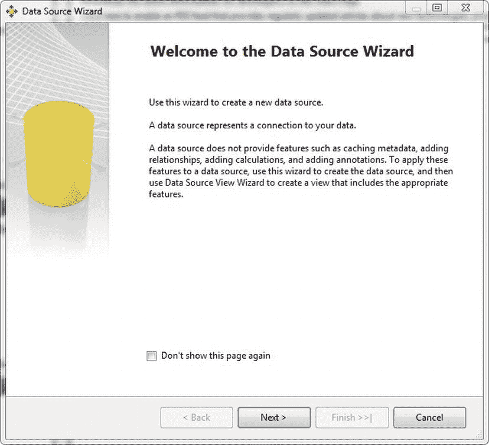

**图 13-3.** 使用 `数据源向导`

如 图 13-4 所示，在通过向导创建数据源时，你有两个选项。你可以基于现有或新建的连接创建一个新的数据源，也可以基于另一个对象（如另一个项目中已定义的数据源）创建数据源。对于本例，选择基于新连接创建新数据源，并点击 `新建` 打开 `连接管理器`。

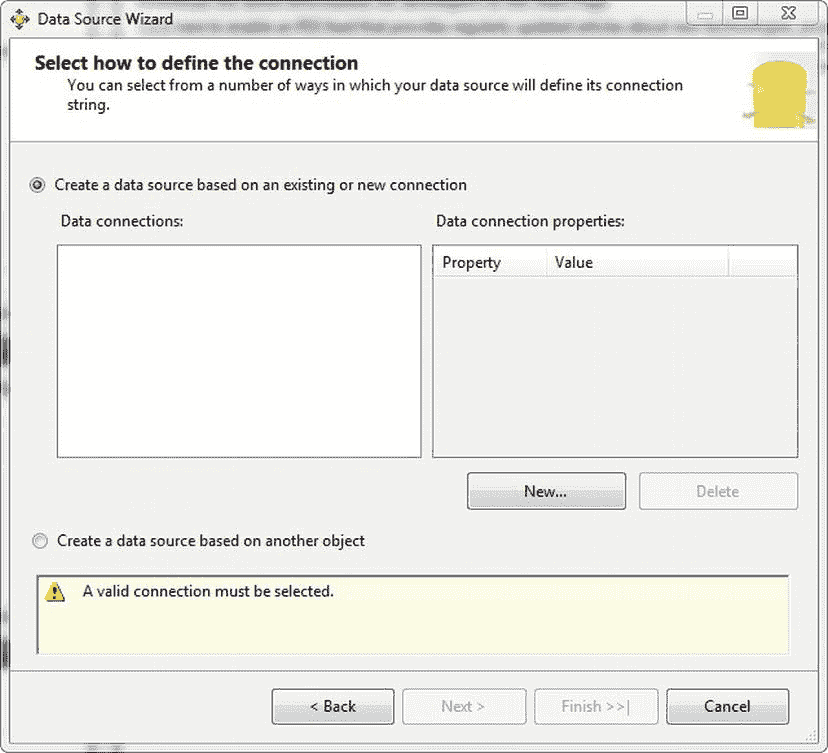

**图 13-4.** 定义连接

在 `连接管理器` 中，选择 `localhost` 作为服务器名称，保持 `使用 Windows 身份验证` 按钮为勾选状态，并将数据库名称更改为 `Pro_SSRS_2008R2`，如 图 13-5 所示。点击 `确定` 保存设置并返回到 `数据源向导`。点击 `下一步` 或 `完成` 进入向导的最终屏幕，保留默认的数据源名称 `Pro SSRS 2008R2`，然后点击 `完成` 以创建数据源。

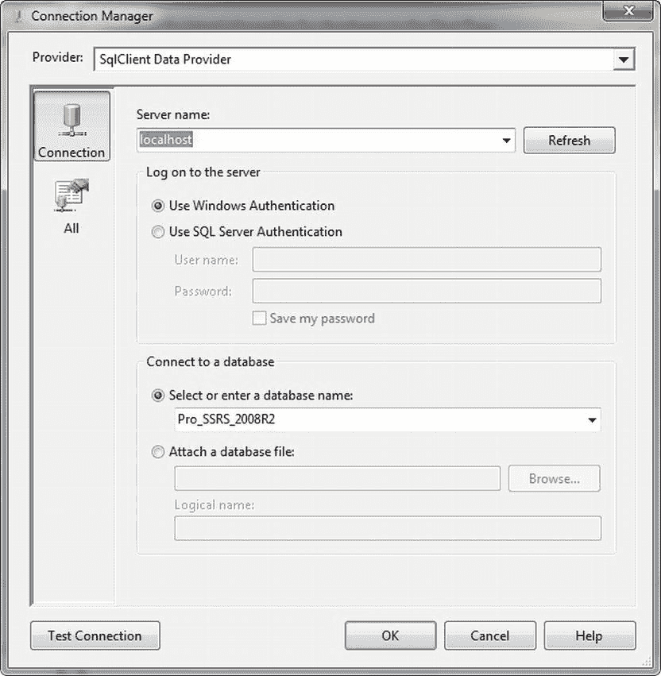

**图 13-5.** 设置服务器名称和数据库

 **注意** `Pro_SSRS_2008R2` 数据库是我们整本书中一直在使用的 `Pro_SSRS` 数据库的一个版本。然而，由于报表模型在 `SQL Server 2012` 中已被弃用，我们创建了一个具有有限对象的 `2008 R2` 版本的数据库。`Pro_SSRS_2008R2` 数据库和脚本可以在 Apress 网站 ([`www.apress.com`](http://www.apress.com)) 本书的 `Source Code/Download` 区域中找到。有关此数据库的更多详细信息，请务必阅读 `Source Code/Download` 文件中的 `ReadMe.txt` 文件。


## 创建数据源视图

你通过关系型数据源为报表模型项目创建数据源视图，其中有一组可以通过连接来构成数据源视图基础的表。在 `Pro_SSRS_2008R2` 数据库中，你知道许多相关的表是通过列 ID 字段连接的；例如，`Admissions`（入院）表通过 `PatID` 字段连接到 `Patient`（患者）表。这两个表中的字段可能都与设计报表的用户相关；然而，多余的数据可能只会让用户感到困惑。作为报表建模者，你的部分工作是简化架构的复杂性，同时提供一个包含直观或“友好”名称并且只提供有用数据的模型。为什么你要使用 `Dscr` 来表示诊断代码，而实际上你应该直接将其命名为 Diagnosis Name（诊断名称）呢？既然也可以向数据源视图添加由自定义查询派生出的表（即衍生表），你将能更好地控制创建自定义数据源视图，并省去大量移除你所使用的所有表中包含的无关字段的工作。随着你逐步完成这个过程，这一点会变得更加明显。现在，我们将展示如何执行以下逻辑步骤，以保持数据源视图及后续模型的简单高效：

> *   为数据源视图构建一个查询，而不是使用多个表
> *   根据报表设计者的请求，只选择相关且可能有用的字段
> *   为数据源视图字段和值使用友好的名称

创建视图的第一步，与创建数据源类似，是通过右键单击 `数据源视图` 文件夹并选择 `添加新数据源` 来打开向导。点击 `下一步` 进入向导的下一个屏幕，你将看到如 图 13-6 所示的界面。

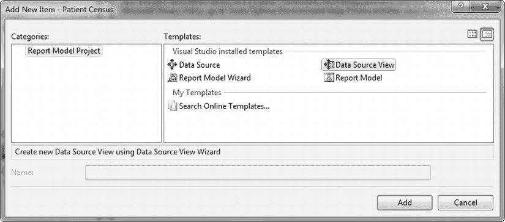

***图 13-6.** 向项目添加数据源视图*

在向导的第一页（不是欢迎页，在欢迎页上你应该立即勾选 `不再显示此页`），选择你之前创建的 `Pro_SSRS_2008R2` 数据源，然后点击 `下一步` 转到 `选择表和视图` 页面。如你在 图 13-7 所见，你可以从许多表中选择。

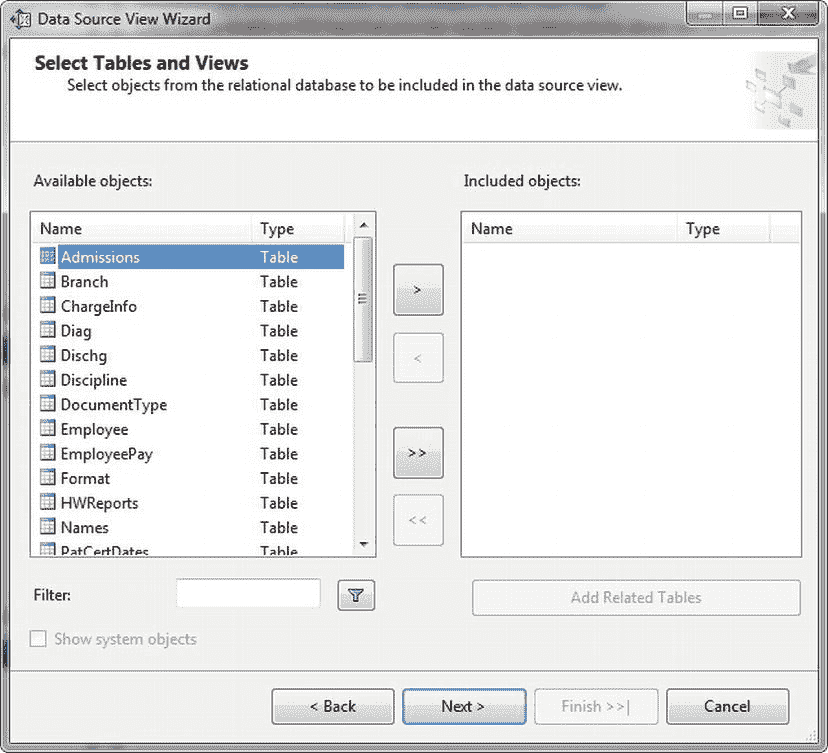

***图 13-7.** `Pro_SSRS_2008R2` 数据源中的相关表*

你可以从你计划创建的患者统计报表所需的表列表中添加所有表；然而，考虑到你会有太多不必要的字段需要处理，不如直接选择 `下一步`，然后点击 `完成` 来关闭向导，而不包含任何对象。这将创建一个未定义任何表的 `Pro SSRS 2008R2` 数据源视图。你可能会问，既然这看起来是个疯狂的方式，为什么你不选择任何关系对象？原因在于，你将添加自己的单个对象，称为 `命名查询`，它类似于 SQL Server 数据库中的视图。这是一个从其他对象查询派生出的对象。假设你选择了一个或多个表，你将会基于主键（如果存在）或使用相关的列 ID 值图形化地定义这些表之间的关系，而这些表将成为报表模型的数据源。无论你是使用带有关系的真实表对象，还是使用只包含你所需字段的 `命名查询` 表，最终结果是相同的。区别在于，通过这种方式，你可以获得一个简单明了的表的好处，而不是使用许多表，并可能带来添加超出模型所需更多数据的潜在缺点。

一旦创建了数据源视图（默认名称基于数据源为 `Pro SSRS 2008R2`），你可以在设计环境中双击打开它。它看起来会是空的，这很正常。你可以通过点击工具栏上的 `新建命名查询` 按钮来添加源查询，或者更准确地说，添加 `命名查询`，如 图 13-8 所示。

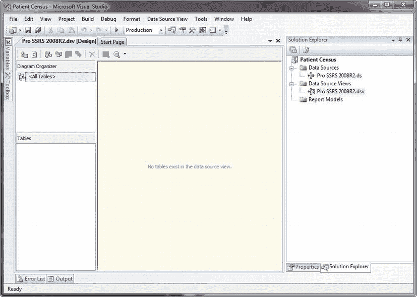

***图 13-8.** Pro SSRS 数据源视图*

在这种情况下，你已经设计好了查询；不过，报表生成器 1.0 包含了它自己的图形化查询生成器，因此可以说，你可以即时开发查询。图形化查询设计器是标准的，包含标准的关系图窗格、网格窗格、SQL 窗格和结果窗格。点击 `新建命名查询` 按钮会打开 `创建命名查询` 窗口。在 SQL 窗格中，我们可以粘贴来自 清单 13-1 的预先存在的 `患者统计` 查询，并在空白的关系图窗格中点击以自动加载查询的图形化表示。如果你需要为任何字段提供别名，例如区分员工表和患者表中常见的 `LastName` 字段，你可以在网格窗格中完成，如 图 13-9 所示，该图还显示了查询和所有连接的表。为 `lastname` 字段设置别名：患者表为 `Pat_LastName`，员工表为 `Emp_LastName`。否则，如果对 `lastname` 有共同的引用，默认的别名将是 `ExprX`，其中 `X` 是共同引用的数量。你也可以对无处不在的 `DSCR`（用于描述，如在 `Diag` 和 `PatEMR` 表中）进行同样的操作。我们还为每个表创建了别名。这减少了输入量，并使 SQL 更容易理解。你可以在 SQL 代码部分为表名设置别名，也可以通过右键单击每个表的标题部分并选择 `属性` 来设置。你可以在属性窗口的 `别名` 部分输入别名。

 **注意** 为了减少你的输入工作，我们已将此查询包含在本书源代码的一个名为 `Patient Census Query – Chapter 13.sql` 的文件中。当然，如果你真的喜欢打字，请随意编写 清单 13-1 中提供的 SQL 语句。

***清单 13-1.** 患者统计查询*

```sql
SELECT   
    A.PatProgramID
    , E.EmployeeID
    , E.LastName AS Emp_LastName
    , E.FirstName AS Emp_Firstname
    , D2.Dscr AS Discipline
    , B.BranchName
    , P.PatID
    , P.LastName AS Pat_LastName
    , P.FirstName AS Pat_FirstName
    , D.DiagID
    , D.Dscr AS Diagnosis
    , PD.DiagOnset
    , PD.DiagOrder
    , A.StartOfCare
    , A.DischargeDate
    , P.MI
    , P.Address1
    , P.Address2
    , P.City
    , P.HomePhone
    , P.Zip
    , P.State
    , P.WorkPhone
    , P.DOB
    , P.SSN
    , P.Sex
    , P.RaceID
    , P.MaritalStatusID
    , EMR.DateEntered
    , EMR.Dscr AS EMR_Document
    , DS.Dscr AS [Discharge Reason]
    , DATEDIFF(dd, A.StartOfCare, A.DischargeDate) + 1 AS [Length of Stay]
FROM       
    Admissions AS A
    INNER JOIN Patient AS P ON A.PatID = P.PatID
    INNER JOIN Branch AS B ON B.BranchID = P.OrigBranchID
    LEFT OUTER JOIN PatDiag AS PD ON A.PatProgramID = PD.PatProgramID
    INNER JOIN Diag AS D ON PD.DiagTblID = D.DiagTblID
    LEFT OUTER JOIN Employee AS E ON A.EmployeeTblID = E.EmployeeTblID
    LEFT OUTER JOIN Discipline AS D2 ON D2.DisciplineTblID = E.DisciplineTblID
    LEFT OUTER JOIN PatEMRDoc AS EMR ON A.PatProgramID = EMR.PatProgramID
    LEFT OUTER JOIN DocumentImage AS DI ON DI.DocumentImageID = EMR.DocumentImageID
    LEFT OUTER JOIN Dischg AS DS ON A.DischargeTblID = DS.DischgTblID
WHERE   
    (PD.DiagOrder = 1)
```

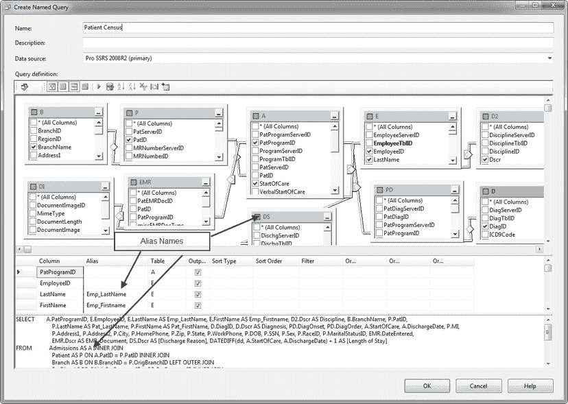

***图 13-9.** 带别名显示的图形化 `命名查询`*

最后，将查询命名为`患者普查`。当你点击`确定`完成命名查询时，你的简单数据源视图就由一个对象组成，即`患者普查`，它包含了模型所需的字段。你可以在图 13-10 中看到，共有 32 个字段将提供给模型。

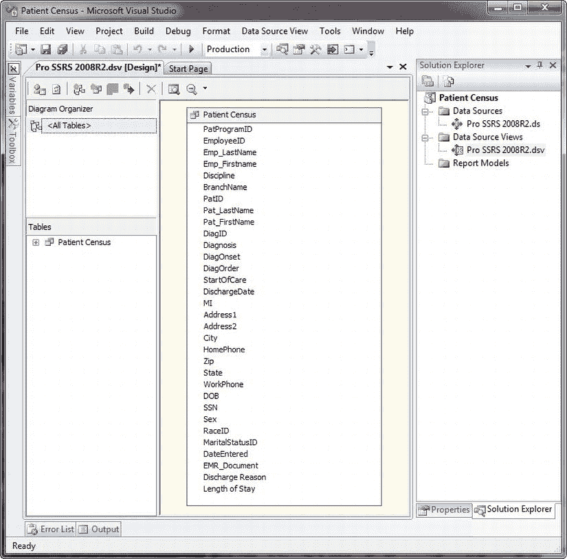

*图 13-10. 包含一个对象的数据源视图*

流程中的下一步是为`患者普查`命名查询添加一个逻辑主键，因为报表建模器在生成模型时需要一个主键。由于该查询是从`入院`表驱动的，该表包含你知道将具有唯一值的`PatProgramID`字段，因此你可以使用此字段作为`患者普查`查询的逻辑主键。在示例数据库中，`PatProgramID`字段控制着患者随时间推移的入院和出院记录。通常，同一个患者可能会被收入两条不同的服务线，即所谓的`程序`；因此，你有了`PatProgramID`。如果没有`PatProgramID`字段，仅凭患者的识别号码`PatID`，记录将不是唯一的。

要将`患者普查`对象的逻辑主键设置为`PatProgramID`，只需在`表`列表或`患者普查`图中右键单击`PatProgramID`字段，然后选择`设置逻辑主键`，如图 13-11 所示。执行此操作后，你会看到一个类似钥匙的图标出现在`PatProgramID`字段旁边。

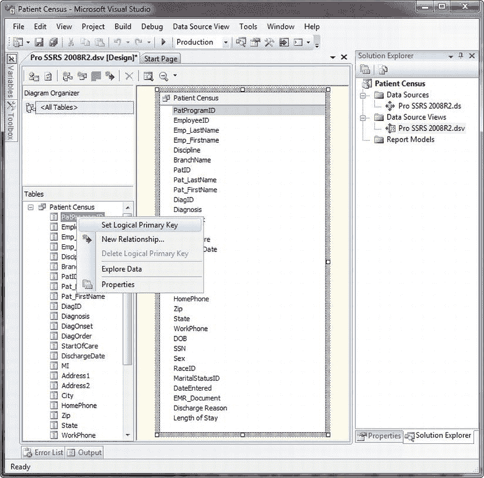

*图 13-11. 设置逻辑主键*

此时，你可以保存数据源视图，然后创建报表模型。但在这样做之前，让我们先看一下设计环境中一个非常棒的功能：探索数据的能力。在`患者普查`对象中的任意位置——例如在`EmployeeID`上——右键单击并选择`探索数据`。如你所见，从整个`患者普查`对象返回了许多记录，你将在稍后创建的报表中使用这些数据。然而，也请注意`表`旁边的三个额外选项卡，如图 13-12 所示。`数据透视表`、`图表`和`数据透视图`选项卡突然出现，就像在海滩上意外发现一个非常珍贵的海螺贝壳一样。（虽然这对开发报表模型可能没有太大帮助，但我们觉得值得展示一下。）

既然你已经确定`患者普查`数据源视图按预期返回了数据，你将保存它并转向`Report Builder 1.0`的真正核心——报表模型。

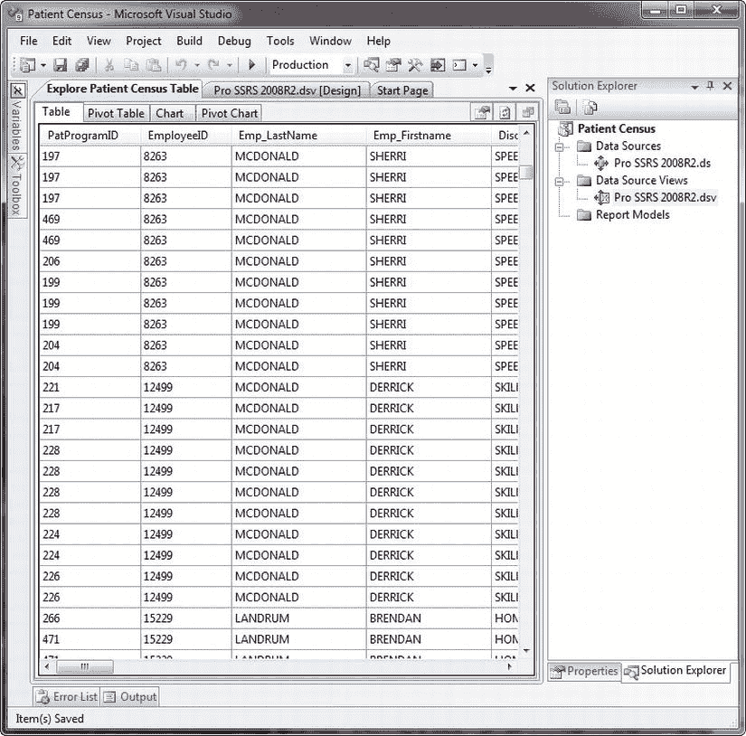

*图 13-12. 探索数据时出现的额外选项卡*

## 创建报表模型

报表模型将在报表设计者与底层数据源之间增加一个分离层，通过允许他们专注于报表设计而非查询设计来简化报表设计过程。现在你已经有了构建报表模型所需的数据源视图，你将学习如何创建模型。这个过程是直截了当的，这要归功于自动分析数据源视图的自动生成方法，它经过两遍分析并产生最终结果——一个可发布的报表模型，其构成元素原本需要花费大量时间和精力来制作，你将会看到。本节的目标是引导你完成向导，这样你就可以关注生成方法，并最终将你完成的模型部署到`SSRS`服务器。

你将再次使用右键单击过程，从`解决方案资源管理器`中的`报表模型`文件夹启动`报表模型向导`。在导航通过第一个欢迎页面到达`选择数据源视图`页面后，你会看到`Pro SSRS 2008R2`数据源视图的选择，如图 13-13 所示。

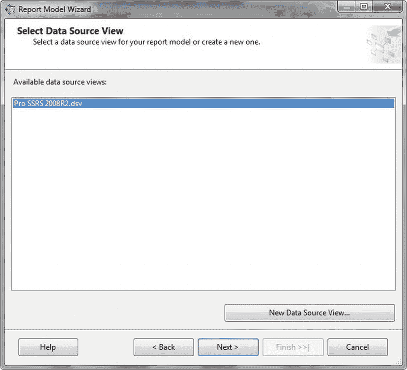

*图 13-13. 选择数据源视图*

选择`Pro SSRS`后，单击`下一步`，你现在可以选择报表模型生成规则。你将看到一组将在数据源视图上执行的规则。存在多条规则，大多数默认是选中的。许多规则是自解释的；然而，有两条默认未选中：`为非空表创建实体`和`为非空列创建属性`。这两条规则指示生成过程仅为包含数据的表创建实体和属性。实体是报表模型中表的等价物，属性在概念上是实体内定义的字段或列。

以下是生成模型第一遍的所有规则，在`报表模型向导`中可选：

*   为所有表创建实体
*   为非空表创建实体
*   创建计数聚合
*   创建属性
*   为非空列创建属性
*   为自动递增列创建属性
*   创建日期变体
*   创建数值聚合
*   创建日期聚合
*   创建时间聚合
*   创建角色

这一遍处理从`创建角色`之前的所有规则。你还会看到每条规则的有用描述，如图 13-14 所示。

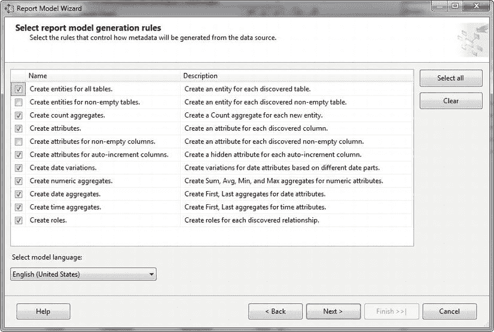

*图 13-14. 带有描述的模型生成规则*

对于此示例，请保留默认选择，因为这些选择将为你提供诸如为任何数字和日期自动聚合等功能，并创建日期变体，这样对于数据源视图中的每个`日期时间`数据类型，你都将创建`日`、`月`和`年`。你可以单击`下一步`，选择在生成前更新统计信息，如图 13-15 所示。如果源表中的任何数据发生了显著变化，这一点很重要。

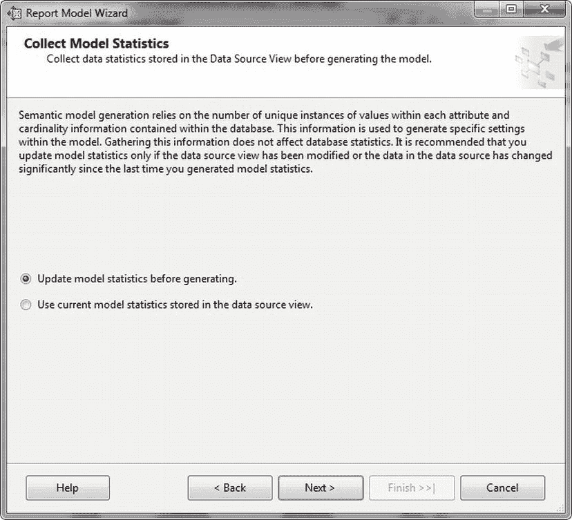

*图 13-15. 更新统计信息页面*


