# 在向导的下一页中

在向导的下一页中，将模型命名为 `Patient Census`，并选择 `Run` 以开始生成模型的规则。图 13-16 展示了点击 `Run` 后的输出，此时进程已成功完成。你可以在每个规则级别上查看详细信息，了解该规则基于数据源视图中的数据具体执行了什么操作。请注意，例如对于 `Create Date Variations` 规则，它发现并创建了 `DiagOnset` 的日期，这是患者被诊断出疾病的日期。其他创建的属性包括 `Length of Stay` 列的 `Sum`、`Avg`、`Min` 和 `Max`。住院时长（通常是平均值）是指患者入住长期医疗机构到出院之间的时间间隔。`DateDiff` 函数用于计算住院时长。

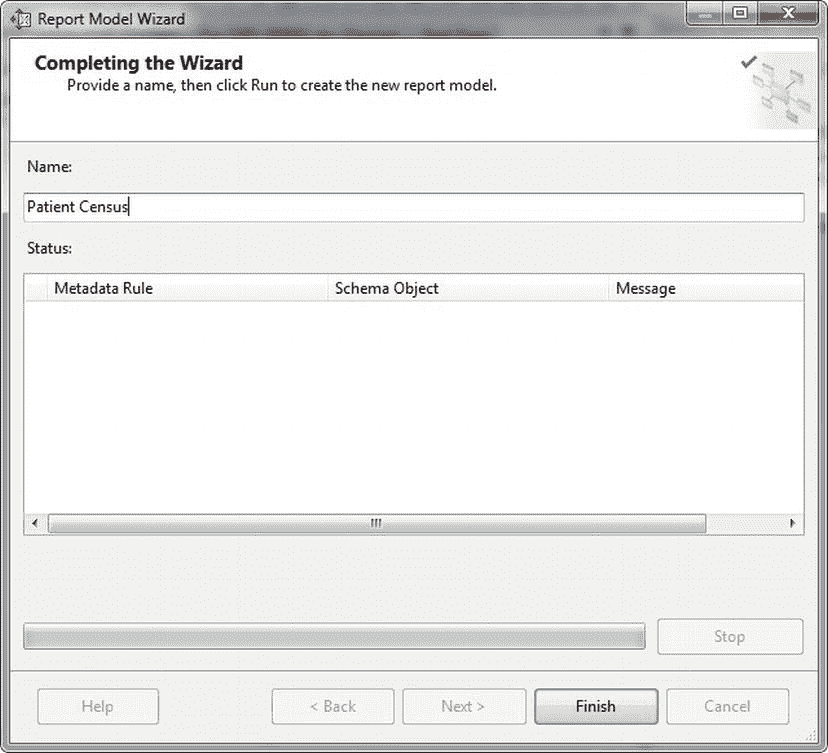

**图 13-16.** 规则成功完成

在 `Report Model Wizard` 中点击 `Finish` 后，你可以看到具有预期属性的 `Patient Census` 模型已被创建。此时，你可以直接通过右键单击 `Solution Explorer` 中的模型并选择 `Deploy` 来将模型部署到报表服务器。你可以通过点击工具栏上 `Project` 下的 `Project Properties` 来控制模型部署的位置，如 图 13-17 所示，在项目属性页中进行设置。在本例中，项目将部署到报表服务器上的 `Models` 文件夹，其目标服务器 URL 为 `http://localhost/ReportServer`。模型的数据源将发布在 `Data Sources` 文件夹中。

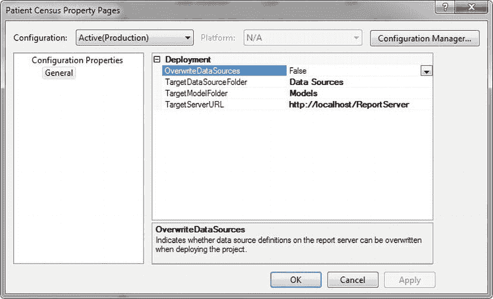

**图 13-17.** 报表模型的项目属性

 **注意** 我们应当提及，报表模型是使用语义模型定义语言（`SDML`）创建的，这是一种类似于 `RDL` 的 XML 风格语法。`RDL` 定义报表和报表属性，而 `SMDL` 定义模型对象，例如你在此处创建的实体和属性。

部署模型后，你可以在 `Report Manager` 中看到创建的两个文件夹：`Data Sources` 和 `Models`。`Data Sources` 文件夹包含 `Pro_SSRS_2008R2` 数据源，而 `Models` 文件夹则存放着 `Patient Census` 报表模型。图 13-18 显示了 `Patient Census` 报表模型的属性。与标准数据源一样，可以查看哪些报表是使用该模型创建的。

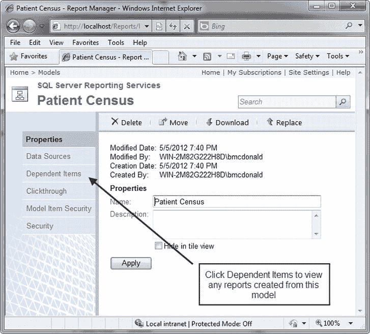

**图 13-18.** Patient Census 报表模型属性

在开始使用 `Report Builder 1.0` 创建报表之前，必须注意需要使用 `Report Builder 1.0` 权限的用户，必须被分配项目级角色，以执行与使用 `Report Builder 1.0` 创建报表相关的各种任务。`Reporting Services` 包含一个 `Report Builder 1.0` 角色用于此目的，如 图 13-19 所示。分配给 `Report Builder 1.0` 角色的用户拥有访问报表模型、文件夹和已发布报表所需的所有权限。但是，要发布报表，他们还需要具备管理报表内容的能力，才能成功地将报表发布到报表服务器。`Content Manager` 角色拥有完整报表创建和发布功能所需的所有权限。

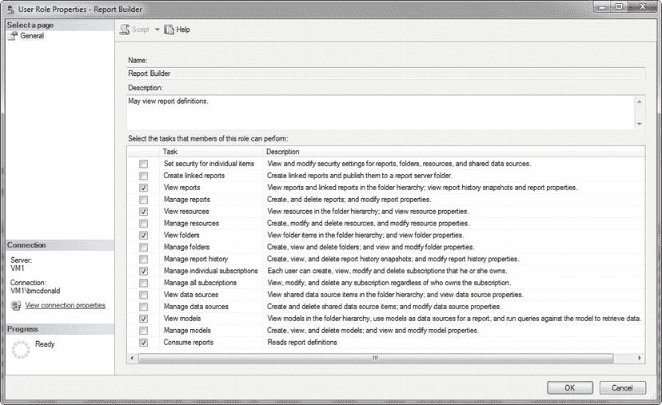

**图 13-19.** SSRS 报表生成器角色

 **注意** 要管理 `SQL Server Reporting Services 2008 R2` 中的角色，我们必须以管理员身份运行 `SQL Server Management Studio` 来连接到 `Reporting Services` 实例。有关连接到 `Reporting Services` 实例和角色的更多详细信息，请参见 第 11 章 的“介绍 SSRS 角色”部分。

## 使用 Report Builder 1.0 创建报表

至此，你已创建了使用 `Report Builder 1.0` 所需的所有部分——你已经创建了报表模型 `Patient Census` 并将其部署到了报表服务器。它现在正等待作为前端 `Report Builder 1.0` 应用程序的数据源。`Report Builder 1.0` 提供了一些与报表开发环境（如 `BIDS` 或 `Visual Studio`）相同的功能，包括能够将数据元素拖放到设计区域，并使用 `Matrix`、`Table` 和 `Chart` 数据区域，以及将完成的报表部署到报表服务器的能力。然而，在深入之前，我们需要说明 `Report Builder 1.0` 的目的是允许最终用户设计自己的报表。它被设计得直观且友好，而且由于它不是一个功能齐全的 `IDE`，起初可能显得功能有限。

在本节中，你将探索 `Report Builder 1.0`，并发现报表设计人员可用的功能，例如添加函数（类似于在 `BIDS` 中添加表达式），以及提供筛选、分组和排序功能。本节的目标是向你展示如何根据本章前面创建的 `Patient Census` 模型，逐步创建和部署所需的普查报表。

当为 `SQL Server 2008 R2` 安装 `Reporting Services` 时，默认的 `Report Builder` 应用程序是 `3.0`。如果你要跟随操作或想使用 `Report Builder 1.0` 创建报表，你将需要直接导航到 `Report Builder` 的 URL，或者在 `Report Manager` 的 `Site Settings` 部分更改默认的 `Custom Report Builder` 启动 `URL`。你可以在 `Program Files\Microsoft SQL Server\MSRS10_50.MSSQLSERVER\Reporting Services\ReportServer\ReportBuilder` 文件夹下找到报表生成器应用程序。为了跟随操作，我们将把 `Report Manager` 中的启动 `URL` 设置为使用 `Report Builder 1.0`。为此，通过导航到 `http://ServerName/Reports` 打开 `Report Manager`。打开 `Report Manager` 后，点击右上角的 `Site Settings` 链接。将启动 `URL` 设置为：
`http://localhost/ReportServer/ReportBuilder/ReportBuilder.application`

更改默认的 `Report Builder` `URL` 后，现在让我们使用它。点击 `Apply` 保存更改，并导航到 `Report Manager` 主页。在主页上，你应该会在 `Report Manager` 的主工具栏上看到 `Report Builder` 图标，如 图 13-20 所示。点击 `Report Builder` 按钮，如果尚未安装，则初始化 `Report Builder 1.0` 的安装；如果已安装，则打开该应用程序。

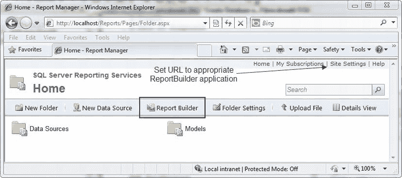

**图 13-20.** 带有报表生成器按钮的 Report Manager 主工具栏

 **注意** 如前所述，也可以直接从 `ReportServer` `URL`（例如 `https://mySSRSserver/ReportServer/ReportBuilder/ReportBuilder.application`）启动 `Report Builder 1.0`。

`Report Builder 1.0` 使用 `ClickOnce` 技术从网站安装自身。代码从浏览器下载并安装到本地计算机，假设没有缺失先决条件的问题，其中之一是 `.NET Framework 2.0`。如果未安装，它将发出警告消息，指出 `Report Builder 1.0` 需要 `.NET Framework 2.0` 才能安装。如果满足所有要求，`Report Builder 1.0` 将启动并完成安装。图 13-21 显示了 `ClickOnce` 应用程序安装屏幕。

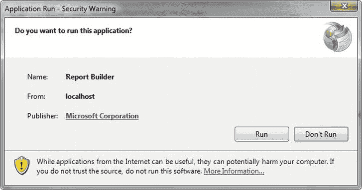

**图 13-21.** Report Builder 1.0 安装进度


安装完 Report Builder 1.0 后，它会自动启动。设计报表的第一步是选择数据源，如 图 13-22 所示。数据源将是一个报表模型，在本例中是你已发布的 `Patient Census` 报表模型。因此，选中它并单击“确定”继续。

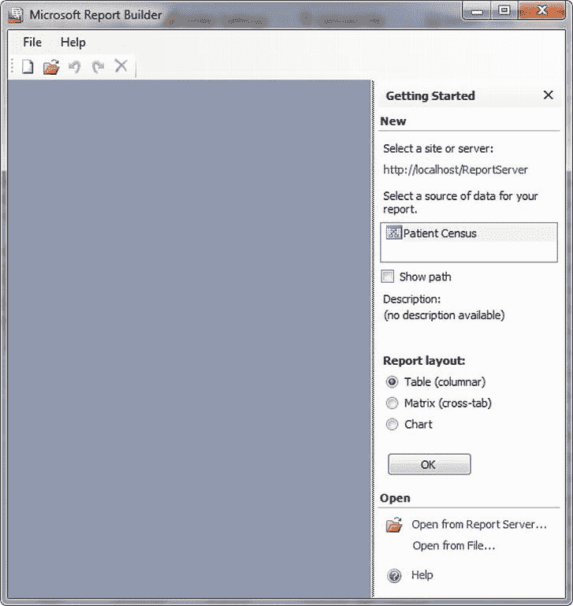

**图 13-22.** 选择报表模型

乍一看，很容易发现 `Report Builder 1.0` 在外观和感觉上类似于 Office 2007 套件中的其他 Microsoft 设计产品，例如 `FrontPage`。你会看到一个简单的设计区域、一个 `报表数据`区域，以及一个包含可用于每个报表的模板的 `报表布局`区域。三个可用模板是 `SSRS` 报表中可用数据区域的熟悉版本：`表格`、`矩阵` 和 `图表`。每个模板都有预定义的区域，例如标题、总计列和筛选器描述列，如 图 13-23 中的表格报表所示。你还可以在左侧的 `报表数据` 选项卡中看到 `Patient Census` 报表模型的字段。

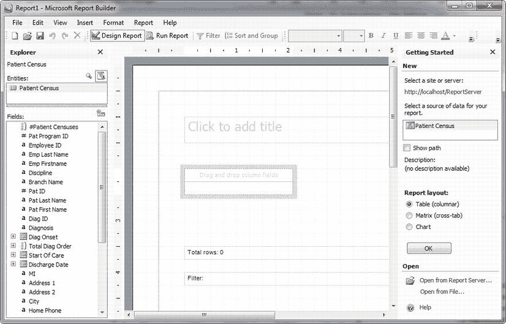

**图 13-23.** Report Builder 1.0 中的表格报表模板

### 创建表格报表

为了满足用户反馈中收到的许多报表请求，你可以使用表格报表。需要注意的一点，可能属于 `Report Builder 1.0` 的一个限制是，每个报表只能使用一个数据区域。换句话说，与 `BIDS` 的完整 IDE 不同，使用 `Report Builder 1.0` 构建报表的用户每个报表仅限于一个 `表格`、`矩阵` 或 `图表` 数据区域。你无法添加第二个数据区域。实际上，报表不仅限于单个数据区域，而且被限制为使用为每个模板定义的控件。例如，无法添加文本框或除字段数据之外的任何其他类型的设计元素。

你将在此限制下制作你的第一份报表，即 *患者信息概览表*（通常如此称呼），它显示每位患者的人口统计信息。在表格报表仍打开的情况下，你将把几个字段拖到表格上显示 `拖放列字段` 的位置，使报表看起来像 图 13-24。接下来，按住键盘上的 `CTRL` 键，同时选择 `Pat ID`、`Pat First Name`、`Pat Last Name`、`Diagnosis`、`Start Of Care`、`Address 1`、`City`、`State` 和 `Zip`。全部选中后，将它们拖到报表表格中 `Pat ID` 的右侧。通过像我们这里这样按住 `CTRL` 键，我们创建了一个 `Patient Census` 列名组。此时，你还可以在 `单击添加标题` 文本框中添加一个标题。将标题更改为 `患者信息概览表` 并将其设为粗体。另请注意，当添加字段时，例如 `Pat Last Name`，它们会在左侧的 `字段` 选项卡中显示为粗体，表示它们已被使用。

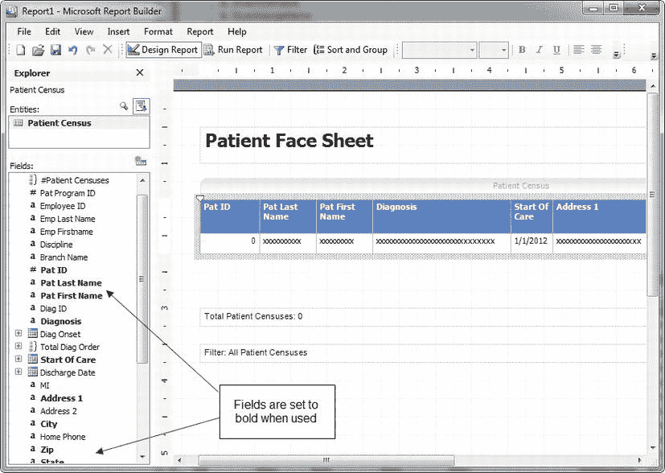

**图 13-24.** 包含患者信息的表格报表

将所有字段添加到报表后，你可以单击 `运行报表` 来预览报表；但是，此时必须执行一些任务以使报表适应打印页面。在其默认页面设置中，报表设置为 `纵向`；但是，你添加的字段横向延伸超过了 8.5 英寸。要解决此问题，请在设计区域中右键单击，然后选择 `页面设置`，此时会出现 `页面设置` 对话框，如 图 13-25 所示。将 `方向` 属性设置为 `横向`，然后将所有 `页边距` 设置为 0，再单击“确定”。

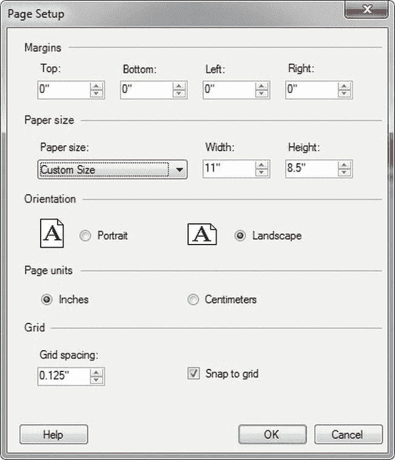

**图 13-25.** 设置页面方向

为了腾出更多空间，你可以使用公式组合患者的姓氏和名字。为此，只需右键单击 `Pat First Name` 数据单元格，然后选择 `编辑公式`。这将打开 `定义公式` 窗口。`Report Builder 1.0` 中的公式类似于 `BIDS` 中的表达式。在这里，你可以组合报表字段和内置函数以生成所需的值。图 13-26 显示了 `定义公式` 对话框，其中列出了几个可用函数。请注意用于连接 `Pat First Name` 和 `Pat Last Name` 字段的公式，它使用报表数据字段和一个与号 (`&`) 添加一个逗号字符字面量来分隔姓名。你还可以使用 `RTRIM` 函数删除尾随空格。你本可以在报表模型中完成大部分这项工作，这很可能也是应该做的。然而，我们让你保留姓名以这种方式，是为了现在演示一个简单公式的使用。

```
Pat First Name + ', ' + RTRIM(Pat Last Name)
```

公式就位后，单击 `将此公式另存为新的 Patient Census 字段`，然后单击“确定”。然后系统会提示你输入 `新字段名称`。将此字段命名为 `患者姓名`，然后单击“确定”保存新字段。

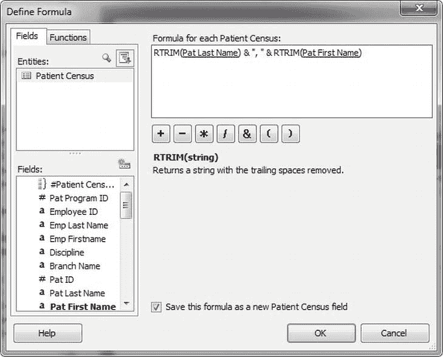

**图 13-26.** 定义公式窗口


