# 报告设计步骤

## 布局调整

现在你已经合并了患者的全名，可以通过点击数据单元格并按`Delete`键来删除“Pat Last Name”字段。在预览报告之前，还有一些其他任务需要完成。

首先是将“Zip”列移动到“State”列的右侧。只需点击包含“Zip”的单元格，并将其拖到“State”列的右侧即可。

接下来，调整字段大小，使每条记录都能在一行内显示。在用于报告的字段中，“Diagnosis”和“Address”字段可能是最大的，因为它们是可变长度字段，通常包含 20 到 50 个字符。然而，由于我们希望每列的标题显示在一行上，因此也需要调整“Start of Care”字段的大小。

在此示例中，将“Pat ID”字段调整到约 0.5 英寸，将“Diagnosis”、“Start of Care”和“Address 1”字段扩展到约 1.5 英寸，然后预览报告，如`Figure 13-27`所示。代表数据的`x`字符数量将与数据库字段中最大值中的字符数量一样多，这使得确定如何调整每列大小变得容易。

“Address”字段显示为`NA`的原因是，这些信息要么是经过混淆处理（例如患者姓名），要么被修改为`NA`以移除可识别信息。

另请注意，在`Figure 13-27`中，每个字段在列标题级别自动包含一个交互式排序图标。尽管点击图标会重新渲染报告，但在你配置排序之前，实际上不会执行任何排序操作。下一步我们将进行配置。

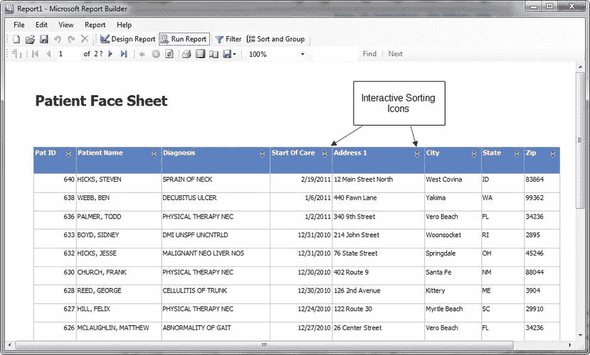

**Figure 13-27.** 预览患者情况表报告

## 排序与分组

点击工具栏上的“Design Report”按钮返回报告的设计区域。接下来，右键单击“Pat ID”数据单元格，然后在工具栏上选择“Sort and Group”。这将打开“Sort”对话框。选中“Patient Census”组，选择首先按“Pat ID”排序，然后按“Patient Name”排序，最后按“Diagnosis”排序，如`Figure 13-28`所示。你还可以选择在每个组后添加分页符作为组选项。此时请不要添加分页符。单击“OK”后，你可以预览报告，并看到每个定义列的排序工作正常。

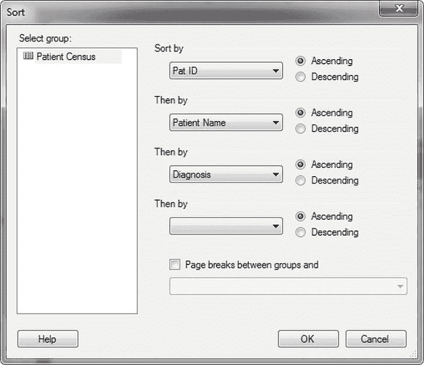

**Figure 13-28.** 排序和分组选项

关于将字段拖到报告的表区域，我们还需要提及一点：分组会自动从左到右定义。换句话说，将字段拖放到另一个字段的右侧会将该字段保留在同一组中（本例中为“Patient Census”组）；但是，如果你已经将一个字段拖到表中，然后又将另一个字段拖到它的左侧，则会根据被放置字段的名称创建另一个组。你可以在`Figure 13-29`中看到这一点，例如将“Branch Name”字段拖到“Pat ID”字段的左侧。

如果你正在进行这些操作，请继续将“Branch Name”字段拖到报告中以查看自动分组效果。同时，请将表头行调整为一行高。然后将整个表拖得离标题更近一些。执行这些步骤后，应该会得到一个类似于`Figure 13-29`所示的报告。

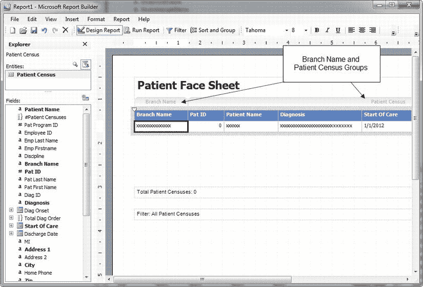

**Figure 13-29.** 自动创建的分组

## 保存与部署

在将报告保存到报告服务器之前，你可以最后预览一次。请注意，在`Figure 13-30`中，新添加的“Branch Name”组会自动隐藏重复值，并将“Patient Census”组中的每条记录归类到其指定的分支名称下。此时，你可以使用标准的格式化功能，例如添加边框、更改单元格甚至字体的大小、颜色和对齐方式，但基础报告已满足你的需求，因此可以继续部署它。

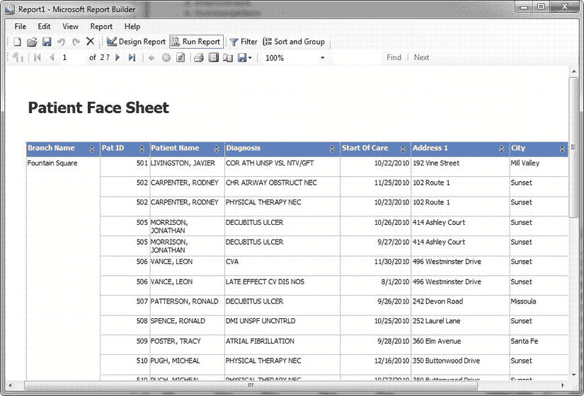

**Figure 13-30.** 预览新的“Branch Name”组

将报告部署到报告服务器就像点击工具栏上的“Save”按钮一样简单。点击“Save”后，会出现一个“Save Report”对话框，允许你导航到报告服务器上可访问的文件夹；在本例中，双击打开“Pro_SSRS”文件夹。如果你的 SSRS 2008 R2 服务器上没有“Pro_SSRS”文件夹，只需导航到报告管理器（`http://localhost/Reports/`），然后点击主屏幕工具栏上的“New Folder”按钮。将文件夹命名为“Pro_SSRS”，然后单击“OK”以在“ReportServer”数据库中创建新文件夹的定义。将此报告命名为“Patient Face Sheet”，如`Figure 13-31`所示，然后单击“Save”按钮。

你可以稍后导航到报告管理器以确保报告已成功保存，但现在，你将转到下一种将要学习创建的报告类型，即矩阵报告。

 **注意** 虽然你会将报告保存到报告服务器，并且可以将其加载回 Report Builder 1.0 进行修改，但也可以从文件位置打开 Report Builder 1.0 的 RDL 文件。从文件打开报告是任务窗格中的一个选项，可以通过在“View”菜单下选择“Task Pane”或按`Ctrl+F1`来访问。

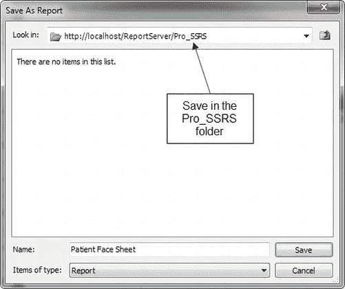

**Figure 13-31.** 将报告保存到服务器

## 创建矩阵报告

与表格报告不同，矩阵报告以二维方式显示聚合值，同时包含列组和行组。无论是总和、平均值还是计数，这些汇总值都会在行和列的分组层级相交。这创建了一个交叉表报告，类似于 Microsoft Excel 中的数据透视表。此报告的需求之一是显示患者的住院时长，从入院到出院的时间。另一个要求是报告中需显示出院原因。你可以将这两个需求完美结合到一个矩阵报告中。

那么，回到 Report Builder 1.0 的设计区域，在任务窗格的“报告布局”部分点击“矩阵（交叉表）报告”。这将打开一个新的空白矩阵模板，你可以像处理表格报告一样，将字段拖放到矩阵数据区域上。该模板不过是一个预定义的矩阵数据区域，你将向其添加几个字段，如 图 13-32 所示。

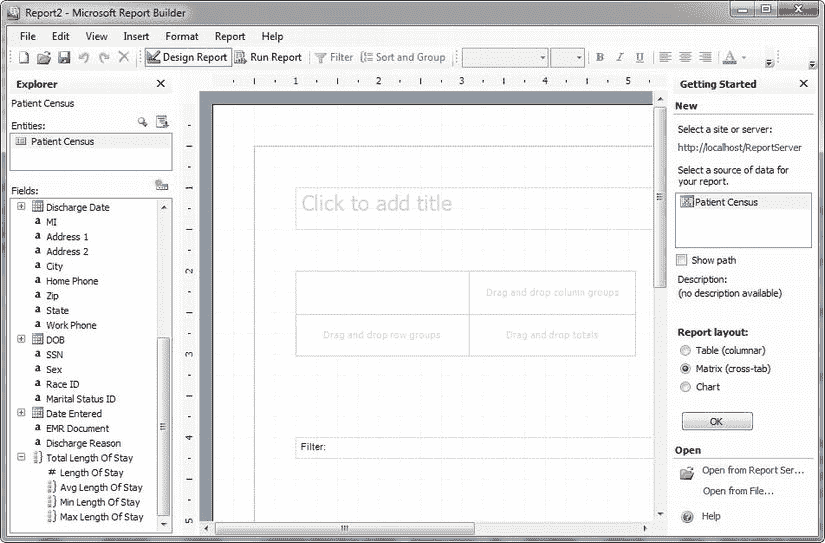

**图 13-32.** 空白矩阵报告

要开始创建此报告，请展开“字段”列表中的 `Total Length of Stay` 属性。将模型生成时计算的 `Avg Length of Stay` 属性拖到矩阵的汇总区域。对于行分组，添加 `Discharge Reason` 字段。最后，将 `Marital Status ID` 字段拖到列分组区域，使矩阵报告类似于 图 13-33。需要调整 `Discharge Reason` 字段的大小，并将 `Marital Status ID` 字段设置为居中对齐。此时，你还需要为报告添加一个标题：“平均住院时长”。将标题设为粗体，并将字体类型设置为 Arial Rounded MT Bold。

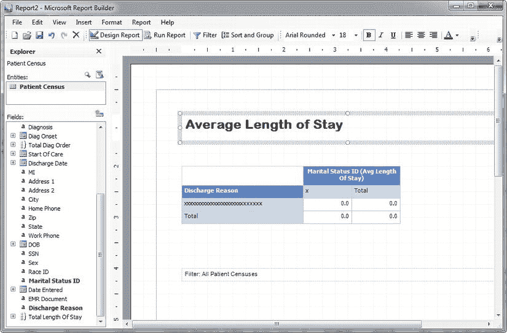

**图 13-33.** 包含数据的矩阵报告

在预览时，报告已初具雏形，如 图 13-34 所示；然而，你需要处理一些异常情况。首先，数字格式并非你所期望或想要的。默认情况下分配给 `Avg Length of Stay` 字段的数据类型是常规数字，这并不理想。你需要为数字添加格式。其次，你会看到包含空值的行和列。这可能有两个原因：首先，你包含了尚未出院的患者，即活跃患者；其次，婚姻状况并非必填字段，因此某些记录会没有值。

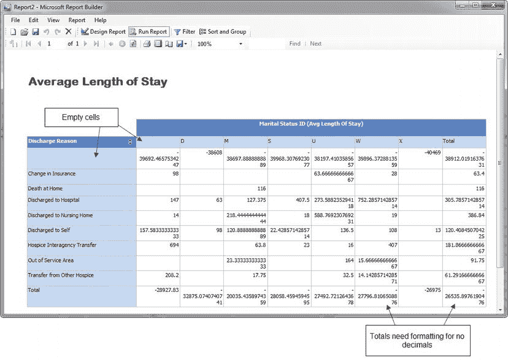

**图 13-34.** 矩阵报告的初始预览

你可以通过返回设计区域，右键点击最后一列（即总计列），然后选择 `Format`（格式）来处理数字格式问题。在 `Format`（格式）对话框中，将定义的格式从 `General`（常规）更改为 `1234.56`，如 图 13-35 所示，并将小数位数从 `2` 改为 `0`。然后点击 `OK`（确定）。对所有其他值字段执行相同的格式设置。

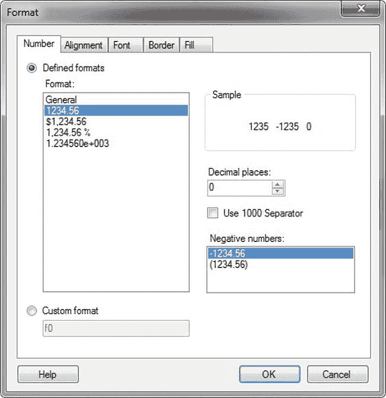

**图 13-35.** 更改数字格式

为了解决空列问题，请向报告添加一个筛选器，将数据限制为仅包含已出院且有出院原因的患者，以及定义了婚姻状况的患者。工具栏上的 `Filter`（筛选器）按钮将启动 `Filter Data`（筛选数据）对话框。在 图 13-36 中，你可以看到可以添加四个筛选条件：`MaritalStatusID`、`Discharge Date` 和 `Discharge Reason` 不为空，并且 `Discharge Year` 大于或等于 `2010`。（我们添加最后一个筛选器是为了演示报告可以提示用户输入一个作为参数的值，该参数与筛选器关联。）要将比较运算符从默认的“等于”更改为“不为空”，请点击“空”，然后从可用运算符中选择 `Not`（非）和 `Is Empty`（为空）。对于出院年份，选择 `Greater Than or Equal To`（大于或等于）运算符。将年份设置为 `2010` 后，点击 `Discharge Year`（出院年份）标签并选择 `Prompt`（提示），将其设置为报告参数，如 `Discharge Year`（出院年份）筛选器标签旁边的绿色问号图标所示。

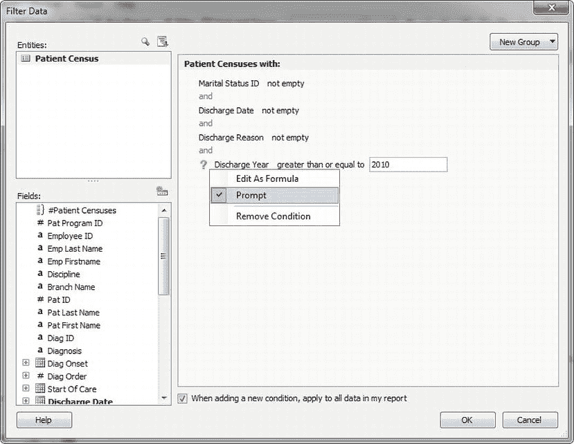

**图 13-36.** 设置报告筛选器

现在，当你在 图 13-37 中预览矩阵报告时，可以看到数字已被清理，所有空字段都已消失；同时，系统会提示你输入出院年份。将 `Discharge Year`（出院年份）参数更改为 `2011` 以查看这些结果。像保存表格报告一样，将此报告以“平均住院时长”为名保存到报告服务器上的 Pro_SSRS 文件夹中。现在，我们将继续使用 Report Builder 1.0 创建最后一个报告：图表。

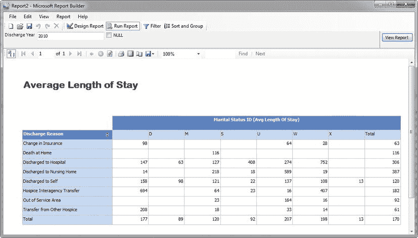

**图 13-37.** 设置报告筛选器并预览报告

### 创建图表报表

报表生成器 1.0 中最后一种可用的报表类型是图表报表。至此，你已经创建并保存了表格和矩阵报表，以满足“患者统计”报表的许多请求。现在，我们将展示一种最重要的报表，用于回答统计中的患者数量问题。“统计”意味着患者当前正在接受服务且尚未出院。在你使用的数据库中，如果患者的出院日期为 `Null`，或者用报表生成器 1.0 的术语来说是“空”，则该患者被视为活跃状态。你将创建的图表是一个简单的条形图，按分支机构显示活跃患者的计数。

回到报表生成器 1.0 的设计区域，在“报表布局”选项卡中点击图表报表。空白报表模板包含一个“图表”数据区域，如图 13-38 所示。如同之前创建表格和矩阵报表一样，你将添加一个标题：活跃患者统计。

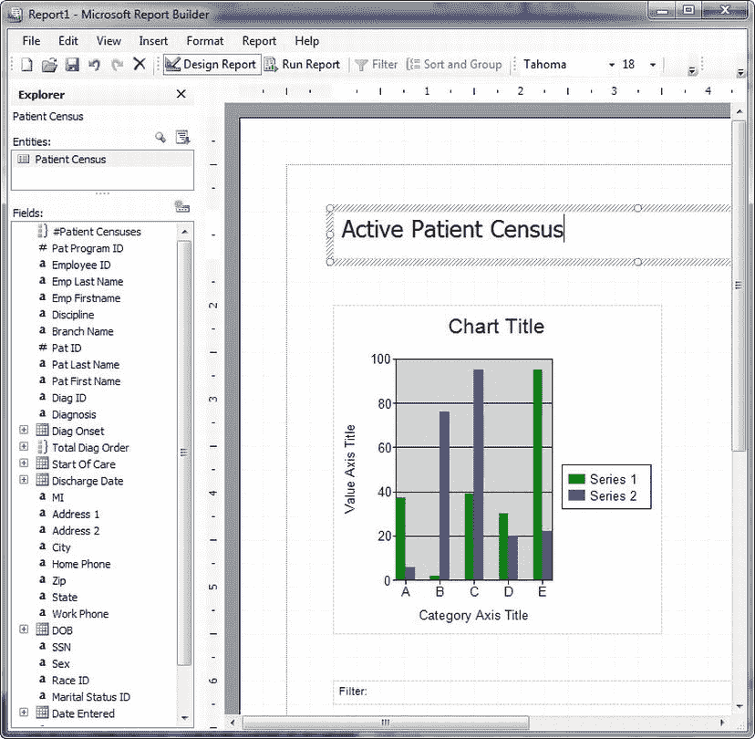

**图 13-38.** 图表报表模板

图表有三个可以拖放数据的区域：系列、类别和数据。你需要显示活跃患者计数，因此可以将 `患者 ID` 字段拖放到“数据”区域；但是，因为 `患者 ID` 字段不像 `平均住院天数` 那样被视为可以应用聚合函数的字段，所以无法直接将其拖放到“数据”区域。图表将不接受放置于此。既然你知道既需要一个计数值，又需要一个筛选器来仅获取活跃患者，你可以通过向字段列表添加一个新字段来同时解决这两个问题。在“资源管理器”选项卡中点击“新建字段”按钮，并将新字段命名为 `患者计数`，如图 13-39 所示。用于 `患者计数` 字段的公式可以是 `COUNTDISTINCT(患者 ID)`。请注意，在“定义公式”对话框中，`患者 ID` 字段添加到公式文本框后，其下方会有一条虚线，表示链接。你可以单击该字段，在为新字段定义公式时添加一个筛选器，接下来你将进行此操作。

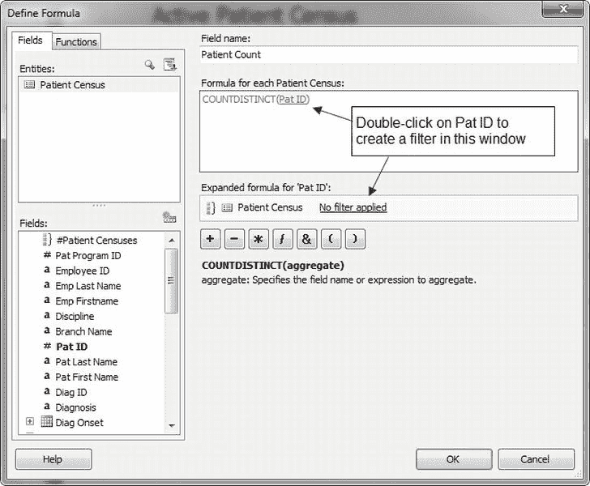

**图 13-39.** 为新字段 `患者计数` 定义公式

点击“未应用筛选器”链接，选择“创建新筛选器”以打开“筛选数据”对话框。你可以在图 13-40 中看到需要应用的筛选器，以仅显示活跃患者，其中你将 `出院日期` 设置为空，这将强制仅使用没有出院日期的患者进行公式计算。要实现筛选，将 `出院日期` 拖放到筛选窗格。然后通过点击“等于”链接标签选择“为空”值。将筛选器命名为 `活跃患者`，然后点击“确定”。一旦 `患者计数` 字段创建并显示在“字段”选项卡上，你就可以将其拖放到图表的“数据值字段”区域。在这种情况下，由于我们将其添加到“数据值字段”区域，只需双击 `患者计数` 字段，报表生成器就会将其放置在正确的部分。

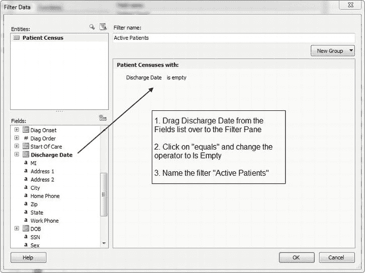

**图 13-40.** 添加 `活跃患者` 筛选器

接下来，将 `分支机构名称` 字段拖放到图表的“类别”区域。你可以向图表添加更多的系列项或类别，但为了保持图表简洁并满足请求，你将仅通过移除图表标题来对图表应用一些格式设置，以使报表上不显示“图表标题”。要修改图表属性，请遵循以下四个步骤：

> 1.  右键单击图表，然后选择“图表选项”。
> 2.  在“标题”选项卡上，删除图表、X 轴类别和 Y 轴数值的标题文本。
> 3.  在“图例”选项卡上，取消勾选“显示图例”复选框。
> 4.  最后，在“3D”选项卡上，勾选“以 3D 视觉效果显示图表”框，将“水平旋转”设置为 25，“垂直旋转”设置为 10，“明暗”设置为“逼真”，并选择“圆柱体”作为形状，如图 13-41 所示。

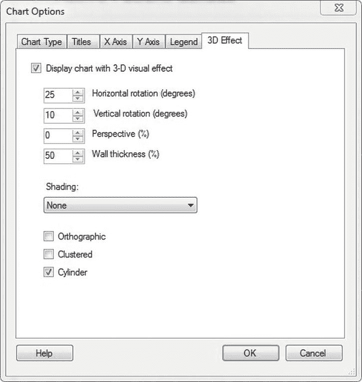

**图 13-41.** 设置 3D 视觉效果

在预览报表之前的最后一个任务是设置图表上的数据标签。为此：

> 1.  右键单击图表，选择“数据系列”，然后选择“设置数据系列格式 - 患者计数”。如果你希望在图表柱形上显示患者计数值，请选择“显示数据点标签”。在本示例中，选择“显示数据点标签”选项。
> 2.  将角度设置为–10 度，使其稍微突出一些。
> 3.  点击“格式”按钮，将字体大小设置为 16。

当你点击“确定”设置数据点标签，然后预览报表时，可以看到按分支机构显示活跃患者计数的图表。随着患者出院，由于筛选器，他们将从活跃患者列表中移除，图表将自动反映当前的统计计数。图 13-42 显示了完成的图表。现在，你可以将图表报表保存为 `活跃患者统计` 到 `Pro_SSRS` 文件夹中，就像保存其他两个报表一样。

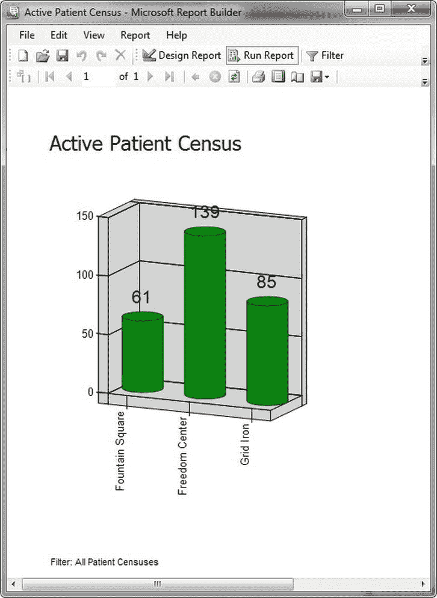

**图 13-42.** 活跃患者统计图表报表的预览

这些报表以标准的 RDL 报表文件形式部署，不同之处在于它们的数据源是报表模型，而不是标准的 RDS 数据源对象。你可以在报表管理器中看到三个新发布的报表，如图 13-43 所示。

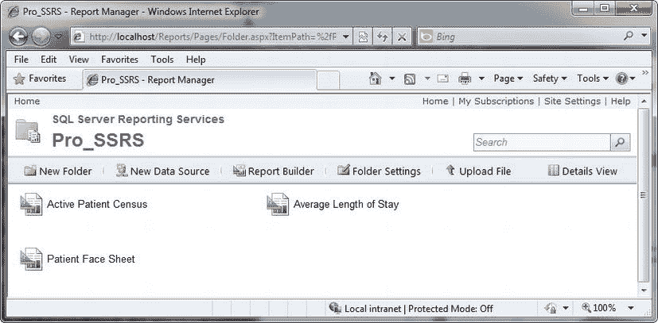

**图 13-43.** 在报表管理器中发布的报表生成器 1.0 报表

## 使用 Report Builder 2.0 向导创建报表

至此，我们已经使用 `BIDS` 和通过 `ClickOnce` 部署的 `Report Builder 1.0` 创建了 `SSRS` 报表。这两种设计环境对报表设计提供了不同级别的控制。虽然 `BIDS` 为报表创建者提供了比 `Report Builder 1.0` 大得多的灵活性，但对于非应用程序程序员的人来说，它可能不是最佳选择。相比之下，`Report Builder 1.0` 易于学习和使用以发布报表；然而，它存在限制，即只能使用预构建的模型来创建报表，这不足以满足每个人的需求。在 `SSRS 2008` 中，微软提供了 `Report Builder 2.0`，它支持真正的临时查询和报表设计，而不仅仅基于报表模型。`Report Builder 2.0` 现代化的外观和感觉，采用了类似 `Office 2007` 应用程序中的 `Ribbon` 技术，为报表创建者提供了一个熟悉的工作环境。

图 13-44 展示了 `Report Builder 2.0` 的界面。图中明显可见微软对新技术 `Ribbon` 的应用。

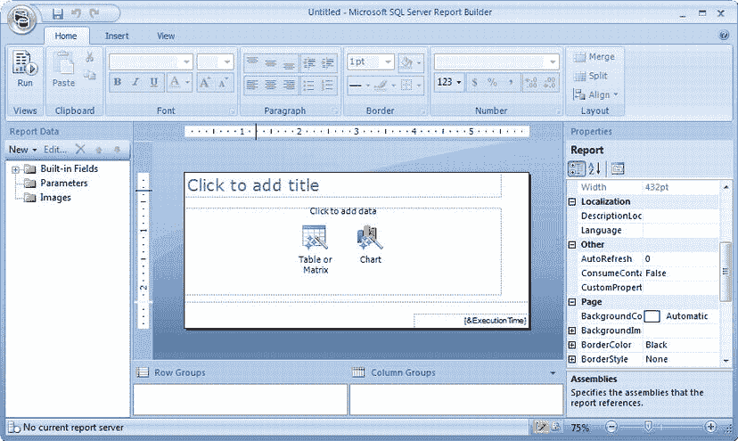

`图 13-44. Report Builder 2.0 的新界面`

 **注意** 要在 `SQL Server 2008 R2` 或 `SQL Server 2012` 环境中使用 `Report Builder 2.0`，您需要安装 `Report Builder 2.0` 厚客户端。此客户端可以从 [`www.microsoft.com/en-us/download/details.aspx?id=24085`](http://www.microsoft.com/en-us/download/details.aspx?id=24085) 下载。如果您使用的是 `SQL Server 2008 SP1` 环境，则可以使用 `Report Manager` 上的 `Report Builder` 按钮或从 `SharePoint` 内部使用 `ClickOnce` 应用程序。默认情况下，`Report Manager` 中配置的是 `Report Builder 1.0`，因此您需要在“站点设置”页面更改 `Report Builder` 的 `URL`，以反映您的安装文件夹。例如，如果我安装了 `SQL Server 2008 SP1`，我会将其更改为 `/ReportBuilder/reportbuilder_2_0_0_0.application` 或完整的 `URL` [`http://ServerName:PortNumber/ReportServer/ReportBuilder/reportbuilder_2_0_0_0.application`](http://ServerName:PortNumber/ReportServer/ReportBuilder/reportbuilder_2_0_0_0.application)。在 `SharePointIntegrated` 模式下，您需要将 `Custom Report Builder URL` 更改一个稍有不同的 `URL`：`/_vti_bin/ReportBuilder/ReportBuilder_2_0_0_0.application`。

正如您可能想象的那样，在 `Report Builder 2.0` 中开发报表被简化了，所有设计选择都集中在 `Home`、`Insert` 和 `View` 三个选项卡中。内置字段、参数、图像和数据源都包含在 `Data` 窗口的文件夹中。与 `SQL Server Data Tools (SSDT)` 类似，`Row Groups` 和 `Column Groups` 区域位于底部。报表主体中添加了指导性文本，以及用于启动 `Table`、`Matrix` 和 `Chart` 向导的链接按钮，以引导设计者完成创建成品的必要步骤。

 **注意** 由于 `Report Builder 2.0` 和 `Report Builder 3.0` 报表不使用 `Report Model` 作为数据源，我已经在包含 `SQL Server 2012` 的服务器上安装了 `Report Builder 2.0`。由于我们在本书中一直使用这台服务器来开发报表，它包含了完整的 `Pro_SSRS` 数据库。

通过一个示例，让我们构建一个新版本的 `Employee Service Cost` 报表，您在本书中已经见过该报表。如果您使用的是 `SQL Server 2008 R2` 或 `SQL Server 2012`，并且像我一样通过安装厚客户端来使用 `Report Builder 2.0`，您可以通过导航到 `Windows` 开始菜单的 `All Programs` 下的 `Microsoft SQL Server 2008 Report Builder 2.0` 文件夹来启动 `Report Builder 2.0`。启动 `Report Builder 2.0` 后，您需要点击报表设计界面上的 `Table` 或 `Matrix` 图标。如前所述，这将打开 `New Table or Matrix` 向导，并首先提示您选择现有数据源或创建新数据源，如 图 13-45 所示。

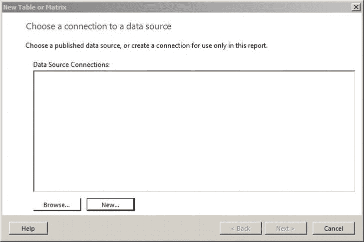

`图 13-45. Report Builder 2.0 中的新建表或矩阵向导`

选择 `New…` 为此报表创建新数据源。将数据源命名为 `Pro_SSRS`，连接类型设置为 `Microsoft SQL Server`，然后点击 `Build…` 按钮选择服务器。在本例中，将服务器名称设置为 `localhost`，数据库名称设置为 `Pro_SSRS`，如 图 13-46 所示。点击 `OK` 保存 `Connection Properties`，然后再次点击 `OK` 保存 `Data Source Properties`。现在我们的数据源已创建，点击 `Next` 在查询设计器窗口中构建查询。

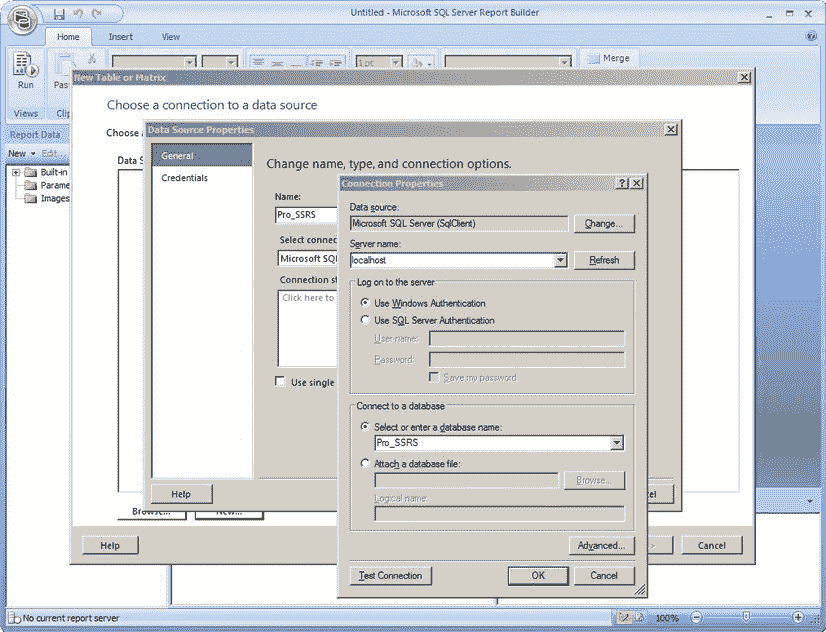

`图 13-46. 设置数据源和连接字符串属性`

查询设计器包含一组最小化的查询设计工具，其风格类似于 `SSMS` 中的查询生成器应用程序。您可以图形化地向查询添加表、使用存储过程、表值函数、创建联接以及使用条件筛选数据。在我们的例子中，我们将使用 `Emp_Svc_Cost` 存储过程。在查询设计器中，我们可以在 `Database` 视图窗格中展开 `Stored Procedures`，然后选择 `Emp_Svc_Cost` 存储过程。如您在选择存储过程后所见，系统会显示该存储过程返回的字段以及它所期望的参数。如果您想查看 `Query` 结果，请设置您想要的参数值，然后运行查询。对于此示例，将默认值保留为 `(null)`，并点击 `Run Query` 按钮执行存储过程。图 13-47 显示了执行存储过程 `Emp_Svc_Cost` 及其结果数据。或者，我们可以点击 `Edit As Text` 按钮，选择 `Stored Procedure` 作为类型，然后在查询文本框中输入 `Emp_Svc_Cost`。

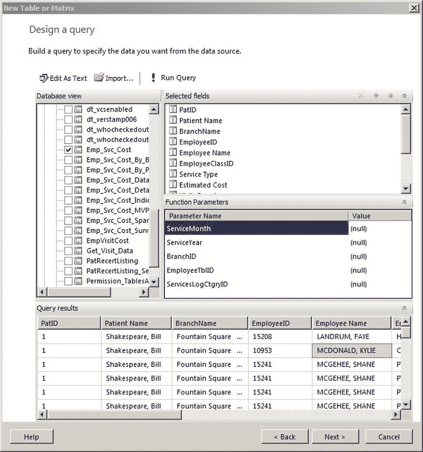

`图 13-47. 将 Emp_Svc_Cost 存储过程添加到查询设计器`

查看结果后，点击 `Next` 进入 `New Table or Matrix` 向导的 `Arranged fields` 屏幕。在这里，您使用适当的行组、列组和值来布局报表。使用以下步骤通过向导生成 `Emp_Svc_Cost` 报表：

1.  将 `BranchName` 和 `Service_Type` 字段拖到 `Row groups` 区域。
2.  接下来，将 `Visit_Count` 和 `Estimated_Cost` 拖到 `values` 区域，如 图 13-48 所示。

    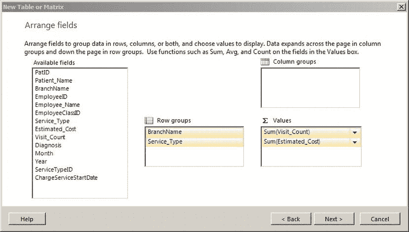

    `图 13-48. 排列字段屏幕`

3.  点击 `Next` 进入 `Layout` 选择屏幕。此屏幕允许我们为报表选择块状或阶梯状外观。它还有一个功能，可以使用 `Expand/collapse groups` 复选框自动创建可展开或可折叠的向下钻取功能。保留 图 13-49 中所示的默认值，然后点击 `Next`。
4.  保留默认选中的 `Ocean` 样式，点击 `Finish` 生成我们的报表。
5.  调整列宽，以防止标题内容自动换行到下一行。
6.  将标题更改为 `Service Type Estimated Cost by Branch`。

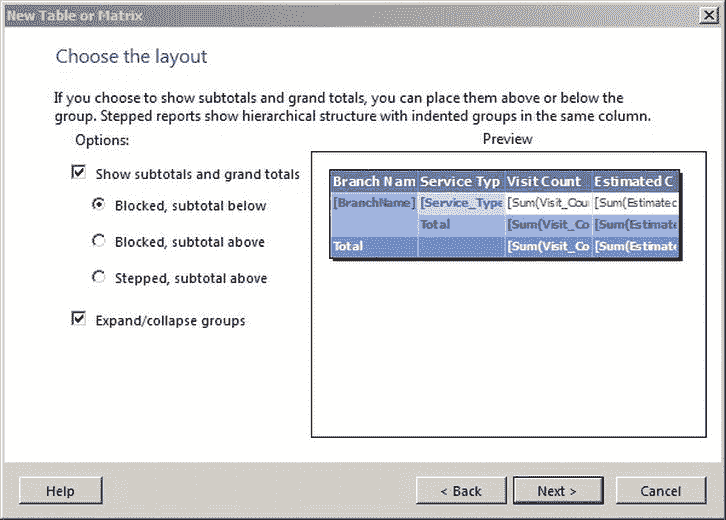

`图 13-49. 选择报表布局`

完成这些小的更改后，我们应该得到一份类似于 图 13-50 所示的报表。

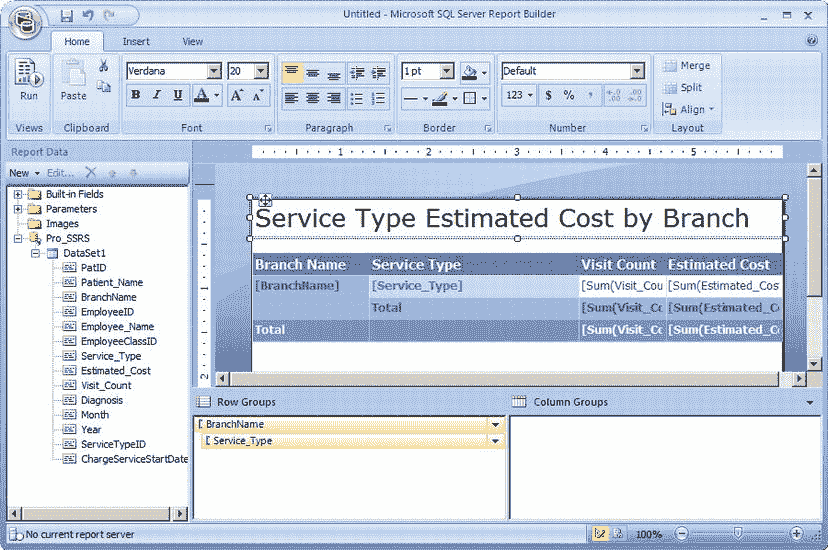

`图 13-50. Report Builder 2.0 中的完成报表`

像我们之前的示例一样，将此报表保存到 `Report Server` 上的 `Pro_SSRS` 文件夹中，并将其命名为 `Service Type Estimated Cost by Branch Wizard`。在接下来的部分中，我们将介绍另一种不使用向导来创建相同报表的方法。我们还将向您展示如何对 `Report Builder` 报表执行格式更改。

## 使用 Report Builder 2.0 创建报表

正如我刚才提到的，创建报表时我们并非必须使用向导。此外，如果我们不想使用 `新建表或矩阵` 向导，也可以分别创建新的数据源和数据集。在本节中，我们将不使用向导来创建相同的报表。

首先，如果 `按分支机构估算服务类型成本` 报表仍然打开着，请点击屏幕左上角的圆形功能区图标。这个功能区图标的作用类似于其他 Microsoft 产品中的 `文件` 菜单选项。点击功能区图标后，选择 `新建` 来创建新报表。如果您没有打开 `Report Builder 2.0`，请从 `所有程序` 菜单中的 `Microsoft SQL Server 2008 Report Builder 2.0` 下找到 `Report Builder` 瘦客户端并打开。如果您一直跟随操作，那么 `Report Builder 2.0` 的空白设计环境对您来说应该很熟悉，它与图 13-44 中所示的一样。

要开始不使用向导从头创建报表，我们需要在进入报表设计之前先创建一个数据源和一个数据集。创建好这些后，我们就能将表格添加到设计窗格，然后开始添加列和分组。以下四个步骤将引导我们完成为报表创建数据源和数据集的过程。

1.  点击 `报表数据` 窗格上的 `新建` 按钮，然后选择 `数据源`。如果看不到 `报表数据` 窗格，请点击 `视图` 选项卡，然后选中 `报表数据` 复选框。
2.  将您的数据源命名为 `Pro_SSRS` 并设置 `使用共享连接或报表模型` 选项。我们可以使用服务器上的共享数据源，而不是嵌入式数据源。这有助于将报表部署到不同环境时管理。如果报表使用共享数据源，即使数据库服务器在报表生命周期内发生更改，唯一需要更新的对象也只是共享数据源本身。反之，如果您始终使用嵌入式数据源，那么所有使用该数据源的报表也都需要更改。这使得管理更加困难，因此，应尽可能使用共享数据源。
3.  现在，点击 `浏览…` 按钮，导航到 `Pro_SSRS` 文件夹下的 `DataSources` 文件夹，并选择 `Pro_SSRS` 数据源。点击 `打开` 返回 `数据源属性` 窗口，如图 13-51 所示。点击 `确定` 保存 `Pro_SSRS` 数据源并返回 `Report Builder`。保存数据源后，`Report Builder` 会将其添加到 `报表数据` 窗格。
    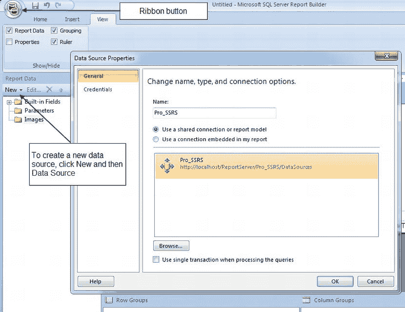
    **图 13-51.** 创建新数据源
4.  在 `报表数据` 窗格中右键单击新的 `Pro_SSRS` 数据源，然后选择 `添加数据集`。将数据集命名为 `Emp_Svc_Cost`，并将 `查询类型` 设置为 `存储过程`。如果提示输入登录凭据，请输入相应的登录信息。然后在 `选择或输入存储过程名称` 下拉列表中，选择我们的 `Emp_Svc_Cost` 存储过程。图 13-52 显示了 `数据集属性` 窗口。点击 `确定` 保存 `Emp_Svc_Cost` 数据集。

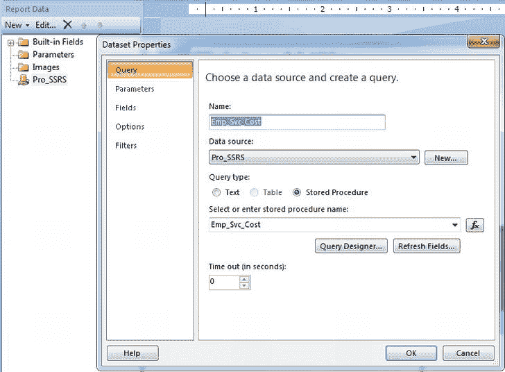
**图 13-52.** 创建新数据集

一旦添加了查询并保存了数据源，您就可以看到可用的字段以及自动生成的、现在可以在报表中使用的参数。此外，报表中的指导性文字也已改变。如图 13-53 所示，现在会指导您如何通过点击 `插入` 选项卡或拖动项目到相应区域，来向报表主体、页眉和/或页脚添加项目。接下来，您将通过向报表主体添加一个 `矩阵` 控件、向页眉添加一个报表标题，以及向页脚添加报表执行时间（一个内置字段）来完成这些操作。

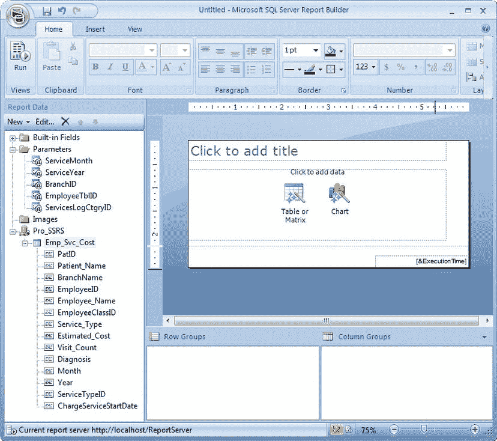
**图 13-53.** 添加数据源和数据集后的 Report Builder 2.0

现在环境已准备好，可以使用新添加的数据源创建报表了，点击 `插入` 选项卡。如图 13-54 所示，所有报表控件在顶部有四个类别可供使用：`数据区域`、`报表项`、`子报表` 以及 `页眉和页脚`。在我们向设计表面添加自己的 `表`、`矩阵` 或 `图表` 之前，我们将删除包含向导两个链接按钮的 `数据区域` 组。只需选择 `DataRegionPlaceholder` 并按键盘上的 `Delete` 键。要添加 `矩阵` 数据区域，只需点击 `矩阵` 图标并选择 `插入矩阵`，将控件添加到报表主体中。接下来，在设计表面上绘制 `矩阵`，使其大约高 ½ 英寸，长 2 英寸。

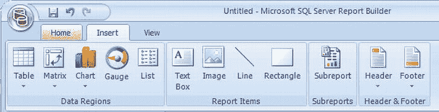
**图 13-54.** `插入` 选项卡中可用的报表对象

接下来，从随数据源创建的 `Emp_Svc_Cost` 数据集中拖拽以下四个字段到报表中的 `矩阵` 控件上：`BranchName`、`Service_Type`、`Visit_Visit_Count` 和 `Estimated_Cost`。将 `BranchName` 和 `Service_Type` 添加到 `行` 区域，将 `Visit_Count` 和 `Estimated_Cost` 添加到 `数据` 区域。当我们将 `Visit_Count` 添加到 `数据` 区域时，`Report Builder` 自动添加了一个标题。我们不希望它被标记为 `Visit Count`，因此选择文本框，然后按 `Delete` 删除它。此时，报表应与图 13-55 所示的布局相似。请注意，`求和` 函数已自动应用于拖到 `数据` 区域的字段。

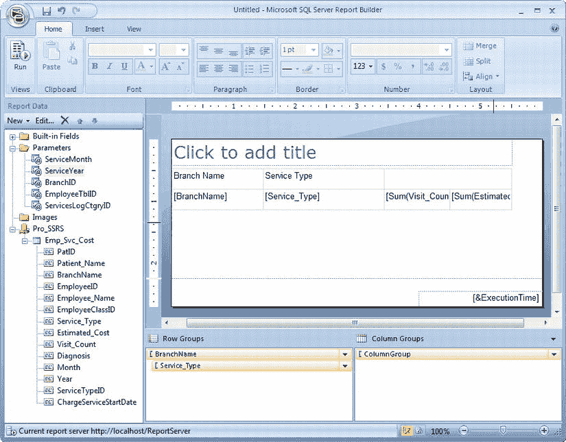
**图 13-55.** 已添加字段的报表矩阵

您需要调整 `矩阵` 中的单元格大小，以便 `Service_Type` 记录不会换行。如果您点击 `视图` 选项卡，会有一个 `标尺` 选项。点击 `标尺` 按钮，并将 `Service_Type` 单元格调整为两英寸大小。在运行报表之前，让我们将所有参数更改为允许 `NULL` 值。要将参数设置为接受 `NULL` 值，只需双击参数并启用标有 `允许空值` 的复选框。通过点击 `主页` 和 `视图` 选项卡上可用的 `预览` 按钮，您可以看到预览的报表逐渐成形（图 13-56）。

 **注意** 如果您不想输入参数值，您可能需要在报表中设置参数以允许 `NULL` 值。默认情况下，如果参数值允许 `NULL` 值，报表将使用存储过程执行返回的所有数据生成。

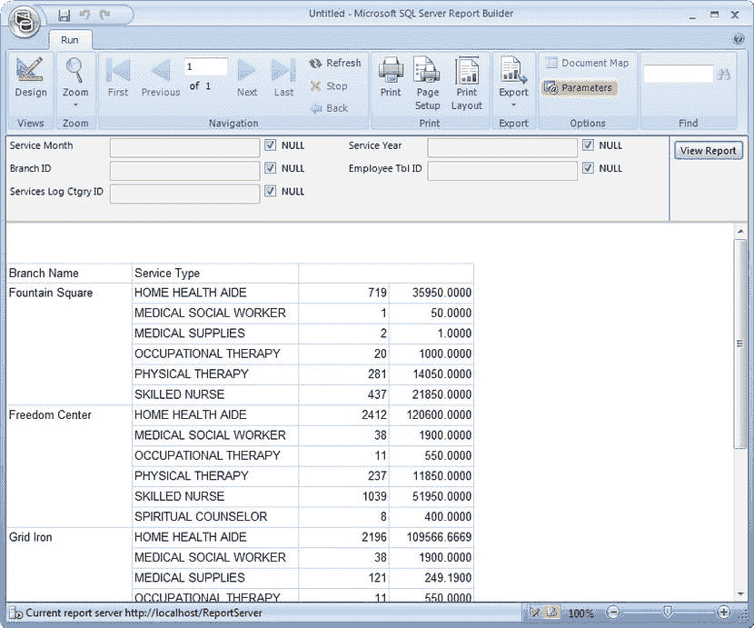
**图 13-56.** Report Builder 2.0 报表预览

接下来，您将格式化 `Estimated_Cost` 字段，使其以货币形式显示值。点击回 `设计` 区域，然后按照以下步骤应用一些格式：

> 1.  右键单击 `SUM(Estimated_Cost)` 文本框，然后选择“文本框属性”。
> 2.  图 13-57 所示的对话框包含了文本框属性，涵盖了许多可用的格式设置和操作项，例如交互式排序、可见性和超链接选项。这些都与在 BIDS 中开发报表时设置的属性相同。单击左侧的“数字”，选择“货币”作为格式，然后选择“使用千位分隔符 (,)”选项，并单击“确定”保存文本框属性。
> 3.  接下来，通过右键单击 `Visit_Count` 字段并选择“文本框属性”，为其应用带千位分隔符的数字格式。选择“数字”选项卡，然后在“类别”中选择“数字”。将小数位数设置为 `0`，选择“使用千位分隔符 (,)”选项，并单击“确定”保存文本框属性。
> 4.  由于报表的默认高度留下了额外的空白，我们可以通过将页脚栏向上拖动到靠近我们的矩阵报表项来减少它。
>     
>     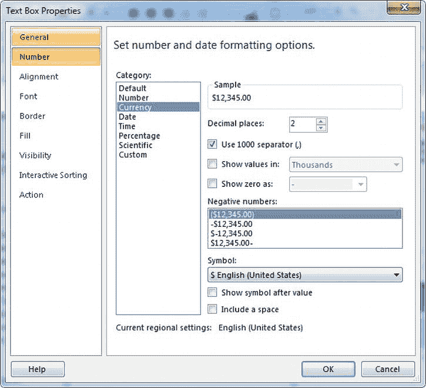
>     
>     ### 图 13-57. Estimated_Cost 的文本框属性
>     
>     
> 5.  最后，通过单击报表顶部的“单击以添加标题”文本框来重置报表标题。将报表标题设置为“按分支的服务类型估计成本”，并将文本框的宽度更改为大约 5 3/4 英寸。

完成所有这些更改后，报表应如图 13-58 所示。

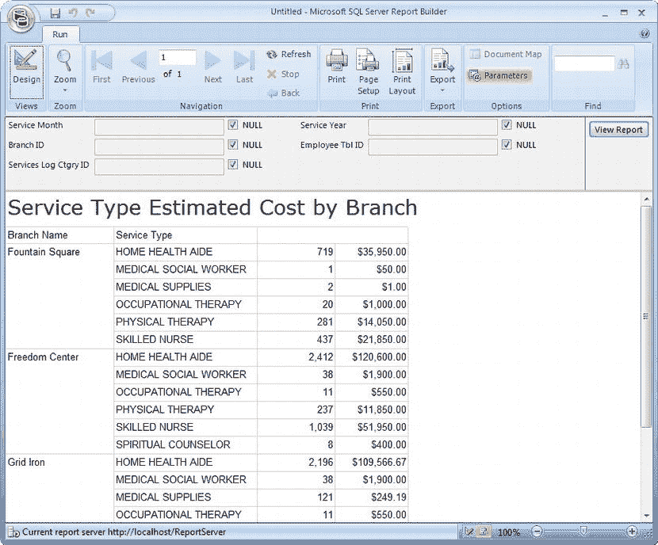

### 图 13-58. 添加标题后的报表

最后，你可能已经注意到了报表页脚中的 `[&ExecutionTime]`。这是 Report Builder 2.0 默认添加的。如果你想删除它，只需选中它并按删除键即可。但是，如果你想向页脚或页眉部分添加更多内置字段，只需展开“数据”窗口中的“内置字段”文件夹即可查看选项。你将看到 `ExecutionTime`、`PageNumber`、`Report Folder`、`Report Name`、`Report Server URL`、`Total Pages`、`User ID` 和 `Language` 等可能的选择。在我们的示例中，我们将向报表添加一个页眉，并在其中添加 `User ID` 以及我们的报表标题。

> 1.  在设计模式下，单击“插入”选项卡。
> 2.  单击“页眉”，然后选择“添加页眉”。将其高度调整为大约 ½ 英寸。
> 3.  选择报表正文中的标题，并将其拖动到页眉部分。
> 4.  选中报表标题后，单击“视图”选项卡，并在“属性”选项前打勾以显示它。
> 5.  将 `FontSize` 属性从默认的 `20pt` 更改为 `14pt`。将页眉文本框调整得比标题稍大一些。这将为我们的页眉留出一些空间来显示另一个字段。
> 6.  将 `User ID` 内置字段拖动到报表标题的右侧。这将创建一个包含 `User ID` 字段值的文本框。你可以将这个新文本框右对齐，使其斜体并加粗。

你可以轻松地添加更多格式设置，或者像我喜欢的那样称之为报表美化，但此时，报表在预览时应如图 13-59 所示。

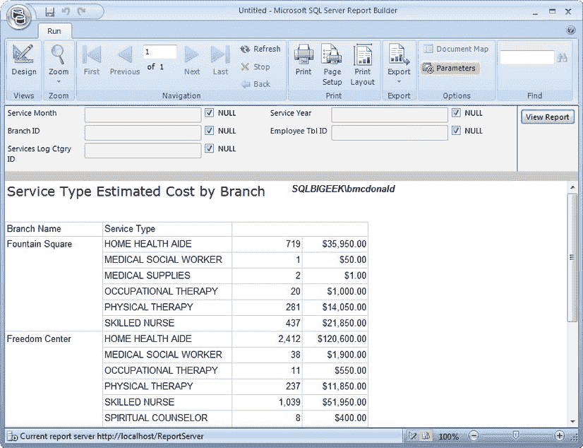

### 图 13-59. 包含执行时间和标题的报表预览

作为最后的润色，你将向报表添加总计。这可以通过单击回设计区域并选择“数据”区域中的两个单元格 `Visit_Count` 和 `Estimated_Cost` 来轻松完成。你可以通过选择第一个单元格，然后按住 `Shift` 键（或 `CTRL` 键）选择第二个单元格来同时选中两者。一旦选中，右键单击并选择“添加总计”。总计字段会自动为你添加。你可以通过将两个新的总计单元格加粗来强调它们。完成后，报表将如图 13-60 所示。

正如你所看到的，新的 Report Builder 2.0 具有 BIDS 完整设计环境的许多功能，只有很小的例外。一个突出的例外是无法将报表直接签入版本控制应用程序，如 Team Foundation Server。然而，就其意图而言，Report Builder 2.0 确实实现了将设计环境交到那些能够超越报表模型约束创建报表、但本身可能不是 VB .NET 开发人员的人手中的目的。将这个有价值的设计工具作为 SSRS 的一部分提供，是将 SSRS 推向大众的又一进步。在下一节中，我们将介绍 Report Builder 3.0 应用程序中的增强功能，并通过一个使用 Microsoft Reporting Services 即席工具最新版本的示例进行讲解。

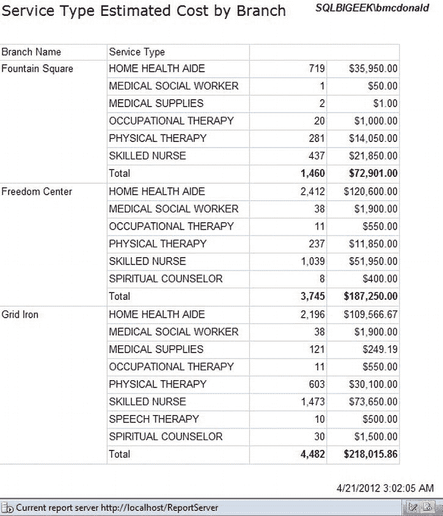

### 图 13-60. 最终格式设置后的报表

