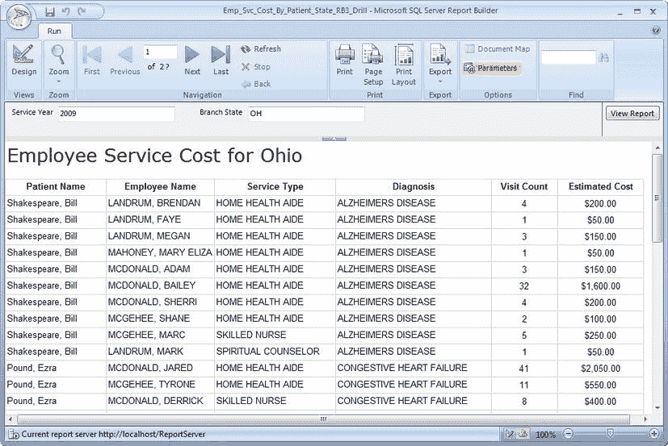
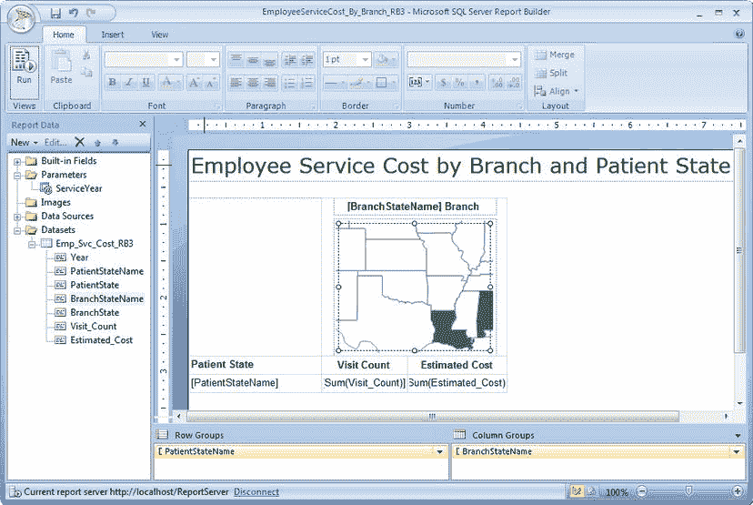

# 使用 Report Builder 3.0 创建报表

当我们听说 `SQL Server 2008 R2` 即将上市，并带有所有新的可视化增强功能时，就有关于另一个 `Report Builder` 的讨论。在 `Report Builder 2.0` 带来了众多出色的功能之后，我们迫不及待地想看看下一个版本会为我们的最终用户带来哪些即席报表的便利功能。

随着 `SQL Server 2008 R2` 的上市，`Report Builder 3.0` 也应运而生，它随之带来了一些额外的数据源、数据可视化报表项，以及在预览报表时的缓存数据集等功能，仅举几例。各项增强功能的高级详细信息如下：

> *   **报表部件：** 报表部件允许报表作者创建和部署可被其他报表重复使用的报表部件。例如，如果一位报表开发人员创建了一个“按分支统计的员工服务成本”报表，其中包含一个总成本图表，那么另一位报表开发人员或最终用户就可以将该报表作为其自身报表的一个部件来使用。
> *   **数据源：** 随着 `SQL Azure` 的逐渐成熟，微软创建了一个 `Microsoft SQL Azure` 数据源。他们还添加了 `SharePoint List Data Extension` 以连接到 SharePoint 列表以及 `Microsoft SQL Server Parallel Data Warehouse`。
> *   **报表项：** 正如第 5 章中讨论的，使用 `SQL Server Data Tools` 中的 `Report Designer`，新的报表可视化项已被添加到 `Report Builder` 中。这些新的报表项包括 `地图`、`数据条`、`迷你图` 和 `指示器`。你可以在 `Report Builder` 的 `插入` 选项卡上找到它们。
> *   **数据集缓存：** 由于最终用户会创建即席报表，产生大量耗时较长的报表请求的可能性相当高。因此，为了在数据集没有相关更改的情况下避免多次往返请求，微软在新功能矩阵中添加了数据集缓存。这改善了最终用户在创建即席报表时的体验，这可能意味着最终用户会有更高的接受度。

现在，你已经了解了 `Report Builder 3.0` 及其一些新功能和增强功能，让我们开始看一些例子。在这个例子中，我们将构建一个报表，显示每个患者所在州的就诊次数和预估服务成本，以及患者在我们某个分支机构所在州的就诊情况。它与我们之前创建的报表非常相似，区别在于我们将使用一个 `地图` 控件。我们还将从我们的 `地图` 报表钻取到一个更详细的表格报表。我们在本书前面已经了解过钻取报表，但我们从未使用过 `Report Builder` 执行钻取操作。本节演示的钻取报表可在 Apress 网站本书源代码/下载区的 `Pro_SSRS` 项目中找到（[`www.apress.com`](http://www.apress.com)）。该报表名为 `Emp_Svc_Cost_By_Patient_State_RB3_Drill`。

在我们开始 `地图` 报表之前，请从 `报表管理器` 打开 `Report Builder 3.0`。`Report Builder` 加载后，在 `入门` 窗口中单击 `打开`。导航到你硬盘上存储 `Pro_SSRS` 解决方案的位置，并选择名为 `Emp_Svc_Cost_By_Patient_State_RB3_Drill` 的报表。单击 `打开` 以在 `Report Builder 3.0` 中打开该报表。如果你点击 `运行`，你应该会看到与图 13-61 所示类似的结果。

*图 13-61. Report Builder 3.0 钻取报表*

预览报表后，返回设计器，并将报表保存到 `Pro_SSRS` 文件夹，就像我们在本章中一直做的那样。将报表保存在此路径下，可以在创建 `Map` 报表后钻取到此报表。将报表保存到 `报表服务器` 后，点击 `功能区` 按钮，然后点击 `新建`。如前所述，我们的下一个报表将包含每位患者来自的州以及患者实际就诊所在州的聚合就诊次数和预估成本。图 13-62 展示了该报表在设计模式下的一个示例。

 **注意** 再次说明，我们一直在使用经过修改的样本数据，以提供代表现实世界场景的结果集。考虑到我们虚构的患者来自全国各地，他们不太可能从像加利福尼亚这样的州专程到俄亥俄州就诊。尽管如此，下一节中的示例可以用于许多需要提供地图和量化数据的应用程序。

*图 13-62. 设计模式下的按分支和患者所在州统计的员工服务成本*

