# Report Builder 操作指南

1.  右键单击“数据源”文件夹并选择“添加数据源”。将数据源命名为`Pro_SSRS`，选择“使用共享连接或报表模型”，然后单击“浏览”按钮导航至`Pro_SSRS/DataSources`文件夹下的`Pro_SSRS`数据源。单击“打开”，然后点击“确定”保存数据源。
2.  右键单击“数据集”文件夹并选择“添加数据集”。将数据集命名为`Emp_Svc_Cost_RB3`，并选择“使用嵌入在报表中的数据集”。选择`Pro_SSRS`作为要使用的数据源，并选择查询类型为“存储过程”。选择`Emp_Svc_Cost_By_Patient_State_RB3`存储过程，然后单击“确定”保存数据集。
3.  接下来，将报告标题更改为“按分支机构和患者州显示的员工服务成本”。调整标题文本框的大小以适应新标题，避免文字换行。
4.  在报表设计界面上右键单击，选择“插入”，然后选择“矩阵”。这会在报表设计窗格中添加一个新的矩阵报表对象。将矩阵拖动到标题附近的左上角位置。
5.  将`Visit_Count`字段拖到“数据”字段中，然后将`Estimated_Cost`字段拖到`Visit_Count`的右侧。
6.  删除当我们将`Visit_Count`拖到矩阵上时，Report Builder 自动添加到“矩阵列”字段中的`Visit_Count`标签。
7.  将`PatientStateName`字段拖到矩阵的“行”字段中，为每个患者州创建行分组。像步骤 6 中处理`Visit Count`标签那样，删除放置在矩阵左上角的“Patient State Name”标签。使用“边框线”格式选项，将左上角空白字段周围的线条设置为“无”。
8.  通过在“列”字段中右键单击，选择“插入”，然后选择“矩形”，在其中插入一个矩形报表对象。我们将在这里放置`BranchStateName`和州的地图。为了给`BranchStateName`和地图留出空间，将此行的高度设置为约 2 英寸，如之前所示的图 13-62。
9.  右键单击这个新的矩形内部，选择“插入”，然后选择“文本框”。将文本框移动到矩形的顶部，并将其宽度设置为 2.5 英寸。右键单击文本框并选择“表达式”。将表达式设置为`Fields!BranchStateName.Value`。单击“确定”保存表达式。将文本对齐方式设置为居中并加粗。然后在`[BranchStateName]`后输入一个空格，再输入“Branch”。文本框现在应显示为`[BranchStateName] Branch`。
10. 选择矩形中我们刚刚创建的`BranchStateName`文本框下方的空白部分。使用功能区上的“主页”选项卡，将矩形周围的线条颜色更改为“银色”，然后单击边框以在整个矩形周围添加线条。此时，我们的报表应该类似于图 13-63。
    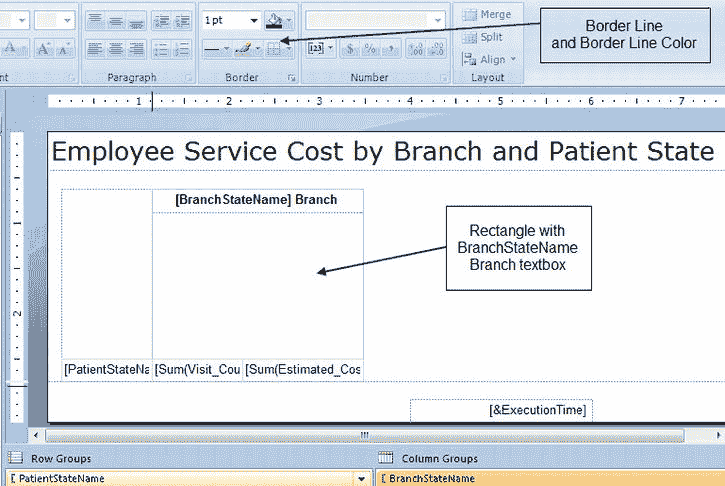
    ***图 13-63.** 按分支机构和患者州显示的员工服务成本*
11. 通过选择字段，然后在“视图”菜单上选择“属性”，将`[Sum(Visit_Count)]`字段格式化为不带小数位的数字。导航到“数字”类别下的“格式”属性。将格式设置为`N0`（即 N 和零）。将该字段居中。
12. 通过将其“格式”属性设置为`C2`，将`[Sum(Estimated_Cost)]`字段格式化为带两位小数的货币格式。
13. 右键单击`PatientStateName`字段，选择“插入行”，然后选择“组外 – 上方”，在`PatientStateName`、`Visit_Count`和`Estimated_Cost`行上方添加一行。现在有了这些额外的字段，让我们在其中放置标签来代表它们下方的列。将第一个空文本框设置为显示“患者州”，第二个显示“访问次数”，最后一个显示“预估成本”。将每个字段加粗，并将“患者州”列加宽至约 1.75 英寸。单击“运行”查看我们迄今为止的劳动成果。将“服务年份”参数设置为 2009，然后单击“查看报表”。图 13-64 显示了如果您一直跟着操作，报表应有的样子。
    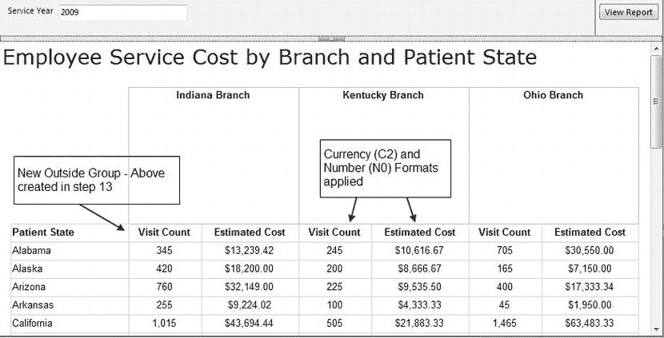
    ***图 13-64.** 分组和格式化后，按分支机构和患者州预览员工服务成本*
14. 正如您所见，我们在分支机构州名称文本框和新分组下方留下了一些空间。现在我们将向该空白区域添加一个地图。单击“设计”按钮返回 Report Builder 设计器。
15. 右键单击`BranchStateName`文本框下方的空白区域，选择“插入”，然后选择插入一个新的“地图”报表对象。Report Builder 会使矩形变得很大，但在我们将地图调整到想要的样子后，会将其缩小。
16. 首先，我们要删除添加的额外项目。右键单击地图，取消选中“显示经线”复选框。再次操作以取消选中“显示纬线”。对“颜色图例”（左下角）和“距离图例”（右下角）执行相同的操作。右键单击图例，然后选择“删除图例”。对“地图标题”执行相同的操作。此时，地图看起来像一个巨大的灰色矩形，对吧？我想说我们都完成了，但这会是个玩笑。实际上，现在我们准备施展一些地图绘制魔法。
17. 右键单击地图，选择“地图”，然后选择“添加图层”。保持默认的“地图库”被选中，选择“美国按州插入图”，然后单击“下一步”。我们稍后将设置缩放为动态，所以现在，在“选择空间数据和地图视图选项”屏幕上单击“下一步”以继续“新建地图图层”向导。选择中间选项“颜色分析地图”，然后单击“下一步”。我们可以创建新的数据集或浏览另一个，但我们已经有一个可以使用的。选择我们报告中已存在的`Emp_Svc_Cost_RB3`数据集，然后单击“下一步”。在“为空间数据和分析数据指定匹配字段”屏幕中，勾选`STATENAME`，然后选择`BranchStateName`作为要映射到的“分析数据集字段”。单击“下一步”。将“主题”设置为“常规”，“要可视化的字段”设置为`BranchStateName`，然后单击“完成”完成地图图层向导。
18. 单击其中一个州以调出“地图图层”框，然后单击眼睛图像旁边的向下箭头。选择“多边形颜色规则”。对于本例，我们将选择“*使用自定义颜色可视化数据*”选项。接下来，单击“添加自定义颜色”按钮并将颜色设置为“海绿色”。单击“确定”保存“地图颜色规则属性”。
19. 调整地图大小，使其宽度与`BranchStateName`文本框相同，高度约为 2.5 英寸。将包含地图的列的宽度调整为约 2 英寸宽。将包含地图的行的高度设置为约 2.5 英寸。
20. 右键单击地图并选择“视口属性”。导航到“填充”选项卡，将“填充样式”设置为“纯色”。单击“边框”选项卡，将“线条样式”设置为“无”。单击“阴影”选项卡，将“阴影偏移”设置为`0pt`。为了让地图动态缩放到该州，单击“居中和缩放”选项卡。将设置更改为“居中地图以显示所有数据绑定地图元素”，并将缩放级别设置为`1000`。单击“确定”保存“视口属性”。
21. 展开“报表数据”窗格中的“参数”文件夹。接下来，我们将为`ServiceYear`参数添加几个年份值。双击`ServiceYear`参数以打开其属性窗口。单击“可用值”并选择“指定值”。单击“添加”按钮三次以容纳三个不同的值。对于第一个值，输入`2009`作为“值”。为下一个输入`2010`，为最后一个输入`2011`。单击“默认值”选项卡，再次选择“指定值”选项。单击“添加”按钮并将其值设置为`2009`。单击“确定”保存“报表参数属性”。报表应与图 13-65 所示非常相似。
    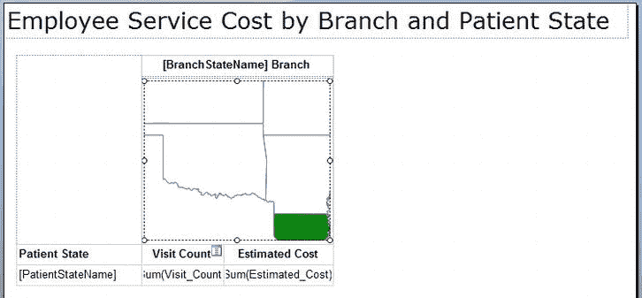
    ***图 13-65.** 分组和格式化后，按分支机构和患者州显示的员工服务成本*
22. 我们快完成了！最后一个要求是能够从此报表钻取到我们之前部署的名为`Emp_Svc_Cost_By_Patient_State_RB3_Drill`的详细报表。为此，我们将在地图上创建一个操作。为此，再次单击一个州以调出“地图图层”窗口。像之前一样单击向下箭头，选择“多边形属性”，然后单击“操作”选项卡。选择“转到报表”选项，然后单击“浏览”按钮选择单击地图时要运行的报表。导航到`Pro_SSRS`文件夹并选择`Emp_Svc_Cost_By_Patient_State_RB3_Drill`报表。单击“打开”返回“多边形属性”窗口。由于钻取报表需要两个参数，我们需要指定将传递哪些参数。单击“添加”按钮两次，并如图 13-66 所示设置“名称”和“值”对。单击“确定”保存“多边形属性操作”设置。

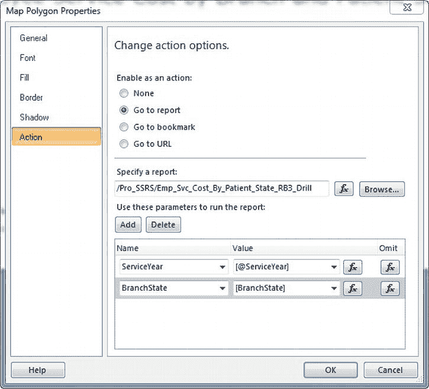

`图 13-66。` 多边形属性操作设置

呼！真有趣！点击 `运行` 按钮来实际执行我们完成的报表吧。如果您已执行了前面的步骤，您完成的报表应该会接近于 图 13-67。

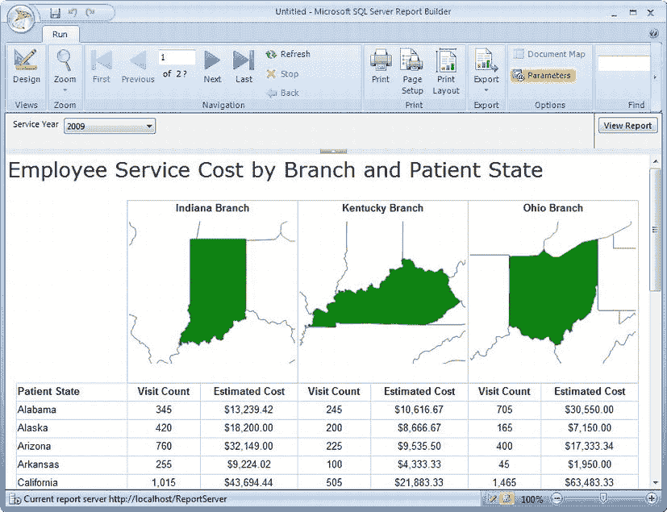

`图 13-67。` 按分支和患者所在州呈现的员工服务成本报表

运行报表后，点击某个分支的 `所在州` 地图以钻取到详细报表。例如，如果您点击 `服务年份 2009` 的 `俄亥俄州`，结果将如 图 13-68 所示。

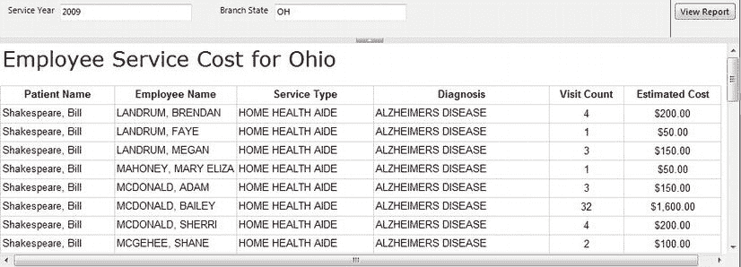

`图 13-68。` 按分支和患者所在州钻取的员工服务成本详细报表

### 报表部件

`SSRS 2008 R2` 新增了一项功能，它提供了即席报表的真正强大之处。正如我们之前简要提到的，报表部件可以被创建并部署到报表服务器，其唯一目的就是供其他报表开发人员或即席报表作者使用。报表部件不仅有助于通过可重用性保持一致性，还能提高报表制作的效率。报表部件令人惊叹的一点是，当报表使用报表部件后，如果对报表部件进行了更改，那么所有使用它的报表都会收到变更通知。报表作者可以选择使用新版本，或者保留报表当前使用的现有版本。我知道这很棒，它是 `报表生成器` 工具中一个非常受欢迎的新增功能。

在开始示例之前，请注意并非所有报表项都能发布为报表部件。工具箱中的大多数报表项都可以用作报表部件，但并非全部。可以使用的报表项列表如下：

- `Tablix` – `表`、`列表` 和 `矩阵`
- `图表`
- `仪表`
- `地图`
- `矩形`
- `图像`
- `参数`

我们将把现有报表作为报表部件部署到 `报表服务器`。我们可以使用 `报表设计器` 或 `报表生成器` 来完成，但由于我们正在展示 `报表生成器 3.0` 的功能，我们将向您展示如何在 `报表生成器` 中打开现有报表并进行部署。部署完成后，我们将展示使用 `报表生成器 3.0` 的报表作者如何“消费”或重用已部署到 `报表服务器` 的报表部件。打开 `报表生成器`，我们开始吧。操作步骤如下：

1.  启动 `报表生成器` 后，点击左上角的 `报表生成器` 图标，然后点击 `打开`。
2.  导航到您解压 `Pro_SSRS` 解决方案的位置，并找到 `EmployeeSvcCost_RB3_ReportPart.rdl` 文件。点击 `打开` 以在 `报表生成器 3.0` 中加载报表。
3.  点击 `运行` 查看报表的实际效果。该报表显示了一个饼图，其中包含每个分支的预估成本，如 图 13-69 所示。
    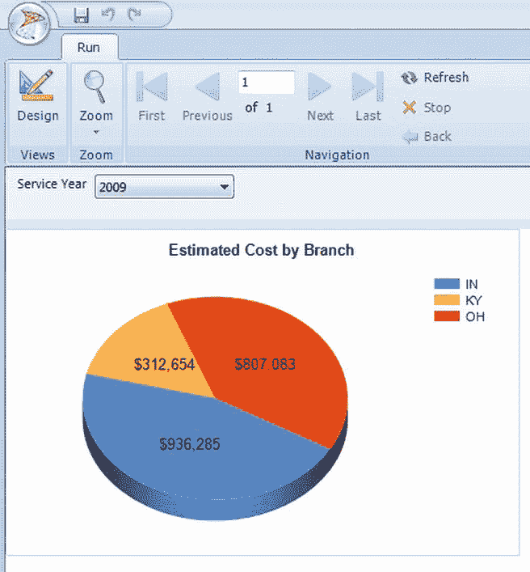
    `图 13-69。` `EmployeeSvcCost_RB3_ReportPart` 报表
4.  点击 `设计` 按钮返回设计模式。再次点击 `报表生成器` 菜单按钮，并选择 `发布报表部件`，如 图 13-70 所示。
    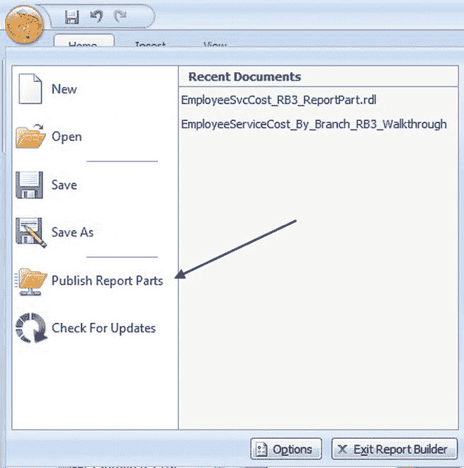
    `图 13-70。` 发布报表部件
5.  在 `发布报表部件` 屏幕上，我们有两个选项：`使用默认设置发布所有报表部件` 或 `发布前审阅并修改报表部件`。我们可以选择前者，但为了展示部署单个报表项的能力，请选择后者：`发布前审阅并修改报表部件`，如 图 13-71 所示。
    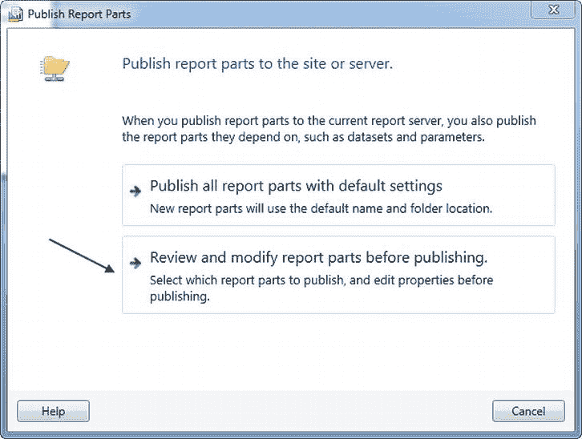
    `图 13-71。` 发布前审阅
6.  如 图 13-72 所示，我们可以选择部署报表中的两个项目。第一个是 `EstimatedCostByBranch_Pie` 图表，第二个是我们的 `ServiceYear` 报表参数。由于 `图表` 需要该参数，请确保两者都被选中，然后点击 `发布` 将我们的图表部署到报表服务器。
    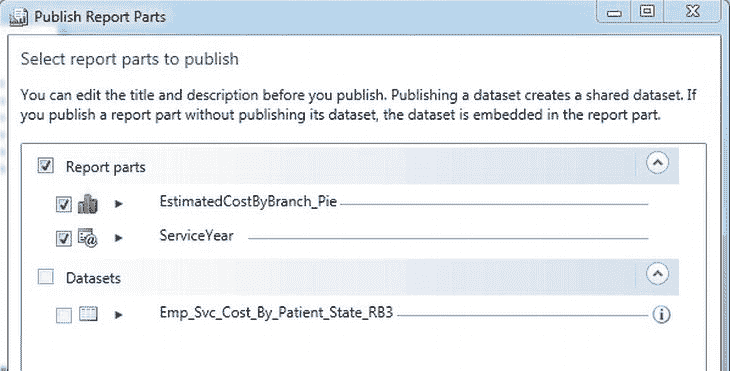
    `图 13-72。` 发布选定的报表部件
7.  如果在报表服务器上权限设置恰当（`内容管理员`），您应该在选定的报表部件旁边看到两个绿色的勾选标记。点击 `关闭` 返回 `报表生成器`。
8.  现在我们已部署了报表部件，是时候创建一个使用该报表部件的报表了。再次点击 `报表生成器` 菜单按钮，选择 `新建`，然后选择创建 `空白报表`。新报表加载后，将报表标题更改为“按分支预估成本”。
9.  点击功能区中的 `插入` 选项卡，然后选择 `报表部件`。您应该会看到 `报表部件库` 窗格在屏幕右侧显示，如 图 13-73 所示。从 `报表部件库` 窗口中，您可以搜索报表部件，查看有哪些报表部件可用以及是谁创建的。您甚至可以在缩略图视图下预览报表部件的外观。
    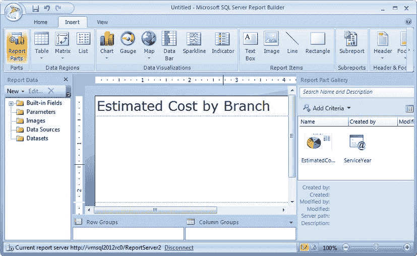
    `图 13-73。` 查看报表部件库
10. 在报表中使用报表部件非常简单，只需将其拖放到设计图面上即可。既然如此，将 `EstimatedCostByBranch_Pie` 图表拖到设计图面上，并使其左侧与标题对齐。点击 `开始` 选项卡，然后运行报表。使用 `服务年份 2009` 执行报表的效果可以在 图 13-74 中看到。
11. 将报表保存到 `报表服务器`，方法与前面的示例相同，名称为 `EstimatedCostByBranch_RB3_Report_Using_ReportPart`。在修改报表部件后，我们将稍后查看此报表。

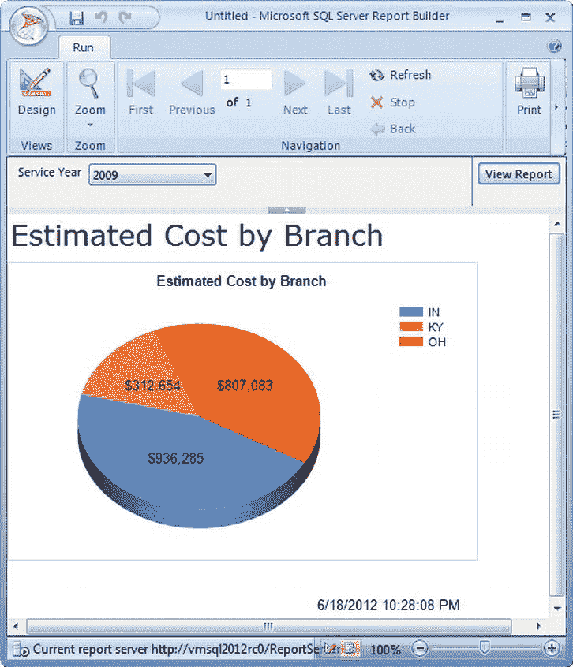

`图 13-74。` 使用已部署报表部件的报表

正如您所见，部署和使用报表部件是一个相当直接的过程。如果架构设计得当并有扎实的报表开发人员，许多报表部件可以存储在报表服务器上，并供报表作者重复使用，以简化报表开发。

 **注意** 本节（“报表部件”）中使用的报表名为 `EmployeeSvcCost_RB3_ReportPart.rdl`，它包含在我们本书自始至终都在使用的 `Pro_SSRS` 解决方案中。`Pro_SSRS` 解决方案可以在 Apress 网站 `(`[`www.apress.com`](http://www.apress.com)`)` 的本书源代码/下载区域找到。

您可能还记得，我之前提到过，当对报表部件进行更改并将其保存到报表服务器时，使用该报表部件的每个报表都会收到通知。请按照以下步骤查看实际操作：

> 1.  启动报表生成器后，点击左上角的 `Report Builder` 图标，然后点击 `Open`。
> 2.  导航到您解压 `Pro_SSRS` 解决方案的位置，并找到 `EmployeeSvcCost_RB3_ReportPart.rdl` 文件。点击 `Open` 以在报表生成器 3.0 中加载该报表。此报表与我们之前打开的报表相同。我们现在将对其进行微小更改，然后重新发布报表部件。
> 3.  将图表标题的字体颜色更改为蓝色并设置为斜体。不是重大更改，我们只是想看看更改报表部件时会发生什么。像之前一样，使用报表生成器菜单按钮中的 `Publish Report Parts` 功能部署报表部件。这次仅发布图表。
> 4.  现在，让我们打开我们保存到报表服务器上的 `EstimatedCostByBranch_RB3_Report_Using_ReportPart`，该报表包含原始报表部件的一个副本。点击 `Report Builder` 菜单按钮并选择 `Open`。导航到保存报表的报表服务器位置，并打开 `EstimatedCostByBranch_RB3_Report_Using_ReportPart` 报表。当您打开报表时，您应该会看到一个标题为“Updated Report Parts”的消息框在选项卡条和报表设计区域之间弹出（`图 13-75`）。这表明我们使用的报表部件已被更改。
>
>     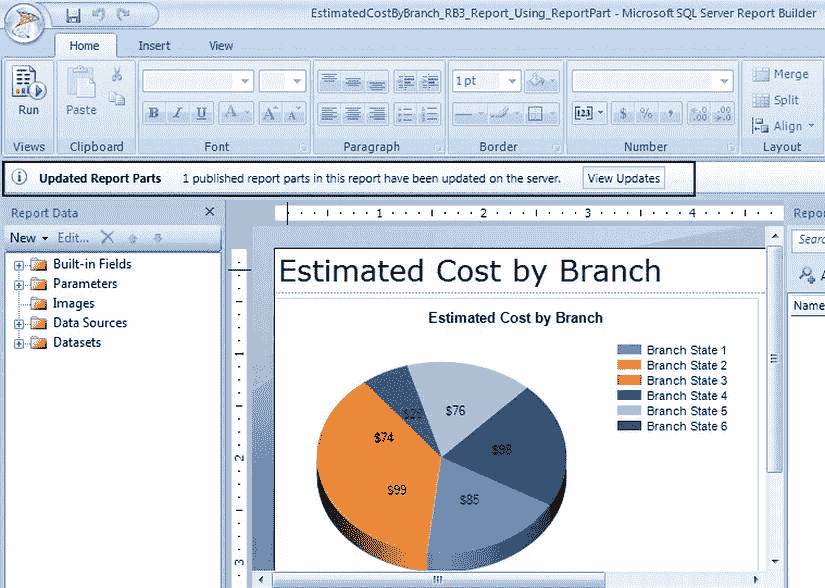
>
>     ***图 13-75.** 已更新报表部件的消息指示器*
>
>
> 5.  点击 `View Updates` 按钮查看发生了哪些变化。当“更新报表部件”屏幕出现时，我们应该能看到已更改的内容，以及在更改的报表部件旁边有一个复选框。如果我们将复选框留空，我们的报表将保持原样，不会接受这些新更改。相反，如果我们在复选框中打勾，它将用新的报表部件更新我们的报表。我们还可以在报表部件更新时禁用通知。这实质上是告诉 Reporting Services，该报表不关心报表部件是否曾经更改。如果您禁用此选项，将不会收到更改通知。点击复选框以更新 `EstimatedCostByBranch_Pie` 报表部件，然后点击 `Update`，如 `图 13-76` 所示。

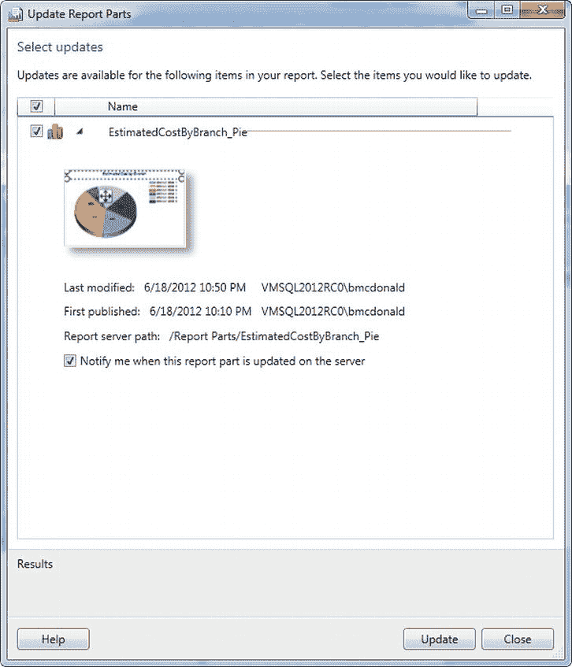

***图 13-76.** 更新使用了已更新报表部件的报表*

通过用更新后的报表部件更新我们的报表的结果可以看到，我们现在看到一个蓝色、斜体的图表标题。在我看来，内置于报表生成器 3.0 中的报表部件功能是迄今为止对即席报表功能的最佳补充之一。如果您和我一样，当您在为最终用户（他们属于报表作者角色）思考要创建哪些新的报表部件时，您的大脑可能正在飞速运转——从而使他们能够快速高效地创建即席报表。

## 总结

即席报表让用户能够即时创建自己的报表。这一直是任何报表平台高度要求的功能，Reporting Services 也不例外。如本章所示，Microsoft 决定以报表生成器 1.0 的形式交付他们的第一个即席报表版本。他们在报表生成器 2.0 中显著增强了用户体验，允许从关系数据源和 OLAP 数据源报告数据。随着 SQL Server 2008 R2 的发布，推出了 Microsoft 的最新版本——报表生成器 3.0。此外，我们向您展示了一个名为“报表部件”的惊人功能，它允许报表作者重用现有报表的节，从而节省数小时甚至数天的报表开发时间。在本章中，您了解了它们各自的优点和一些局限性。您可能已经得到了关于报表生成器是否是您的用户会想要的工具这个问题的答案。如果答案是“是”，正如我们希望的那样，那么好消息是这些功能都是作为标准功能包含在内的。

