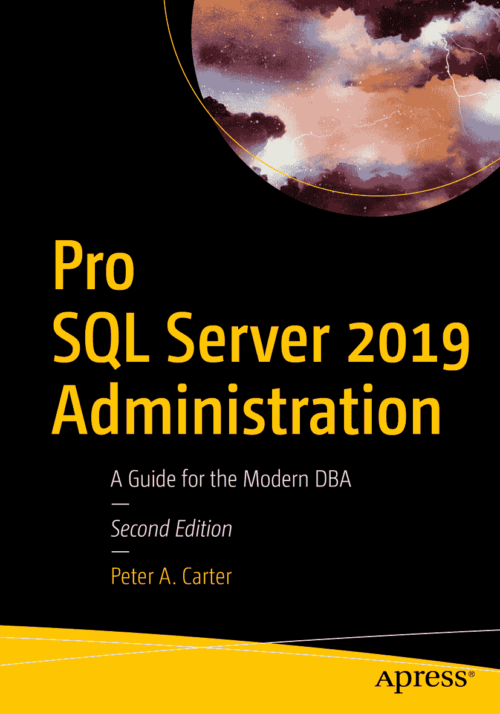

ISBN 978-1-4842-5088-4e-ISBN 978-1-4842-5089-1 [`doi.org/10.1007/978-1-4842-5089-1`](https://doi.org/10.1007/978-1-4842-5089-1) © Peter A. Carter 2019

本作品受版权保护。出版者保留所有权利，无论涉及材料的全部或部分，特别是翻译权、转载权、插图的再利用权、朗诵权、广播权、缩微胶片或其他任何物理形式的复制权，以及信息存储与检索、电子改编、计算机软件方面的传播权，或当前已知或未来开发的类似或不同方法。本书中可能出现商标名称、标识和图像。我们并非在每次提及商标名称、标识和图像时都使用商标符号，而是仅以编辑方式并为了商标所有者的利益而使用这些名称、标识和图像，绝无侵犯商标权之意。本出版物中对商品名称、商标、服务标志及类似术语的使用，即使未特别标识，也不应被视为表达这些术语是否受专有权利约束的意见。尽管本书中的建议和信息在出版时被认为是真实和准确的，但作者、编辑或出版商均不对可能出现的任何错误或遗漏承担法律责任。出版商对本出版物所含材料不作任何明示或暗示的担保。本书通过 Springer Science+Business Media New York 在全球图书贸易中发行，地址：233 Spring Street, 6th Floor, New York, NY 10013。电话：1-800-SPRINGER，传真：(201) 348-4505，电子邮件：orders-ny@springer-sbm.com，或访问网站：www.springeronline.com。Apress Media, LLC 是加利福尼亚州的有限责任公司，其唯一成员（所有者）是 Springer Science + Business Media Finance Inc (SSBM Finance Inc)。SSBM Finance Inc 是特拉华州的一家公司。

*本书献给爱德华·卡特。*

## 引言

*《Pro SQL Server 2019 Administration》*是一本为管理本地 SQL Server 实例的数据库管理员（DBA）设计的书籍。本书首先涵盖了在 Windows 和 Linux 环境中安装 SQL Server 的内容。同时还探讨了如何在容器中安装和配置 SQL Server，我相信这是未来托管许多数据层应用程序的方向。

然后，本书转向讨论管理 SQL Server 的配置和维护方面。这包括优化表、创建索引和运行数据一致性检查。这些都是每位 DBA 应该熟悉的核心要素。

接下来，我们将探讨如何确保 SQL Server 的安全性和韧性。这是一个重要主题，我们将深入研究诸如 SQL Server 安全模型和加密等领域。然后，我们将介绍如何为数据库提供高可用性和灾难恢复。这包括从执行备份（和还原）到实现复杂的 AlwaysOn 拓扑等所有内容。

最后，本书将指导您了解 DBA 应该理解的许多性能故障排查和维护任务。范围从理解锁、使用 Extended Events 执行跟踪，到利用一些真正出色的 SQL Server 功能，如查询存储（Query Store）、分布式重放（Distributed Replay）和基于策略的管理（PBM）。我们还将探讨如何使用元数据来自动化维护例程，并使用 SQL Server 代理来安排这些任务。

在本书中运行代码示例时，您应更改代码中的“个性化”部分，例如文件夹结构和文件名，以匹配您自己的配置。

## 致谢

我要感谢 Chris Dent，一位专注于 PowerShell 的领先自动化专家。他协助我提高了本书部分章节中使用的 PowerShell 代码质量。

## 关于作者和关于技术评审者

### 关于作者

### 关于技术评审者

