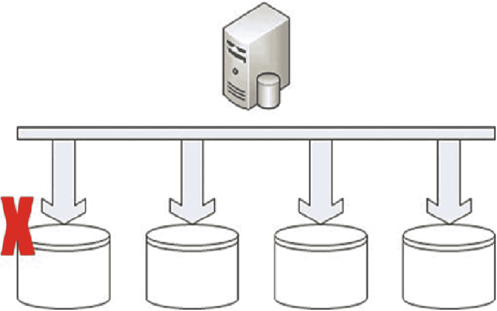
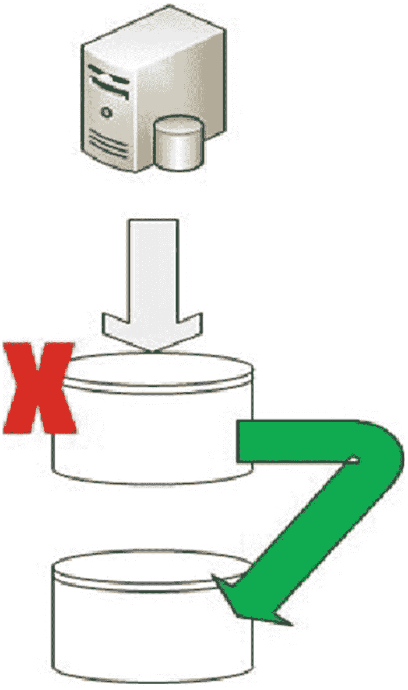
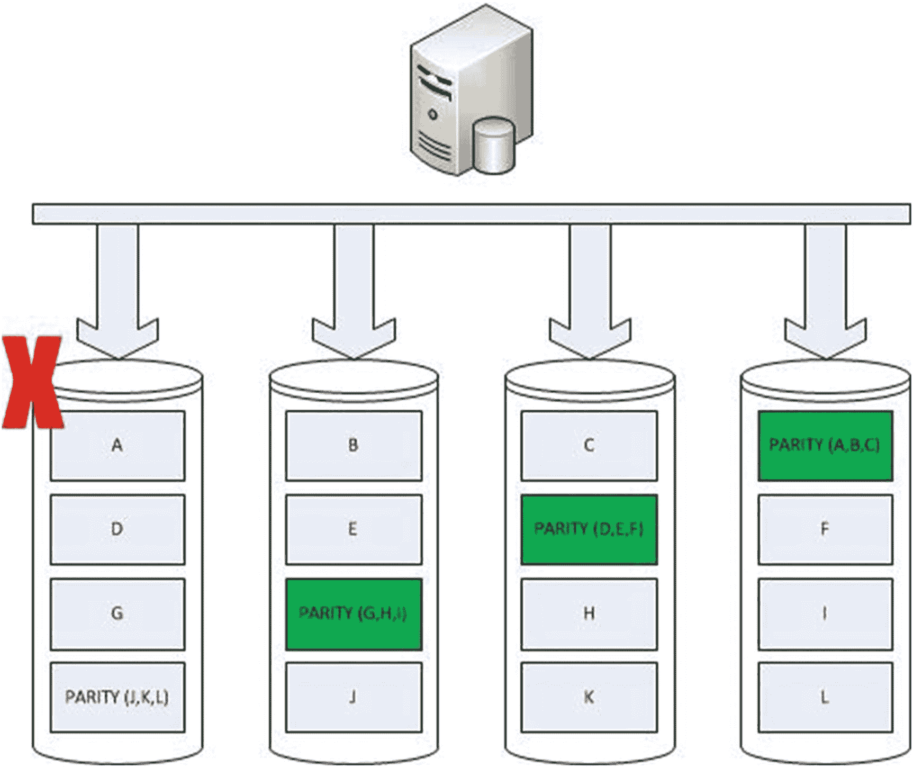
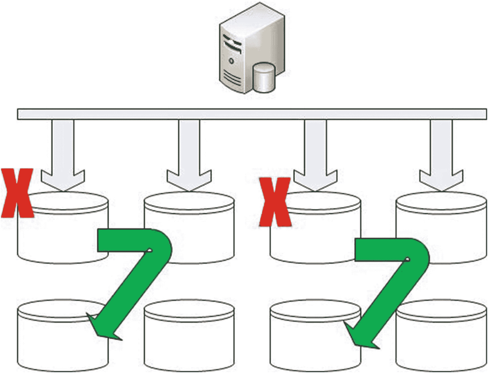
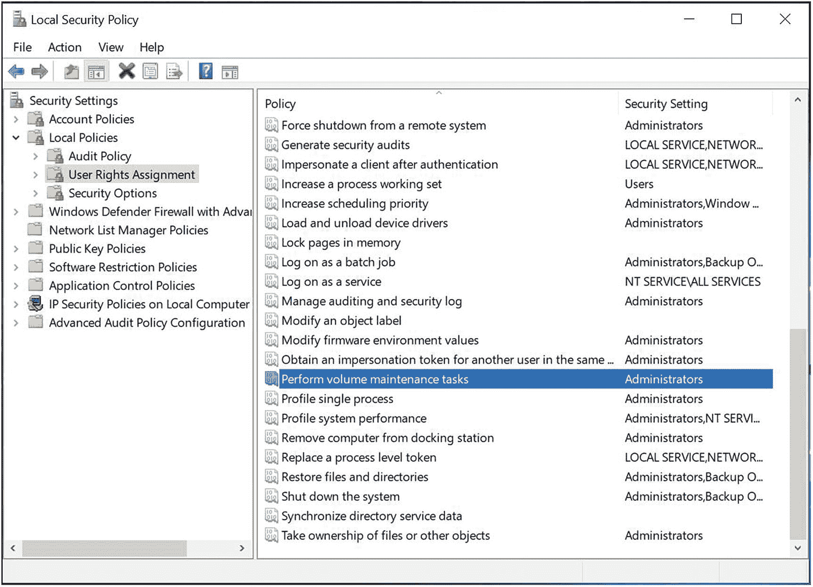
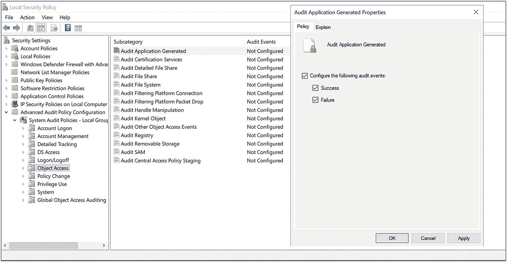
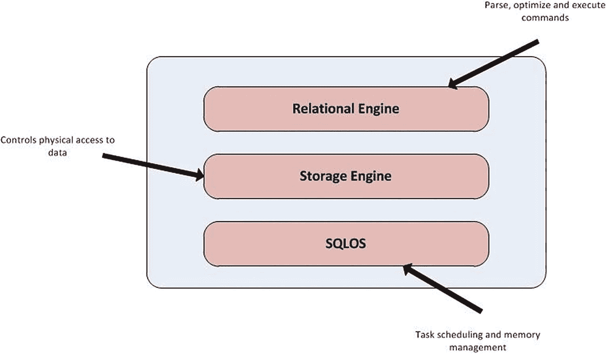

# 第一部分 安装与配置

## 第 1 章 规划部署

规划 SQL Server 2019 的部署，以最好地支持业务需求，可能是一项复杂的任务。您应确保考虑许多方面，包括版本、许可要求、本地托管与云托管、硬件注意事项、软件配置，甚至 Windows 是否是最佳平台。例如，如果您的新实例将支持托管在 Linux 上的 PHP Web 应用程序，那么也许您的实例也应该托管在 Linux 上？而所有这些甚至是在您开始考虑可能需要安装哪些 SQL Server 功能来支持应用程序之前。

本章将指导您在规划部署时应做出的关键决策。如果您决定在 Windows Server 上托管实例，您还将学习如何执行一些基本的操作系统配置。本章还将概述您可以选择安装的主要功能，并讨论为何选择适当的功能很重要。


### 版本与许可模型

选择 SQL Server 2019 的版本以支持你的数据层应用，听起来可能是一项简单的任务，但实际上，你应该花时间仔细考虑这个决定，并与业务相关人员及其他 IT 部门协商，将他们的意见纳入决策中。首先要考虑的是 SQL Server 有五个版本。这些版本不仅在功能级别上有所不同，而且在许可考量方面也存在差异。此外，从运营支持的角度来看，你可能会发现，如果允许数据层应用托管在你的环境中未进行战略性部署的 SQL Server 版本上，那么该环境的`TCO`（总体拥有成本）就会增加。

关于功能和许可考量的详细讨论超出了本书的范围；不过，表 1-1 详细列出了 SQL Server 各个版本可用的许可模式，而表 1-2 则概述了每个版本的主要用途。

表 1-1: `SQL Server 版本许可模式`

| 版本 | 许可模式 | 说明 |
| --- | --- | --- |
| 企业版 | 按处理器核心许可 | – |
| 标准版 | • 按处理器核心许可 • `服务器 + 客户端访问许可证` | – |
| Web 版 | 仅限第三方托管 | – |
| 开发者版 | 免费用于非商业用途 | 不得用于生产环境 |
| Express 版 | SQL Server 的免费版本 | 功能有限且容量上限较小，例如数据库大小上限为 10GB、内存限制为 1GB、CPU 限制为单路或四核 |

`CAL` 是客户端访问许可证，其中客户端可以指用户或设备。你可以根据哪种方式对你的环境成本更低，来选择购买用户 CAL 或设备 CAL。

例如，如果你的组织有一台支持呼叫中心的 SQL Server，该中心有 100 台计算机，并且 24/7 运行，分为三个 8 小时轮班，那么你将有 100 台设备和 300 名用户，因此设备`CAL`将是你最明智的选择。

另一方面，如果你的组织有一台支持 25 人销售团队的 SQL Server，这些人员不仅通过笔记本电脑，还通过 iPad 连接到销售应用，那么你将有 25 名用户和 50 台设备，因此选择用户`CAL`会是更明智的选项。

总结来说，如果你的用户数量多于设备数量，则应选择设备`CAL`。反之，如果你的设备数量多于用户数量，则应选择用户`CAL`。微软还提供了一个名为 SQL Server 评估和规划 (`MAP`) 工具包的工具，可帮助你规划许可需求。`MAP` 工具包可从 `www.microsoft.com/en-gb/download/details.aspx?id=7826` 下载。

表 1-2: `SQL Server 版本概览`

| 版本 | 版本概览 |
| --- | --- |
| 企业版 | SQL Server 的全功能版本，适用于企业系统和关键应用 |
| 标准版 | 核心数据库和`BI`（商业智能）功能，面向部门级系统和非关键应用 |
| Web 版 | 仅适用于托管使用 SQL Server 的公共网站的服务提供商 |
| 开发者版 | 全功能版本，与企业版功能级别相同，但仅供开发使用，不允许在生产系统上使用 |
| Express 版 | SQL Server 的免费入门级版本，面向具有本地数据需求的小型应用 |

你选择在企业应用中支持的 SQL Server 版本将取决于项目需求、组织要求和底层基础设施。例如，如果你的组织在其私有云中托管整个 SQL Server 环境，那么你可能只会支持企业版，因为你将对底层基础设施进行许可。

或者，如果你的组织主要使用物理服务器，那么你很可能需要支持混合的 SQL Server 版本，例如企业版和标准版。这将为项目提供灵活性，如果它们只需要功能的子集且不期望高负载工作量，从而可以接受标准版对`RAM`和`CPU`施加的限制，进而降低成本。

在选择使用哪个版本之前，你应该考虑的下一件事是是否使用`Windows Server Core`安装 SQL Server。在`Server Core`上安装可以通过减少服务器的受攻击面来帮助提高安全性。`Server Core`是最小化安装，因此受攻击面更小，安全漏洞也更少。它还可以提高性能，因为你没有`GUI`（图形用户界面）的开销，并且许多资源密集型应用无法安装。如果你决定使用`Server Core`，那么了解这样做的各种影响也很重要。

从 SQL Server 的角度来看，以下功能无法使用：

-   Reporting Services
-   `SQL Server Data Tools (SSDT)`
-   Client Tools Backward Compatibility
-   Client Tools SDK
-   `SQL Server Books Online`
-   Distributed Replay Controller
-   `Master Data Services (MDS)`
-   `Data Quality Services (DQS)`

以下功能可以使用，但只能从远程服务器使用：

-   Management Tools
-   Distributed Replay Client

从更广泛的运营支持角度来看，你需要确保所有的运营团队（DBA、Windows 运维等）都能够支持`Server Core`。例如，如果你的 DBA 团队严重依赖某个第三方图形工具来分析执行计划，这个工具是否需要安装在服务器本地？是否有可以满足他们需求的替代工具？从 Windows 运维的角度来看，团队是否拥有用于远程监控和管理服务器的工具？他们是否依赖任何需要被替换的第三方工具？

你还应该考虑你的运营团队是否具备主要使用命令行流程来管理系统的技能。如果没有，那么你应该考虑可能需要哪些培训或技能提升。

### 硬件考量

在规划服务器的硬件需求时，理想情况下，你应该实施一次完整的容量规划，以便能够估算服务器将要支持的应用程序的硬件需求。在进行此项工作时，请确保考虑到你公司标准的硬件生命周期，而不是仅仅为当前规划。根据你的组织情况，这可能在 1 到 5 年之间，但通常会是 3 年。

这对于避免服务器配置不足或过度配置非常重要。项目团队通常希望过度配置其服务器以确保性能。这种方法不仅在企业范围内扩展时成本高昂，而且在某些环境中，实际上可能对性能产生不利影响。例如，一个具有共享资源的私有云基础设施就是这种情况。在这种情况下，过度配置服务器可能对整个环境（包括被过度配置的服务器本身）产生负面影响。


#### 指定战略性最低要求

在为您的环境指定 SQL Server 的最低硬件要求时，您可以选择指定安装 SQL Server 的最低要求——`4GB` 内存和单个 `2GHz` CPU（基于企业版）。然而，您可能更需要考虑企业内的运营可支持性。

例如，如果您的环境主要由私有云基础设施组成，那么您可能希望指定最低 `2 个虚拟核心` 和 `4GB 内存 +（核心数 ∗ 1GB）`，因为这可能符合您的企业标准。

另一方面，如果您有一个高度分散、自然成长的企业，并且您希望帮助说服项目使用共享的 SQL Server 场，您可能会选择强制执行更高的最低规格，例如 `32GB 内存` 和 `2 插槽/4 核心`。这里的理由是，任何没有大吞吐量需求的项目都会被“强制”使用您的共享场，以避免与不必要的庞大系统相关的高昂成本。

#### 存储

存储是任何 SQL Server 安装的一个非常重要的考虑因素。以下部分将讨论本地连接存储和 SAN（存储区域网络）存储，以及文件放置的考虑因素。

##### 本地连接存储

如果您的服务器将使用本地连接存储，那么您应该仔细考虑文件布局。从本质上讲，SQL Server 通常受到输入/输出（`IO`）的限制，因此，配置 `IO` 子系统是性能的关键方面之一。您首先需要将用户数据库的数据文件和日志文件分离到不同的磁盘或阵列上，并且还要分离使用最频繁的系统数据库 `TempDB`。如果所有这些文件都驻留在单个卷上，那么当 SQL Server 试图同时写入所有文件时，您很可能会遇到磁盘争用。

通常，本地连接存储会以 `RAID`（独立磁盘冗余阵列）阵列的形式呈现给您的服务器，并且有各种 `RAID` 级别可供选择。有许多 `RAID` 级别可用，但最常见的在以下部分中概述，并附有它们的优缺点。希望这将帮助您选择最合适的 `RAID` 级别，在性能和容错能力之间实现最佳平衡。

###### RAID 0

一个 `RAID 0` 卷由两个到 `n` 个主轴组成，数据位被条带化分布在阵列中的所有磁盘上。这提供了出色的性能；然而，它不提供容错能力。阵列中任何磁盘的丢失都意味着整个阵列将失败。如图 1-1 所示。



*图 1-1：RAID 0 阵列不提供冗余*

#### 注意

由于 `RAID 0` 不提供冗余，因此不应用于生产系统。

###### RAID 1

一个 `RAID 1` 卷将由两个主轴组成，作为镜像对一起工作。这在一个主轴发生故障时提供了冗余，但这是以牺牲写入性能为代价的，因为对卷的每次写入都需要执行两次。这种冗余方法如图 1-2 所示。



*图 1-2：RAID 1 通过镜像磁盘提供冗余*

#### 注意

计算 `RAID 1` 阵列总 `IOPS`（每秒输入/输出操作数）的公式如下：`IOPS = 读取次数 + (写入次数 * 2)`。

###### RAID 5

一个 `RAID 5` 卷将由三个到 `n` 个主轴组成，并提供阵列中恰好一个磁盘的冗余。因为数据块被条带化分布在多个主轴上，卷的读取性能会非常好，但同样，这是以牺牲写入性能为代价的。写入性能受到损害，因为冗余是通过将奇偶校验位分布在阵列中的所有主轴上来实现的。这意味着对卷的每一次写入都会有四次写入的性能损失。这与阵列中的磁盘数量无关。这种固定损失的原因是奇偶校验位与数据以相同的方式条带化。控制器将读取原始数据和原始奇偶校验，然后写入新数据和新的奇偶校验，而无需读取阵列中的所有其他磁盘。这种冗余方法如图 1-3 所示。

然而，值得注意的是，如果阵列中的一个主轴发生故障，性能将明显下降。同样值得注意的是，从其对等盘包含的奇偶校验位重建磁盘可能需要相当长的时间，尤其是对于大容量的磁盘。



*图 1-3：RAID 5 通过奇偶校验位提供冗余*

#### 注意

计算 `RAID 5` 阵列总 `IOPS` 的公式如下：`IOPS = 读取次数 + (写入次数 * 4)`。要计算每个主轴的预期 `IOPS`，您可以将此 `IOPS` 值除以阵列中的磁盘数量。这可以帮助您计算为实现性能目标，阵列中应有的最小磁盘数量。

###### RAID 10

一个 `RAID 10` 卷将由四到 `n` 个磁盘组成，但它始终是一个偶数。它提供了冗余和性能的最佳组合。它的工作原理是创建一个镜像条带。位被条带化（没有奇偶校验）分布在阵列中一半的磁盘上，就像 `RAID 0` 一样，但然后它们被镜像到阵列中的另一半磁盘上。

这被称为嵌套或混合 `RAID` 级别，这意味着只要没有故障的磁盘在同一个镜像对中，阵列中一半的磁盘可以丢失。如图 1-4 所示。



*图 1-4：RAID 10 通过镜像条带内的每个磁盘提供冗余*

#### 注意

计算 `RAID 10` 阵列总 `IOPS` 的公式如下：`IOPS = 读取次数 + (写入次数 * 2)`。与 `RAID 5` 类似，为了计算每个主轴的预期 `IOPS`，您可以将 `IOPS` 值除以阵列中的磁盘数量。这可以帮助您计算为实现性能目标，阵列中应有的最小磁盘数量。


###### 文件放置

普遍认为，`RAID 0` 不应用于任何 `SQL Server` 文件。我知道有些人建议 `RAID 0` 可能适用于 `TempDB` 文件。其理由是，频繁使用的 `TempDB` 通常需要非常快的性能，而且由于它在每次实例重启时都会重新创建，因此不需要冗余。这听起来完全合理，但如果你从正常运行时间的角度考虑，可能就会明白我为何不同意这个观点。

你的 `SQL Server` 实例需要 `TempDB` 才能运行。如果你丢失了 `TempDB`，那么你的实例就会宕机，如果 `TempDB` 无法重新创建，你将无法使实例恢复运行。因此，如果你将 `TempDB` 托管在 `RAID 0` 阵列上，而该阵列中的一个磁盘发生故障，你将无法使实例恢复运行，直到你完成以下操作之一：

1.  等待存储团队将 `RAID 0` 阵列恢复上线。
2.  以“最小配置模式”启动实例，并使用 `SQLCMD` 更改 `TempDB` 的位置。

到完成这些步骤中的任何一个时，你可能会发现利益相关者已经急得跳脚了，因此你可能会发现最好避免这个选项。为此，`TempDB` 通常最好尽可能放置在 `RAID 10` 阵列上。这将为数据库提供最佳的性能水平，而且由于其大小远小于用户数据库文件，因此成本影响没有那么大。

在理想的世界里，资金不是问题，用户数据库的数据文件将存储在 `RAID 10` 阵列上，因为 `RAID 10` 提供了冗余性和性能的最佳组合。然而，在现实世界中，如果你支持的应用程序并非关键任务，这可能就不合理了。如果是这种情况，那么 `RAID 5` 可能是一个不错的选择，前提是你的应用程序具有相当高的读写比。我通常以读操作三倍于写操作作为良好的基准，当然，这在每个场景中可能有所不同。

如果你的数据库仅使用 `SQL Server` 的基本功能，那么你可能会发现 `RAID 1` 是日志文件的一个好选择。`RAID 5` 通常不适合，因为事务日志具有写入密集型的性质。在某些情况下，我甚至发现 `RAID 1` 对于事务日志的性能优于 `RAID 10`。这是因为写入活动的顺序性质。

然而，`SQL Server` 的某些功能可能会从事务日志产生大量的读取活动。如果是这种情况，那么你可能会发现你的事务日志以及数据文件都需要 `RAID 10`。导致事务日志读取的功能包括：

*   AlwaysOn 可用性组
*   数据库镜像
*   快照创建
*   备份
*   `DBCC CHECKDB`
*   变更数据捕获
*   日志传送（包括备份，以及使用 `WITH STANDBY` 还原日志时）

###### 固态硬盘 (SSD)

使用本地连接存储而非存储区域网络 (`SAN`) 的一个常见原因，是为了优化 `SQL Server` 组件中需要极快速 `IO` 的性能。这些组件包括 `TempDB` 和缓冲池扩展。数据库的数据文件和日志文件存储在 `SAN` 上，而 `TempDB` 和缓冲池扩展存储在本地连接存储上，这种情况并不少见。

在这个例子中，在本地连接阵列中使用 `SSD` 是很有意义的。固态硬盘 (`SSD`) 可以提供非常高的 `IO` 速率，但与传统磁盘相比成本更高。`SSD` 也不是“万能药”。尽管它们为随机磁盘访问提供了非常高的 `IOPS`，但对于某些数据库工作负载配置文件（如数据仓库）中常见的顺序扫描活动，效率可能较低。`SSD` 也容易发生突然故障，而不像传统磁盘那样逐渐老化。因此，在阵列中配置容错 `RAID` 级别和热备盘是一个非常好的主意。

###### 使用 SAN

存储区域网络这三个词可能会让数据库管理员 (`DBA`) 心生畏惧。现代的 `DBA` 必须接受诸如 `SAN` 和虚拟化等概念；然而，尽管它们带来了根本性的变化，但也简化了环境的总体管理并降低了总拥有成本 (`TCO`)。

`DBA` 关于 `SAN` 最需要记住的是，它改变了 `IO` 子系统的基本原则，`DBA` 必须相应地调整他们的思维。例如，在本地连接存储的世界里，最基本的原则是分离你的数据文件、日志文件和 `TempDB`，并确保它们都托管在最合适的 `RAID` 级别上。

然而，在 `SAN` 的世界里，你最初可能会惊讶地发现你的 `SAN` 管理员不提供 `RAID` 级别的选择，即使提供，也可能不提供 `RAID 10`。如果你发现情况如此，很可能是因为 `SAN` 在后台实际上是将数据条带化跨越阵列中的每个磁盘。这意味着尽管 `RAID` 级别仍然可能对吞吐量产生一些影响，但更重要的考虑是选择哪个存储层级。

许多组织选择在他们的 `SAN` 上对存储进行分层，提供三个或更多层级。第 1 层将是最顶层，很可能由 `SSD` 和小型、高性能的光纤通道驱动器组合而成。第 2 层通常由更大的驱动器组成——可能是 `SATA`（串行高级技术附件）——第 3 层通常使用近线存储。近线存储由大量廉价的磁盘组成，例如通常处于停止状态的 `SATA` 磁盘。只有当需要访问它们包含的数据时，磁盘才会旋转启动。正如你可能已经猜到的，你需要确保任何需要良好性能的应用程序都必须位于 `SAN` 的第 1 层。第 2 层可能适用于小型、很少使用、并发很少或没有的数据库，而第 3 层应该很少（甚至从不）用于存储 `SQL Server` 数据库或日志。

你的实际吞吐量将由这些因素以及许多其他因素决定，例如服务器与 `SAN` 之间的网络路径数量、同时访问 `SAN` 的服务器数量等等。`SAN` 的另一个有趣之处在于，你经常会发现你的写入性能远远优于读取性能。这是因为一些 `SAN` 使用电池支持的写入缓存，但在读取时，它们需要从主轴检索数据。

接下来要考虑的是，由于你的所有数据很可能都条带化分布在阵列的所有主轴上——即使不是这样，单个服务器上的所有文件也很可能都位于同一个 `CPG`（通用配置组）上——你不应该期望通过分离数据、日志和 `TempDB` 文件来立即看到性能提升。然而，许多 `DBA` 仍然选择将他们的数据、日志和 `TempDB` 文件放在单独的卷上，以实现逻辑分离并与使用本地连接存储的其他服务器保持一致。然而，在某些情况下，如果你使用 `SAN` 快照或 `SAN` 复制实现冗余，你可能需要将数据库的数据文件和日志文件放在同一个卷上。你应该与你的存储团队确认这一点。


##### 磁盘块大小

配置磁盘时（无论是本地连接还是 SAN 上的磁盘），另一个需要考虑的因素是磁盘块大小。根据你的存储情况，默认的 NTFS（新技术文件系统）分配单元大小很可能被设置为 4KB。问题在于，SQL Server 将数据组织为八个连续的 8KB 页面，称为一个`区`。为了获得 SQL Server 的最佳性能，托管数据、日志和 TempDB 的卷的块大小应该与此对齐，并设置为 64KB。

你可以通过运行清单 1-1 中的 Windows PowerShell 脚本来检查磁盘块大小，该脚本使用`fsutil`来收集卷的 NTFS 属性。脚本假定`f:`是你希望确定其块大小的卷。请务必将此更改为你希望检查的驱动器盘符。同时确保以管理员身份运行该脚本。

```
##### 填入你要检查的驱动器盘符
$drive = "f:"
##### 初始化输出对象
$outputarray = new-object PSObject
$outputarray | add-member NoteProperty Drive $drive
##### 初始化输出
$output = (fsutil fsinfo ntfsinfo $drive)
##### 将 fsutil 的每一行拆分为单独的数组值
foreach ($line in $output) {
    $info = $line.split(':')
    $outputarray | add-member NoteProperty $info[0].trim().Replace(' ','_') $info[1].trim()
    $info = $null
}
##### 格式化并显示结果
$results = 'Disk Block Size for ' + $drive + ' ' + $outputarray.Bytes_Per_Cluster/1024 + 'KB'
$results
Listing 1-1
确定磁盘块大小
```

### 操作系统考虑因素

SQL Server 支持许多操作系统，包括多个版本的 Windows。然而，你很可能不希望允许在支持的任何操作系统版本上安装 SQL Server。例如，在你的 Windows 环境中，建议将特定版本的 SQL Server 与特定版本的 Windows 对齐。这会带来两个好处。

首先，这极大地减少了你为验收构建所需的测试工作量。例如，假设你决定只允许在你的环境中使用企业版。理论上，你仍然需要对十几个 Windows 版本进行操作验收。相反，如果你同时允许 SQL Server 企业版和标准版，但都将这两个版本与 Windows Server 2019 标准版对齐，那么你只需要为你支持的每个 SQL Server 版本进行一次验收。

第二个好处与平台的生命周期结束（EOL）相关。如果你允许 SQL Server 2017 安装在 Windows Server 2012 上，Windows 的主流支持结束日期是 2015 年 1 月，而 SQL Server 是 2021 年 7 月。往好了说，这会在你升级 Windows 时导致复杂性和停机；往坏了说，可能会导致本可避免的扩展支持成本。

### 配置操作系统

你的 Windows 管理团队是否有针对 Windows Server 2019 的“黄金构建”？即使他们有，这个构建是针对 SQL Server 优化的吗？除非他们专门为托管 SQL Server 制作了一个单独的构建，否则很可能没有。你需要的确切定制取决于 Windows 构建的配置方式、你的环境要求以及你的服务器将托管的数据层应用程序的要求。以下部分重点介绍了一些通常需要的更改。

#### 注意

*黄金构建*是操作系统的预定义模板，可以轻松安装到新服务器上，以减少部署时间并确保一致性。

#### 设置电源计划

将你的服务器设置为使用高性能电源计划非常重要。这是因为如果使用平衡电源计划，那么在空闲期间你的 CPU 可能会被限制。当服务器活动再次开始时，你可能会遇到性能问题。

你可以通过 Windows GUI 设置电源计划：打开控制面板中的“电源选项”控制台并选择“高性能”；或者你也可以使用 PowerShell/命令行。清单 1-2 通过将高性能电源计划的 GUID 作为`powercfg`可执行文件的`-setactive`参数的值传入来说明了这一点。

```
powercfg -setactive 8c5e7fda-e8bf-4a96-9a85-a6e23a8c635c
Listing 1-2
使用 PowerShell 设置高性能电源计划
```

#### 优化后台服务

确保你的服务器配置为优先考虑后台服务而非前台应用程序是良好实践。在实践中，这意味着 Windows 将调整其上下文切换算法，允许后台服务（包括 SQL Server 使用的那些）在处理器上拥有比前台应用程序更多的时间。

要确保“优化后台服务”已开启，进入控制面板的“系统”控制台，选择“高级系统设置”。在“系统属性”对话框中，选择“性能”部分内的“设置”。

优化后台服务也可以通过使用 PowerShell 来设置。清单 1-3 演示了使用 set-property 命令更新注册表中的`Win32PrioritySeperation`键。该脚本必须以管理员身份运行。

```
Set-ItemProperty -path HKLM:\SYSTEM\CurrentControlSet\Control\PriorityControl -name Win32PrioritySeparation -Type DWORD -Value 24
Listing 1-3
使用 PowerShell 设置“优化后台服务”
```

#### 分配用户权限

根据你希望使用的 SQL Server 功能，你可能需要为运行 SQL Server 服务的服务账户授予用户权限分配。这些分配允许安全主体在计算机上执行任务。对于 SQL Server 服务账户而言，它们为那些与操作系统交互的功能提供了启用某些 SQL Server 功能的权限。以下将讨论三个最常见的用户权限分配，这些权限在安装期间不会自动授予服务账户。

##### 初始化即时文件

默认情况下，当你创建或扩展文件时，该文件会被填充为 0。这个过程被称为“清零”文件，它会覆盖先前占用同一磁盘空间的任何数据。这样做的问题在于它可能需要一些时间，特别是对于大文件。

然而，可以覆盖此行为，使文件不清零。这会引入一个非常小的安全风险，即理论上仍然可以发现先前存在于该磁盘位置的数据，但这个风险如此之小，通常认为其远小于带来的性能收益。

为了使用即时文件初始化，必须向运行 SQL Server 数据库引擎的服务账户授予“执行卷维护任务”用户权限分配。一旦授予，SQL Server 将自动使用即时文件初始化。无需其他配置。

要通过 Windows GUI 授予该分配，从控制面板 ➤ 系统和安全 ➤ 管理工具中打开“本地安全策略”，然后依次展开“本地策略” ➤ “用户权限分配”。这将显示完整的分配列表。向下滚动直到找到“执行卷维护任务”。如图 1-5 所示。



图 1-5 本地安全策略

右键单击该分配并进入其属性，将允许你添加你的服务账户。


##### 在内存中锁定页面

如果 Windows 遇到内存压力，它会尝试将数据页从 RAM 分页到磁盘上的虚拟内存。这可能会在 SQL Server 内引发问题。为了提供可接受的性能，SQL Server 会将最近使用的数据页缓存在缓冲区缓存中，这是由 `数据库引擎` 保留的内存区域。实际上，所有数据页都是从缓冲区缓存中读取的，即使它们需要先从磁盘读取。如果 Windows 决定将页面从缓冲区缓存移出到磁盘，你的实例性能将受到严重影响。

为了避免这种情况的发生，只要使用的是 SQL Server 2019 企业版或标准版，就可以将缓冲区缓存的页面锁定在内存中。为此，你只需使用与授予 `执行卷维护任务` 权限相同的方法，授予运行 `数据库引擎` 的服务账户 `在内存中锁定页面` 的权限。

#### 注意

如果你在虚拟机上安装 SQL Server，根据虚拟平台的配置，你可能无法设置 `在内存中锁定页面`，因为它可能会干扰气球驱动程序。气球驱动程序是虚拟化平台用来从客户操作系统回收内存的。你应该与你的虚拟平台管理员讨论此事。

##### SQL 审核到事件日志

如果你计划使用 `SQL 审核` 来捕获实例内的活动，你可以选择将生成的事件保存到文件、安全日志或应用程序日志。如果你的企业有高安全性要求，安全日志将是最合适的位置。

为了允许将生成的事件写入安全日志，必须授予运行 `数据库引擎` 的服务账户 `生成安全审核` 的用户权限分配。这可以通过 `本地安全策略` 控制台实现。

另一个必要的步骤是，为了使 SQL Server 能够将审核事件写入安全日志，需要配置 `审核应用程序生成的` 设置。这可以在 `本地安全策略` 控制台中找到，路径是：`高级审核策略配置` ➤ `系统审核策略` ➤ `对象访问`。然后，可以如图 1-6 所示，修改 `审核应用程序生成的` 事件的属性。



图 1-6

审核应用程序生成的属性

#### 注意

你需要确保你的策略没有被 `组策略对象` 级别实施的策略覆盖。如果是这种情况，你应该要求你的 `AD`（活动目录）管理员将你的服务器移动到具有限制性较弱策略的单独 `OU`（组织单位）中。

### 选择功能

在安装 SQL Server 时，可能会诱人安装所有功能，以备将来不时之需。然而，为了你的环境的性能、可管理性和安全性，你应该始终遵循 `YAGNI`（你不会需要它）原则。`YAGNI` 原则源于极限编程方法学，但它同样适用于该平台。其前提是做最简单且能工作的事情。这将使你免于复杂性相关的问题。请记住，额外的功能可以在以后安装。以下各节概述了在安装 SQL Server 2019 企业版时可以选择的主要功能。

#### 数据库引擎服务

`数据库引擎` 是 SQL Server 套件中的核心服务。它包含 `SQLOS`（数据库引擎中负责内存管理、调度、锁和死锁管理等任务的部分）、`存储引擎` 和 `关系引擎`，如图 1-7 所示。它负责保护、处理和优化对关系数据的访问。它还包含可选择安装的复制组件、数据库内机器学习服务、用于搜索的全文和语义提取、`Polybase` 查询服务和 `DQS` 服务器功能。复制是一组允许你分散数据的工具。数据库内机器学习服务提供 `Python` 和 `R` 集成；语义提取允许你使用全文来搜索词语的含义，而不仅仅是关键字本身。`Polybase` 查询服务允许你针对 `Hadoop` 数据源运行 `T-SQL`。`DQS` 服务器是一个工具，可让你轻松查找和清理不一致的数据。本书主要关注核心的 `数据库引擎` 功能。



图 1-7

数据库引擎架构

#### 分析服务

`SSAS`（SQL Server 分析服务）是一组可用于数据分析和处理与数据挖掘的工具。它可以通过以下三种模式之一安装：

*   多维和数据挖掘

*   表格

*   用于 SharePoint 的 PowerPivot

多维和数据挖掘模式将提供托管多维数据集的能力。数据集聚合数据（称为 *度量值*）并存储，可以跨多个维度进行切片和切块，并提供响应迅速、直观且复杂的报告和数据透视表的基础。开发人员可以使用多维表达式（`MDX`）语言查询数据集。

表格模式使用户能够以 Microsoft 的 BI 语义模型托管数据。该模型使用 `xVelocity` 提供内存中分析功能，实现关系和非关系数据源之间的集成，并提供 `KPI`（关键绩效指标）、计算和多级层次结构。与使用维度和度量值不同，表格模型使用表、列和关系。

PowerPivot 是 `Excel` 的一个扩展，与表格模型类似，它使用 `xVelocity` 执行内存中分析，可用于大小不超过 2GB 的数据集。`用于 SharePoint 的 PowerPivot` 安装在此基础上进行了扩展，它在 SharePoint 模式下运行 `分析服务`，提供服务器端处理以及基于浏览器与 PowerPivot 工作簿交互；它还通过 `SharePoint Excel Services` 支持 `Power View` 报告和 `Excel` 工作簿。

#### 机器学习服务器

`机器学习服务器` 是一项为 `R` 和 `Python` 语言提供支持的服务。它还提供了一套 `R` 包、`Python` 包、解释器和基础设施的组合，提供了创建数据科学和机器学习解决方案的能力。这些解决方案随后可以导入、探索和分析异构数据集。

#### 数据质量客户端

如前所述，`数据质量服务器` 作为 `数据库引擎` 的可选组件安装。然而，`数据质量客户端` 可以作为共享功能安装。共享功能仅在服务器上安装一次，并由该机器上的所有 SQL Server 实例共享。该客户端是一个 `GUI`，允许你管理 `DQS` 以及执行数据匹配和数据清理活动。

#### 客户端连接工具

`客户端连接工具` 是一套用于客户端/服务器通信的组件。这包括 `OLEDB`、`ODBC`、`ADODB` 和 `OLAP` 网络库。


#### 集成服务

集成服务是 SQL Server 随附的一个功能强大、基于图形界面的 ETL（提取、转换和加载）工具。从 SQL Server 2012 开始，集成服务被纳入数据库引擎。尽管如此，仍需安装集成服务选项才能使该功能正常工作，因为它包含了该功能所依赖的二进制文件。

集成服务包由一个*控制流*组成，负责管理和流程操作，包括批量插入、循环和事务。控制流还包含零个或多个数据流。*数据流*是一组数据源、转换和目标，它为合并、分散和转换数据提供了一个强大的框架。

集成服务可以在多台服务器上进行横向扩展，包含一个主服务器和 `n` 个工作服务器。因此，在 SQL Server 的较新版本中，您可以选择安装经典的、独立的集成服务，或者在服务器上安装横向扩展主服务器，或横向扩展工作服务器。

#### 客户端工具向后兼容性

客户端工具向后兼容性为 SQL Server 已停止支持的功能提供支持。安装此功能将安装 SQL 分布式管理对象和决策支持对象。

#### 客户端工具 SDK

安装客户端工具 SDK 将提供 `SMO（服务器管理对象）` 程序集。这允许您从 `.NET` 应用程序中以编程方式控制 SQL Server 和集成服务。

#### 分布式重放控制器

分布式重放是一项功能，允许您捕获跟踪信息，然后在另一台服务器上重放。这使您可以测试性能调优或软件升级的影响。如果您觉得这听起来像是您可能熟悉的 Profiler 中的某个功能，那么您是正确的，两者有部分重叠。然而，分布式重放具有以下优势：

1.  分布式重放对资源的影响低于 Profiler，这意味着您正在跟踪的服务器在跟踪运行期间遭受性能问题的风险更低。
2.  分布式重放允许您从多台服务器（客户端）捕获工作负载，然后在单台主机上重放。

在分布式重放拓扑中，您需要将一台服务器配置为控制器。正是控制器将针对客户端和目标服务器协调工作。

#### 分布式重放客户端

如前所述，多个客户端服务器可以协同工作以创建将在目标服务器上重放的工作负载。分布式重放客户端应安装在您希望使用分布式重放捕获跟踪信息的任何服务器上。

#### SQL 客户端连接 SDK

客户端连接 SDK 为 SQL Native Client 提供了一个 SDK 以支持应用程序开发。它还提供了其他接口，例如支持在客户端应用程序中进行堆栈跟踪。

#### 主数据服务

主数据服务是用于管理企业内主数据的工具。它允许您对映射到业务实体的数据域进行建模，并通过层次结构、业务规则和数据版本控制来帮助您管理这些域。选择此功能时，将安装以下组件：

*   一个用于提供管理功能的 Web 控制台
*   一个允许您配置 MDM 数据库和 Web 控制台的配置工具
*   一个为开发人员提供可扩展性的 Web 服务
*   一个用于创建新实体和属性的 Excel 插件

#### 注意

在 SQL Server 2016 及更高版本中，管理工具不包含在 SQL Server 安装介质中。要安装它们，您可以使用 SQL Server 安装中心“安装”页面上的 `安装 SQL Server 管理工具` 链接。在 SQL Server 2019 中，报表服务也不包含在安装介质中。可以使用 SQL Server 安装中心“安装”页面上的 `安装 SQL Server 报表服务` 链接来安装它。

### 总结

规划部署可能是一项复杂的任务，需要与业务和技术利益相关者进行讨论，以确保您的平台将满足应用程序要求并最终满足业务需求。有许多因素需要考虑。

请确保考虑安装哪个版本的 SQL Server 是合适的，以及该版本的相关许可注意事项。在做出此决定时，您应考虑整个环境的整体可支持性，而不仅仅是特定应用程序的需求。您还应考虑 Azure 托管选项是否适合您的应用程序，或者甚至可能是涉及本地和云托管的混合方法。

在规划部署时，请确保进行彻底的容量规划。同时考虑应用程序的硬件要求。您将需要多少 RAM 和多少个处理器内核是重要的考虑因素，但也许主要的考虑因素是存储。SQL Server 通常是一个 I/O 密集型应用程序，因此存储通常可能成为瓶颈。

您还应考虑操作系统的要求。这不应仅限于最合适的 Windows 版本，还应包括操作系统的配置。仅仅因为有一个 Windows 金牌镜像可用，这是否意味着它针对您的 SQL Server 安装进行了最优配置？

最后，考虑应选择安装哪些功能。大多数应用程序只需要一小部分功能，通过仔细选择您需要的功能，您可以减少安装的安全足迹，同时降低管理开销。

