# 2. GUI 安装

您可以通过运行 SQL Server 的 `setup.exe` 应用程序来调用 SQL Server 安装中心。安装中心提供了许多实用程序，将帮助您安装实例；这些包括链接和工具，以帮助您规划部署、独立和群集安装功能，以及高级工具，这些工具将允许您使用配置文件或基于准备好的镜像来构建实例。

本章将概述安装中心提供的选项，然后指导您使用图形用户界面安装 SQL Server 的过程。它还将针对对实例的持续可支持性至关重要的决策提供实用的建议。

### 安装中心

SQL Server 安装中心是与规划、安装和升级 SQL Server 实例相关的所有活动的一站式平台。当您运行 SQL Server 安装介质时，首先看到的就是这个应用程序。安装中心由七个选项卡组成，以下部分将描述这些选项卡的内容。


#### 规划选项卡

规划选项卡如图 2-1 所示，包含指向 MSDN（Microsoft Developer Network）页面的众多链接，这些页面为您提供关于 SQL Server 的重要文档，例如完整的硬件和软件要求以及 SQL Server 安全模型的文档。

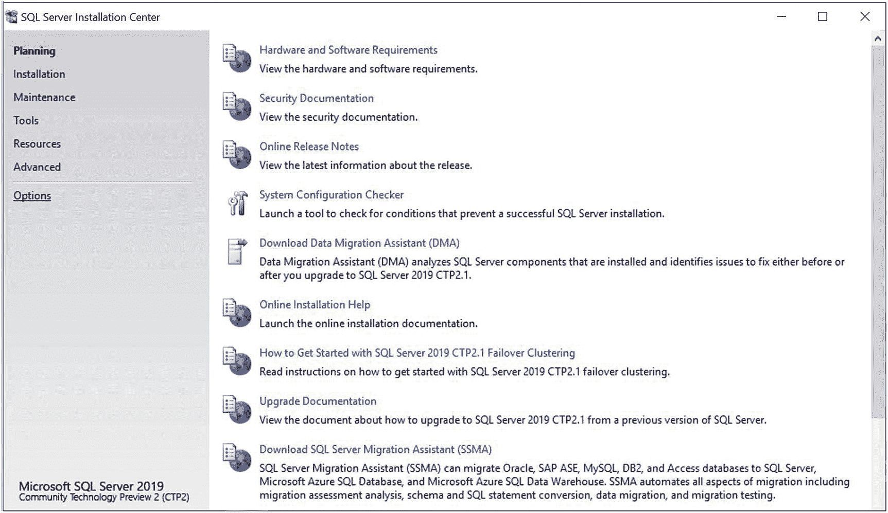
图 2-1: 规划选项卡

除了通过提供的链接访问文档外，您还可以使用两个工具。第一个是 `System Configuration Checker`。此工具在安装过程中运行，以确定是否存在任何会阻止 SQL Server 安装的条件。这些检查包括确保服务器未配置为域控制器，以及检查 WMI（Windows Management Instrumentation）服务是否正在运行。在您开始安装 SQL Server 之前运行此工具，它可以预先警告您任何可能导致安装失败的问题，以便您在开始安装前进行修复。`System Configuration Checker` 也可在安装中心的 `Tools` 选项卡上找到。

第二个工具（或者更准确地说，是其下载页面的链接）是 `Data Migration Assistant`。此工具可用于在升级到 SQL Server 2019 时检测兼容性问题，并推荐性能和可靠性方面的增强功能。

#### 安装选项卡

如图 2-2 所示，安装中心的 `Installation` 选项卡包含您将用于安装新的 SQL Server 实例、向现有实例添加新功能或从 SQL Server 2005、2008 或 2012 升级实例的工具。要安装独立的 SQL Server 实例，您应选择 `New SQL Server Stand-Alone Instance Or Add New Features To An Existing Instance` 选项。

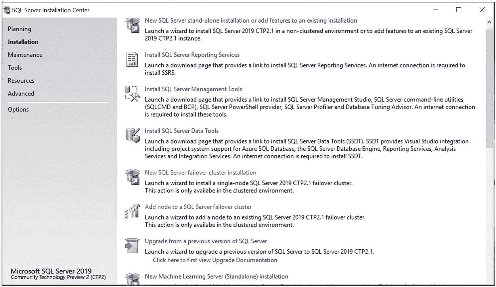
图 2-2: 安装选项卡

除了安装独立实例、向实例添加新功能以及将现有实例升级到最新版本外，此屏幕上还有用于安装 SQL Server 故障转移群集实例以及向现有故障转移群集添加新节点的选项。*故障转移群集* 是一个系统，其中 2 到 64 台服务器协同工作，以提供冗余并防止因一台或多台服务器停止功能而导致的故障。参与群集的每台服务器称为 *节点*。

`SQL Server Database Engine` 和 `SQL Server Analysis Services` 都是“群集感知”应用程序，这意味着它们可以安装在 Windows 群集上并利用其故障转移功能。当安装在故障转移群集上时，数据库和事务日志位于共享存储上，群集中的任何节点都可以使用该存储，但二进制文件则本地安装在每个节点上。

还有一些指向 SQL Server 组件下载页面的链接，这些组件不再随数据库安装介质一起提供。这些包括用于 T-SQL 和 BI 开发的工作室 `SQL Server Data Tools`、用于 SQL Server 的管理和开发界面 `SQL Server Management Studio`，以及允许服务器托管和分发报表的 `SQL Server Reporting Services`。

最后，此页面包含安装独立 `Machine Learning Server` 实例的选项。这不需要安装 SQL Server 实例，并提供对 R 和 Python 语言的支持。它还提供了一系列 R 包、Python 包、解释器和基础设施——从而提供了创建数据科学和机器学习解决方案的能力。这些解决方案随后可以导入、探索和分析异构数据集。

#### 维护选项卡

`Maintenance` 选项卡包含用于执行版本升级、修复损坏的实例以及从群集中移除节点的工具；如图 2-3 所示，它还包含一个用于运行 Windows Update 的链接。

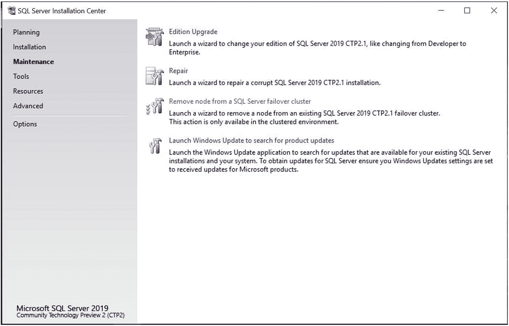
图 2-3: 维护选项卡

您可以使用 `Edition Upgrade` 选项将现有的 SQL Server 2019 实例从一个版本升级到另一个版本；例如，您可能希望将一个安装为开发人员版的实例升级到企业版。

您可以使用 `Repair` 选项尝试解决 SQL Server 安装损坏的问题。例如，如果注册表项或二进制文件损坏导致实例无法启动，您可以使用此工具。

#### 提示

如果 Master 数据库损坏并导致实例无法启动，此 `Repair` 选项将无济于事。在这种情况下，您应使用命令行或 PowerShell 运行 `setup.exe`，并将 `ACTION` 参数设置为 `REBUILDDATABASE`。

使用 `Remove Node From A SQL Server Failover Cluster` 选项可从故障转移群集中的某个节点移除 SQL Server。您可以将此选项作为驱逐节点过程的一部分。不幸的是，安装中心没有卸载实例的功能。您必须通过控制面板来完成此操作。

不出所料，您可以使用 `Launch Windows Update To Search For Product Updates` 选项来启动 Windows Update。然后，您可以选择安装可用于 SQL Server 的更新和修复程序。

#### 工具选项卡

`Tools` 选项卡包含一系列将帮助您安装 SQL Server 的工具，如图 2-4 所示。这包括我本章前面介绍的 `System Configuration Checker`；一个用于查找本地服务器上已安装的 SQL Server 组件的发现工具；以及 `Microsoft Assessment and Planning (MAP) tool`。

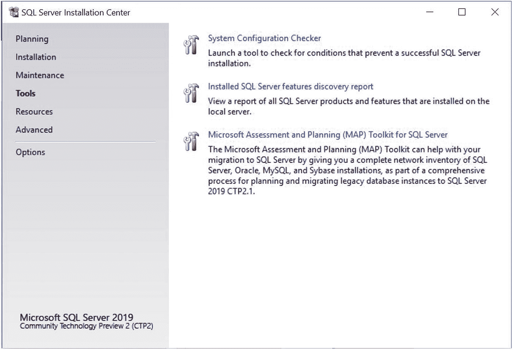
图 2-4: 工具选项卡

选择 `Installed SQL Server Features Discovery Report` 选项可分析本地服务器并返回所有已安装的 SQL Server 功能和组件的列表。这将包括从 SQL Server 2005 开始的所有版本的功能。

`Microsoft Assessment And Planning (MAP) Toolkit For SQL Server` 选项将为您提供一个链接，您可以从该链接下载适用于 SQL Server 的 MAP 工具。当您运行此工具时，它将在整个网络范围内搜索 SQL Server、Oracle 和 MySQL 安装。它将生成一份详细报告，对于 SQL Server，将包括组件的名称、版本和版本。对于 Oracle，它将包括每个架构的大小和使用情况，包括迁移复杂性的估计。您还可以使用此工具来规划迁移和整合策略，以及审核整个企业范围内的许可要求。

#### 资源选项卡

如图 2-5 所示，`Resources` 选项卡包含指向有关 SQL Server 的有用信息的链接。这包括指向 `SQL Server Books Online`、`Developer Center` 和 `SQL Server product evaluation` 站点的链接。此外，在此选项卡上，您还会找到指向 Microsoft 隐私声明和完整 SQL Server 许可协议的链接。另一个非常有用的链接是指向 `CodePlex samples site` 的链接。从此站点，您可以下载 `WideWorldImporters` 数据库，该数据库将帮助您使用预创建的数据库来测试 SQL Server 的功能。

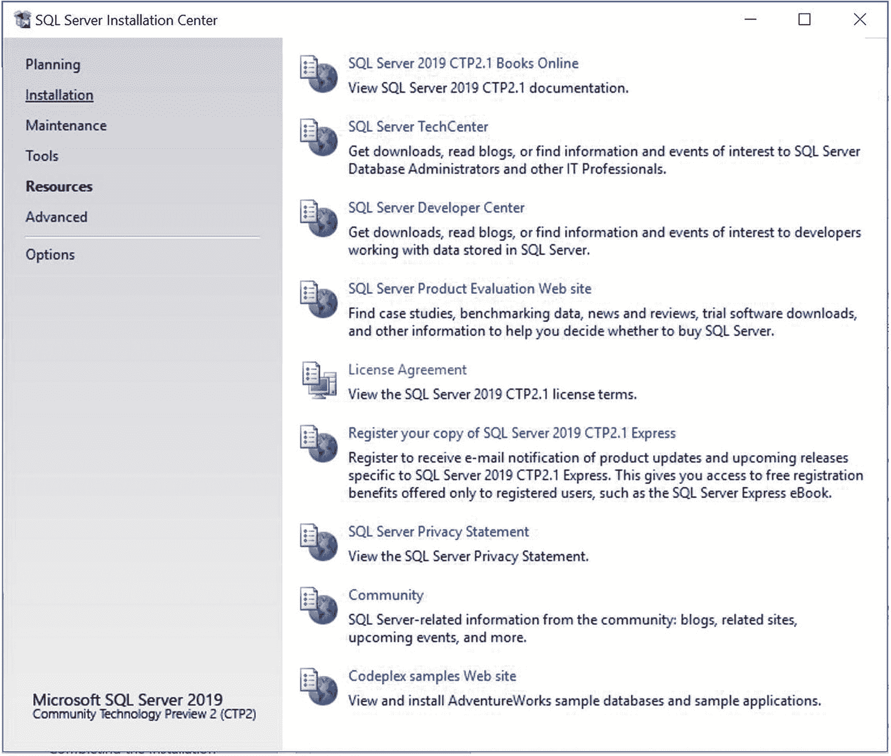
图 2-5: 资源选项卡


#### 高级选项卡

在**高级**选项卡上（如图 2-6 所示），可以找到用于执行 SQL Server 高级安装的工具，包括作为独立实例和作为集群的安装。这些工具包括 `Install Based On Configuration File`、`Advanced Cluster Preparation`、`Advanced Cluster Completion`、`Image Preparation Of A Stand-Alone Instance Of SQL Server` 和 `Image Completion Of A Stand-Alone Instance Of SQL Server`。

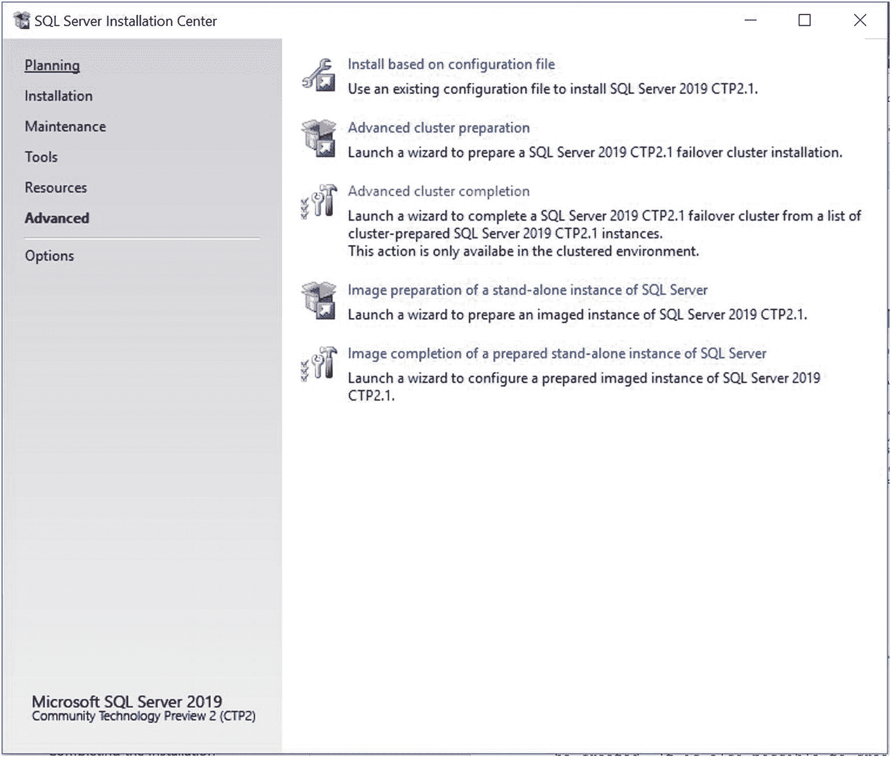

图 2-6

高级选项卡

安装 SQL Server 时，会自动创建一个配置文件。也可以手动创建此配置文件。然后，您可以使用此配置文件来安装具有相同配置的其他 SQL Server 实例。这对于在企业内推广一致性非常有用。创建此配置文件后，您可以使用 `Install Based On Configuration File` 选项，基于预先创建的配置来安装更多实例。配置文件对于命令行安装也很有用，这将在第 3 章中讨论。此外，您还可以使用配置文件进行集群准备。

如果您希望使用配置文件进行集群准备，那么您应该选择**高级**选项卡上的 `Advanced Cluster Preparation` 选项，而不是通过**安装**选项卡上可用的 `New SQL Server Failover Cluster Installation` 和 `Add Node To A SQL Server Failover Cluster` 向导来安装集群。您最初应在可以作为 SQL Server 实例的可能所有者的集群节点之一上运行此选项，系统将生成一个配置文件。随后在集群的所有其他可能所有者节点上运行 `Advanced Cluster Preparation` 向导，将导致使用该配置文件来确保整个集群安装的一致性。这种方法甚至适用于多子网集群（也称为地理集群），因为 SQL Server 会自动检测子网之间的关系，系统将提示您为每个子网选择一个 IP 地址。然后，安装程序将使用 OR 约束将每个 IP 地址作为依赖项添加到集群角色，其中每个节点不能是每个 IP 地址的可能所有者。或者，它将使用 AND 约束，其中每个节点可以是每个 IP 地址的可能所有者。

在每个作为集群实例可能所有者的节点上运行 `Advanced Cluster Preparation` 向导后，您可以运行 `Advanced Cluster Completion` 向导。您只需运行此向导一次，并且可以在任何可能所有者的节点上运行。此向导成功完成后，集群实例将完全正常运行。

`Image Preparation Of A Stand-Alone Instance Of SQL Server` 选项将使用 `Sysprep` 来安装 SQL Server 的“纯净”实例，该实例未配置账户、计算机或网络特定信息。它可以与 `Windows Sysprep` 结合使用，以构建带有已准备 SQL Server 实例的完整 Windows 模板，然后用于在整个企业范围内进行部署。这有助于强制保持一致性。在 SQL Server 2019 中，`Sysprep` 支持独立实例的所有功能；但是，不支持修复安装。这意味着如果在准备阶段或完成阶段的安装过程中失败，则必须卸载该实例。

要完成已准备映像的安装，您可以使用 `Image Completion Of A Prepared Stand-Alone Instance Of SQL Server` 选项。此选项允许您通过输入账户、计算机和网络特定信息来完成实例的配置。

#### 选项选项卡

如图 2-7 所示，SQL Server 安装中心的**选项**选项卡显示了您可以根据服务器中的处理器类型用于安装 SQL Server 的处理器架构。它还允许您指定安装媒体的路径。如果您在服务器本地存储了媒体副本，这会很有用。

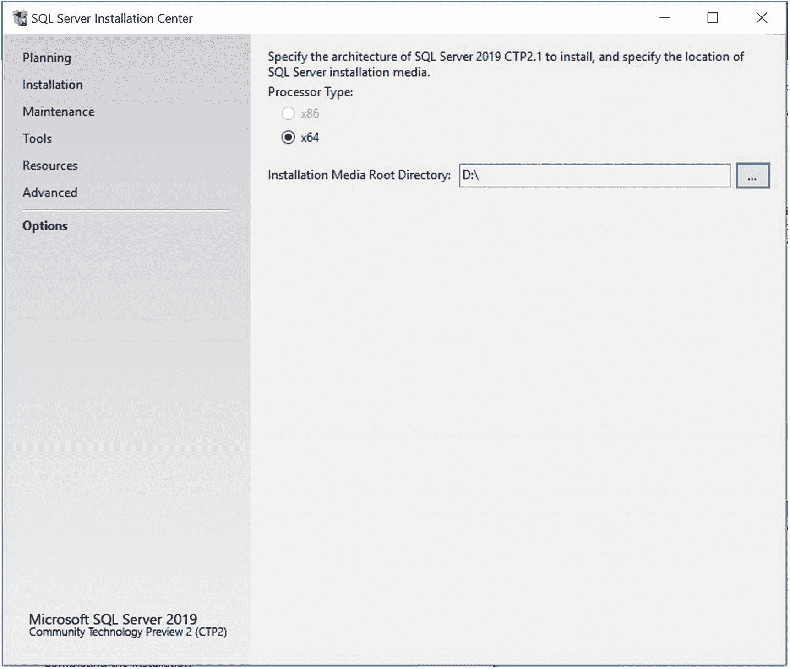

图 2-7

选项选项卡

### 安装独立数据库引擎实例

如前一节所述，SQL Server 实例可以通过多种方式安装，包括通过命令行、结合使用 `Sysprep` 与高级安装和配置文件，或使用**安装**选项卡上的 `New SQL Server Stand-Alone Installation Or Add Features To An Existing Installation` 选项。在下面的演示中，我们将使用最后一个选项来安装 SQL Server。在接下来的章节中，我们将安装一个包含将在本书中进一步详细研究的功能的数据库引擎实例，包括 `FILESTREAM` 和 `Distributed Replay`。我们还将深入探讨为实例选择正确的排序规则和服务账户。

#### 准备步骤

当您选择安装新的 SQL Server 实例时，向导的第一个屏幕将提示您输入 SQL Server 的产品密钥，如图 2-8 所示。

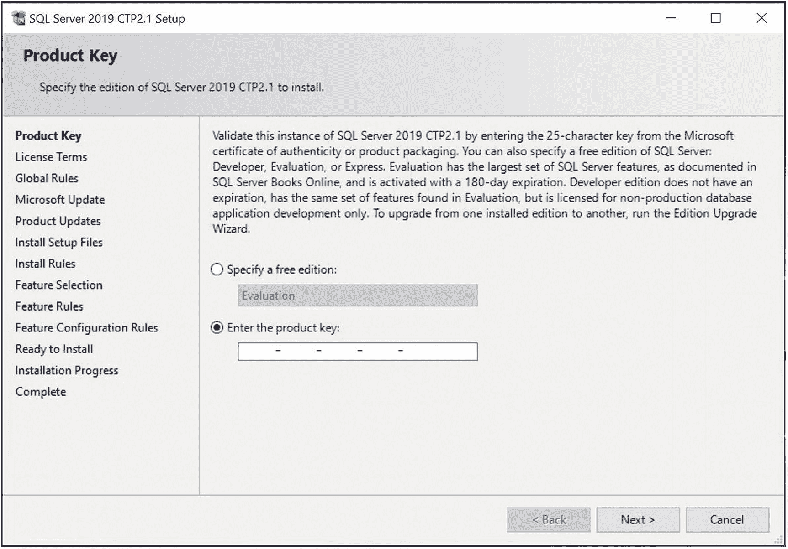

图 2-8

产品密钥页面

如果在此屏幕上不输入产品密钥，您将只能安装 SQL Server 的 Express 版、Developer 版或 Evaluation 版。Developer 版提供与 Enterprise 版相同级别的功能，但未授权用于生产环境。Evaluation 版具有与 Enterprise 版相同级别的功能，但会在 180 天后过期。

向导的下一个屏幕将要求您阅读并接受 SQL Server 的许可条款，如图 2-9 所示。此屏幕上提供的链接将为您提供有关 Microsoft 隐私政策的更多详细信息。

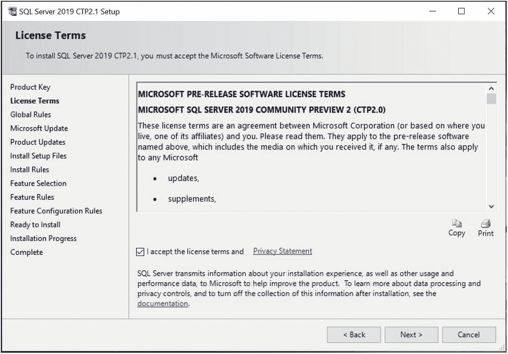

图 2-9

许可条款页面

接受许可条款后，SQL Server 安装程序将运行规则检查以确保可以继续安装，如图 2-10 所示。这与您可以从 SQL Server 安装中心的**计划**选项卡独立运行的配置检查相同，如本章前面所述。

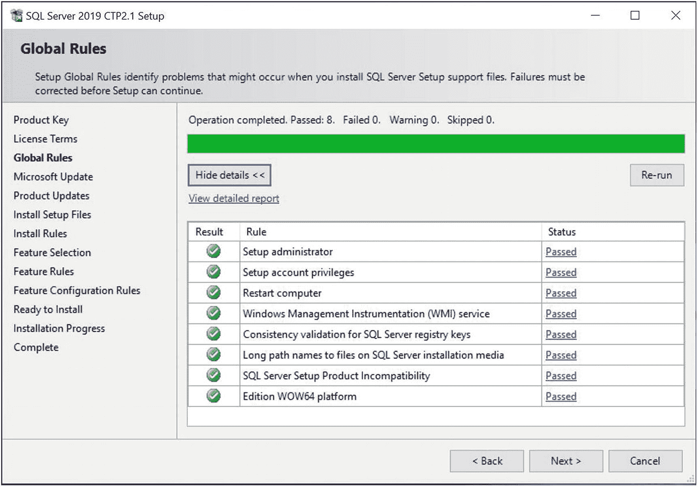

图 2-10

全局规则页面

假设所有检查均成功通过，向导的屏幕（如图 2-11 所示）将提示您选择是否希望 `Microsoft Update` 检查 SQL Server 补丁和 hotfix。此处的选择取决于您组织的修补策略。一些组织对补丁的测试和验收实施严格的修补方案，然后是修补周期，通常由 `WSUS (Windows Server Update Services)` 等软件支持。如果您的组织中存在这样的方案，则不应选择此选项。

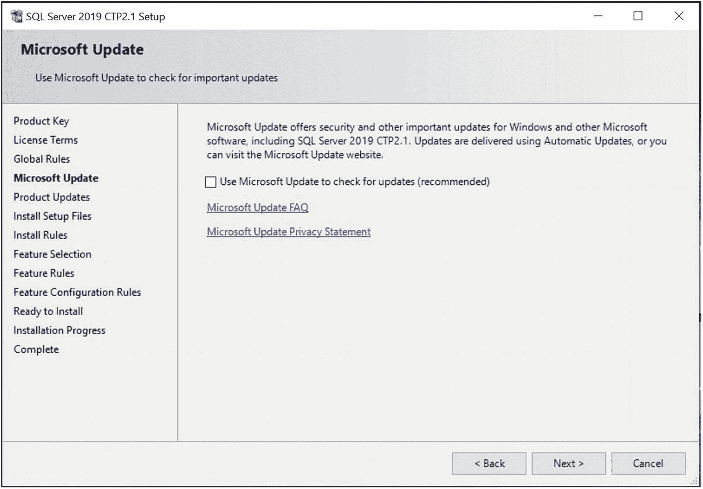

图 2-11

Microsoft Update 页面


#### 注意

仅当您的服务器尚未配置为接收 SQL Server 的产品更新时，此屏幕才会出现。

向导的下一个屏幕将尝试扫描 SQL Server 更新，以确保您在安装过程中安装了最新的 `CUs`（累积更新）和 `SPs`（服务包）。它将检查本地服务器上的 Microsoft 更新服务以获取这些更新，并列出任何可用的更新。这是流式安装功能的扩展，允许您通过指定更新位置，在安装基础二进制文件的同时安装更新，但此功能现已**已弃用**。产品更新页面也可以配置为在本地文件夹或网络位置中查找更新。此功能将在第 3 章中详细讨论。

#### 注意

如果未找到产品更新，则不会出现此屏幕。

随着安装程序进入向导的下一个页面（如图 2-12 所示），SQL Server 安装所需文件的提取和安装开始，并显示进度。此屏幕还显示产品更新找到的任何更新包的下载和提取进度。

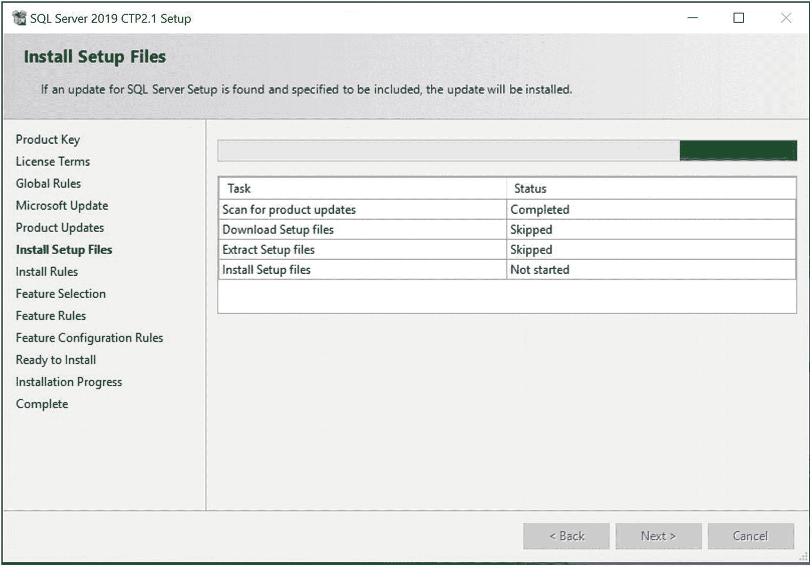

图 2-12：安装程序文件页面

如图 2-13 所示，向导的下一个屏幕运行安装规则检查，并显示在安装开始前您可能需要解决的错误或警告。

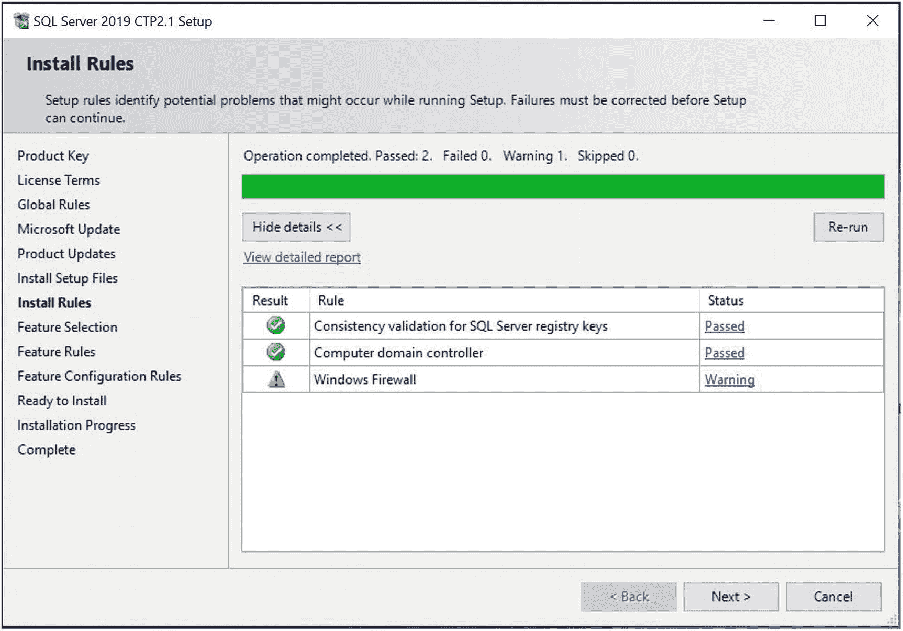

图 2-13：安装规则页面

在图 2-13 中，请注意显示的 Windows 防火墙警告。这不会阻止安装继续，但它会警告您服务器已开启 Windows 防火墙。默认情况下，Windows 防火墙未配置为允许 SQL Server 流量，因此必须创建规则才能使客户端应用程序能够与您正在安装的实例通信。我们将在第 5 章详细讨论 SQL Server 端口和防火墙配置。

假设在继续之前未发现需要解决的错误，向导的下一页将允许您选择应安装的功能。这将在下一节详细讨论。

#### 功能选择页面

安装向导的“功能选择”页面允许您选择要安装的选项。每个可用选项的概述可以在第 1 章中找到。功能选择页面如图 2-14 所示。

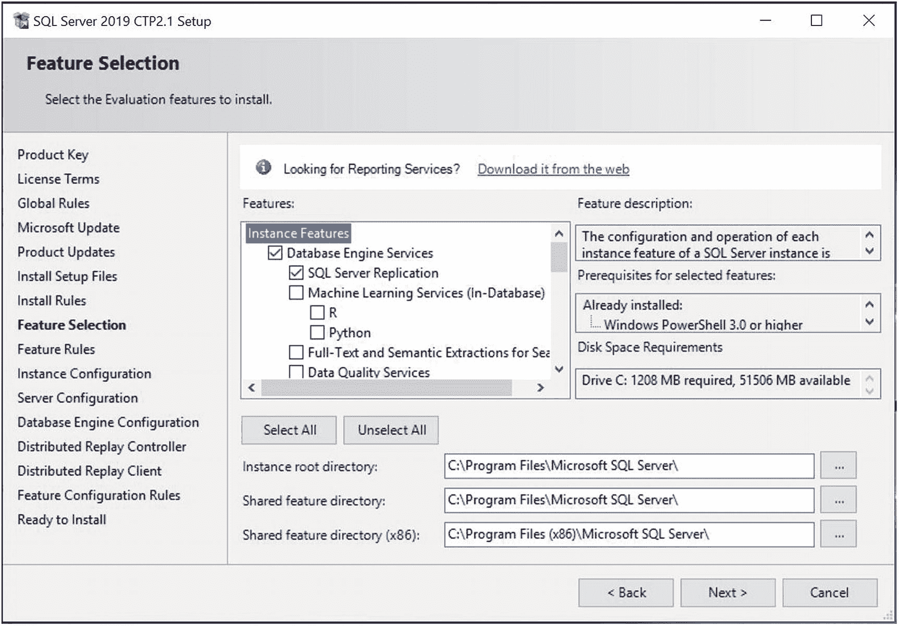

图 2-14：功能选择页面

我们将选择以下功能，因为它们将用于本书中的演示和讨论。

*   数据库引擎服务
    *   SQL Server 复制
*   客户端工具连接性
*   分布式重放控制器
*   分布式重放客户端

此外，向导的此页面要求您指定实例根目录和共享功能目录的文件夹位置。您可能希望将这些位置移动到不同的驱动器，以便将 `C:\` 驱动器留给操作系统。您可能出于空间原因或仅仅为了将 SQL Server 二进制文件与其他应用程序隔离而这样做。实例根目录通常将包含您在服务器上创建的每个实例的一个文件夹，并且数据库引擎、`SSAS` 和 `SSRS` 安装将有单独的文件夹。与数据库引擎关联的文件夹将称为 `MSSQL15.[实例名称]`，其中实例名称是您的实例名称，对于默认实例则为 `MSSQLSERVER`。此文件夹名称中的数字 `15` 与 SQL Server 的版本相关，SQL Server 2019 对应为 `15`。此文件夹将包含一个名为 `MSSQL` 的子文件夹，该子文件夹又将包含与您的实例关联的文件所在的文件夹，包括一个名为 `Binn` 的文件夹（其中包含与您的实例关联的应用程序文件、应用程序扩展和 XML 配置）、一个名为 `Backup` 的文件夹（它将作为数据库备份的默认位置）以及一个名为 `Data` 的文件夹（它将是系统数据库的默认位置）。`TempDB`、用户数据库和备份的默认文件夹可以在安装过程的后期修改，并且如第 1 章所述，在许多环境中将这些数据库拆分到单独的卷中是一种良好实践。这里还将创建其他文件夹，包括一个名为 `LOGS` 的文件夹，它将是错误日志和默认扩展事件运行状况跟踪文件的默认位置。

如果您在 64 位环境中安装 SQL Server，系统将要求您同时输入 32 位和 64 位版本的共享功能目录的文件夹。这是因为某些 SQL Server 组件始终作为 32 位进程安装。32 位和 64 位组件不能共享目录，因此为了使安装继续，您必须为这些选项中的每一个指定不同的文件夹。共享功能目录成为所有 SQL Server 实例共享的功能（例如 `SDKs` 和管理工具）的根级目录。

在向导的下一页（如图 2-15 所示），将执行额外的规则检查，以确保您选择的功能可以安装。

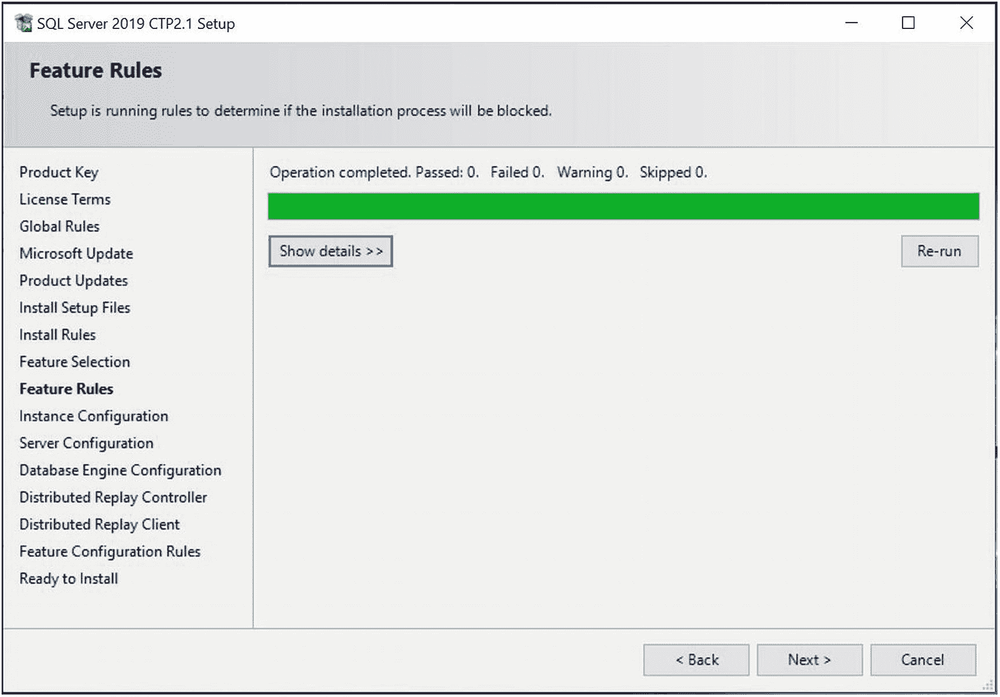

图 2-15：功能规则页面

检查的规则将根据您选择的功能而有所不同。


### 实例配置页面

规则检查成功完成后，安装向导的以下屏幕将允许您指定是要安装默认实例还是命名实例，如图 2-16 所示。屏幕下半部分的框将为您提供服务器上已安装的任何其他实例或共享功能的详细信息。

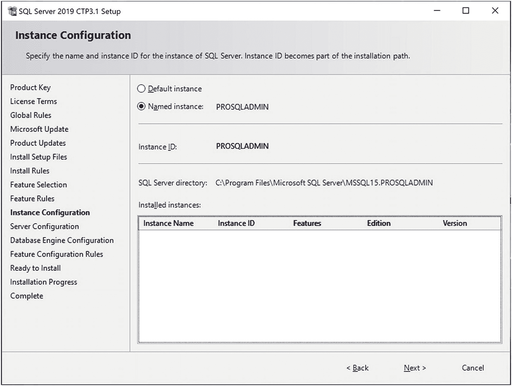

图 2-16

实例配置页面

默认实例与命名实例的区别在于，默认实例使用其安装所在的服务器名称，而命名实例则被赋予一个扩展名称。这有一个明显的副作用：一个服务器上只能有一个 `SQL Server` 默认实例，但可以有多个命名实例。使用 `SQL Server 2019`，单个服务器最多可托管 50 个独立实例。当然，这些实例将共享服务器的物理资源。对于故障转移群集，如果您的数据托管在 `SMB` 文件共享上，此数字保持不变；但如果使用共享群集磁盘进行存储，则减少到 25 个。

安装命名实例之前，并不需要先安装默认实例。服务器上只有命名实例而没有默认实例是一种完全有效的配置。许多 `DBA` 团队选择只在他们的环境中支持命名实例，以便能够在 `SQL Server` 层强制执行有意义的命名约定，而不是依赖构建服务器或虚拟机的基础设施团队所施加的命名约定。实例名称的最大长度为 16 个字符。默认情况下，`InstanceID` 将设置为实例名称，对于默认实例则为 `MSSQLSERVER`。虽然可以更改此 `ID`，但这是一种不良做法，因为此 `ID` 用于标识注册表项和安装目录。

### 选择服务帐户

向导的下一个屏幕分为两个选项卡。第一个选项卡允许您为每个 `SQL Server` 服务指定服务帐户，如图 2-17 所示，第二个选项卡允许您指定实例的排序规则。

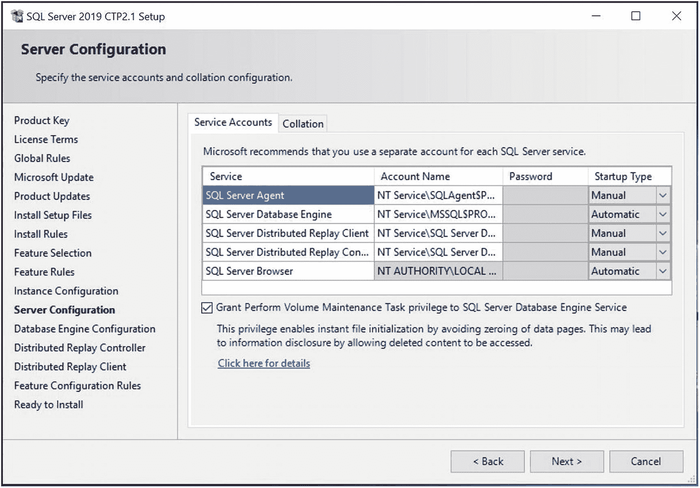

图 2-17

服务帐户配置页面

`SQL Server 2019` 支持使用本地和域帐户、内置帐户、虚拟帐户、`MSAs`（托管服务帐户）和 `gMSAs`（组托管服务帐户）作为运行服务的安全上下文。您选择的服务帐户模型对您环境的安全性和可管理性都至关重要。

不同的组织对服务帐户模型有不同的要求，您可能会受到合规性要求和许多其他因素的限制。本质上，您所做的选择是在环境的安全性和操作支持性之间进行权衡。例如，`Microsoft` 的最佳实践是为每个服务使用单独的服务帐户，并确保您环境中的每个服务器都使用一组离散的服务帐户，因为这完全强制执行了*最小权限原则*。*最小权限原则*规定，每个安全上下文将被授予执行其日常活动所需的最小权限集。

然而，在现实中，您会发现这种方法给您的 `SQL Server` 环境带来了显著的复杂性，并且可能增加操作支持的成本，同时在灾难场景中还可能增加停机窗口。另一方面，我也曾在服务帐户模型非常粗略的组织中工作过，以至于每个区域只有一组 `SQL Server` 服务帐户。这种方法也可能导致重大问题。假设您有一个大型环境，并且整个环境使用相同的服务帐户。再想象一下，您有一个合规性要求，需要每 90 天更改一次服务帐户密码。这意味着您将同时导致整个 `SQL Server` 环境的停机。这根本不实际。

这个问题没有绝对的对错答案，解决方案将取决于各个组织的需求和约束。然而，对于使用域帐户作为服务帐户的组织，我倾向于为每个数据层应用程序推荐一组不同的服务帐户。因此，想象一个环境，如图 2-18 所示，您的数据层应用程序在主站点由一个双节点群集和一个 `ETL` 服务器组成，在辅助站点有两台灾备服务器，这种设计将涉及所有这些实例共用的一组服务帐户，但其他数据层应用程序不允许使用这些帐户，需要它们自己的一组。

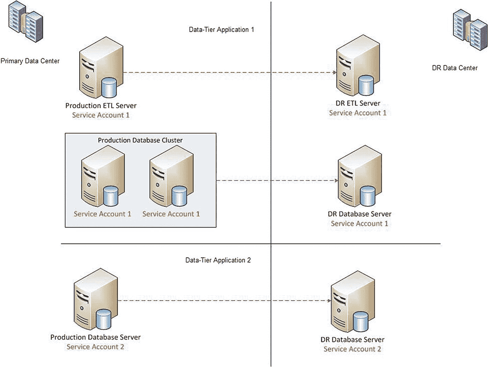

图 2-18

按数据层应用程序划分的服务帐户模型

当然，这种模型也带来了它自身的挑战。例如，如果您开始合并过程，就需要审查和修改此策略。由于围绕服务帐户管理的挑战，`Microsoft` 引入了虚拟帐户和 `MSA`。*虚拟帐户*是没有密码管理要求的本地帐户。它们可以使用创建它们的服务器的计算机身份访问域。另一方面，*托管服务帐户*是域级帐户。它们在 `AD`（活动目录）中提供自动密码管理，并且只要您的域运行的功能级别是 `Windows Server 2008 R2` 或更高版本，它们还会自动维护其 `Kerberos SPN`（服务主体名称）。

然而，这两种类型的帐户都有一个限制。它们只能在单个服务器上使用。如前所述，这可能会给您的 `SQL Server` 环境引入复杂性，特别是对于高可用的多服务器应用程序。这个问题已通过引入组 `MSA` 得到解决，它使您能够将 `MSA` 与域中的多个服务器关联起来。但是，要使用此功能，您的林需要运行在 `Windows Server 2012` 或更高版本的功能级别上。

此外，在此向导页面上，您可以选择授予 `SQL Server` 服务帐户“执行卷维护任务”用户权限分配。如果选择此选项，那么 `SQL Server` 将能够创建数据库文件和增长数据库文件，而无需用零填充空闲空间。这显著提高了文件创建和增长操作的性能。

权衡之处在于它打开了一个非常小的安全漏洞。如果数据库文件创建位置所在的磁盘区域存储了任何数据，那么使用专门的工具，有可能检索到该数据，因为它没有被覆盖。然而，利用此安全漏洞的机会非常渺茫，因此我总是建议授予此权限，即使在安全性要求最高的环境之外。

#### 注意

此功能仅适用于数据库文件。事务日志文件中的空闲空间在创建或增长时总是需要用零填充。


### 选择排序规则

服务器配置页面的第二个选项卡允许您自定义排序规则，如图 2-19 所示。

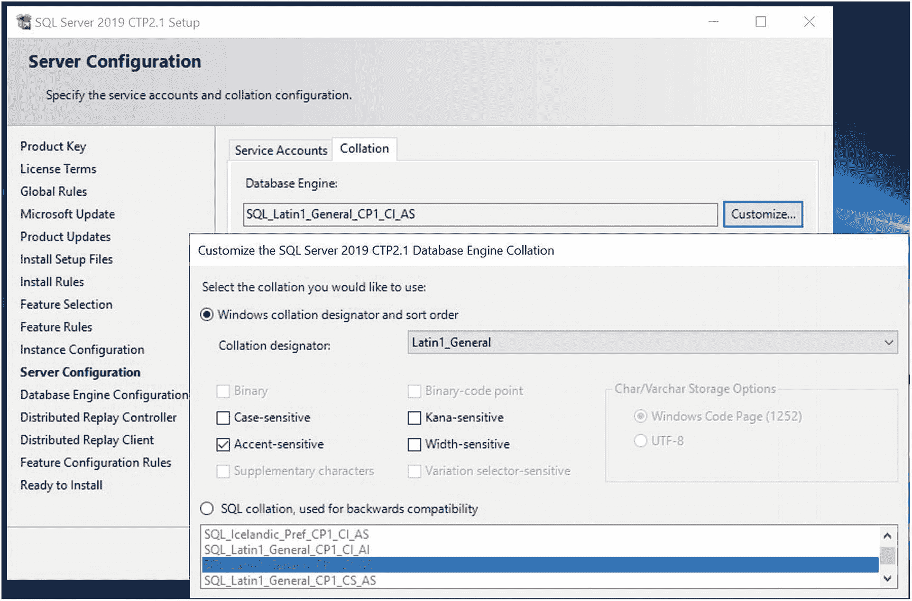

图 2-19：排序规则配置页面

*排序规则*决定了 SQL Server 将如何排序数据，并定义了 SQL Server 在区分重音、假名、宽度和大小写方面的匹配行为。您还可以指定排序和匹配应在二进制或二进制代码点表示上进行。

如果您的排序规则是区分重音的，那么在比较时，SQL Server 不会将 `è` 视为与 `e` 相同的字符；而如果指定了不区分重音，SQL Server 则会将这些字符视为相等。假名敏感性定义日文平假名字符集是否与片假名字符集相等。宽度敏感性定义字符的单字节表示是否与其双字节等价形式相等。

大小写敏感性定义在比较时大写字母是否与其小写等价形式相等。例如，清单 2-1 中的代码将创建并填充一个临时表，然后使用两种不同的排序规则运行相同的查询。

```sql
--创建一个局部临时表
CREATE TABLE #CaseExample
(
    Name        VARCHAR(20)
)
--填充值
INSERT INTO #CaseExample
VALUES('James'), ('james'), ('John'), ('john')
--使用区分大小写的排序规则，计算名称为 James 的条目数
SELECT COUNT(*) AS 'Case Sensitive'
FROM #CaseExample
WHERE Name = 'John' COLLATE Latin1_General_CS_AI
--使用不区分大小写的排序规则，计算名称为 James 的条目数
SELECT COUNT(*) AS 'Case Insensitive'
FROM #CaseExample
WHERE Name = 'John' COLLATE Latin1_General_CI_AI
--删除临时表
DROP TABLE #CaseExample
```

清单 2-1：匹配时区分大小写的效果

从图 2-20 中的结果可以看出，第一个查询只找到了一个 `John`，因为它使用了区分大小写的排序规则；但第二个查询使用了不区分大小写的排序规则，因此匹配到了两个结果。

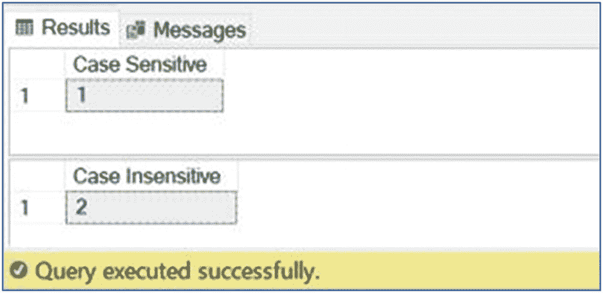

图 2-20：区分大小写示例的结果

尽管各种排序规则敏感性的影响可能相当直接，但一个稍微令人困惑的方面是排序规则如何影响排序顺序。数据肯定只有一种正确的排序方式吧？嗯，这个问题的答案是否定的。数据可以通过多种方式正确排序。例如，虽然一些排序规则按字母顺序排序数据，但其他排序规则可能使用非字母书写系统，例如中文，可以使用一种称为部首和笔画排序的方法进行排序。这个系统会识别共同的字符组成部分，然后按笔画数量排序。清单 2-2 演示了一个排序规则如何影响排序顺序的例子。

```sql
--创建一个临时表
CREATE TABLE #SortOrderExample
(
    Food        VARCHAR(20)
)
--填充表
INSERT INTO #SortOrderExample
VALUES ('Coke'), ('Chips'), ('Crisps'), ('Cake')
--使用 Latin1_General 排序规则选择食物
SELECT Food AS 'Latin1_General collation'
FROM #SortOrderExample
ORDER BY Food
    COLLATE Latin1_General_CI_AI
--使用 Traditional_Spanish 排序规则选择食物
SELECT Food AS 'Traditional_Spanish colation'
FROM #SortOrderExample
ORDER BY Food
    COLLATE Traditional_Spanish_CI_AI
```

清单 2-2：排序规则对排序顺序的影响

图 2-21 中的结果显示，`Chips` 这个值使用两种排序规则排序的结果不同。这是因为在传统西班牙语中，`ch` 被视为一个单独的字符，并且排序在 `cz` 之后。

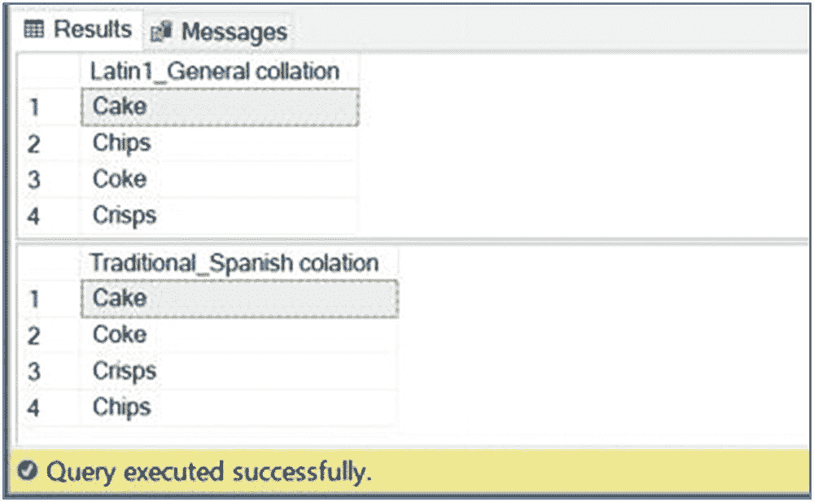

图 2-21：排序顺序示例的结果

有两种类型的二进制排序规则可供选择。较旧样式的二进制排序规则仅出于向后兼容性而包含，并以 `BIN` 后缀标识。如果您选择这种类型的二进制排序规则，那么字符将基于每个字符的位模式进行匹配和排序。如果您选择现代二进制排序规则（以 `BIN2` 后缀标识），那么对于 Unicode 数据，数据将基于 Unicode 代码点进行排序和匹配；对于非 Unicode 数据，则基于相关 ANSI 代码页的代码点进行排序和匹配。清单 2-3 中的示例演示了二进制（`BIN2`）排序规则与区分大小写和不区分大小写排序规则相比的行为。

```sql
CREATE TABLE #CaseExample
(
    Name        VARCHAR(20)
)
--填充值
INSERT INTO #CaseExample
VALUES('James'), ('james'), ('John'), ('john')
--使用区分大小写的排序规则选择所有行
SELECT name as [Case Sensitive]
FROM #CaseExample
Order by Name COLLATE Latin1_General_CS_AI
--使用不区分大小写的排序规则选择所有行
SELECT name as [Case Insensitive]
FROM #CaseExample
Order by Name COLLATE  Latin1_General_CI_AI
SELECT name as [binary]
FROM #CaseExample
Order by Name COLLATE  Latin1_General_BIN2
--删除临时表
DROP TABLE #CaseExample
```

清单 2-3：二进制排序规则的排序顺序

图 2-22 中的结果显示，因为数据是按代码点而非字母顺序排序的，所以以大写字母开头的值排在以小写字母开头的值之前，这与字符的代码点相匹配。

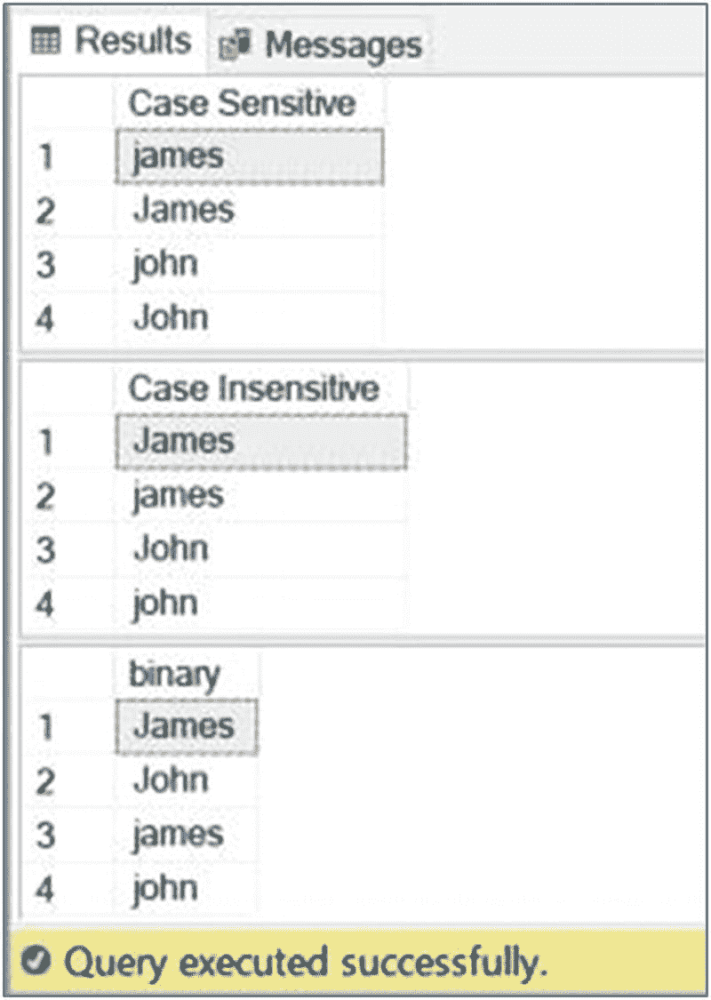

图 2-22：二进制排序规则的排序顺序

排序规则可能具有挑战性，理想情况下，您应在整个企业中保持一致的排序规则。这在当今的全球化组织中并非总是可行，但您应努力做到。在安装实例时，您还应小心选择正确的排序规则。之后更改排序规则可能具有挑战性，因为数据库和表内的列都有自己的排序规则，并且如果其他对象依赖于某个排序规则，则无法更改它。从高层次来看，最坏的情况将涉及以下操作来在日后更改您的排序规则：

1.  重新创建所有数据库。
2.  将所有数据导出到新创建的数据库副本中。
3.  删除原始数据库。
4.  使用所需的排序规则重建 Master 数据库。
5.  重新创建数据库。
6.  从您创建的副本中将数据导回您的数据库。
7.  删除数据库的副本。

除非您有特定的向后兼容性要求，否则应避免使用 SQL 排序规则，而仅使用 Windows 排序规则。使用 Windows 排序规则是最佳实践，因为 SQL 排序规则已被弃用，并且并非所有都与 Windows 排序规则完全兼容。此外，在选择较新的排序规则（如挪威语或波斯尼亚语 _ 拉丁文）时应谨慎。尽管这类新的排序规则系列映射到 Windows Server 2008 或更高版本中的代码页，但它们不映射到较旧操作系统中的代码页。因此，如果您从较旧的操作系统（如 Windows XP）对实例运行 `SELECT *` 查询，代码页将不匹配，并会抛出异常。

#### 注意

本书中的示例，您应该使用 `Latin1_General_CI_AS`。


#### 配置实例安全

设置向导的下一页允许您配置数据库引擎。它由六个选项卡组成。在第一个选项卡中，您可以指定实例的身份验证模式以及实例管理员，如图 2-23 所示。第二个选项卡允许您指定将用作默认数据目录的文件夹，以及用户数据库和 `TempDB` 的特定位置。第三个选项卡提供了 `TempDB` 的配置选项，而第四个选项卡允许您配置实例的最大并行度；第五个选项卡用于配置实例内存设置，最后一个选项卡将允许您配置 `FILESTREAM`。

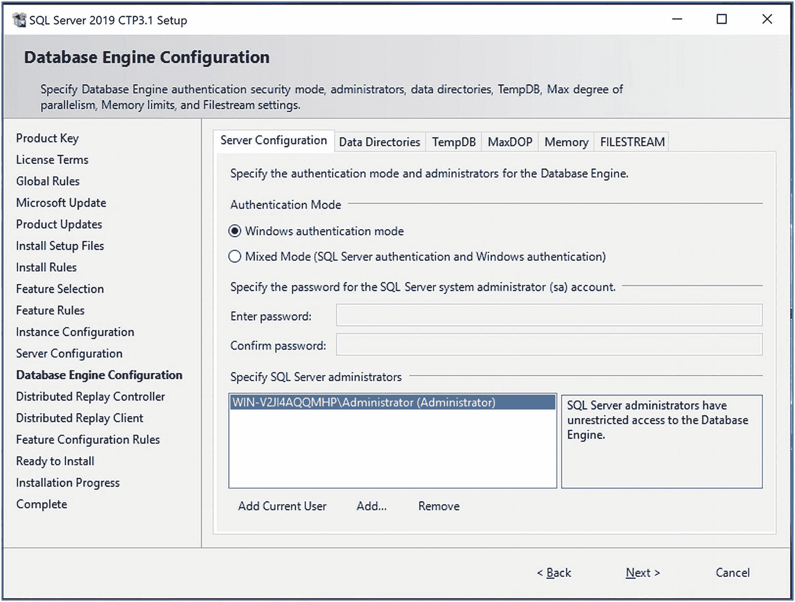

图 2-23：服务器配置选项卡

`Windows 身份验证模式`意味着用户登录 Windows 时提供的凭据将传递给 SQL Server，用户无需任何额外凭据即可访问实例。使用`混合模式`，虽然仍可使用 Windows 凭据访问实例，但也可以为用户设置二级凭据。如果选择了此选项，则 SQL Server 将在实例内部维护自己的用户名和密码，用户可以提供这些信息以获得访问权限，即使他们的 Windows 身份没有权限。

出于安全最佳实践考虑，最好只允许对实例进行 Windows 身份验证。这有两个原因。首先，仅使用 Windows 身份验证时，即使攻击者访问了您的网络，他们仍然无法访问 SQL Server，因为他们没有具有正确权限的有效 Windows 帐户。然而，使用混合模式身份验证，一旦进入网络，攻击者就可以使用暴力攻击或其他黑客方法尝试通过二级用户帐户获得访问权限。其次，如果指定了混合模式身份验证，则需要创建一个 `SA` 帐户。`SA` 帐户是一个 SQL Server 用户帐户，对实例拥有管理权限。如果此帐户的密码泄露，攻击者可能会获得对 SQL Server 的管理控制权。

然而，在某些情况下，混合模式身份验证是必需的。例如，您可能有一个不支持 Windows 身份验证的旧版应用程序，或者一个具有使用二级身份验证的硬编码连接的第三方应用程序。这些可能是需要混合模式身份验证的两个有效理由。另一个有效理由是如果您有用户需要从不受信任的域访问实例。

#### 注意

仅作为例外使用混合模式身份验证，以减少 SQL Server 的安全攻击面。

##### 配置实例

在“服务器配置”选项卡上，您还需要至少输入一个实例管理员。您可以使用“添加当前用户”按钮添加当前的 Windows 安全上下文，或使用“添加”按钮搜索 Windows 安全主体（如用户或组）。理想情况下，您应该选择一个包含所有需要实例管理访问权限的 DBA 的 Windows 组，因为这可以简化安全性。

数据库引擎配置页面的“数据目录”选项卡如图 2-24 所示。

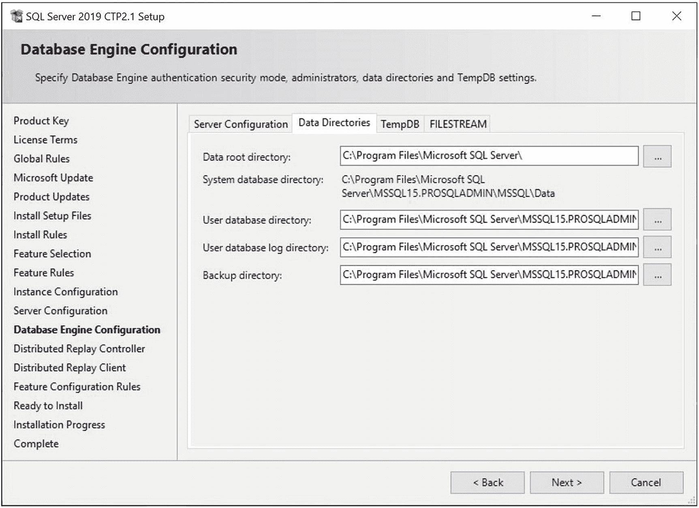

图 2-24：数据目录选项卡

“数据目录”选项卡允许您更改数据根目录的默认位置。在此屏幕上，您还可以更改用户数据库及其日志文件的默认位置，并指定 `TempDB` 数据和日志文件的创建位置。正如您可能从第 1 章回忆起的，这一点尤其重要，因为您可能希望将用户数据文件与其日志以及 `TempDB` 分开存放。最后，此选项卡允许您指定将来创建的数据库备份的默认位置。

`TempDB` 选项卡（图 2-25）允许您配置 `TempDB` 的文件选项。`TempDB` 所需的文件数量很重要，因为文件过少可能导致系统页面（如 `GAM`（全局分配映射）和 `SGAM`（共享全局分配映射））上的争用。最佳文件数可以使用以下公式计算：
```
SMALLEST(逻辑核心数, 8)
```
如果您的服务器启用了超线程，则逻辑核心数将是物理核心数乘以二。在 VMWare 上，逻辑核心数将等于虚拟核心数。

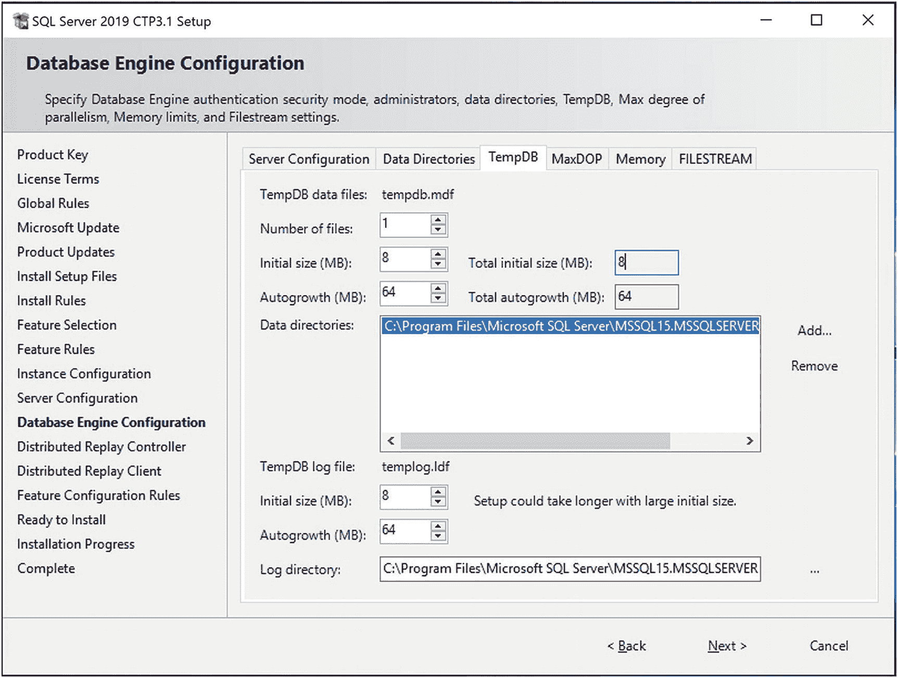

图 2-25：TempDB 选项卡

在考虑文件的初始大小时，我通常遵循以下规则：
```
SUM(所有用户数据库的数据文件大小) / 3
```
适用于繁忙的 `OLTP` 系统，但这将根据您的要求和用户数据库的工作负载情况而有所不同。

向导的 `MaxDOP` 选项卡（如图 2-26 所示）允许您配置任何单个查询可以使用的最大 CPU 核心数。安装程序会计算一个默认推荐值，但您可以根据需要覆盖此值。有关如何配置 `MaxDOP` 的详细讨论，请参阅本书第 5 章。

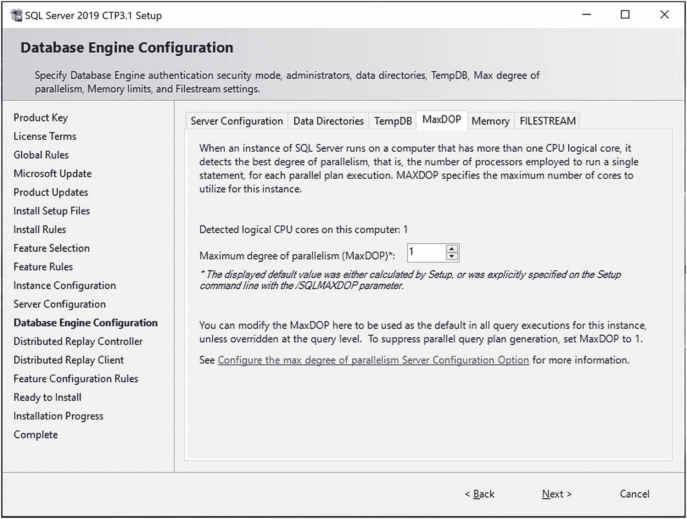

图 2-26：MaxDOP 选项卡

图 2-27 展示了“内存”选项卡。在这里，您可以指定是使用可分配给实例的最小和最大内存量的默认配置，使用安装向导计算的建议值，还是指定您自己的值。要指定您自己首选的值，请选择“建议”选项，输入您的值，并勾选“单击此处以接受 SQL Server 数据库引擎的推荐内存配置”复选框。如果您希望遵循安装程序的建议，也必须使用此复选框。有关如何为数据库引擎最佳配置最小和最大内存设置的详细讨论，请参阅本书第 5 章。

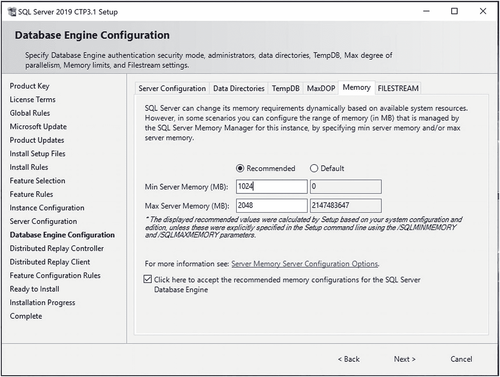

图 2-27：内存选项卡


### SQL Server 安装配置

### FILESTREAM 配置

数据库引擎配置的 **FILESTREAM** 选项卡允许您启用和配置 SQL Server **FILESTREAM** 功能的访问级别，如图 2-28 所示。如果您希望使用 SQL Server 的 **FileTable** 功能，则也必须启用 **FILESTREAM**。**FILESTREAM** 和 **FileTable** 提供了在 Windows 文件夹结构中以非结构化方式存储数据的能力，同时保留了从 SQL Server 管理和查询这些数据的能力。

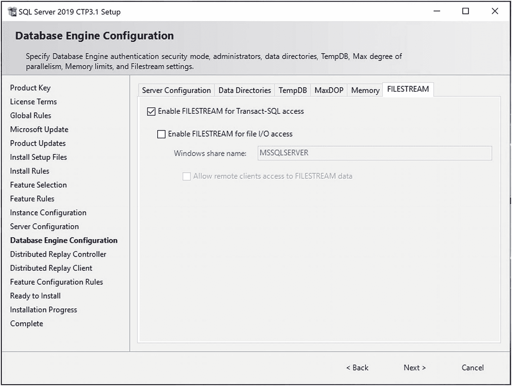

图 2-28 FILESTREAM 选项卡

选择“为 Transact-SQL 访问启用 FILESTREAM”将启用 **FILESTREAM**，但数据只能从 SQL Server 内部访问。此外，选择“为文件 I/O 访问启用 FILESTREAM”使应用程序能够直接从操作系统访问数据，绕过 SQL Server。如果选择此选项，则还需要提供一个预先存在的文件共享的名称，该共享将用于直接应用程序访问。“允许远程客户端访问 FILESTREAM 数据”选项使数据可供远程应用程序使用。这三个选项是逐层构建的，例如，如果不先选择“为 Transact-SQL 访问启用 FILESTREAM”，就不可能选择“为文件 I/O 访问启用 FILESTREAM”。**FILESTREAM** 和 **FileTable** 将在第 6 章进一步讨论。

### 配置分布式重放

如图 2-29 所示，向导的下一页将提示您指定将被授予访问 **Distributed Replay Controller** 服务的用户。与授予实例管理权限的方式相同，您可以使用“添加当前用户”按钮添加您当前的安全上下文，也可以使用“添加”按钮浏览 Windows 用户和组。

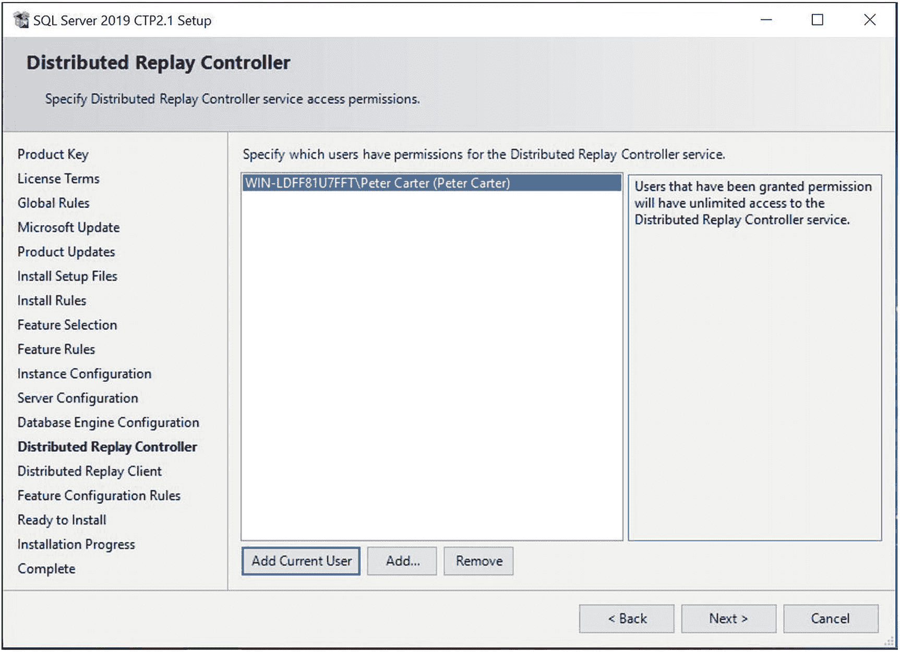

图 2-29 Distributed Replay Controller 页面

在向导的下一页，您可以配置 **Distributed Replay** 客户端，如图 2-30 所示。“工作目录”是客户端上保存调度文件的文件夹。“结果目录”是客户端上保存跟踪文件的文件夹。每次运行跟踪时，这两个位置中的文件都将被覆盖。如果您有已配置的现有 **Distributed Replay Controller**，则应在“控制器名称”字段中输入其名称。但是，如果您正在配置一个新的控制器，则该字段应留空，稍后在 `DReplayClient.config` 配置文件中进行修改。**Distributed Replay** 的配置和使用将在第 21 章讨论。

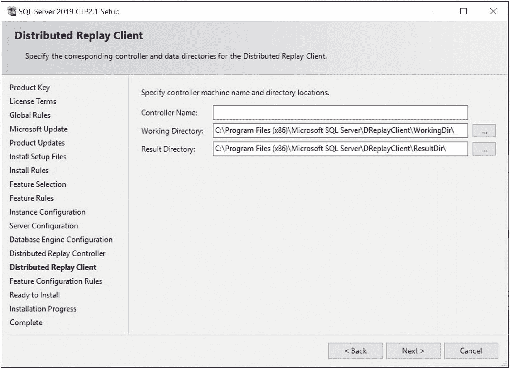

图 2-30 Distributed Replay Client 页面

### 完成安装

向导的“准备安装”页面是安装开始前的最后一页，如图 2-31 所示。此屏幕提供了将要安装的功能摘要，但此页面最有趣的部分可能是“配置文件路径”部分。它提供了一个配置文件的路径，您可以重用该文件来安装具有相同配置的更多实例。配置文件将在第 3 章进一步讨论。

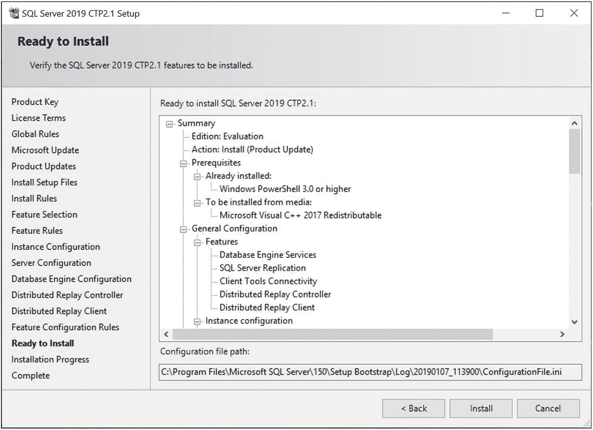

图 2-31 准备安装页面

安装向导将在安装过程中显示进度条。安装完成后，将显示一个摘要屏幕，如图 2-32 所示。您应检查以确保每个正在安装的组件状态均为“成功”。至此，SQL Server 安装完成。

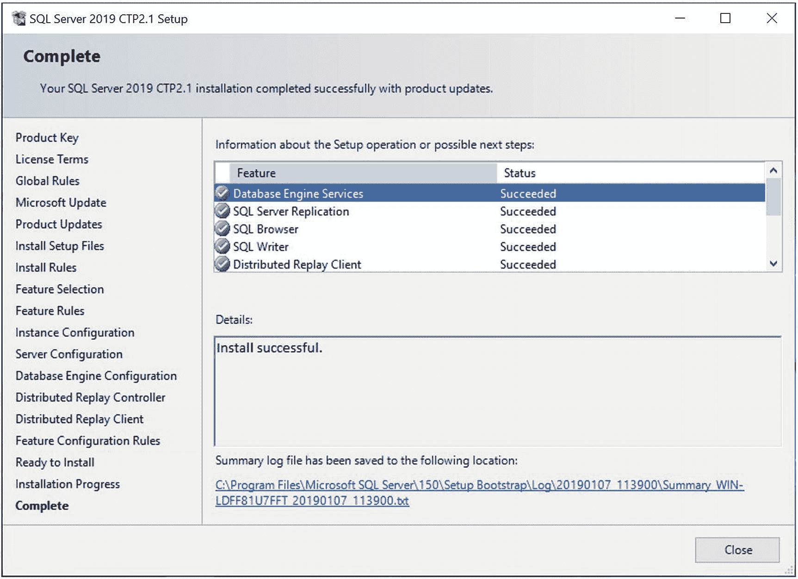

图 2-32 完成页面

### 总结

SQL Server 的安装中心提供了许多有用的工具和链接，用于指导和协助您的安装过程。您可以使用安装中心安装故障转移群集实例以及独立的 SQL Server 实例。还有一些工具可帮助满足高级安装要求，例如 SQL Server 的准备映像以及基于配置文件的安装。

除了使用 SQL Server 2019 安装向导安装数据库引擎实例外，您还可以使用同一工具安装 BI 和 ETL 套件中的工具，例如 **Analysis Services**、**Integration Services**、**Data Quality Services** 和 **Master Data Services**。如果您使用向导安装 **Analysis Services**，则可以使用多维模型或表模型配置该工具。

虽然您可以使用默认值成功安装 SQL Server，但为了您的实例乃至您整个环境的长期可维护性，请务必考虑安装的诸多方面。这尤其适用于排序规则、服务帐户和其他安全注意事项，例如添加最合适的管理员组以及实施身份验证模型。

